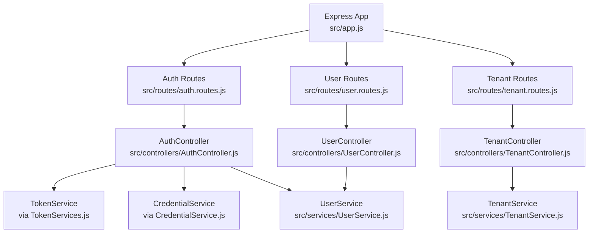
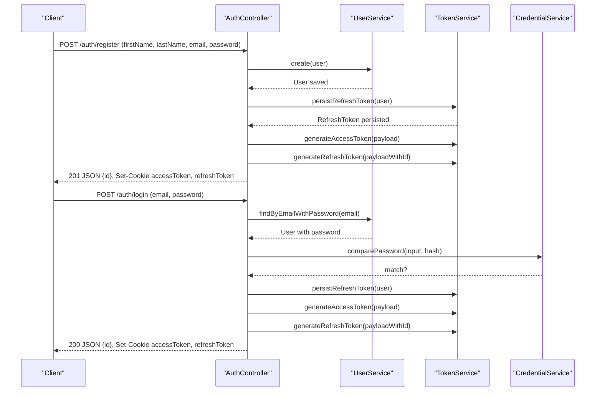
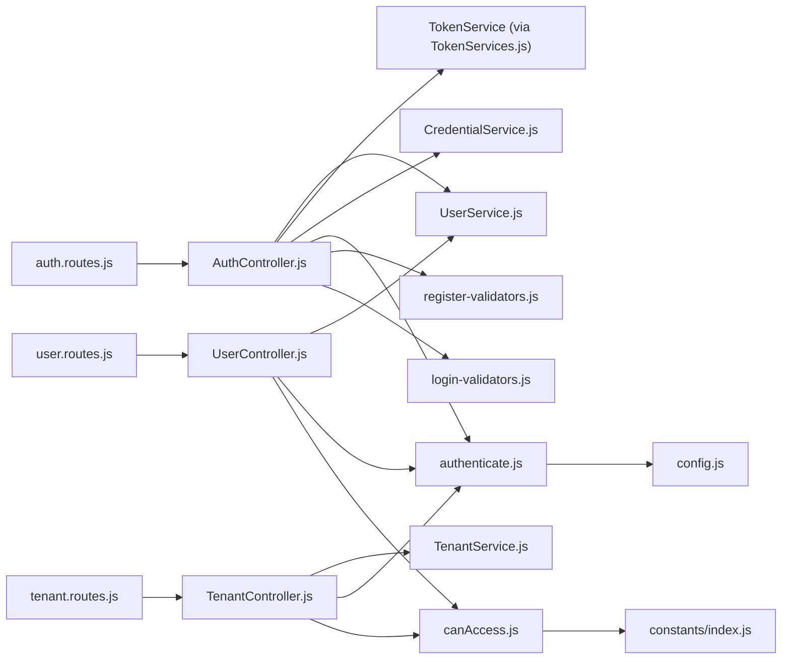

# API Reference

<cite>
**Referenced Files in This Document**
- [src/app.js](file://src/app.js)
- [src/routes/auth.routes.js](file://src/routes/auth.routes.js)
- [src/routes/tenant.routes.js](file://src/routes/tenant.routes.js)
- [src/routes/user.routes.js](file://src/routes/user.routes.js)
- [src/controllers/AuthController.js](file://src/controllers/AuthController.js)
- [src/controllers/TenantController.js](file://src/controllers/TenantController.js)
- [src/controllers/UserController.js](file://src/controllers/UserController.js)
- [src/middleware/authenticate.js](file://src/middleware/authenticate.js)
- [src/middleware/canAccess.js](file://src/middleware/canAccess.js)
- [src/validators/register-validators.js](file://src/validators/register-validators.js)
- [src/validators/login-validators.js](file://src/validators/login-validators.js)
- [src/constants/index.js](file://src/constants/index.js)
- [src/entity/User.js](file://src/entity/User.js)
- [src/entity/Tenants.js](file://src/entity/Tenants.js)
- [src/services/UserService.js](file://src/services/UserService.js)
- [src/services/TenantService.js](file://src/services/TenantService.js)
</cite>

## Table of Contents
1. [Introduction](#introduction)
2. [Project Structure](#project-structure)
3. [Core Components](#core-components)
4. [Architecture Overview](#architecture-overview)
5. [Detailed Component Analysis](#detailed-component-analysis)
6. [Dependency Analysis](#dependency-analysis)
7. [Performance Considerations](#performance-considerations)
8. [Troubleshooting Guide](#troubleshooting-guide)
9. [Conclusion](#conclusion)
10. [Appendices](#appendices)

## Introduction
This document provides comprehensive API documentation for the Authentication Service. It covers:
- Authentication endpoints: registration, login, token refresh, logout, and self-profile retrieval
- Tenant management endpoints: listing, creating, retrieving, updating, and deleting tenants
- User management endpoints: listing, creating, retrieving, updating, and deleting users
- Request/response schemas, authentication requirements, headers, cookies, error codes, and practical curl examples
- Rate limiting, pagination/filtering, and API versioning considerations

## Project Structure
The API is organized under three route groups:
- Authentication: /auth/*
- Tenants: /tenants/*
- Users: /users/*

**Diagram sources**
- [src/app.js:19-21](file://src/app.js#L19-L21)
- [src/routes/auth.routes.js:22-27](file://src/routes/auth.routes.js#L22-L27)
- [src/routes/tenant.routes.js:14](file://src/routes/tenant.routes.js#L14)
- [src/routes/user.routes.js:13](file://src/routes/user.routes.js#L13)

**Section sources**
- [src/app.js:19-21](file://src/app.js#L19-L21)

## Core Components
- Authentication controller handles registration, login, refresh, logout, and self-profile retrieval
- Tenant controller manages tenant creation, listing, retrieval, updates, and deletion
- User controller manages user creation, listing, retrieval, updates, and deletion
- Middleware enforces JWT-based authentication and role-based access control
- Validators enforce request schemas for registration and login
- Services encapsulate persistence logic for users and tenants
- Entities define the data model for users and tenants

**Section sources**
- [src/controllers/AuthController.js:5-16](file://src/controllers/AuthController.js#L5-L16)
- [src/controllers/TenantController.js:3-9](file://src/controllers/TenantController.js#L3-L9)
- [src/controllers/UserController.js:4-11](file://src/controllers/UserController.js#L4-L11)
- [src/middleware/authenticate.js:6-25](file://src/middleware/authenticate.js#L6-L25)
- [src/middleware/canAccess.js:4-22](file://src/middleware/canAccess.js#L4-L22)
- [src/validators/register-validators.js:3-46](file://src/validators/register-validators.js#L3-L46)
- [src/validators/login-validators.js:3-24](file://src/validators/login-validators.js#L3-L24)
- [src/services/UserService.js:3-6](file://src/services/UserService.js#L3-L6)
- [src/services/TenantService.js:3-6](file://src/services/TenantService.js#L3-L6)
- [src/entity/User.js:3-49](file://src/entity/User.js#L3-L49)
- [src/entity/Tenants.js:3-28](file://src/entity/Tenants.js#L3-L28)

## Architecture Overview
High-level flow for authentication endpoints:
- Registration validates input, creates a user, persists a refresh token, generates access and refresh tokens, and sets cookies
- Login validates credentials, generates tokens, and sets cookies
- Refresh rotates tokens and deletes the old refresh token
- Logout deletes the refresh token and clears cookies

**Diagram sources**
- [src/controllers/AuthController.js:19-70](file://src/controllers/AuthController.js#L19-L70)
- [src/controllers/AuthController.js:72-136](file://src/controllers/AuthController.js#L72-L136)
- [src/services/UserService.js:7-38](file://src/services/UserService.js#L7-L38)
- [src/services/UserService.js:48-54](file://src/services/UserService.js#L48-L54)
- [src/controllers/AuthController.js:143-192](file://src/controllers/AuthController.js#L143-L192)
- [src/controllers/AuthController.js:194-210](file://src/controllers/AuthController.js#L194-L210)

## Detailed Component Analysis

### Authentication Endpoints

#### POST /auth/register
- Description: Registers a new user with provided credentials
- Authentication: Not required
- Request headers:
  - Content-Type: application/json
- Request body (JSON):
  - firstName: string (required, 2–50 chars)
  - lastName: string (required, 2–50 chars)
  - email: string (required, valid email)
  - password: string (required, minimum 8 chars)
- Response:
  - 201 Created: { id: number }
  - 400 Bad Request: Validation errors array
  - 500 Internal Server Error: Generic error
- Cookies set:
  - accessToken: httpOnly, sameSite=strict, maxAge configured
  - refreshToken: httpOnly, sameSite=strict, maxAge configured
- curl example:
  - curl -X POST https://localhost:8080/auth/register -H "Content-Type: application/json" -d '{"firstName":"John","lastName":"Doe","email":"john@example.com","password":"securePass123"}'
- Notes:
  - On success, cookies are set for session management

**Section sources**
- [src/routes/auth.routes.js:29-31](file://src/routes/auth.routes.js#L29-L31)
- [src/validators/register-validators.js:3-46](file://src/validators/register-validators.js#L3-L46)
- [src/controllers/AuthController.js:19-70](file://src/controllers/AuthController.js#L19-L70)

#### POST /auth/login
- Description: Logs in an existing user
- Authentication: Not required
- Request headers:
  - Content-Type: application/json
- Request body (JSON):
  - email: string (required, valid email)
  - password: string (required, minimum 8 chars)
- Response:
  - 200 OK: { id: number }
  - 400 Bad Request: Error indicating invalid credentials
  - 500 Internal Server Error: Generic error
- Cookies set:
  - accessToken: httpOnly, sameSite=strict, maxAge configured
  - refreshToken: httpOnly, sameSite=strict, maxAge configured
- curl example:
  - curl -X POST https://localhost:8080/auth/login -H "Content-Type: application/json" -d '{"email":"john@example.com","password":"securePass123"}'

**Section sources**
- [src/routes/auth.routes.js:33-35](file://src/routes/auth.routes.js#L33-L35)
- [src/validators/login-validators.js:3-24](file://src/validators/login-validators.js#L3-L24)
- [src/controllers/AuthController.js:72-136](file://src/controllers/AuthController.js#L72-L136)

#### GET /auth/self
- Description: Retrieves the authenticated user’s profile
- Authentication: Required (JWT via Authorization header or accessToken cookie)
- Request headers:
  - Authorization: Bearer <access_token>
  - OR Cookie: accessToken=<token>
- Response:
  - 200 OK: Full user object (fields depend on entity schema)
  - 401 Unauthorized: Invalid or missing token
- curl example:
  - curl -H "Authorization: Bearer YOUR_ACCESS_TOKEN" https://localhost:8080/auth/self

**Section sources**
- [src/routes/auth.routes.js:37-39](file://src/routes/auth.routes.js#L37-L39)
- [src/middleware/authenticate.js:6-25](file://src/middleware/authenticate.js#L6-L25)
- [src/controllers/AuthController.js:138-141](file://src/controllers/AuthController.js#L138-L141)

#### POST /auth/refresh
- Description: Rotates access and refresh tokens
- Authentication: Required (validated refresh token)
- Request headers:
  - Authorization: Bearer <refresh_token>
  - OR Cookie: refreshToken=<token>
- Response:
  - 200 OK: { id: number }
  - 400 Bad Request: Error if user not found for token
  - 500 Internal Server Error: Generic error
- Cookies set:
  - accessToken: httpOnly, sameSite=strict, maxAge configured
  - refreshToken: httpOnly, sameSite=strict, maxAge configured
- curl example:
  - curl -X POST https://localhost:8080/auth/refresh -H "Authorization: Bearer YOUR_REFRESH_TOKEN"

**Section sources**
- [src/routes/auth.routes.js:41-43](file://src/routes/auth.routes.js#L41-L43)
- [src/middleware/authenticate.js:6-25](file://src/middleware/authenticate.js#L6-L25)
- [src/controllers/AuthController.js:143-192](file://src/controllers/AuthController.js#L143-L192)

#### POST /auth/logout
- Description: Invalidates the refresh token and clears cookies
- Authentication: Required (JWT via Authorization header or accessToken cookie)
- Request headers:
  - Authorization: Bearer <access_token>
  - OR Cookie: accessToken=<token>
- Response:
  - 200 OK: { message: "user logout successfully" }
  - 500 Internal Server Error: Generic error
- curl example:
  - curl -X POST https://localhost:8080/auth/logout -H "Authorization: Bearer YOUR_ACCESS_TOKEN"

**Section sources**
- [src/routes/auth.routes.js:44-46](file://src/routes/auth.routes.js#L44-L46)
- [src/middleware/authenticate.js:6-25](file://src/middleware/authenticate.js#L6-L25)
- [src/controllers/AuthController.js:194-210](file://src/controllers/AuthController.js#L194-L210)

### Tenant Management Endpoints

#### GET /tenants/
- Description: Lists all tenants
- Authentication: Not required
- Response:
  - 200 OK: { tenants: [ { id: number }, ... ] }
  - 500 Internal Server Error: Generic error
- curl example:
  - curl https://localhost:8080/tenants/

**Section sources**
- [src/routes/tenant.routes.js:23-25](file://src/routes/tenant.routes.js#L23-L25)
- [src/controllers/TenantController.js:24-32](file://src/controllers/TenantController.js#L24-L32)
- [src/services/TenantService.js:16-22](file://src/services/TenantService.js#L16-L22)

#### POST /tenants/
- Description: Creates a new tenant
- Authentication: Required (JWT)
- Authorization: Role-based access control (ADMIN required)
- Request headers:
  - Authorization: Bearer <access_token>
  - Content-Type: application/json
- Request body (JSON):
  - name: string (required)
  - address: string (required)
- Response:
  - 201 Created: { id: number }
  - 403 Forbidden: Access denied if not ADMIN
  - 500 Internal Server Error: Generic error
- curl example:
  - curl -X POST https://localhost:8080/tenants/ -H "Authorization: Bearer YOUR_ACCESS_TOKEN" -H "Content-Type: application/json" -d '{"name":"Acme Corp","address":"123 Main St"}'

**Section sources**
- [src/routes/tenant.routes.js:16-21](file://src/routes/tenant.routes.js#L16-L21)
- [src/middleware/canAccess.js:4-22](file://src/middleware/canAccess.js#L4-L22)
- [src/constants/index.js:1-5](file://src/constants/index.js#L1-L5)
- [src/controllers/TenantController.js:11-22](file://src/controllers/TenantController.js#L11-L22)
- [src/services/TenantService.js:7-14](file://src/services/TenantService.js#L7-L14)

#### GET /tenants/tenants/:id
- Description: Retrieves a tenant by ID
- Authentication: Not required
- Path parameters:
  - id: number (required)
- Response:
  - 200 OK: { id: number }
  - 404 Not Found: Tenant not found
  - 500 Internal Server Error: Generic error
- curl example:
  - curl https://localhost:8080/tenants/tenants/1

**Section sources**
- [src/routes/tenant.routes.js:26-28](file://src/routes/tenant.routes.js#L26-L28)
- [src/controllers/TenantController.js:34-48](file://src/controllers/TenantController.js#L34-L48)
- [src/services/TenantService.js:25-32](file://src/services/TenantService.js#L25-L32)

#### POST /tenants/tenants/:id
- Description: Updates a tenant by ID
- Authentication: Required (JWT)
- Authorization: Role-based access control (ADMIN required)
- Path parameters:
  - id: number (required)
- Request headers:
  - Authorization: Bearer <access_token>
  - Content-Type: application/json
- Request body (JSON):
  - name: string (optional)
  - address: string (optional)
- Response:
  - 200 OK: { id: number }
  - 403 Forbidden: Access denied if not ADMIN
  - 500 Internal Server Error: Generic error
- curl example:
  - curl -X POST https://localhost:8080/tenants/tenants/1 -H "Authorization: Bearer YOUR_ACCESS_TOKEN" -H "Content-Type: application/json" -d '{"name":"Updated Corp"}'

**Section sources**
- [src/routes/tenant.routes.js:30-35](file://src/routes/tenant.routes.js#L30-L35)
- [src/middleware/canAccess.js:4-22](file://src/middleware/canAccess.js#L4-L22)
- [src/constants/index.js:1-5](file://src/constants/index.js#L1-L5)
- [src/controllers/TenantController.js:50-63](file://src/controllers/TenantController.js#L50-L63)
- [src/services/TenantService.js:34-50](file://src/services/TenantService.js#L34-L50)

#### DELETE /tenants/tenants/:id
- Description: Deletes a tenant by ID
- Authentication: Required (JWT)
- Authorization: Role-based access control (ADMIN required)
- Path parameters:
  - id: number (required)
- Response:
  - 200 OK: {}
  - 403 Forbidden: Access denied if not ADMIN
  - 500 Internal Server Error: Generic error
- curl example:
  - curl -X DELETE https://localhost:8080/tenants/tenants/1 -H "Authorization: Bearer YOUR_ACCESS_TOKEN"

**Section sources**
- [src/routes/tenant.routes.js:37-42](file://src/routes/tenant.routes.js#L37-L42)
- [src/middleware/canAccess.js:4-22](file://src/middleware/canAccess.js#L4-L22)
- [src/constants/index.js:1-5](file://src/constants/index.js#L1-L5)
- [src/controllers/TenantController.js:65-74](file://src/controllers/TenantController.js#L65-L74)
- [src/services/TenantService.js:52-64](file://src/services/TenantService.js#L52-L64)

### User Management Endpoints

#### GET /users/
- Description: Lists all users
- Authentication: Required (JWT)
- Authorization: Role-based access control (ADMIN required)
- Response:
  - 200 OK: { users: [ { id: number, ... }, ... ] }
  - 403 Forbidden: Access denied if not ADMIN
  - 404 Not Found: No users found
  - 500 Internal Server Error: Generic error
- curl example:
  - curl https://localhost:8080/users/ -H "Authorization: Bearer YOUR_ACCESS_TOKEN"

**Section sources**
- [src/routes/user.routes.js:18-20](file://src/routes/user.routes.js#L18-L20)
- [src/middleware/canAccess.js:4-22](file://src/middleware/canAccess.js#L4-L22)
- [src/constants/index.js:1-5](file://src/constants/index.js#L1-L5)
- [src/controllers/UserController.js:30-42](file://src/controllers/UserController.js#L30-L42)
- [src/services/UserService.js:64-66](file://src/services/UserService.js#L64-L66)

#### POST /users/
- Description: Creates a new user
- Authentication: Required (JWT)
- Authorization: Role-based access control (ADMIN required)
- Request headers:
  - Authorization: Bearer <access_token>
  - Content-Type: application/json
- Request body (JSON):
  - firstName: string (required)
  - lastName: string (required)
  - email: string (required, valid email)
  - password: string (required, minimum 8 chars)
  - role: string (required)
  - tenantId: number (optional)
- Response:
  - 201 Created: { id: number }
  - 403 Forbidden: Access denied if not ADMIN
  - 500 Internal Server Error: Generic error
- curl example:
  - curl -X POST https://localhost:8080/users/ -H "Authorization: Bearer YOUR_ACCESS_TOKEN" -H "Content-Type: application/json" -d '{"firstName":"Jane","lastName":"Smith","email":"jane@example.com","password":"anotherPass456","role":"customer","tenantId":1}'

**Section sources**
- [src/routes/user.routes.js:15-17](file://src/routes/user.routes.js#L15-L17)
- [src/middleware/canAccess.js:4-22](file://src/middleware/canAccess.js#L4-L22)
- [src/constants/index.js:1-5](file://src/constants/index.js#L1-L5)
- [src/controllers/UserController.js:12-28](file://src/controllers/UserController.js#L12-L28)
- [src/services/UserService.js:7-38](file://src/services/UserService.js#L7-L38)

#### GET /users/:id
- Description: Retrieves a user by ID
- Authentication: Required (JWT)
- Path parameters:
  - id: number (required)
- Response:
  - 200 OK: { id: number }
  - 401 Unauthorized: Invalid token or user not found
  - 500 Internal Server Error: Generic error
- curl example:
  - curl https://localhost:8080/users/1 -H "Authorization: Bearer YOUR_ACCESS_TOKEN"

**Section sources**
- [src/routes/user.routes.js:21-23](file://src/routes/user.routes.js#L21-L23)
- [src/controllers/UserController.js:43-52](file://src/controllers/UserController.js#L43-L52)
- [src/services/UserService.js:56-62](file://src/services/UserService.js#L56-L62)

#### PATCH /users/:id
- Description: Updates a user by ID
- Authentication: Required (JWT)
- Authorization: Role-based access control (ADMIN required)
- Path parameters:
  - id: number (required)
- Request headers:
  - Authorization: Bearer <access_token>
  - Content-Type: application/json
- Request body (JSON):
  - firstName: string (optional)
  - lastName: string (optional)
  - email: string (optional, valid email)
  - role: string (optional)
  - tenantId: number (optional)
- Response:
  - 201 OK: { id: number }
  - 400 Bad Request: Validation errors array
  - 403 Forbidden: Access denied if not ADMIN
  - 500 Internal Server Error: Generic error
- curl example:
  - curl -X PATCH https://localhost:8080/users/1 -H "Authorization: Bearer YOUR_ACCESS_TOKEN" -H "Content-Type: application/json" -d '{"role":"admin"}'

**Section sources**
- [src/routes/user.routes.js:24-29](file://src/routes/user.routes.js#L24-L29)
- [src/middleware/canAccess.js:4-22](file://src/middleware/canAccess.js#L4-L22)
- [src/constants/index.js:1-5](file://src/constants/index.js#L1-L5)
- [src/controllers/UserController.js:54-77](file://src/controllers/UserController.js#L54-L77)
- [src/validators/register-validators.js:3-46](file://src/validators/register-validators.js#L3-L46)
- [src/services/UserService.js:68-84](file://src/services/UserService.js#L68-L84)

#### DELETE /users/:id
- Description: Deletes a user by ID
- Authentication: Required (JWT)
- Authorization: Role-based access control (ADMIN required)
- Path parameters:
  - id: number (required)
- Response:
  - 201 OK: { id: number }
  - 403 Forbidden: Access denied if not ADMIN
  - 500 Internal Server Error: Generic error
- curl example:
  - curl -X DELETE https://localhost:8080/users/1 -H "Authorization: Bearer YOUR_ACCESS_TOKEN"

**Section sources**
- [src/routes/user.routes.js:30-35](file://src/routes/user.routes.js#L30-L35)
- [src/middleware/canAccess.js:4-22](file://src/middleware/canAccess.js#L4-L22)
- [src/constants/index.js:1-5](file://src/constants/index.js#L1-L5)
- [src/controllers/UserController.js:79-94](file://src/controllers/UserController.js#L79-L94)
- [src/services/UserService.js:56-62](file://src/services/UserService.js#L56-L62)

### Data Models

#### User Entity
- Fields:
  - id: integer (primary key)
  - firstName: string
  - lastName: string
  - email: string (unique)
  - password: string (not selectable in queries)
  - role: string
  - tenantId: integer (nullable)
- Relations:
  - One-to-many with RefreshToken via refreshTokens
  - Many-to-one with Tenant via tenantId

**Section sources**
- [src/entity/User.js:3-49](file://src/entity/User.js#L3-L49)

#### Tenant Entity
- Fields:
  - id: integer (primary key)
  - name: string (length 100)
  - address: string (length 255)
- Relations:
  - One-to-many with User via users

**Section sources**
- [src/entity/Tenants.js:3-28](file://src/entity/Tenants.js#L3-L28)

## Dependency Analysis
- Route modules depend on controllers
- Controllers depend on services and middleware
- Services depend on repositories and external libraries (bcrypt, jwks-rsa)
- Middleware depends on configuration and constants

**Diagram sources**
- [src/routes/auth.routes.js:22-27](file://src/routes/auth.routes.js#L22-L27)
- [src/routes/tenant.routes.js:14](file://src/routes/tenant.routes.js#L14)
- [src/routes/user.routes.js:13](file://src/routes/user.routes.js#L13)
- [src/controllers/AuthController.js:11-16](file://src/controllers/AuthController.js#L11-L16)
- [src/controllers/TenantController.js:6-9](file://src/controllers/TenantController.js#L6-L9)
- [src/controllers/UserController.js:8-11](file://src/controllers/UserController.js#L8-L11)
- [src/middleware/authenticate.js:7-12](file://src/middleware/authenticate.js#L7-L12)
- [src/middleware/canAccess.js:7](file://src/middleware/canAccess.js#L7)
- [src/validators/register-validators.js:1](file://src/validators/register-validators.js#L1)
- [src/validators/login-validators.js:1](file://src/validators/login-validators.js#L1)
- [src/constants/index.js:1-5](file://src/constants/index.js#L1-L5)

**Section sources**
- [src/app.js:19-21](file://src/app.js#L19-L21)

## Performance Considerations
- Token generation and refresh involve cryptographic operations; ensure adequate CPU resources
- Password hashing uses bcrypt; tune salt rounds for desired security/performance balance
- Use pagination and filtering for large datasets (users/tenants) when extending endpoints
- Consider connection pooling and caching for frequent reads

## Troubleshooting Guide
- Authentication failures:
  - Ensure Authorization header is present or accessToken cookie is set
  - Verify token signature against JWKS URI and algorithm RS256
- Role-based access denied:
  - Confirm user role matches ADMIN for protected endpoints
- Validation errors:
  - Check request body against validator rules for registration and login
- Database errors:
  - Inspect service-level error propagation and logging

**Section sources**
- [src/middleware/authenticate.js:6-25](file://src/middleware/authenticate.js#L6-L25)
- [src/middleware/canAccess.js:4-22](file://src/middleware/canAccess.js#L4-L22)
- [src/validators/register-validators.js:3-46](file://src/validators/register-validators.js#L3-L46)
- [src/validators/login-validators.js:3-24](file://src/validators/login-validators.js#L3-L24)
- [src/app.js:24-37](file://src/app.js#L24-L37)

## Conclusion
This API provides robust authentication and tenant/user management capabilities with clear separation of concerns, middleware-driven security, and explicit request/response schemas. Extend endpoints with pagination and filtering as your application grows, and maintain strict adherence to role-based access control for administrative operations.

## Appendices

### Request/Response Schemas Summary

- Authentication
  - POST /auth/register
    - Request: { firstName, lastName, email, password }
    - Response: 201 { id }, Cookies: accessToken, refreshToken
  - POST /auth/login
    - Request: { email, password }
    - Response: 200 { id }, Cookies: accessToken, refreshToken
  - GET /auth/self
    - Response: 200 User object
  - POST /auth/refresh
    - Response: 200 { id }, Cookies: accessToken, refreshToken
  - POST /auth/logout
    - Response: 200 { message }

- Tenants
  - GET /tenants/
    - Response: 200 { tenants: [...] }
  - POST /tenants/
    - Request: { name, address }
    - Response: 201 { id }
  - GET /tenants/tenants/:id
    - Response: 200 { id }
  - POST /tenants/tenants/:id
    - Request: { name?, address? }
    - Response: 200 { id }
  - DELETE /tenants/tenants/:id
    - Response: 200 {}

- Users
  - GET /users/
    - Response: 200 { users: [...] }
  - POST /users/
    - Request: { firstName, lastName, email, password, role, tenantId? }
    - Response: 201 { id }
  - GET /users/:id
    - Response: 200 { id }
  - PATCH /users/:id
    - Request: { firstName?, lastName?, email?, role?, tenantId? }
    - Response: 201 { id }
  - DELETE /users/:id
    - Response: 201 { id }

### Headers and Authentication
- Authorization: Bearer <token>
- Content-Type: application/json
- Cookies: accessToken, refreshToken (httpOnly, sameSite=strict)

### Error Codes
- 200: Successful operation
- 201: Resource created
- 400: Validation or bad request
- 401: Unauthorized
- 403: Forbidden
- 404: Not found
- 500: Internal server error

### Rate Limiting, Pagination, Filtering, Versioning
- Rate limiting: Enabled for JWKS retrieval in authentication middleware
- Pagination/Filtering: Not implemented in current routes; add query parameters as needed
- Versioning: Not implemented; consider path-based versioning (/v1/auth, /v1/users)