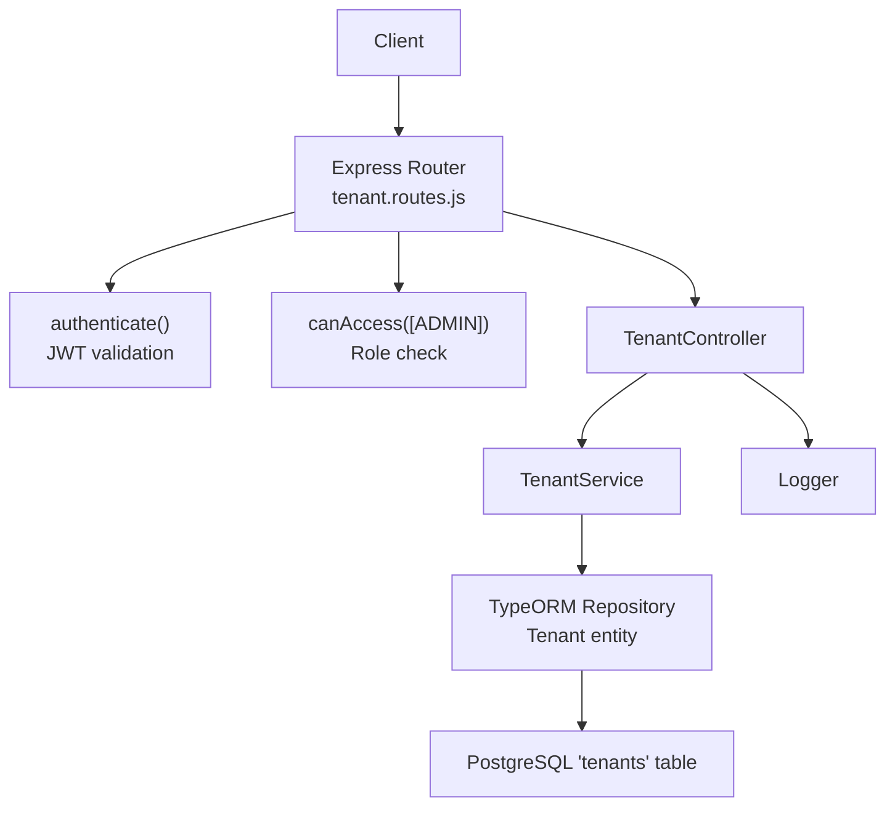
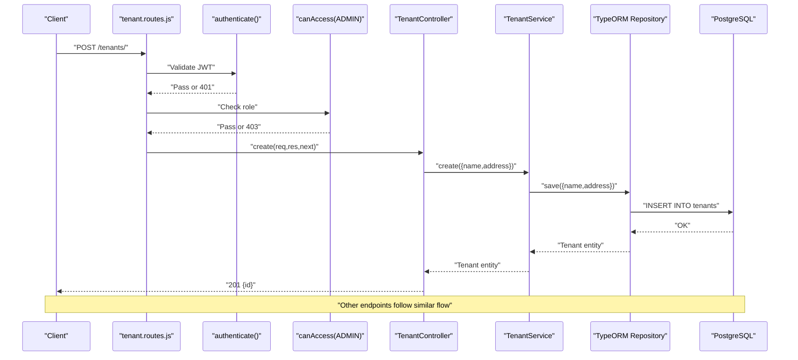
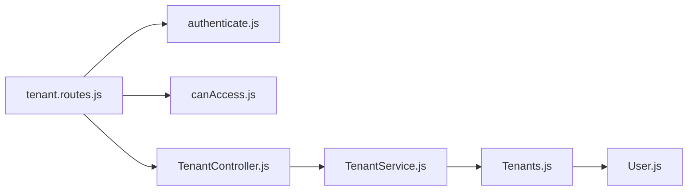
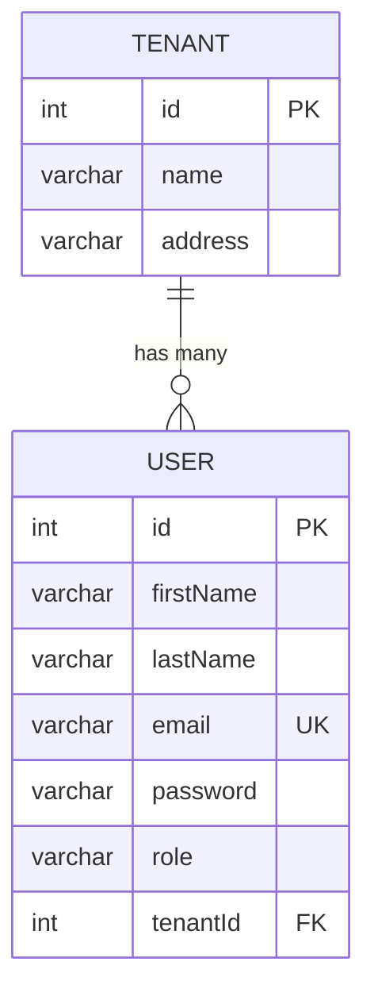

# Tenant Management Endpoints

<cite>
**Referenced Files in This Document**
- [tenant.routes.js](file://src/routes/tenant.routes.js)
- [TenantController.js](file://src/controllers/TenantController.js)
- [TenantService.js](file://src/services/TenantService.js)
- [Tenants.js](file://src/entity/Tenants.js)
- [authenticate.js](file://src/middleware/authenticate.js)
- [canAccess.js](file://src/middleware/canAccess.js)
- [index.js](file://src/constants/index.js)
- [app.js](file://src/app.js)
- [User.js](file://src/entity/User.js)
- [create.spec.js](file://src/test/tenant/create.spec.js)
</cite>

## Table of Contents
1. [Introduction](#introduction)
2. [Project Structure](#project-structure)
3. [Core Components](#core-components)
4. [Architecture Overview](#architecture-overview)
5. [Detailed Component Analysis](#detailed-component-analysis)
6. [Dependency Analysis](#dependency-analysis)
7. [Performance Considerations](#performance-considerations)
8. [Troubleshooting Guide](#troubleshooting-guide)
9. [Conclusion](#conclusion)
10. [Appendices](#appendices)

## Introduction
This document provides comprehensive API documentation for tenant management endpoints. It covers the available endpoints, request/response formats, validation rules, permissions, and error handling behavior as implemented in the backend. It also includes practical curl examples, response samples, and common use cases such as multi-tenant user assignment and tenant isolation.

## Project Structure
The tenant management feature is implemented as part of a layered architecture:
- Routes define the HTTP endpoints and attach middleware for authentication and authorization.
- Controllers orchestrate requests and delegate work to services.
- Services encapsulate business logic and interact with repositories.
- Entities define the data model for tenants and their relationship to users.
- Middleware enforces authentication via JWT and authorization via role checks.
- Global error handling standardizes error responses.

**Diagram sources**
- [tenant.routes.js:16-42](file://src/routes/tenant.routes.js#L16-L42)
- [authenticate.js:6-25](file://src/middleware/authenticate.js#L6-L25)
- [canAccess.js:4-22](file://src/middleware/canAccess.js#L4-L22)
- [TenantController.js:3-9](file://src/controllers/TenantController.js#L3-L9)
- [TenantService.js:4-6](file://src/services/TenantService.js#L4-L6)
- [Tenants.js:3-28](file://src/entity/Tenants.js#L3-L28)

**Section sources**
- [tenant.routes.js:1-45](file://src/routes/tenant.routes.js#L1-L45)
- [app.js:19-21](file://src/app.js#L19-L21)

## Core Components
- TenantController: Exposes endpoints for listing, creating, retrieving, updating, and deleting tenants. It logs successful creation and delegates to TenantService.
- TenantService: Implements persistence logic using TypeORM repository methods, including create, find, findOne, save, and delete.
- Tenant Entity: Defines the 'tenants' table schema and the relation to users via a one-to-many association.
- Authentication and Authorization: authenticate middleware validates JWT from Authorization header or cookies; canAccess middleware restricts routes to ADMIN role.
- Roles: ADMIN, MANAGER, CUSTOMER are defined centrally.

Key implementation references:
- Controller actions and response shapes: [TenantController.js:11-74](file://src/controllers/TenantController.js#L11-L74)
- Service methods and error propagation: [TenantService.js:7-64](file://src/services/TenantService.js#L7-L64)
- Entity schema and relations: [Tenants.js:3-28](file://src/entity/Tenants.js#L3-L28)
- Route definitions and middleware chain: [tenant.routes.js:16-42](file://src/routes/tenant.routes.js#L16-L42)
- Authentication and authorization middleware: [authenticate.js:6-25](file://src/middleware/authenticate.js#L6-L25), [canAccess.js:4-22](file://src/middleware/canAccess.js#L4-L22)
- Roles definition: [index.js:1-5](file://src/constants/index.js#L1-L5)

**Section sources**
- [TenantController.js:3-75](file://src/controllers/TenantController.js#L3-L75)
- [TenantService.js:3-65](file://src/services/TenantService.js#L3-L65)
- [Tenants.js:3-28](file://src/entity/Tenants.js#L3-L28)
- [tenant.routes.js:16-42](file://src/routes/tenant.routes.js#L16-L42)
- [authenticate.js:6-25](file://src/middleware/authenticate.js#L6-L25)
- [canAccess.js:4-22](file://src/middleware/canAccess.js#L4-L22)
- [index.js:1-5](file://src/constants/index.js#L1-L5)

## Architecture Overview
The tenant endpoints follow a clean separation of concerns:
- Routes bind HTTP verbs to controller methods.
- Middleware ensures only authenticated ADMIN users can mutate tenant data.
- Controller invokes service methods.
- Service persists data via TypeORM repository.
- Responses are standardized JSON with either an ID or a list of tenants.

**Diagram sources**
- [tenant.routes.js:16-21](file://src/routes/tenant.routes.js#L16-L21)
- [authenticate.js:6-25](file://src/middleware/authenticate.js#L6-L25)
- [canAccess.js:4-22](file://src/middleware/canAccess.js#L4-L22)
- [TenantController.js:11-22](file://src/controllers/TenantController.js#L11-L22)
- [TenantService.js:7-14](file://src/services/TenantService.js#L7-L14)

## Detailed Component Analysis

### Endpoint: GET /tenants
- Method: GET
- URL: /tenants
- Description: Retrieves a list of all tenants.
- Authentication: Not required by current route definition.
- Authorization: Not required by current route definition.
- Query parameters: None supported.
- Request body: None.
- Success response (200): JSON object containing a tenants array.
- Error responses:
  - 500: Internal server error if retrieval fails.
- Example curl:
  - curl -i https://service.example.com/tenants
- Example response:
  - {
      "tenants": [
        {"id": 1},
        {"id": 2}
      ]
    }
- Notes:
  - Pagination, filtering, and sorting are not implemented in the current route.

**Section sources**
- [tenant.routes.js:23-25](file://src/routes/tenant.routes.js#L23-L25)
- [TenantController.js:24-32](file://src/controllers/TenantController.js#L24-L32)
- [TenantService.js:16-23](file://src/services/TenantService.js#L16-L23)

### Endpoint: POST /tenants
- Method: POST
- URL: /tenants
- Description: Creates a new tenant.
- Authentication: Required (JWT).
- Authorization: ADMIN role required.
- Request body (JSON):
  - name: string, required
  - address: string, required
- Success response (201): JSON object containing the created tenant id.
- Error responses:
  - 400: Validation failure (not currently enforced in code).
  - 401: Unauthorized (invalid/expired/missing token).
  - 403: Forbidden (non-ADMIN role).
  - 500: Internal server error if persistence fails.
- Example curl:
  - curl -i -X POST -H "Content-Type: application/json" -H "Authorization: Bearer <JWT>" -b "accessToken=<JWT>" -c "accessToken=<JWT>" -d '{"name":"Acme Corp","address":"123 Main St"}' https://service.example.com/tenants
- Example response:
  - {"id": 1}
- Notes:
  - Current implementation does not enforce validation rules at the route level; tests demonstrate 401/403 behavior but not explicit validation messages.

**Section sources**
- [tenant.routes.js:16-21](file://src/routes/tenant.routes.js#L16-L21)
- [authenticate.js:6-25](file://src/middleware/authenticate.js#L6-L25)
- [canAccess.js:4-22](file://src/middleware/canAccess.js#L4-L22)
- [TenantController.js:11-22](file://src/controllers/TenantController.js#L11-L22)
- [TenantService.js:7-14](file://src/services/TenantService.js#L7-L14)
- [create.spec.js:84-104](file://src/test/tenant/create.spec.js#L84-L104)

### Endpoint: GET /tenants/:id
- Method: GET
- URL: /tenants/:id
- Description: Retrieves a specific tenant by id.
- Authentication: Not required by current route definition.
- Authorization: Not required by current route definition.
- Path parameters:
  - id: integer, required
- Request body: None.
- Success response (200): JSON object containing the tenant id.
- Error responses:
  - 404: Not found if tenant does not exist.
  - 500: Internal server error if retrieval fails.
- Example curl:
  - curl -i https://service.example.com/tenants/1
- Example response:
  - {"id": 1}
- Notes:
  - The controller returns only the id; the entity contains name and address fields.

**Section sources**
- [tenant.routes.js:26-28](file://src/routes/tenant.routes.js#L26-L28)
- [TenantController.js:34-48](file://src/controllers/TenantController.js#L34-L48)
- [TenantService.js:25-32](file://src/services/TenantService.js#L25-L32)

### Endpoint: PUT /tenants/:id
- Method: PUT
- URL: /tenants/:id
- Description: Updates an existing tenant.
- Authentication: Required (JWT).
- Authorization: ADMIN role required.
- Path parameters:
  - id: integer, required
- Request body (JSON):
  - name: string, optional
  - address: string, optional
- Success response (200): JSON object containing the updated tenant id.
- Error responses:
  - 400: Validation failure (not currently enforced in code).
  - 401: Unauthorized (invalid/expired/missing token).
  - 403: Forbidden (non-ADMIN role).
  - 404: Not found if tenant does not exist.
  - 500: Internal server error if persistence fails.
- Example curl:
  - curl -i -X PUT -H "Content-Type: application/json" -H "Authorization: Bearer <JWT>" -b "accessToken=<JWT>" -c "accessToken=<JWT>" -d '{"name":"Updated Name","address":"New Address"}' https://service.example.com/tenants/1
- Example response:
  - {"id": 1}
- Notes:
  - Current implementation performs a full replacement of name and address fields; partial updates are supported by passing only the desired fields.

**Section sources**
- [tenant.routes.js:30-35](file://src/routes/tenant.routes.js#L30-L35)
- [authenticate.js:6-25](file://src/middleware/authenticate.js#L6-L25)
- [canAccess.js:4-22](file://src/middleware/canAccess.js#L4-L22)
- [TenantController.js:50-63](file://src/controllers/TenantController.js#L50-L63)
- [TenantService.js:34-50](file://src/services/TenantService.js#L34-L50)

### Endpoint: DELETE /tenants/:id
- Method: DELETE
- URL: /tenants/:id
- Description: Deletes a tenant by id.
- Authentication: Required (JWT).
- Authorization: ADMIN role required.
- Path parameters:
  - id: integer, required
- Request body: None.
- Success response (200): Empty JSON object {}.
- Error responses:
  - 401: Unauthorized (invalid/expired/missing token).
  - 403: Forbidden (non-ADMIN role).
  - 404: Not found if tenant does not exist.
  - 500: Internal server error if deletion fails.
- Example curl:
  - curl -i -X DELETE -H "Authorization: Bearer <JWT>" -b "accessToken=<JWT>" -c "accessToken=<JWT>" https://service.example.com/tenants/1
- Example response:
  - {}
- Notes:
  - Cascade handling is not implemented in the current service; attempting to delete a tenant referenced by users will likely fail at the database level depending on foreign key constraints.

**Section sources**
- [tenant.routes.js:37-42](file://src/routes/tenant.routes.js#L37-L42)
- [authenticate.js:6-25](file://src/middleware/authenticate.js#L6-L25)
- [canAccess.js:4-22](file://src/middleware/canAccess.js#L4-L22)
- [TenantController.js:65-74](file://src/controllers/TenantController.js#L65-L74)
- [TenantService.js:52-64](file://src/services/TenantService.js#L52-L64)

## Dependency Analysis
The tenant module depends on:
- Express router for endpoint binding.
- Authentication middleware for JWT verification.
- Authorization middleware for role enforcement.
- TenantService for data access.
- TypeORM repository for persistence.
- Centralized roles for authorization checks.

**Diagram sources**
- [tenant.routes.js:1-45](file://src/routes/tenant.routes.js#L1-L45)
- [authenticate.js:1-26](file://src/middleware/authenticate.js#L1-L26)
- [canAccess.js:1-23](file://src/middleware/canAccess.js#L1-L23)
- [TenantController.js:1-76](file://src/controllers/TenantController.js#L1-L76)
- [TenantService.js:1-66](file://src/services/TenantService.js#L1-L66)
- [Tenants.js:1-29](file://src/entity/Tenants.js#L1-L29)
- [User.js:1-50](file://src/entity/User.js#L1-L50)

**Section sources**
- [tenant.routes.js:1-45](file://src/routes/tenant.routes.js#L1-L45)
- [TenantController.js:1-76](file://src/controllers/TenantController.js#L1-L76)
- [TenantService.js:1-66](file://src/services/TenantService.js#L1-L66)
- [Tenants.js:1-29](file://src/entity/Tenants.js#L1-L29)
- [User.js:1-50](file://src/entity/User.js#L1-L50)

## Performance Considerations
- Current implementation retrieves all tenants without pagination or filtering; for large datasets, consider adding limit/offset or cursor-based pagination.
- No sorting or indexing is applied; consider adding indexes on frequently queried columns if filters/sorts are introduced later.
- The service methods perform straightforward repository operations; ensure database-level constraints and indexes are configured appropriately.

[No sources needed since this section provides general guidance]

## Troubleshooting Guide
Common issues and resolutions:
- 401 Unauthorized:
  - Cause: Missing or invalid access token.
  - Resolution: Ensure Authorization header contains a valid Bearer token or a valid accessToken cookie is present.
- 403 Forbidden:
  - Cause: Non-ADMIN role attempting mutation operations.
  - Resolution: Authenticate with an ADMIN account.
- 404 Not Found:
  - Cause: Retrieving or deleting a tenant that does not exist.
  - Resolution: Verify the tenant id.
- 500 Internal Server Error:
  - Cause: Database or service failure.
  - Resolution: Check server logs and database connectivity.

Error handling behavior:
- Global error handler standardizes error responses with a single error object containing type, message, path, and location.

**Section sources**
- [app.js:24-37](file://src/app.js#L24-L37)
- [TenantController.js:38-41](file://src/controllers/TenantController.js#L38-L41)
- [TenantService.js:11-13](file://src/services/TenantService.js#L11-L13)
- [TenantService.js:29-30](file://src/services/TenantService.js#L29-L30)
- [TenantService.js:47-49](file://src/services/TenantService.js#L47-L49)
- [TenantService.js:61-63](file://src/services/TenantService.js#L61-L63)

## Conclusion
The tenant management endpoints provide basic CRUD operations with mandatory authentication and ADMIN-only write access. While the current implementation focuses on essential functionality, future enhancements could include request validation, pagination/filtering/sorting for listing, and cascade deletion semantics for robust tenant lifecycle management.

[No sources needed since this section summarizes without analyzing specific files]

## Appendices

### Data Model: Tenants and Users

**Diagram sources**
- [Tenants.js:3-28](file://src/entity/Tenants.js#L3-L28)
- [User.js:3-49](file://src/entity/User.js#L3-L49)

### Multi-Tenant User Assignment and Isolation Scenarios
- Assigning a user to a tenant:
  - Create a user with an optional tenantId to associate them with a tenant.
  - The user entity supports nullable tenantId, enabling users without a tenant (e.g., global admin users).
- Tenant isolation:
  - The tenant entity defines a one-to-many relationship with users.
  - Authorization middleware restricts tenant mutations to ADMIN users, supporting administrative control over tenant resources.

**Section sources**
- [User.js:30-33](file://src/entity/User.js#L30-L33)
- [User.js:42-47](file://src/entity/User.js#L42-L47)
- [tenant.routes.js:18-21](file://src/routes/tenant.routes.js#L18-L21)
- [canAccess.js:4-22](file://src/middleware/canAccess.js#L4-L22)
- [index.js:1-5](file://src/constants/index.js#L1-L5)