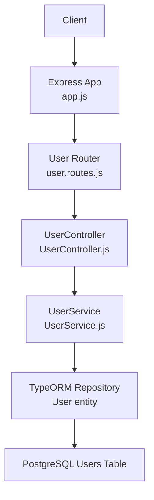
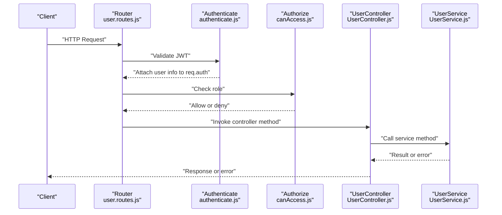
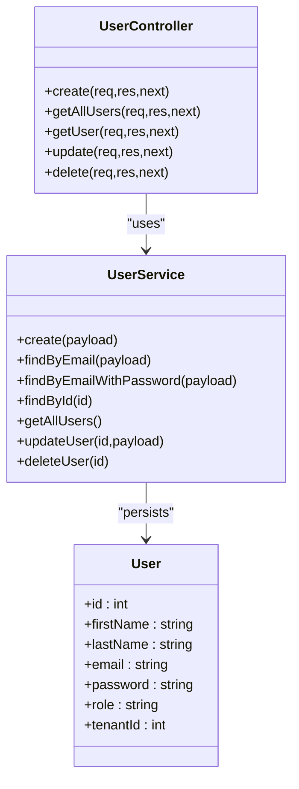
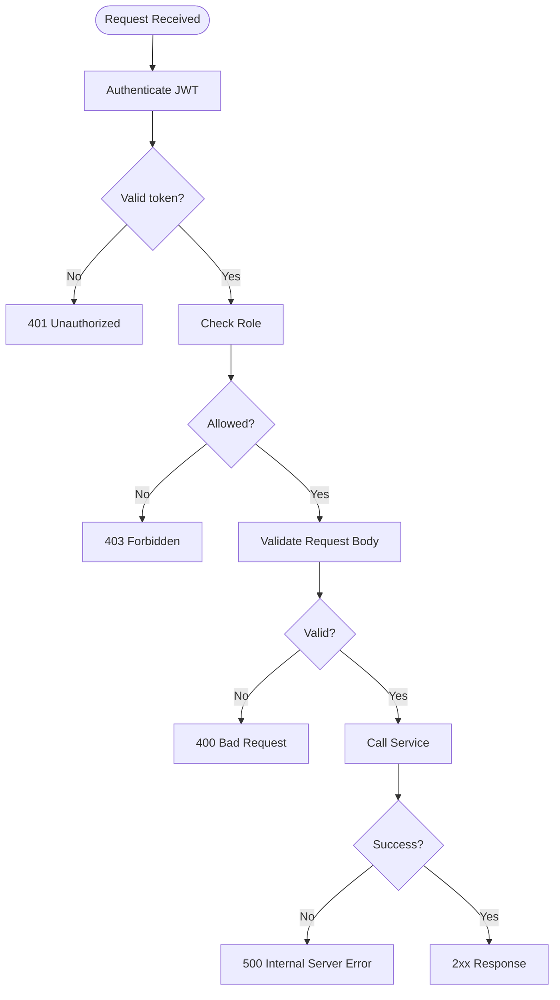
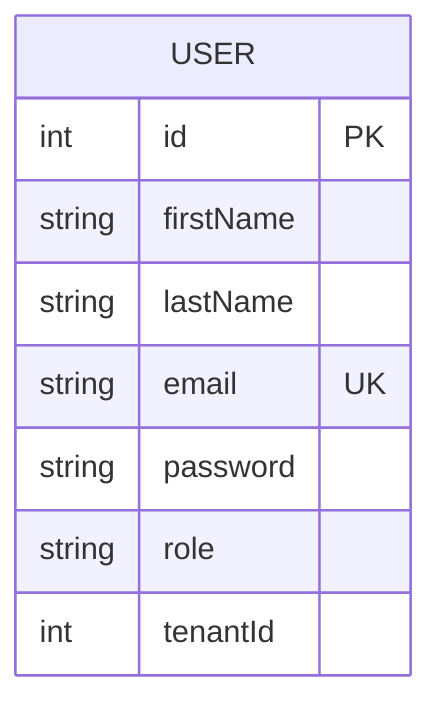

# User Management Endpoints

<cite>
**Referenced Files in This Document**
- [UserController.js](file://src/controllers/UserController.js)
- [UserService.js](file://src/services/UserService.js)
- [user.routes.js](file://src/routes/user.routes.js)
- [User.js](file://src/entity/User.js)
- [authenticate.js](file://src/middleware/authenticate.js)
- [canAccess.js](file://src/middleware/canAccess.js)
- [index.js](file://src/constants/index.js)
- [app.js](file://src/app.js)
- [register-validators.js](file://src/validators/register-validators.js)
- [create.spec.js](file://src/test/users/create.spec.js)
</cite>

## Table of Contents
1. [Introduction](#introduction)
2. [Project Structure](#project-structure)
3. [Core Components](#core-components)
4. [Architecture Overview](#architecture-overview)
5. [Detailed Component Analysis](#detailed-component-analysis)
6. [Dependency Analysis](#dependency-analysis)
7. [Performance Considerations](#performance-considerations)
8. [Troubleshooting Guide](#troubleshooting-guide)
9. [Conclusion](#conclusion)
10. [Appendices](#appendices)

## Introduction
This document provides comprehensive API documentation for user management endpoints. It covers:
- Listing users with optional pagination, filtering by tenant and role, and sorting
- Creating users with validation, tenant assignment, and role specification
- Updating users with partial updates, role validation, and tenant restrictions
- Deleting users with soft or hard delete semantics
- Retrieving specific user details with tenant context

It specifies HTTP methods, URL patterns, query parameters, request body schemas, response formats, error codes, and includes practical curl examples and common use cases.

## Project Structure
The user management feature is implemented using Express.js with layered architecture:
- Routes define endpoint handlers and apply middleware for authentication and authorization
- Controllers orchestrate requests and delegate to services
- Services encapsulate business logic and interact with repositories
- Entities define the data model and relationships
- Middleware enforces authentication via JWT and authorization by role

**Diagram sources**
- [app.js:19-21](file://src/app.js#L19-L21)
- [user.routes.js:15-35](file://src/routes/user.routes.js#L15-L35)
- [UserController.js:12-93](file://src/controllers/UserController.js#L12-L93)
- [UserService.js:7-98](file://src/services/UserService.js#L7-L98)
- [User.js:3-49](file://src/entity/User.js#L3-L49)

**Section sources**
- [app.js:19-21](file://src/app.js#L19-L21)
- [user.routes.js:15-35](file://src/routes/user.routes.js#L15-L35)

## Core Components
- Authentication middleware validates JWT from Authorization header or cookies
- Authorization middleware restricts endpoints to ADMIN role
- User controller exposes endpoints for listing, creating, retrieving, updating, and deleting users
- User service handles validation, persistence, and error propagation
- User entity defines columns and tenant relationship

Key roles:
- ADMIN: allowed to create, list, update, and delete users
- CUSTOMER/MANAGER: can retrieve own profile via other endpoints

**Section sources**
- [authenticate.js:6-25](file://src/middleware/authenticate.js#L6-L25)
- [canAccess.js:4-22](file://src/middleware/canAccess.js#L4-L22)
- [index.js:1-5](file://src/constants/index.js#L1-L5)
- [UserController.js:12-93](file://src/controllers/UserController.js#L12-L93)
- [UserService.js:7-98](file://src/services/UserService.js#L7-L98)
- [User.js:3-49](file://src/entity/User.js#L3-L49)

## Architecture Overview
The user endpoints follow a clear request-response flow with middleware enforcement.

**Diagram sources**
- [user.routes.js:15-35](file://src/routes/user.routes.js#L15-L35)
- [authenticate.js:6-25](file://src/middleware/authenticate.js#L6-L25)
- [canAccess.js:4-22](file://src/middleware/canAccess.js#L4-L22)
- [UserController.js:12-93](file://src/controllers/UserController.js#L12-L93)
- [UserService.js:7-98](file://src/services/UserService.js#L7-L98)

## Detailed Component Analysis

### Endpoint: GET /users
- Method: GET
- URL: /users
- Authentication: Required (JWT)
- Authorization: ADMIN
- Query parameters:
  - page: integer (optional)
  - limit: integer (optional)
  - tenantId: integer (optional)
  - roleId: integer (optional)
  - sortBy: enum("firstName","lastName","email","createdAt") (optional)
  - sortOrder: enum("ASC","DESC") (optional)
- Response:
  - 200 OK: Array of user objects with id and metadata
  - 403 Forbidden: Unauthorized role
  - 401 Unauthorized: Invalid or missing token
  - 500 Internal Server Error: Service failure
- Notes:
  - Current controller returns minimal payload; adjust to include requested fields and pagination as per requirements

Common use cases:
- List all users with pagination and sorting
- Filter by tenant and role

curl example:
- curl -H "Authorization: Bearer <ADMIN_TOKEN>" https://service/users?page=1&limit=10&sortBy=firstName&sortOrder=ASC

**Section sources**
- [user.routes.js:18-19](file://src/routes/user.routes.js#L18-L19)
- [UserController.js:30-42](file://src/controllers/UserController.js#L30-L42)
- [UserService.js:64-66](file://src/services/UserService.js#L64-L66)

### Endpoint: POST /users
- Method: POST
- URL: /users
- Authentication: Required (JWT)
- Authorization: ADMIN
- Request body:
  - firstName: string (required)
  - lastName: string (required)
  - email: string (required)
  - password: string (required)
  - role: enum("admin","manager","customer") (required)
  - tenantId: integer (optional)
- Validation rules:
  - firstName: required, length 2–50
  - lastName: required, length 2–50
  - email: required, valid email
  - password: required, minimum 8 characters
- Response:
  - 201 Created: { id }
  - 400 Bad Request: Validation or duplicate email
  - 403 Forbidden: Unauthorized role
  - 401 Unauthorized: Invalid or missing token
  - 500 Internal Server Error: Service failure
- Behavior:
  - Password is hashed before storage
  - Duplicate email triggers conflict error

curl example:
- curl -X POST -H "Authorization: Bearer <ADMIN_TOKEN>" -H "Content-Type: application/json" -d '{"firstName":"John","lastName":"Doe","email":"john@example.com","password":"securePass123","role":"manager","tenantId":1}' https://service/users

**Section sources**
- [user.routes.js:15-17](file://src/routes/user.routes.js#L15-L17)
- [UserController.js:12-28](file://src/controllers/UserController.js#L12-L28)
- [UserService.js:7-38](file://src/services/UserService.js#L7-L38)
- [register-validators.js:3-46](file://src/validators/register-validators.js#L3-L46)

### Endpoint: GET /users/:id
- Method: GET
- URL: /users/:id
- Authentication: Required (JWT)
- Authorization: Any authenticated user (owner or admin)
- Path parameters:
  - id: integer (required)
- Response:
  - 200 OK: { id }
  - 404 Not Found: User not found
  - 401 Unauthorized: Invalid or missing token
  - 500 Internal Server Error: Service failure
- Notes:
  - Returns user identifier; extend to include full details and tenant association as per requirements

curl example:
- curl -H "Authorization: Bearer <USER_OR_ADMIN_TOKEN>" https://service/users/123

**Section sources**
- [user.routes.js:21-22](file://src/routes/user.routes.js#L21-L22)
- [UserController.js:43-52](file://src/controllers/UserController.js#L43-L52)
- [UserService.js:56-62](file://src/services/UserService.js#L56-L62)

### Endpoint: PUT /users/:id
- Method: PUT
- URL: /users/:id
- Authentication: Required (JWT)
- Authorization: ADMIN
- Path parameters:
  - id: integer (required)
- Request body:
  - firstName: string (optional)
  - lastName: string (optional)
  - email: string (optional)
  - role: enum("admin","manager","customer") (optional)
  - tenantId: integer (optional)
- Validation rules:
  - Partial updates supported; no mandatory fields
  - Email uniqueness enforced if provided
- Response:
  - 200 OK: { id }
  - 400 Bad Request: Validation errors
  - 403 Forbidden: Unauthorized role
  - 401 Unauthorized: Invalid or missing token
  - 500 Internal Server Error: Service failure

curl example:
- curl -X PUT -H "Authorization: Bearer <ADMIN_TOKEN>" -H "Content-Type: application/json" -d '{"role":"admin","tenantId":2}' https://service/users/123

**Section sources**
- [user.routes.js:24-29](file://src/routes/user.routes.js#L24-L29)
- [UserController.js:54-77](file://src/controllers/UserController.js#L54-L77)
- [UserService.js:68-84](file://src/services/UserService.js#L68-L84)

### Endpoint: DELETE /users/:id
- Method: DELETE
- URL: /users/:id
- Authentication: Required (JWT)
- Authorization: ADMIN
- Path parameters:
  - id: integer (required)
- Response:
  - 200 OK: { id }
  - 401 Unauthorized: Invalid or missing token
  - 500 Internal Server Error: Service failure
- Notes:
  - Current implementation performs hard delete; adjust to support soft delete semantics if required

curl example:
- curl -X DELETE -H "Authorization: Bearer <ADMIN_TOKEN>" https://service/users/123

**Section sources**
- [user.routes.js:30-35](file://src/routes/user.routes.js#L30-L35)
- [UserController.js:79-93](file://src/controllers/UserController.js#L79-L93)
- [UserService.js:86-97](file://src/services/UserService.js#L86-L97)

## Dependency Analysis

**Diagram sources**
- [UserController.js:4-11](file://src/controllers/UserController.js#L4-L11)
- [UserService.js:4-6](file://src/services/UserService.js#L4-L6)
- [User.js:3-49](file://src/entity/User.js#L3-L49)

**Section sources**
- [UserController.js:4-11](file://src/controllers/UserController.js#L4-L11)
- [UserService.js:4-6](file://src/services/UserService.js#L4-L6)
- [User.js:3-49](file://src/entity/User.js#L3-L49)

## Performance Considerations
- Pagination: Implement page and limit parameters to avoid large result sets
- Filtering and sorting: Add tenantId and role filters with appropriate indexes
- Validation overhead: Keep validation lightweight; leverage existing express-validator rules
- Hashing cost: Password hashing is CPU-intensive; consider async hashing and caching strategies if needed
- Error handling: Centralized error middleware prevents unhandled exceptions from leaking

## Troubleshooting Guide
Common error scenarios:
- 401 Unauthorized: Missing or invalid Authorization header/token
- 403 Forbidden: Non-ADMIN attempting privileged operations
- 400 Bad Request: Validation failures or duplicate email
- 404 Not Found: User not found
- 500 Internal Server Error: Database or service failures

Error handling flow:

**Diagram sources**
- [authenticate.js:6-25](file://src/middleware/authenticate.js#L6-L25)
- [canAccess.js:4-22](file://src/middleware/canAccess.js#L4-L22)
- [UserController.js:56-59](file://src/controllers/UserController.js#L56-L59)
- [UserService.js:28-37](file://src/services/UserService.js#L28-L37)
- [app.js:24-37](file://src/app.js#L24-L37)

**Section sources**
- [app.js:24-37](file://src/app.js#L24-L37)

## Conclusion
The user management endpoints provide a secure foundation with JWT authentication and role-based authorization. To meet the full specification, implement pagination, filtering, and sorting on GET /users, expand response payloads to include user details and tenant associations, and refine validation and error handling as outlined.

## Appendices

### Data Model: User

**Diagram sources**
- [User.js:6-34](file://src/entity/User.js#L6-L34)

### Example Test Coverage
- Tests demonstrate successful GET /users with ADMIN token and basic user creation flow
- Use these as references for building similar tests for your endpoints

**Section sources**
- [create.spec.js:31-91](file://src/test/users/create.spec.js#L31-L91)