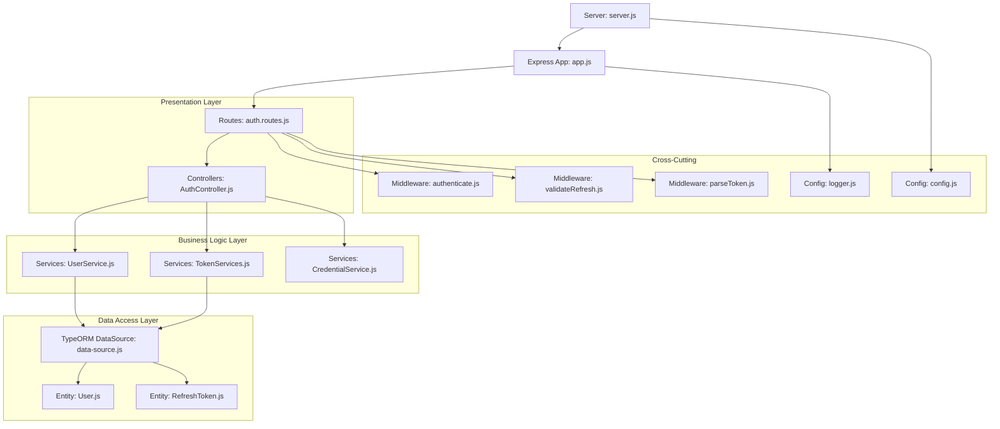
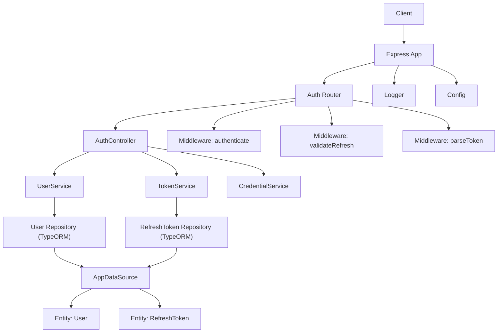
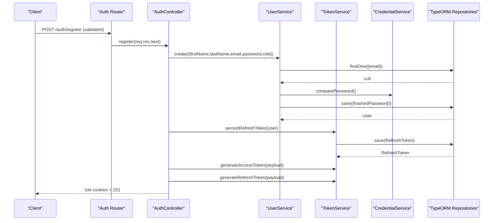
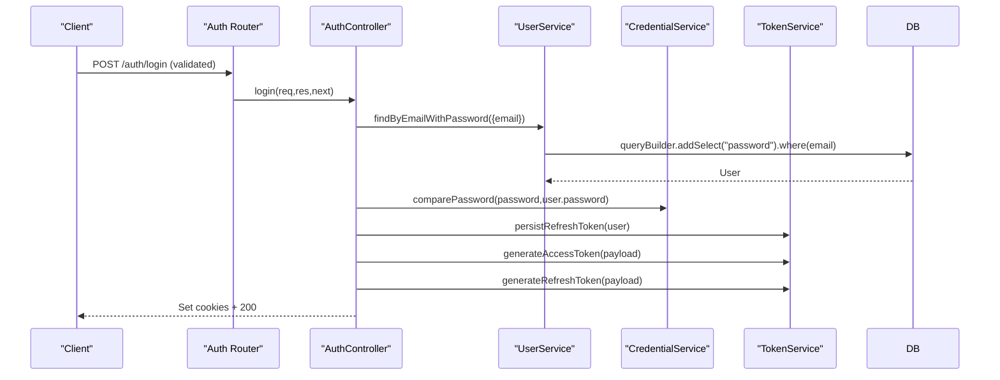
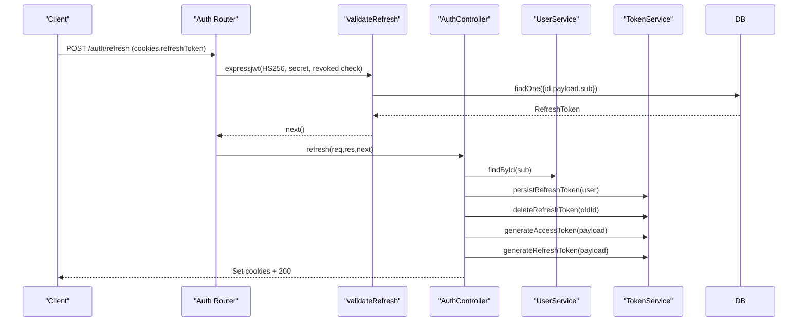
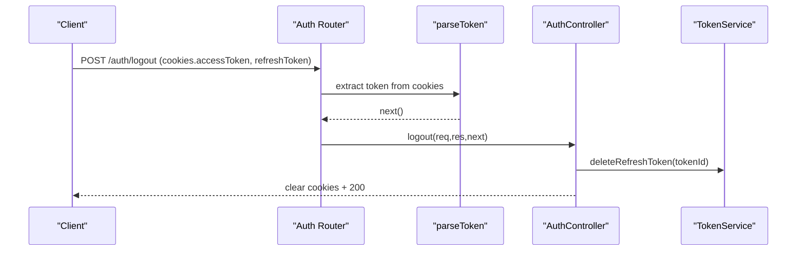
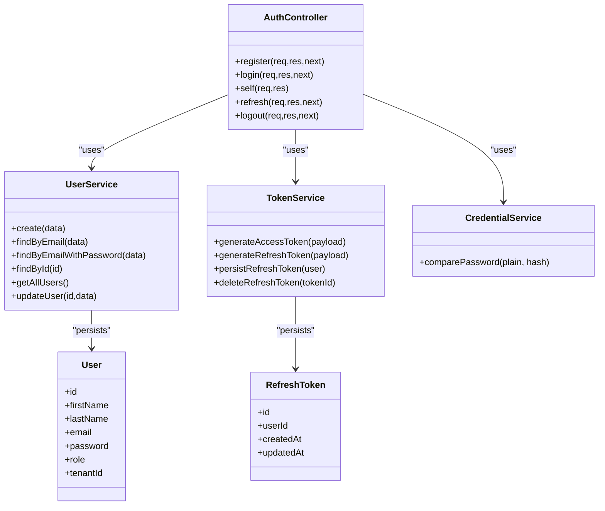
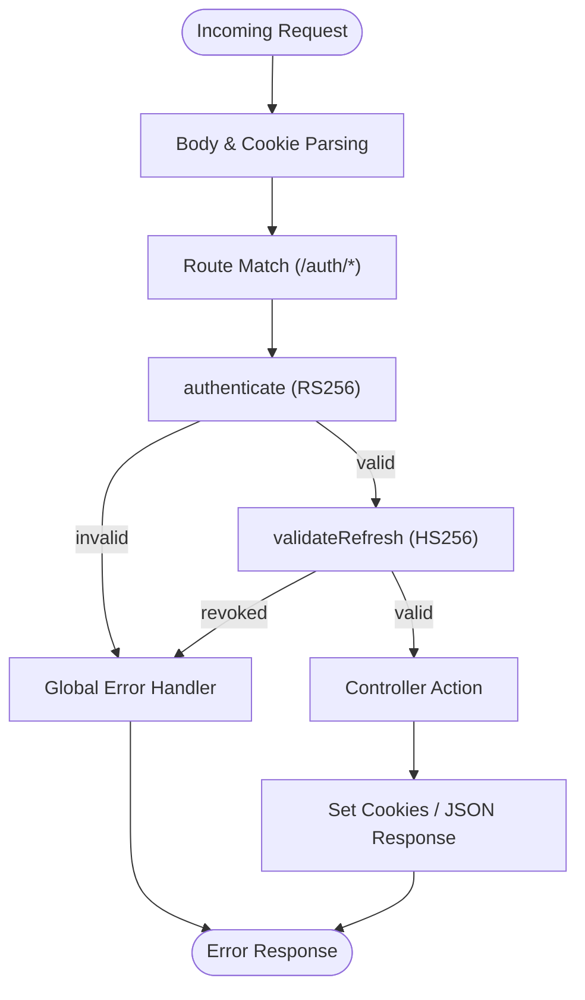
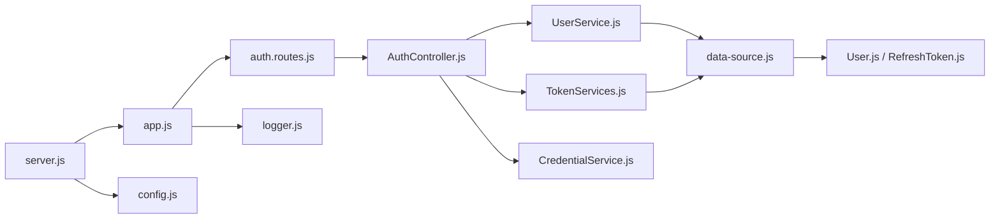
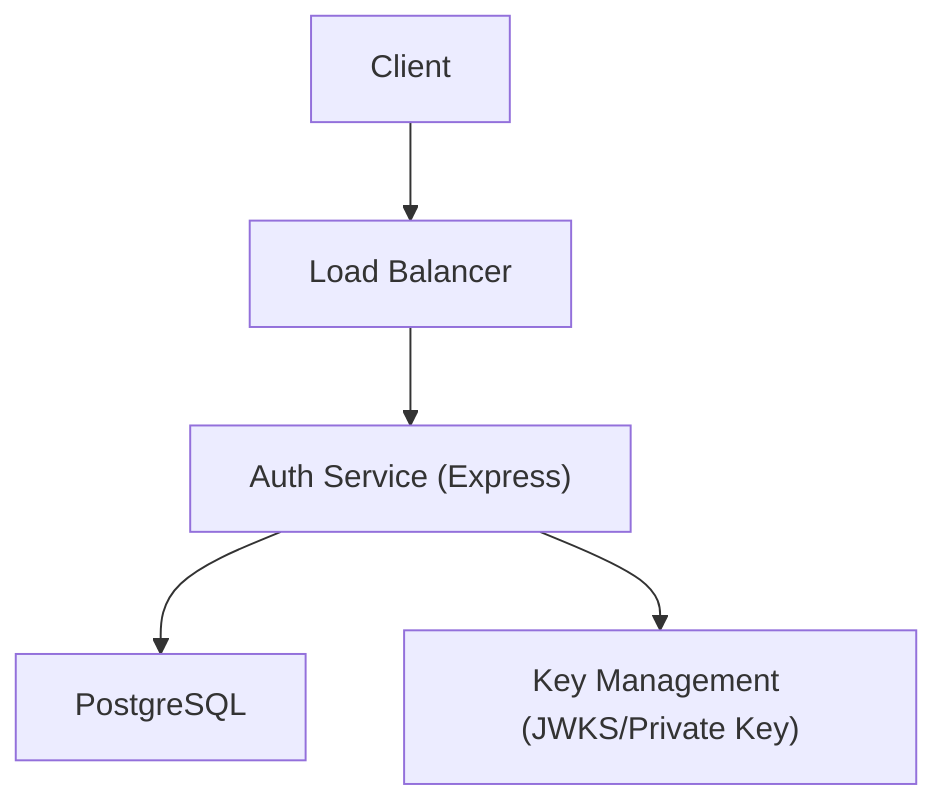

# Architecture Overview

<cite>
**Referenced Files in This Document**
- [src/server.js](file://src/server.js)
- [src/app.js](file://src/app.js)
- [src/config/config.js](file://src/config/config.js)
- [src/config/data-source.js](file://src/config/data-source.js)
- [src/config/logger.js](file://src/config/logger.js)
- [src/routes/auth.routes.js](file://src/routes/auth.routes.js)
- [src/controllers/AuthController.js](file://src/controllers/AuthController.js)
- [src/services/UserService.js](file://src/services/UserService.js)
- [src/services/TokenServices.js](file://src/services/TokenServices.js)
- [src/services/CredentialService.js](file://src/services/CredentialService.js)
- [src/entity/User.js](file://src/entity/User.js)
- [src/entity/RefreshToken.js](file://src/entity/RefreshToken.js)
- [src/middleware/authenticate.js](file://src/middleware/authenticate.js)
- [src/middleware/validateRefresh.js](file://src/middleware/validateRefresh.js)
- [src/middleware/parseToken.js](file://src/middleware/parseToken.js)
- [src/constants/index.js](file://src/constants/index.js)
- [package.json](file://package.json)
</cite>

## Table of Contents
1. [Introduction](#introduction)
2. [Project Structure](#project-structure)
3. [Core Components](#core-components)
4. [Architecture Overview](#architecture-overview)
5. [Detailed Component Analysis](#detailed-component-analysis)
6. [Dependency Analysis](#dependency-analysis)
7. [Performance Considerations](#performance-considerations)
8. [Troubleshooting Guide](#troubleshooting-guide)
9. [Conclusion](#conclusion)
10. [Appendices](#appendices)

## Introduction
This document presents the architecture of the authentication service system. It follows a layered architecture pattern with clear separation between:
- Presentation layer: Express.js routes and controllers
- Business logic layer: Services implementing domain workflows
- Data access layer: TypeORM repositories and entities
It also documents middleware chain processing, JWT-based authentication, dependency injection wiring, cross-cutting concerns (logging, error handling, security), and scalability/deployment considerations.

## Project Structure
The project is organized into feature- and layer-based directories:
- Configuration: environment, database connection, logging
- Routes: route definitions per feature
- Controllers: request handlers orchestrating services
- Services: business logic and orchestration
- Entities: TypeORM entity schemas
- Middleware: authentication, token parsing, refresh validation
- Validators: request validation helpers
- Constants: shared enumerations
- Test: unit and integration tests
- Migration: database migrations

**Diagram sources**
- [src/server.js:1-21](file://src/server.js#L1-L21)
- [src/app.js:1-40](file://src/app.js#L1-L40)
- [src/routes/auth.routes.js:1-49](file://src/routes/auth.routes.js#L1-L49)
- [src/controllers/AuthController.js:1-212](file://src/controllers/AuthController.js#L1-L212)
- [src/services/UserService.js:1-86](file://src/services/UserService.js#L1-L86)
- [src/services/TokenServices.js:1-60](file://src/services/TokenServices.js#L1-L60)
- [src/services/CredentialService.js](file://src/services/CredentialService.js)
- [src/config/data-source.js:1-22](file://src/config/data-source.js#L1-L22)
- [src/entity/User.js:1-50](file://src/entity/User.js#L1-L50)
- [src/entity/RefreshToken.js:1-35](file://src/entity/RefreshToken.js#L1-L35)
- [src/middleware/authenticate.js:1-25](file://src/middleware/authenticate.js#L1-L25)
- [src/middleware/validateRefresh.js:1-34](file://src/middleware/validateRefresh.js#L1-L34)
- [src/middleware/parseToken.js](file://src/middleware/parseToken.js)
- [src/config/logger.js:1-42](file://src/config/logger.js#L1-L42)
- [src/config/config.js:1-34](file://src/config/config.js#L1-L34)

**Section sources**
- [src/server.js:1-21](file://src/server.js#L1-L21)
- [src/app.js:1-40](file://src/app.js#L1-L40)
- [package.json:1-48](file://package.json#L1-L48)

## Core Components
- Express application bootstrapped in server and configured in app:
  - JSON body parsing, cookie parsing, static serving, global error handler
- Route wiring:
  - Authentication routes wired with validators and middleware
- Controllers:
  - AuthController orchestrates user registration, login, profile retrieval, token refresh, and logout
- Services:
  - UserService: user persistence, lookup, and updates via repository
  - TokenService: JWT generation (access/refresh), refresh token persistence and revocation
  - CredentialService: password comparison
- Entities:
  - User and RefreshToken mapped via TypeORM with relations
- Middleware:
  - authenticate: validates access tokens (RS256) using JWKS
  - validateRefresh: validates refresh tokens (HS256) and checks revocation against DB
  - parseToken: extracts refresh token from cookies
- Configuration:
  - Environment-driven config, Postgres datasource, logging transports

**Section sources**
- [src/app.js:1-40](file://src/app.js#L1-L40)
- [src/routes/auth.routes.js:1-49](file://src/routes/auth.routes.js#L1-L49)
- [src/controllers/AuthController.js:1-212](file://src/controllers/AuthController.js#L1-L212)
- [src/services/UserService.js:1-86](file://src/services/UserService.js#L1-L86)
- [src/services/TokenServices.js:1-60](file://src/services/TokenServices.js#L1-L60)
- [src/entity/User.js:1-50](file://src/entity/User.js#L1-L50)
- [src/entity/RefreshToken.js:1-35](file://src/entity/RefreshToken.js#L1-L35)
- [src/middleware/authenticate.js:1-25](file://src/middleware/authenticate.js#L1-L25)
- [src/middleware/validateRefresh.js:1-34](file://src/middleware/validateRefresh.js#L1-L34)
- [src/config/config.js:1-34](file://src/config/config.js#L1-L34)
- [src/config/data-source.js:1-22](file://src/config/data-source.js#L1-L22)
- [src/config/logger.js:1-42](file://src/config/logger.js#L1-L42)

## Architecture Overview
The system adheres to layered architecture:
- Presentation: Express routes delegate to controllers
- Business: Controllers depend on services for domain logic
- Persistence: Services use TypeORM repositories backed by entities
- Cross-cutting: Middleware enforces auth, logging, and centralized error handling

**Diagram sources**
- [src/app.js:1-40](file://src/app.js#L1-L40)
- [src/routes/auth.routes.js:1-49](file://src/routes/auth.routes.js#L1-L49)
- [src/controllers/AuthController.js:1-212](file://src/controllers/AuthController.js#L1-L212)
- [src/services/UserService.js:1-86](file://src/services/UserService.js#L1-L86)
- [src/services/TokenServices.js:1-60](file://src/services/TokenServices.js#L1-L60)
- [src/config/data-source.js:1-22](file://src/config/data-source.js#L1-L22)
- [src/entity/User.js:1-50](file://src/entity/User.js#L1-L50)
- [src/entity/RefreshToken.js:1-35](file://src/entity/RefreshToken.js#L1-L35)
- [src/middleware/authenticate.js:1-25](file://src/middleware/authenticate.js#L1-L25)
- [src/middleware/validateRefresh.js:1-34](file://src/middleware/validateRefresh.js#L1-L34)
- [src/middleware/parseToken.js](file://src/middleware/parseToken.js)
- [src/config/logger.js:1-42](file://src/config/logger.js#L1-L42)
- [src/config/config.js:1-34](file://src/config/config.js#L1-L34)

## Detailed Component Analysis

### Request Processing Flow: Registration

**Diagram sources**
- [src/routes/auth.routes.js:29-31](file://src/routes/auth.routes.js#L29-L31)
- [src/controllers/AuthController.js:19-70](file://src/controllers/AuthController.js#L19-L70)
- [src/services/UserService.js:7-38](file://src/services/UserService.js#L7-L38)
- [src/services/TokenServices.js:45-52](file://src/services/TokenServices.js#L45-L52)
- [src/services/CredentialService.js](file://src/services/CredentialService.js)
- [src/config/data-source.js:17-18](file://src/config/data-source.js#L17-L18)

**Section sources**
- [src/routes/auth.routes.js:29-31](file://src/routes/auth.routes.js#L29-L31)
- [src/controllers/AuthController.js:19-70](file://src/controllers/AuthController.js#L19-L70)
- [src/services/UserService.js:7-38](file://src/services/UserService.js#L7-L38)
- [src/services/TokenServices.js:45-52](file://src/services/TokenServices.js#L45-L52)

### Request Processing Flow: Login

**Diagram sources**
- [src/routes/auth.routes.js:33-35](file://src/routes/auth.routes.js#L33-L35)
- [src/controllers/AuthController.js:72-136](file://src/controllers/AuthController.js#L72-L136)
- [src/services/UserService.js:48-54](file://src/services/UserService.js#L48-L54)
- [src/services/TokenServices.js:45-52](file://src/services/TokenServices.js#L45-L52)
- [src/config/data-source.js:17-18](file://src/config/data-source.js#L17-L18)

**Section sources**
- [src/routes/auth.routes.js:33-35](file://src/routes/auth.routes.js#L33-L35)
- [src/controllers/AuthController.js:72-136](file://src/controllers/AuthController.js#L72-L136)
- [src/services/UserService.js:48-54](file://src/services/UserService.js#L48-L54)

### Request Processing Flow: Token Refresh

**Diagram sources**
- [src/routes/auth.routes.js:41-43](file://src/routes/auth.routes.js#L41-L43)
- [src/middleware/validateRefresh.js:7-31](file://src/middleware/validateRefresh.js#L7-L31)
- [src/controllers/AuthController.js:143-192](file://src/controllers/AuthController.js#L143-L192)
- [src/services/TokenServices.js:54-58](file://src/services/TokenServices.js#L54-L58)
- [src/config/data-source.js:17-18](file://src/config/data-source.js#L17-L18)

**Section sources**
- [src/routes/auth.routes.js:41-43](file://src/routes/auth.routes.js#L41-L43)
- [src/middleware/validateRefresh.js:7-31](file://src/middleware/validateRefresh.js#L7-L31)
- [src/controllers/AuthController.js:143-192](file://src/controllers/AuthController.js#L143-L192)
- [src/services/TokenServices.js:54-58](file://src/services/TokenServices.js#L54-L58)

### Logout Flow

**Diagram sources**
- [src/routes/auth.routes.js:44-46](file://src/routes/auth.routes.js#L44-L46)
- [src/middleware/parseToken.js](file://src/middleware/parseToken.js)
- [src/controllers/AuthController.js:194-210](file://src/controllers/AuthController.js#L194-L210)
- [src/services/TokenServices.js:54-58](file://src/services/TokenServices.js#L54-L58)

**Section sources**
- [src/routes/auth.routes.js:44-46](file://src/routes/auth.routes.js#L44-L46)
- [src/middleware/parseToken.js](file://src/middleware/parseToken.js)
- [src/controllers/AuthController.js:194-210](file://src/controllers/AuthController.js#L194-L210)
- [src/services/TokenServices.js:54-58](file://src/services/TokenServices.js#L54-L58)

### Class Model: Controllers, Services, and Entities

**Diagram sources**
- [src/controllers/AuthController.js:5-16](file://src/controllers/AuthController.js#L5-L16)
- [src/services/UserService.js:3-6](file://src/services/UserService.js#L3-L6)
- [src/services/TokenServices.js:8-11](file://src/services/TokenServices.js#L8-L11)
- [src/entity/User.js:3-49](file://src/entity/User.js#L3-L49)
- [src/entity/RefreshToken.js:3-34](file://src/entity/RefreshToken.js#L3-L34)

**Section sources**
- [src/controllers/AuthController.js:5-16](file://src/controllers/AuthController.js#L5-L16)
- [src/services/UserService.js:3-6](file://src/services/UserService.js#L3-L6)
- [src/services/TokenServices.js:8-11](file://src/services/TokenServices.js#L8-L11)
- [src/entity/User.js:3-49](file://src/entity/User.js#L3-L49)
- [src/entity/RefreshToken.js:3-34](file://src/entity/RefreshToken.js#L3-L34)

### Middleware Chain Processing
- Global middleware stack:
  - Body parsing, cookie parsing, static serving, root health endpoint
  - Centralized error handler logs and returns structured errors
- Route-specific middleware:
  - authenticate: RS256 access token validation via JWKS
  - validateRefresh: HS256 refresh token validation and revocation check
  - parseToken: extracts refresh token from cookies for logout

**Diagram sources**
- [src/app.js:10-37](file://src/app.js#L10-L37)
- [src/middleware/authenticate.js:5-24](file://src/middleware/authenticate.js#L5-L24)
- [src/middleware/validateRefresh.js:7-31](file://src/middleware/validateRefresh.js#L7-L31)
- [src/routes/auth.routes.js:37-46](file://src/routes/auth.routes.js#L37-L46)

**Section sources**
- [src/app.js:10-37](file://src/app.js#L10-L37)
- [src/middleware/authenticate.js:5-24](file://src/middleware/authenticate.js#L5-L24)
- [src/middleware/validateRefresh.js:7-31](file://src/middleware/validateRefresh.js#L7-L31)
- [src/routes/auth.routes.js:37-46](file://src/routes/auth.routes.js#L37-L46)

## Dependency Analysis
- Express app initialization and lifecycle:
  - Server initializes TypeORM DataSource and starts HTTP listener
- Route wiring:
  - Routes construct service instances and controller with injected dependencies
- Service-layer composition:
  - Services depend on repositories; repositories are resolved from DataSource
- JWT and secrets:
  - Access tokens signed with RSA private key; refresh tokens signed with HS256 secret
- Logging and configuration:
  - Winston transports configured; environment variables loaded from .env files

**Diagram sources**
- [src/server.js:7-19](file://src/server.js#L7-L19)
- [src/app.js:1-40](file://src/app.js#L1-L40)
- [src/routes/auth.routes.js:17-27](file://src/routes/auth.routes.js#L17-L27)
- [src/controllers/AuthController.js:11-16](file://src/controllers/AuthController.js#L11-L16)
- [src/services/UserService.js:4](file://src/services/UserService.js#L4)
- [src/services/TokenServices.js:9](file://src/services/TokenServices.js#L9)
- [src/config/data-source.js:8-21](file://src/config/data-source.js#L8-L21)
- [src/entity/User.js:3-49](file://src/entity/User.js#L3-L49)
- [src/entity/RefreshToken.js:3-34](file://src/entity/RefreshToken.js#L3-L34)
- [src/config/logger.js:4-39](file://src/config/logger.js#L4-L39)
- [src/config/config.js:23-33](file://src/config/config.js#L23-L33)

**Section sources**
- [src/server.js:7-19](file://src/server.js#L7-L19)
- [src/app.js:1-40](file://src/app.js#L1-L40)
- [src/routes/auth.routes.js:17-27](file://src/routes/auth.routes.js#L17-L27)
- [src/controllers/AuthController.js:11-16](file://src/controllers/AuthController.js#L11-L16)
- [src/services/UserService.js:4](file://src/services/UserService.js#L4)
- [src/services/TokenServices.js:9](file://src/services/TokenServices.js#L9)
- [src/config/data-source.js:8-21](file://src/config/data-source.js#L8-L21)
- [src/entity/User.js:3-49](file://src/entity/User.js#L3-L49)
- [src/entity/RefreshToken.js:3-34](file://src/entity/RefreshToken.js#L3-L34)
- [src/config/logger.js:4-39](file://src/config/logger.js#L4-L39)
- [src/config/config.js:23-33](file://src/config/config.js#L23-L33)

## Performance Considerations
- Token signing:
  - Access tokens use RSA (more expensive CPU-wise); consider caching JWKS and minimizing token payload
- Password hashing:
  - Bcrypt cost is moderate; monitor latency under load and adjust as needed
- Database:
  - Use connection pooling and migrations for schema evolution; avoid synchronize in production
- Caching:
  - Cache frequently accessed user roles and permissions at the edge or in memory
- Horizontal scaling:
  - Stateless auth service; scale replicas behind a load balancer; ensure shared secrets and consistent clock for JWTs

[No sources needed since this section provides general guidance]

## Troubleshooting Guide
- Centralized error handling:
  - Logs error messages and returns structured JSON with type, message, path, and location
- Logging:
  - Winston transports write to files and console; adjust log levels per environment
- Common issues:
  - Validation failures: express-validator returns array of errors
  - Authentication failures: ensure proper Authorization header or accessToken cookie
  - Revoked refresh tokens: validateRefresh middleware checks DB presence
  - Database connectivity: verify Postgres credentials and migrations

**Section sources**
- [src/app.js:24-37](file://src/app.js#L24-L37)
- [src/config/logger.js:4-39](file://src/config/logger.js#L4-L39)
- [src/middleware/validateRefresh.js:14-30](file://src/middleware/validateRefresh.js#L14-L30)

## Conclusion
The authentication service employs a clean layered architecture with explicit separation of concerns. Express.js routes and controllers handle presentation, services encapsulate business logic, and TypeORM manages persistence. JWT-based authentication leverages RS256 for access tokens and HS256 for refresh tokens with revocation via database checks. Cross-cutting concerns are addressed through middleware and logging. The design supports scalability and maintainability with clear dependency boundaries and modular components.

[No sources needed since this section summarizes without analyzing specific files]

## Appendices

### System Context Diagram

[No sources needed since this diagram shows conceptual workflow, not actual code structure]

### Deployment Topology Notes
- Single containerized service exposing HTTP endpoints
- External dependencies: Postgres database and external key management for JWKS
- Secrets management: environment variables for DB and JWT configuration
- Health endpoint: root GET returns service status

**Section sources**
- [src/app.js:13-17](file://src/app.js#L13-L17)
- [src/config/config.js:7-9](file://src/config/config.js#L7-L9)
- [src/config/data-source.js:8-21](file://src/config/data-source.js#L8-L21)