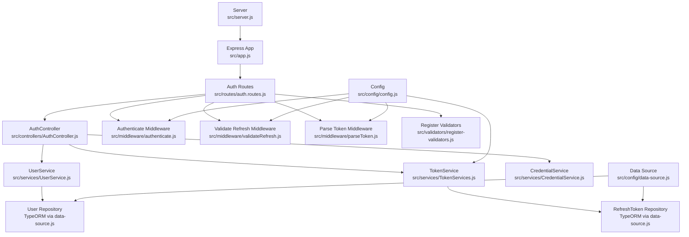
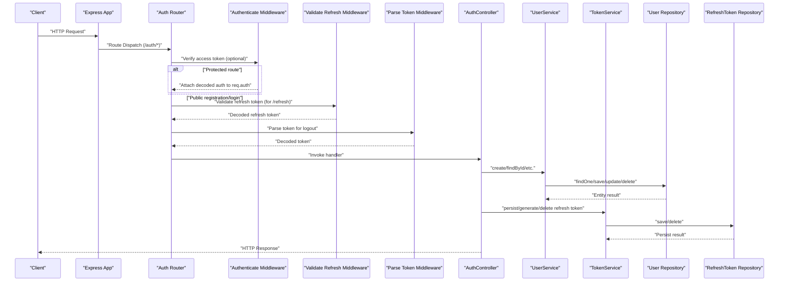
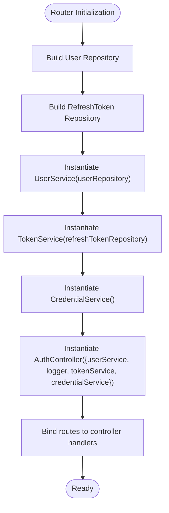
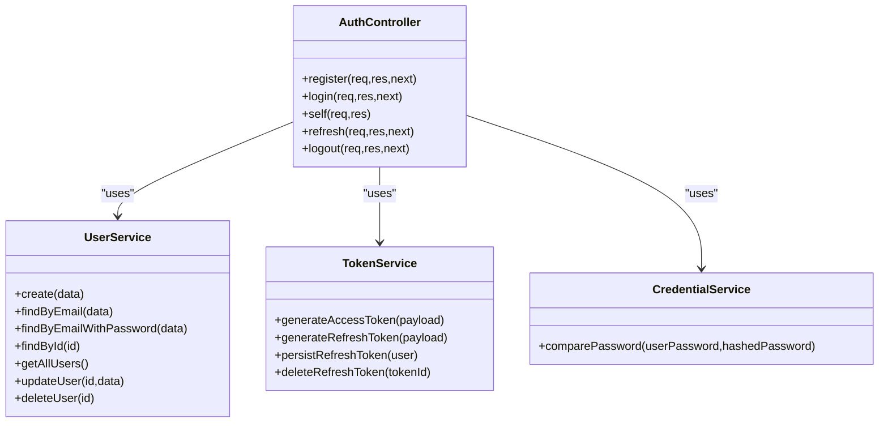
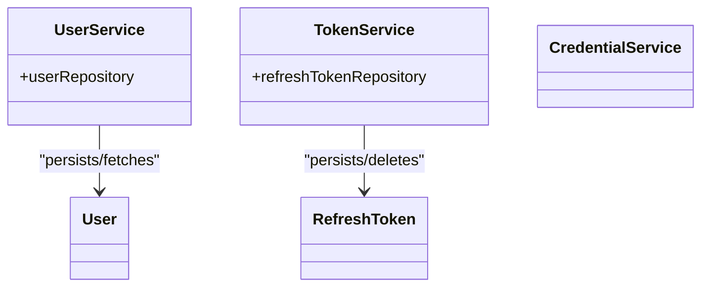
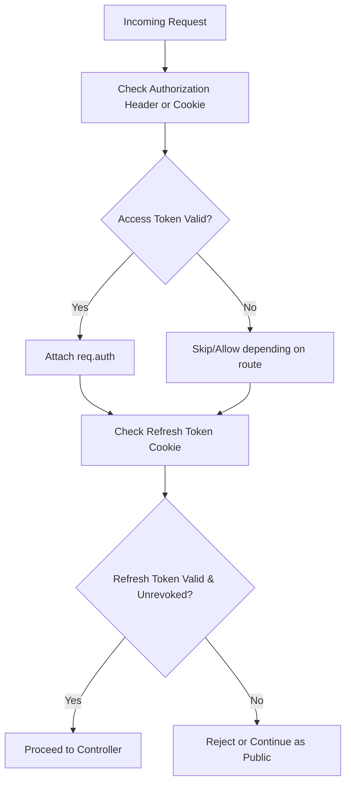
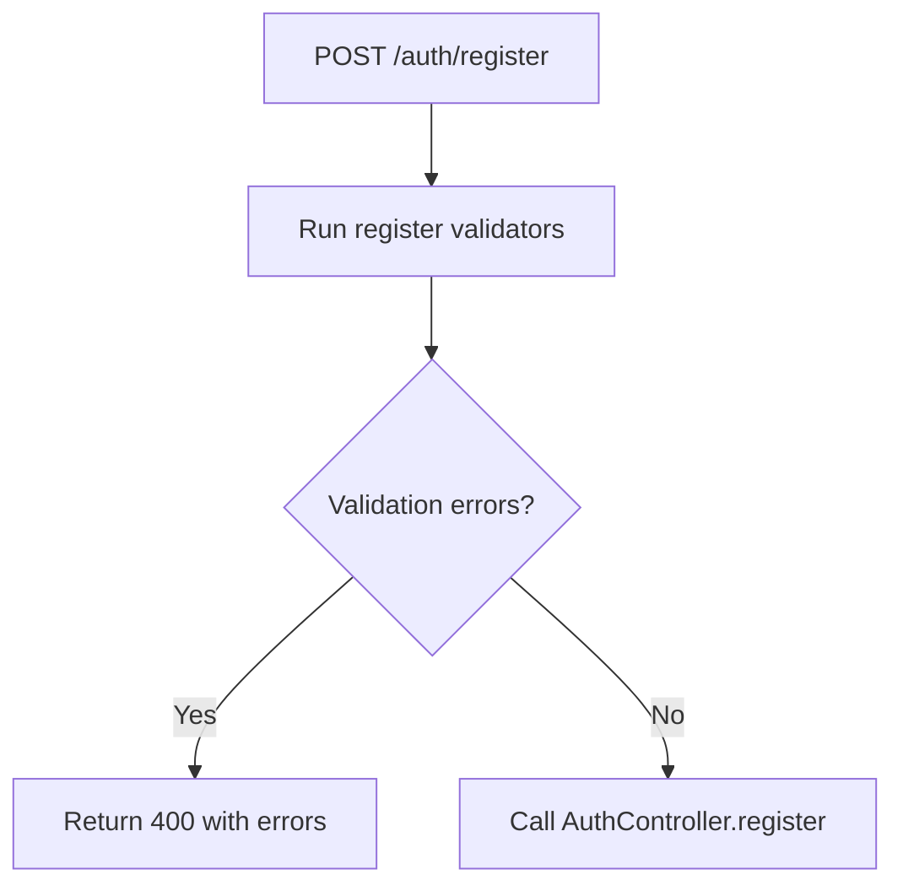
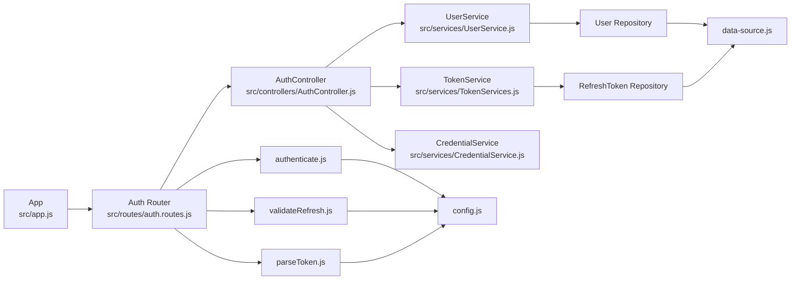

# Component Relationships

<cite>
**Referenced Files in This Document**
- [src/app.js](file://src/app.js)
- [src/server.js](file://src/server.js)
- [src/routes/auth.routes.js](file://src/routes/auth.routes.js)
- [src/controllers/AuthController.js](file://src/controllers/AuthController.js)
- [src/services/UserService.js](file://src/services/UserService.js)
- [src/services/TokenServices.js](file://src/services/TokenServices.js)
- [src/services/CredentialService.js](file://src/services/CredentialService.js)
- [src/middleware/authenticate.js](file://src/middleware/authenticate.js)
- [src/middleware/validateRefresh.js](file://src/middleware/validateRefresh.js)
- [src/middleware/parseToken.js](file://src/middleware/parseToken.js)
- [src/config/data-source.js](file://src/config/data-source.js)
- [src/config/config.js](file://src/config/config.js)
- [src/entity/User.js](file://src/entity/User.js)
- [src/entity/RefreshToken.js](file://src/entity/RefreshToken.js)
- [src/validators/register-validators.js](file://src/validators/register-validators.js)
</cite>

## Table of Contents
1. [Introduction](#introduction)
2. [Project Structure](#project-structure)
3. [Core Components](#core-components)
4. [Architecture Overview](#architecture-overview)
5. [Detailed Component Analysis](#detailed-component-analysis)
6. [Dependency Analysis](#dependency-analysis)
7. [Performance Considerations](#performance-considerations)
8. [Troubleshooting Guide](#troubleshooting-guide)
9. [Conclusion](#conclusion)

## Introduction
This document explains how the authentication service organizes its components and manages dependencies across controllers, services, repositories, middleware, and routing. It also documents how the Express application orchestrates these relationships, the request processing flow from HTTP request through middleware to controller execution, and how dependency injection is applied at route initialization. Finally, it covers circular dependency prevention and component lifecycle management.

## Project Structure
The project follows a layered architecture:
- Express application bootstrapped in the server module initializes the data source and starts the HTTP server.
- Routes define endpoint mappings and instantiate controllers with their dependencies.
- Controllers depend on services for business logic.
- Services depend on repositories (TypeORM) for persistence.
- Middleware validates tokens and parses tokens before controllers execute.
- Validators enforce request schema before controllers receive the request.

**Diagram sources**
- [src/server.js:1-21](file://src/server.js#L1-L21)
- [src/app.js:1-40](file://src/app.js#L1-L40)
- [src/routes/auth.routes.js:1-49](file://src/routes/auth.routes.js#L1-L49)
- [src/controllers/AuthController.js:1-212](file://src/controllers/AuthController.js#L1-L212)
- [src/services/UserService.js:1-99](file://src/services/UserService.js#L1-L99)
- [src/services/TokenServices.js:1-60](file://src/services/TokenServices.js#L1-L60)
- [src/services/CredentialService.js:1-7](file://src/services/CredentialService.js#L1-L7)
- [src/middleware/authenticate.js:1-26](file://src/middleware/authenticate.js#L1-L26)
- [src/middleware/validateRefresh.js:1-34](file://src/middleware/validateRefresh.js#L1-L34)
- [src/middleware/parseToken.js:1-14](file://src/middleware/parseToken.js#L1-L14)
- [src/config/data-source.js:1-22](file://src/config/data-source.js#L1-L22)
- [src/config/config.js:1-34](file://src/config/config.js#L1-L34)
- [src/entity/User.js:1-50](file://src/entity/User.js#L1-L50)
- [src/entity/RefreshToken.js:1-35](file://src/entity/RefreshToken.js#L1-L35)

**Section sources**
- [src/server.js:1-21](file://src/server.js#L1-L21)
- [src/app.js:1-40](file://src/app.js#L1-L40)
- [src/config/data-source.js:1-22](file://src/config/data-source.js#L1-L22)

## Core Components
- Express Application: Initializes middleware, static assets, routes, and global error handler.
- Routes: Define endpoints and construct controller instances with injected dependencies.
- Controllers: Handle HTTP requests, delegate to services, and manage cookies.
- Services: Encapsulate business logic and coordinate with repositories.
- Repositories: Managed by TypeORM via a shared data source.
- Middleware: Validates JWTs and parses tokens from headers or cookies.
- Validators: Enforce request schema before controller execution.
- Configuration: Loads environment variables and exposes runtime settings.

**Section sources**
- [src/app.js:1-40](file://src/app.js#L1-L40)
- [src/routes/auth.routes.js:1-49](file://src/routes/auth.routes.js#L1-L49)
- [src/controllers/AuthController.js:1-212](file://src/controllers/AuthController.js#L1-L212)
- [src/services/UserService.js:1-99](file://src/services/UserService.js#L1-L99)
- [src/services/TokenServices.js:1-60](file://src/services/TokenServices.js#L1-L60)
- [src/middleware/authenticate.js:1-26](file://src/middleware/authenticate.js#L1-L26)
- [src/middleware/validateRefresh.js:1-34](file://src/middleware/validateRefresh.js#L1-L34)
- [src/middleware/parseToken.js:1-14](file://src/middleware/parseToken.js#L1-L14)
- [src/validators/register-validators.js:1-47](file://src/validators/register-validators.js#L1-L47)
- [src/config/config.js:1-34](file://src/config/config.js#L1-L34)

## Architecture Overview
The Express application composes middleware, routes, and controllers. Routes instantiate services and repositories and bind them to the controller. Controllers call services, which in turn use repositories for persistence. Middleware runs before controllers to validate tokens and parse claims.

**Diagram sources**
- [src/app.js:1-40](file://src/app.js#L1-L40)
- [src/routes/auth.routes.js:1-49](file://src/routes/auth.routes.js#L1-L49)
- [src/middleware/authenticate.js:1-26](file://src/middleware/authenticate.js#L1-L26)
- [src/middleware/validateRefresh.js:1-34](file://src/middleware/validateRefresh.js#L1-L34)
- [src/middleware/parseToken.js:1-14](file://src/middleware/parseToken.js#L1-L14)
- [src/controllers/AuthController.js:1-212](file://src/controllers/AuthController.js#L1-L212)
- [src/services/UserService.js:1-99](file://src/services/UserService.js#L1-L99)
- [src/services/TokenServices.js:1-60](file://src/services/TokenServices.js#L1-L60)
- [src/config/data-source.js:1-22](file://src/config/data-source.js#L1-L22)

## Detailed Component Analysis

### Routing and Dependency Injection
- The router constructs repositories from the shared data source, instantiates services with repositories, and creates the controller with services and logger.
- Validators are attached to specific routes to enforce schema before controller execution.
- Authentication middleware is applied selectively to protected endpoints.

**Diagram sources**
- [src/routes/auth.routes.js:17-27](file://src/routes/auth.routes.js#L17-L27)

**Section sources**
- [src/routes/auth.routes.js:1-49](file://src/routes/auth.routes.js#L1-L49)

### Controller Responsibilities
- Registration: Validates schema, delegates to UserService to create a user, persists a refresh token via TokenService, generates access and refresh tokens, sets cookies, and logs success.
- Login: Validates schema, finds user with password, compares credentials, persists refresh token, generates tokens, sets cookies, and logs success.
- Self: Reads authenticated user ID from request and fetches profile via UserService.
- Refresh: Validates refresh token, rotates tokens, deletes old refresh token, and returns new tokens.
- Logout: Parses token, deletes refresh token, clears cookies, and returns success.

**Diagram sources**
- [src/controllers/AuthController.js:5-212](file://src/controllers/AuthController.js#L5-L212)
- [src/services/UserService.js:3-99](file://src/services/UserService.js#L3-L99)
- [src/services/TokenServices.js:8-60](file://src/services/TokenServices.js#L8-L60)
- [src/services/CredentialService.js:2-7](file://src/services/CredentialService.js#L2-L7)

**Section sources**
- [src/controllers/AuthController.js:19-212](file://src/controllers/AuthController.js#L19-L212)

### Service Layer and Repository Dependencies
- UserService depends on a repository abstraction (TypeORM) to perform CRUD operations and queries with password included when needed.
- TokenService depends on RefreshToken repository to persist and revoke refresh tokens and to sign access and refresh tokens using configured secrets and keys.
- CredentialService encapsulates password comparison using bcrypt.

**Diagram sources**
- [src/services/UserService.js:4-6](file://src/services/UserService.js#L4-L6)
- [src/services/TokenServices.js:9-11](file://src/services/TokenServices.js#L9-L11)
- [src/entity/User.js:3-49](file://src/entity/User.js#L3-L49)
- [src/entity/RefreshToken.js:3-34](file://src/entity/RefreshToken.js#L3-L34)

**Section sources**
- [src/services/UserService.js:1-99](file://src/services/UserService.js#L1-L99)
- [src/services/TokenServices.js:1-60](file://src/services/TokenServices.js#L1-L60)
- [src/entity/User.js:1-50](file://src/entity/User.js#L1-L50)
- [src/entity/RefreshToken.js:1-35](file://src/entity/RefreshToken.js#L1-L35)

### Middleware Processing
- Authenticate middleware validates access tokens using JWKS and attaches decoded claims to req.auth.
- ValidateRefresh middleware validates refresh tokens using a symmetric secret and checks revocation against persisted tokens.
- ParseToken middleware extracts refresh tokens from cookies for logout.

**Diagram sources**
- [src/middleware/authenticate.js:6-25](file://src/middleware/authenticate.js#L6-L25)
- [src/middleware/validateRefresh.js:7-31](file://src/middleware/validateRefresh.js#L7-L31)
- [src/middleware/parseToken.js:4-11](file://src/middleware/parseToken.js#L4-L11)

**Section sources**
- [src/middleware/authenticate.js:1-26](file://src/middleware/authenticate.js#L1-L26)
- [src/middleware/validateRefresh.js:1-34](file://src/middleware/validateRefresh.js#L1-L34)
- [src/middleware/parseToken.js:1-14](file://src/middleware/parseToken.js#L1-L14)

### Validation Pipeline
- Route-specific validators enforce schema before controller execution. For example, registration requires firstName, lastName, email, and password with length constraints.

**Diagram sources**
- [src/routes/auth.routes.js:29-31](file://src/routes/auth.routes.js#L29-L31)
- [src/validators/register-validators.js:1-47](file://src/validators/register-validators.js#L1-L47)

**Section sources**
- [src/routes/auth.routes.js:7-8](file://src/routes/auth.routes.js#L7-L8)
- [src/validators/register-validators.js:1-47](file://src/validators/register-validators.js#L1-L47)

## Dependency Analysis
- Controllers depend on services for business logic.
- Services depend on repositories for persistence.
- Routes construct services and repositories and inject them into controllers.
- Middleware depends on configuration for secrets and algorithms.
- Global error handler centralizes error responses.

**Diagram sources**
- [src/app.js:1-40](file://src/app.js#L1-L40)
- [src/routes/auth.routes.js:1-49](file://src/routes/auth.routes.js#L1-L49)
- [src/controllers/AuthController.js:1-212](file://src/controllers/AuthController.js#L1-L212)
- [src/services/UserService.js:1-99](file://src/services/UserService.js#L1-L99)
- [src/services/TokenServices.js:1-60](file://src/services/TokenServices.js#L1-L60)
- [src/services/CredentialService.js:1-7](file://src/services/CredentialService.js#L1-L7)
- [src/middleware/authenticate.js:1-26](file://src/middleware/authenticate.js#L1-L26)
- [src/middleware/validateRefresh.js:1-34](file://src/middleware/validateRefresh.js#L1-L34)
- [src/middleware/parseToken.js:1-14](file://src/middleware/parseToken.js#L1-L14)
- [src/config/config.js:1-34](file://src/config/config.js#L1-L34)
- [src/config/data-source.js:1-22](file://src/config/data-source.js#L1-L22)

**Section sources**
- [src/app.js:1-40](file://src/app.js#L1-L40)
- [src/routes/auth.routes.js:1-49](file://src/routes/auth.routes.js#L1-L49)
- [src/config/data-source.js:1-22](file://src/config/data-source.js#L1-L22)

## Performance Considerations
- Token generation and validation: Access tokens are signed with RSA; ensure private key availability and avoid repeated reads by caching where appropriate.
- Password hashing: Use a reasonable cost factor to balance security and performance.
- Middleware order: Keep validation and parsing early to fail fast and reduce unnecessary work.
- Database synchronization: Disable automatic schema sync in production; use migrations for controlled schema changes.

[No sources needed since this section provides general guidance]

## Troubleshooting Guide
- Global error handler logs and returns structured errors with status codes derived from thrown errors.
- Middleware logs refresh token retrieval failures for diagnostics.
- Ensure environment variables are loaded correctly for secrets and JWKS URI.

**Section sources**
- [src/app.js:24-37](file://src/app.js#L24-L37)
- [src/middleware/validateRefresh.js:27-27](file://src/middleware/validateRefresh.js#L27-L27)
- [src/config/config.js:7-9](file://src/config/config.js#L7-L9)

## Conclusion
The authentication service employs a clean separation of concerns: routes orchestrate dependency instantiation, controllers handle HTTP concerns, services encapsulate business logic, and repositories manage persistence. Middleware enforces security preconditions, while validators ensure request correctness. The Express application wires everything together, and the data source centralizes database configuration. This design supports maintainability, testability, and scalability.