# Data Flow and Processing

<cite>
**Referenced Files in This Document**
- [src/app.js](file://src/app.js)
- [src/server.js](file://src/server.js)
- [src/routes/auth.routes.js](file://src/routes/auth.routes.js)
- [src/middleware/authenticate.js](file://src/middleware/authenticate.js)
- [src/middleware/validateRefresh.js](file://src/middleware/validateRefresh.js)
- [src/middleware/parseToken.js](file://src/middleware/parseToken.js)
- [src/validators/register-validators.js](file://src/validators/register-validators.js)
- [src/validators/login-validators.js](file://src/validators/login-validators.js)
- [src/controllers/AuthController.js](file://src/controllers/AuthController.js)
- [src/services/UserService.js](file://src/services/UserService.js)
- [src/services/TokenServices.js](file://src/services/TokenServices.js)
- [src/services/CredentialService.js](file://src/services/CredentialService.js)
- [src/config/config.js](file://src/config/config.js)
- [package.json](file://package.json)
- [src/test/users/register.spec.js](file://src/test/users/register.spec.js)
- [src/test/users/login.spec.js](file://src/test/users/login.spec.js)
</cite>

## Table of Contents
1. [Introduction](#introduction)
2. [Project Structure](#project-structure)
3. [Core Components](#core-components)
4. [Architecture Overview](#architecture-overview)
5. [Detailed Component Analysis](#detailed-component-analysis)
6. [Dependency Analysis](#dependency-analysis)
7. [Performance Considerations](#performance-considerations)
8. [Troubleshooting Guide](#troubleshooting-guide)
9. [Conclusion](#conclusion)

## Introduction
This document explains the request processing pipeline and data flow in the authentication service. It covers the middleware chain from Express routing, through authentication and validation middleware, into controller execution, and finally to business logic and database operations. It also documents error propagation through the middleware chain and centralized error handling, along with performance considerations and timeout handling.

## Project Structure
The application is organized around Express routes, middleware, controllers, services, validators, and configuration. The server initializes the database and starts the HTTP listener. Routes define endpoints and attach middleware and controllers. Controllers orchestrate service calls and respond to clients. Services encapsulate business logic and interact with repositories via TypeORM. Validators enforce request schema and produce structured validation errors.

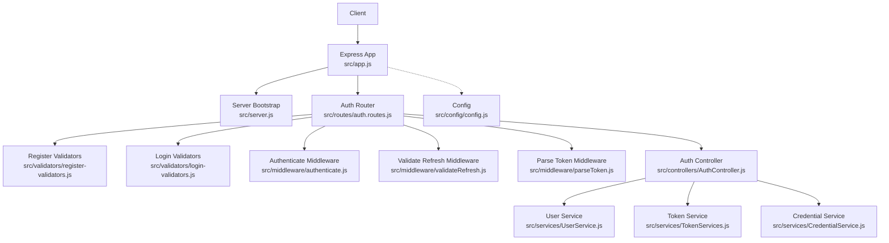

**Diagram sources**
- [src/app.js:1-40](file://src/app.js#L1-L40)
- [src/server.js:1-21](file://src/server.js#L1-L21)
- [src/routes/auth.routes.js:1-49](file://src/routes/auth.routes.js#L1-L49)
- [src/validators/register-validators.js:1-47](file://src/validators/register-validators.js#L1-L47)
- [src/validators/login-validators.js:1-25](file://src/validators/login-validators.js#L1-L25)
- [src/middleware/authenticate.js:1-26](file://src/middleware/authenticate.js#L1-L26)
- [src/middleware/validateRefresh.js:1-34](file://src/middleware/validateRefresh.js#L1-L34)
- [src/middleware/parseToken.js:1-14](file://src/middleware/parseToken.js#L1-L14)
- [src/controllers/AuthController.js:1-212](file://src/controllers/AuthController.js#L1-L212)
- [src/services/UserService.js:1-99](file://src/services/UserService.js#L1-L99)
- [src/services/TokenServices.js:1-60](file://src/services/TokenServices.js#L1-L60)
- [src/services/CredentialService.js:1-7](file://src/services/CredentialService.js#L1-L7)
- [src/config/config.js:1-34](file://src/config/config.js#L1-L34)

**Section sources**
- [src/app.js:1-40](file://src/app.js#L1-L40)
- [src/server.js:1-21](file://src/server.js#L1-L21)
- [src/routes/auth.routes.js:1-49](file://src/routes/auth.routes.js#L1-L49)

## Core Components
- Express application and global middleware: JSON parsing, cookie parsing, static assets, and a global error handler.
- Server bootstrap: Initializes the database and starts the HTTP server.
- Authentication router: Defines endpoints for registration, login, self info, token refresh, and logout, attaching appropriate middleware and validators.
- Middleware:
  - Authentication middleware validates access tokens via JWKS.
  - Refresh token validation checks revocation and extracts payload.
  - Token parsing middleware extracts refresh tokens for logout.
- Validators: Schema-based validation for registration and login payloads.
- Controller: Orchestrates validation, service calls, token generation, cookie setting, and responses.
- Services:
  - User service handles user creation, retrieval, updates, and deletions with database operations.
  - Token service generates access and refresh tokens and persists refresh tokens.
  - Credential service compares passwords using bcrypt.
- Configuration: Loads environment variables for ports, database, secrets, and JWKS URI.

**Section sources**
- [src/app.js:1-40](file://src/app.js#L1-L40)
- [src/server.js:1-21](file://src/server.js#L1-L21)
- [src/routes/auth.routes.js:1-49](file://src/routes/auth.routes.js#L1-L49)
- [src/middleware/authenticate.js:1-26](file://src/middleware/authenticate.js#L1-L26)
- [src/middleware/validateRefresh.js:1-34](file://src/middleware/validateRefresh.js#L1-L34)
- [src/middleware/parseToken.js:1-14](file://src/middleware/parseToken.js#L1-L14)
- [src/validators/register-validators.js:1-47](file://src/validators/register-validators.js#L1-L47)
- [src/validators/login-validators.js:1-25](file://src/validators/login-validators.js#L1-L25)
- [src/controllers/AuthController.js:1-212](file://src/controllers/AuthController.js#L1-L212)
- [src/services/UserService.js:1-99](file://src/services/UserService.js#L1-L99)
- [src/services/TokenServices.js:1-60](file://src/services/TokenServices.js#L1-L60)
- [src/services/CredentialService.js:1-7](file://src/services/CredentialService.js#L1-L7)
- [src/config/config.js:1-34](file://src/config/config.js#L1-L34)

## Architecture Overview
The request lifecycle begins at the Express app, which mounts routers and applies global middleware. Route handlers apply validators and middleware before invoking controllers. Controllers call services for business logic and database operations, then format responses and set cookies. Errors are handled centrally by a global error handler.

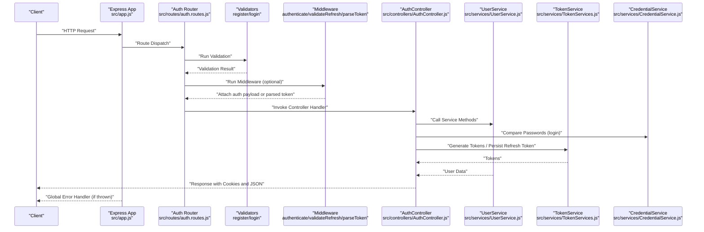

**Diagram sources**
- [src/app.js:1-40](file://src/app.js#L1-L40)
- [src/routes/auth.routes.js:1-49](file://src/routes/auth.routes.js#L1-L49)
- [src/validators/register-validators.js:1-47](file://src/validators/register-validators.js#L1-L47)
- [src/validators/login-validators.js:1-25](file://src/validators/login-validators.js#L1-L25)
- [src/middleware/authenticate.js:1-26](file://src/middleware/authenticate.js#L1-L26)
- [src/middleware/validateRefresh.js:1-34](file://src/middleware/validateRefresh.js#L1-L34)
- [src/middleware/parseToken.js:1-14](file://src/middleware/parseToken.js#L1-L14)
- [src/controllers/AuthController.js:1-212](file://src/controllers/AuthController.js#L1-L212)
- [src/services/UserService.js:1-99](file://src/services/UserService.js#L1-L99)
- [src/services/TokenServices.js:1-60](file://src/services/TokenServices.js#L1-L60)
- [src/services/CredentialService.js:1-7](file://src/services/CredentialService.js#L1-L7)

## Detailed Component Analysis

### Registration Flow
- Route: POST /auth/register
- Middleware and validators:
  - Applies registration validators to enforce schema and constraints.
- Controller:
  - Extracts fields from request body.
  - Runs validation and returns structured errors if invalid.
  - Calls user service to create a user with hashed password.
  - Generates and persists refresh token, then creates access and refresh JWTs.
  - Sets secure cookies for tokens and responds with user ID.
- Services:
  - UserService creates the user and hashes the password.
  - TokenService generates and persists refresh tokens.

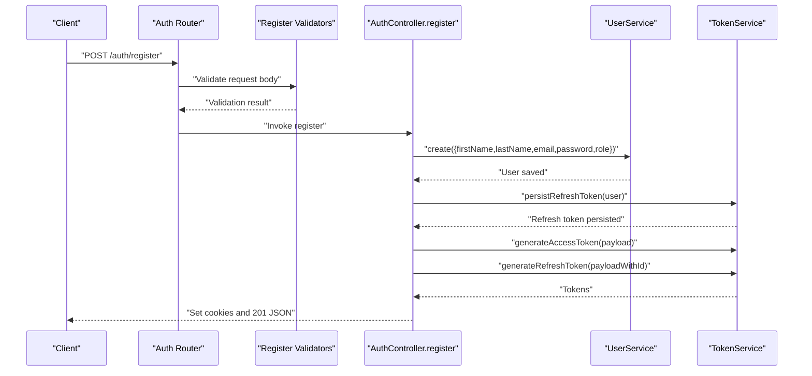

**Diagram sources**
- [src/routes/auth.routes.js:29-31](file://src/routes/auth.routes.js#L29-L31)
- [src/validators/register-validators.js:1-47](file://src/validators/register-validators.js#L1-L47)
- [src/controllers/AuthController.js:19-70](file://src/controllers/AuthController.js#L19-L70)
- [src/services/UserService.js:7-38](file://src/services/UserService.js#L7-L38)
- [src/services/TokenServices.js:45-52](file://src/services/TokenServices.js#L45-L52)

**Section sources**
- [src/routes/auth.routes.js:29-31](file://src/routes/auth.routes.js#L29-L31)
- [src/validators/register-validators.js:1-47](file://src/validators/register-validators.js#L1-L47)
- [src/controllers/AuthController.js:19-70](file://src/controllers/AuthController.js#L19-L70)
- [src/services/UserService.js:7-38](file://src/services/UserService.js#L7-L38)
- [src/services/TokenServices.js:45-52](file://src/services/TokenServices.js#L45-L52)

### Login Flow
- Route: POST /auth/login
- Middleware and validators:
  - Applies login validators to enforce schema and constraints.
- Controller:
  - Extracts email and password from request body.
  - Validates inputs; returns structured errors if invalid.
  - Finds user by email with password included.
  - Compares password using credential service.
  - Generates and persists refresh token, then creates access and refresh JWTs.
  - Sets secure cookies for tokens and responds with user ID.
- Services:
  - UserService retrieves user with password for comparison.
  - CredentialService compares plaintext password against stored hash.
  - TokenService generates and persists refresh tokens.

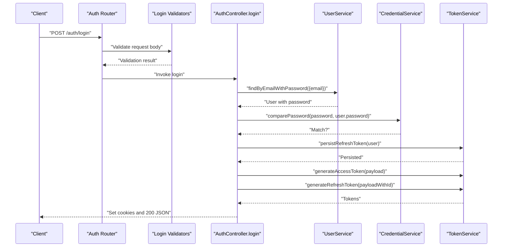

**Diagram sources**
- [src/routes/auth.routes.js:33-35](file://src/routes/auth.routes.js#L33-L35)
- [src/validators/login-validators.js:1-25](file://src/validators/login-validators.js#L1-L25)
- [src/controllers/AuthController.js:72-136](file://src/controllers/AuthController.js#L72-L136)
- [src/services/UserService.js:48-54](file://src/services/UserService.js#L48-L54)
- [src/services/CredentialService.js:3-5](file://src/services/CredentialService.js#L3-L5)
- [src/services/TokenServices.js:45-52](file://src/services/TokenServices.js#L45-L52)

**Section sources**
- [src/routes/auth.routes.js:33-35](file://src/routes/auth.routes.js#L33-L35)
- [src/validators/login-validators.js:1-25](file://src/validators/login-validators.js#L1-L25)
- [src/controllers/AuthController.js:72-136](file://src/controllers/AuthController.js#L72-L136)
- [src/services/UserService.js:48-54](file://src/services/UserService.js#L48-L54)
- [src/services/CredentialService.js:3-5](file://src/services/CredentialService.js#L3-L5)
- [src/services/TokenServices.js:45-52](file://src/services/TokenServices.js#L45-L52)

### Self Info Flow
- Route: GET /auth/self
- Middleware:
  - Uses authenticate middleware to validate access token and attach decoded payload to request.
- Controller:
  - Reads authenticated user ID from request and fetches user details from database.
  - Responds with user data.

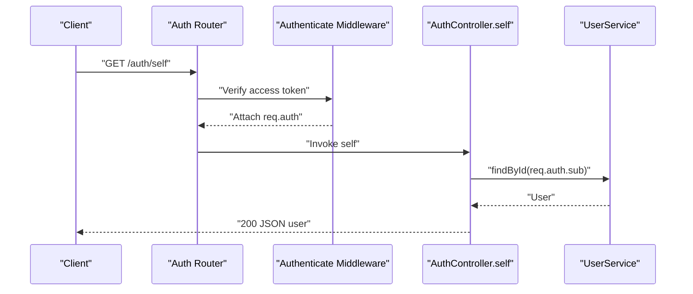

**Diagram sources**
- [src/routes/auth.routes.js:37-39](file://src/routes/auth.routes.js#L37-L39)
- [src/middleware/authenticate.js:6-25](file://src/middleware/authenticate.js#L6-L25)
- [src/controllers/AuthController.js:138-141](file://src/controllers/AuthController.js#L138-L141)
- [src/services/UserService.js:56-62](file://src/services/UserService.js#L56-L62)

**Section sources**
- [src/routes/auth.routes.js:37-39](file://src/routes/auth.routes.js#L37-L39)
- [src/middleware/authenticate.js:6-25](file://src/middleware/authenticate.js#L6-L25)
- [src/controllers/AuthController.js:138-141](file://src/controllers/AuthController.js#L138-L141)
- [src/services/UserService.js:56-62](file://src/services/UserService.js#L56-L62)

### Token Refresh Flow
- Route: POST /auth/refresh
- Middleware:
  - Uses validateRefresh middleware to verify refresh token and ensure it is not revoked.
- Controller:
  - Rebuilds payload from request auth and fetches user.
  - Persists a new refresh token, deletes the old one, and generates new access and refresh tokens.
  - Sets secure cookies and responds with user ID.

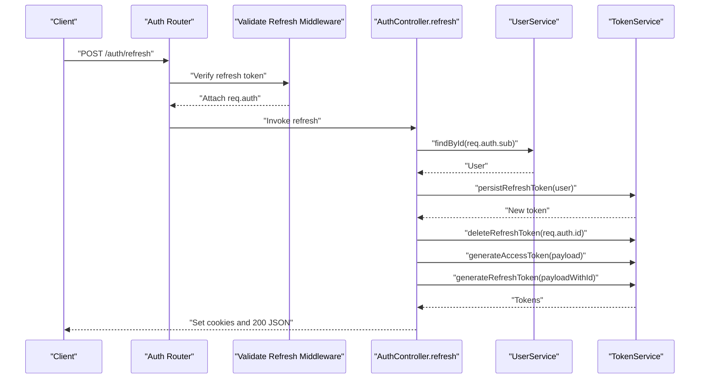

**Diagram sources**
- [src/routes/auth.routes.js:41-43](file://src/routes/auth.routes.js#L41-L43)
- [src/middleware/validateRefresh.js:7-31](file://src/middleware/validateRefresh.js#L7-L31)
- [src/controllers/AuthController.js:143-192](file://src/controllers/AuthController.js#L143-L192)
- [src/services/UserService.js:56-62](file://src/services/UserService.js#L56-L62)
- [src/services/TokenServices.js:54-58](file://src/services/TokenServices.js#L54-L58)

**Section sources**
- [src/routes/auth.routes.js:41-43](file://src/routes/auth.routes.js#L41-L43)
- [src/middleware/validateRefresh.js:7-31](file://src/middleware/validateRefresh.js#L7-L31)
- [src/controllers/AuthController.js:143-192](file://src/controllers/AuthController.js#L143-L192)
- [src/services/UserService.js:56-62](file://src/services/UserService.js#L56-L62)
- [src/services/TokenServices.js:54-58](file://src/services/TokenServices.js#L54-L58)

### Logout Flow
- Route: POST /auth/logout
- Middleware:
  - Uses parseToken middleware to extract refresh token from cookies.
- Controller:
  - Deletes refresh token from database and clears access and refresh cookies.
  - Responds with success message.

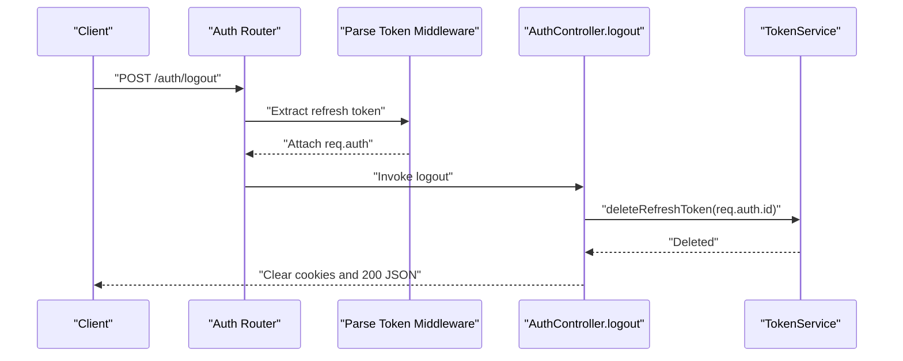

**Diagram sources**
- [src/routes/auth.routes.js:44-46](file://src/routes/auth.routes.js#L44-L46)
- [src/middleware/parseToken.js:4-11](file://src/middleware/parseToken.js#L4-L11)
- [src/controllers/AuthController.js:194-210](file://src/controllers/AuthController.js#L194-L210)
- [src/services/TokenServices.js:54-58](file://src/services/TokenServices.js#L54-L58)

**Section sources**
- [src/routes/auth.routes.js:44-46](file://src/routes/auth.routes.js#L44-L46)
- [src/middleware/parseToken.js:4-11](file://src/middleware/parseToken.js#L4-L11)
- [src/controllers/AuthController.js:194-210](file://src/controllers/AuthController.js#L194-L210)
- [src/services/TokenServices.js:54-58](file://src/services/TokenServices.js#L54-L58)

### Validation Flow
- Registration and login endpoints use express-validator schema checks to validate request bodies.
- Validation errors are collected and returned as structured JSON with an errors array.

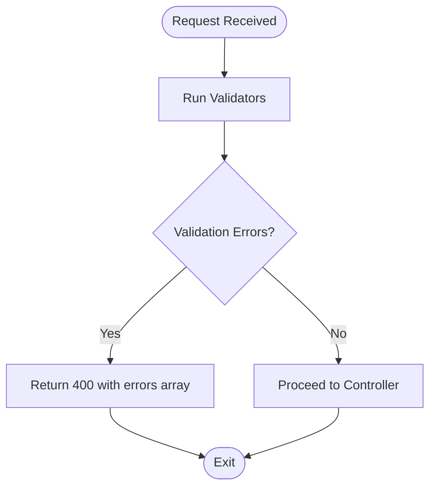

**Diagram sources**
- [src/validators/register-validators.js:1-47](file://src/validators/register-validators.js#L1-L47)
- [src/validators/login-validators.js:1-25](file://src/validators/login-validators.js#L1-L25)
- [src/controllers/AuthController.js:23-26](file://src/controllers/AuthController.js#L23-L26)
- [src/controllers/AuthController.js:76-79](file://src/controllers/AuthController.js#L76-L79)

**Section sources**
- [src/validators/register-validators.js:1-47](file://src/validators/register-validators.js#L1-L47)
- [src/validators/login-validators.js:1-25](file://src/validators/login-validators.js#L1-L25)
- [src/controllers/AuthController.js:23-26](file://src/controllers/AuthController.js#L23-L26)
- [src/controllers/AuthController.js:76-79](file://src/controllers/AuthController.js#L76-L79)

### Authentication and Token Middleware
- Access token validation:
  - Uses express-jwt with jwks-rsa to validate RS256 tokens from Authorization header or accessToken cookie.
- Refresh token validation:
  - Uses express-jwt with HS256 secret to validate refresh tokens from refreshToken cookie.
  - Checks revocation by querying persisted refresh tokens.
- Token parsing:
  - Extracts refresh token from cookies for logout endpoint.

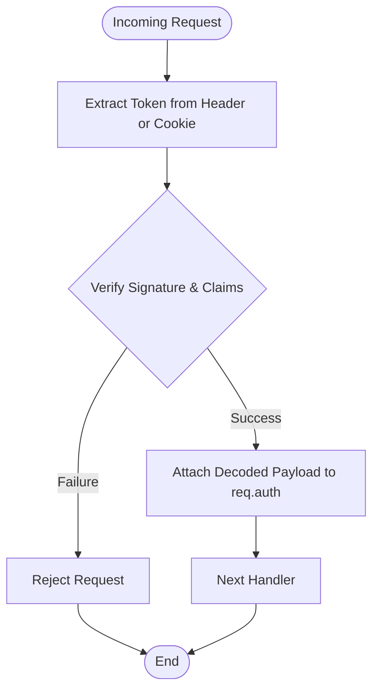

**Diagram sources**
- [src/middleware/authenticate.js:6-25](file://src/middleware/authenticate.js#L6-L25)
- [src/middleware/validateRefresh.js:7-31](file://src/middleware/validateRefresh.js#L7-L31)
- [src/middleware/parseToken.js:4-11](file://src/middleware/parseToken.js#L4-L11)

**Section sources**
- [src/middleware/authenticate.js:6-25](file://src/middleware/authenticate.js#L6-L25)
- [src/middleware/validateRefresh.js:7-31](file://src/middleware/validateRefresh.js#L7-L31)
- [src/middleware/parseToken.js:4-11](file://src/middleware/parseToken.js#L4-L11)

### Error Propagation and Centralized Error Handling
- Controllers catch exceptions and forward them to Express via next().
- Validation failures short-circuit with 400 responses containing structured errors.
- Global error handler logs the error and returns a JSON response with error metadata.
- Services throw HTTP errors for database and cryptographic failures.

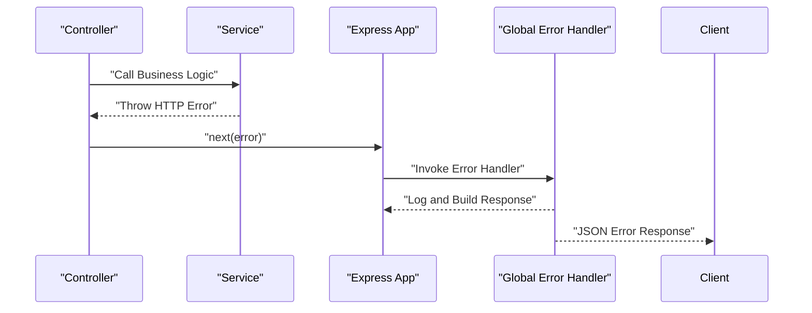

**Diagram sources**
- [src/controllers/AuthController.js:66-69](file://src/controllers/AuthController.js#L66-L69)
- [src/controllers/AuthController.js:88-90](file://src/controllers/AuthController.js#L88-L90)
- [src/controllers/AuthController.js:132-135](file://src/controllers/AuthController.js#L132-L135)
- [src/controllers/AuthController.js:157-159](file://src/controllers/AuthController.js#L157-L159)
- [src/controllers/AuthController.js:206-209](file://src/controllers/AuthController.js#L206-L209)
- [src/app.js:24-37](file://src/app.js#L24-L37)
- [src/services/UserService.js:14-16](file://src/services/UserService.js#L14-L16)
- [src/services/UserService.js:32-37](file://src/services/UserService.js#L32-L37)
- [src/services/TokenServices.js:20-23](file://src/services/TokenServices.js#L20-L23)

**Section sources**
- [src/controllers/AuthController.js:66-69](file://src/controllers/AuthController.js#L66-L69)
- [src/controllers/AuthController.js:88-90](file://src/controllers/AuthController.js#L88-L90)
- [src/controllers/AuthController.js:132-135](file://src/controllers/AuthController.js#L132-L135)
- [src/controllers/AuthController.js:157-159](file://src/controllers/AuthController.js#L157-L159)
- [src/controllers/AuthController.js:206-209](file://src/controllers/AuthController.js#L206-L209)
- [src/app.js:24-37](file://src/app.js#L24-L37)
- [src/services/UserService.js:14-16](file://src/services/UserService.js#L14-L16)
- [src/services/UserService.js:32-37](file://src/services/UserService.js#L32-L37)
- [src/services/TokenServices.js:20-23](file://src/services/TokenServices.js#L20-L23)

## Dependency Analysis
- Express app depends on route modules and global middleware.
- Auth router depends on validators, middleware, and controller instances.
- Controller depends on services and logger.
- Services depend on repositories and external libraries (bcrypt, jsonwebtoken).
- Middleware depends on configuration for secrets and algorithms.
- Global error handler depends on logger.

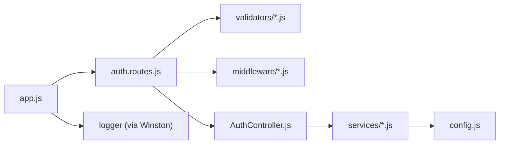

**Diagram sources**
- [src/app.js:1-40](file://src/app.js#L1-L40)
- [src/routes/auth.routes.js:1-49](file://src/routes/auth.routes.js#L1-L49)
- [src/validators/register-validators.js:1-47](file://src/validators/register-validators.js#L1-L47)
- [src/validators/login-validators.js:1-25](file://src/validators/login-validators.js#L1-L25)
- [src/middleware/authenticate.js:1-26](file://src/middleware/authenticate.js#L1-L26)
- [src/middleware/validateRefresh.js:1-34](file://src/middleware/validateRefresh.js#L1-L34)
- [src/middleware/parseToken.js:1-14](file://src/middleware/parseToken.js#L1-L14)
- [src/controllers/AuthController.js:1-212](file://src/controllers/AuthController.js#L1-L212)
- [src/services/UserService.js:1-99](file://src/services/UserService.js#L1-L99)
- [src/services/TokenServices.js:1-60](file://src/services/TokenServices.js#L1-L60)
- [src/services/CredentialService.js:1-7](file://src/services/CredentialService.js#L1-L7)
- [src/config/config.js:1-34](file://src/config/config.js#L1-L34)

**Section sources**
- [src/app.js:1-40](file://src/app.js#L1-L40)
- [src/routes/auth.routes.js:1-49](file://src/routes/auth.routes.js#L1-L49)
- [src/controllers/AuthController.js:1-212](file://src/controllers/AuthController.js#L1-L212)
- [src/services/UserService.js:1-99](file://src/services/UserService.js#L1-L99)
- [src/services/TokenServices.js:1-60](file://src/services/TokenServices.js#L1-L60)
- [src/services/CredentialService.js:1-7](file://src/services/CredentialService.js#L1-L7)
- [src/config/config.js:1-34](file://src/config/config.js#L1-L34)

## Performance Considerations
- Token verification caching:
  - Access token validation uses jwks-rsa with caching enabled to reduce JWKS fetch overhead.
- Algorithm selection:
  - Access tokens use RS256; refresh tokens use HS256 to balance security and performance.
- Cookie security:
  - HttpOnly and SameSite cookies mitigate XSS risks and improve token safety.
- Database operations:
  - Password hashing uses a moderate cost factor; consider tuning for environment-specific latency targets.
- Request timeouts:
  - No explicit timeout handling is present in the current code. Consider adding timeout middleware or configuring server-level timeouts for long-running operations.

**Section sources**
- [src/middleware/authenticate.js:7-11](file://src/middleware/authenticate.js#L7-L11)
- [src/services/TokenServices.js:35-42](file://src/services/TokenServices.js#L35-L42)
- [src/controllers/AuthController.js:50-62](file://src/controllers/AuthController.js#L50-L62)
- [src/controllers/AuthController.js:116-129](file://src/controllers/AuthController.js#L116-L129)
- [src/controllers/AuthController.js:172-184](file://src/controllers/AuthController.js#L172-L184)

## Troubleshooting Guide
- Validation errors:
  - Registration and login endpoints return 400 with a structured errors array when validation fails. Inspect the errors array for field-specific messages.
- Authentication failures:
  - Access token validation errors occur when the token is missing, expired, or invalid. Ensure Authorization header or accessToken cookie is present and valid.
- Refresh token failures:
  - Refresh token validation errors indicate an invalid or revoked token. Confirm the token exists in the refresh token store and is associated with the correct user.
- Database connectivity:
  - Server initialization throws and exits if database initialization fails. Check database credentials and availability.
- Password mismatch:
  - Login returns 400 when email or password does not match. Verify credentials and hashing correctness.
- Token generation errors:
  - Private key file reading failures cause 500 errors during access token generation. Ensure the private key file exists and is readable.

**Section sources**
- [src/controllers/AuthController.js:23-26](file://src/controllers/AuthController.js#L23-L26)
- [src/controllers/AuthController.js:76-79](file://src/controllers/AuthController.js#L76-L79)
- [src/controllers/AuthController.js:86-101](file://src/controllers/AuthController.js#L86-L101)
- [src/middleware/authenticate.js:13-24](file://src/middleware/authenticate.js#L13-L24)
- [src/middleware/validateRefresh.js:14-30](file://src/middleware/validateRefresh.js#L14-L30)
- [src/server.js:8-18](file://src/server.js#L8-L18)
- [src/controllers/AuthController.js:98-101](file://src/controllers/AuthController.js#L98-L101)
- [src/services/TokenServices.js:17-23](file://src/services/TokenServices.js#L17-L23)

## Conclusion
The authentication service implements a clear, layered request processing pipeline. Express routes mount validators and middleware, controllers orchestrate service calls, and services handle persistence and cryptography. Centralized error handling ensures consistent error responses. Performance is optimized through token verification caching and secure cookie practices. Extending the system with explicit request timeouts and environment-aware configurations would further improve robustness and operability.