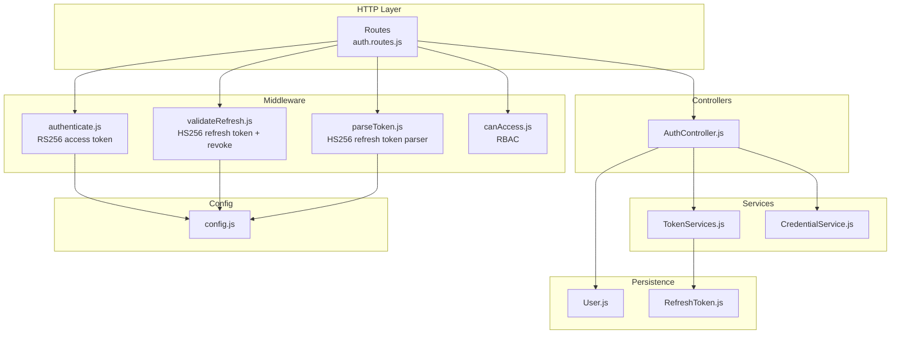
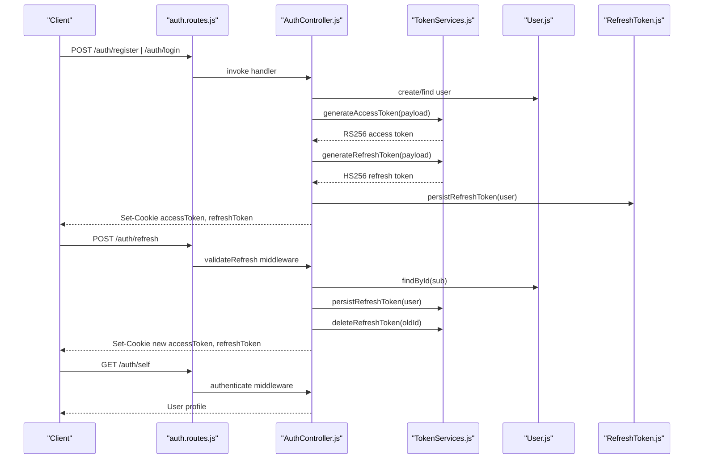
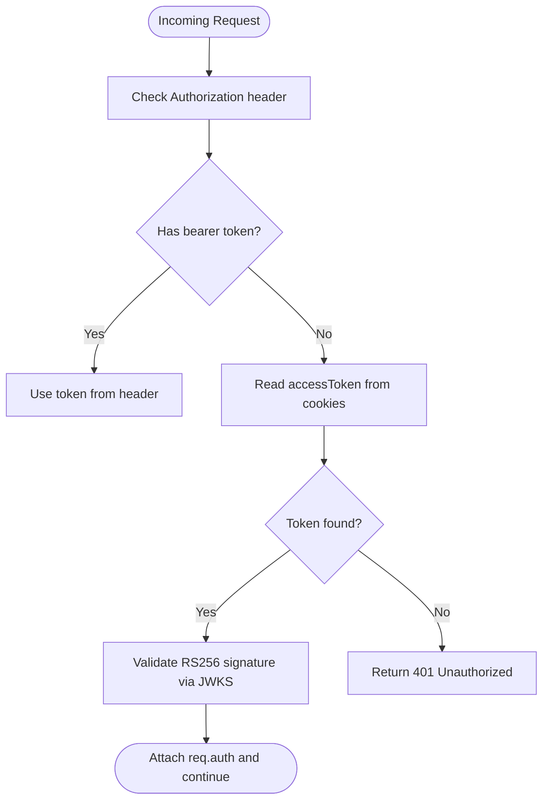
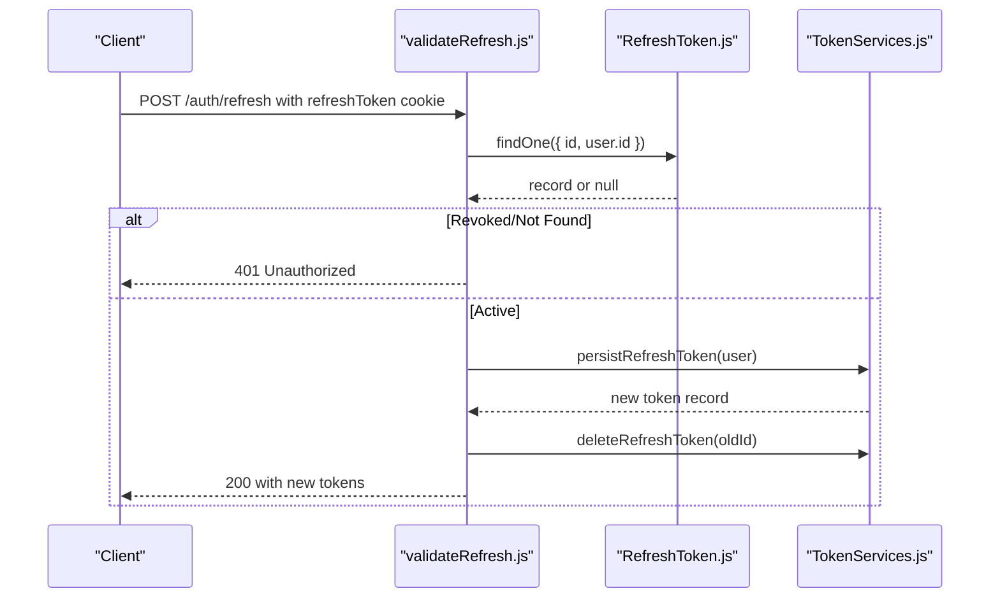
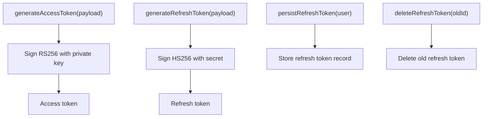
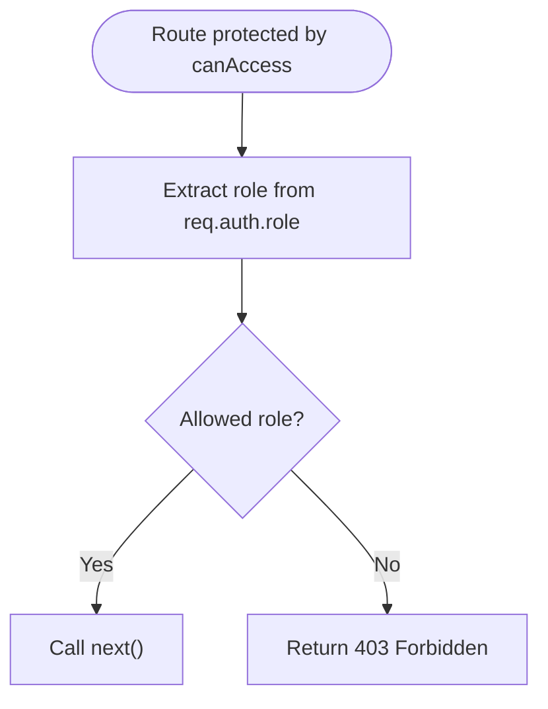
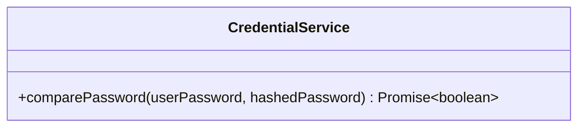
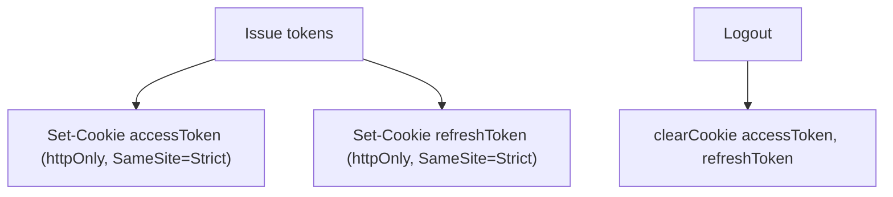
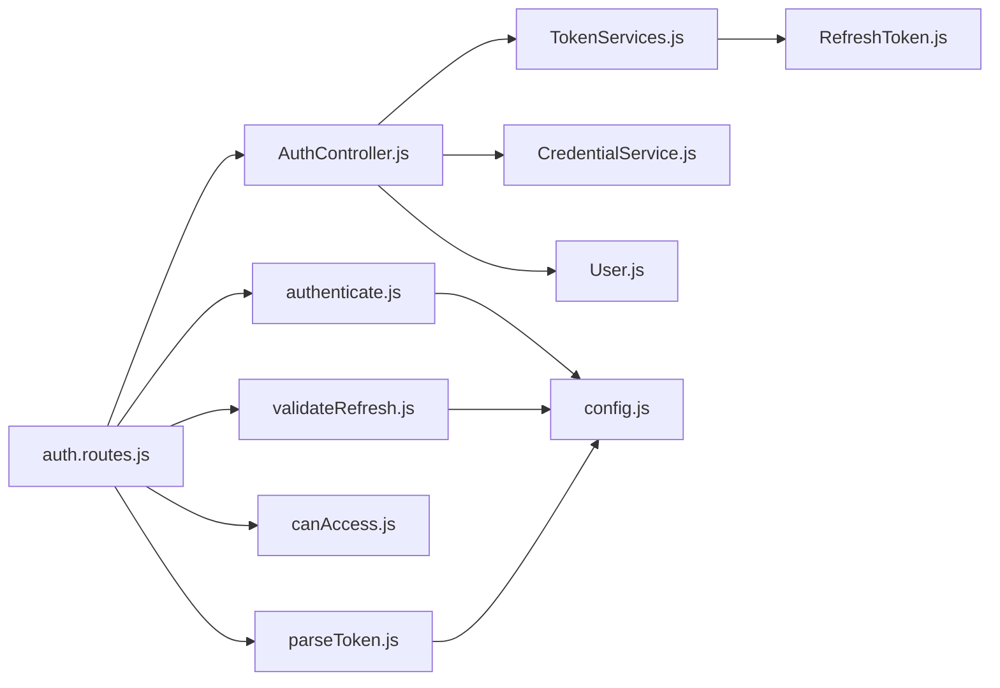

# Security Architecture

<cite>
**Referenced Files in This Document**
- [src/middleware/authenticate.js](file://src/middleware/authenticate.js)
- [src/middleware/canAccess.js](file://src/middleware/canAccess.js)
- [src/middleware/parseToken.js](file://src/middleware/parseToken.js)
- [src/middleware/validateRefresh.js](file://src/middleware/validateRefresh.js)
- [src/services/TokenServices.js](file://src/services/TokenServices.js)
- [src/controllers/AuthController.js](file://src/controllers/AuthController.js)
- [src/routes/auth.routes.js](file://src/routes/auth.routes.js)
- [src/config/config.js](file://src/config/config.js)
- [src/constants/index.js](file://src/constants/index.js)
- [src/entity/User.js](file://src/entity/User.js)
- [src/entity/RefreshToken.js](file://src/entity/RefreshToken.js)
- [src/services/CredentialService.js](file://src/services/CredentialService.js)
- [src/utils/utils.js](file://src/utils/utils.js)
- [src/test/users/login.spec.js](file://src/test/users/login.spec.js)
- [src/test/users/refresh.spec.js](file://src/test/users/refresh.spec.js)
</cite>

## Table of Contents
1. [Introduction](#introduction)
2. [Project Structure](#project-structure)
3. [Core Components](#core-components)
4. [Architecture Overview](#architecture-overview)
5. [Detailed Component Analysis](#detailed-component-analysis)
6. [Dependency Analysis](#dependency-analysis)
7. [Performance Considerations](#performance-considerations)
8. [Troubleshooting Guide](#troubleshooting-guide)
9. [Conclusion](#conclusion)
10. [Appendices](#appendices)

## Introduction
This document describes the security architecture of the authentication service, focusing on JWT-based authentication with RS256 access tokens and HS256 refresh tokens, role-based access control (RBAC), middleware enforcement, secure token storage in cookies, and CSRF-related protections. It also outlines best practices, mitigation strategies for common vulnerabilities, and compliance considerations, along with threat modeling and audit trail guidance.

## Project Structure
Security-critical modules are organized by responsibility:
- Middleware: token parsing, validation, and access control
- Services: token generation, persistence, and credential comparison
- Controllers: authentication endpoints and token lifecycle
- Entities: user and refresh token persistence
- Routes: endpoint exposure and middleware binding
- Configuration: environment-driven secrets and endpoints
- Tests: behavioral verification of authentication and refresh flows

**Diagram sources**
- [src/routes/auth.routes.js:1-49](file://src/routes/auth.routes.js#L1-L49)
- [src/middleware/authenticate.js:1-26](file://src/middleware/authenticate.js#L1-L26)
- [src/middleware/validateRefresh.js:1-34](file://src/middleware/validateRefresh.js#L1-L34)
- [src/middleware/parseToken.js:1-14](file://src/middleware/parseToken.js#L1-L14)
- [src/middleware/canAccess.js:1-23](file://src/middleware/canAccess.js#L1-L23)
- [src/controllers/AuthController.js:1-212](file://src/controllers/AuthController.js#L1-L212)
- [src/services/TokenServices.js:1-60](file://src/services/TokenServices.js#L1-L60)
- [src/services/CredentialService.js:1-7](file://src/services/CredentialService.js#L1-L7)
- [src/entity/User.js:1-50](file://src/entity/User.js#L1-L50)
- [src/entity/RefreshToken.js:1-35](file://src/entity/RefreshToken.js#L1-L35)
- [src/config/config.js:1-34](file://src/config/config.js#L1-L34)

**Section sources**
- [src/routes/auth.routes.js:1-49](file://src/routes/auth.routes.js#L1-L49)
- [src/middleware/authenticate.js:1-26](file://src/middleware/authenticate.js#L1-L26)
- [src/middleware/validateRefresh.js:1-34](file://src/middleware/validateRefresh.js#L1-L34)
- [src/middleware/parseToken.js:1-14](file://src/middleware/parseToken.js#L1-L14)
- [src/middleware/canAccess.js:1-23](file://src/middleware/canAccess.js#L1-L23)
- [src/controllers/AuthController.js:1-212](file://src/controllers/AuthController.js#L1-L212)
- [src/services/TokenServices.js:1-60](file://src/services/TokenServices.js#L1-L60)
- [src/services/CredentialService.js:1-7](file://src/services/CredentialService.js#L1-L7)
- [src/entity/User.js:1-50](file://src/entity/User.js#L1-L50)
- [src/entity/RefreshToken.js:1-35](file://src/entity/RefreshToken.js#L1-L35)
- [src/config/config.js:1-34](file://src/config/config.js#L1-L34)

## Core Components
- Access token validation: RS256 via JWKS, extracted from Authorization header or access cookie
- Refresh token validation: HS256 with revocation against persisted refresh tokens
- Token issuance: RS256 access tokens and HS256 refresh tokens with rotation and persistence
- Role-based access control: role extraction from access token and middleware enforcement
- Secure cookie storage: httpOnly and SameSite strict for both access and refresh tokens
- Password handling: bcrypt-based comparison in credential service

Key implementation references:
- Access token validation and extraction: [src/middleware/authenticate.js:1-26](file://src/middleware/authenticate.js#L1-L26)
- Refresh token parsing and validation: [src/middleware/parseToken.js:1-14](file://src/middleware/parseToken.js#L1-L14), [src/middleware/validateRefresh.js:1-34](file://src/middleware/validateRefresh.js#L1-L34)
- Token generation and persistence: [src/services/TokenServices.js:1-60](file://src/services/TokenServices.js#L1-L60)
- Authentication controller endpoints and cookie setting: [src/controllers/AuthController.js:1-212](file://src/controllers/AuthController.js#L1-L212)
- RBAC middleware: [src/middleware/canAccess.js:1-23](file://src/middleware/canAccess.js#L1-L23)
- Roles definition: [src/constants/index.js:1-6](file://src/constants/index.js#L1-L6)
- Password comparison: [src/services/CredentialService.js:1-7](file://src/services/CredentialService.js#L1-L7)
- Cookie and token configuration: [src/controllers/AuthController.js:50-62](file://src/controllers/AuthController.js#L50-L62), [src/controllers/AuthController.js:115-128](file://src/controllers/AuthController.js#L115-L128), [src/controllers/AuthController.js:171-184](file://src/controllers/AuthController.js#L171-L184)

**Section sources**
- [src/middleware/authenticate.js:1-26](file://src/middleware/authenticate.js#L1-L26)
- [src/middleware/parseToken.js:1-14](file://src/middleware/parseToken.js#L1-L14)
- [src/middleware/validateRefresh.js:1-34](file://src/middleware/validateRefresh.js#L1-L34)
- [src/services/TokenServices.js:1-60](file://src/services/TokenServices.js#L1-L60)
- [src/controllers/AuthController.js:50-62](file://src/controllers/AuthController.js#L50-L62)
- [src/controllers/AuthController.js:115-128](file://src/controllers/AuthController.js#L115-L128)
- [src/controllers/AuthController.js:171-184](file://src/controllers/AuthController.js#L171-L184)
- [src/middleware/canAccess.js:1-23](file://src/middleware/canAccess.js#L1-L23)
- [src/constants/index.js:1-6](file://src/constants/index.js#L1-L6)
- [src/services/CredentialService.js:1-7](file://src/services/CredentialService.js#L1-L7)

## Architecture Overview
The authentication flow integrates token issuance, validation, rotation, and access control across the application.

**Diagram sources**
- [src/routes/auth.routes.js:1-49](file://src/routes/auth.routes.js#L1-L49)
- [src/controllers/AuthController.js:1-212](file://src/controllers/AuthController.js#L1-L212)
- [src/services/TokenServices.js:1-60](file://src/services/TokenServices.js#L1-L60)
- [src/entity/User.js:1-50](file://src/entity/User.js#L1-L50)
- [src/entity/RefreshToken.js:1-35](file://src/entity/RefreshToken.js#L1-L35)

## Detailed Component Analysis

### JWT Access Token Validation (RS256)
- Uses JWKS to fetch public keys and validates RS256 signatures.
- Extracts token from Authorization header or access cookie.
- Enforces algorithm RS256 and caches JWKS for performance.

**Diagram sources**
- [src/middleware/authenticate.js:1-26](file://src/middleware/authenticate.js#L1-L26)

**Section sources**
- [src/middleware/authenticate.js:1-26](file://src/middleware/authenticate.js#L1-L26)

### JWT Refresh Token Validation (HS256) and Revocation
- Parses refresh token from cookie using HS256 secret.
- Validates signature and checks revocation via persisted refresh token records.
- Implements token rotation by deleting the old refresh token and issuing a new one.

**Diagram sources**
- [src/middleware/validateRefresh.js:1-34](file://src/middleware/validateRefresh.js#L1-L34)
- [src/entity/RefreshToken.js:1-35](file://src/entity/RefreshToken.js#L1-L35)
- [src/services/TokenServices.js:1-60](file://src/services/TokenServices.js#L1-L60)

**Section sources**
- [src/middleware/validateRefresh.js:1-34](file://src/middleware/validateRefresh.js#L1-L34)
- [src/entity/RefreshToken.js:1-35](file://src/entity/RefreshToken.js#L1-L35)
- [src/services/TokenServices.js:45-58](file://src/services/TokenServices.js#L45-L58)

### Token Issuance and Rotation
- Access tokens: signed RS256 with private key, short-lived (1 hour), issuer claim included.
- Refresh tokens: signed HS256 with shared secret, long-lived (7 days), JWT ID used for revocation correlation.
- Rotation: old refresh token deleted, new refresh token stored and returned.

**Diagram sources**
- [src/services/TokenServices.js:1-60](file://src/services/TokenServices.js#L1-L60)

**Section sources**
- [src/services/TokenServices.js:12-43](file://src/services/TokenServices.js#L12-L43)
- [src/services/TokenServices.js:45-58](file://src/services/TokenServices.js#L45-L58)

### Role-Based Access Control (RBAC)
- Roles: customer, admin, manager.
- Access token carries role claim; middleware enforces allowed roles per route.
- Non-matching roles result in 403 Forbidden.

**Diagram sources**
- [src/middleware/canAccess.js:1-23](file://src/middleware/canAccess.js#L1-L23)
- [src/constants/index.js:1-6](file://src/constants/index.js#L1-L6)

**Section sources**
- [src/middleware/canAccess.js:1-23](file://src/middleware/canAccess.js#L1-L23)
- [src/constants/index.js:1-6](file://src/constants/index.js#L1-L6)

### Password Hashing with bcrypt
- Password comparison performed using bcrypt.
- Passwords are stored hashed; sensitive fields are not selected by default in queries.

**Diagram sources**
- [src/services/CredentialService.js:1-7](file://src/services/CredentialService.js#L1-L7)
- [src/entity/User.js:23-26](file://src/entity/User.js#L23-L26)

**Section sources**
- [src/services/CredentialService.js:1-7](file://src/services/CredentialService.js#L1-L7)
- [src/entity/User.js:23-26](file://src/entity/User.js#L23-L26)

### Secure Token Storage in Cookies
- Access and refresh tokens stored in httpOnly cookies with SameSite=Strict.
- Max-Age configured for short-lived access and medium-lived refresh.
- Logout clears both cookies.

**Diagram sources**
- [src/controllers/AuthController.js:50-62](file://src/controllers/AuthController.js#L50-L62)
- [src/controllers/AuthController.js:115-128](file://src/controllers/AuthController.js#L115-L128)
- [src/controllers/AuthController.js:171-184](file://src/controllers/AuthController.js#L171-L184)
- [src/controllers/AuthController.js:194-210](file://src/controllers/AuthController.js#L194-L210)

**Section sources**
- [src/controllers/AuthController.js:50-62](file://src/controllers/AuthController.js#L50-L62)
- [src/controllers/AuthController.js:115-128](file://src/controllers/AuthController.js#L115-L128)
- [src/controllers/AuthController.js:171-184](file://src/controllers/AuthController.js#L171-L184)
- [src/controllers/AuthController.js:194-210](file://src/controllers/AuthController.js#L194-L210)

### CSRF Protection Mechanisms
- While CSRF protection is not explicitly implemented in the current code, the use of httpOnly cookies for tokens mitigates cross-site scripting risks. Additional CSRF protection can be achieved via anti-CSRF tokens or origin/Referer validation at the application level.

[No sources needed since this section provides general guidance]

## Dependency Analysis

**Diagram sources**
- [src/routes/auth.routes.js:1-49](file://src/routes/auth.routes.js#L1-L49)
- [src/middleware/authenticate.js:1-26](file://src/middleware/authenticate.js#L1-L26)
- [src/middleware/validateRefresh.js:1-34](file://src/middleware/validateRefresh.js#L1-L34)
- [src/middleware/parseToken.js:1-14](file://src/middleware/parseToken.js#L1-L14)
- [src/middleware/canAccess.js:1-23](file://src/middleware/canAccess.js#L1-L23)
- [src/controllers/AuthController.js:1-212](file://src/controllers/AuthController.js#L1-L212)
- [src/services/TokenServices.js:1-60](file://src/services/TokenServices.js#L1-L60)
- [src/services/CredentialService.js:1-7](file://src/services/CredentialService.js#L1-L7)
- [src/entity/RefreshToken.js:1-35](file://src/entity/RefreshToken.js#L1-L35)
- [src/entity/User.js:1-50](file://src/entity/User.js#L1-L50)
- [src/config/config.js:1-34](file://src/config/config.js#L1-L34)

**Section sources**
- [src/routes/auth.routes.js:1-49](file://src/routes/auth.routes.js#L1-L49)
- [src/middleware/authenticate.js:1-26](file://src/middleware/authenticate.js#L1-L26)
- [src/middleware/validateRefresh.js:1-34](file://src/middleware/validateRefresh.js#L1-L34)
- [src/middleware/parseToken.js:1-14](file://src/middleware/parseToken.js#L1-L14)
- [src/middleware/canAccess.js:1-23](file://src/middleware/canAccess.js#L1-L23)
- [src/controllers/AuthController.js:1-212](file://src/controllers/AuthController.js#L1-L212)
- [src/services/TokenServices.js:1-60](file://src/services/TokenServices.js#L1-L60)
- [src/services/CredentialService.js:1-7](file://src/services/CredentialService.js#L1-L7)
- [src/entity/RefreshToken.js:1-35](file://src/entity/RefreshToken.js#L1-L35)
- [src/entity/User.js:1-50](file://src/entity/User.js#L1-L50)
- [src/config/config.js:1-34](file://src/config/config.js#L1-L34)

## Performance Considerations
- JWKS caching reduces network overhead for RS256 validation.
- Short-lived access tokens minimize risk and reduce validation frequency.
- Refresh token revocation requires a database lookup; ensure indexing on token ID and user ID for performance.
- Cookie-based token storage avoids CORS complexities and reduces client-side memory footprint.

[No sources needed since this section provides general guidance]

## Troubleshooting Guide
Common issues and resolutions:
- 401 Unauthorized on refresh: ensure refresh token exists in the database and matches the user ID; verify HS256 signature and JWT ID.
- 403 Forbidden on protected routes: confirm the access token role claim aligns with allowed roles.
- Cookie not set: verify SameSite and httpOnly flags; ensure domain and path match client expectations.
- Login failures: validate bcrypt password comparison and confirm user exists with hashed password.

Evidence and tests:
- Login and password verification behavior: [src/test/users/login.spec.js:76-90](file://src/test/users/login.spec.js#L76-L90)
- Refresh flow and 401 handling: [src/test/users/refresh.spec.js:99-107](file://src/test/users/refresh.spec.js#L99-L107)

**Section sources**
- [src/test/users/login.spec.js:76-90](file://src/test/users/login.spec.js#L76-L90)
- [src/test/users/refresh.spec.js:99-107](file://src/test/users/refresh.spec.js#L99-L107)

## Conclusion
The service implements a robust JWT-based authentication system with RS256 access tokens and HS256 refresh tokens, complemented by RBAC and secure cookie storage. Token rotation and revocation mitigate session hijacking risks. Additional CSRF safeguards and environment-aware cookie configuration are recommended for production hardening.

[No sources needed since this section summarizes without analyzing specific files]

## Appendices

### Security Best Practices
- Use HTTPS in production to protect cookies and transport.
- Configure domain and SameSite policies aligned with deployment context.
- Monitor and log authentication events for audit trails.
- Regularly rotate signing keys and invalidate compromised refresh tokens.

[No sources needed since this section provides general guidance]

### Compliance Considerations
- Data retention and deletion aligned with privacy regulations.
- Sensitive fields masked in logs; avoid logging raw JWTs.
- Audit all authentication and authorization decisions.

[No sources needed since this section provides general guidance]

### Threat Modeling
- Man-in-the-middle: mitigate via HTTPS and secure cookie flags.
- Session fixation: prevent via token rotation and revocation.
- Brute force: enforce rate limiting and strong password policies.
- CSRF: implement anti-CSRF tokens or origin validation.

[No sources needed since this section provides general guidance]