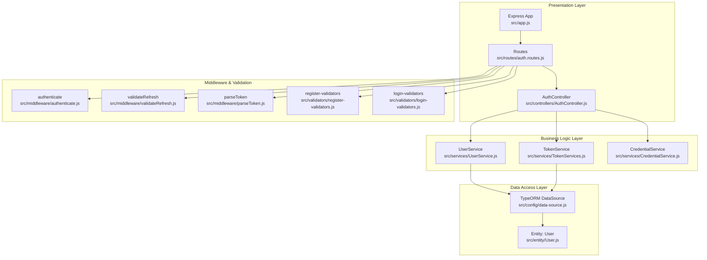
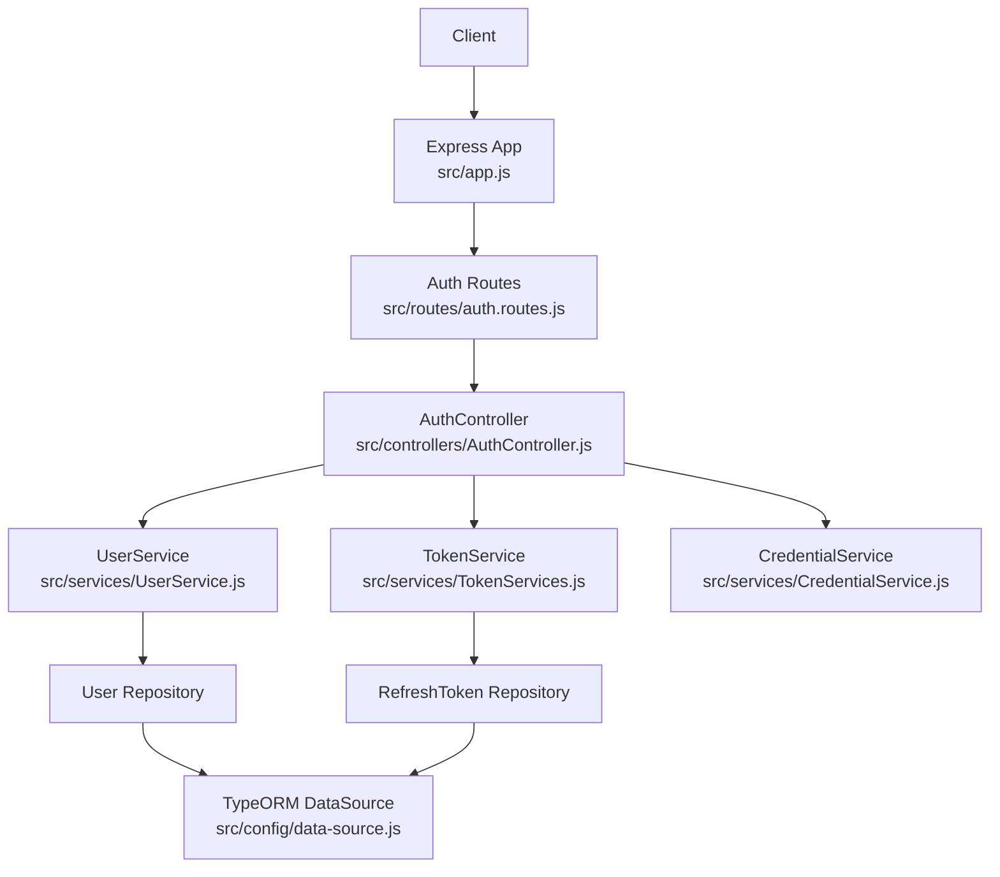
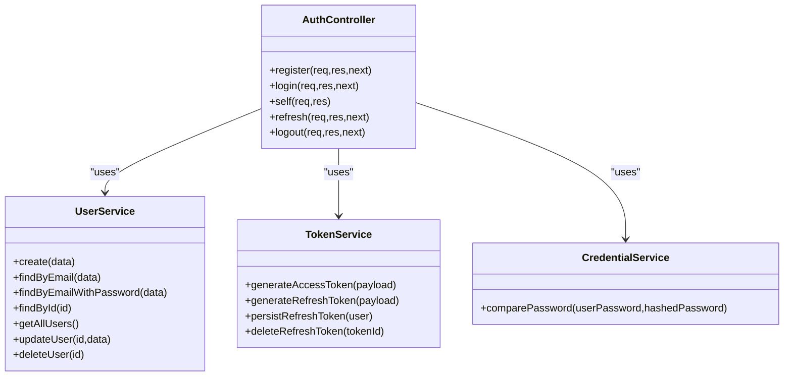
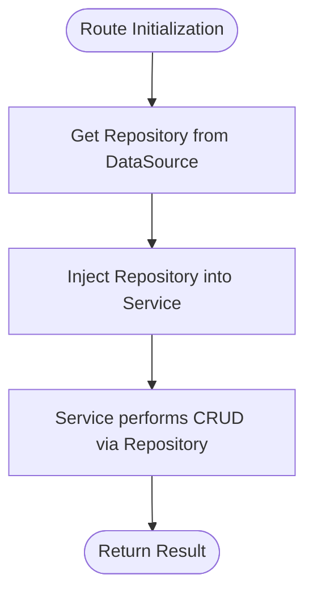
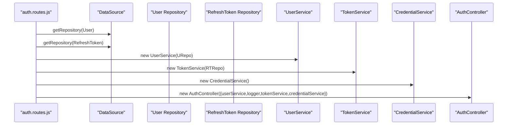
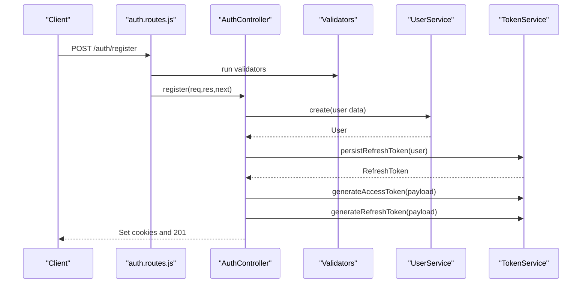
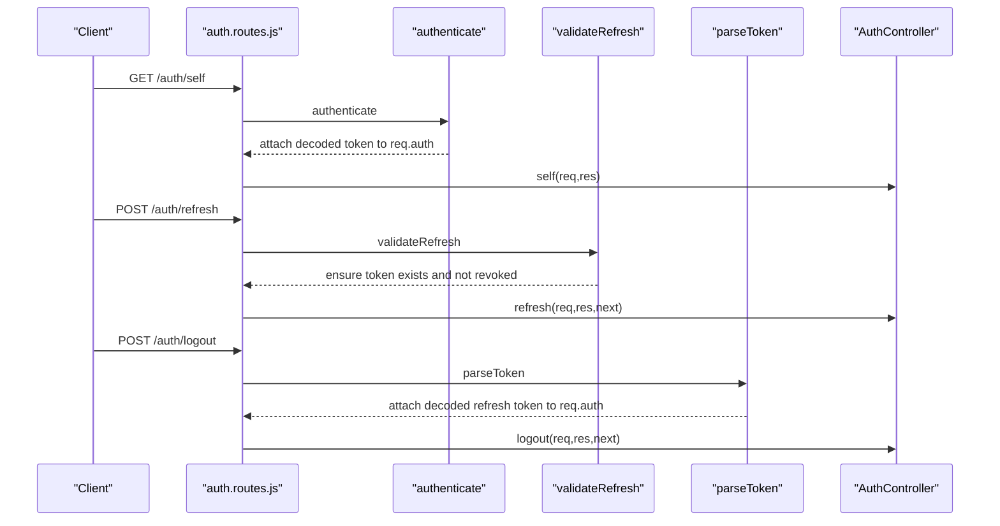
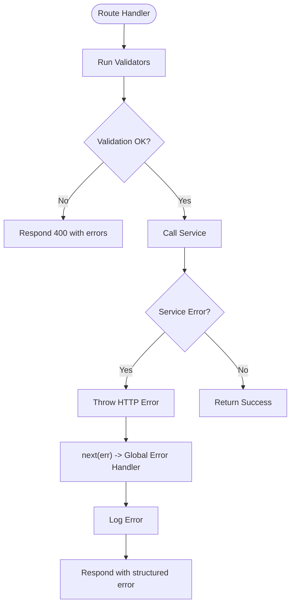
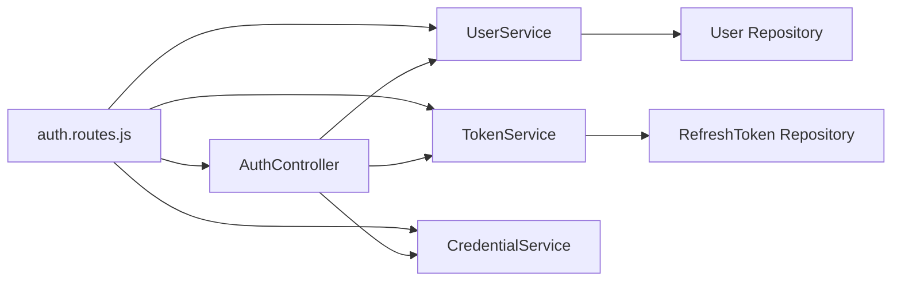

# System Design Patterns

<cite>
**Referenced Files in This Document**
- [app.js](file://src/app.js)
- [server.js](file://src/server.js)
- [data-source.js](file://src/config/data-source.js)
- [config.js](file://src/config/config.js)
- [auth.routes.js](file://src/routes/auth.routes.js)
- [AuthController.js](file://src/controllers/AuthController.js)
- [UserService.js](file://src/services/UserService.js)
- [TokenServices.js](file://src/services/TokenServices.js)
- [CredentialService.js](file://src/services/CredentialService.js)
- [authenticate.js](file://src/middleware/authenticate.js)
- [validateRefresh.js](file://src/middleware/validateRefresh.js)
- [parseToken.js](file://src/middleware/parseToken.js)
- [register-validators.js](file://src/validators/register-validators.js)
- [login-validators.js](file://src/validators/login-validators.js)
- [User.js](file://src/entity/User.js)
</cite>

## Table of Contents
1. [Introduction](#introduction)
2. [Project Structure](#project-structure)
3. [Core Components](#core-components)
4. [Architecture Overview](#architecture-overview)
5. [Detailed Component Analysis](#detailed-component-analysis)
6. [Dependency Analysis](#dependency-analysis)
7. [Performance Considerations](#performance-considerations)
8. [Troubleshooting Guide](#troubleshooting-guide)
9. [Conclusion](#conclusion)

## Introduction
This document explains the authentication service design patterns and how they are implemented in the codebase. It focuses on:
- Layered architecture separating presentation, business logic, and data access
- Service layer encapsulation of business logic
- Repository pattern via TypeORM for database abstraction
- Factory-like composition of services and controllers
- Dependency injection via constructor parameters and route-level wiring
- Practical examples of controller-service relationships, middleware injection, and error handling patterns
- Benefits to maintainability and testability

## Project Structure
The project follows a conventional Express application layout with clear separation of concerns:
- Presentation layer: Express app, routes, and controllers
- Business logic layer: Services (UserService, TokenService, CredentialService)
- Data access layer: TypeORM DataSource and repositories
- Middleware: JWT authentication and token validation
- Validators: Request schema validation
- Entities: TypeORM entity definitions

**Diagram sources**
- [app.js:1-40](file://src/app.js#L1-L40)
- [auth.routes.js:1-49](file://src/routes/auth.routes.js#L1-L49)
- [AuthController.js:1-212](file://src/controllers/AuthController.js#L1-L212)
- [UserService.js:1-99](file://src/services/UserService.js#L1-L99)
- [TokenServices.js:1-60](file://src/services/TokenServices.js#L1-L60)
- [CredentialService.js:1-7](file://src/services/CredentialService.js#L1-L7)
- [data-source.js:1-22](file://src/config/data-source.js#L1-L22)
- [User.js:1-50](file://src/entity/User.js#L1-L50)
- [authenticate.js:1-26](file://src/middleware/authenticate.js#L1-L26)
- [validateRefresh.js:1-34](file://src/middleware/validateRefresh.js#L1-L34)
- [parseToken.js:1-14](file://src/middleware/parseToken.js#L1-L14)
- [register-validators.js:1-47](file://src/validators/register-validators.js#L1-L47)
- [login-validators.js:1-25](file://src/validators/login-validators.js#L1-L25)

**Section sources**
- [app.js:1-40](file://src/app.js#L1-L40)
- [auth.routes.js:1-49](file://src/routes/auth.routes.js#L1-L49)

## Core Components
- Presentation layer
  - Express app initializes middleware and mounts routers
  - Routes define endpoints and wire up controllers and middleware
- Business logic layer
  - UserService encapsulates user operations and interacts with repositories
  - TokenService handles access/refresh token generation and persistence
  - CredentialService compares passwords
- Data access layer
  - TypeORM DataSource configured with entities and migrations
  - Repositories are obtained per route to keep services decoupled from global state
- Middleware and validation
  - JWT-based authentication and refresh token validation
  - Request schema validation using express-validator

Benefits:
- Separation of concerns improves maintainability
- DI via constructors enables easy mocking and testing
- Repository abstraction allows swapping persistence mechanisms

**Section sources**
- [AuthController.js:1-212](file://src/controllers/AuthController.js#L1-L212)
- [UserService.js:1-99](file://src/services/UserService.js#L1-L99)
- [TokenServices.js:1-60](file://src/services/TokenServices.js#L1-L60)
- [CredentialService.js:1-7](file://src/services/CredentialService.js#L1-L7)
- [data-source.js:1-22](file://src/config/data-source.js#L1-L22)

## Architecture Overview
The system implements a layered architecture:
- Presentation: Express app and routes
- Business: Services with clear responsibilities
- Data: TypeORM repositories accessed through services
- Security: Middleware for JWT parsing, validation, and revocation checks

**Diagram sources**
- [app.js:1-40](file://src/app.js#L1-L40)
- [auth.routes.js:1-49](file://src/routes/auth.routes.js#L1-L49)
- [AuthController.js:1-212](file://src/controllers/AuthController.js#L1-L212)
- [UserService.js:1-99](file://src/services/UserService.js#L1-L99)
- [TokenServices.js:1-60](file://src/services/TokenServices.js#L1-L60)
- [CredentialService.js:1-7](file://src/services/CredentialService.js#L1-L7)
- [data-source.js:1-22](file://src/config/data-source.js#L1-L22)

## Detailed Component Analysis

### Layered Architecture Pattern
- Presentation layer
  - Express app sets JSON parsing, cookies, static files, and global error handler
  - Routes mount controllers and middleware
- Business logic layer
  - Controllers orchestrate requests and delegate to services
  - Services encapsulate domain logic and coordinate repositories
- Data access layer
  - Services receive repositories via constructor injection
  - Repositories are resolved per-route to avoid global singletons

Practical example: Route wires repositories, services, and controller; controller delegates to services for user creation and token handling.

**Section sources**
- [app.js:1-40](file://src/app.js#L1-L40)
- [auth.routes.js:16-27](file://src/routes/auth.routes.js#L16-L27)
- [AuthController.js:19-70](file://src/controllers/AuthController.js#L19-L70)
- [UserService.js:7-38](file://src/services/UserService.js#L7-L38)

### Service Layer Pattern
- Responsibilities
  - UserService: user CRUD, existence checks, and password retrieval with password field selection
  - TokenService: JWT signing, refresh token persistence and deletion
  - CredentialService: password comparison using bcrypt
- Encapsulation
  - Services isolate business rules and error handling
  - Controllers remain thin and focused on HTTP concerns

**Diagram sources**
- [AuthController.js:1-212](file://src/controllers/AuthController.js#L1-L212)
- [UserService.js:1-99](file://src/services/UserService.js#L1-L99)
- [TokenServices.js:1-60](file://src/services/TokenServices.js#L1-L60)
- [CredentialService.js:1-7](file://src/services/CredentialService.js#L1-L7)

**Section sources**
- [AuthController.js:1-212](file://src/controllers/AuthController.js#L1-L212)
- [UserService.js:1-99](file://src/services/UserService.js#L1-L99)
- [TokenServices.js:1-60](file://src/services/TokenServices.js#L1-L60)
- [CredentialService.js:1-7](file://src/services/CredentialService.js#L1-L7)

### Repository Pattern with TypeORM
- DataSource configuration defines entities and migrations
- Repositories are obtained per route and injected into services
- Services operate on repositories without knowing the underlying persistence mechanism

**Diagram sources**
- [data-source.js:1-22](file://src/config/data-source.js#L1-L22)
- [auth.routes.js:17-21](file://src/routes/auth.routes.js#L17-L21)
- [UserService.js:4-6](file://src/services/UserService.js#L4-L6)
- [TokenServices.js:9-11](file://src/services/TokenServices.js#L9-L11)

**Section sources**
- [data-source.js:1-22](file://src/config/data-source.js#L1-L22)
- [auth.routes.js:17-21](file://src/routes/auth.routes.js#L17-L21)
- [UserService.js:4-6](file://src/services/UserService.js#L4-L6)
- [TokenServices.js:9-11](file://src/services/TokenServices.js#L9-L11)

### Factory Pattern for Service Instantiation
- Route-level composition creates service instances with dependencies
- This acts as a simple factory that constructs controllers and services with their collaborators
- Keeps dependencies explicit and avoids global state

**Diagram sources**
- [auth.routes.js:17-27](file://src/routes/auth.routes.js#L17-L27)
- [data-source.js:1-22](file://src/config/data-source.js#L1-L22)
- [UserService.js:4-6](file://src/services/UserService.js#L4-L6)
- [TokenServices.js:9-11](file://src/services/TokenServices.js#L9-L11)
- [CredentialService.js:2-5](file://src/services/CredentialService.js#L2-L5)
- [AuthController.js:11-16](file://src/controllers/AuthController.js#L11-L16)

**Section sources**
- [auth.routes.js:17-27](file://src/routes/auth.routes.js#L17-L27)

### Dependency Injection via Constructor Parameters
- Controllers and services receive collaborators through constructor parameters
- Enables straightforward unit testing by substituting mocks for repositories and external services
- Reduces hidden dependencies and increases testability

Examples:
- AuthController receives userService, tokenService, credentialService, and logger
- UserService receives userRepository
- TokenService receives refreshTokenRepository

**Section sources**
- [AuthController.js:11-16](file://src/controllers/AuthController.js#L11-L16)
- [UserService.js:4-6](file://src/services/UserService.js#L4-L6)
- [TokenServices.js:9-11](file://src/services/TokenServices.js#L9-L11)

### Controller-Service Relationships
- Controllers handle HTTP concerns (validation, cookies, status codes)
- Services encapsulate business logic (user creation, credential verification, token lifecycle)
- Example: register flow validates input, delegates to UserService to create a user, then uses TokenService to persist and sign tokens

**Diagram sources**
- [auth.routes.js:29-31](file://src/routes/auth.routes.js#L29-L31)
- [AuthController.js:19-70](file://src/controllers/AuthController.js#L19-L70)
- [UserService.js:7-38](file://src/services/UserService.js#L7-L38)
- [TokenServices.js:45-52](file://src/services/TokenServices.js#L45-L52)

**Section sources**
- [auth.routes.js:29-31](file://src/routes/auth.routes.js#L29-L31)
- [AuthController.js:19-70](file://src/controllers/AuthController.js#L19-L70)
- [UserService.js:7-38](file://src/services/UserService.js#L7-L38)
- [TokenServices.js:45-52](file://src/services/TokenServices.js#L45-L52)

### Middleware Injection and JWT Flows
- authenticate middleware validates access tokens via JWKS
- validateRefresh middleware validates refresh tokens and checks revocation
- parseToken middleware extracts refresh tokens for logout flows
- Validators enforce request schema before controller logic

**Diagram sources**
- [auth.routes.js:37-46](file://src/routes/auth.routes.js#L37-L46)
- [authenticate.js:6-25](file://src/middleware/authenticate.js#L6-L25)
- [validateRefresh.js:7-31](file://src/middleware/validateRefresh.js#L7-L31)
- [parseToken.js:4-11](file://src/middleware/parseToken.js#L4-L11)
- [AuthController.js:138-210](file://src/controllers/AuthController.js#L138-L210)

**Section sources**
- [auth.routes.js:37-46](file://src/routes/auth.routes.js#L37-L46)
- [authenticate.js:1-26](file://src/middleware/authenticate.js#L1-L26)
- [validateRefresh.js:1-34](file://src/middleware/validateRefresh.js#L1-L34)
- [parseToken.js:1-14](file://src/middleware/parseToken.js#L1-L14)
- [AuthController.js:138-210](file://src/controllers/AuthController.js#L138-L210)

### Error Handling Patterns
- Centralized error handling in Express app logs and returns structured errors
- Service methods throw HTTP errors for client-side issues and generic errors for internal failures
- Controllers forward errors to Express error handler using next()

**Diagram sources**
- [app.js:24-37](file://src/app.js#L24-L37)
- [UserService.js:13-16](file://src/services/UserService.js#L13-L16)
- [AuthController.js:66-69](file://src/controllers/AuthController.js#L66-L69)

**Section sources**
- [app.js:24-37](file://src/app.js#L24-L37)
- [UserService.js:13-16](file://src/services/UserService.js#L13-L16)
- [AuthController.js:66-69](file://src/controllers/AuthController.js#L66-L69)

## Dependency Analysis
- Coupling and cohesion
  - Controllers depend on abstractions (services), not concrete implementations
  - Services depend on repositories, enabling high cohesion around business logic
- External dependencies
  - TypeORM for ORM and migrations
  - express-jwt with jwks-rsa for access token validation
  - bcrypt for password hashing and comparison
  - dotenv for environment configuration
- Wiring
  - Route files act as composition roots, instantiating services and controllers with their dependencies

**Diagram sources**
- [auth.routes.js:17-27](file://src/routes/auth.routes.js#L17-L27)
- [AuthController.js:11-16](file://src/controllers/AuthController.js#L11-L16)
- [UserService.js:4-6](file://src/services/UserService.js#L4-L6)
- [TokenServices.js:9-11](file://src/services/TokenServices.js#L9-L11)

**Section sources**
- [auth.routes.js:17-27](file://src/routes/auth.routes.js#L17-L27)

## Performance Considerations
- Token generation and persistence
  - Access tokens are signed with RSA; ensure private key availability and caching
  - Refresh tokens are persisted and validated against the database to prevent reuse
- Password hashing
  - Bcrypt cost is configured; adjust based on hardware and latency targets
- Middleware overhead
  - JWKS caching reduces network calls for key fetching
- Database synchronization
  - Synchronize enabled in dev/test environments; disable in production and rely on migrations

[No sources needed since this section provides general guidance]

## Troubleshooting Guide
Common issues and resolutions:
- Access token validation fails
  - Verify JWKS URI and algorithm configuration
  - Ensure keys are cached and reachable
- Refresh token invalid or revoked
  - Confirm token exists in the database and belongs to the user
  - Check token ID matches payload and is not expired
- Password mismatch during login
  - Ensure hashed password is stored and compare method is invoked
- Registration errors
  - Validate request schema and ensure email uniqueness
- Database connectivity
  - Initialize DataSource before starting the server and confirm credentials

**Section sources**
- [authenticate.js:7-12](file://src/middleware/authenticate.js#L7-L12)
- [validateRefresh.js:14-30](file://src/middleware/validateRefresh.js#L14-L30)
- [CredentialService.js:3-5](file://src/services/CredentialService.js#L3-L5)
- [UserService.js:13-16](file://src/services/UserService.js#L13-L16)
- [server.js:9-14](file://src/server.js#L9-L14)

## Conclusion
The authentication service demonstrates robust design patterns:
- Layered architecture cleanly separates concerns
- Service layer encapsulates business logic and coordinates repositories
- Repository pattern with TypeORM abstracts persistence
- Factory-like composition at the route level and DI via constructors improve modularity
- Middleware and validators enforce security and data quality
- Centralized error handling ensures consistent responses

These patterns collectively enhance maintainability, testability, and scalability of the authentication service.