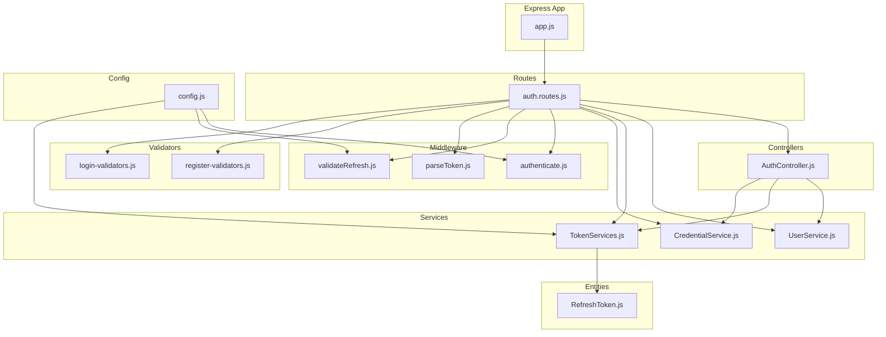
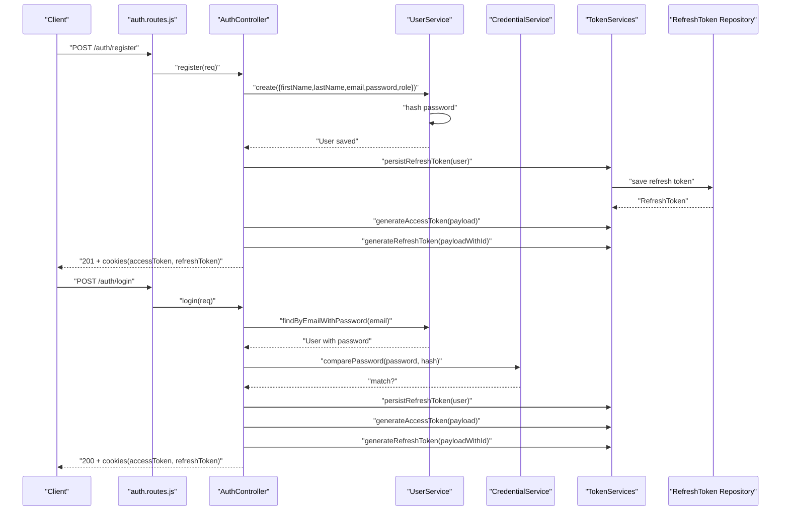
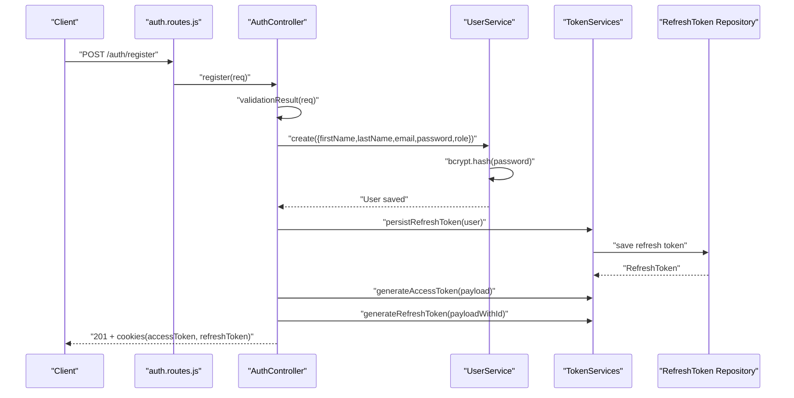
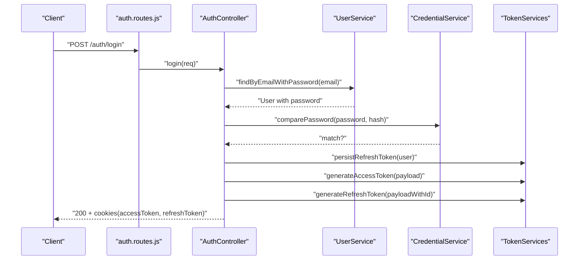
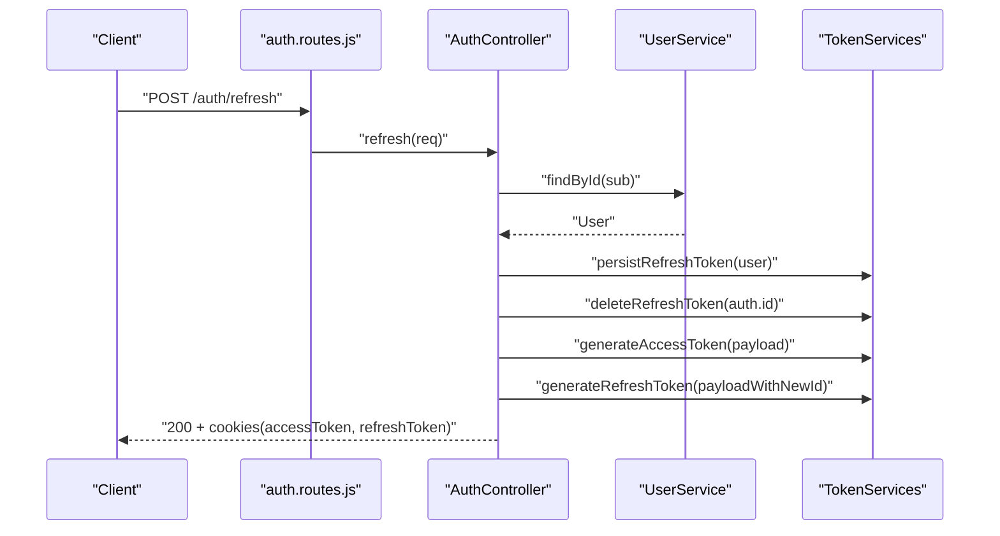
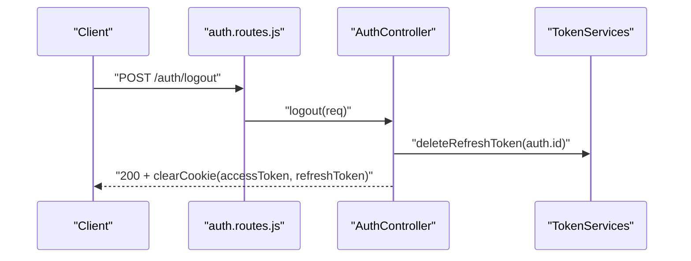
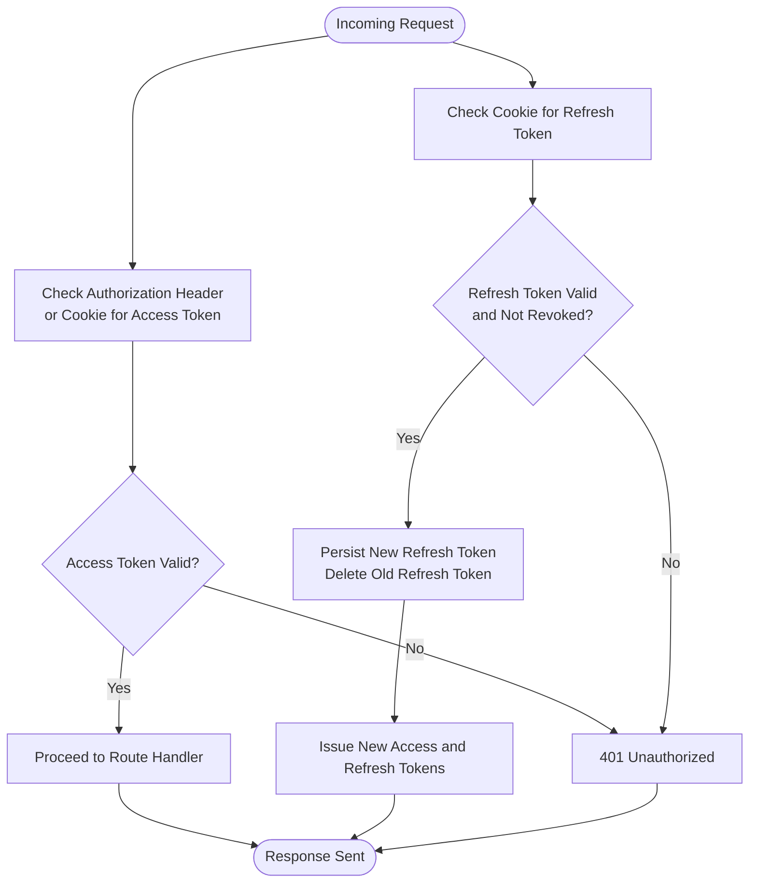
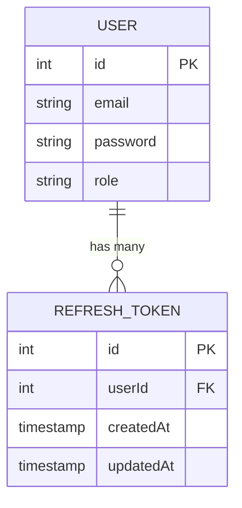
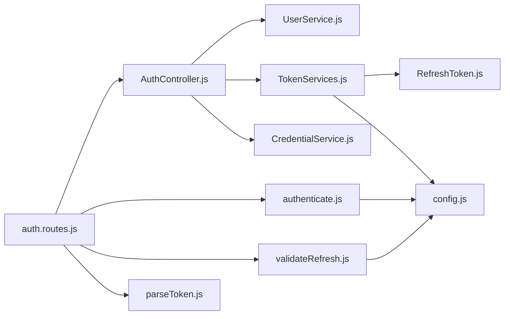

# Authentication Flow

<cite>
**Referenced Files in This Document**
- [AuthController.js](file://src/controllers/AuthController.js)
- [TokenServices.js](file://src/services/TokenServices.js)
- [CredentialService.js](file://src/services/CredentialService.js)
- [UserService.js](file://src/services/UserService.js)
- [auth.routes.js](file://src/routes/auth.routes.js)
- [authenticate.js](file://src/middleware/authenticate.js)
- [validateRefresh.js](file://src/middleware/validateRefresh.js)
- [parseToken.js](file://src/middleware/parseToken.js)
- [register-validators.js](file://src/validators/register-validators.js)
- [login-validators.js](file://src/validators/login-validators.js)
- [RefreshToken.js](file://src/entity/RefreshToken.js)
- [config.js](file://src/config/config.js)
- [app.js](file://src/app.js)
- [index.js](file://src/constants/index.js)
- [register.spec.js](file://src/test/users/register.spec.js)
- [login.spec.js](file://src/test/users/login.spec.js)
- [refresh.spec.js](file://src/test/users/refresh.spec.js)
</cite>

## Table of Contents
1. [Introduction](#introduction)
2. [Project Structure](#project-structure)
3. [Core Components](#core-components)
4. [Architecture Overview](#architecture-overview)
5. [Detailed Component Analysis](#detailed-component-analysis)
6. [Dependency Analysis](#dependency-analysis)
7. [Performance Considerations](#performance-considerations)
8. [Troubleshooting Guide](#troubleshooting-guide)
9. [Conclusion](#conclusion)
10. [Appendices](#appendices)

## Introduction
This document explains the complete authentication flow implemented in the service, covering user registration, login, token generation and management, refresh cycles with rotation, and logout. It also documents middleware integration, error handling, security considerations, and practical testing scenarios derived from the repository’s implementation and tests.

## Project Structure
The authentication system is organized around controllers, services, middleware, validators, routes, and entities. The Express app wires routes and middleware, while services encapsulate business logic for user creation, credential comparison, and JWT operations. Validators enforce input constraints. Cookies are used to transport access and refresh tokens.

**Diagram sources**
- [app.js:1-40](file://src/app.js#L1-L40)
- [auth.routes.js:1-49](file://src/routes/auth.routes.js#L1-L49)
- [AuthController.js:1-212](file://src/controllers/AuthController.js#L1-L212)
- [UserService.js:1-99](file://src/services/UserService.js#L1-L99)
- [CredentialService.js:1-7](file://src/services/CredentialService.js#L1-L7)
- [TokenServices.js:1-60](file://src/services/TokenServices.js#L1-L60)
- [authenticate.js:1-26](file://src/middleware/authenticate.js#L1-L26)
- [validateRefresh.js:1-34](file://src/middleware/validateRefresh.js#L1-L34)
- [parseToken.js:1-14](file://src/middleware/parseToken.js#L1-L14)
- [register-validators.js:1-47](file://src/validators/register-validators.js#L1-L47)
- [login-validators.js:1-25](file://src/validators/login-validators.js#L1-L25)
- [RefreshToken.js:1-35](file://src/entity/RefreshToken.js#L1-L35)
- [config.js:1-34](file://src/config/config.js#L1-L34)

**Section sources**
- [app.js:1-40](file://src/app.js#L1-L40)
- [auth.routes.js:1-49](file://src/routes/auth.routes.js#L1-L49)

## Core Components
- AuthController: Orchestrates registration, login, refresh, and logout. Manages cookie setting for access and refresh tokens and delegates to services for user and token operations.
- UserService: Handles user creation, duplicate checks, password hashing, and retrieval by email or ID.
- CredentialService: Compares plaintext passwords against stored hashes using bcrypt.
- TokenService: Generates access and refresh tokens, persists refresh tokens to the database, and deletes them when needed.
- Middleware:
  - authenticate: Validates access tokens via JWKS and extracts tokens from Authorization header or cookies.
  - validateRefresh: Validates refresh tokens via HMAC secret and checks revocation against persisted refresh tokens.
  - parseToken: Parses refresh tokens for logout flows.
- Validators: Enforce input validation for registration and login requests.
- Entities: Define the refresh token storage model with user relation.
- Config: Loads environment variables for secrets and JWKS URI.

**Section sources**
- [AuthController.js:1-212](file://src/controllers/AuthController.js#L1-L212)
- [UserService.js:1-99](file://src/services/UserService.js#L1-L99)
- [CredentialService.js:1-7](file://src/services/CredentialService.js#L1-L7)
- [TokenServices.js:1-60](file://src/services/TokenServices.js#L1-L60)
- [authenticate.js:1-26](file://src/middleware/authenticate.js#L1-L26)
- [validateRefresh.js:1-34](file://src/middleware/validateRefresh.js#L1-L34)
- [parseToken.js:1-14](file://src/middleware/parseToken.js#L1-L14)
- [register-validators.js:1-47](file://src/validators/register-validators.js#L1-L47)
- [login-validators.js:1-25](file://src/validators/login-validators.js#L1-L25)
- [RefreshToken.js:1-35](file://src/entity/RefreshToken.js#L1-L35)
- [config.js:1-34](file://src/config/config.js#L1-L34)

## Architecture Overview
The authentication flow integrates route handlers, middleware, and services. Requests pass through validators, then controller actions, which delegate to services. Access tokens are validated by middleware, while refresh tokens are validated and revoked against persisted records.

**Diagram sources**
- [auth.routes.js:29-46](file://src/routes/auth.routes.js#L29-L46)
- [AuthController.js:19-70](file://src/controllers/AuthController.js#L19-L70)
- [UserService.js:7-38](file://src/services/UserService.js#L7-L38)
- [CredentialService.js:3-5](file://src/services/CredentialService.js#L3-L5)
- [TokenServices.js:45-52](file://src/services/TokenServices.js#L45-L52)
- [RefreshToken.js:3-35](file://src/entity/RefreshToken.js#L3-L35)

## Detailed Component Analysis

### Registration Flow
- Input validation: Enforced by registration validators.
- Duplicate prevention: UserService checks for existing email and throws on conflict.
- Password hashing: UserService hashes the password before saving.
- Token generation and persistence:
  - Persist refresh token to the database.
  - Generate access token (RS256) and refresh token (HS256 with JWT ID).
- Cookie delivery: Access and refresh tokens are set as HTTP-only cookies with short-lived access and 7-day refresh TTLs.

**Diagram sources**
- [auth.routes.js:29-31](file://src/routes/auth.routes.js#L29-L31)
- [AuthController.js:19-70](file://src/controllers/AuthController.js#L19-L70)
- [UserService.js:7-38](file://src/services/UserService.js#L7-L38)
- [TokenServices.js:45-52](file://src/services/TokenServices.js#L45-L52)

**Section sources**
- [register-validators.js:1-47](file://src/validators/register-validators.js#L1-L47)
- [UserService.js:7-38](file://src/services/UserService.js#L7-L38)
- [AuthController.js:19-70](file://src/controllers/AuthController.js#L19-L70)
- [TokenServices.js:45-52](file://src/services/TokenServices.js#L45-L52)

### Login Flow
- Input validation: Enforced by login validators.
- Credential verification: Fetch user with password and compare using CredentialService.
- Token rotation: Persist a new refresh token, issue new access and refresh tokens.
- Cookie delivery: Same cookie policy as registration.

**Diagram sources**
- [auth.routes.js:33-35](file://src/routes/auth.routes.js#L33-L35)
- [AuthController.js:72-136](file://src/controllers/AuthController.js#L72-L136)
- [UserService.js:48-54](file://src/services/UserService.js#L48-L54)
- [CredentialService.js:3-5](file://src/services/CredentialService.js#L3-L5)
- [TokenServices.js:45-52](file://src/services/TokenServices.js#L45-L52)

**Section sources**
- [login-validators.js:1-25](file://src/validators/login-validators.js#L1-L25)
- [AuthController.js:72-136](file://src/controllers/AuthController.js#L72-L136)
- [UserService.js:48-54](file://src/services/UserService.js#L48-L54)
- [CredentialService.js:3-5](file://src/services/CredentialService.js#L3-L5)

### Token Refresh Cycle with Rotation
- Validation: validateRefresh middleware verifies the refresh token and ensures it is not revoked by checking the persisted refresh token record.
- Rotation strategy: On successful refresh, a new refresh token is persisted, the old refresh token is deleted, and new access and refresh tokens are issued.
- Cookie renewal: Both access and refresh cookies are renewed.

**Diagram sources**
- [auth.routes.js:41-43](file://src/routes/auth.routes.js#L41-L43)
- [AuthController.js:143-192](file://src/controllers/AuthController.js#L143-L192)
- [TokenServices.js:54-58](file://src/services/TokenServices.js#L54-L58)
- [validateRefresh.js:7-31](file://src/middleware/validateRefresh.js#L7-L31)

**Section sources**
- [AuthController.js:143-192](file://src/controllers/AuthController.js#L143-L192)
- [TokenServices.js:54-58](file://src/services/TokenServices.js#L54-L58)
- [validateRefresh.js:14-30](file://src/middleware/validateRefresh.js#L14-L30)

### Logout Procedure
- Token parsing: parseToken middleware extracts the refresh token from cookies.
- Revocation: Delete the refresh token from the database to revoke it.
- Cleanup: Clear both access and refresh cookies.

**Diagram sources**
- [auth.routes.js:44-46](file://src/routes/auth.routes.js#L44-L46)
- [AuthController.js:194-210](file://src/controllers/AuthController.js#L194-L210)
- [TokenServices.js:54-58](file://src/services/TokenServices.js#L54-L58)
- [parseToken.js:4-11](file://src/middleware/parseToken.js#L4-L11)

**Section sources**
- [AuthController.js:194-210](file://src/controllers/AuthController.js#L194-L210)
- [TokenServices.js:54-58](file://src/services/TokenServices.js#L54-L58)
- [parseToken.js:4-11](file://src/middleware/parseToken.js#L4-L11)

### Authentication Middleware Integration
- Access token validation: authenticate middleware validates RS256 access tokens using JWKS and supports extraction from Authorization header or cookies.
- Refresh token validation and revocation: validateRefresh middleware validates HS256 refresh tokens and checks revocation against persisted refresh tokens.
- Logout token parsing: parseToken middleware extracts refresh tokens for logout.

**Diagram sources**
- [authenticate.js:6-25](file://src/middleware/authenticate.js#L6-L25)
- [validateRefresh.js:7-31](file://src/middleware/validateRefresh.js#L7-L31)
- [parseToken.js:4-11](file://src/middleware/parseToken.js#L4-L11)

**Section sources**
- [authenticate.js:1-26](file://src/middleware/authenticate.js#L1-L26)
- [validateRefresh.js:1-34](file://src/middleware/validateRefresh.js#L1-L34)
- [parseToken.js:1-14](file://src/middleware/parseToken.js#L1-L14)

### Data Model for Refresh Tokens

**Diagram sources**
- [RefreshToken.js:3-35](file://src/entity/RefreshToken.js#L3-L35)

**Section sources**
- [RefreshToken.js:1-35](file://src/entity/RefreshToken.js#L1-L35)

### Practical Examples and Scenarios
- Registration:
  - Endpoint: POST /auth/register
  - Behavior: Validates inputs, creates user with hashed password, persists refresh token, issues access and refresh tokens, sets cookies.
  - Tests verify cookie presence, JWT validity, and database persistence.
- Login:
  - Endpoint: POST /auth/login
  - Behavior: Validates inputs, compares password, persists refresh token, issues tokens, sets cookies.
  - Tests verify successful login and password correctness.
- Refresh:
  - Endpoint: POST /auth/refresh
  - Behavior: Validates refresh token, rotates tokens, deletes old refresh token, issues new tokens.
  - Tests verify 200 status and revocation when token is missing.
- Self Profile:
  - Endpoint: GET /auth/self (protected by authenticate middleware)
  - Behavior: Returns authenticated user profile.

**Section sources**
- [auth.routes.js:29-46](file://src/routes/auth.routes.js#L29-L46)
- [register.spec.js:115-154](file://src/test/users/register.spec.js#L115-L154)
- [login.spec.js:62-90](file://src/test/users/login.spec.js#L62-L90)
- [refresh.spec.js:71-107](file://src/test/users/refresh.spec.js#L71-L107)

## Dependency Analysis
- Controllers depend on services for user and token operations.
- Services depend on repositories for persistence and on external libraries for cryptography and JWT signing.
- Middleware depends on configuration for secrets and JWKS URIs.
- Routes assemble controllers and middleware and wire repositories.

**Diagram sources**
- [AuthController.js:11-16](file://src/controllers/AuthController.js#L11-L16)
- [UserService.js:4-6](file://src/services/UserService.js#L4-L6)
- [TokenServices.js:9-11](file://src/services/TokenServices.js#L9-L11)
- [auth.routes.js:22-27](file://src/routes/auth.routes.js#L22-L27)
- [authenticate.js:6-12](file://src/middleware/authenticate.js#L6-L12)
- [validateRefresh.js:7-9](file://src/middleware/validateRefresh.js#L7-L9)
- [TokenServices.js:35-40](file://src/services/TokenServices.js#L35-L40)
- [config.js:23-33](file://src/config/config.js#L23-L33)

**Section sources**
- [AuthController.js:11-16](file://src/controllers/AuthController.js#L11-L16)
- [auth.routes.js:22-27](file://src/routes/auth.routes.js#L22-L27)
- [authenticate.js:6-12](file://src/middleware/authenticate.js#L6-L12)
- [validateRefresh.js:7-9](file://src/middleware/validateRefresh.js#L7-L9)
- [TokenServices.js:35-40](file://src/services/TokenServices.js#L35-L40)
- [config.js:23-33](file://src/config/config.js#L23-L33)

## Performance Considerations
- Token signing:
  - Access tokens use RS256 with a private key; ensure the key file is available and readable to avoid runtime errors.
  - Refresh tokens use HS256 with a shared secret; keep the secret strong and rotate it periodically.
- Cookie policies:
  - Use environment-aware cookie options for domain, secure, and sameSite flags to align with deployment contexts.
- Database operations:
  - Persisting refresh tokens adds write overhead; ensure indexes on user ID and token ID for efficient revocation checks.
- Caching:
  - JWKS caching is enabled in middleware; ensure the JWKS endpoint is reachable and responsive.

[No sources needed since this section provides general guidance]

## Troubleshooting Guide
- Private key errors:
  - Access token generation fails if the private key file is missing; verify file path and permissions.
- Invalid credentials:
  - Login returns 400 if email not found or password mismatch; confirm user exists and password matches.
- Validation failures:
  - Registration and login return 400 with validation errors if inputs are missing or malformed.
- Revoked refresh tokens:
  - Refresh returns 400 if the refresh token is not found in the database or mismatches user ID.
- Uncaught exceptions:
  - Global error handler returns JSON with error details and logs messages; inspect logs for stack traces.

**Section sources**
- [TokenServices.js:16-23](file://src/services/TokenServices.js#L16-L23)
- [AuthController.js:86-101](file://src/controllers/AuthController.js#L86-L101)
- [validateRefresh.js:14-30](file://src/middleware/validateRefresh.js#L14-L30)
- [app.js:24-37](file://src/app.js#L24-L37)

## Conclusion
The authentication system implements a robust RS256/HMAC refresh token strategy with input validation, password hashing, and middleware-driven token validation and revocation. The flow supports registration, login, refresh with rotation, and logout, with cookie-based token transport and comprehensive error handling.

[No sources needed since this section summarizes without analyzing specific files]

## Appendices

### Security Considerations
- Transport:
  - Access tokens are RS256-signed; refresh tokens are HS256-signed with a shared secret.
  - Cookies are HTTP-only and use strict SameSite policies; configure domain and secure flags per environment.
- Secrets:
  - Keep PRIVATE_KEY_SECRET and JWKS_URI secure and environment-specific.
- Rotation:
  - Always persist a new refresh token and delete the old one during refresh to prevent reuse.
- Validation:
  - Use express-validator for input sanitization and length constraints.

**Section sources**
- [TokenServices.js:25-42](file://src/services/TokenServices.js#L25-L42)
- [AuthController.js:50-62](file://src/controllers/AuthController.js#L50-L62)
- [AuthController.js:116-129](file://src/controllers/AuthController.js#L116-L129)
- [AuthController.js:172-184](file://src/controllers/AuthController.js#L172-L184)
- [register-validators.js:1-47](file://src/validators/register-validators.js#L1-L47)
- [login-validators.js:1-25](file://src/validators/login-validators.js#L1-L25)
- [config.js:23-33](file://src/config/config.js#L23-L33)

### Error Handling Patterns
- Validation errors: Return 400 with array of validation errors.
- Business errors: Throw HTTP errors with appropriate status codes.
- Global error handler: Logs and responds with structured error JSON.

**Section sources**
- [AuthController.js:24-26](file://src/controllers/AuthController.js#L24-L26)
- [UserService.js:13-16](file://src/services/UserService.js#L13-L16)
- [app.js:24-37](file://src/app.js#L24-L37)