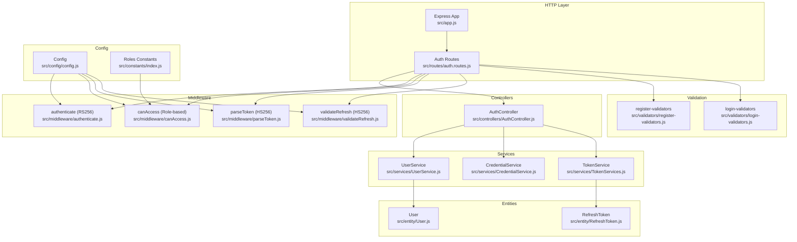
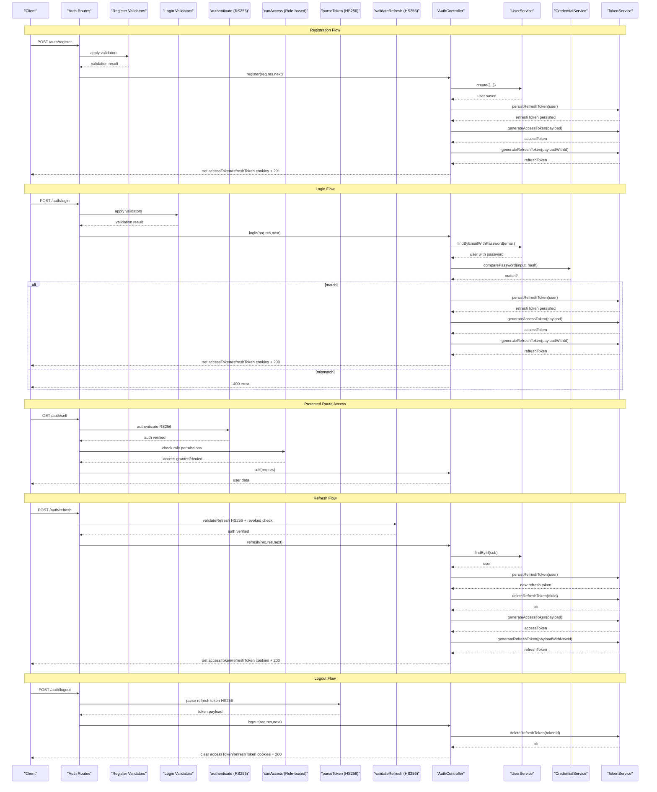
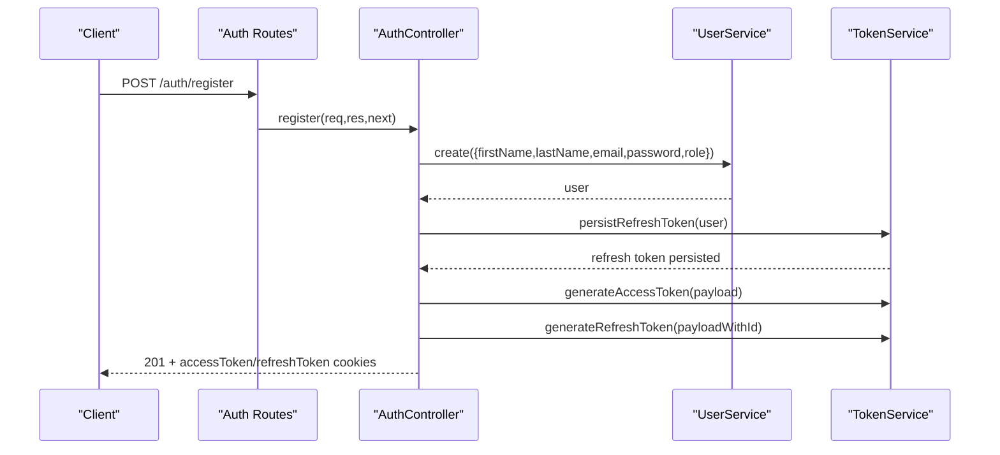
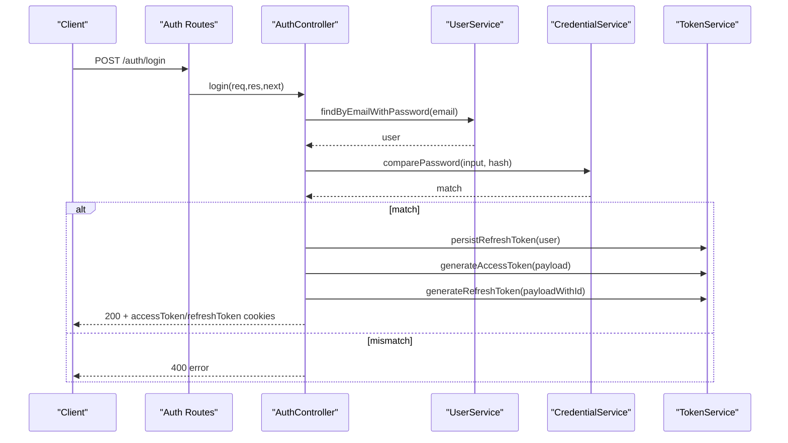
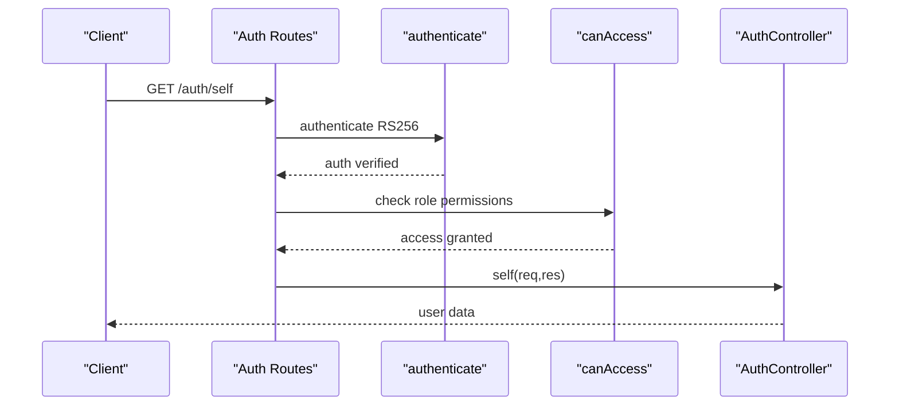
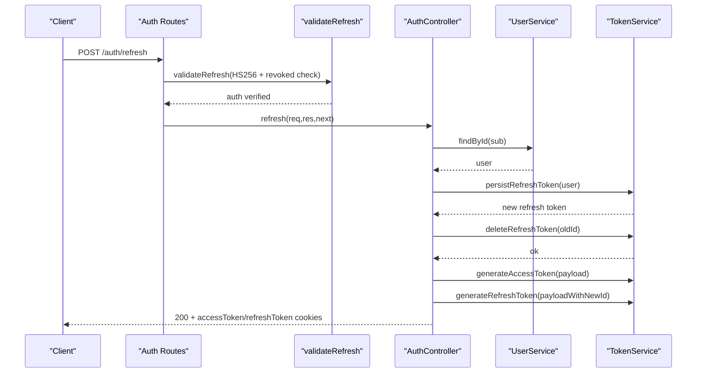
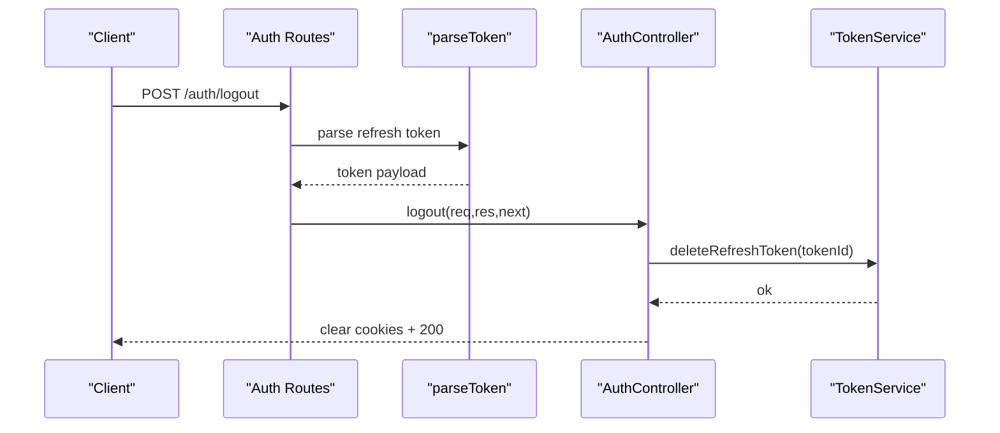
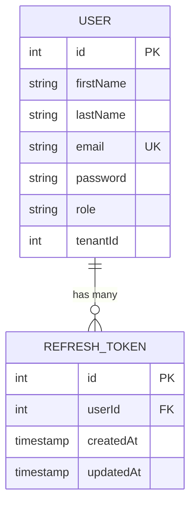
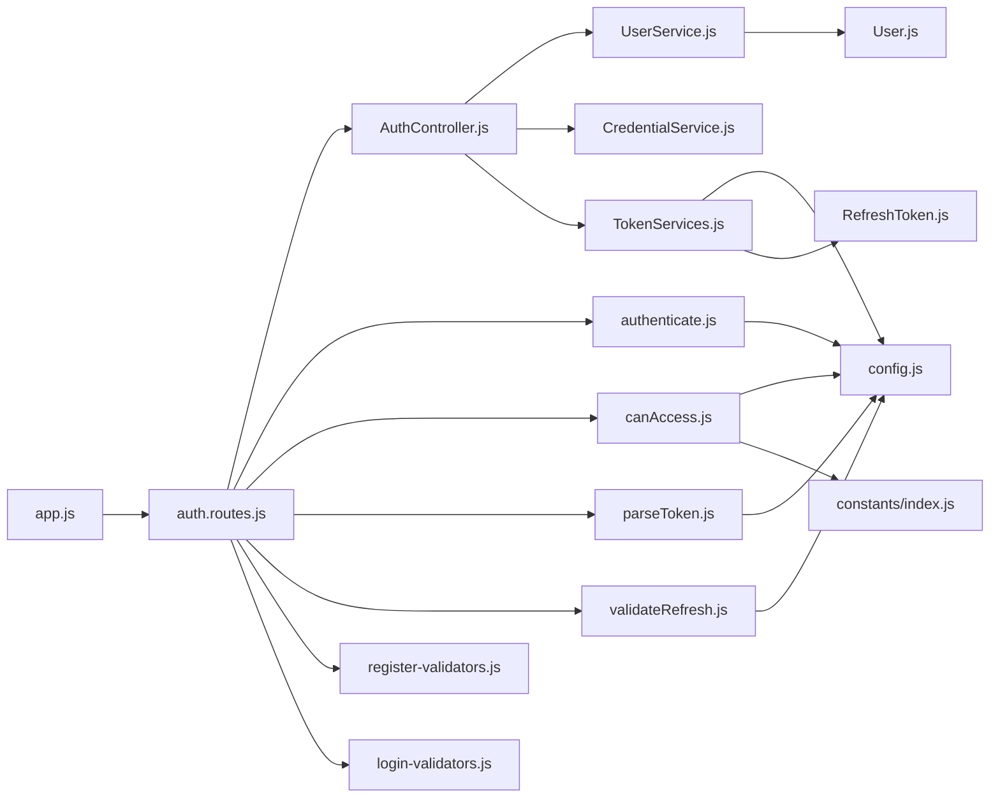

# Authentication System

<cite>
**Referenced Files in This Document**
- [src/controllers/AuthController.js](file://src/controllers/AuthController.js)
- [src/services/TokenServices.js](file://src/services/TokenServices.js)
- [src/services/CredentialService.js](file://src/services/CredentialService.js)
- [src/services/UserService.js](file://src/services/UserService.js)
- [src/middleware/authenticate.js](file://src/middleware/authenticate.js)
- [src/middleware/canAccess.js](file://src/middleware/canAccess.js)
- [src/middleware/parseToken.js](file://src/middleware/parseToken.js)
- [src/middleware/validateRefresh.js](file://src/middleware/validateRefresh.js)
- [src/routes/auth.routes.js](file://src/routes/auth.routes.js)
- [src/entity/User.js](file://src/entity/User.js)
- [src/entity/RefreshToken.js](file://src/entity/RefreshToken.js)
- [src/config/config.js](file://src/config/config.js)
- [src/validators/register-validators.js](file://src/validators/register-validators.js)
- [src/validators/login-validators.js](file://src/validators/login-validators.js)
- [src/app.js](file://src/app.js)
- [src/constants/index.js](file://src/constants/index.js)
- [package.json](file://package.json)
</cite>

## Update Summary
**Changes Made**
- Added comprehensive role-based access control middleware (`canAccess.js`)
- Enhanced authentication controller with improved error handling and role management
- Strengthened token validation with proper revocation checking
- Updated data models to support multi-tenancy with tenant-aware user management
- Improved middleware architecture with dedicated token parsing components

## Table of Contents
1. [Introduction](#introduction)
2. [Project Structure](#project-structure)
3. [Core Components](#core-components)
4. [Architecture Overview](#architecture-overview)
5. [Detailed Component Analysis](#detailed-component-analysis)
6. [Dependency Analysis](#dependency-analysis)
7. [Performance Considerations](#performance-considerations)
8. [Troubleshooting Guide](#troubleshooting-guide)
9. [Conclusion](#conclusion)
10. [Appendices](#appendices)

## Introduction
This document describes the authentication system implemented in the service. It covers JWT token architecture with RS256 for access tokens and HS256 for refresh tokens, the end-to-end authentication flow from registration to login, token generation and validation, refresh cycles, password hashing with bcrypt, credential validation, session-like management via cookies, token lifecycle and expiration handling, and logout procedures. The system now includes advanced role-based access control, multi-tenancy support, and enhanced security features for enterprise-grade applications.

## Project Structure
The authentication system is organized around controllers, services, middleware, routes, validators, entities, and configuration. Key areas:
- Controllers orchestrate requests and responses for authentication endpoints with enhanced error handling and role management.
- Services encapsulate business logic for tokens, credentials, and user persistence with multi-tenancy support.
- Middleware validates access tokens, refresh tokens, and implements role-based access control.
- Routes define endpoint contracts and wire middleware to controller actions.
- Validators enforce input constraints for registration and login.
- Entities model persisted user and refresh token data with tenant associations.
- Configuration loads environment variables for secrets and endpoints.

**Diagram sources**
- [src/app.js:1-40](file://src/app.js#L1-L40)
- [src/routes/auth.routes.js:1-49](file://src/routes/auth.routes.js#L1-L49)
- [src/controllers/AuthController.js:1-212](file://src/controllers/AuthController.js#L1-L212)
- [src/services/UserService.js:1-86](file://src/services/UserService.js#L1-L86)
- [src/services/CredentialService.js:1-7](file://src/services/CredentialService.js#L1-L7)
- [src/services/TokenServices.js:1-60](file://src/services/TokenServices.js#L1-L60)
- [src/middleware/authenticate.js:1-26](file://src/middleware/authenticate.js#L1-L26)
- [src/middleware/canAccess.js:1-23](file://src/middleware/canAccess.js#L1-L23)
- [src/middleware/parseToken.js:1-14](file://src/middleware/parseToken.js#L1-L14)
- [src/middleware/validateRefresh.js:1-34](file://src/middleware/validateRefresh.js#L1-L34)
- [src/entity/User.js:1-50](file://src/entity/User.js#L1-L50)
- [src/entity/RefreshToken.js:1-35](file://src/entity/RefreshToken.js#L1-L35)
- [src/config/config.js:1-34](file://src/config/config.js#L1-L34)
- [src/constants/index.js:1-6](file://src/constants/index.js#L1-L6)
- [src/validators/register-validators.js:1-47](file://src/validators/register-validators.js#L1-L47)
- [src/validators/login-validators.js:1-25](file://src/validators/login-validators.js#L1-L25)

**Section sources**
- [src/app.js:1-40](file://src/app.js#L1-L40)
- [src/routes/auth.routes.js:1-49](file://src/routes/auth.routes.js#L1-L49)

## Core Components
- **Access token (RS256)**: Generated with a private key and expires in one hour. Parsed from Authorization header or accessToken cookie.
- **Refresh token (HS256)**: Generated with a shared secret, stored in the database, and validated against persisted records to prevent reuse.
- **Role-based access control**: New middleware component that enforces role-based permissions for protected routes.
- **Multi-tenancy support**: User entity includes tenantId field for tenant-aware authentication flows.
- **Password hashing**: bcrypt with 10 rounds during user creation.
- **Credential validation**: bcrypt comparison during login.
- **Session-like management**: Cookies for accessToken and refreshToken with httpOnly and sameSite strict.
- **Token lifecycle**: Registration and login issue both tokens; refresh endpoint rotates tokens and deletes the old refresh token; logout deletes the refresh token and clears cookies.

**Section sources**
- [src/services/TokenServices.js:12-43](file://src/services/TokenServices.js#L12-L43)
- [src/middleware/authenticate.js:6-25](file://src/middleware/authenticate.js#L6-L25)
- [src/middleware/canAccess.js:4-22](file://src/middleware/canAccess.js#L4-L22)
- [src/middleware/parseToken.js:4-13](file://src/middleware/parseToken.js#L4-L13)
- [src/middleware/validateRefresh.js:7-31](file://src/middleware/validateRefresh.js#L7-L31)
- [src/services/UserService.js:17-27](file://src/services/UserService.js#L17-L27)
- [src/services/CredentialService.js:3-5](file://src/services/CredentialService.js#L3-L5)
- [src/controllers/AuthController.js:50-62](file://src/controllers/AuthController.js#L50-L62)
- [src/controllers/AuthController.js:116-128](file://src/controllers/AuthController.js#L116-L128)
- [src/controllers/AuthController.js:171-184](file://src/controllers/AuthController.js#L171-L184)
- [src/controllers/AuthController.js:202-203](file://src/controllers/AuthController.js#L202-L203)
- [src/entity/User.js:30-33](file://src/entity/User.js#L30-L33)

## Architecture Overview
The authentication flow integrates route handlers, middleware, controllers, and services. Access tokens are validated using JWKS-based RS256, while refresh tokens are validated using HS256 with revocation checks against the database. The system now includes role-based access control for fine-grained authorization.

**Diagram sources**
- [src/routes/auth.routes.js:29-46](file://src/routes/auth.routes.js#L29-L46)
- [src/middleware/authenticate.js:6-25](file://src/middleware/authenticate.js#L6-L25)
- [src/middleware/canAccess.js:4-22](file://src/middleware/canAccess.js#L4-L22)
- [src/middleware/parseToken.js:4-13](file://src/middleware/parseToken.js#L4-L13)
- [src/middleware/validateRefresh.js:7-31](file://src/middleware/validateRefresh.js#L7-L31)
- [src/controllers/AuthController.js:19-70](file://src/controllers/AuthController.js#L19-L70)
- [src/controllers/AuthController.js:72-136](file://src/controllers/AuthController.js#L72-L136)
- [src/controllers/AuthController.js:143-192](file://src/controllers/AuthController.js#L143-L192)
- [src/controllers/AuthController.js:194-210](file://src/controllers/AuthController.js#L194-L210)
- [src/services/UserService.js:48-54](file://src/services/UserService.js#L48-L54)
- [src/services/CredentialService.js:3-5](file://src/services/CredentialService.js#L3-L5)
- [src/services/TokenServices.js:45-58](file://src/services/TokenServices.js#L45-L58)

## Detailed Component Analysis

### Access Token Management (RS256)
- **Generation**: Uses a private key file and RS256 with a 1-hour expiry. Issuer is set for the service.
- **Validation**: Middleware fetches the public key via JWKS, caches keys, and accepts RS256 tokens. Token extraction prefers Authorization header Bearer; otherwise reads accessToken cookie.
- **Payload**: Contains subject (user ID) and role. During refresh, the payload is reconstructed from the previous token's claims.

Security considerations:
- Keep the private key secure and restrict file permissions.
- Ensure JWKS URI is reachable and TLS-enabled.
- Prefer Authorization header over cookies for token transport when possible.

**Section sources**
- [src/services/TokenServices.js:12-32](file://src/services/TokenServices.js#L12-L32)
- [src/middleware/authenticate.js:6-25](file://src/middleware/authenticate.js#L6-L25)
- [src/controllers/AuthController.js:103-113](file://src/controllers/AuthController.js#L103-L113)
- [src/controllers/AuthController.js:165-169](file://src/controllers/AuthController.js#L165-L169)

### Role-Based Access Control (RBAC)
- **Implementation**: New middleware component that enforces role-based permissions for protected routes.
- **Configuration**: Accepts an array of allowed roles and checks against the authenticated user's role.
- **Integration**: Can be applied to routes requiring specific permissions beyond basic authentication.

Security considerations:
- Define least-privilege roles for each endpoint.
- Use hierarchical role structures (admin > manager > customer).
- Log unauthorized access attempts for security monitoring.

**Section sources**
- [src/middleware/canAccess.js:4-22](file://src/middleware/canAccess.js#L4-L22)
- [src/constants/index.js:1-6](file://src/constants/index.js#L1-L6)

### Refresh Token Management (HS256)
- **Generation**: Uses a shared secret and HS256 with a 7-day expiry. A JWT ID is set to the refresh token record ID for revocation correlation.
- **Persistence**: A refresh token record is created per user with future updated timestamp.
- **Revocation**: Middleware validates HS256 signature and checks the database for the presence of the token record with matching user ID. If absent, the token is considered revoked.
- **Rotation**: On refresh, a new refresh token is created and the old one is deleted, implementing token rotation.

Security considerations:
- Use a strong, random secret for HS256.
- Store refresh tokens in a dedicated table with user associations.
- Treat refresh tokens as sensitive as passwords; keep httpOnly and sameSite strict.

**Section sources**
- [src/services/TokenServices.js:34-58](file://src/services/TokenServices.js#L34-L58)
- [src/middleware/validateRefresh.js:7-31](file://src/middleware/validateRefresh.js#L7-L31)
- [src/controllers/AuthController.js:160-164](file://src/controllers/AuthController.js#L160-L164)
- [src/entity/RefreshToken.js:1-35](file://src/entity/RefreshToken.js#L1-L35)

### Password Hashing and Credential Validation
- **Hashing**: During registration, passwords are hashed using bcrypt with 10 rounds before storage.
- **Comparison**: During login, the provided password is compared against the stored hash using bcrypt.

Security considerations:
- Maintain a reasonable cost factor (saltRounds) to balance security and performance.
- Never log raw or hashed passwords.

**Section sources**
- [src/services/UserService.js:17-27](file://src/services/UserService.js#L17-L27)
- [src/services/CredentialService.js:3-5](file://src/services/CredentialService.js#L3-L5)
- [src/controllers/AuthController.js:92-101](file://src/controllers/AuthController.js#L92-L101)

### Session Management with Cookies
- **Access token cookie**: httpOnly, sameSite strict, 1-hour max age.
- **Refresh token cookie**: httpOnly, sameSite strict, 7-day max age.
- **Logout clears both cookies**.

Security considerations:
- Set secure flag in production behind HTTPS.
- Consider domain scoping and SameSite Lax/Strict trade-offs based on frontend origin.
- Rotate refresh tokens on every use to minimize replay risk.

**Section sources**
- [src/controllers/AuthController.js:50-62](file://src/controllers/AuthController.js#L50-L62)
- [src/controllers/AuthController.js:116-128](file://src/controllers/AuthController.js#L116-L128)
- [src/controllers/AuthController.js:171-184](file://src/controllers/AuthController.js#L171-L184)
- [src/controllers/AuthController.js:202-203](file://src/controllers/AuthController.js#L202-L203)

### Token Lifecycle and Expiration Handling
- **Access token expiry**: Handled by the library; short-lived for reduced exposure.
- **Refresh token expiry**: Managed by JWT expiry plus database presence check; combined ensures safe revocation.
- **Logout**: Deletes the refresh token record and clears cookies.

Operational notes:
- Clients should proactively refresh before access token expiry.
- Implement retry logic for refresh failures due to revoked tokens.

**Section sources**
- [src/services/TokenServices.js:25-29](file://src/services/TokenServices.js#L25-L29)
- [src/services/TokenServices.js:35-40](file://src/services/TokenServices.js#L35-L40)
- [src/middleware/validateRefresh.js:14-29](file://src/middleware/validateRefresh.js#L14-L29)
- [src/controllers/AuthController.js:194-210](file://src/controllers/AuthController.js#L194-L210)

### Authentication Middleware Usage
- **authenticate**: Validates RS256 access tokens using JWKS. Extracts token from Authorization header or accessToken cookie.
- **canAccess**: Enforces role-based access control for protected routes with configurable allowed roles.
- **parseToken**: Parses HS256 refresh tokens from refreshToken cookie.
- **validateRefresh**: Validates HS256 refresh tokens and enforces revocation by checking the refresh token record.

Usage guidance:
- Apply authenticate to protected routes requiring access tokens.
- Apply canAccess to routes requiring specific roles (e.g., admin-only endpoints).
- Apply validateRefresh to the refresh endpoint.
- Apply parseToken to the logout endpoint to accept the refresh token from cookies.

**Section sources**
- [src/middleware/authenticate.js:6-25](file://src/middleware/authenticate.js#L6-L25)
- [src/middleware/canAccess.js:4-22](file://src/middleware/canAccess.js#L4-L22)
- [src/middleware/parseToken.js:4-13](file://src/middleware/parseToken.js#L4-L13)
- [src/middleware/validateRefresh.js:7-31](file://src/middleware/validateRefresh.js#L7-L31)
- [src/routes/auth.routes.js:37-46](file://src/routes/auth.routes.js#L37-L46)

### Enhanced Authentication Controller
The AuthController has been significantly enhanced with improved error handling, role management, and better tenant-aware authentication flows:

- **Improved error handling**: Comprehensive error handling with proper HTTP status codes and error messages.
- **Role management**: Enhanced role assignment and validation during registration and login.
- **Tenant awareness**: User entity includes tenantId for multi-tenant authentication scenarios.
- **Better logging**: Enhanced logging for audit trails and debugging.

**Section sources**
- [src/controllers/AuthController.js:19-70](file://src/controllers/AuthController.js#L19-L70)
- [src/controllers/AuthController.js:72-136](file://src/controllers/AuthController.js#L72-L136)
- [src/controllers/AuthController.js:143-192](file://src/controllers/AuthController.js#L143-L192)
- [src/controllers/AuthController.js:194-210](file://src/controllers/AuthController.js#L194-L210)

### End-to-End Flows

#### Registration Flow

**Diagram sources**
- [src/routes/auth.routes.js:29-31](file://src/routes/auth.routes.js#L29-L31)
- [src/controllers/AuthController.js:19-70](file://src/controllers/AuthController.js#L19-L70)
- [src/services/UserService.js:7-38](file://src/services/UserService.js#L7-L38)
- [src/services/TokenServices.js:45-58](file://src/services/TokenServices.js#L45-L58)

#### Login Flow

**Diagram sources**
- [src/routes/auth.routes.js:33-35](file://src/routes/auth.routes.js#L33-L35)
- [src/controllers/AuthController.js:72-136](file://src/controllers/AuthController.js#L72-L136)
- [src/services/UserService.js:48-54](file://src/services/UserService.js#L48-L54)
- [src/services/CredentialService.js:3-5](file://src/services/CredentialService.js#L3-L5)
- [src/services/TokenServices.js:45-58](file://src/services/TokenServices.js#L45-L58)

#### Protected Route Access Flow

**Diagram sources**
- [src/routes/auth.routes.js:37-39](file://src/routes/auth.routes.js#L37-L39)
- [src/middleware/authenticate.js:6-25](file://src/middleware/authenticate.js#L6-L25)
- [src/middleware/canAccess.js:4-22](file://src/middleware/canAccess.js#L4-L22)
- [src/controllers/AuthController.js:138-141](file://src/controllers/AuthController.js#L138-L141)

#### Refresh Flow

**Diagram sources**
- [src/routes/auth.routes.js:41-43](file://src/routes/auth.routes.js#L41-L43)
- [src/middleware/validateRefresh.js:7-31](file://src/middleware/validateRefresh.js#L7-L31)
- [src/controllers/AuthController.js:143-192](file://src/controllers/AuthController.js#L143-L192)
- [src/services/TokenServices.js:45-58](file://src/services/TokenServices.js#L45-L58)

#### Logout Flow

**Diagram sources**
- [src/routes/auth.routes.js:44-46](file://src/routes/auth.routes.js#L44-L46)
- [src/middleware/parseToken.js:4-13](file://src/middleware/parseToken.js#L4-L13)
- [src/controllers/AuthController.js:194-210](file://src/controllers/AuthController.js#L194-L210)
- [src/services/TokenServices.js:54-58](file://src/services/TokenServices.js#L54-L58)

### Data Model

**Diagram sources**
- [src/entity/User.js:3-49](file://src/entity/User.js#L3-L49)
- [src/entity/RefreshToken.js:3-34](file://src/entity/RefreshToken.js#L3-L34)

## Dependency Analysis
- Express app registers cookie parser and routes.
- Auth routes depend on validators, middleware, controllers, and services.
- Controllers depend on UserService, CredentialService, and TokenService.
- TokenService depends on configuration for secrets and on RefreshToken repository for persistence.
- Middleware depends on configuration for secrets and JWKS URI.
- Role-based access control depends on constants for role definitions.

**Diagram sources**
- [src/app.js:1-40](file://src/app.js#L1-L40)
- [src/routes/auth.routes.js:1-49](file://src/routes/auth.routes.js#L1-L49)
- [src/controllers/AuthController.js:1-212](file://src/controllers/AuthController.js#L1-L212)
- [src/services/UserService.js:1-86](file://src/services/UserService.js#L1-L86)
- [src/services/CredentialService.js:1-7](file://src/services/CredentialService.js#L1-L7)
- [src/services/TokenServices.js:1-60](file://src/services/TokenServices.js#L1-L60)
- [src/middleware/authenticate.js:1-26](file://src/middleware/authenticate.js#L1-L26)
- [src/middleware/canAccess.js:1-23](file://src/middleware/canAccess.js#L1-L23)
- [src/middleware/parseToken.js:1-14](file://src/middleware/parseToken.js#L1-L14)
- [src/middleware/validateRefresh.js:1-34](file://src/middleware/validateRefresh.js#L1-L34)
- [src/config/config.js:1-34](file://src/config/config.js#L1-L34)
- [src/constants/index.js:1-6](file://src/constants/index.js#L1-L6)
- [src/entity/RefreshToken.js:1-35](file://src/entity/RefreshToken.js#L1-L35)
- [src/entity/User.js:1-50](file://src/entity/User.js#L1-L50)

**Section sources**
- [src/app.js:1-40](file://src/app.js#L1-L40)
- [src/routes/auth.routes.js:1-49](file://src/routes/auth.routes.js#L1-L49)
- [src/config/config.js:23-33](file://src/config/config.js#L23-L33)

## Performance Considerations
- **Token validation caching**: JWKS caching is enabled in middleware to reduce network overhead.
- **Short access token TTL**: Reduces the window for token misuse.
- **Refresh token rotation**: Minimizes long-term exposure.
- **Database queries for refresh token revocation**: Should be indexed on id and user association.
- **Role-based access control**: Minimal performance impact as it operates on already authenticated tokens.
- **Multi-tenancy queries**: Consider indexing tenantId for better performance in tenant-aware operations.

## Troubleshooting Guide
Common issues and resolutions:
- **Access token rejected**:
  - Verify Authorization header format and that the client sends the token.
  - Confirm JWKS URI is reachable and TLS-enabled.
  - Ensure the token is signed with RS256 and not expired.
- **Role-based access denied**:
  - Verify the user's role matches the required permissions.
  - Check that the canAccess middleware is properly configured with allowed roles.
  - Ensure the user's role is correctly set in the JWT payload.
- **Refresh token rejected**:
  - Confirm the refresh token is present in cookies and not expired.
  - Check that the refresh token record exists for the user and has not been deleted.
  - Ensure HS256 secret matches the server configuration.
- **Login fails**:
  - Validate email and password meet minimum length requirements.
  - Confirm the user exists and the password hashes match.
- **Registration fails**:
  - Ensure email uniqueness and validator compliance.
  - Check for database write errors.
- **Logout ineffective**:
  - Verify the refresh token cookie is present and parsed.
  - Confirm the refresh token record was deleted and cookies cleared.
- **Multi-tenancy issues**:
  - Verify tenantId is properly set during user creation.
  - Check tenant-aware queries are filtering by tenantId.

**Section sources**
- [src/middleware/authenticate.js:6-25](file://src/middleware/authenticate.js#L6-L25)
- [src/middleware/canAccess.js:10-17](file://src/middleware/canAccess.js#L10-L17)
- [src/middleware/validateRefresh.js:14-29](file://src/middleware/validateRefresh.js#L14-L29)
- [src/controllers/AuthController.js:86-101](file://src/controllers/AuthController.js#L86-L101)
- [src/controllers/AuthController.js:152-159](file://src/controllers/AuthController.js#L152-L159)
- [src/controllers/AuthController.js:194-210](file://src/controllers/AuthController.js#L194-L210)

## Conclusion
The authentication system employs a robust dual-token strategy with RS256 access tokens and HS256 refresh tokens, leveraging JWKS-based validation and database-backed revocation. It integrates bcrypt for secure password handling, cookie-based session-like management, and a clear token lifecycle with rotation and logout. The enhanced system now includes role-based access control, multi-tenancy support, and improved error handling. By following the recommended security practices and troubleshooting steps, the system provides a secure and maintainable foundation for enterprise-grade user authentication.

## Appendices

### Environment Variables
Required environment variables for authentication:
- **PRIVATE_KEY_SECRET**: Shared secret for HS256 refresh tokens.
- **JWKS_URI**: Public JWKS endpoint for RS256 access token validation.
- **NODE_ENV**: Controls environment-specific .env loading.

**Section sources**
- [src/config/config.js:11-21](file://src/config/config.js#L11-L21)
- [src/config/config.js:23-33](file://src/config/config.js#L23-L33)

### Security Best Practices
- **Use HTTPS in production**: Protect cookies and JWKS endpoints.
- **Set secure flag on cookies**: Enable in production environments.
- **Rotate refresh tokens**: On every use and implement short refresh token TTLs.
- **Monitor token issuance**: Audit token creation and revocation events.
- **Regularly rotate signing keys**: Update JWKS accordingly.
- **Implement role-based access control**: Use canAccess middleware for fine-grained permissions.
- **Secure multi-tenancy**: Properly isolate tenant data and enforce tenant boundaries.
- **Log security events**: Track authentication failures and access denials.

### Role Definitions
Available roles for access control:
- **CUSTOMER**: Basic user access
- **MANAGER**: Manager-level permissions
- **ADMIN**: Full administrative access

**Section sources**
- [src/constants/index.js:1-6](file://src/constants/index.js#L1-L6)