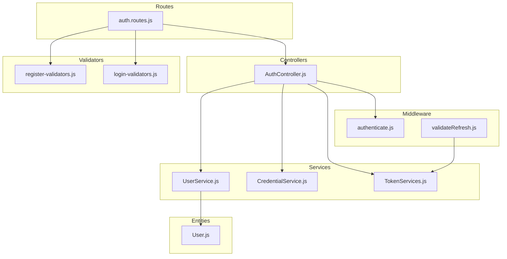
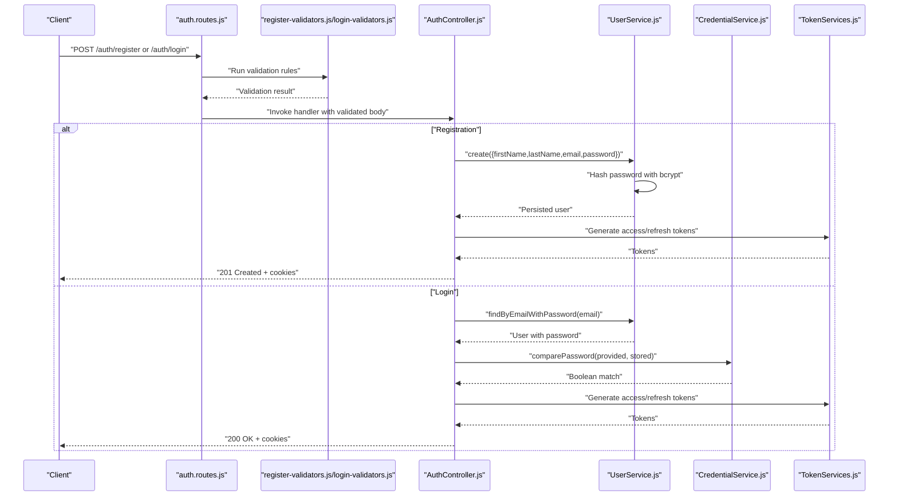
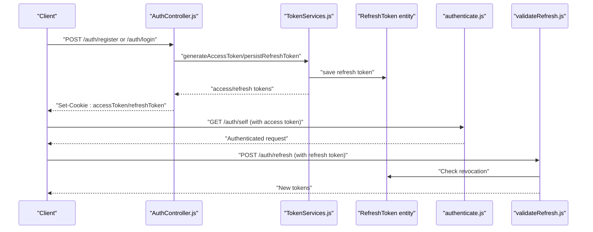
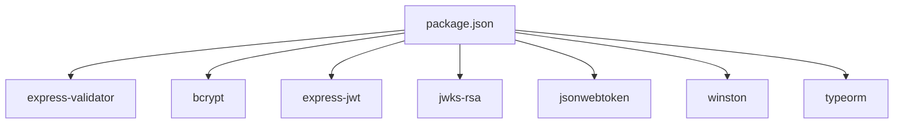

# Credential Validation

<cite>
**Referenced Files in This Document**
- [AuthController.js](file://src/controllers/AuthController.js)
- [register-validators.js](file://src/validators/register-validators.js)
- [login-validators.js](file://src/validators/login-validators.js)
- [auth.routes.js](file://src/routes/auth.routes.js)
- [CredentialService.js](file://src/services/CredentialService.js)
- [UserService.js](file://src/services/UserService.js)
- [User.js](file://src/entity/User.js)
- [TokenServices.js](file://src/services/TokenServices.js)
- [authenticate.js](file://src/middleware/authenticate.js)
- [validateRefresh.js](file://src/middleware/validateRefresh.js)
- [config.js](file://src/config/config.js)
- [register.spec.js](file://src/test/users/register.spec.js)
- [login.spec.js](file://src/test/users/login.spec.js)
- [package.json](file://package.json)
</cite>

## Table of Contents
1. [Introduction](#introduction)
2. [Project Structure](#project-structure)
3. [Core Components](#core-components)
4. [Architecture Overview](#architecture-overview)
5. [Detailed Component Analysis](#detailed-component-analysis)
6. [Dependency Analysis](#dependency-analysis)
7. [Performance Considerations](#performance-considerations)
8. [Troubleshooting Guide](#troubleshooting-guide)
9. [Conclusion](#conclusion)

## Introduction
This document explains the credential validation and password security implementation for the authentication service. It covers input validation rules for registration and login endpoints, password hashing and secure comparison, validation middleware usage with express-validator, error handling for validation failures, and practical examples of validator usage in controllers. It also outlines password policy enforcement, validation error responses, and security considerations for handling credentials.

## Project Structure
The authentication module is organized around controllers, validators, services, middleware, routes, and tests. The key areas relevant to credential validation and password security are:
- Validators define input rules for registration and login.
- Routes wire validators to controller actions.
- Controllers orchestrate validation, user creation, and password verification.
- Services handle password hashing, comparison, and token generation.
- Middleware enforces JWT authentication and refresh token validation.
- Tests validate behavior for successful registration, password hashing, and login.

**Diagram sources**
- [auth.routes.js:29-35](file://src/routes/auth.routes.js#L29-L35)
- [AuthController.js:19-70](file://src/controllers/AuthController.js#L19-L70)
- [register-validators.js:3-46](file://src/validators/register-validators.js#L3-L46)
- [login-validators.js:3-24](file://src/validators/login-validators.js#L3-L24)
- [UserService.js:7-38](file://src/services/UserService.js#L7-L38)
- [CredentialService.js:3-5](file://src/services/CredentialService.js#L3-L5)
- [TokenServices.js:8-52](file://src/services/TokenServices.js#L8-L52)
- [authenticate.js:6-25](file://src/middleware/authenticate.js#L6-L25)
- [validateRefresh.js:7-31](file://src/middleware/validateRefresh.js#L7-L31)
- [User.js:3-49](file://src/entity/User.js#L3-L49)

**Section sources**
- [auth.routes.js:29-35](file://src/routes/auth.routes.js#L29-L35)
- [AuthController.js:19-70](file://src/controllers/AuthController.js#L19-L70)
- [register-validators.js:3-46](file://src/validators/register-validators.js#L3-L46)
- [login-validators.js:3-24](file://src/validators/login-validators.js#L3-L24)
- [UserService.js:7-38](file://src/services/UserService.js#L7-L38)
- [CredentialService.js:3-5](file://src/services/CredentialService.js#L3-L5)
- [TokenServices.js:8-52](file://src/services/TokenServices.js#L8-L52)
- [authenticate.js:6-25](file://src/middleware/authenticate.js#L6-L25)
- [validateRefresh.js:7-31](file://src/middleware/validateRefresh.js#L7-L31)
- [User.js:3-49](file://src/entity/User.js#L3-L49)

## Core Components
- Input validators for registration and login enforce field presence, normalization, and length constraints.
- The AuthController coordinates validation, user creation, and password verification.
- UserService handles duplicate email checks, password hashing, and user retrieval.
- CredentialService performs secure password comparison using bcrypt.
- TokenServices generates access and refresh tokens and persists refresh tokens.
- Middleware enforces JWT authentication and validates refresh tokens against persisted records.

Key implementation references:
- Registration and login validators: [register-validators.js:3-46](file://src/validators/register-validators.js#L3-L46), [login-validators.js:3-24](file://src/validators/login-validators.js#L3-L24)
- Controller validation and error handling: [AuthController.js:19-70](file://src/controllers/AuthController.js#L19-L70)
- Password hashing and comparison: [UserService.js:17-18](file://src/services/UserService.js#L17-L18), [CredentialService.js:3-5](file://src/services/CredentialService.js#L3-L5)
- Token generation and persistence: [TokenServices.js:12-52](file://src/services/TokenServices.js#L12-L52)
- Authentication and refresh token validation middleware: [authenticate.js:6-25](file://src/middleware/authenticate.js#L6-L25), [validateRefresh.js:7-31](file://src/middleware/validateRefresh.js#L7-L31)

**Section sources**
- [register-validators.js:3-46](file://src/validators/register-validators.js#L3-L46)
- [login-validators.js:3-24](file://src/validators/login-validators.js#L3-L24)
- [AuthController.js:19-70](file://src/controllers/AuthController.js#L19-L70)
- [UserService.js:17-18](file://src/services/UserService.js#L17-L18)
- [CredentialService.js:3-5](file://src/services/CredentialService.js#L3-L5)
- [TokenServices.js:12-52](file://src/services/TokenServices.js#L12-L52)
- [authenticate.js:6-25](file://src/middleware/authenticate.js#L6-L25)
- [validateRefresh.js:7-31](file://src/middleware/validateRefresh.js#L7-L31)

## Architecture Overview
The credential lifecycle spans route wiring, validation, controller orchestration, service operations, and token issuance. The following sequence illustrates registration and login flows with validation and password security.

**Diagram sources**
- [auth.routes.js:29-35](file://src/routes/auth.routes.js#L29-L35)
- [register-validators.js:3-46](file://src/validators/register-validators.js#L3-L46)
- [login-validators.js:3-24](file://src/validators/login-validators.js#L3-L24)
- [AuthController.js:19-136](file://src/controllers/AuthController.js#L19-L136)
- [UserService.js:7-38](file://src/services/UserService.js#L7-L38)
- [CredentialService.js:3-5](file://src/services/CredentialService.js#L3-L5)
- [TokenServices.js:12-52](file://src/services/TokenServices.js#L12-L52)

## Detailed Component Analysis

### Input Validation Rules and Express-Validator Usage
- Registration endpoint enforces:
  - Names: required, trimmed, length bounds.
  - Email: required, normalized, valid format.
  - Password: required, minimum length.
- Login endpoint enforces:
  - Email: required, normalized, valid format.
  - Password: required, minimum length.
- Validators are attached to routes and executed before controller handlers.

Practical usage examples:
- Registration route attaches the registration validator and invokes the controller: [auth.routes.js:29](file://src/routes/auth.routes.js#L29)
- Login route attaches the login validator and invokes the controller: [auth.routes.js:33](file://src/routes/auth.routes.js#L33)
- Controller reads validation results and returns structured errors when present: [AuthController.js:23-26](file://src/controllers/AuthController.js#L23-L26)

Validation error response:
- On validation failure, the controller responds with HTTP 400 and an array of errors: [AuthController.js:25](file://src/controllers/AuthController.js#L25)

Custom validation messages:
- Messages are defined in validators for clarity and user guidance: [register-validators.js:8-13](file://src/validators/register-validators.js#L8-L13), [register-validators.js:32-34](file://src/validators/register-validators.js#L32-L34), [login-validators.js:8-12](file://src/validators/login-validators.js#L8-L12)

**Section sources**
- [register-validators.js:3-46](file://src/validators/register-validators.js#L3-L46)
- [login-validators.js:3-24](file://src/validators/login-validators.js#L3-L24)
- [auth.routes.js:29-35](file://src/routes/auth.routes.js#L29-L35)
- [AuthController.js:23-26](file://src/controllers/AuthController.js#L23-L26)

### Password Security Implementation
- Password hashing:
  - Salt rounds are configured in UserService prior to hashing: [UserService.js:17-18](file://src/services/UserService.js#L17-L18)
  - Hashed passwords are stored in the User entity: [User.js:23-26](file://src/entity/User.js#L23-L26)
- Secure password comparison:
  - CredentialService uses bcrypt.compare for timing-safe comparison: [CredentialService.js:3-5](file://src/services/CredentialService.js#L3-L5)
  - AuthController delegates comparison to CredentialService: [AuthController.js:92-95](file://src/controllers/AuthController.js#L92-L95)
- Test evidence:
  - Registration test verifies hashed password length and non-equality to plaintext: [register.spec.js:89-96](file://src/test/users/register.spec.js#L89-L96)
  - Login test verifies bcrypt.compare behavior: [login.spec.js:85-89](file://src/test/users/login.spec.js#L85-L89)

Best practices demonstrated:
- Separate hashing from storage via UserService.
- Use bcrypt for password comparison to avoid timing attacks.
- Store only hashed passwords; sensitive fields are excluded from selection where appropriate.

**Section sources**
- [UserService.js:17-18](file://src/services/UserService.js#L17-L18)
- [CredentialService.js:3-5](file://src/services/CredentialService.js#L3-L5)
- [AuthController.js:92-95](file://src/controllers/AuthController.js#L92-L95)
- [User.js:23-26](file://src/entity/User.js#L23-L26)
- [register.spec.js:89-96](file://src/test/users/register.spec.js#L89-L96)
- [login.spec.js:85-89](file://src/test/users/login.spec.js#L85-L89)

### Token-Based Authentication and Refresh Flow
- Access token generation uses RS256 with a private key and expires in 1 hour: [TokenServices.js:12-32](file://src/services/TokenServices.js#L12-L32)
- Refresh token generation uses HS256 with a shared secret and expires in 7 days: [TokenServices.js:34-43](file://src/services/TokenServices.js#L34-L43)
- Persisted refresh tokens are stored per user: [TokenServices.js:45-52](file://src/services/TokenServices.js#L45-L52)
- Authentication middleware supports both Authorization header and cookie tokens: [authenticate.js:13-24](file://src/middleware/authenticate.js#L13-L24)
- Refresh token validation checks revocation against persisted tokens: [validateRefresh.js:14-24](file://src/middleware/validateRefresh.js#L14-L24)

**Diagram sources**
- [TokenServices.js:12-52](file://src/services/TokenServices.js#L12-L52)
- [validateRefresh.js:14-24](file://src/middleware/validateRefresh.js#L14-L24)
- [authenticate.js:13-24](file://src/middleware/authenticate.js#L13-L24)
- [AuthController.js:19-136](file://src/controllers/AuthController.js#L19-L136)

**Section sources**
- [TokenServices.js:12-52](file://src/services/TokenServices.js#L12-L52)
- [validateRefresh.js:14-24](file://src/middleware/validateRefresh.js#L14-L24)
- [authenticate.js:13-24](file://src/middleware/authenticate.js#L13-L24)
- [AuthController.js:19-136](file://src/controllers/AuthController.js#L19-L136)

### Password Policy Enforcement and Validation Scenarios
- Minimum password length enforced by validators and tested in registration: [register-validators.js:41-44](file://src/validators/register-validators.js#L41-L44), [register.spec.js:162-165](file://src/test/users/register.spec.js#L162-L165)
- Email format enforced by validators and tested in registration: [register-validators.js:32-34](file://src/validators/register-validators.js#L32-L34), [register.spec.js:157-160](file://src/test/users/register.spec.js#L157-L160)
- Duplicate email prevention in UserService with HTTP 400 response: [UserService.js:13-16](file://src/services/UserService.js#L13-L16)
- Login error handling for invalid credentials: [AuthController.js:86-101](file://src/controllers/AuthController.js#L86-L101)

Common validation scenarios:
- Missing fields trigger HTTP 400 with validation errors: [AuthController.js:23-26](file://src/controllers/AuthController.js#L23-L26)
- Too-short passwords rejected by validators and tests: [register-validators.js:41-44](file://src/validators/register-validators.js#L41-L44), [register.spec.js:162-165](file://src/test/users/register.spec.js#L162-L165)

**Section sources**
- [register-validators.js:41-44](file://src/validators/register-validators.js#L41-L44)
- [register.spec.js:157-165](file://src/test/users/register.spec.js#L157-L165)
- [UserService.js:13-16](file://src/services/UserService.js#L13-L16)
- [AuthController.js:86-101](file://src/controllers/AuthController.js#L86-L101)

### Cookie Security and Environment Awareness
- Access and refresh tokens are returned as HttpOnly cookies with SameSite strict and configurable maxAge: [AuthController.js:50-62](file://src/controllers/AuthController.js#L50-L62), [AuthController.js:116-128](file://src/controllers/AuthController.js#L116-L128)
- Cookie domain and security settings should be environment-aware (as noted in comments): [AuthController.js:49-55](file://src/controllers/AuthController.js#L49-L55), [AuthController.js:115-121](file://src/controllers/AuthController.js#L115-L121)
- JWT issuer and algorithm configuration are centralized: [TokenServices.js:25-29](file://src/services/TokenServices.js#L25-L29), [authenticate.js:12-12](file://src/middleware/authenticate.js#L12-L12), [validateRefresh.js:8-9](file://src/middleware/validateRefresh.js#L8-L9)

**Section sources**
- [AuthController.js:49-62](file://src/controllers/AuthController.js#L49-L62)
- [AuthController.js:115-128](file://src/controllers/AuthController.js#L115-L128)
- [TokenServices.js:25-29](file://src/services/TokenServices.js#L25-L29)
- [authenticate.js:12](file://src/middleware/authenticate.js#L12)
- [validateRefresh.js:8-9](file://src/middleware/validateRefresh.js#L8-L9)

## Dependency Analysis
External libraries and their roles:
- express-validator: Defines and executes validation rules for request bodies.
- bcrypt: Provides secure password hashing and comparison.
- express-jwt + jwks-rsa: Implements JWT authentication with dynamic JWKs.
- jsonwebtoken: Generates access and refresh tokens.
- winston: Logging support (referenced in controller logs).
- typeorm: ORM for User and RefreshToken entities.

**Diagram sources**
- [package.json:30-47](file://package.json#L30-L47)

**Section sources**
- [package.json:30-47](file://package.json#L30-L47)

## Performance Considerations
- bcrypt cost: Salt rounds are set in UserService; adjust based on hardware capacity to balance security and latency.
- Validation overhead: express-validator adds minimal overhead; keep rules concise and avoid redundant checks.
- Token operations: Persisting refresh tokens introduces database writes; ensure indexes on foreign keys and token identifiers.
- Logging: Use structured logging to minimize overhead in production.

## Troubleshooting Guide
- Validation failures:
  - Symptom: HTTP 400 with an errors array.
  - Cause: Missing or invalid fields failing validator rules.
  - Resolution: Align client payload with validator specs and ensure proper normalization (e.g., email normalization).
  - Evidence: Controller returns structured errors on validation failure: [AuthController.js:23-26](file://src/controllers/AuthController.js#L23-L26)
- Duplicate email:
  - Symptom: HTTP 400 indicating email already exists.
  - Cause: Existing user record with the same email.
  - Resolution: Prompt user to use another email or initiate password reset.
  - Evidence: UserService throws 400 on duplicate: [UserService.js:13-16](file://src/services/UserService.js#L13-L16)
- Invalid login credentials:
  - Symptom: HTTP 400 with mismatch message.
  - Cause: Non-existent user or incorrect password.
  - Resolution: Verify email and password; ensure bcrypt comparison is used.
  - Evidence: AuthController compares password and returns error on mismatch: [AuthController.js:86-101](file://src/controllers/AuthController.js#L86-L101)
- Token-related issues:
  - Access token not accepted: Ensure Authorization header or accessToken cookie is present and valid.
  - Refresh token invalid or revoked: Confirm token exists in database and is not deleted.
  - Evidence: Authentication and refresh middleware token extraction and revocation checks: [authenticate.js:13-24](file://src/middleware/authenticate.js#L13-L24), [validateRefresh.js:14-24](file://src/middleware/validateRefresh.js#L14-L24)

**Section sources**
- [AuthController.js:23-26](file://src/controllers/AuthController.js#L23-L26)
- [UserService.js:13-16](file://src/services/UserService.js#L13-L16)
- [AuthController.js:86-101](file://src/controllers/AuthController.js#L86-L101)
- [authenticate.js:13-24](file://src/middleware/authenticate.js#L13-L24)
- [validateRefresh.js:14-24](file://src/middleware/validateRefresh.js#L14-L24)

## Conclusion
The authentication service implements robust credential validation and password security:
- Clear input validation rules for registration and login using express-validator.
- Secure password hashing and comparison with bcrypt.
- Structured error responses for validation failures and invalid credentials.
- Token-based authentication with access and refresh tokens, including revocation checks.
- Practical examples and tests demonstrate correct behavior for hashing, validation, and login flows.