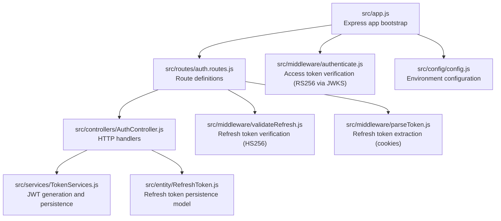
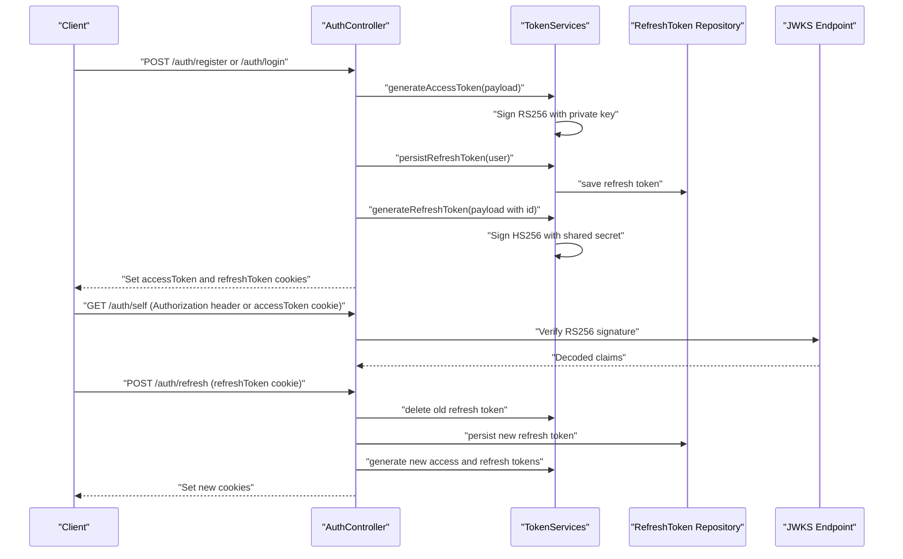
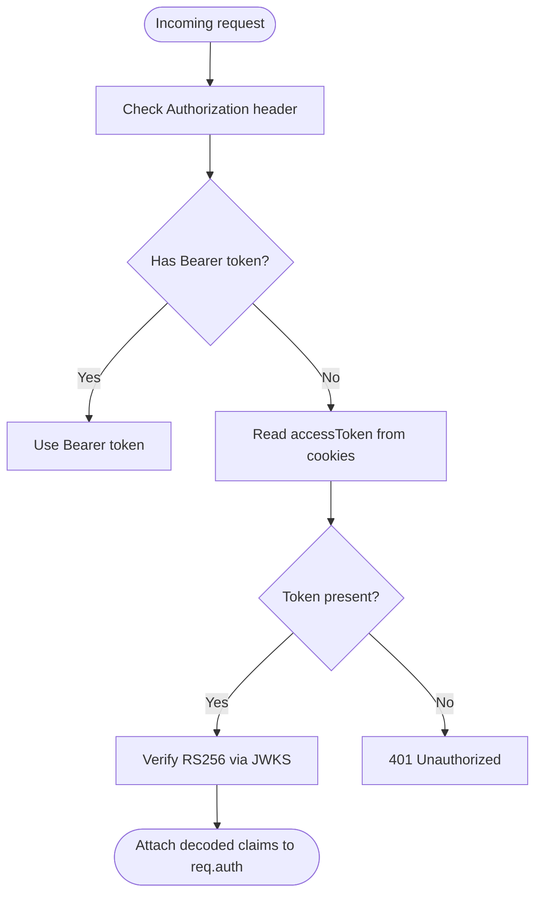
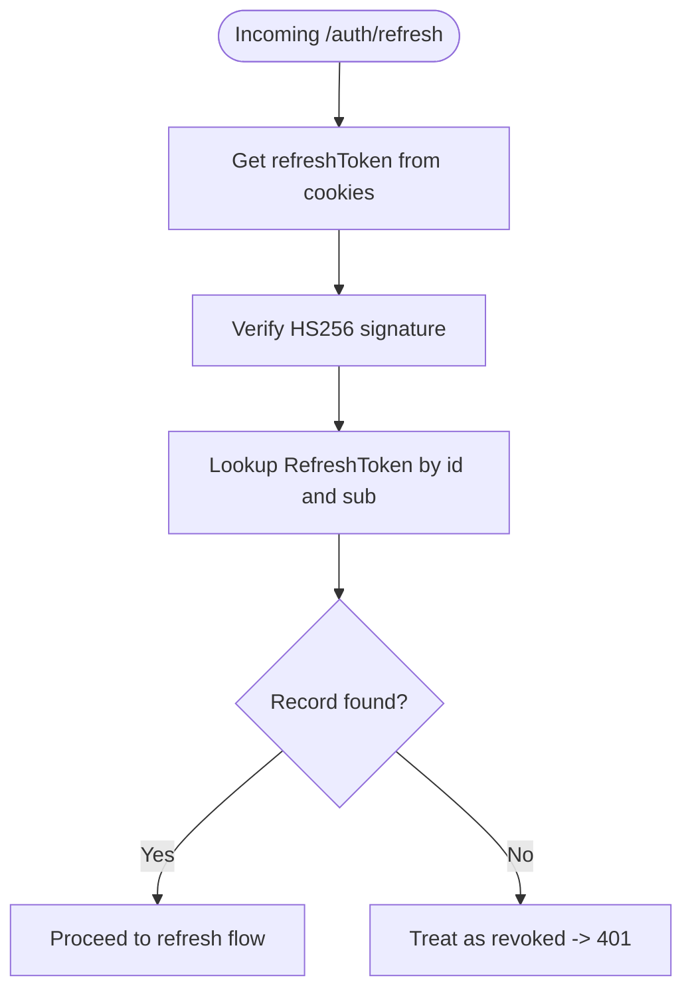
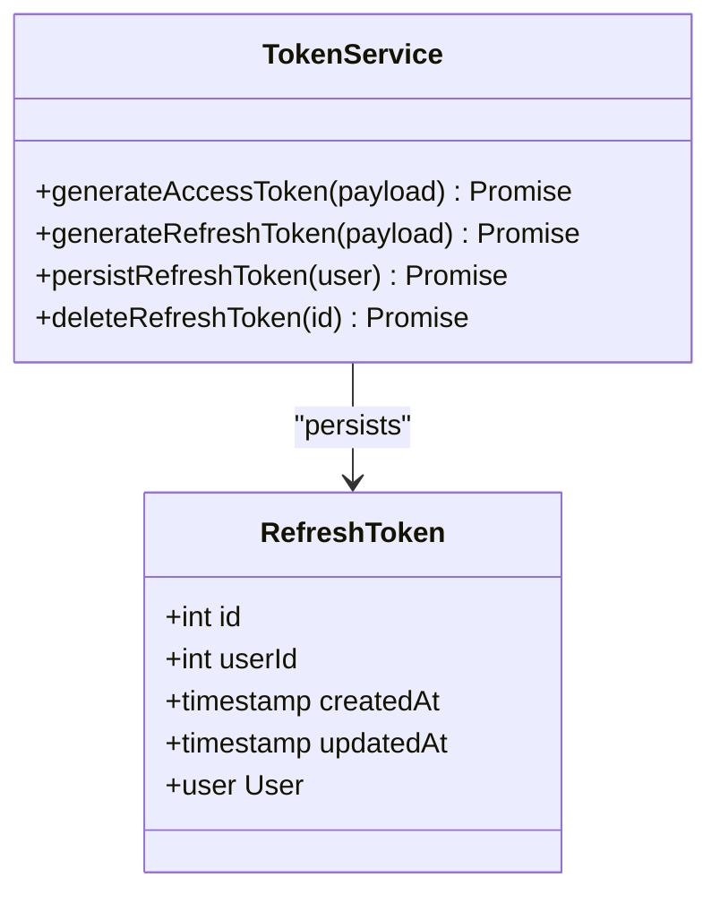
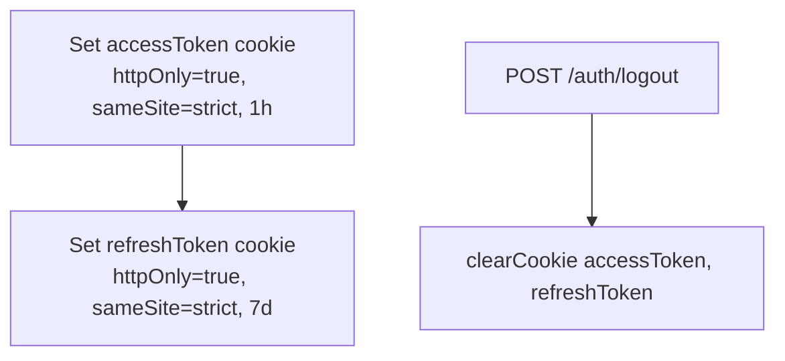
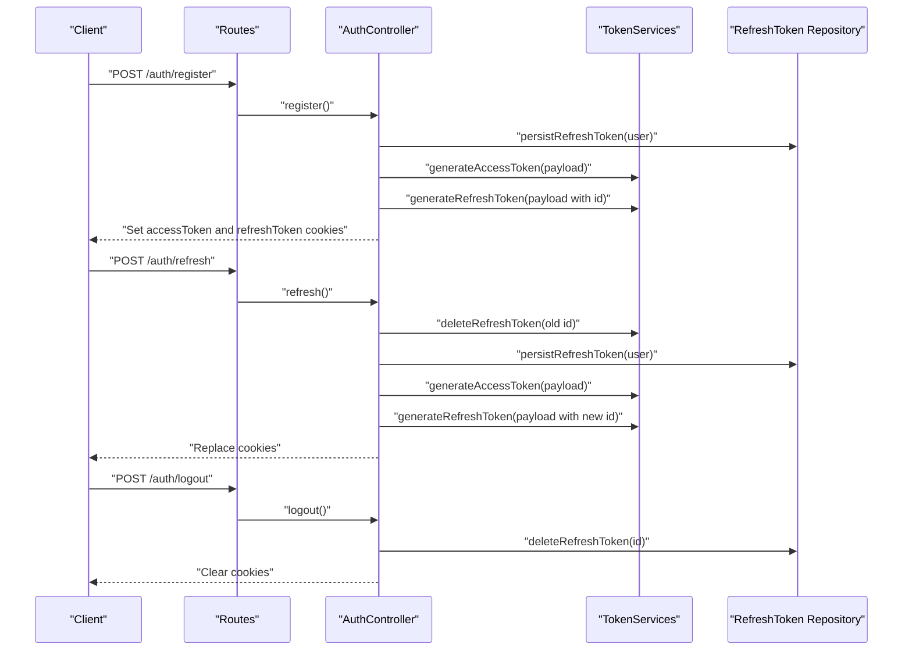
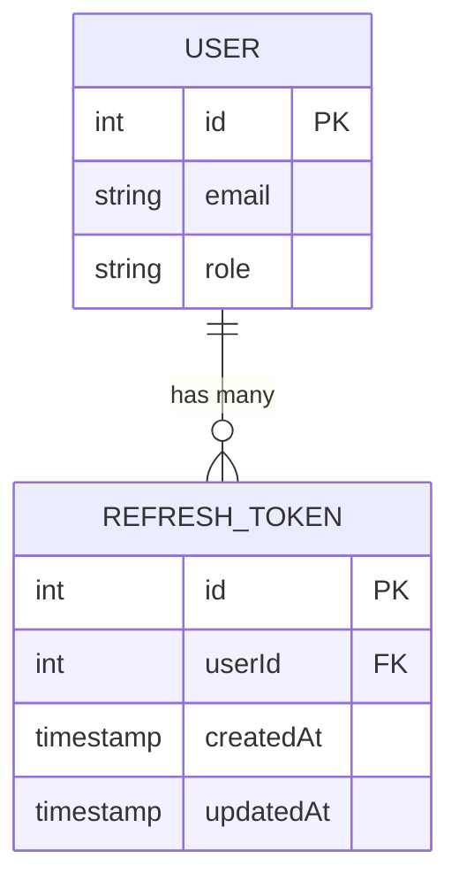
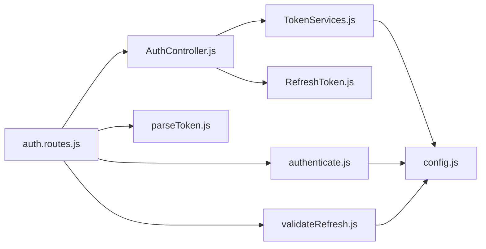

# JWT Token Management

<cite>
**Referenced Files in This Document**
- [src/app.js](file://src/app.js)
- [src/config/config.js](file://src/config/config.js)
- [src/middleware/authenticate.js](file://src/middleware/authenticate.js)
- [src/middleware/parseToken.js](file://src/middleware/parseToken.js)
- [src/middleware/validateRefresh.js](file://src/middleware/validateRefresh.js)
- [src/routes/auth.routes.js](file://src/routes/auth.routes.js)
- [src/controllers/AuthController.js](file://src/controllers/AuthController.js)
- [src/services/TokenServices.js](file://src/services/TokenServices.js)
- [src/entity/RefreshToken.js](file://src/entity/RefreshToken.js)
- [src/constants/index.js](file://src/constants/index.js)
- [src/test/users/refresh.spec.js](file://src/test/users/refresh.spec.js)
</cite>

## Table of Contents
1. [Introduction](#introduction)
2. [Project Structure](#project-structure)
3. [Core Components](#core-components)
4. [Architecture Overview](#architecture-overview)
5. [Detailed Component Analysis](#detailed-component-analysis)
6. [Dependency Analysis](#dependency-analysis)
7. [Performance Considerations](#performance-considerations)
8. [Troubleshooting Guide](#troubleshooting-guide)
9. [Conclusion](#conclusion)

## Introduction
This document explains the JWT token management implementation in the authentication service. It covers the dual-token architecture using RS256 for access tokens and HS256 for refresh tokens, token generation and validation, rotation and lifecycle management, payload structure, cookie-based storage with security flags, and operational best practices.

## Project Structure
The JWT-related logic spans middleware, controllers, services, routes, and configuration. The application initializes cookie parsing and mounts the authentication router under /auth.

**Diagram sources**
- [src/app.js:1-40](file://src/app.js#L1-L40)
- [src/routes/auth.routes.js:1-49](file://src/routes/auth.routes.js#L1-L49)
- [src/controllers/AuthController.js:1-212](file://src/controllers/AuthController.js#L1-L212)
- [src/services/TokenServices.js:1-60](file://src/services/TokenServices.js#L1-L60)
- [src/entity/RefreshToken.js:1-35](file://src/entity/RefreshToken.js#L1-L35)
- [src/middleware/authenticate.js:1-26](file://src/middleware/authenticate.js#L1-L26)
- [src/middleware/validateRefresh.js:1-34](file://src/middleware/validateRefresh.js#L1-L34)
- [src/middleware/parseToken.js:1-14](file://src/middleware/parseToken.js#L1-L14)
- [src/config/config.js:1-34](file://src/config/config.js#L1-L34)

**Section sources**
- [src/app.js:1-40](file://src/app.js#L1-L40)
- [src/routes/auth.routes.js:1-49](file://src/routes/auth.routes.js#L1-L49)

## Core Components
- Access token middleware (RS256): Verifies access tokens using JWKS-based secrets and supports cookie fallback.
- Refresh token middleware (HS256): Extracts refresh tokens from cookies and checks revocation against persisted refresh tokens.
- Token service: Generates RS256 access tokens and HS256 refresh tokens, persists refresh tokens, and deletes them on logout.
- Auth controller: Implements registration, login, refresh, and logout flows; sets secure cookies for tokens.
- Refresh token entity: Defines the refresh token table schema and relation to User.
- Configuration: Loads environment variables including private key secret and JWKS URI.

**Section sources**
- [src/middleware/authenticate.js:1-26](file://src/middleware/authenticate.js#L1-L26)
- [src/middleware/validateRefresh.js:1-34](file://src/middleware/validateRefresh.js#L1-L34)
- [src/services/TokenServices.js:1-60](file://src/services/TokenServices.js#L1-L60)
- [src/controllers/AuthController.js:1-212](file://src/controllers/AuthController.js#L1-L212)
- [src/entity/RefreshToken.js:1-35](file://src/entity/RefreshToken.js#L1-L35)
- [src/config/config.js:1-34](file://src/config/config.js#L1-L34)

## Architecture Overview
The system uses a dual-token strategy:
- Access tokens (RS256): Short-lived, validated via JWKS.
- Refresh tokens (HS256): Longer-lived, stored in DB with revocation support.

**Diagram sources**
- [src/controllers/AuthController.js:19-70](file://src/controllers/AuthController.js#L19-L70)
- [src/controllers/AuthController.js:72-136](file://src/controllers/AuthController.js#L72-L136)
- [src/controllers/AuthController.js:143-192](file://src/controllers/AuthController.js#L143-L192)
- [src/controllers/AuthController.js:194-210](file://src/controllers/AuthController.js#L194-L210)
- [src/services/TokenServices.js:12-42](file://src/services/TokenServices.js#L12-L42)
- [src/services/TokenServices.js:45-58](file://src/services/TokenServices.js#L45-L58)
- [src/middleware/authenticate.js:6-25](file://src/middleware/authenticate.js#L6-L25)
- [src/middleware/validateRefresh.js:7-31](file://src/middleware/validateRefresh.js#L7-L31)

## Detailed Component Analysis

### Access Token Middleware (RS256 via JWKS)
- Uses JWKS to fetch public keys for RS256 signature verification.
- Extracts token from Authorization header or accessToken cookie.
- Supports caching and rate limiting for JWKS retrieval.

**Diagram sources**
- [src/middleware/authenticate.js:6-25](file://src/middleware/authenticate.js#L6-L25)

**Section sources**
- [src/middleware/authenticate.js:1-26](file://src/middleware/authenticate.js#L1-L26)
- [src/config/config.js:11-33](file://src/config/config.js#L11-L33)

### Refresh Token Middleware (HS256 with Revocation)
- Extracts refresh token from refreshToken cookie.
- Validates HS256 signature using a shared secret.
- Checks revocation by querying the persisted refresh token record using token id and user id.

**Diagram sources**
- [src/middleware/validateRefresh.js:7-31](file://src/middleware/validateRefresh.js#L7-L31)

**Section sources**
- [src/middleware/validateRefresh.js:1-34](file://src/middleware/validateRefresh.js#L1-L34)
- [src/config/config.js:11-33](file://src/config/config.js#L11-L33)

### Token Generation and Persistence
- Access tokens:
  - Signed with RS256 using a private key file.
  - Expires in 1 hour.
  - Issued by the auth service.
- Refresh tokens:
  - Signed with HS256 using a shared secret.
  - Expires in 7 days.
  - Includes a JWT ID derived from the refresh token record id.
  - Persisted in the refreshTokens table with timestamps and user relation.

**Diagram sources**
- [src/services/TokenServices.js:8-59](file://src/services/TokenServices.js#L8-L59)
- [src/entity/RefreshToken.js:3-34](file://src/entity/RefreshToken.js#L3-L34)

**Section sources**
- [src/services/TokenServices.js:1-60](file://src/services/TokenServices.js#L1-L60)
- [src/entity/RefreshToken.js:1-35](file://src/entity/RefreshToken.js#L1-L35)

### Cookie-Based Storage and Security Flags
- Access token cookie:
  - httpOnly: true
  - sameSite: "strict"
  - maxAge: 1 hour
  - domain: localhost
- Refresh token cookie:
  - httpOnly: true
  - sameSite: "strict"
  - maxAge: 7 days
  - domain: localhost
- Logout clears both cookies.

**Diagram sources**
- [src/controllers/AuthController.js:50-62](file://src/controllers/AuthController.js#L50-L62)
- [src/controllers/AuthController.js:116-128](file://src/controllers/AuthController.js#L116-L128)
- [src/controllers/AuthController.js:172-184](file://src/controllers/AuthController.js#L172-L184)
- [src/controllers/AuthController.js:202-203](file://src/controllers/AuthController.js#L202-L203)

**Section sources**
- [src/controllers/AuthController.js:49-62](file://src/controllers/AuthController.js#L49-L62)
- [src/controllers/AuthController.js:115-128](file://src/controllers/AuthController.js#L115-L128)
- [src/controllers/AuthController.js:171-184](file://src/controllers/AuthController.js#L171-L184)
- [src/controllers/AuthController.js:194-210](file://src/controllers/AuthController.js#L194-L210)

### Token Lifecycle: Registration, Login, Refresh, Logout
- Registration/Login:
  - Create a refresh token record.
  - Issue RS256 access token and HS256 refresh token.
  - Store both in cookies.
- Refresh:
  - Validate refresh token (revocation check).
  - Rotate tokens: delete old refresh, persist new, issue new access and refresh.
  - Replace cookies.
- Logout:
  - Delete refresh token record.
  - Clear cookies.

**Diagram sources**
- [src/routes/auth.routes.js:29-46](file://src/routes/auth.routes.js#L29-L46)
- [src/controllers/AuthController.js:19-70](file://src/controllers/AuthController.js#L19-L70)
- [src/controllers/AuthController.js:143-192](file://src/controllers/AuthController.js#L143-L192)
- [src/controllers/AuthController.js:194-210](file://src/controllers/AuthController.js#L194-L210)
- [src/services/TokenServices.js:45-58](file://src/services/TokenServices.js#L45-L58)

**Section sources**
- [src/routes/auth.routes.js:1-49](file://src/routes/auth.routes.js#L1-L49)
- [src/controllers/AuthController.js:1-212](file://src/controllers/AuthController.js#L1-L212)
- [src/services/TokenServices.js:1-60](file://src/services/TokenServices.js#L1-L60)

### Payload Structure and Claims
- Subject (sub): User identifier as a string.
- Role claim: User role (e.g., customer, admin, manager).
- Refresh token ID (jti): Derived from the refresh token record id; included as id in refresh token payload.

**Diagram sources**
- [src/entity/RefreshToken.js:3-34](file://src/entity/RefreshToken.js#L3-L34)

**Section sources**
- [src/controllers/AuthController.js:37-47](file://src/controllers/AuthController.js#L37-L47)
- [src/controllers/AuthController.js:103-113](file://src/controllers/AuthController.js#L103-L113)
- [src/controllers/AuthController.js:145-148](file://src/controllers/AuthController.js#L145-L148)
- [src/services/TokenServices.js:39](file://src/services/TokenServices.js#L39)
- [src/constants/index.js:1-6](file://src/constants/index.js#L1-L6)

### Practical Examples and Usage Patterns
- Token parsing middleware usage:
  - Access token verification middleware supports Authorization header or accessToken cookie.
  - Refresh token middleware extracts refreshToken from cookies and enforces revocation.
- JWT verification:
  - Access tokens verified via RS256 using JWKS.
  - Refresh tokens verified via HS256 using a shared secret.
- Token rotation strategies:
  - On refresh, delete the old refresh token, persist a new one, and issue new access and refresh tokens.
  - On logout, delete the refresh token and clear cookies.

**Section sources**
- [src/middleware/authenticate.js:1-26](file://src/middleware/authenticate.js#L1-L26)
- [src/middleware/validateRefresh.js:1-34](file://src/middleware/validateRefresh.js#L1-L34)
- [src/controllers/AuthController.js:143-192](file://src/controllers/AuthController.js#L143-L192)
- [src/controllers/AuthController.js:194-210](file://src/controllers/AuthController.js#L194-L210)

## Dependency Analysis
- Route layer depends on controllers and middleware.
- Controllers depend on services and repositories.
- Services depend on configuration and filesystem for private key.
- Middleware depends on configuration and database for refresh token validation.

**Diagram sources**
- [src/routes/auth.routes.js:1-49](file://src/routes/auth.routes.js#L1-L49)
- [src/controllers/AuthController.js:1-212](file://src/controllers/AuthController.js#L1-L212)
- [src/services/TokenServices.js:1-60](file://src/services/TokenServices.js#L1-L60)
- [src/entity/RefreshToken.js:1-35](file://src/entity/RefreshToken.js#L1-L35)
- [src/middleware/authenticate.js:1-26](file://src/middleware/authenticate.js#L1-L26)
- [src/middleware/validateRefresh.js:1-34](file://src/middleware/validateRefresh.js#L1-L34)
- [src/middleware/parseToken.js:1-14](file://src/middleware/parseToken.js#L1-L14)
- [src/config/config.js:1-34](file://src/config/config.js#L1-L34)

**Section sources**
- [src/routes/auth.routes.js:1-49](file://src/routes/auth.routes.js#L1-L49)
- [src/controllers/AuthController.js:1-212](file://src/controllers/AuthController.js#L1-L212)
- [src/services/TokenServices.js:1-60](file://src/services/TokenServices.js#L1-L60)

## Performance Considerations
- Prefer short-lived access tokens (1 hour) to minimize exposure windows.
- Use JWKS caching and rate limiting to reduce network overhead.
- Keep refresh token TTL reasonable (7 days) and enforce revocation on rotation and logout.
- Store refresh tokens in a dedicated table with appropriate indexing on id and user id.

## Troubleshooting Guide
- 401 Unauthorized on protected routes:
  - Ensure Authorization header carries a valid RS256 access token or accessToken cookie is present.
  - Confirm JWKS endpoint availability and correctness of JWKS URI.
- 401 on refresh:
  - Verify refreshToken cookie is present and unexpired.
  - Confirm refresh token record exists and belongs to the user.
  - Check that the refresh token id matches the persisted record id.
- Logout not taking effect:
  - Ensure refresh token deletion succeeds and cookies are cleared.
- Cookie flags:
  - httpOnly and sameSite should remain enabled in production.
  - Consider setting secure flag for HTTPS environments.

**Section sources**
- [src/middleware/authenticate.js:1-26](file://src/middleware/authenticate.js#L1-L26)
- [src/middleware/validateRefresh.js:1-34](file://src/middleware/validateRefresh.js#L1-L34)
- [src/controllers/AuthController.js:194-210](file://src/controllers/AuthController.js#L194-L210)
- [src/test/users/refresh.spec.js:99-107](file://src/test/users/refresh.spec.js#L99-L107)

## Conclusion
The implementation follows a robust dual-token pattern with RS256 access tokens and HS256 refresh tokens, proper cookie security flags, and token rotation with revocation. By adhering to the outlined practices—short-lived access tokens, JWKS-based verification, strict cookie policies, and controlled refresh flows—the system achieves strong security and maintainability.