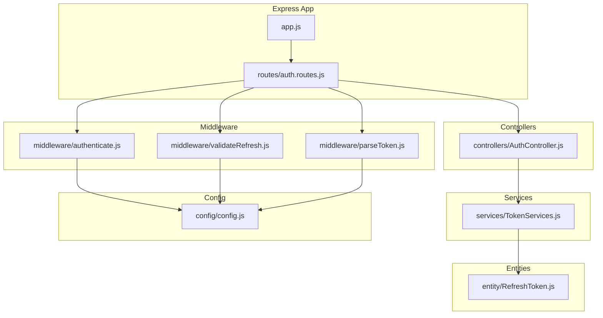
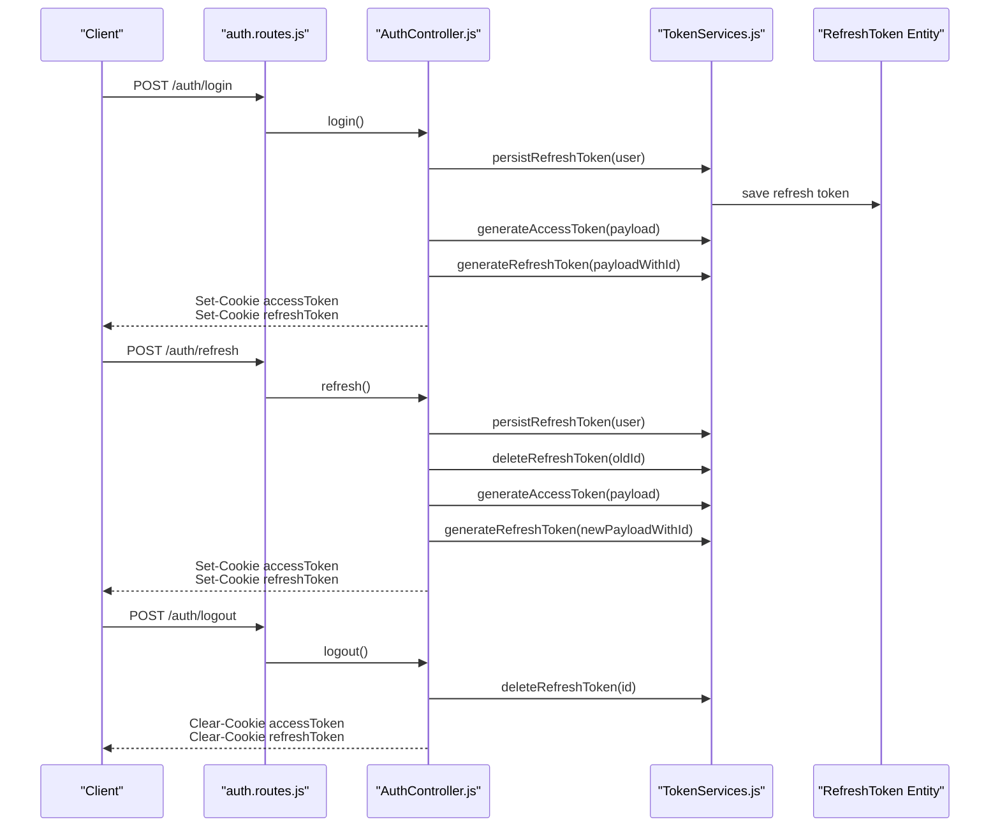
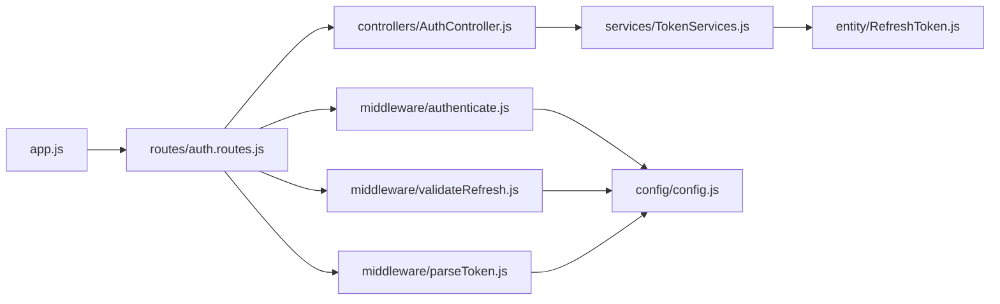

# Session Management

<cite>
**Referenced Files in This Document**
- [src/app.js](file://src/app.js)
- [src/config/config.js](file://src/config/config.js)
- [src/controllers/AuthController.js](file://src/controllers/AuthController.js)
- [src/middleware/authenticate.js](file://src/middleware/authenticate.js)
- [src/middleware/validateRefresh.js](file://src/middleware/validateRefresh.js)
- [src/middleware/parseToken.js](file://src/middleware/parseToken.js)
- [src/routes/auth.routes.js](file://src/routes/auth.routes.js)
- [src/services/TokenServices.js](file://src/services/TokenServices.js)
- [src/entity/RefreshToken.js](file://src/entity/RefreshToken.js)
- [src/test/users/login.spec.js](file://src/test/users/login.spec.js)
- [src/test/users/refresh.spec.js](file://src/test/users/refresh.spec.js)
</cite>

## Table of Contents
1. [Introduction](#introduction)
2. [Project Structure](#project-structure)
3. [Core Components](#core-components)
4. [Architecture Overview](#architecture-overview)
5. [Detailed Component Analysis](#detailed-component-analysis)
6. [Dependency Analysis](#dependency-analysis)
7. [Performance Considerations](#performance-considerations)
8. [Troubleshooting Guide](#troubleshooting-guide)
9. [Conclusion](#conclusion)
10. [Appendices](#appendices)

## Introduction
This document explains the session management implementation using JWT cookies in the authentication service. It covers cookie-based session handling with accessToken and refreshToken storage, cookie configuration (domain, httpOnly, sameSite, expiration), the session lifecycle from login to refresh and logout, practical examples of cookie manipulation and session validation, cross-origin considerations, security implications, CSRF protection, session hijacking prevention, cleanup procedures, and troubleshooting guidance.

## Project Structure
The authentication service is organized around Express routes, controllers, middleware, services, and TypeORM entities. Authentication endpoints are mounted under /auth and include registration, login, profile retrieval, refresh, and logout. Middleware validates access tokens and refresh tokens, while services handle JWT generation and refresh token persistence.

**Diagram sources**
- [src/app.js:1-40](file://src/app.js#L1-L40)
- [src/routes/auth.routes.js:1-49](file://src/routes/auth.routes.js#L1-L49)
- [src/controllers/AuthController.js:1-212](file://src/controllers/AuthController.js#L1-L212)
- [src/middleware/authenticate.js:1-26](file://src/middleware/authenticate.js#L1-L26)
- [src/middleware/validateRefresh.js:1-34](file://src/middleware/validateRefresh.js#L1-L34)
- [src/middleware/parseToken.js:1-14](file://src/middleware/parseToken.js#L1-L14)
- [src/services/TokenServices.js:1-60](file://src/services/TokenServices.js#L1-L60)
- [src/entity/RefreshToken.js:1-35](file://src/entity/RefreshToken.js#L1-L35)
- [src/config/config.js:1-34](file://src/config/config.js#L1-L34)

**Section sources**
- [src/app.js:1-40](file://src/app.js#L1-L40)
- [src/routes/auth.routes.js:1-49](file://src/routes/auth.routes.js#L1-L49)

## Core Components
- Access token validation middleware: Extracts token from Authorization header or accessToken cookie and validates it against JWKS.
- Refresh token validation middleware: Extracts refreshToken from cookie and checks revocation via persisted refresh token records.
- Token service: Generates access tokens (RS256) and refresh tokens (HS256), persists refresh tokens, and deletes them on logout.
- Auth controller: Implements register, login, refresh, and logout endpoints; sets accessToken and refreshToken cookies.
- Routes: Mount endpoints and apply middleware for authentication and refresh validation.
- Configuration: Loads environment variables including JWKS URI and refresh secret.

Key cookie configuration used in the implementation:
- accessToken: httpOnly=true, sameSite="strict", maxAge=1 hour, domain="localhost".
- refreshToken: httpOnly=true, sameSite="strict", maxAge=7 days, domain="localhost".

Security posture:
- Access tokens are RS256-signed and validated via JWKS.
- Refresh tokens are HS256-signed with a shared secret and persisted in the database for revocation control.
- Logout clears both cookies and deletes the refresh token record.

**Section sources**
- [src/middleware/authenticate.js:1-26](file://src/middleware/authenticate.js#L1-L26)
- [src/middleware/validateRefresh.js:1-34](file://src/middleware/validateRefresh.js#L1-L34)
- [src/services/TokenServices.js:1-60](file://src/services/TokenServices.js#L1-L60)
- [src/controllers/AuthController.js:1-212](file://src/controllers/AuthController.js#L1-L212)
- [src/routes/auth.routes.js:1-49](file://src/routes/auth.routes.js#L1-L49)
- [src/config/config.js:1-34](file://src/config/config.js#L1-L34)

## Architecture Overview
The session lifecycle uses short-lived access tokens and long-lived refresh tokens stored in cookies. Access tokens are validated on protected routes; refresh tokens are validated on the refresh endpoint and used to rotate both tokens and invalidate the previous refresh token.

**Diagram sources**
- [src/routes/auth.routes.js:1-49](file://src/routes/auth.routes.js#L1-L49)
- [src/controllers/AuthController.js:1-212](file://src/controllers/AuthController.js#L1-L212)
- [src/services/TokenServices.js:1-60](file://src/services/TokenServices.js#L1-L60)
- [src/entity/RefreshToken.js:1-35](file://src/entity/RefreshToken.js#L1-L35)

## Detailed Component Analysis

### Access Token Validation Middleware
Purpose:
- Extracts a valid access token either from Authorization header or accessToken cookie.
- Validates RS256-signed tokens using JWKS.

Behavior:
- Uses jwksRsa to fetch public keys and caches them.
- Falls back to cookie-based extraction if Authorization bearer is absent.

Security considerations:
- Enforces RS256 and restricts algorithms.
- httpOnly cookies prevent client-side access, reducing XSS risk.

**Section sources**
- [src/middleware/authenticate.js:1-26](file://src/middleware/authenticate.js#L1-L26)
- [src/config/config.js:1-34](file://src/config/config.js#L1-L34)

### Refresh Token Validation Middleware
Purpose:
- Validates refresh tokens from refreshToken cookie.
- Checks revocation by verifying the token exists in the database with matching user ID.

Behavior:
- Uses HS256 with a shared secret.
- Implements isRevoked by querying the RefreshToken entity.

Security considerations:
- Revocation via database lookup prevents replay of previously used refresh tokens.
- Persisted refresh tokens enable centralized logout and token rotation.

**Section sources**
- [src/middleware/validateRefresh.js:1-34](file://src/middleware/validateRefresh.js#L1-L34)
- [src/entity/RefreshToken.js:1-35](file://src/entity/RefreshToken.js#L1-L35)

### Token Service
Responsibilities:
- Generate access tokens (RS256) with a 1-hour expiry.
- Generate refresh tokens (HS256) with a 7-day expiry and a unique JWT ID tied to the persisted refresh token record.
- Persist refresh tokens to the database and delete them on logout.

Security considerations:
- Private key for access tokens is read from a PEM file.
- Refresh secret is loaded from environment configuration.

**Section sources**
- [src/services/TokenServices.js:1-60](file://src/services/TokenServices.js#L1-L60)
- [src/config/config.js:1-34](file://src/config/config.js#L1-L34)

### Auth Controller: Registration, Login, Refresh, and Logout
Endpoints and cookie behavior:
- Register/Login: Create a refresh token record, sign access and refresh tokens, and set httpOnly cookies with sameSite strict and appropriate maxAge values.
- Refresh: Rotate tokens, persist a new refresh token, delete the old one, and set new cookies.
- Logout: Delete the refresh token record and clear both accessToken and refreshToken cookies.

Validation and error handling:
- Input validation via express-validator.
- Proper error propagation to centralized error handler.

**Section sources**
- [src/controllers/AuthController.js:1-212](file://src/controllers/AuthController.js#L1-L212)

### Routes and Middleware Wiring
- /auth/register: Accepts registration, invokes AuthController.register.
- /auth/login: Accepts credentials, invokes AuthController.login.
- /auth/self: Protected route using access token validation middleware.
- /auth/refresh: Protected by refresh token validation middleware; invokes AuthController.refresh.
- /auth/logout: Protected by refresh token parsing middleware; invokes AuthController.logout.

**Section sources**
- [src/routes/auth.routes.js:1-49](file://src/routes/auth.routes.js#L1-L49)
- [src/middleware/authenticate.js:1-26](file://src/middleware/authenticate.js#L1-L26)
- [src/middleware/validateRefresh.js:1-34](file://src/middleware/validateRefresh.js#L1-L34)
- [src/middleware/parseToken.js:1-14](file://src/middleware/parseToken.js#L1-L14)

### Cookie Configuration and Lifecycle
- accessToken cookie:
  - httpOnly: true
  - sameSite: "strict"
  - maxAge: 1 hour
  - domain: "localhost"
- refreshToken cookie:
  - httpOnly: true
  - sameSite: "strict"
  - maxAge: 7 days
  - domain: "localhost"

Lifecycle:
- Initial login: Both cookies set.
- Subsequent requests: Access token validated; if expired, use refresh token to obtain new tokens.
- Logout: Cookies cleared; refresh token removed from database.

Cross-origin considerations:
- Domain is set to localhost; adjust domain and secure flag for production behind HTTPS and a proper hostname.
- sameSite="strict" prevents CSRF but blocks cross-site usage; consider "lax" for SPA with cross-site navigation.

**Section sources**
- [src/controllers/AuthController.js:1-212](file://src/controllers/AuthController.js#L1-L212)
- [src/middleware/authenticate.js:1-26](file://src/middleware/authenticate.js#L1-L26)
- [src/middleware/validateRefresh.js:1-34](file://src/middleware/validateRefresh.js#L1-L34)

### Practical Examples
- Setting cookies on login/registration:
  - See cookie assignments in AuthController.register and AuthController.login.
- Refreshing tokens:
  - Use the /auth/refresh endpoint with a valid refreshToken cookie.
- Clearing cookies on logout:
  - Use res.clearCookie for both accessToken and refreshToken in AuthController.logout.

Validation examples:
- Access token validation middleware extracts token from Authorization header or accessToken cookie.
- Refresh token validation middleware extracts token from refreshToken cookie and checks revocation.

**Section sources**
- [src/controllers/AuthController.js:1-212](file://src/controllers/AuthController.js#L1-L212)
- [src/middleware/authenticate.js:1-26](file://src/middleware/authenticate.js#L1-L26)
- [src/middleware/validateRefresh.js:1-34](file://src/middleware/validateRefresh.js#L1-L34)

### Security Implications and Mitigations
- CSRF protection:
  - sameSite="strict" reduces CSRF risk; consider "lax" for SPA navigation needs.
  - Authorization header validation complements cookie-based tokens.
- Session hijacking prevention:
  - httpOnly cookies mitigate XSS-based theft.
  - Token rotation on refresh and revocation via database reduce replay risk.
- Secret management:
  - Access tokens signed with RS256 require a private key; refresh tokens signed with HS256 require a strong secret from environment variables.

**Section sources**
- [src/middleware/authenticate.js:1-26](file://src/middleware/authenticate.js#L1-L26)
- [src/middleware/validateRefresh.js:1-34](file://src/middleware/validateRefresh.js#L1-L34)
- [src/services/TokenServices.js:1-60](file://src/services/TokenServices.js#L1-L60)
- [src/config/config.js:1-34](file://src/config/config.js#L1-L34)

## Dependency Analysis
The following diagram shows key dependencies among modules involved in session management.

**Diagram sources**
- [src/app.js:1-40](file://src/app.js#L1-L40)
- [src/routes/auth.routes.js:1-49](file://src/routes/auth.routes.js#L1-L49)
- [src/controllers/AuthController.js:1-212](file://src/controllers/AuthController.js#L1-L212)
- [src/middleware/authenticate.js:1-26](file://src/middleware/authenticate.js#L1-L26)
- [src/middleware/validateRefresh.js:1-34](file://src/middleware/validateRefresh.js#L1-L34)
- [src/middleware/parseToken.js:1-14](file://src/middleware/parseToken.js#L1-L14)
- [src/services/TokenServices.js:1-60](file://src/services/TokenServices.js#L1-L60)
- [src/entity/RefreshToken.js:1-35](file://src/entity/RefreshToken.js#L1-L35)
- [src/config/config.js:1-34](file://src/config/config.js#L1-L34)

**Section sources**
- [src/app.js:1-40](file://src/app.js#L1-L40)
- [src/routes/auth.routes.js:1-49](file://src/routes/auth.routes.js#L1-L49)

## Performance Considerations
- Token validation caching: JWKS caching is enabled in the access token middleware, reducing network overhead for key fetching.
- Cookie size: Keep cookie payloads minimal; current tokens are compact JWTs.
- Refresh token persistence: Persisting refresh tokens adds database writes on login and refresh; ensure database performance and indexing on user ID and token ID.

[No sources needed since this section provides general guidance]

## Troubleshooting Guide
Common issues and resolutions:
- 401 Unauthorized on protected routes:
  - Verify Authorization header or accessToken cookie is present and valid.
  - Ensure JWKS URI is correct and reachable.
- 401 on refresh:
  - Confirm refreshToken cookie is present and corresponds to a valid, unrevoked record.
  - Check that the JWT ID matches the persisted refresh token ID.
- Cookies not being set/cleared:
  - Confirm domain and sameSite settings align with client origin.
  - Ensure HTTPS in production to support secure cookies.
- Logout does not revoke refresh token:
  - Verify refresh token deletion occurs and subsequent refresh attempts fail.

Test references:
- Login tests demonstrate successful 200 responses and password verification.
- Refresh tests demonstrate 200 responses with valid refresh tokens and 401 when missing.

**Section sources**
- [src/middleware/authenticate.js:1-26](file://src/middleware/authenticate.js#L1-L26)
- [src/middleware/validateRefresh.js:1-34](file://src/middleware/validateRefresh.js#L1-L34)
- [src/test/users/login.spec.js:1-92](file://src/test/users/login.spec.js#L1-L92)
- [src/test/users/refresh.spec.js:1-109](file://src/test/users/refresh.spec.js#L1-L109)

## Conclusion
The authentication service implements a robust cookie-based session model using JWTs. Access tokens are short-lived and validated via JWKS, while refresh tokens are long-lived, persisted, and revoked centrally. The design emphasizes security through httpOnly cookies, token rotation, and revocation checks, with clear separation of concerns across controllers, middleware, services, and routes.

[No sources needed since this section summarizes without analyzing specific files]

## Appendices

### Cookie Manipulation Examples
- Setting cookies on login/registration:
  - See cookie assignments in AuthController.register and AuthController.login.
- Refreshing tokens:
  - Send a POST to /auth/refresh with a valid refreshToken cookie.
- Clearing cookies on logout:
  - Call res.clearCookie for both accessToken and refreshToken in AuthController.logout.

**Section sources**
- [src/controllers/AuthController.js:1-212](file://src/controllers/AuthController.js#L1-L212)

### Cross-Origin Considerations
- Domain: Currently set to localhost; adjust to your production hostname.
- Secure flag: Enable for HTTPS deployments.
- SameSite policy: "strict" mitigates CSRF but may block cross-site navigation; evaluate "lax" for SPAs.

**Section sources**
- [src/controllers/AuthController.js:1-212](file://src/controllers/AuthController.js#L1-L212)