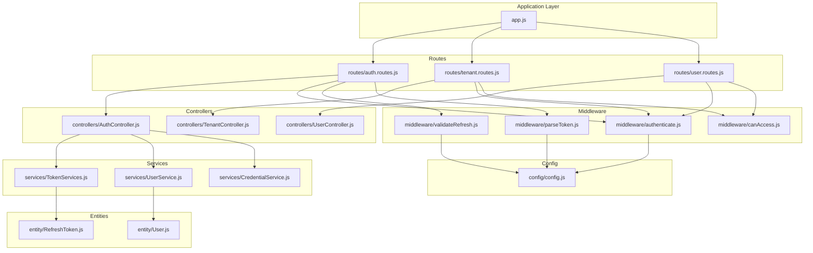
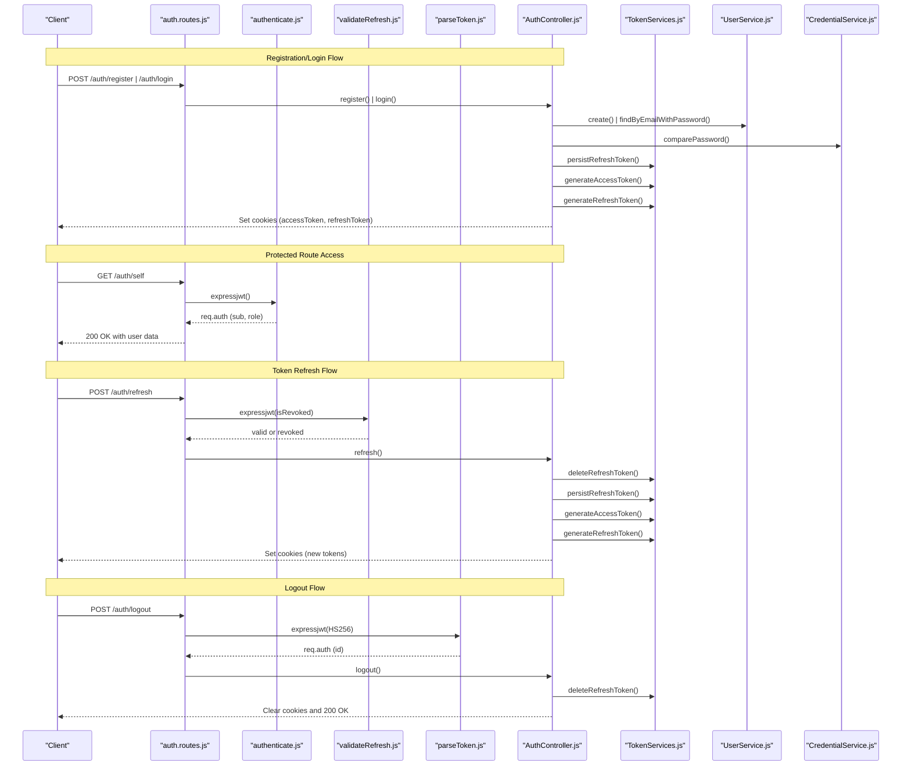
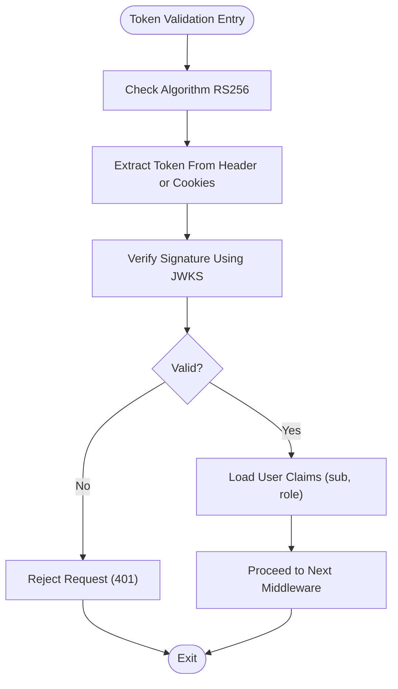
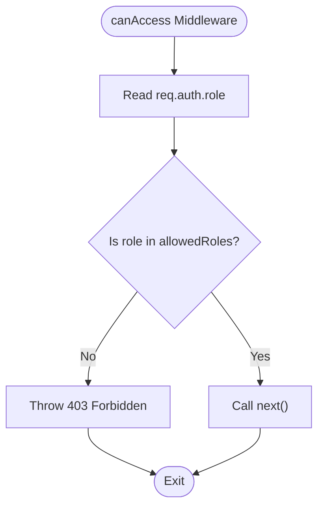
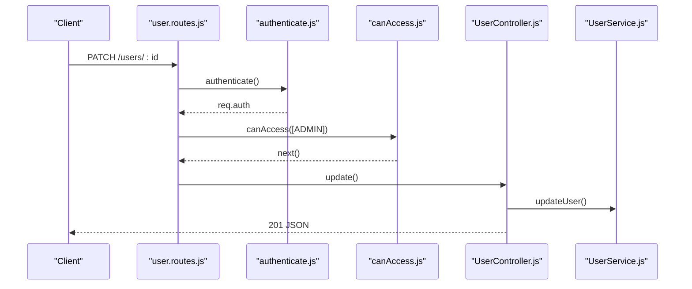
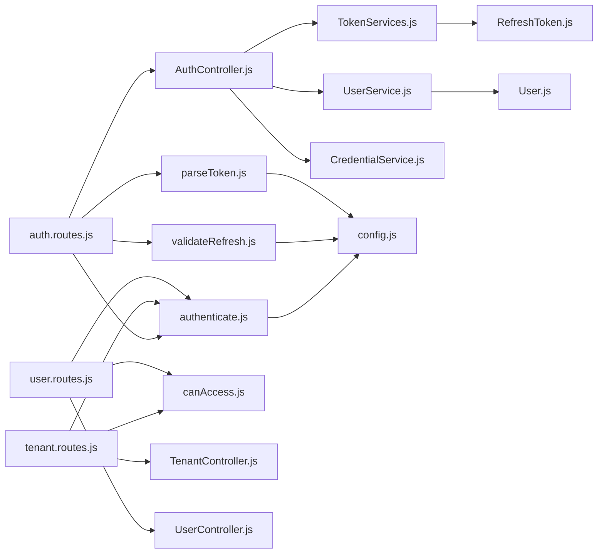

# Access Control Patterns and Best Practices

<cite>
**Referenced Files in This Document**
- [src/app.js](file://src/app.js)
- [src/config/config.js](file://src/config/config.js)
- [src/constants/index.js](file://src/constants/index.js)
- [src/middleware/authenticate.js](file://src/middleware/authenticate.js)
- [src/middleware/canAccess.js](file://src/middleware/canAccess.js)
- [src/middleware/parseToken.js](file://src/middleware/parseToken.js)
- [src/middleware/validateRefresh.js](file://src/middleware/validateRefresh.js)
- [src/routes/auth.routes.js](file://src/routes/auth.routes.js)
- [src/routes/tenant.routes.js](file://src/routes/tenant.routes.js)
- [src/routes/user.routes.js](file://src/routes/user.routes.js)
- [src/controllers/AuthController.js](file://src/controllers/AuthController.js)
- [src/controllers/TenantController.js](file://src/controllers/TenantController.js)
- [src/controllers/UserController.js](file://src/controllers/UserController.js)
- [src/services/CredentialService.js](file://src/services/CredentialService.js)
- [src/services/TokenServices.js](file://src/services/TokenServices.js)
- [src/services/UserService.js](file://src/services/UserService.js)
- [src/entity/User.js](file://src/entity/User.js)
- [src/entity/RefreshToken.js](file://src/entity/RefreshToken.js)
</cite>

## Table of Contents
1. [Introduction](#introduction)
2. [Project Structure](#project-structure)
3. [Core Components](#core-components)
4. [Architecture Overview](#architecture-overview)
5. [Detailed Component Analysis](#detailed-component-analysis)
6. [Dependency Analysis](#dependency-analysis)
7. [Performance Considerations](#performance-considerations)
8. [Troubleshooting Guide](#troubleshooting-guide)
9. [Conclusion](#conclusion)
10. [Appendices](#appendices)

## Introduction
This document provides comprehensive guidance on access control patterns and security best practices implemented in the service. It focuses on:
- Role-based filtering and administrative controls
- Resource-level authorization and operation-level permissions
- Security implementation patterns, defensive programming, and authorization failure handling
- Principle of least privilege, role design, and permission validation strategies
- Examples of custom authorization logic, edge-case handling, and consistency across the application
- Security considerations, common attack vectors, and mitigation strategies
- Authorization performance optimization, caching strategies, and monitoring

## Project Structure
The application follows a layered architecture with clear separation of concerns:
- Configuration and environment variables
- Middleware for authentication and authorization
- Controllers for request handling
- Services for business logic and persistence
- Entities for database schema
- Routes for endpoint definitions
- Application bootstrap and global error handling

**Diagram sources**
- [src/app.js:1-40](file://src/app.js#L1-L40)
- [src/routes/auth.routes.js:1-49](file://src/routes/auth.routes.js#L1-L49)
- [src/routes/tenant.routes.js:1-45](file://src/routes/tenant.routes.js#L1-L45)
- [src/routes/user.routes.js:1-38](file://src/routes/user.routes.js#L1-L38)
- [src/middleware/authenticate.js:1-26](file://src/middleware/authenticate.js#L1-L26)
- [src/middleware/canAccess.js:1-23](file://src/middleware/canAccess.js#L1-L23)
- [src/middleware/parseToken.js:1-14](file://src/middleware/parseToken.js#L1-L14)
- [src/middleware/validateRefresh.js:1-34](file://src/middleware/validateRefresh.js#L1-L34)
- [src/controllers/AuthController.js:1-212](file://src/controllers/AuthController.js#L1-L212)
- [src/controllers/TenantController.js:1-76](file://src/controllers/TenantController.js#L1-L76)
- [src/controllers/UserController.js:1-94](file://src/controllers/UserController.js#L1-L94)
- [src/services/CredentialService.js:1-7](file://src/services/CredentialService.js#L1-L7)
- [src/services/TokenServices.js:1-60](file://src/services/TokenServices.js#L1-L60)
- [src/services/UserService.js:1-99](file://src/services/UserService.js#L1-L99)
- [src/entity/User.js:1-50](file://src/entity/User.js#L1-L50)
- [src/entity/RefreshToken.js:1-35](file://src/entity/RefreshToken.js#L1-L35)
- [src/config/config.js:1-34](file://src/config/config.js#L1-L34)

**Section sources**
- [src/app.js:1-40](file://src/app.js#L1-L40)
- [src/config/config.js:1-34](file://src/config/config.js#L1-L34)

## Core Components
This section documents the core building blocks of the authorization system and their roles.

- Authentication middleware
  - Validates access tokens using RS256 with JWKS-based secret caching and rate limiting.
  - Extracts tokens from Authorization header or cookies.
  - Integrates with environment-provided JWKS URI.

- Role-based authorization middleware
  - Enforces allowed roles for protected endpoints.
  - Returns explicit 403 errors for unauthorized access attempts.

- Refresh token validation middleware
  - Validates refresh tokens using HS256 with a shared secret.
  - Implements revocation by checking presence in the refresh token store.

- Token services
  - Generates access tokens using a private RSA key with issuer claims and expiry.
  - Generates refresh tokens using a shared secret with expiry and JWT ID.
  - Persists refresh tokens and supports deletion for logout and rotation.

- Credential service
  - Compares plaintext passwords against stored hashes.

- User service
  - Handles user creation, retrieval, updates, and deletions.
  - Supports tenant association via optional tenantId.

- Controllers
  - Registration, login, profile retrieval, token refresh, and logout flows.
  - Uses services and middleware to enforce authorization and handle errors.

- Entities
  - User entity defines role and optional tenant association.
  - Refresh token entity stores persisted refresh tokens with timestamps.

**Section sources**
- [src/middleware/authenticate.js:1-26](file://src/middleware/authenticate.js#L1-L26)
- [src/middleware/canAccess.js:1-23](file://src/middleware/canAccess.js#L1-L23)
- [src/middleware/validateRefresh.js:1-34](file://src/middleware/validateRefresh.js#L1-L34)
- [src/services/TokenServices.js:1-60](file://src/services/TokenServices.js#L1-L60)
- [src/services/CredentialService.js:1-7](file://src/services/CredentialService.js#L1-L7)
- [src/services/UserService.js:1-99](file://src/services/UserService.js#L1-L99)
- [src/controllers/AuthController.js:1-212](file://src/controllers/AuthController.js#L1-L212)
- [src/entity/User.js:1-50](file://src/entity/User.js#L1-L50)
- [src/entity/RefreshToken.js:1-35](file://src/entity/RefreshToken.js#L1-L35)

## Architecture Overview
The authorization architecture combines bearer token authentication with role-based access control and refresh token lifecycle management.

**Diagram sources**
- [src/routes/auth.routes.js:1-49](file://src/routes/auth.routes.js#L1-L49)
- [src/middleware/authenticate.js:1-26](file://src/middleware/authenticate.js#L1-L26)
- [src/middleware/validateRefresh.js:1-34](file://src/middleware/validateRefresh.js#L1-L34)
- [src/middleware/parseToken.js:1-14](file://src/middleware/parseToken.js#L1-L14)
- [src/controllers/AuthController.js:1-212](file://src/controllers/AuthController.js#L1-L212)
- [src/services/TokenServices.js:1-60](file://src/services/TokenServices.js#L1-L60)
- [src/services/UserService.js:1-99](file://src/services/UserService.js#L1-L99)
- [src/services/CredentialService.js:1-7](file://src/services/CredentialService.js#L1-L7)

## Detailed Component Analysis

### Authentication and Token Management
- Access token validation
  - Uses RS256 with JWKS-based secret caching and rate limiting for robust token verification.
  - Extracts tokens from Authorization header or cookies.
  - Integrates with environment configuration for JWKS URI.

- Refresh token lifecycle
  - HS256-signed refresh tokens with expiry and JWT ID.
  - Revocation check ensures tokens are present in the refresh token store.
  - Rotation deletes the old refresh token and persists a new one.

- Cookie security
  - HttpOnly and SameSite strict cookies for access and refresh tokens.
  - Environment-aware cookie options recommended for production hardening.

**Diagram sources**
- [src/middleware/authenticate.js:1-26](file://src/middleware/authenticate.js#L1-L26)
- [src/config/config.js:1-34](file://src/config/config.js#L1-L34)

**Section sources**
- [src/middleware/authenticate.js:1-26](file://src/middleware/authenticate.js#L1-L26)
- [src/services/TokenServices.js:1-60](file://src/services/TokenServices.js#L1-L60)
- [src/middleware/validateRefresh.js:1-34](file://src/middleware/validateRefresh.js#L1-L34)
- [src/middleware/parseToken.js:1-14](file://src/middleware/parseToken.js#L1-L14)
- [src/controllers/AuthController.js:1-212](file://src/controllers/AuthController.js#L1-L212)

### Role-Based Filtering and Resource-Level Authorization
- Role enforcement
  - The role-based guard checks the authenticated user’s role against allowed roles.
  - Denies access with a 403 error if the role is not permitted.

- Endpoint protection
  - Tenant and user endpoints apply authentication and role guards consistently.
  - Administrative endpoints restrict access to admin-only routes.

**Diagram sources**
- [src/middleware/canAccess.js:1-23](file://src/middleware/canAccess.js#L1-L23)
- [src/routes/tenant.routes.js:1-45](file://src/routes/tenant.routes.js#L1-L45)
- [src/routes/user.routes.js:1-38](file://src/routes/user.routes.js#L1-L38)

**Section sources**
- [src/middleware/canAccess.js:1-23](file://src/middleware/canAccess.js#L1-L23)
- [src/routes/tenant.routes.js:1-45](file://src/routes/tenant.routes.js#L1-L45)
- [src/routes/user.routes.js:1-38](file://src/routes/user.routes.js#L1-L38)
- [src/constants/index.js:1-6](file://src/constants/index.js#L1-L6)

### Operation-Level Permissions and Defensive Programming
- Validation and error handling
  - Controllers validate inputs and propagate structured errors.
  - Global error handler logs and returns standardized error responses.

- Password handling
  - Password comparison uses bcrypt for secure credential verification.

- User operations
  - CRUD endpoints enforce authentication and role-based access.
  - Updates and deletes include validation and logging.

**Diagram sources**
- [src/routes/user.routes.js:1-38](file://src/routes/user.routes.js#L1-L38)
- [src/middleware/authenticate.js:1-26](file://src/middleware/authenticate.js#L1-L26)
- [src/middleware/canAccess.js:1-23](file://src/middleware/canAccess.js#L1-L23)
- [src/controllers/UserController.js:1-94](file://src/controllers/UserController.js#L1-L94)
- [src/services/UserService.js:1-99](file://src/services/UserService.js#L1-L99)

**Section sources**
- [src/app.js:23-37](file://src/app.js#L23-L37)
- [src/services/CredentialService.js:1-7](file://src/services/CredentialService.js#L1-L7)
- [src/controllers/UserController.js:1-94](file://src/controllers/UserController.js#L1-L94)
- [src/services/UserService.js:1-99](file://src/services/UserService.js#L1-L99)

### Authorization Failure Handling and Consistency
- Explicit denial
  - Role guard throws a 403 error when access is denied.
- Centralized error handling
  - Standardized logging and response shape for all errors.
- Consistent middleware application
  - Authentication and role guards applied uniformly across protected routes.

**Section sources**
- [src/middleware/canAccess.js:1-23](file://src/middleware/canAccess.js#L1-L23)
- [src/app.js:23-37](file://src/app.js#L23-L37)
- [src/routes/tenant.routes.js:16-42](file://src/routes/tenant.routes.js#L16-L42)
- [src/routes/user.routes.js:15-35](file://src/routes/user.routes.js#L15-L35)

## Dependency Analysis
The authorization system exhibits low coupling and high cohesion:
- Routes depend on middleware and controllers but remain thin.
- Controllers depend on services for business logic.
- Services encapsulate persistence and cryptographic operations.
- Middleware depends on configuration and repositories.

**Diagram sources**
- [src/routes/auth.routes.js:1-49](file://src/routes/auth.routes.js#L1-L49)
- [src/routes/tenant.routes.js:1-45](file://src/routes/tenant.routes.js#L1-L45)
- [src/routes/user.routes.js:1-38](file://src/routes/user.routes.js#L1-L38)
- [src/middleware/authenticate.js:1-26](file://src/middleware/authenticate.js#L1-L26)
- [src/middleware/canAccess.js:1-23](file://src/middleware/canAccess.js#L1-L23)
- [src/middleware/validateRefresh.js:1-34](file://src/middleware/validateRefresh.js#L1-L34)
- [src/middleware/parseToken.js:1-14](file://src/middleware/parseToken.js#L1-L14)
- [src/controllers/AuthController.js:1-212](file://src/controllers/AuthController.js#L1-L212)
- [src/controllers/TenantController.js:1-76](file://src/controllers/TenantController.js#L1-L76)
- [src/controllers/UserController.js:1-94](file://src/controllers/UserController.js#L1-L94)
- [src/services/TokenServices.js:1-60](file://src/services/TokenServices.js#L1-L60)
- [src/services/UserService.js:1-99](file://src/services/UserService.js#L1-L99)
- [src/services/CredentialService.js:1-7](file://src/services/CredentialService.js#L1-L7)
- [src/entity/User.js:1-50](file://src/entity/User.js#L1-L50)
- [src/entity/RefreshToken.js:1-35](file://src/entity/RefreshToken.js#L1-L35)
- [src/config/config.js:1-34](file://src/config/config.js#L1-L34)

**Section sources**
- [src/routes/auth.routes.js:1-49](file://src/routes/auth.routes.js#L1-L49)
- [src/routes/tenant.routes.js:1-45](file://src/routes/tenant.routes.js#L1-L45)
- [src/routes/user.routes.js:1-38](file://src/routes/user.routes.js#L1-L38)
- [src/middleware/authenticate.js:1-26](file://src/middleware/authenticate.js#L1-L26)
- [src/middleware/canAccess.js:1-23](file://src/middleware/canAccess.js#L1-L23)
- [src/middleware/validateRefresh.js:1-34](file://src/middleware/validateRefresh.js#L1-L34)
- [src/middleware/parseToken.js:1-14](file://src/middleware/parseToken.js#L1-L14)
- [src/controllers/AuthController.js:1-212](file://src/controllers/AuthController.js#L1-L212)
- [src/controllers/TenantController.js:1-76](file://src/controllers/TenantController.js#L1-L76)
- [src/controllers/UserController.js:1-94](file://src/controllers/UserController.js#L1-L94)
- [src/services/TokenServices.js:1-60](file://src/services/TokenServices.js#L1-L60)
- [src/services/UserService.js:1-99](file://src/services/UserService.js#L1-L99)
- [src/services/CredentialService.js:1-7](file://src/services/CredentialService.js#L1-L7)
- [src/entity/User.js:1-50](file://src/entity/User.js#L1-L50)
- [src/entity/RefreshToken.js:1-35](file://src/entity/RefreshToken.js#L1-L35)
- [src/config/config.js:1-34](file://src/config/config.js#L1-L34)

## Performance Considerations
- Token verification caching
  - JWKS caching reduces network overhead and latency for signature verification.
- Minimal middleware overhead
  - Lightweight middleware with early exits for invalid tokens.
- Efficient revocation checks
  - Refresh token revocation uses a single database lookup keyed by token ID and user.
- Cookie-based token transport
  - Reduces redundant header parsing and improves client-side handling.

[No sources needed since this section provides general guidance]

## Troubleshooting Guide
Common issues and mitigations:
- Unauthorized access errors
  - Ensure the user’s role is included in the token and matches allowed roles.
  - Confirm middleware order: authenticate before canAccess.
- Token validation failures
  - Verify JWKS URI and algorithm configuration.
  - Check token expiration and issuer claims.
- Refresh token revocation
  - Confirm the token exists in the refresh token store and is not deleted prematurely.
- Error responses
  - Review global error handler logs for structured error details.

**Section sources**
- [src/middleware/canAccess.js:1-23](file://src/middleware/canAccess.js#L1-L23)
- [src/middleware/authenticate.js:1-26](file://src/middleware/authenticate.js#L1-L26)
- [src/middleware/validateRefresh.js:1-34](file://src/middleware/validateRefresh.js#L1-L34)
- [src/app.js:23-37](file://src/app.js#L23-L37)

## Conclusion
The authorization system integrates strong authentication with role-based access control and secure token lifecycle management. By applying the principle of least privilege, enforcing explicit role checks, and centralizing error handling, the system maintains consistency and resilience. Recommended enhancements include environment-aware cookie configuration, centralized permission validation, and optional caching for permission checks.

[No sources needed since this section summarizes without analyzing specific files]

## Appendices

### Security Best Practices Checklist
- Principle of least privilege
  - Assign minimal roles required for job functions.
- Role design patterns
  - Use distinct roles for admin, manager, customer; avoid broad admin privileges.
- Permission validation strategies
  - Validate roles at route level; consider per-resource ownership checks.
- Authorization failure handling
  - Return explicit 403 errors; log failures without leaking sensitive details.
- Secure implementation patterns
  - Use RS256 with JWKS caching; HS256 with shared secrets for refresh tokens.
  - Employ HttpOnly and SameSite strict cookies.
- Attack vectors and mitigations
  - Token replay: short-lived access tokens and refresh token revocation.
  - Role elevation: strict role checks and audit logs.
  - Token theft: secure cookie attributes and HTTPS.
- Performance optimization
  - Cache JWKS and consider permission caches with TTL.
  - Minimize database queries in hot paths.
- Monitoring
  - Track authorization failures and anomalies; alert on spikes.

[No sources needed since this section provides general guidance]