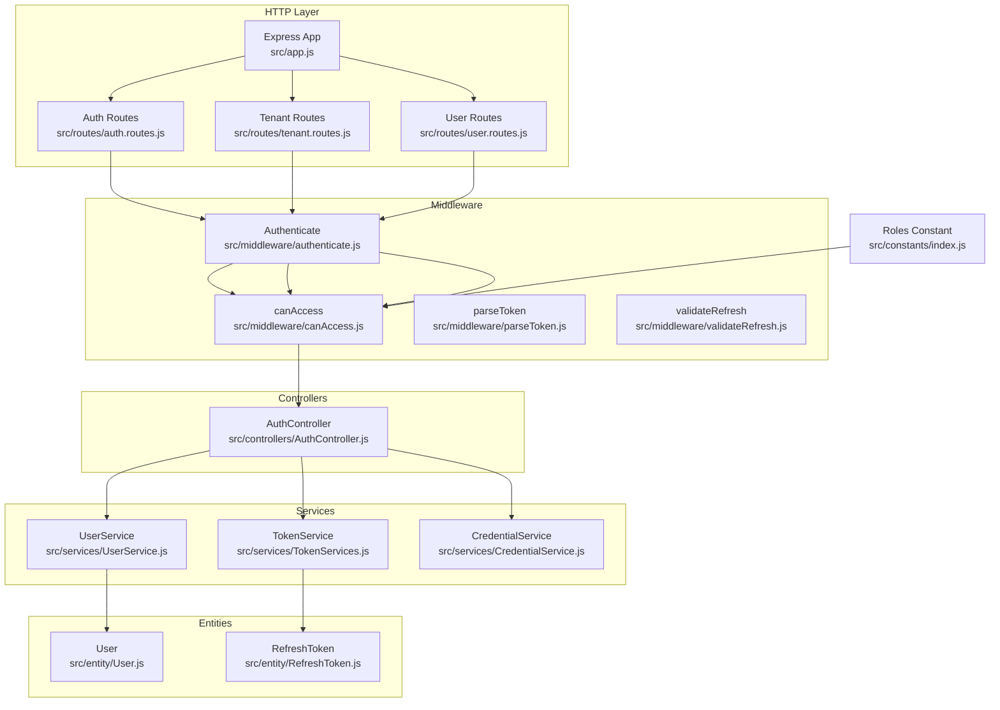
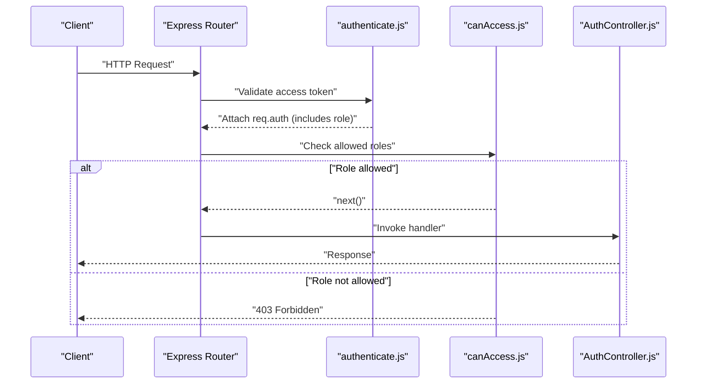
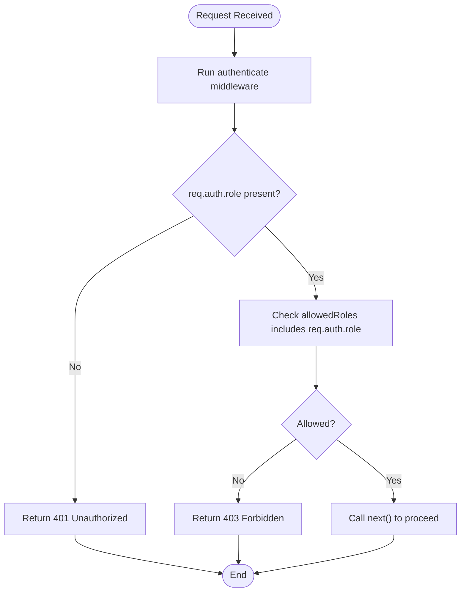
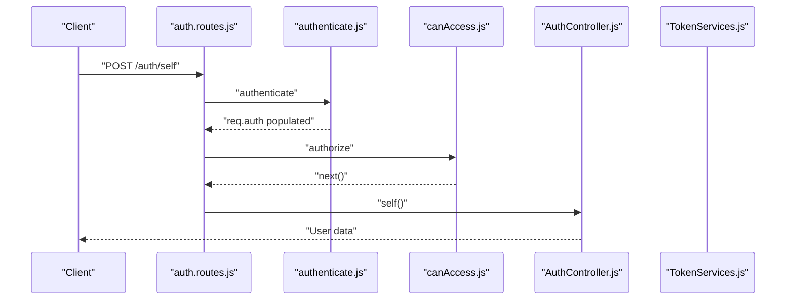
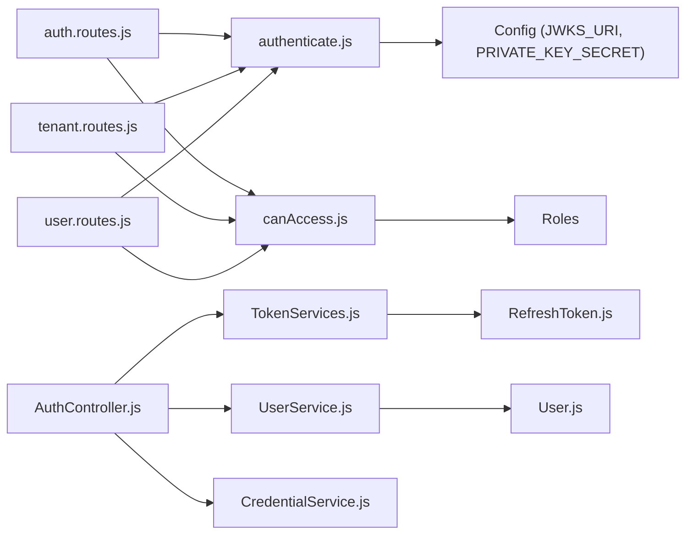

# Authorization System

<cite>
**Referenced Files in This Document**
- [src/constants/index.js](file://src/constants/index.js)
- [src/middleware/authenticate.js](file://src/middleware/authenticate.js)
- [src/middleware/canAccess.js](file://src/middleware/canAccess.js)
- [src/middleware/parseToken.js](file://src/middleware/parseToken.js)
- [src/middleware/validateRefresh.js](file://src/middleware/validateRefresh.js)
- [src/entity/User.js](file://src/entity/User.js)
- [src/entity/RefreshToken.js](file://src/entity/RefreshToken.js)
- [src/services/TokenServices.js](file://src/services/TokenServices.js)
- [src/services/UserService.js](file://src/services/UserService.js)
- [src/services/CredentialService.js](file://src/services/CredentialService.js)
- [src/controllers/AuthController.js](file://src/controllers/AuthController.js)
- [src/routes/auth.routes.js](file://src/routes/auth.routes.js)
- [src/routes/tenant.routes.js](file://src/routes/tenant.routes.js)
- [src/routes/user.routes.js](file://src/routes/user.routes.js)
- [src/app.js](file://src/app.js)
</cite>

## Table of Contents
1. [Introduction](#introduction)
2. [Project Structure](#project-structure)
3. [Core Components](#core-components)
4. [Architecture Overview](#architecture-overview)
5. [Detailed Component Analysis](#detailed-component-analysis)
6. [Dependency Analysis](#dependency-analysis)
7. [Performance Considerations](#performance-considerations)
8. [Troubleshooting Guide](#troubleshooting-guide)
9. [Conclusion](#conclusion)

## Introduction
This document explains the authorization and access control system implemented in the authentication service. It focuses on role-based access control (RBAC) with three roles: CUSTOMER, ADMIN, and MANAGER. It documents the permission middleware, access control enforcement patterns, role hierarchy, permission checking logic, and route-level authorization. Practical examples illustrate middleware usage and how authorization integrates with authentication and request processing. Security considerations and troubleshooting guidance are also included.

## Project Structure
The authorization system spans middleware, routes, controllers, services, entities, and constants. Key areas:
- Constants define roles used across the system.
- Middleware enforces authentication and authorization checks.
- Routes attach middleware to endpoints to enforce access control.
- Controllers handle business logic and interact with services.
- Services manage token generation, refresh token lifecycle, and user operations.
- Entities model persisted data, including users and refresh tokens.

**Diagram sources**
- [src/app.js:1-40](file://src/app.js#L1-L40)
- [src/routes/auth.routes.js:1-49](file://src/routes/auth.routes.js#L1-L49)
- [src/routes/tenant.routes.js:1-45](file://src/routes/tenant.routes.js#L1-L45)
- [src/routes/user.routes.js:1-38](file://src/routes/user.routes.js#L1-L38)
- [src/middleware/authenticate.js:1-26](file://src/middleware/authenticate.js#L1-L26)
- [src/middleware/canAccess.js:1-23](file://src/middleware/canAccess.js#L1-L23)
- [src/middleware/parseToken.js:1-14](file://src/middleware/parseToken.js#L1-L14)
- [src/middleware/validateRefresh.js:1-34](file://src/middleware/validateRefresh.js#L1-L34)
- [src/controllers/AuthController.js:1-212](file://src/controllers/AuthController.js#L1-L212)
- [src/services/TokenServices.js:1-60](file://src/services/TokenServices.js#L1-L60)
- [src/services/UserService.js:1-86](file://src/services/UserService.js#L1-L86)
- [src/services/CredentialService.js:1-7](file://src/services/CredentialService.js#L1-L7)
- [src/entity/User.js:1-50](file://src/entity/User.js#L1-L50)
- [src/entity/RefreshToken.js:1-35](file://src/entity/RefreshToken.js#L1-L35)
- [src/constants/index.js:1-6](file://src/constants/index.js#L1-L6)

**Section sources**
- [src/app.js:1-40](file://src/app.js#L1-L40)
- [src/routes/auth.routes.js:1-49](file://src/routes/auth.routes.js#L1-L49)
- [src/routes/tenant.routes.js:1-45](file://src/routes/tenant.routes.js#L1-L45)
- [src/routes/user.routes.js:1-38](file://src/routes/user.routes.js#L1-L38)

## Core Components
- Roles constant defines CUSTOMER, ADMIN, and MANAGER roles used for authorization checks.
- Authentication middleware validates JWTs and attaches user claims (including role) to the request.
- Authorization middleware verifies the authenticated user’s role against allowed roles.
- Token services generate access and refresh tokens and manage refresh token persistence and revocation.
- User and credential services support registration, login, and user lookup with password verification.
- Route definitions apply authentication and authorization middleware to endpoints.

Key implementation references:
- Roles definition: [src/constants/index.js:1-6](file://src/constants/index.js#L1-L6)
- Authentication middleware: [src/middleware/authenticate.js:1-26](file://src/middleware/authenticate.js#L1-L26)
- Authorization middleware: [src/middleware/canAccess.js:1-23](file://src/middleware/canAccess.js#L1-L23)
- Access token generation: [src/services/TokenServices.js:12-32](file://src/services/TokenServices.js#L12-L32)
- Refresh token lifecycle: [src/services/TokenServices.js:34-58](file://src/services/TokenServices.js#L34-L58)
- User entity with role column: [src/entity/User.js:27-29](file://src/entity/User.js#L27-L29)
- Refresh token entity: [src/entity/RefreshToken.js:1-35](file://src/entity/RefreshToken.js#L1-L35)
- Route-level authorization examples: [src/routes/tenant.routes.js:16-42](file://src/routes/tenant.routes.js#L16-L42), [src/routes/user.routes.js:15-35](file://src/routes/user.routes.js#L15-L35)

**Section sources**
- [src/constants/index.js:1-6](file://src/constants/index.js#L1-L6)
- [src/middleware/authenticate.js:1-26](file://src/middleware/authenticate.js#L1-L26)
- [src/middleware/canAccess.js:1-23](file://src/middleware/canAccess.js#L1-L23)
- [src/services/TokenServices.js:12-58](file://src/services/TokenServices.js#L12-L58)
- [src/entity/User.js:27-29](file://src/entity/User.js#L27-L29)
- [src/entity/RefreshToken.js:1-35](file://src/entity/RefreshToken.js#L1-L35)
- [src/routes/tenant.routes.js:16-42](file://src/routes/tenant.routes.js#L16-L42)
- [src/routes/user.routes.js:15-35](file://src/routes/user.routes.js#L15-L35)

## Architecture Overview
The authorization pipeline integrates authentication and authorization across request processing:
- Authentication middleware validates the access token and populates req.auth with user claims (e.g., role).
- Authorization middleware checks whether the authenticated user’s role is included in the allowed roles for the route.
- Token services manage access and refresh tokens, including signing with RS256 for access tokens and HS256 for refresh tokens.
- Route handlers enforce middleware order to ensure authentication precedes authorization.

**Diagram sources**
- [src/middleware/authenticate.js:1-26](file://src/middleware/authenticate.js#L1-L26)
- [src/middleware/canAccess.js:1-23](file://src/middleware/canAccess.js#L1-L23)
- [src/controllers/AuthController.js:138-141](file://src/controllers/AuthController.js#L138-L141)

**Section sources**
- [src/middleware/authenticate.js:1-26](file://src/middleware/authenticate.js#L1-L26)
- [src/middleware/canAccess.js:1-23](file://src/middleware/canAccess.js#L1-L23)
- [src/controllers/AuthController.js:138-141](file://src/controllers/AuthController.js#L138-L141)

## Detailed Component Analysis

### Role-Based Access Control (RBAC)
- Roles are centrally defined and reused across middleware and routes.
- Users are stored with a role field; during login/register, the role is included in the JWT payload.
- Authorization middleware compares req.auth.role against allowed roles.

Implementation highlights:
- Roles constant: [src/constants/index.js:1-6](file://src/constants/index.js#L1-L6)
- Role inclusion in JWT payload: [src/controllers/AuthController.js:37-47](file://src/controllers/AuthController.js#L37-L47), [src/controllers/AuthController.js:103-113](file://src/controllers/AuthController.js#L103-L113)
- Role retrieval in controller: [src/controllers/AuthController.js:139](file://src/controllers/AuthController.js#L139)
- User entity role column: [src/entity/User.js:27-29](file://src/entity/User.js#L27-L29)

**Section sources**
- [src/constants/index.js:1-6](file://src/constants/index.js#L1-L6)
- [src/controllers/AuthController.js:37-47](file://src/controllers/AuthController.js#L37-L47)
- [src/controllers/AuthController.js:103-113](file://src/controllers/AuthController.js#L103-L113)
- [src/controllers/AuthController.js:139](file://src/controllers/AuthController.js#L139)
- [src/entity/User.js:27-29](file://src/entity/User.js#L27-L29)

### Permission Middleware and Access Control Enforcement
- Authentication middleware validates the access token and extracts the user claim (including role) into req.auth.
- Authorization middleware checks if req.auth.role is included in the allowed roles array passed to canAccess.
- On mismatch, a 403 error is returned; otherwise, the request proceeds.

**Diagram sources**
- [src/middleware/authenticate.js:1-26](file://src/middleware/authenticate.js#L1-L26)
- [src/middleware/canAccess.js:1-23](file://src/middleware/canAccess.js#L1-L23)

**Section sources**
- [src/middleware/authenticate.js:1-26](file://src/middleware/authenticate.js#L1-L26)
- [src/middleware/canAccess.js:1-23](file://src/middleware/canAccess.js#L1-L23)

### Role Hierarchy and Permission Checking Logic
- The current implementation enforces role membership via allowedRoles arrays.
- There is no explicit hierarchical relationship between roles (e.g., MANAGER not implicitly inheriting ADMIN privileges) beyond the allowedRoles list.
- To implement hierarchy, extend canAccess to evaluate role precedence or permission sets.

Practical usage examples:
- Admin-only endpoints: [src/routes/tenant.routes.js:16-42](file://src/routes/tenant.routes.js#L16-L42), [src/routes/user.routes.js:15-35](file://src/routes/user.routes.js#L15-L35)
- Customer self endpoint: [src/routes/auth.routes.js:37-39](file://src/routes/auth.routes.js#L37-L39)

**Section sources**
- [src/routes/tenant.routes.js:16-42](file://src/routes/tenant.routes.js#L16-L42)
- [src/routes/user.routes.js:15-35](file://src/routes/user.routes.js#L15-L35)
- [src/routes/auth.routes.js:37-39](file://src/routes/auth.routes.js#L37-L39)

### Route-Level Authorization Patterns
- Apply authenticate before canAccess to ensure a valid user context.
- Use canAccess with an allowedRoles array tailored per route.
- Keep public routes (e.g., login/register) without authorization middleware.

Examples:
- Tenant creation requires ADMIN: [src/routes/tenant.routes.js:16-21](file://src/routes/tenant.routes.js#L16-L21)
- User management requires ADMIN: [src/routes/user.routes.js:15-35](file://src/routes/user.routes.js#L15-L35)
- Self profile access requires authentication: [src/routes/auth.routes.js:37-39](file://src/routes/auth.routes.js#L37-L39)

**Section sources**
- [src/routes/tenant.routes.js:16-21](file://src/routes/tenant.routes.js#L16-L21)
- [src/routes/user.routes.js:15-35](file://src/routes/user.routes.js#L15-L35)
- [src/routes/auth.routes.js:37-39](file://src/routes/auth.routes.js#L37-L39)

### Authorization Integration with Authentication and Request Processing
- Authentication middleware attaches user claims to req.auth, enabling downstream authorization checks.
- Token services sign access tokens with RS256 and refresh tokens with HS256, ensuring secure token lifecycle.
- Logout clears cookies and removes refresh tokens from storage.

**Diagram sources**
- [src/routes/auth.routes.js:37-39](file://src/routes/auth.routes.js#L37-L39)
- [src/middleware/authenticate.js:1-26](file://src/middleware/authenticate.js#L1-L26)
- [src/middleware/canAccess.js:1-23](file://src/middleware/canAccess.js#L1-L23)
- [src/controllers/AuthController.js:138-141](file://src/controllers/AuthController.js#L138-L141)
- [src/services/TokenServices.js:12-32](file://src/services/TokenServices.js#L12-L32)

**Section sources**
- [src/routes/auth.routes.js:37-39](file://src/routes/auth.routes.js#L37-L39)
- [src/middleware/authenticate.js:1-26](file://src/middleware/authenticate.js#L1-L26)
- [src/middleware/canAccess.js:1-23](file://src/middleware/canAccess.js#L1-L23)
- [src/controllers/AuthController.js:138-141](file://src/controllers/AuthController.js#L138-L141)
- [src/services/TokenServices.js:12-32](file://src/services/TokenServices.js#L12-L32)

### Practical Examples of Authorization Middleware Usage
- Enforce ADMIN-only access to tenant creation/update/delete:
  - [src/routes/tenant.routes.js:16-42](file://src/routes/tenant.routes.js#L16-L42)
- Enforce ADMIN-only access to user management:
  - [src/routes/user.routes.js:15-35](file://src/routes/user.routes.js#L15-L35)
- Allow authenticated users to fetch their own profile:
  - [src/routes/auth.routes.js:37-39](file://src/routes/auth.routes.js#L37-L39)

Custom permission implementations:
- Extend canAccess to accept a function that evaluates permissions beyond role membership.
- Introduce a permissions matrix or permission flags per resource to refine checks.

**Section sources**
- [src/routes/tenant.routes.js:16-42](file://src/routes/tenant.routes.js#L16-L42)
- [src/routes/user.routes.js:15-35](file://src/routes/user.routes.js#L15-L35)
- [src/routes/auth.routes.js:37-39](file://src/routes/auth.routes.js#L37-L39)

## Dependency Analysis
The authorization system exhibits clear separation of concerns:
- Routes depend on middleware for authentication and authorization.
- Controllers depend on services for token and user operations.
- Services depend on entities for persistence and on configuration for keys and secrets.
- Middleware depends on configuration for JWKS and secrets.

**Diagram sources**
- [src/routes/auth.routes.js:1-49](file://src/routes/auth.routes.js#L1-L49)
- [src/routes/tenant.routes.js:1-45](file://src/routes/tenant.routes.js#L1-L45)
- [src/routes/user.routes.js:1-38](file://src/routes/user.routes.js#L1-L38)
- [src/middleware/authenticate.js:1-26](file://src/middleware/authenticate.js#L1-L26)
- [src/middleware/canAccess.js:1-23](file://src/middleware/canAccess.js#L1-L23)
- [src/constants/index.js:1-6](file://src/constants/index.js#L1-L6)
- [src/controllers/AuthController.js:1-212](file://src/controllers/AuthController.js#L1-L212)
- [src/services/TokenServices.js:1-60](file://src/services/TokenServices.js#L1-L60)
- [src/services/UserService.js:1-86](file://src/services/UserService.js#L1-L86)
- [src/services/CredentialService.js:1-7](file://src/services/CredentialService.js#L1-L7)
- [src/entity/User.js:1-50](file://src/entity/User.js#L1-L50)
- [src/entity/RefreshToken.js:1-35](file://src/entity/RefreshToken.js#L1-L35)

**Section sources**
- [src/routes/auth.routes.js:1-49](file://src/routes/auth.routes.js#L1-L49)
- [src/routes/tenant.routes.js:1-45](file://src/routes/tenant.routes.js#L1-L45)
- [src/routes/user.routes.js:1-38](file://src/routes/user.routes.js#L1-L38)
- [src/middleware/authenticate.js:1-26](file://src/middleware/authenticate.js#L1-L26)
- [src/middleware/canAccess.js:1-23](file://src/middleware/canAccess.js#L1-L23)
- [src/constants/index.js:1-6](file://src/constants/index.js#L1-L6)
- [src/controllers/AuthController.js:1-212](file://src/controllers/AuthController.js#L1-L212)
- [src/services/TokenServices.js:1-60](file://src/services/TokenServices.js#L1-L60)
- [src/services/UserService.js:1-86](file://src/services/UserService.js#L1-L86)
- [src/services/CredentialService.js:1-7](file://src/services/CredentialService.js#L1-L7)
- [src/entity/User.js:1-50](file://src/entity/User.js#L1-L50)
- [src/entity/RefreshToken.js:1-35](file://src/entity/RefreshToken.js#L1-L35)

## Performance Considerations
- Minimize repeated role checks by caching role claims in req.auth after authentication.
- Use efficient allowedRoles arrays and avoid unnecessary middleware invocations.
- Keep token lifetimes balanced: short-lived access tokens reduce risk, while refresh tokens enable secure re-authentication.
- Ensure database queries for user and refresh token lookups are indexed appropriately.

## Troubleshooting Guide
Common authorization issues and resolutions:
- 403 Forbidden on protected routes:
  - Verify the user’s role is correctly set in the database and included in the JWT payload.
  - Confirm the route applies authenticate followed by canAccess with the intended allowed roles.
  - References: [src/middleware/canAccess.js:1-23](file://src/middleware/canAccess.js#L1-L23), [src/routes/tenant.routes.js:16-42](file://src/routes/tenant.routes.js#L16-L42), [src/routes/user.routes.js:15-35](file://src/routes/user.routes.js#L15-L35)
- 401 Unauthorized on authenticated routes:
  - Ensure the client sends a valid access token in the Authorization header or access cookie.
  - Confirm the token signature and algorithms align with the configured JWKS and private key settings.
  - References: [src/middleware/authenticate.js:1-26](file://src/middleware/authenticate.js#L1-L26), [src/services/TokenServices.js:12-32](file://src/services/TokenServices.js#L12-L32)
- Refresh token invalidation problems:
  - Confirm the refresh token exists in the database and is not revoked.
  - Validate the HS256 signature and jwtid mapping.
  - References: [src/middleware/validateRefresh.js:1-34](file://src/middleware/validateRefresh.js#L1-L34), [src/services/TokenServices.js:34-58](file://src/services/TokenServices.js#L34-L58), [src/entity/RefreshToken.js:1-35](file://src/entity/RefreshToken.js#L1-L35)
- Role mismatches during login/register:
  - Ensure the role is included in the JWT payload and matches the user record.
  - References: [src/controllers/AuthController.js:37-47](file://src/controllers/AuthController.js#L37-L47), [src/controllers/AuthController.js:103-113](file://src/controllers/AuthController.js#L103-L113), [src/entity/User.js:27-29](file://src/entity/User.js#L27-L29)

**Section sources**
- [src/middleware/canAccess.js:1-23](file://src/middleware/canAccess.js#L1-L23)
- [src/routes/tenant.routes.js:16-42](file://src/routes/tenant.routes.js#L16-L42)
- [src/routes/user.routes.js:15-35](file://src/routes/user.routes.js#L15-L35)
- [src/middleware/authenticate.js:1-26](file://src/middleware/authenticate.js#L1-L26)
- [src/services/TokenServices.js:12-32](file://src/services/TokenServices.js#L12-L32)
- [src/middleware/validateRefresh.js:1-34](file://src/middleware/validateRefresh.js#L1-L34)
- [src/services/TokenServices.js:34-58](file://src/services/TokenServices.js#L34-L58)
- [src/entity/RefreshToken.js:1-35](file://src/entity/RefreshToken.js#L1-L35)
- [src/controllers/AuthController.js:37-47](file://src/controllers/AuthController.js#L37-L47)
- [src/controllers/AuthController.js:103-113](file://src/controllers/AuthController.js#L103-L113)
- [src/entity/User.js:27-29](file://src/entity/User.js#L27-L29)

## Conclusion
The authorization system leverages a clean RBAC pattern with centralized roles, robust authentication via JWT, and straightforward middleware-based authorization checks. Routes consistently apply authentication before authorization, and controllers rely on services for secure token handling. Extending the system to support hierarchical roles or granular permissions is straightforward by enhancing the authorization middleware and introducing permission matrices.