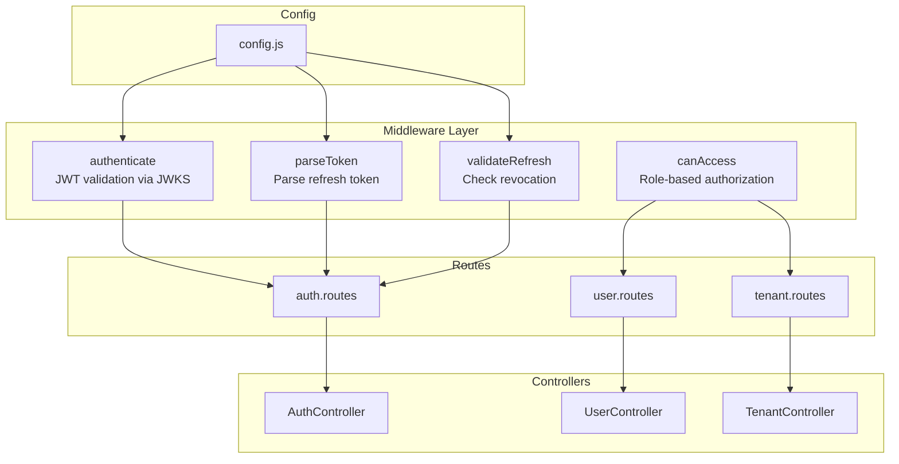
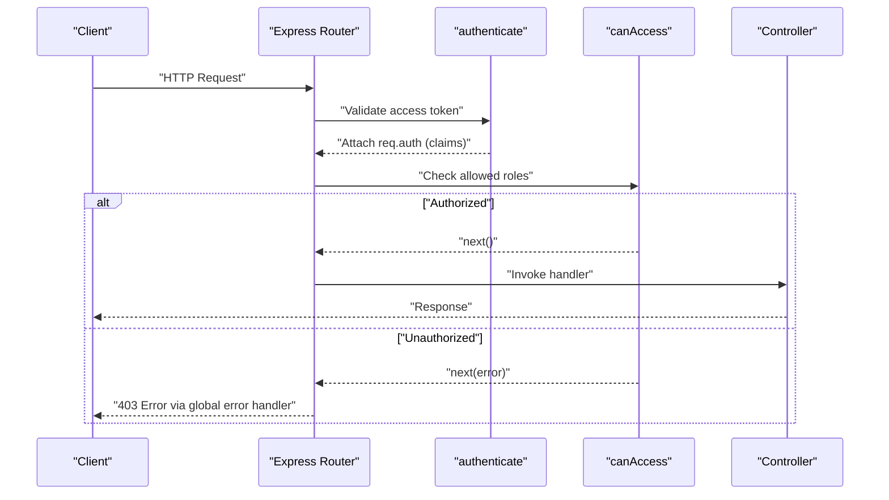
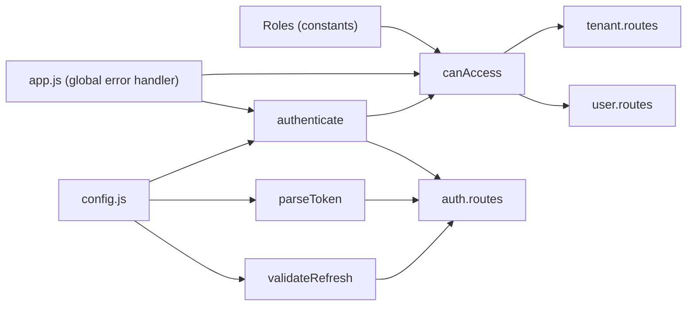
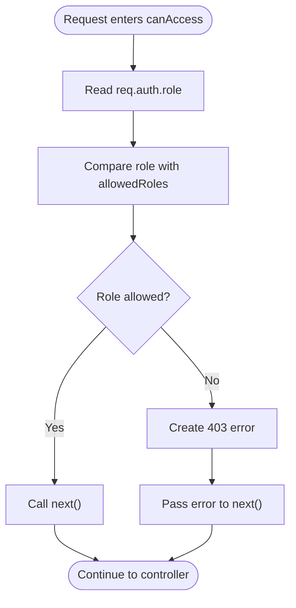

# Permission Middleware

<cite>
**Referenced Files in This Document**
- [canAccess.js](file://src/middleware/canAccess.js)
- [authenticate.js](file://src/middleware/authenticate.js)
- [parseToken.js](file://src/middleware/parseToken.js)
- [validateRefresh.js](file://src/middleware/validateRefresh.js)
- [index.js](file://src/constants/index.js)
- [auth.routes.js](file://src/routes/auth.routes.js)
- [tenant.routes.js](file://src/routes/tenant.routes.js)
- [user.routes.js](file://src/routes/user.routes.js)
- [AuthController.js](file://src/controllers/AuthController.js)
- [UserController.js](file://src/controllers/UserController.js)
- [TenantController.js](file://src/controllers/TenantController.js)
- [app.js](file://src/app.js)
- [config.js](file://src/config/config.js)
- [server.js](file://src/server.js)
</cite>

## Table of Contents
1. [Introduction](#introduction)
2. [Project Structure](#project-structure)
3. [Core Components](#core-components)
4. [Architecture Overview](#architecture-overview)
5. [Detailed Component Analysis](#detailed-component-analysis)
6. [Dependency Analysis](#dependency-analysis)
7. [Performance Considerations](#performance-considerations)
8. [Troubleshooting Guide](#troubleshooting-guide)
9. [Conclusion](#conclusion)
10. [Appendices](#appendices)

## Introduction
This document provides comprehensive documentation for the permission middleware system in the authentication service. It focuses on the canAccess middleware function, its role-based authorization logic, and how it integrates with the authentication system to validate user permissions. The guide explains middleware execution flow, error handling for unauthorized access attempts, integration with Express.js route handlers, practical examples of applying permission middleware to routes, custom permission implementations, middleware chaining patterns, configuration options, error responses for failed authorization attempts, debugging techniques, performance considerations, and best practices for secure authorization enforcement.

## Project Structure
The permission middleware system resides within the middleware layer and is applied to route handlers across the application. Key components include:
- Permission middleware: canAccess
- Authentication middleware: authenticate
- Token parsing middleware: parseToken and validateRefresh
- Route definitions: auth.routes, tenant.routes, user.routes
- Controllers: AuthController, UserController, TenantController
- Constants: Roles
- Application bootstrap: app.js and server.js
- Configuration: config.js

**Diagram sources**
- [canAccess.js:1-23](file://src/middleware/canAccess.js#L1-L23)
- [authenticate.js:1-26](file://src/middleware/authenticate.js#L1-L26)
- [parseToken.js:1-14](file://src/middleware/parseToken.js#L1-L14)
- [validateRefresh.js:1-34](file://src/middleware/validateRefresh.js#L1-L34)
- [auth.routes.js:1-49](file://src/routes/auth.routes.js#L1-L49)
- [tenant.routes.js:1-45](file://src/routes/tenant.routes.js#L1-L45)
- [user.routes.js:1-38](file://src/routes/user.routes.js#L1-L38)
- [AuthController.js:1-212](file://src/controllers/AuthController.js#L1-L212)
- [UserController.js:1-94](file://src/controllers/UserController.js#L1-L94)
- [TenantController.js:1-76](file://src/controllers/TenantController.js#L1-L76)
- [config.js:1-34](file://src/config/config.js#L1-L34)

**Section sources**
- [canAccess.js:1-23](file://src/middleware/canAccess.js#L1-L23)
- [authenticate.js:1-26](file://src/middleware/authenticate.js#L1-L26)
- [parseToken.js:1-14](file://src/middleware/parseToken.js#L1-L14)
- [validateRefresh.js:1-34](file://src/middleware/validateRefresh.js#L1-L34)
- [auth.routes.js:1-49](file://src/routes/auth.routes.js#L1-L49)
- [tenant.routes.js:1-45](file://src/routes/tenant.routes.js#L1-L45)
- [user.routes.js:1-38](file://src/routes/user.routes.js#L1-L38)
- [AuthController.js:1-212](file://src/controllers/AuthController.js#L1-L212)
- [UserController.js:1-94](file://src/controllers/UserController.js#L1-L94)
- [TenantController.js:1-76](file://src/controllers/TenantController.js#L1-L76)
- [config.js:1-34](file://src/config/config.js#L1-L34)
- [app.js:1-40](file://src/app.js#L1-L40)
- [server.js:1-21](file://src/server.js#L1-L21)

## Core Components
- canAccess middleware: Role-based authorization that checks the authenticated user’s role against an allowed roles list. On mismatch, it triggers a 403 error via the global error handler.
- authenticate middleware: Validates access tokens using JWKS and attaches decoded claims (including role) to req.auth.
- parseToken middleware: Parses refresh tokens from cookies for logout and refresh flows.
- validateRefresh middleware: Validates refresh tokens and checks revocation against persisted tokens.
- Routes: Apply middleware in order to enforce authentication followed by authorization.
- Controllers: Access req.auth for identity and role during protected operations.

Key integration points:
- req.auth is populated by authenticate and propagated to downstream middleware and route handlers.
- canAccess reads req.auth.role and compares it to allowed roles.
- Global error handler formats standardized error responses.

**Section sources**
- [canAccess.js:1-23](file://src/middleware/canAccess.js#L1-L23)
- [authenticate.js:1-26](file://src/middleware/authenticate.js#L1-L26)
- [parseToken.js:1-14](file://src/middleware/parseToken.js#L1-L14)
- [validateRefresh.js:1-34](file://src/middleware/validateRefresh.js#L1-L34)
- [auth.routes.js:1-49](file://src/routes/auth.routes.js#L1-L49)
- [tenant.routes.js:1-45](file://src/routes/tenant.routes.js#L1-L45)
- [user.routes.js:1-38](file://src/routes/user.routes.js#L1-L38)
- [AuthController.js:1-212](file://src/controllers/AuthController.js#L1-L212)
- [app.js:23-37](file://src/app.js#L23-L37)

## Architecture Overview
The permission middleware system enforces authorization after authentication. The typical flow is:
1. Request arrives at a route.
2. authenticate validates the access token and attaches user claims to req.auth.
3. canAccess checks req.auth.role against allowed roles.
4. If authorized, the request proceeds to the controller; otherwise, a 403 error is passed to the global error handler.

**Diagram sources**
- [authenticate.js:1-26](file://src/middleware/authenticate.js#L1-L26)
- [canAccess.js:1-23](file://src/middleware/canAccess.js#L1-L23)
- [tenant.routes.js:16-21](file://src/routes/tenant.routes.js#L16-L21)
- [user.routes.js:15-17](file://src/routes/user.routes.js#L15-L17)
- [app.js:23-37](file://src/app.js#L23-L37)

## Detailed Component Analysis

### canAccess Middleware
Purpose:
- Enforce role-based access control by verifying that the authenticated user’s role is included in the allowed roles list.

Behavior:
- Reads req.auth.role from the authenticated request.
- Compares the role against allowedRoles.
- Denies access with a 403 error if the role is not allowed.
- Allows the request to continue if the role is allowed.

Parameters:
- allowedRoles: An array of roles permitted to access the route.

Integration:
- Applied after authenticate in route definitions.
- Works with req.auth populated by authenticate.

Error handling:
- Emits a 403 error when access is denied.
- Global error handler formats the response consistently.

Practical examples:
- Admin-only endpoints: apply authenticate followed by canAccess([Roles.ADMIN]).
- Mixed roles: pass multiple roles in allowedRoles for broader access.

Custom permission implementations:
- Extend allowedRoles to include additional roles from Roles.
- For fine-grained permissions, consider augmenting req.auth with additional claims and adding pre-check logic before invoking canAccess.

Middleware chaining patterns:
- Typical pattern: authenticate -> canAccess([...]) -> controller handler.

**Section sources**
- [canAccess.js:1-23](file://src/middleware/canAccess.js#L1-L23)
- [index.js:1-6](file://src/constants/index.js#L1-L6)
- [tenant.routes.js:16-21](file://src/routes/tenant.routes.js#L16-L21)
- [user.routes.js:15-17](file://src/routes/user.routes.js#L15-L17)
- [app.js:23-37](file://src/app.js#L23-L37)

### authenticate Middleware
Purpose:
- Validate JWT access tokens using JWKS and attach decoded claims to req.auth.

Behavior:
- Uses express-jwt with jwks-rsa to fetch public keys and verify RS256-signed tokens.
- Extracts token from Authorization header or accessToken cookie.
- Populates req.auth with subject and role claims.

Integration:
- Applied to routes requiring authenticated access.
- Ensures req.auth is available for canAccess.

Configuration:
- JWKS URI is loaded from environment configuration.

**Section sources**
- [authenticate.js:1-26](file://src/middleware/authenticate.js#L1-L26)
- [config.js:19-21](file://src/config/config.js#L19-L21)
- [auth.routes.js:37-39](file://src/routes/auth.routes.js#L37-L39)
- [AuthController.js:103-106](file://src/controllers/AuthController.js#L103-L106)

### parseToken Middleware
Purpose:
- Parse refresh tokens from cookies for logout and refresh flows.

Behavior:
- Extracts refreshToken from cookies.
- Validates HS256-signed tokens using a shared secret.

Integration:
- Used in logout route to validate the refresh token before deletion.

**Section sources**
- [parseToken.js:1-14](file://src/middleware/parseToken.js#L1-L14)
- [auth.routes.js:44-46](file://src/routes/auth.routes.js#L44-L46)

### validateRefresh Middleware
Purpose:
- Validate refresh tokens and check revocation status.

Behavior:
- Validates HS256-signed tokens.
- Checks revocation by querying persisted refresh tokens.
- Returns true if revoked (not found), false if valid.

Integration:
- Applied to refresh endpoint to ensure only valid, unrevoked tokens are rotated.

**Section sources**
- [validateRefresh.js:1-34](file://src/middleware/validateRefresh.js#L1-L34)
- [auth.routes.js:41-43](file://src/routes/auth.routes.js#L41-L43)

### Route-Level Usage Examples
- Tenant routes:
  - POST / (create): authenticate -> canAccess([Roles.ADMIN]) -> TenantController.create
  - PUT /tenants/:id: authenticate -> canAccess([Roles.ADMIN]) -> TenantController.updateTenant
  - DELETE /tenants/:id: authenticate -> canAccess([Roles.ADMIN]) -> TenantController.deleteTenant
- User routes:
  - POST /: authenticate -> canAccess([Roles.ADMIN]) -> UserController.create
  - GET /: authenticate -> canAccess([Roles.ADMIN]) -> UserController.getAllUsers
  - PATCH /:id: authenticate -> canAccess([Roles.ADMIN]) -> UserController.update
  - DELETE /:id: authenticate -> canAccess([Roles.ADMIN]) -> UserController.delete

Chaining pattern:
- authenticate runs first to populate req.auth.
- canAccess checks req.auth.role against allowed roles.
- Controller methods access req.auth for identity and role.

**Section sources**
- [tenant.routes.js:16-42](file://src/routes/tenant.routes.js#L16-L42)
- [user.routes.js:15-35](file://src/routes/user.routes.js#L15-L35)
- [TenantController.js:11-22](file://src/controllers/TenantController.js#L11-L22)
- [UserController.js:12-28](file://src/controllers/UserController.js#L12-L28)

### Controller Integration
Controllers rely on req.auth for identity and role:
- AuthController: Uses req.auth.sub and req.auth.role for self profile and refresh flows.
- TenantController and UserController: Access req.auth indirectly through middleware-provided context.

Best practice:
- Keep authorization logic centralized in canAccess; controllers focus on business logic.

**Section sources**
- [AuthController.js:139-141](file://src/controllers/AuthController.js#L139-L141)
- [AuthController.js:143-148](file://src/controllers/AuthController.js#L143-L148)
- [tenant.routes.js:16-21](file://src/routes/tenant.routes.js#L16-L21)
- [user.routes.js:15-17](file://src/routes/user.routes.js#L15-L17)

## Dependency Analysis
The permission middleware system depends on:
- Authentication middleware to populate req.auth.
- Constants module for role definitions.
- Environment configuration for JWKS and secrets.
- Global error handler to standardize error responses.

**Diagram sources**
- [index.js:1-6](file://src/constants/index.js#L1-L6)
- [canAccess.js:1-23](file://src/middleware/canAccess.js#L1-L23)
- [authenticate.js:1-26](file://src/middleware/authenticate.js#L1-L26)
- [parseToken.js:1-14](file://src/middleware/parseToken.js#L1-L14)
- [validateRefresh.js:1-34](file://src/middleware/validateRefresh.js#L1-L34)
- [tenant.routes.js:1-45](file://src/routes/tenant.routes.js#L1-L45)
- [user.routes.js:1-38](file://src/routes/user.routes.js#L1-L38)
- [auth.routes.js:1-49](file://src/routes/auth.routes.js#L1-L49)
- [app.js:23-37](file://src/app.js#L23-L37)
- [config.js:19-21](file://src/config/config.js#L19-L21)

**Section sources**
- [index.js:1-6](file://src/constants/index.js#L1-L6)
- [canAccess.js:1-23](file://src/middleware/canAccess.js#L1-L23)
- [authenticate.js:1-26](file://src/middleware/authenticate.js#L1-L26)
- [parseToken.js:1-14](file://src/middleware/parseToken.js#L1-L14)
- [validateRefresh.js:1-34](file://src/middleware/validateRefresh.js#L1-L34)
- [tenant.routes.js:1-45](file://src/routes/tenant.routes.js#L1-L45)
- [user.routes.js:1-38](file://src/routes/user.routes.js#L1-L38)
- [auth.routes.js:1-49](file://src/routes/auth.routes.js#L1-L49)
- [app.js:23-37](file://src/app.js#L23-L37)
- [config.js:19-21](file://src/config/config.js#L19-L21)

## Performance Considerations
- Token verification caching: authenticate leverages jwks-rsa caching and rate limiting to reduce JWKS fetch overhead.
- Minimal middleware overhead: canAccess performs a constant-time lookup in an allowed roles array.
- Cookie-based token extraction: parseToken and validateRefresh extract tokens from cookies to avoid redundant header parsing.
- Early exit on denial: canAccess short-circuits on unauthorized access, minimizing unnecessary processing.
- Recommendations:
  - Keep allowedRoles lists small and static per route.
  - Prefer role-based gating over complex dynamic checks inside middleware.
  - Ensure environment variables for JWKS and secrets are configured correctly to avoid runtime failures.

[No sources needed since this section provides general guidance]

## Troubleshooting Guide
Common issues and resolutions:
- Unauthorized access (403):
  - Cause: req.auth.role not included in allowedRoles.
  - Resolution: Verify the user’s role claim and adjust allowedRoles accordingly.
- Missing role claim:
  - Cause: Token does not include role or authentication failed.
  - Resolution: Confirm authenticate is applied and token contains role claim; inspect req.auth in controller.
- Authentication failure:
  - Cause: Invalid or missing access token.
  - Resolution: Ensure Authorization header or accessToken cookie is present and valid; check JWKS URI and algorithm configuration.
- Revoked refresh token:
  - Cause: validateRefresh indicates token is revoked.
  - Resolution: Confirm refresh token persistence and revocation logic; ensure tokens are properly stored and removed.
- Global error response:
  - Behavior: All errors are handled by the global error handler and returned with a standardized JSON body.
  - Resolution: Inspect logs and error messages for details.

Debugging techniques:
- Log req.auth in middleware and controllers to verify presence and correctness of role claims.
- Temporarily bypass canAccess to isolate authentication vs authorization failures.
- Use environment-specific logging and error reporting to capture detailed error context.

**Section sources**
- [canAccess.js:10-17](file://src/middleware/canAccess.js#L10-L17)
- [authenticate.js:13-24](file://src/middleware/authenticate.js#L13-L24)
- [validateRefresh.js:14-30](file://src/middleware/validateRefresh.js#L14-L30)
- [app.js:23-37](file://src/app.js#L23-L37)

## Conclusion
The permission middleware system enforces robust role-based authorization by combining authenticate and canAccess. It integrates seamlessly with Express.js route handlers, centralizes authorization logic, and leverages a global error handler for consistent error responses. By applying authenticate before canAccess and configuring allowed roles per route, the system ensures secure and maintainable authorization enforcement. Following the best practices and troubleshooting steps outlined here will help maintain performance, reliability, and clarity in permission enforcement.

[No sources needed since this section summarizes without analyzing specific files]

## Appendices

### Practical Examples Index
- Admin-only tenant creation: authenticate -> canAccess([Roles.ADMIN]) -> TenantController.create
- Admin-only user management: authenticate -> canAccess([Roles.ADMIN]) -> UserController.create/getAll/update/delete
- Self profile access: authenticate -> AuthController.self

**Section sources**
- [tenant.routes.js:16-21](file://src/routes/tenant.routes.js#L16-L21)
- [user.routes.js:15-35](file://src/routes/user.routes.js#L15-L35)
- [auth.routes.js:37-39](file://src/routes/auth.routes.js#L37-L39)

### Middleware Execution Flow (canAccess)

**Diagram sources**
- [canAccess.js:4-21](file://src/middleware/canAccess.js#L4-L21)