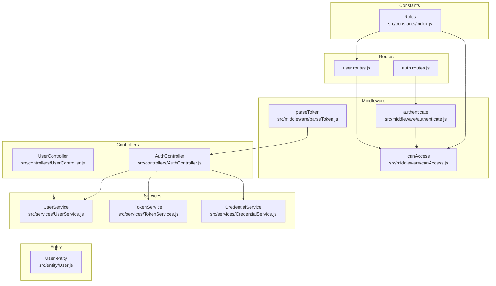
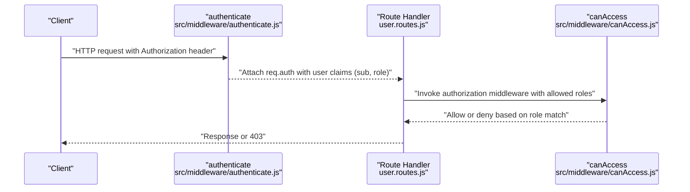
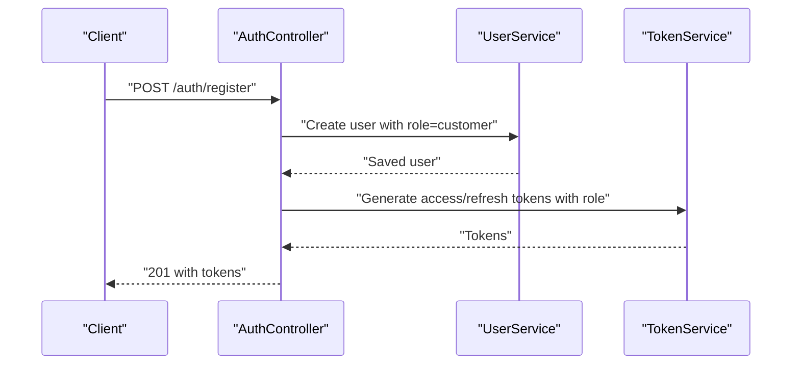
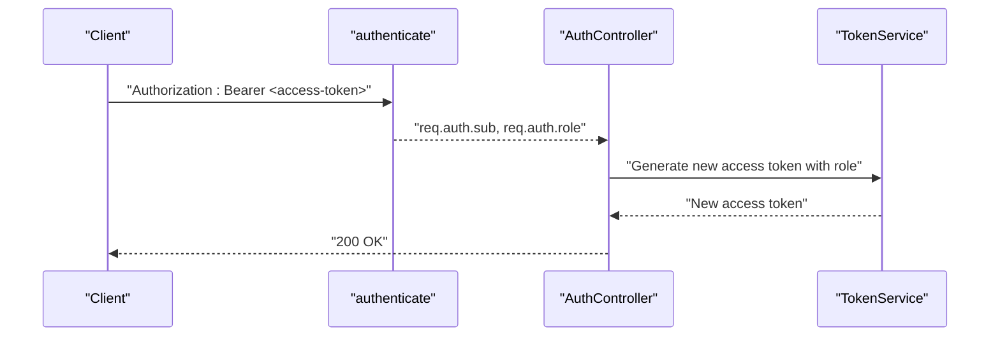
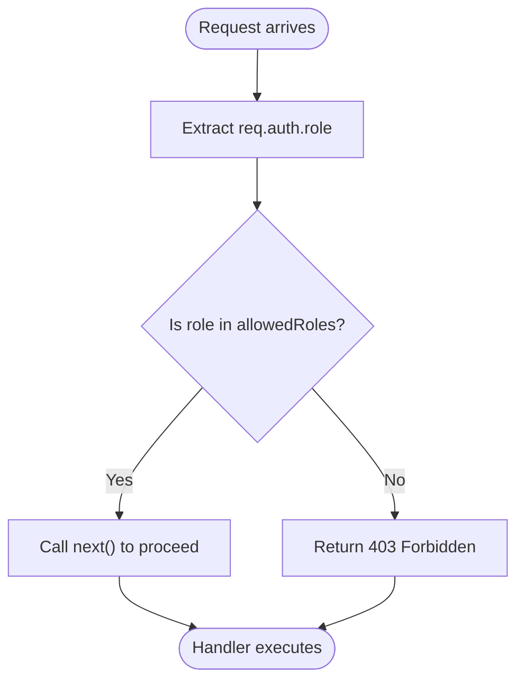
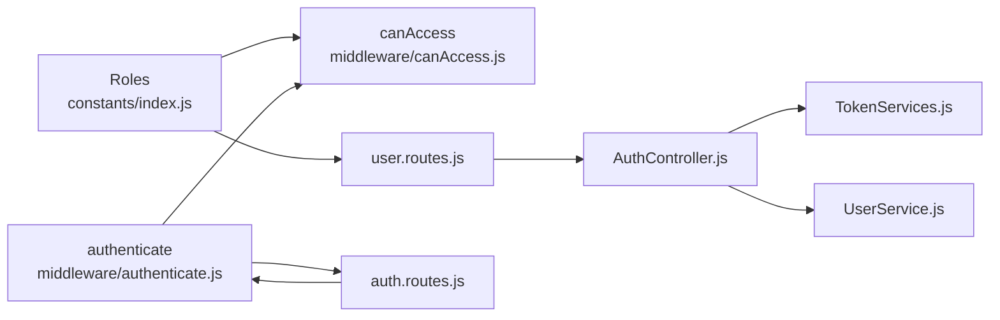

# Role-Based Access Control (RBAC)

<cite>
**Referenced Files in This Document**
- [src/constants/index.js](file://src/constants/index.js)
- [src/entity/User.js](file://src/entity/User.js)
- [src/middleware/authenticate.js](file://src/middleware/authenticate.js)
- [src/middleware/canAccess.js](file://src/middleware/canAccess.js)
- [src/middleware/parseToken.js](file://src/middleware/parseToken.js)
- [src/controllers/AuthController.js](file://src/controllers/AuthController.js)
- [src/controllers/UserController.js](file://src/controllers/UserController.js)
- [src/services/UserService.js](file://src/services/UserService.js)
- [src/services/TokenServices.js](file://src/services/TokenServices.js)
- [src/services/CredentialService.js](file://src/services/CredentialService.js)
- [src/routes/auth.routes.js](file://src/routes/auth.routes.js)
- [src/routes/user.routes.js](file://src/routes/user.routes.js)
- [src/test/users/user.spec.js](file://src/test/users/user.spec.js)
- [src/test/users/create.spec.js](file://src/test/users/create.spec.js)
</cite>

## Table of Contents
1. [Introduction](#introduction)
2. [Project Structure](#project-structure)
3. [Core Components](#core-components)
4. [Architecture Overview](#architecture-overview)
5. [Detailed Component Analysis](#detailed-component-analysis)
6. [Dependency Analysis](#dependency-analysis)
7. [Performance Considerations](#performance-considerations)
8. [Troubleshooting Guide](#troubleshooting-guide)
9. [Conclusion](#conclusion)
10. [Appendices](#appendices)

## Introduction
This document explains the Role-Based Access Control (RBAC) system implemented in the service. It covers the three role types, their hierarchy and permissions, how roles are defined and validated during authentication, and how enforcement occurs across the application. Practical examples illustrate role-based authorization checks, role assignment workflows, and transitions. The document also outlines the relationship between user roles and available resources, including API endpoint access patterns, and highlights security considerations and common RBAC pitfalls.

## Project Structure
The RBAC implementation spans constants, middleware, controllers, services, routes, and tests. Roles are centrally defined and referenced by middleware and routes to enforce authorization policies. Authentication middleware validates tokens and attaches user claims (including role) to the request object for downstream authorization checks.

**Diagram sources**
- [src/constants/index.js:1-6](file://src/constants/index.js#L1-L6)
- [src/middleware/authenticate.js:1-26](file://src/middleware/authenticate.js#L1-L26)
- [src/middleware/canAccess.js:1-23](file://src/middleware/canAccess.js#L1-L23)
- [src/middleware/parseToken.js:1-14](file://src/middleware/parseToken.js#L1-L14)
- [src/controllers/AuthController.js:1-212](file://src/controllers/AuthController.js#L1-L212)
- [src/controllers/UserController.js:1-94](file://src/controllers/UserController.js#L1-L94)
- [src/services/UserService.js:1-99](file://src/services/UserService.js#L1-L99)
- [src/services/TokenServices.js:1-60](file://src/services/TokenServices.js#L1-L60)
- [src/services/CredentialService.js:1-7](file://src/services/CredentialService.js#L1-L7)
- [src/routes/auth.routes.js:1-49](file://src/routes/auth.routes.js#L1-L49)
- [src/routes/user.routes.js:1-38](file://src/routes/user.routes.js#L1-L38)
- [src/entity/User.js:1-50](file://src/entity/User.js#L1-L50)

**Section sources**
- [src/constants/index.js:1-6](file://src/constants/index.js#L1-L6)
- [src/middleware/authenticate.js:1-26](file://src/middleware/authenticate.js#L1-L26)
- [src/middleware/canAccess.js:1-23](file://src/middleware/canAccess.js#L1-L23)
- [src/middleware/parseToken.js:1-14](file://src/middleware/parseToken.js#L1-L14)
- [src/controllers/AuthController.js:1-212](file://src/controllers/AuthController.js#L1-L212)
- [src/controllers/UserController.js:1-94](file://src/controllers/UserController.js#L1-L94)
- [src/services/UserService.js:1-99](file://src/services/UserService.js#L1-L99)
- [src/services/TokenServices.js:1-60](file://src/services/TokenServices.js#L1-L60)
- [src/services/CredentialService.js:1-7](file://src/services/CredentialService.js#L1-L7)
- [src/routes/auth.routes.js:1-49](file://src/routes/auth.routes.js#L1-L49)
- [src/routes/user.routes.js:1-38](file://src/routes/user.routes.js#L1-L38)
- [src/entity/User.js:1-50](file://src/entity/User.js#L1-L50)

## Core Components
- Roles definition: Centralized role constants define the supported roles used throughout the system.
- Authentication middleware: Validates JWTs and extracts user identity and role from tokens.
- Authorization middleware: Enforces role-based access control by checking the user’s role against allowed roles.
- Controllers and routes: Define which endpoints require authentication and which roles are permitted.
- Services: Persist and manage users, issue tokens, and handle credentials.
- Entity: Stores user data including role and tenant association.

Key implementation references:
- Roles constant: [src/constants/index.js:1-6](file://src/constants/index.js#L1-L6)
- Authentication middleware: [src/middleware/authenticate.js:1-26](file://src/middleware/authenticate.js#L1-L26)
- Authorization middleware: [src/middleware/canAccess.js:1-23](file://src/middleware/canAccess.js#L1-L23)
- User routes with role enforcement: [src/routes/user.routes.js:15-35](file://src/routes/user.routes.js#L15-L35)
- Auth controller role usage: [src/controllers/AuthController.js:34](file://src/controllers/AuthController.js#L34), [src/controllers/AuthController.js:105](file://src/controllers/AuthController.js#L105), [src/controllers/AuthController.js:147](file://src/controllers/AuthController.js#L147)
- User service role persistence: [src/services/UserService.js:25](file://src/services/UserService.js#L25)
- User entity role column: [src/entity/User.js:27-29](file://src/entity/User.js#L27-L29)

**Section sources**
- [src/constants/index.js:1-6](file://src/constants/index.js#L1-L6)
- [src/middleware/authenticate.js:1-26](file://src/middleware/authenticate.js#L1-L26)
- [src/middleware/canAccess.js:1-23](file://src/middleware/canAccess.js#L1-L23)
- [src/routes/user.routes.js:15-35](file://src/routes/user.routes.js#L15-L35)
- [src/controllers/AuthController.js:34](file://src/controllers/AuthController.js#L34)
- [src/controllers/AuthController.js:105](file://src/controllers/AuthController.js#L105)
- [src/controllers/AuthController.js:147](file://src/controllers/AuthController.js#L147)
- [src/services/UserService.js:25](file://src/services/UserService.js#L25)
- [src/entity/User.js:27-29](file://src/entity/User.js#L27-L29)

## Architecture Overview
The RBAC architecture enforces authorization via middleware. Tokens carry the user’s role claim, which is attached to the request by the authentication middleware. Subsequent authorization middleware checks the role against allowed roles per route.

**Diagram sources**
- [src/middleware/authenticate.js:6-25](file://src/middleware/authenticate.js#L6-L25)
- [src/middleware/canAccess.js:4-22](file://src/middleware/canAccess.js#L4-L22)
- [src/routes/user.routes.js:15-35](file://src/routes/user.routes.js#L15-L35)

## Detailed Component Analysis

### Roles and Role Types
- CUSTOMER: Basic access role assigned by default during registration.
- ADMIN: Full administrative access role used to protect sensitive endpoints.
- MANAGER: Present in the system (e.g., test fixtures) but not currently enforced by dedicated routes in the provided code.

Role constants are defined centrally and referenced by controllers, routes, and authorization middleware.

**Section sources**
- [src/constants/index.js:1-6](file://src/constants/index.js#L1-L6)
- [src/controllers/AuthController.js:34](file://src/controllers/AuthController.js#L34)
- [src/test/users/create.spec.js:76](file://src/test/users/create.spec.js#L76)

### Role Assignment Mechanisms
- Registration assigns the CUSTOMER role by default.
- Login re-emits the stored role in access tokens.
- Token refresh preserves the role claim.
- User management endpoints accept role updates, enabling role transitions.

**Diagram sources**
- [src/controllers/AuthController.js:19-70](file://src/controllers/AuthController.js#L19-L70)
- [src/services/UserService.js:7-38](file://src/services/UserService.js#L7-L38)
- [src/services/TokenServices.js:12-43](file://src/services/TokenServices.js#L12-L43)

**Section sources**
- [src/controllers/AuthController.js:19-70](file://src/controllers/AuthController.js#L19-L70)
- [src/services/UserService.js:7-38](file://src/services/UserService.js#L7-L38)
- [src/services/TokenServices.js:12-43](file://src/services/TokenServices.js#L12-L43)

### Role Validation During Authentication
- Authentication middleware validates the access token and extracts user claims (subject and role) into req.auth.
- Controllers rely on req.auth.role for downstream logic and token issuance.
- Refresh flow preserves the role claim from the incoming token.

**Diagram sources**
- [src/middleware/authenticate.js:6-25](file://src/middleware/authenticate.js#L6-L25)
- [src/controllers/AuthController.js:103-135](file://src/controllers/AuthController.js#L103-L135)
- [src/controllers/AuthController.js:143-192](file://src/controllers/AuthController.js#L143-L192)
- [src/services/TokenServices.js:12-43](file://src/services/TokenServices.js#L12-L43)

**Section sources**
- [src/middleware/authenticate.js:6-25](file://src/middleware/authenticate.js#L6-L25)
- [src/controllers/AuthController.js:103-135](file://src/controllers/AuthController.js#L103-L135)
- [src/controllers/AuthController.js:143-192](file://src/controllers/AuthController.js#L143-L192)

### Authorization Enforcement
- The authorization middleware checks whether the authenticated user’s role is included in the allowed roles array for the route.
- Routes protecting user management actions require ADMIN role.
- Self-profile route requires authentication but does not restrict by role in the provided routes.

**Diagram sources**
- [src/middleware/canAccess.js:4-22](file://src/middleware/canAccess.js#L4-L22)
- [src/routes/user.routes.js:15-35](file://src/routes/user.routes.js#L15-L35)

**Section sources**
- [src/middleware/canAccess.js:4-22](file://src/middleware/canAccess.js#L4-L22)
- [src/routes/user.routes.js:15-35](file://src/routes/user.routes.js#L15-L35)

### Relationship Between Roles and Resources
- ADMIN role is required for user creation, listing, updating, and deletion endpoints.
- Self-profile retrieval is protected by authentication middleware but does not enforce role in the provided routes.
- Role presence in tokens enables fine-grained access control across endpoints.

Practical examples:
- Admin-only user management: [src/routes/user.routes.js:15-35](file://src/routes/user.routes.js#L15-L35)
- Self profile access: [src/routes/auth.routes.js:37-39](file://src/routes/auth.routes.js#L37-L39)

**Section sources**
- [src/routes/user.routes.js:15-35](file://src/routes/user.routes.js#L15-L35)
- [src/routes/auth.routes.js:37-39](file://src/routes/auth.routes.js#L37-L39)

### Role Security Considerations
- Token role integrity: Access tokens are signed with RS256 and validated via JWKS; ensure JWKS URI correctness and caching behavior.
- Cookie security: Access and refresh tokens are stored in cookies with HttpOnly and SameSite strict; ensure environment-specific cookie attributes.
- Role leakage: Controllers avoid returning sensitive fields (e.g., password) in responses.
- Token rotation: Refresh flow rotates tokens and invalidates the previous refresh token.

References:
- Access token signing and validation: [src/services/TokenServices.js:12-43](file://src/services/TokenServices.js#L12-L43), [src/middleware/authenticate.js:6-25](file://src/middleware/authenticate.js#L6-L25)
- Cookie handling: [src/controllers/AuthController.js:50-62](file://src/controllers/AuthController.js#L50-L62), [src/controllers/AuthController.js:116-129](file://src/controllers/AuthController.js#L116-L129)
- Password protection: [src/entity/User.js:23-26](file://src/entity/User.js#L23-L26)
- Token rotation: [src/controllers/AuthController.js:143-192](file://src/controllers/AuthController.js#L143-L192)

**Section sources**
- [src/services/TokenServices.js:12-43](file://src/services/TokenServices.js#L12-L43)
- [src/middleware/authenticate.js:6-25](file://src/middleware/authenticate.js#L6-L25)
- [src/controllers/AuthController.js:50-62](file://src/controllers/AuthController.js#L50-L62)
- [src/controllers/AuthController.js:116-129](file://src/controllers/AuthController.js#L116-L129)
- [src/entity/User.js:23-26](file://src/entity/User.js#L23-L26)
- [src/controllers/AuthController.js:143-192](file://src/controllers/AuthController.js#L143-L192)

### Common RBAC Pitfalls and How This Code Avoids Them
- Hardcoded role checks: Allowed roles are passed as parameters to the authorization middleware, avoiding hardcoded checks in route handlers.
- Missing role in token: The authorization middleware checks req.auth.role and denies access if missing, preventing accidental bypasses.
- Role escalation: Role updates occur via controlled endpoints with validation; ensure proper input sanitization and authorization for role-changing operations.
- Inconsistent role enforcement: Routes consistently apply the authorization middleware with explicit allowed roles.

References:
- Parameterized authorization: [src/middleware/canAccess.js:4-22](file://src/middleware/canAccess.js#L4-L22)
- Role enforcement on routes: [src/routes/user.routes.js:15-35](file://src/routes/user.routes.js#L15-L35)

**Section sources**
- [src/middleware/canAccess.js:4-22](file://src/middleware/canAccess.js#L4-L22)
- [src/routes/user.routes.js:15-35](file://src/routes/user.routes.js#L15-L35)

## Dependency Analysis
The following diagram shows how roles and middleware connect to routes and controllers.

**Diagram sources**
- [src/constants/index.js:1-6](file://src/constants/index.js#L1-L6)
- [src/middleware/canAccess.js:1-23](file://src/middleware/canAccess.js#L1-L23)
- [src/middleware/authenticate.js:1-26](file://src/middleware/authenticate.js#L1-L26)
- [src/routes/user.routes.js:1-38](file://src/routes/user.routes.js#L1-L38)
- [src/routes/auth.routes.js:1-49](file://src/routes/auth.routes.js#L1-L49)
- [src/controllers/AuthController.js:1-212](file://src/controllers/AuthController.js#L1-L212)
- [src/services/TokenServices.js:1-60](file://src/services/TokenServices.js#L1-L60)
- [src/services/UserService.js:1-99](file://src/services/UserService.js#L1-L99)

**Section sources**
- [src/constants/index.js:1-6](file://src/constants/index.js#L1-L6)
- [src/middleware/canAccess.js:1-23](file://src/middleware/canAccess.js#L1-L23)
- [src/middleware/authenticate.js:1-26](file://src/middleware/authenticate.js#L1-L26)
- [src/routes/user.routes.js:1-38](file://src/routes/user.routes.js#L1-L38)
- [src/routes/auth.routes.js:1-49](file://src/routes/auth.routes.js#L1-L49)
- [src/controllers/AuthController.js:1-212](file://src/controllers/AuthController.js#L1-L212)
- [src/services/TokenServices.js:1-60](file://src/services/TokenServices.js#L1-L60)
- [src/services/UserService.js:1-99](file://src/services/UserService.js#L1-L99)

## Performance Considerations
- Token verification: Using JWKS caching reduces latency for public key retrieval.
- Middleware order: Keep authentication before authorization to minimize redundant validations.
- Role checks: Keep allowed roles small arrays; avoid dynamic computation in hot paths.

[No sources needed since this section provides general guidance]

## Troubleshooting Guide
Common issues and resolutions:
- 403 Forbidden on protected routes: Ensure the token carries the required role claim and that the route is decorated with the appropriate authorization middleware.
- Missing role claim: Verify token generation includes the role and that the authentication middleware is applied before authorization.
- Role mismatch in tests: Confirm test tokens are issued with the intended role and issuer.

References:
- Authorization denial: [src/middleware/canAccess.js:10-17](file://src/middleware/canAccess.js#L10-L17)
- Token issuance with role: [src/controllers/AuthController.js:39](file://src/controllers/AuthController.js#L39), [src/controllers/AuthController.js:105](file://src/controllers/AuthController.js#L105), [src/controllers/AuthController.js:147](file://src/controllers/AuthController.js#L147)
- Test token role usage: [src/test/users/user.spec.js:69-73](file://src/test/users/user.spec.js#L69-L73), [src/test/users/create.spec.js:79-85](file://src/test/users/create.spec.js#L79-L85)

**Section sources**
- [src/middleware/canAccess.js:10-17](file://src/middleware/canAccess.js#L10-L17)
- [src/controllers/AuthController.js:39](file://src/controllers/AuthController.js#L39)
- [src/controllers/AuthController.js:105](file://src/controllers/AuthController.js#L105)
- [src/controllers/AuthController.js:147](file://src/controllers/AuthController.js#L147)
- [src/test/users/user.spec.js:69-73](file://src/test/users/user.spec.js#L69-L73)
- [src/test/users/create.spec.js:79-85](file://src/test/users/create.spec.js#L79-L85)

## Conclusion
The RBAC system defines roles centrally, enforces authorization via middleware, and protects sensitive endpoints with ADMIN-only access. Roles are embedded in tokens and validated at runtime, ensuring consistent enforcement across the application. By following the patterns demonstrated here, teams can maintain secure, predictable access control with minimal duplication and strong separation of concerns.

[No sources needed since this section summarizes without analyzing specific files]

## Appendices

### Role Hierarchy and Permission Levels
- CUSTOMER: Basic access (e.g., self-profile retrieval).
- ADMIN: Full administrative access (e.g., user management).
- MANAGER: Present in data fixtures/tests; not currently enforced by dedicated routes in the provided code.

References:
- Role constants: [src/constants/index.js:1-6](file://src/constants/index.js#L1-L6)
- Tests using MANAGER role: [src/test/users/create.spec.js:76](file://src/test/users/create.spec.js#L76)

**Section sources**
- [src/constants/index.js:1-6](file://src/constants/index.js#L1-L6)
- [src/test/users/create.spec.js:76](file://src/test/users/create.spec.js#L76)

### Practical Examples Index
- Assign CUSTOMER role during registration: [src/controllers/AuthController.js:34](file://src/controllers/AuthController.js#L34)
- Enforce ADMIN-only user endpoints: [src/routes/user.routes.js:15-35](file://src/routes/user.routes.js#L15-L35)
- Retrieve self profile with authentication: [src/routes/auth.routes.js:37-39](file://src/routes/auth.routes.js#L37-L39)
- Role-based authorization check flow: [src/middleware/canAccess.js:4-22](file://src/middleware/canAccess.js#L4-L22)

**Section sources**
- [src/controllers/AuthController.js:34](file://src/controllers/AuthController.js#L34)
- [src/routes/user.routes.js:15-35](file://src/routes/user.routes.js#L15-L35)
- [src/routes/auth.routes.js:37-39](file://src/routes/auth.routes.js#L37-L39)
- [src/middleware/canAccess.js:4-22](file://src/middleware/canAccess.js#L4-L22)