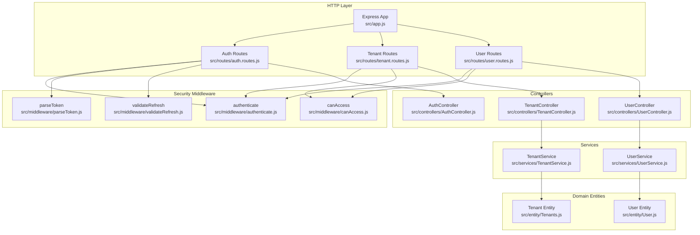
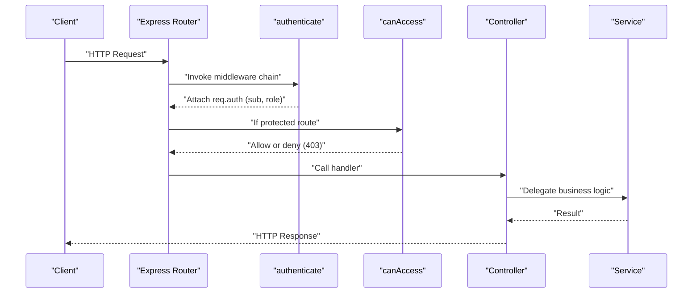
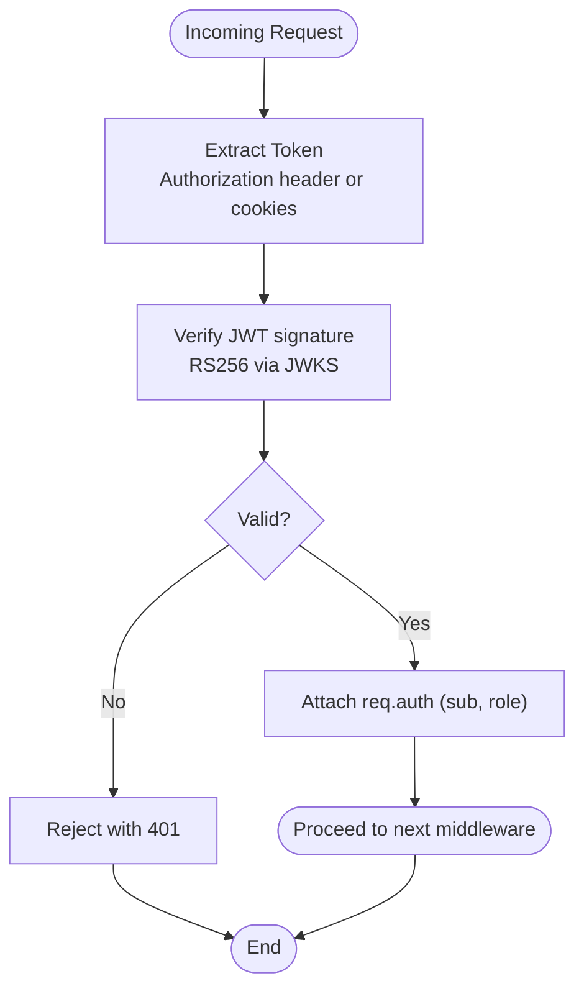
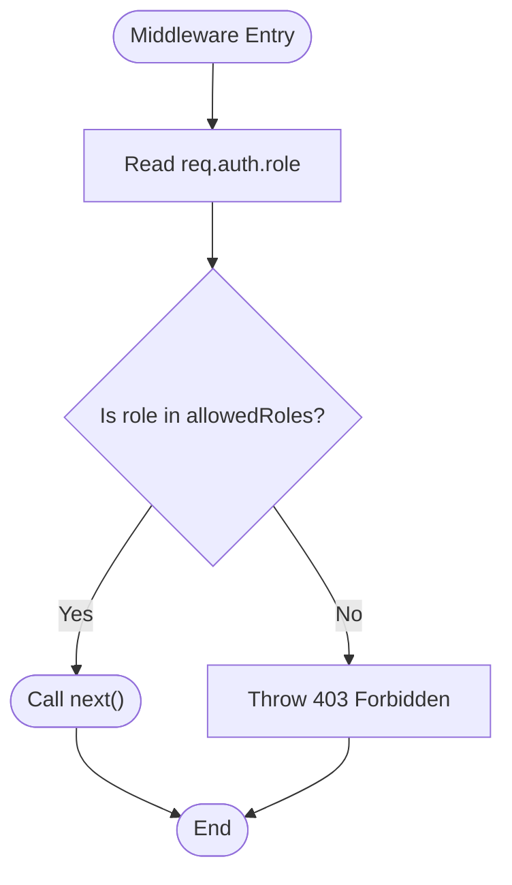
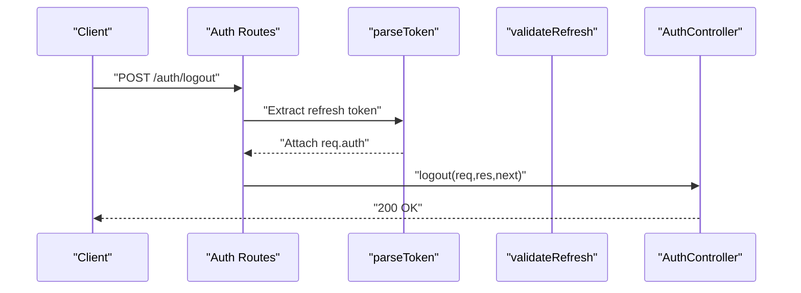
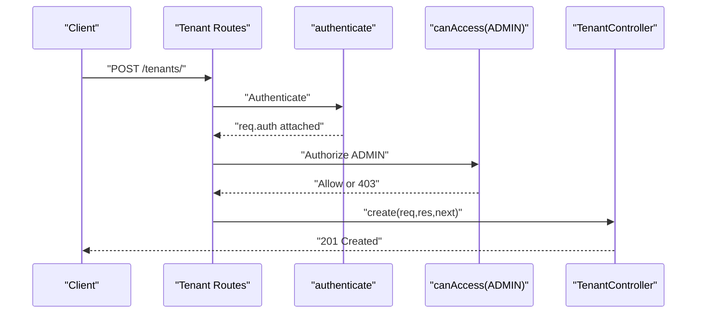
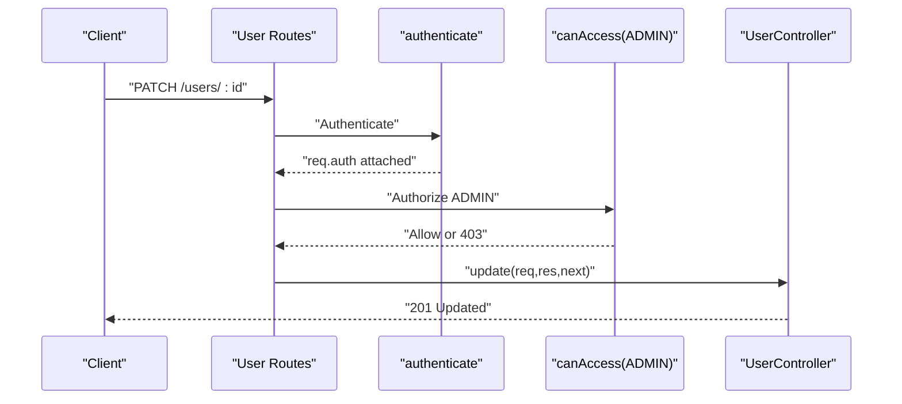
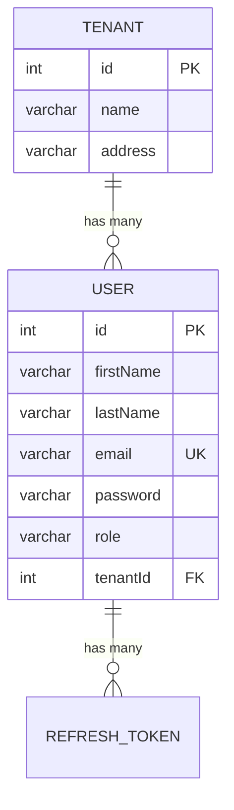
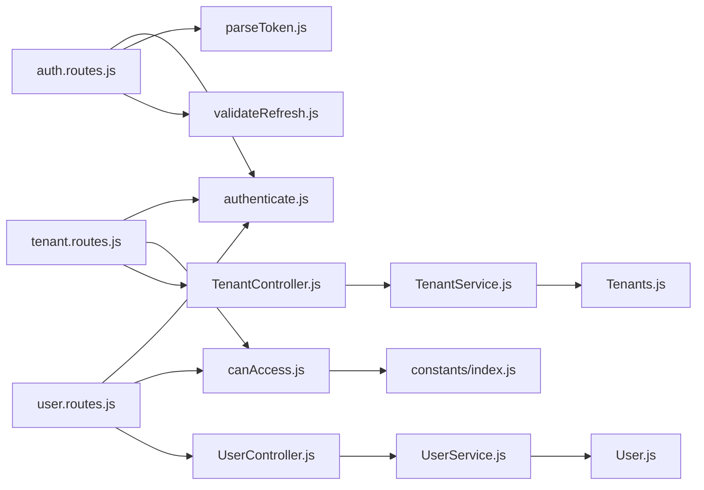

# Route-Level Security Enforcement

<cite>
**Referenced Files in This Document**
- [src/app.js](file://src/app.js)
- [src/routes/auth.routes.js](file://src/routes/auth.routes.js)
- [src/routes/tenant.routes.js](file://src/routes/tenant.routes.js)
- [src/routes/user.routes.js](file://src/routes/user.routes.js)
- [src/middleware/authenticate.js](file://src/middleware/authenticate.js)
- [src/middleware/canAccess.js](file://src/middleware/canAccess.js)
- [src/middleware/parseToken.js](file://src/middleware/parseToken.js)
- [src/middleware/validateRefresh.js](file://src/middleware/validateRefresh.js)
- [src/controllers/AuthController.js](file://src/controllers/AuthController.js)
- [src/controllers/TenantController.js](file://src/controllers/TenantController.js)
- [src/controllers/UserController.js](file://src/controllers/UserController.js)
- [src/services/TenantService.js](file://src/services/TenantService.js)
- [src/services/UserService.js](file://src/services/UserService.js)
- [src/constants/index.js](file://src/constants/index.js)
- [src/entity/User.js](file://src/entity/User.js)
- [src/entity/Tenants.js](file://src/entity/Tenants.js)
</cite>

## Table of Contents
1. [Introduction](#introduction)
2. [Project Structure](#project-structure)
3. [Core Components](#core-components)
4. [Architecture Overview](#architecture-overview)
5. [Detailed Component Analysis](#detailed-component-analysis)
6. [Dependency Analysis](#dependency-analysis)
7. [Performance Considerations](#performance-considerations)
8. [Troubleshooting Guide](#troubleshooting-guide)
9. [Conclusion](#conclusion)

## Introduction
This document explains how route-level security is enforced across the application. It focuses on:
- How authorization is applied at the routing level via middleware
- Protected route configurations and access control patterns
- Tenant and user route security implementations and role-based access
- Strategies for protecting endpoints before controller execution
- Security middleware integration and practical examples
- Patterns for CRUD operations, bulk operations, and administrative functions
- Common vulnerabilities and mitigation strategies

## Project Structure
The application is organized around Express routers, middleware, controllers, services, and data entities. Routes define endpoint patterns and attach middleware for authentication and authorization. Controllers orchestrate request handling and delegate to services. Services encapsulate business logic and persistence.

**Diagram sources**
- [src/app.js:19-21](file://src/app.js#L19-L21)
- [src/routes/auth.routes.js:12-14](file://src/routes/auth.routes.js#L12-L14)
- [src/routes/tenant.routes.js:7-8](file://src/routes/tenant.routes.js#L7-L8)
- [src/routes/user.routes.js:5-6](file://src/routes/user.routes.js#L5-L6)
- [src/middleware/authenticate.js:6-12](file://src/middleware/authenticate.js#L6-L12)
- [src/middleware/canAccess.js:4-7](file://src/middleware/canAccess.js#L4-L7)
- [src/middleware/parseToken.js:4-11](file://src/middleware/parseToken.js#L4-L11)
- [src/middleware/validateRefresh.js:7-13](file://src/middleware/validateRefresh.js#L7-L13)
- [src/controllers/AuthController.js:22-27](file://src/controllers/AuthController.js#L22-L27)
- [src/controllers/TenantController.js:6-9](file://src/controllers/TenantController.js#L6-L9)
- [src/controllers/UserController.js:8-11](file://src/controllers/UserController.js#L8-L11)
- [src/services/TenantService.js:4-6](file://src/services/TenantService.js#L4-L6)
- [src/services/UserService.js:4-6](file://src/services/UserService.js#L4-L6)
- [src/entity/User.js:3-49](file://src/entity/User.js#L3-L49)
- [src/entity/Tenants.js:3-28](file://src/entity/Tenants.js#L3-L28)

**Section sources**
- [src/app.js:1-40](file://src/app.js#L1-L40)
- [src/routes/auth.routes.js:1-49](file://src/routes/auth.routes.js#L1-L49)
- [src/routes/tenant.routes.js:1-45](file://src/routes/tenant.routes.js#L1-L45)
- [src/routes/user.routes.js:1-38](file://src/routes/user.routes.js#L1-L38)

## Core Components
- Authentication middleware validates JWTs using JWKS and extracts tokens from Authorization header or cookies.
- Role-based authorization middleware checks the authenticated user’s role against allowed roles.
- Route handlers attach middleware in order: authentication first, then authorization if required.
- Controllers handle request/response and delegate to services.
- Services encapsulate persistence and business logic.
- Constants define roles used across the system.

Key implementation references:
- Authentication middleware: [src/middleware/authenticate.js:6-12](file://src/middleware/authenticate.js#L6-L12)
- Role-based authorization: [src/middleware/canAccess.js:4-7](file://src/middleware/canAccess.js#L4-L7)
- Route-level middleware attachment: [src/routes/tenant.routes.js:16-21](file://src/routes/tenant.routes.js#L16-L21), [src/routes/user.routes.js:15-17](file://src/routes/user.routes.js#L15-L17)
- Roles definition: [src/constants/index.js:1-6](file://src/constants/index.js#L1-L6)

**Section sources**
- [src/middleware/authenticate.js:1-26](file://src/middleware/authenticate.js#L1-L26)
- [src/middleware/canAccess.js:1-23](file://src/middleware/canAccess.js#L1-L23)
- [src/routes/tenant.routes.js:1-45](file://src/routes/tenant.routes.js#L1-L45)
- [src/routes/user.routes.js:1-38](file://src/routes/user.routes.js#L1-L38)
- [src/constants/index.js:1-6](file://src/constants/index.js#L1-L6)

## Architecture Overview
The security architecture enforces authentication and authorization at the route level. Requests flow through middleware before reaching controllers. Authentication ensures a valid identity; authorization ensures permitted roles.

**Diagram sources**
- [src/middleware/authenticate.js:6-12](file://src/middleware/authenticate.js#L6-L12)
- [src/middleware/canAccess.js:4-7](file://src/middleware/canAccess.js#L4-L7)
- [src/routes/tenant.routes.js:16-21](file://src/routes/tenant.routes.js#L16-L21)
- [src/routes/user.routes.js:15-17](file://src/routes/user.routes.js#L15-L17)
- [src/controllers/TenantController.js:11-22](file://src/controllers/TenantController.js#L11-L22)
- [src/controllers/UserController.js:12-28](file://src/controllers/UserController.js#L12-L28)

## Detailed Component Analysis

### Authentication Middleware
Purpose:
- Validates JWT using JWKS and RS256.
- Extracts token from Authorization header or cookies.

Behavior:
- Uses a JWKS URI for public keys.
- Supports caching and rate limiting for JWKS.
- Accepts tokens from Authorization: Bearer or cookies.

**Diagram sources**
- [src/middleware/authenticate.js:6-12](file://src/middleware/authenticate.js#L6-L12)

**Section sources**
- [src/middleware/authenticate.js:1-26](file://src/middleware/authenticate.js#L1-L26)

### Authorization Middleware (Role-Based Access)
Purpose:
- Enforce role-based access control at the route level.

Behavior:
- Reads user role from req.auth.role.
- Compares against allowed roles array.
- Denies access with 403 if mismatch; otherwise proceeds.

**Diagram sources**
- [src/middleware/canAccess.js:4-7](file://src/middleware/canAccess.js#L4-L7)

**Section sources**
- [src/middleware/canAccess.js:1-23](file://src/middleware/canAccess.js#L1-L23)

### Auth Routes and Token Management
Protected endpoints:
- POST /auth/register: Public registration validator pipeline.
- POST /auth/login: Public login validator pipeline.
- GET /auth/self: Requires authentication; returns current user profile.
- POST /auth/refresh: Validates refresh token via dedicated middleware.
- POST /auth/logout: Parses refresh token from cookies and revokes.

**Diagram sources**
- [src/routes/auth.routes.js:44-46](file://src/routes/auth.routes.js#L44-L46)
- [src/middleware/parseToken.js:4-11](file://src/middleware/parseToken.js#L4-L11)
- [src/controllers/AuthController.js:194-210](file://src/controllers/AuthController.js#L194-L210)

**Section sources**
- [src/routes/auth.routes.js:1-49](file://src/routes/auth.routes.js#L1-L49)
- [src/middleware/parseToken.js:1-14](file://src/middleware/parseToken.js#L1-L14)
- [src/controllers/AuthController.js:1-212](file://src/controllers/AuthController.js#L1-L212)

### Tenant Management Routes
Endpoints and protections:
- POST /tenants/: Require authentication and ADMIN role to create.
- GET /tenants/: Public listing (no auth).
- GET /tenants/tenants/:id: Public retrieval (no auth).
- POST /tenants/tenants/:id: Require authentication and ADMIN role to update.
- DELETE /tenants/tenants/:id: Require authentication and ADMIN role to delete.

**Diagram sources**
- [src/routes/tenant.routes.js:16-21](file://src/routes/tenant.routes.js#L16-L21)
- [src/middleware/authenticate.js:6-12](file://src/middleware/authenticate.js#L6-L12)
- [src/middleware/canAccess.js:4-7](file://src/middleware/canAccess.js#L4-L7)
- [src/controllers/TenantController.js:11-22](file://src/controllers/TenantController.js#L11-L22)

**Section sources**
- [src/routes/tenant.routes.js:1-45](file://src/routes/tenant.routes.js#L1-L45)
- [src/controllers/TenantController.js:1-76](file://src/controllers/TenantController.js#L1-L76)
- [src/services/TenantService.js:1-66](file://src/services/TenantService.js#L1-L66)
- [src/entity/Tenants.js:1-29](file://src/entity/Tenants.js#L1-L29)

### User Management Routes
Endpoints and protections:
- POST /users: Require authentication and ADMIN role to create.
- GET /users: Require authentication and ADMIN role to list.
- GET /users/:id: Require authentication; controller fetches by ID.
- PATCH /users/:id: Require authentication and ADMIN role to update.
- DELETE /users/:id: Require authentication and ADMIN role to delete.

**Diagram sources**
- [src/routes/user.routes.js:24-29](file://src/routes/user.routes.js#L24-L29)
- [src/middleware/authenticate.js:6-12](file://src/middleware/authenticate.js#L6-L12)
- [src/middleware/canAccess.js:4-7](file://src/middleware/canAccess.js#L4-L7)
- [src/controllers/UserController.js:54-77](file://src/controllers/UserController.js#L54-L77)

**Section sources**
- [src/routes/user.routes.js:1-38](file://src/routes/user.routes.js#L1-L38)
- [src/controllers/UserController.js:1-94](file://src/controllers/UserController.js#L1-L94)
- [src/services/UserService.js:1-99](file://src/services/UserService.js#L1-L99)
- [src/entity/User.js:1-50](file://src/entity/User.js#L1-L50)

### Data Models and Relationships
Entities define columns and relations used by services and controllers.

**Diagram sources**
- [src/entity/User.js:3-49](file://src/entity/User.js#L3-L49)
- [src/entity/Tenants.js:3-28](file://src/entity/Tenants.js#L3-L28)

**Section sources**
- [src/entity/User.js:1-50](file://src/entity/User.js#L1-L50)
- [src/entity/Tenants.js:1-29](file://src/entity/Tenants.js#L1-L29)

## Dependency Analysis
- Routers depend on middleware for authentication and authorization.
- Controllers depend on services for business logic.
- Services depend on repositories backed by entities.
- Roles are centralized in constants and consumed by middleware and routes.

**Diagram sources**
- [src/routes/auth.routes.js:12-14](file://src/routes/auth.routes.js#L12-L14)
- [src/routes/tenant.routes.js:7-8](file://src/routes/tenant.routes.js#L7-L8)
- [src/routes/user.routes.js:5-6](file://src/routes/user.routes.js#L5-L6)
- [src/middleware/authenticate.js:6-12](file://src/middleware/authenticate.js#L6-L12)
- [src/middleware/canAccess.js:4-7](file://src/middleware/canAccess.js#L4-L7)
- [src/middleware/parseToken.js:4-11](file://src/middleware/parseToken.js#L4-L11)
- [src/middleware/validateRefresh.js:7-13](file://src/middleware/validateRefresh.js#L7-L13)
- [src/controllers/TenantController.js:6-9](file://src/controllers/TenantController.js#L6-L9)
- [src/controllers/UserController.js:8-11](file://src/controllers/UserController.js#L8-L11)
- [src/services/TenantService.js:4-6](file://src/services/TenantService.js#L4-L6)
- [src/services/UserService.js:4-6](file://src/services/UserService.js#L4-L6)
- [src/entity/User.js:3-49](file://src/entity/User.js#L3-L49)
- [src/entity/Tenants.js:3-28](file://src/entity/Tenants.js#L3-L28)
- [src/constants/index.js:1-6](file://src/constants/index.js#L1-L6)

**Section sources**
- [src/app.js:1-40](file://src/app.js#L1-L40)
- [src/routes/auth.routes.js:1-49](file://src/routes/auth.routes.js#L1-L49)
- [src/routes/tenant.routes.js:1-45](file://src/routes/tenant.routes.js#L1-L45)
- [src/routes/user.routes.js:1-38](file://src/routes/user.routes.js#L1-L38)

## Performance Considerations
- Prefer early middleware exit for unauthenticated requests to avoid unnecessary controller/service work.
- Cache JWKS and enable rate limiting to reduce external lookups and abuse.
- Keep authorization checks minimal and deterministic; avoid heavy computations inside middleware.
- Use appropriate HTTP status codes to short-circuit error paths efficiently.

## Troubleshooting Guide
Common issues and mitigations:
- 401 Unauthorized on protected routes:
  - Ensure Authorization header is present or refresh/access cookies are set.
  - Confirm token signing algorithm and JWKS URI are correct.
  - References: [src/middleware/authenticate.js:6-12](file://src/middleware/authenticate.js#L6-L12)
- 403 Forbidden on admin-only routes:
  - Verify the token carries the required role.
  - Confirm route uses canAccess with ADMIN.
  - References: [src/middleware/canAccess.js:4-7](file://src/middleware/canAccess.js#L4-L7), [src/routes/tenant.routes.js:19](file://src/routes/tenant.routes.js#L19), [src/routes/user.routes.js:16](file://src/routes/user.routes.js#L16)
- Refresh token validation failures:
  - Ensure refresh token is present in cookies and not revoked.
  - References: [src/middleware/validateRefresh.js:14-30](file://src/middleware/validateRefresh.js#L14-L30)
- Logout not clearing tokens:
  - Confirm refresh token deletion and cookie clearing logic.
  - References: [src/controllers/AuthController.js:194-210](file://src/controllers/AuthController.js#L194-L210)

**Section sources**
- [src/middleware/authenticate.js:1-26](file://src/middleware/authenticate.js#L1-L26)
- [src/middleware/canAccess.js:1-23](file://src/middleware/canAccess.js#L1-L23)
- [src/middleware/validateRefresh.js:1-34](file://src/middleware/validateRefresh.js#L1-L34)
- [src/controllers/AuthController.js:194-210](file://src/controllers/AuthController.js#L194-L210)

## Conclusion
Route-level security is consistently enforced by attaching authentication middleware before controllers and, when necessary, role-based authorization middleware. Administrative endpoints require explicit ADMIN role checks, while general user endpoints enforce authentication. The design cleanly separates concerns across middleware, controllers, services, and entities, enabling predictable and maintainable security enforcement.