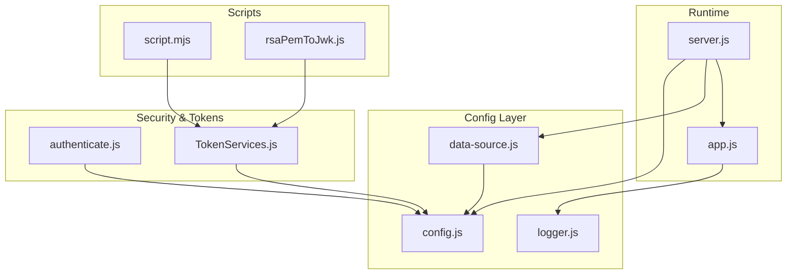
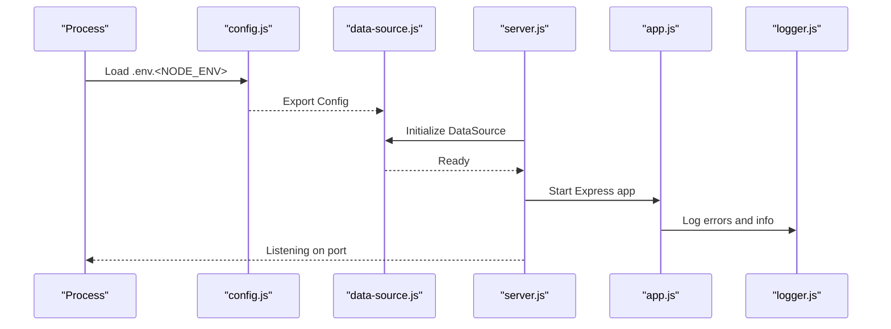
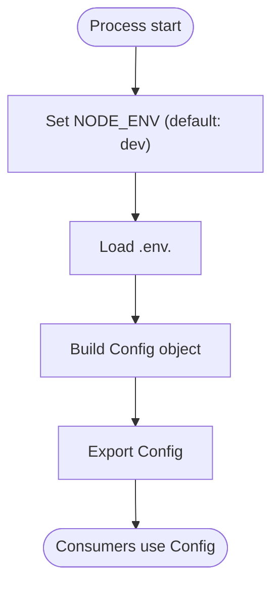
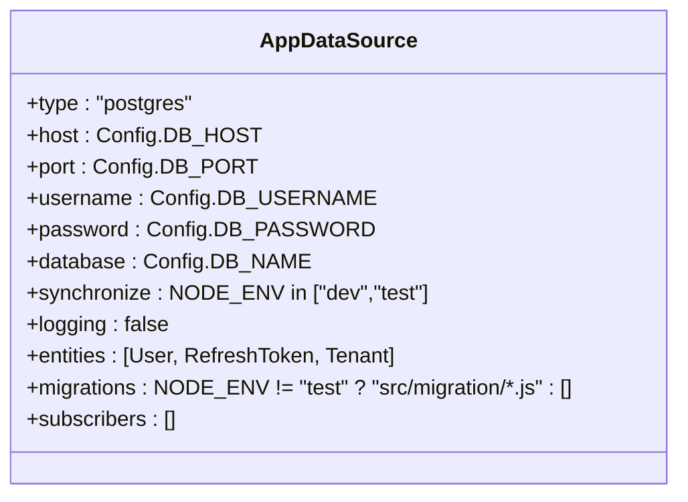
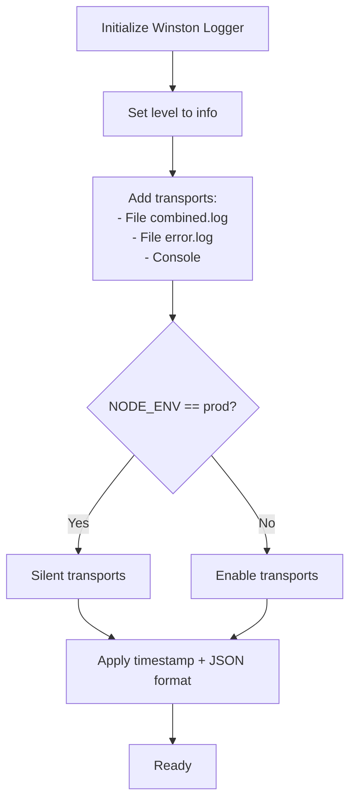
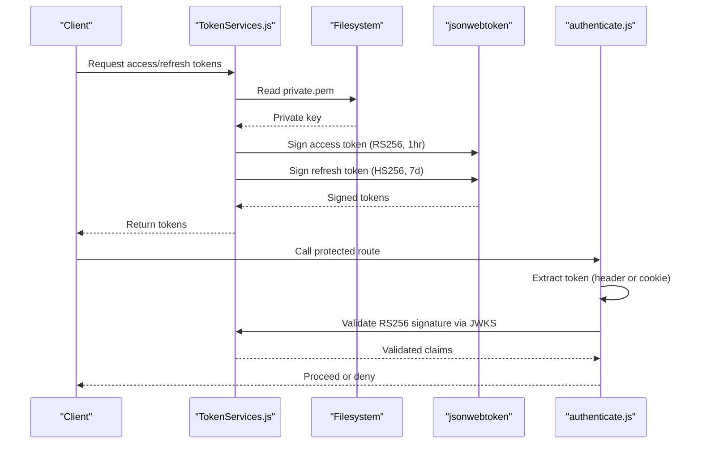
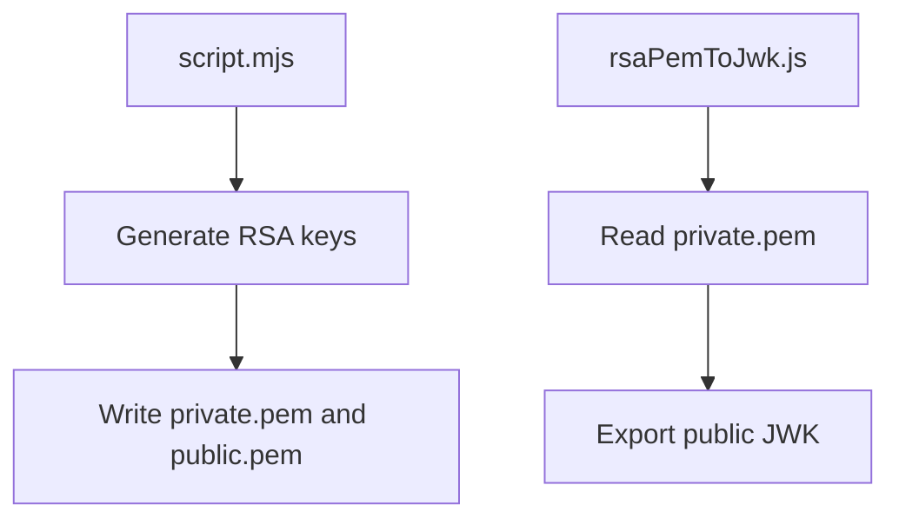
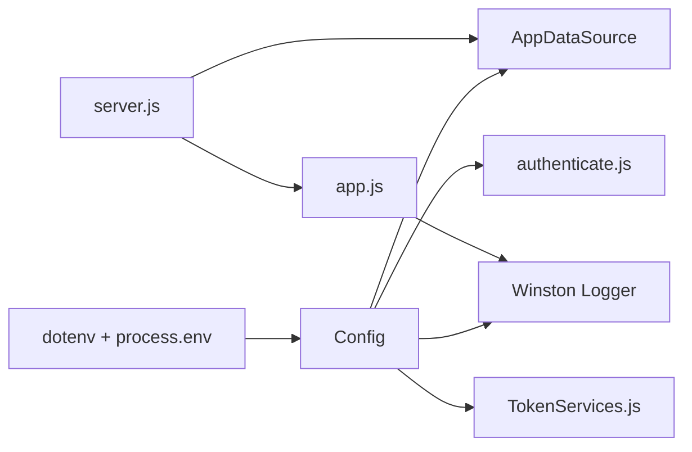

# Configuration Management

<cite>
**Referenced Files in This Document**
- [config.js](file://src/config/config.js)
- [data-source.js](file://src/config/data-source.js)
- [logger.js](file://src/config/logger.js)
- [server.js](file://src/server.js)
- [app.js](file://src/app.js)
- [TokenServices.js](file://src/services/TokenServices.js)
- [authenticate.js](file://src/middleware/authenticate.js)
- [package.json](file://package.json)
- [1773479637906-migration.js](file://src/migration/1773479637906-migration.js)
- [rsaPemToJwk.js](file://script/rsaPemToJwk.js)
- [script.mjs](file://script/script.mjs)
</cite>

## Table of Contents
1. [Introduction](#introduction)
2. [Project Structure](#project-structure)
3. [Core Components](#core-components)
4. [Architecture Overview](#architecture-overview)
5. [Detailed Component Analysis](#detailed-component-analysis)
6. [Dependency Analysis](#dependency-analysis)
7. [Performance Considerations](#performance-considerations)
8. [Troubleshooting Guide](#troubleshooting-guide)
9. [Conclusion](#conclusion)
10. [Appendices](#appendices)

## Introduction
This document explains configuration management for the authentication service. It covers environment variable loading, database connectivity via TypeORM, logging with Winston, JWT configuration, and security-related parameters. It also provides guidance for development, staging, and production environments, along with validation, defaults, overrides, and best practices for production deployments.

## Project Structure
Configuration is centralized under src/config and consumed by the server, application, data source, and services. Scripts under script/ support certificate generation and JWK export. Environment-specific .env files are loaded based on NODE_ENV.

**Diagram sources**
- [config.js:1-34](file://src/config/config.js#L1-L34)
- [logger.js:1-42](file://src/config/logger.js#L1-L42)
- [data-source.js:1-22](file://src/config/data-source.js#L1-L22)
- [server.js:1-21](file://src/server.js#L1-L21)
- [app.js:1-40](file://src/app.js#L1-L40)
- [authenticate.js:1-26](file://src/middleware/authenticate.js#L1-L26)
- [TokenServices.js:1-60](file://src/services/TokenServices.js#L1-L60)
- [rsaPemToJwk.js:1-7](file://script/rsaPemToJwk.js#L1-L7)
- [script.mjs:1-29](file://script/script.mjs#L1-L29)

**Section sources**
- [config.js:1-34](file://src/config/config.js#L1-L34)
- [logger.js:1-42](file://src/config/logger.js#L1-L42)
- [data-source.js:1-22](file://src/config/data-source.js#L1-L22)
- [server.js:1-21](file://src/server.js#L1-L21)
- [app.js:1-40](file://src/app.js#L1-L40)
- [authenticate.js:1-26](file://src/middleware/authenticate.js#L1-L26)
- [TokenServices.js:1-60](file://src/services/TokenServices.js#L1-L60)
- [rsaPemToJwk.js:1-7](file://script/rsaPemToJwk.js#L1-L7)
- [script.mjs:1-29](file://script/script.mjs#L1-L29)

## Core Components
- Environment configuration loader: Loads .env.<NODE_ENV> and exposes a unified Config object.
- Database configuration: TypeORM DataSource configured from environment variables with environment-aware migrations and synchronization.
- Logging configuration: Winston logger with file and console transports, environment-aware silencing, and JSON formatting.
- JWT configuration: Access tokens signed with RSA (RS256) using a private key; refresh tokens signed with HMAC (HS256) using a shared secret; middleware validates RS256 tokens from JWKS.

**Section sources**
- [config.js:1-34](file://src/config/config.js#L1-L34)
- [data-source.js:1-22](file://src/config/data-source.js#L1-L22)
- [logger.js:1-42](file://src/config/logger.js#L1-L42)
- [authenticate.js:1-26](file://src/middleware/authenticate.js#L1-L26)
- [TokenServices.js:1-60](file://src/services/TokenServices.js#L1-L60)

## Architecture Overview
The configuration architecture integrates environment variables, TypeORM, Winston, and JWT middleware. The server initializes the data source and starts the Express app, which logs errors and routes requests.

**Diagram sources**
- [config.js:1-34](file://src/config/config.js#L1-L34)
- [data-source.js:1-22](file://src/config/data-source.js#L1-L22)
- [server.js:1-21](file://src/server.js#L1-L21)
- [app.js:1-40](file://src/app.js#L1-L40)
- [logger.js:1-42](file://src/config/logger.js#L1-L42)

## Detailed Component Analysis

### Environment Variables and Config Loader
- Behavior: Loads .env.<NODE_ENV> where NODE_ENV defaults to dev if unset. Exposes a Config object containing database credentials, server port, environment, secrets, and JWKS URI.
- Defaults: None explicitly set in code; relies on environment variables. The server falls back to a default port when Config.PORT is missing.
- Overrides: NODE_ENV controls which .env file is loaded; scripts override NODE_ENV for specific tasks.

**Diagram sources**
- [config.js:1-34](file://src/config/config.js#L1-L34)
- [server.js:10-14](file://src/server.js#L10-L14)

**Section sources**
- [config.js:1-34](file://src/config/config.js#L1-L34)
- [server.js:10-14](file://src/server.js#L10-L14)
- [package.json:8-13](file://package.json#L8-L13)

### Database Configuration (TypeORM)
- DataSource settings:
  - Type: PostgreSQL
  - Host, port, username, password, database: sourced from Config
  - Synchronize: enabled for dev/test, disabled for prod
  - Logging: disabled
  - Entities: User, RefreshToken, Tenant
  - Migrations: enabled except for test; migration path is environment-aware
- Connection pooling: Not explicitly configured; TypeORM defaults apply.
- Migration configuration: Migration files are included for non-test environments.

**Diagram sources**
- [data-source.js:8-21](file://src/config/data-source.js#L8-L21)

**Section sources**
- [data-source.js:1-22](file://src/config/data-source.js#L1-L22)
- [1773479637906-migration.js:1-34](file://src/migration/1773479637906-migration.js#L1-L34)

### Logging Configuration (Winston)
- Log levels: info for file/console, error for error file.
- Output formatting: JSON with ISO-like timestamps.
- Transports:
  - File transport for combined logs (silenced in prod)
  - File transport for error logs (silenced in prod)
  - Console transport (silenced in prod)
- Service metadata: defaultMeta includes serviceName.

**Diagram sources**
- [logger.js:4-39](file://src/config/logger.js#L4-L39)

**Section sources**
- [logger.js:1-42](file://src/config/logger.js#L1-L42)

### JWT Configuration and Security
- Access tokens:
  - Algorithm: RS256
  - Issuer: auth-service
  - Expiration: 1 hour
  - Signing key: RSA private key read from certs/private.pem
- Refresh tokens:
  - Algorithm: HS256
  - Issuer: auth-service
  - Expiration: 7 days
  - Signing key: PRIVATE_KEY_SECRET from environment
  - Unique token ID: jwtid derived from user id
- Token validation:
  - Algorithm enforced: RS256
  - JWKS URI sourced from environment
  - Caching and rate limiting enabled for JWKS retrieval
  - Token extraction supports Authorization header and cookies

**Diagram sources**
- [TokenServices.js:12-43](file://src/services/TokenServices.js#L12-L43)
- [authenticate.js:6-25](file://src/middleware/authenticate.js#L6-L25)

**Section sources**
- [TokenServices.js:1-60](file://src/services/TokenServices.js#L1-L60)
- [authenticate.js:1-26](file://src/middleware/authenticate.js#L1-L26)

### Scripts for Certificates and JWK Export
- Certificate generation: Creates RSA keypair and writes PEM files to certs/.
- JWK export: Converts private PEM to public JWK for JWKS publishing.

**Diagram sources**
- [script.mjs:12-29](file://script/script.mjs#L12-L29)
- [rsaPemToJwk.js:4-6](file://script/rsaPemToJwk.js#L4-L6)

**Section sources**
- [script.mjs:1-29](file://script/script.mjs#L1-L29)
- [rsaPemToJwk.js:1-7](file://script/rsaPemToJwk.js#L1-L7)

## Dependency Analysis
- Environment loading depends on dotenv and process environment.
- Data source depends on Config and entities.
- Logger depends on Config for environment-aware behavior.
- Server depends on Config, Data Source, and Express app.
- Token services depend on Config and filesystem for private key.
- Authentication middleware depends on Config for JWKS URI and enforces RS256.

**Diagram sources**
- [config.js:1-34](file://src/config/config.js#L1-L34)
- [data-source.js:1-22](file://src/config/data-source.js#L1-L22)
- [logger.js:1-42](file://src/config/logger.js#L1-L42)
- [authenticate.js:1-26](file://src/middleware/authenticate.js#L1-L26)
- [TokenServices.js:1-60](file://src/services/TokenServices.js#L1-L60)
- [server.js:1-21](file://src/server.js#L1-L21)
- [app.js:1-40](file://src/app.js#L1-L40)

**Section sources**
- [config.js:1-34](file://src/config/config.js#L1-L34)
- [data-source.js:1-22](file://src/config/data-source.js#L1-L22)
- [logger.js:1-42](file://src/config/logger.js#L1-L42)
- [authenticate.js:1-26](file://src/middleware/authenticate.js#L1-L26)
- [TokenServices.js:1-60](file://src/services/TokenServices.js#L1-L60)
- [server.js:1-21](file://src/server.js#L1-L21)
- [app.js:1-40](file://src/app.js#L1-L40)

## Performance Considerations
- Database:
  - Avoid synchronize in production; rely on migrations.
  - Consider configuring connection pooling (e.g., max, idle, acquireTimeout) via TypeORM options if needed.
- Logging:
  - File transports are silenced in prod; ensure log aggregation pipeline is configured externally.
  - JSON formatting is efficient; avoid excessive logging in hot paths.
- JWT:
  - JWKS caching and rate limiting reduce network overhead.
  - Keep token lifetimes minimal to reduce validation overhead and risk exposure.

[No sources needed since this section provides general guidance]

## Troubleshooting Guide
- Missing environment variables:
  - Verify .env.<NODE_ENV> exists and contains required keys.
  - Confirm NODE_ENV is set appropriately for the target environment.
- Database initialization failures:
  - Check DB_HOST, DB_PORT, DB_USERNAME, DB_PASSWORD, DB_NAME.
  - Ensure migrations are applied for non-test environments.
- JWT validation errors:
  - Confirm JWKS_URI points to a reachable JWKS endpoint.
  - Verify PRIVATE_KEY_SECRET matches the secret used to sign refresh tokens.
  - Ensure private.pem is present for access token signing.
- Logging issues:
  - In prod, transports are silenced; verify external log collection is configured.

**Section sources**
- [config.js:7-9](file://src/config/config.js#L7-L9)
- [data-source.js:15-19](file://src/config/data-source.js#L15-L19)
- [logger.js:14-37](file://src/config/logger.js#L14-L37)
- [TokenServices.js:17-23](file://src/services/TokenServices.js#L17-L23)
- [authenticate.js:7-12](file://src/middleware/authenticate.js#L7-L12)

## Conclusion
The authentication service centralizes configuration via environment variables, integrates TypeORM for database operations, and uses Winston for structured logging. JWT configuration supports both RSA-signed access tokens and HMAC-signed refresh tokens, validated against a JWKS endpoint. Production readiness requires careful environment separation, explicit secrets management, and migration-driven schema updates.

[No sources needed since this section summarizes without analyzing specific files]

## Appendices

### Environment Configuration Examples
- Development:
  - NODE_ENV=dev
  - .env.dev should define database credentials, JWT secrets, and JWKS URI.
- Staging:
  - NODE_ENV=staging
  - .env.staging mirrors production but with staging endpoints and less sensitive data.
- Production:
  - NODE_ENV=prod
  - .env.prod defines production database, secrets, and JWKS URI; logging transports are silenced.

**Section sources**
- [config.js:7-9](file://src/config/config.js#L7-L9)
- [logger.js:14-37](file://src/config/logger.js#L14-L37)

### Configuration Validation and Defaults
- Validation:
  - No explicit runtime validation in code; consumers should guard missing values (e.g., server falls back to a default port).
- Defaults:
  - Port fallback occurs in server startup when Config.PORT is missing.
  - NODE_ENV defaults to dev when not set.

**Section sources**
- [server.js:11](file://src/server.js#L11)
- [config.js:7-9](file://src/config/config.js#L7-L9)

### Security Best Practices for Production
- Secrets management:
  - Store PRIVATE_KEY_SECRET and database credentials in secure secret managers; avoid committing secrets to version control.
- Certificate handling:
  - Ensure private.pem permissions restrict access; rotate keys periodically.
- Network and endpoints:
  - Publish JWKS at a stable JWKS_URI; enable HTTPS termination at the edge.
- Database:
  - Disable synchronize; manage migrations explicitly; limit database user privileges.
- Logging:
  - Route logs to centralized systems; avoid logging sensitive data.

[No sources needed since this section provides general guidance]