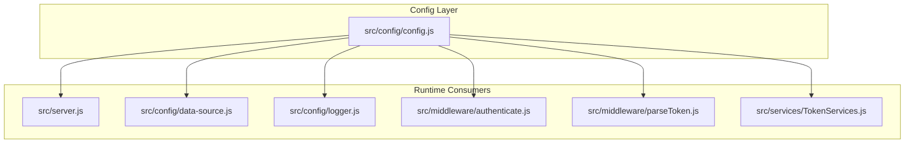
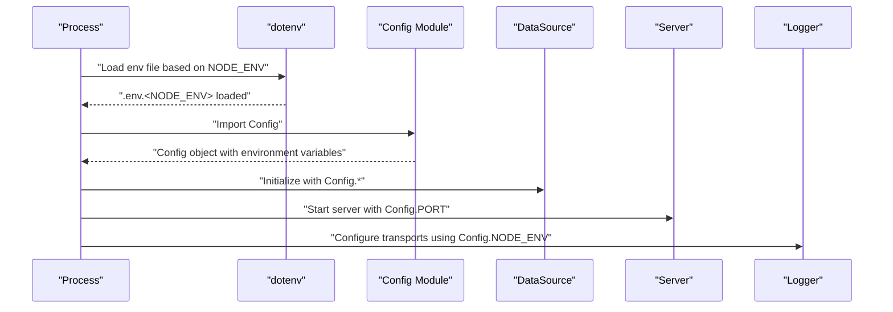
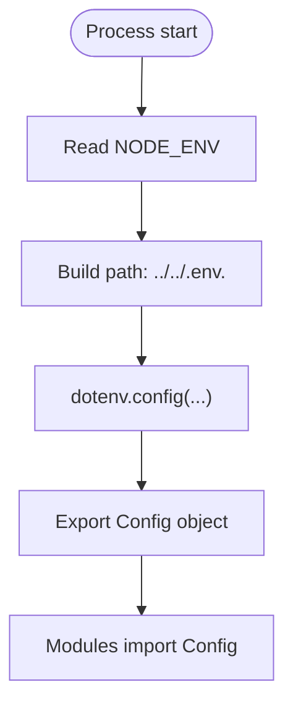
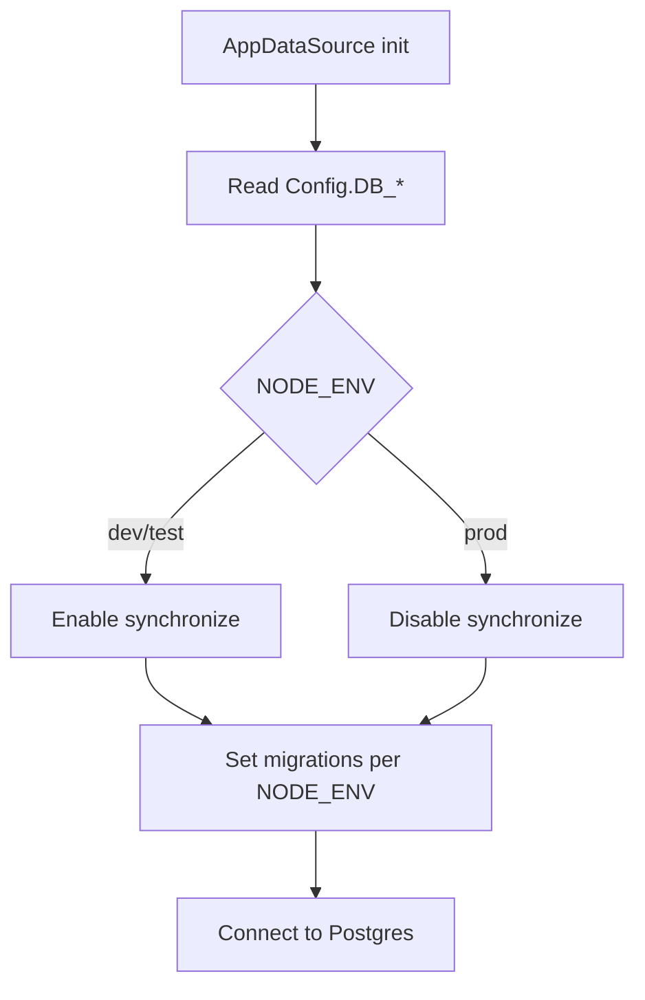
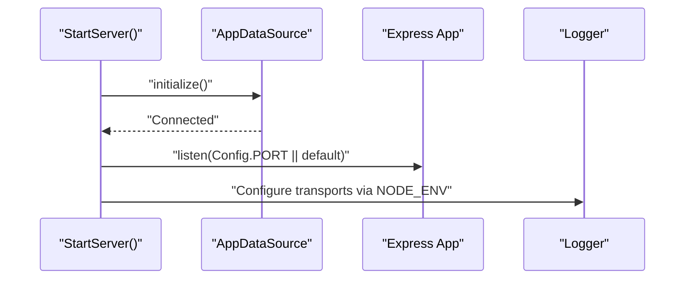
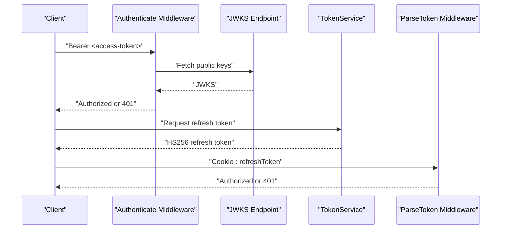
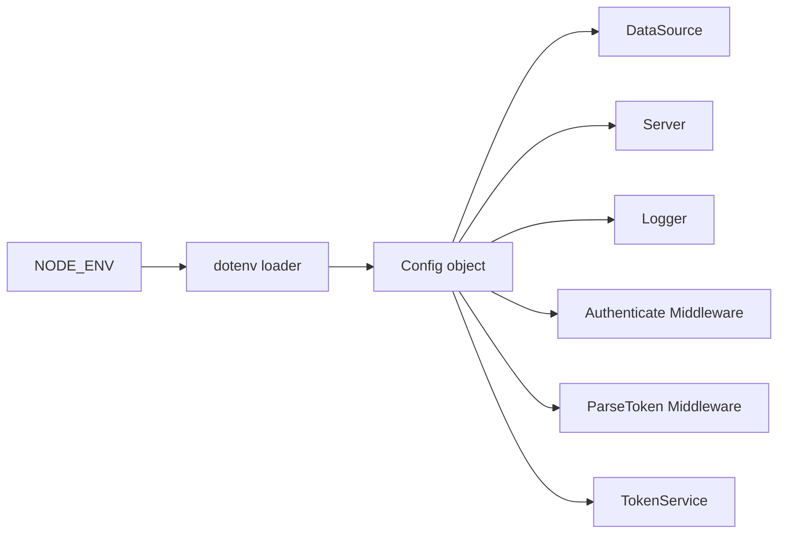

# Environment Variables

<cite>
**Referenced Files in This Document**
- [config.js](file://src/config/config.js)
- [data-source.js](file://src/config/data-source.js)
- [server.js](file://src/server.js)
- [logger.js](file://src/config/logger.js)
- [authenticate.js](file://src/middleware/authenticate.js)
- [parseToken.js](file://src/middleware/parseToken.js)
- [TokenServices.js](file://src/services/TokenServices.js)
- [package.json](file://package.json)
</cite>

## Table of Contents
1. [Introduction](#introduction)
2. [Project Structure](#project-structure)
3. [Core Components](#core-components)
4. [Architecture Overview](#architecture-overview)
5. [Detailed Component Analysis](#detailed-component-analysis)
6. [Dependency Analysis](#dependency-analysis)
7. [Performance Considerations](#performance-considerations)
8. [Troubleshooting Guide](#troubleshooting-guide)
9. [Conclusion](#conclusion)
10. [Appendices](#appendices)

## Introduction
This document explains how environment variables are configured and consumed in the authentication service. It covers the required variables, their roles, default handling, validation expectations, security considerations, and practical examples for development and production. It also documents the environment-specific loading mechanism using dotenv with NODE_ENV support and provides troubleshooting guidance for common configuration issues.

## Project Structure
The environment configuration is centralized in a single module that loads the appropriate .env file based on NODE_ENV and exposes a unified Config object. Other modules consume these values for database connectivity, server startup, logging behavior, and JWT signing/verification.

**Diagram sources**
- [config.js:1-34](file://src/config/config.js#L1-L34)
- [server.js:1-21](file://src/server.js#L1-L21)
- [data-source.js:1-22](file://src/config/data-source.js#L1-L22)
- [logger.js:1-42](file://src/config/logger.js#L1-L42)
- [authenticate.js:1-26](file://src/middleware/authenticate.js#L1-L26)
- [parseToken.js:1-14](file://src/middleware/parseToken.js#L1-L14)
- [TokenServices.js:1-60](file://src/services/TokenServices.js#L1-L60)

**Section sources**
- [config.js:1-34](file://src/config/config.js#L1-L34)
- [server.js:1-21](file://src/server.js#L1-L21)
- [data-source.js:1-22](file://src/config/data-source.js#L1-L22)
- [logger.js:1-42](file://src/config/logger.js#L1-L42)
- [authenticate.js:1-26](file://src/middleware/authenticate.js#L1-L26)
- [parseToken.js:1-14](file://src/middleware/parseToken.js#L1-L14)
- [TokenServices.js:1-60](file://src/services/TokenServices.js#L1-L60)

## Core Components
This section enumerates the environment variables used by the service and explains their purpose and impact.

- PORT
  - Purpose: TCP port on which the HTTP server listens.
  - Impact: Controls service availability and routing. If unset, the server falls back to a default port during startup.
  - Consumption: Used in server initialization to bind the listener.
  - Section sources
    - [server.js:11-14](file://src/server.js#L11-L14)

- DB_HOST
  - Purpose: Host address of the PostgreSQL database.
  - Impact: Determines where the TypeORM data source connects for persistence.
  - Consumption: Passed to the TypeORM DataSource configuration.
  - Section sources
    - [data-source.js:10-14](file://src/config/data-source.js#L10-L14)

- DB_PORT
  - Purpose: Port number of the PostgreSQL database.
  - Impact: Defines the network endpoint for database connections.
  - Consumption: Passed to the TypeORM DataSource configuration.
  - Section sources
    - [data-source.js:10-14](file://src/config/data-source.js#L10-L14)

- DB_NAME
  - Purpose: Name of the target PostgreSQL database.
  - Impact: Selects the logical database for all ORM operations.
  - Consumption: Passed to the TypeORM DataSource configuration.
  - Section sources
    - [data-source.js:10-14](file://src/config/data-source.js#L10-L14)

- DB_USERNAME
  - Purpose: Username for authenticating to the PostgreSQL database.
  - Impact: Controls access permissions and identity for database operations.
  - Consumption: Passed to the TypeORM DataSource configuration.
  - Section sources
    - [data-source.js:10-14](file://src/config/data-source.js#L10-L14)

- DB_PASSWORD
  - Purpose: Password for authenticating to the PostgreSQL database.
  - Impact: Enables or denies database connectivity.
  - Consumption: Passed to the TypeORM DataSource configuration.
  - Section sources
    - [data-source.js:10-14](file://src/config/data-source.js#L10-L14)

- PRIVATE_KEY_SECRET
  - Purpose: Secret used to sign refresh tokens with HMAC (HS256).
  - Impact: Ensures refresh token integrity and prevents tampering.
  - Consumption: Used by the token service for HS256 signing and by middleware to parse refresh tokens.
  - Section sources
    - [TokenServices.js:35-40](file://src/services/TokenServices.js#L35-L40)
    - [parseToken.js:5-5](file://src/middleware/parseToken.js#L5-L5)

- JWKS_URI
  - Purpose: URI of the JSON Web Key Set used to validate access tokens.
  - Impact: Enables runtime retrieval of public keys for RS256 signature verification.
  - Consumption: Used by the authentication middleware to configure key set retrieval.
  - Section sources
    - [authenticate.js:7-12](file://src/middleware/authenticate.js#L7-L12)

- NODE_ENV
  - Purpose: Environment discriminator controlling dotenv file selection and runtime behavior.
  - Impact: Selects the .env file suffix (.env.dev, .env.prod, etc.), influences migrations, synchronization, and logging behavior.
  - Consumption: Used to select the .env file and to adjust behavior in multiple modules.
  - Section sources
    - [config.js:7-9](file://src/config/config.js#L7-L9)
    - [data-source.js:16-19](file://src/config/data-source.js#L16-L19)
    - [logger.js:14-24](file://src/config/logger.js#L14-L24)

## Architecture Overview
The environment loading and consumption architecture is straightforward: dotenv loads variables from a file derived from NODE_ENV, and a central Config object exposes them to consumers.

**Diagram sources**
- [config.js:7-9](file://src/config/config.js#L7-L9)
- [data-source.js:8-21](file://src/config/data-source.js#L8-L21)
- [server.js:7-19](file://src/server.js#L7-L19)
- [logger.js:9-39](file://src/config/logger.js#L9-L39)

## Detailed Component Analysis
This section dives deeper into how environment variables are used across modules and highlights defaults, validations, and security considerations.

### Environment Loading Mechanism
- dotenv is configured to load a file named according to NODE_ENV. If NODE_ENV is unset, a default environment is implied by the loader logic.
- The Config object exports all required variables for downstream modules.

**Diagram sources**
- [config.js:7-9](file://src/config/config.js#L7-L9)

**Section sources**
- [config.js:1-34](file://src/config/config.js#L1-L34)

### Database Connectivity (TypeORM)
- The TypeORM DataSource reads DB_HOST, DB_PORT, DB_NAME, DB_USERNAME, and DB_PASSWORD from Config.
- Behavior differences:
  - synchronize is enabled for dev/test and disabled for prod-like environments.
  - migrations are conditionally included based on NODE_ENV.

**Diagram sources**
- [data-source.js:8-21](file://src/config/data-source.js#L8-L21)

**Section sources**
- [data-source.js:1-22](file://src/config/data-source.js#L1-L22)

### Server Startup and Logging
- Server startup uses Config.PORT with a fallback to a default port if unset.
- Logger transports are configured to be less verbose in prod by inspecting NODE_ENV.

**Diagram sources**
- [server.js:7-19](file://src/server.js#L7-L19)
- [logger.js:9-39](file://src/config/logger.js#L9-L39)

**Section sources**
- [server.js:1-21](file://src/server.js#L1-L21)
- [logger.js:1-42](file://src/config/logger.js#L1-L42)

### JWT Signing and Validation
- Access tokens are validated using JWKS from Config.JWKS_URI with RS256.
- Refresh tokens are signed with Config.PRIVATE_KEY_SECRET using HS256 and parsed by middleware using the same secret.

**Diagram sources**
- [authenticate.js:6-25](file://src/middleware/authenticate.js#L6-L25)
- [TokenServices.js:34-42](file://src/services/TokenServices.js#L34-L42)
- [parseToken.js:4-13](file://src/middleware/parseToken.js#L4-L13)

**Section sources**
- [authenticate.js:1-26](file://src/middleware/authenticate.js#L1-L26)
- [TokenServices.js:1-60](file://src/services/TokenServices.js#L1-L60)
- [parseToken.js:1-14](file://src/middleware/parseToken.js#L1-L14)

## Dependency Analysis
The following diagram shows how environment variables flow from the loader to consumers and how they influence runtime behavior.

**Diagram sources**
- [config.js:7-9](file://src/config/config.js#L7-L9)
- [data-source.js:8-21](file://src/config/data-source.js#L8-L21)
- [server.js:7-19](file://src/server.js#L7-L19)
- [logger.js:9-39](file://src/config/logger.js#L9-L39)
- [authenticate.js:6-25](file://src/middleware/authenticate.js#L6-L25)
- [parseToken.js:4-13](file://src/middleware/parseToken.js#L4-L13)
- [TokenServices.js:34-42](file://src/services/TokenServices.js#L34-L42)

**Section sources**
- [config.js:1-34](file://src/config/config.js#L1-L34)
- [data-source.js:1-22](file://src/config/data-source.js#L1-L22)
- [server.js:1-21](file://src/server.js#L1-L21)
- [logger.js:1-42](file://src/config/logger.js#L1-L42)
- [authenticate.js:1-26](file://src/middleware/authenticate.js#L1-L26)
- [parseToken.js:1-14](file://src/middleware/parseToken.js#L1-L14)
- [TokenServices.js:1-60](file://src/services/TokenServices.js#L1-L60)

## Performance Considerations
- Using NODE_ENV to toggle synchronize and migrations reduces unnecessary schema writes in production and improves startup performance.
- Logging transport silencing in prod reduces I/O overhead.
- Keeping JWKS caching enabled in the authentication middleware avoids repeated network calls to fetch keys.

## Troubleshooting Guide
Common issues and resolutions:

- Missing .env file for current NODE_ENV
  - Symptom: Variables appear undefined; server fails to connect to the database or fails to start.
  - Resolution: Ensure a .env file exists with the correct suffix (e.g., .env.dev, .env.prod) and that NODE_ENV matches the intended environment.
  - Section sources
    - [config.js:7-9](file://src/config/config.js#L7-L9)

- Database connection failures
  - Symptom: Server logs indicate inability to connect to PostgreSQL.
  - Resolution: Verify DB_HOST, DB_PORT, DB_NAME, DB_USERNAME, and DB_PASSWORD are present and correct. Confirm the database is reachable from the runtime environment.
  - Section sources
    - [data-source.js:10-14](file://src/config/data-source.js#L10-L14)

- Access token validation errors
  - Symptom: Requests fail with unauthorized responses due to token verification failures.
  - Resolution: Confirm JWKS_URI is correct and reachable. Ensure the token algorithm matches RS256 and that the token is not expired.
  - Section sources
    - [authenticate.js:6-12](file://src/middleware/authenticate.js#L6-L12)

- Refresh token parsing failures
  - Symptom: Refresh token parsing fails with invalid signature or algorithm mismatch.
  - Resolution: Ensure PRIVATE_KEY_SECRET matches the value used to sign refresh tokens. Verify the algorithm is HS256 and the token is unexpired.
  - Section sources
    - [TokenServices.js:34-40](file://src/services/TokenServices.js#L34-L40)
    - [parseToken.js:4-6](file://src/middleware/parseToken.js#L4-L6)

- Server not binding to expected port
  - Symptom: Application starts on a different port than expected.
  - Resolution: Set PORT explicitly. If unset, the server uses a default port during startup.
  - Section sources
    - [server.js:11-14](file://src/server.js#L11-L14)

- Excessive logging in production
  - Symptom: Logs flood the console or disk.
  - Resolution: Ensure NODE_ENV is set appropriately so that logger transports are silenced in production.
  - Section sources
    - [logger.js:14-24](file://src/config/logger.js#L14-L24)

## Conclusion
Environment variables are the backbone of configuration in this authentication service. The dotenv-based loader selects environment-specific files via NODE_ENV, and a central Config object exposes values consumed by the server, database, logging, and JWT components. Properly setting and securing these variables ensures reliable operation across development, testing, and production environments.

## Appendices

### Environment-Specific Loading Examples
- Development environment
  - Set NODE_ENV to select .env.dev.
  - Example scripts demonstrate setting NODE_ENV for development and tests.
  - Section sources
    - [package.json:8-13](file://package.json#L8-L13)

- Production environment
  - Set NODE_ENV to select .env.prod.
  - Ensure sensitive variables are injected securely (e.g., via deployment platform secrets).
  - Section sources
    - [config.js:7-9](file://src/config/config.js#L7-L9)

### Default Value Handling
- PORT: Falls back to a default port during server startup if unset.
- synchronize and migrations: Behavior is controlled by NODE_ENV; synchronize is enabled for dev/test and disabled for prod-like environments.
- Logging: Transports are configured to be less verbose in prod based on NODE_ENV.

**Section sources**
- [server.js:11-14](file://src/server.js#L11-L14)
- [data-source.js:16-19](file://src/config/data-source.js#L16-L19)
- [logger.js:14-24](file://src/config/logger.js#L14-L24)

### Security Considerations
- PRIVATE_KEY_SECRET and DB credentials must be kept secret and never committed to source control.
- Prefer injecting secrets via secure deployment mechanisms (e.g., environment injection, secret managers) rather than embedding in .env files.
- Ensure JWKS_URI points to a trusted, HTTPS endpoint and is accessible from the runtime environment.
- Limit exposure of logs in production by relying on NODE_ENV-driven transport silencing.