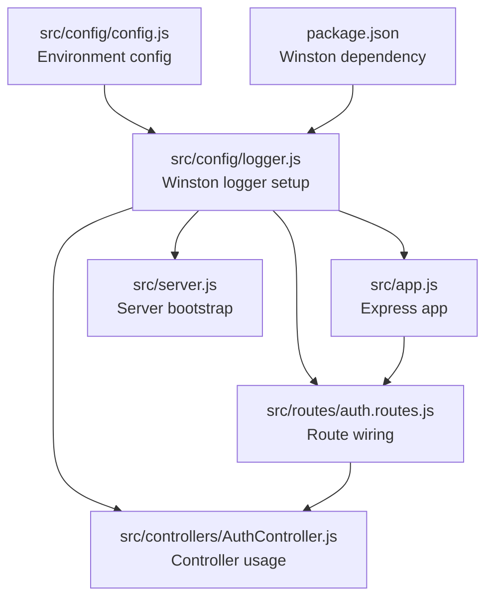
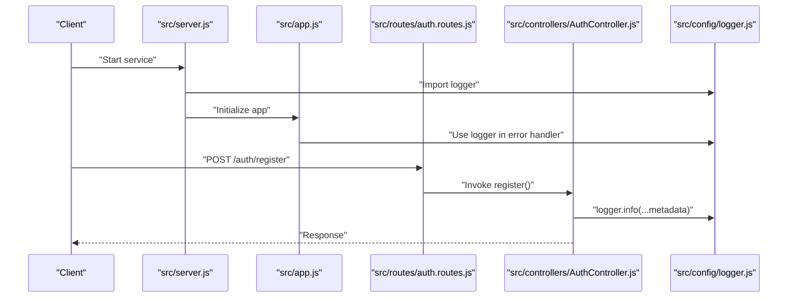
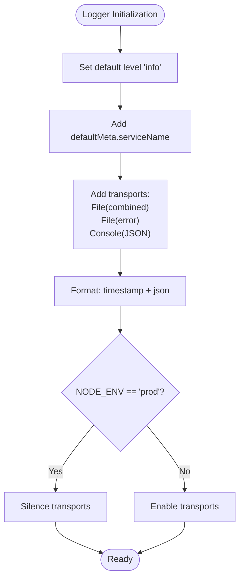
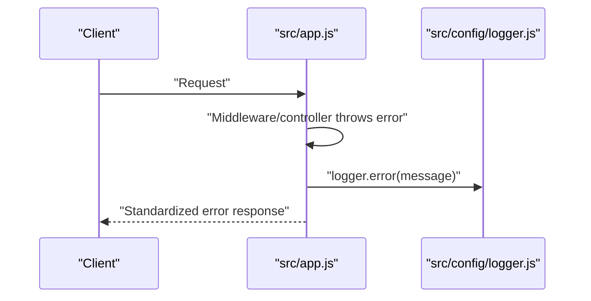
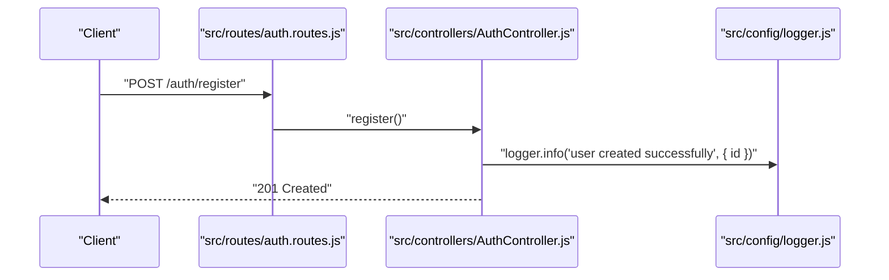
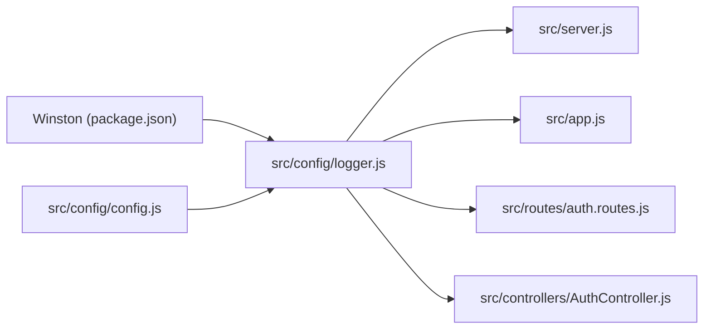

# Logging Configuration

<cite>
**Referenced Files in This Document**
- [logger.js](file://src/config/logger.js)
- [config.js](file://src/config/config.js)
- [app.js](file://src/app.js)
- [server.js](file://src/server.js)
- [auth.routes.js](file://src/routes/auth.routes.js)
- [AuthController.js](file://src/controllers/AuthController.js)
- [package.json](file://package.json)
</cite>

## Table of Contents
1. [Introduction](#introduction)
2. [Project Structure](#project-structure)
3. [Core Components](#core-components)
4. [Architecture Overview](#architecture-overview)
5. [Detailed Component Analysis](#detailed-component-analysis)
6. [Dependency Analysis](#dependency-analysis)
7. [Performance Considerations](#performance-considerations)
8. [Troubleshooting Guide](#troubleshooting-guide)
9. [Conclusion](#conclusion)
10. [Appendices](#appendices)

## Introduction
This document explains the Winston-based logging configuration used in the authentication service. It covers logger setup, transports, log levels, formatting, structured logging patterns, output destinations, and best practices for authentication-related events. It also provides guidance on extending the configuration for log rotation, retention, and integration with external logging systems and monitoring tools.

## Project Structure
The logging configuration is centralized in a dedicated module and consumed by the Express application and controllers. Environment-specific behavior is controlled via configuration.

**Diagram sources**
- [logger.js:1-42](file://src/config/logger.js#L1-L42)
- [config.js:1-34](file://src/config/config.js#L1-L34)
- [app.js:1-40](file://src/app.js#L1-L40)
- [server.js:1-21](file://src/server.js#L1-L21)
- [auth.routes.js:1-49](file://src/routes/auth.routes.js#L1-L49)
- [AuthController.js:1-212](file://src/controllers/AuthController.js#L1-L212)
- [package.json:1-48](file://package.json#L1-L48)

**Section sources**
- [logger.js:1-42](file://src/config/logger.js#L1-L42)
- [config.js:1-34](file://src/config/config.js#L1-L34)
- [app.js:1-40](file://src/app.js#L1-L40)
- [server.js:1-21](file://src/server.js#L1-L21)
- [auth.routes.js:1-49](file://src/routes/auth.routes.js#L1-L49)
- [AuthController.js:1-212](file://src/controllers/AuthController.js#L1-L212)
- [package.json:1-48](file://package.json#L1-L48)

## Core Components
- Winston logger configured with:
  - Default metadata including service name
  - File transports for combined and error logs
  - Console transport
  - JSON formatting with ISO-like timestamps
  - Environment-driven silence behavior

- Environment configuration:
  - Loads environment variables based on NODE_ENV
  - Controls whether transports are silenced in production

- Application integration:
  - Express error handler logs unhandled errors
  - Server startup logs connection and port binding
  - Controllers log successful authentication actions with contextual metadata

**Section sources**
- [logger.js:1-42](file://src/config/logger.js#L1-L42)
- [config.js:1-34](file://src/config/config.js#L1-L34)
- [app.js:24-37](file://src/app.js#L24-L37)
- [server.js:7-19](file://src/server.js#L7-L19)
- [AuthController.js:64-69](file://src/controllers/AuthController.js#L64-L69)
- [AuthController.js:130](file://src/controllers/AuthController.js#L130)
- [AuthController.js:164](file://src/controllers/AuthController.js#L164)
- [AuthController.js:198](file://src/controllers/AuthController.js#L198)

## Architecture Overview
The logger is a singleton created once and reused across the application. It is imported by the Express app, server bootstrap, route wiring, and controller classes.

**Diagram sources**
- [server.js:1-21](file://src/server.js#L1-L21)
- [app.js:1-40](file://src/app.js#L1-L40)
- [auth.routes.js:1-49](file://src/routes/auth.routes.js#L1-L49)
- [AuthController.js:19-70](file://src/controllers/AuthController.js#L19-L70)
- [logger.js:1-42](file://src/config/logger.js#L1-L42)

## Detailed Component Analysis

### Winston Logger Setup
- Level: default "info"
- Default metadata: service name
- Transports:
  - Combined file log at "logs/combined.log" with info level
  - Error file log at "logs/error.log" with error level
  - Console transport with JSON formatting and info level
- Formatting: timestamp plus JSON serialization
- Silence: transports are silenced when NODE_ENV equals "prod"

**Diagram sources**
- [logger.js:4-39](file://src/config/logger.js#L4-L39)
- [config.js:7-9](file://src/config/config.js#L7-L9)

**Section sources**
- [logger.js:1-42](file://src/config/logger.js#L1-L42)
- [config.js:1-34](file://src/config/config.js#L1-L34)

### Environment Configuration
- Loads environment variables from a file derived from NODE_ENV
- Exposes configuration values consumed by logger and other modules

**Section sources**
- [config.js:1-34](file://src/config/config.js#L1-L34)

### Express Error Handler Integration
- Logs error messages on unhandled exceptions
- Returns standardized error response

**Diagram sources**
- [app.js:24-37](file://src/app.js#L24-L37)
- [logger.js:1-42](file://src/config/logger.js#L1-L42)

**Section sources**
- [app.js:24-37](file://src/app.js#L24-L37)

### Server Bootstrap Logging
- Logs successful database connection
- Logs server port binding

**Section sources**
- [server.js:7-19](file://src/server.js#L7-L19)

### Controller Logging Patterns
- Successful registration: logs completion with contextual metadata
- Successful login: logs completion with user identifier
- Token refresh: logs refresh activity
- Logout: logs refresh token deletion

**Diagram sources**
- [auth.routes.js:29-31](file://src/routes/auth.routes.js#L29-L31)
- [AuthController.js:64](file://src/controllers/AuthController.js#L64)
- [logger.js:1-42](file://src/config/logger.js#L1-L42)

**Section sources**
- [AuthController.js:64-69](file://src/controllers/AuthController.js#L64-L69)
- [AuthController.js:130](file://src/controllers/AuthController.js#L130)
- [AuthController.js:164](file://src/controllers/AuthController.js#L164)
- [AuthController.js:198](file://src/controllers/AuthController.js#L198)

## Dependency Analysis
- Winston is declared as a runtime dependency
- Logger depends on environment configuration for silence behavior
- Logger is consumed by server, app, routes, and controllers

**Diagram sources**
- [package.json:30-46](file://package.json#L30-L46)
- [logger.js:1-42](file://src/config/logger.js#L1-L42)
- [config.js:1-34](file://src/config/config.js#L1-L34)
- [server.js:1-21](file://src/server.js#L1-L21)
- [app.js:1-40](file://src/app.js#L1-L40)
- [auth.routes.js:1-49](file://src/routes/auth.routes.js#L1-L49)
- [AuthController.js:1-212](file://src/controllers/AuthController.js#L1-L212)

**Section sources**
- [package.json:30-46](file://package.json#L30-L46)
- [logger.js:1-42](file://src/config/logger.js#L1-L42)
- [config.js:1-34](file://src/config/config.js#L1-L34)
- [server.js:1-21](file://src/server.js#L1-L21)
- [app.js:1-40](file://src/app.js#L1-L40)
- [auth.routes.js:1-49](file://src/routes/auth.routes.js#L1-L49)
- [AuthController.js:1-212](file://src/controllers/AuthController.js#L1-L212)

## Performance Considerations
- JSON formatting and timestamps add minimal overhead but improve parsing and correlation.
- Console transport is silenced in production to reduce I/O overhead and avoid mixing stdout with logs.
- File transports write to a dedicated logs directory; ensure disk I/O is monitored in containerized environments.
- Consider rotating logs to prevent disk growth and enable retention policies.

[No sources needed since this section provides general guidance]

## Troubleshooting Guide
- Verify environment variables are loaded correctly so transports are not silently disabled unintentionally.
- Confirm the logs directory exists or is writable in production environments.
- Check that error handler is invoked by ensuring uncaught exceptions reach the Express error middleware.
- Validate that controller methods pass contextual metadata to aid debugging.

**Section sources**
- [config.js:7-9](file://src/config/config.js#L7-L9)
- [app.js:24-37](file://src/app.js#L24-L37)

## Conclusion
The Winston logger is configured centrally with environment-aware silence behavior, JSON formatting, and dual-file/console outputs. It is integrated at the server bootstrap, Express error handler, and controller layers to capture lifecycle events and authentication actions. Extending the configuration to support rotation and retention, and integrating with external systems, will further strengthen observability.

[No sources needed since this section summarizes without analyzing specific files]

## Appendices

### Log Levels and Usage Guidance
- error: failures and exceptions surfaced to the error handler
- info: successful lifecycle and operational events (e.g., server start, DB connect, successful auth actions)
- warn/verbose/debug/silly: not configured in current setup; can be introduced selectively for diagnostics if needed

Usage examples (conceptual):
- Use info for successful registration, login, token refresh, and logout activities with contextual metadata.
- Use error for thrown exceptions and validation failures handled by the error middleware.

**Section sources**
- [app.js:24-37](file://src/app.js#L24-L37)
- [AuthController.js:64-69](file://src/controllers/AuthController.js#L64-L69)
- [AuthController.js:130](file://src/controllers/AuthController.js#L130)
- [AuthController.js:164](file://src/controllers/AuthController.js#L164)
- [AuthController.js:198](file://src/controllers/AuthController.js#L198)

### Structured Logging Patterns
- Include identifiers (e.g., user id) and operation names in log messages.
- Keep messages concise; put variable data into metadata to preserve JSON structure.

Example pattern references:
- Successful registration with metadata: [AuthController.js:64](file://src/controllers/AuthController.js#L64)
- Successful login with metadata: [AuthController.js:130](file://src/controllers/AuthController.js#L130)
- Token refresh activity: [AuthController.js:164](file://src/controllers/AuthController.js#L164)
- Logout activity: [AuthController.js:198](file://src/controllers/AuthController.js#L198)

**Section sources**
- [AuthController.js:64-69](file://src/controllers/AuthController.js#L64-L69)
- [AuthController.js:130](file://src/controllers/AuthController.js#L130)
- [AuthController.js:164](file://src/controllers/AuthController.js#L164)
- [AuthController.js:198](file://src/controllers/AuthController.js#L198)

### Log Destinations
- File logging:
  - Combined log: "logs/combined.log" (info and above)
  - Error log: "logs/error.log" (error and above)
- Console logging: JSON-formatted output (info and above)

Silence behavior:
- Transports are silenced when NODE_ENV equals "prod"

**Section sources**
- [logger.js:10-37](file://src/config/logger.js#L10-L37)
- [config.js:7-9](file://src/config/config.js#L7-L9)

### Extensibility: Rotation, Retention, and Monitoring
- Rotation: Integrate a rotating file transport to manage file sizes and number of backups.
- Retention: Configure retention policies at the transport level or via external log collectors.
- Monitoring: Ship logs to centralized systems (e.g., ELK stack, cloud logging) using Winston transports or sidecar collectors.

[No sources needed since this section provides general guidance]