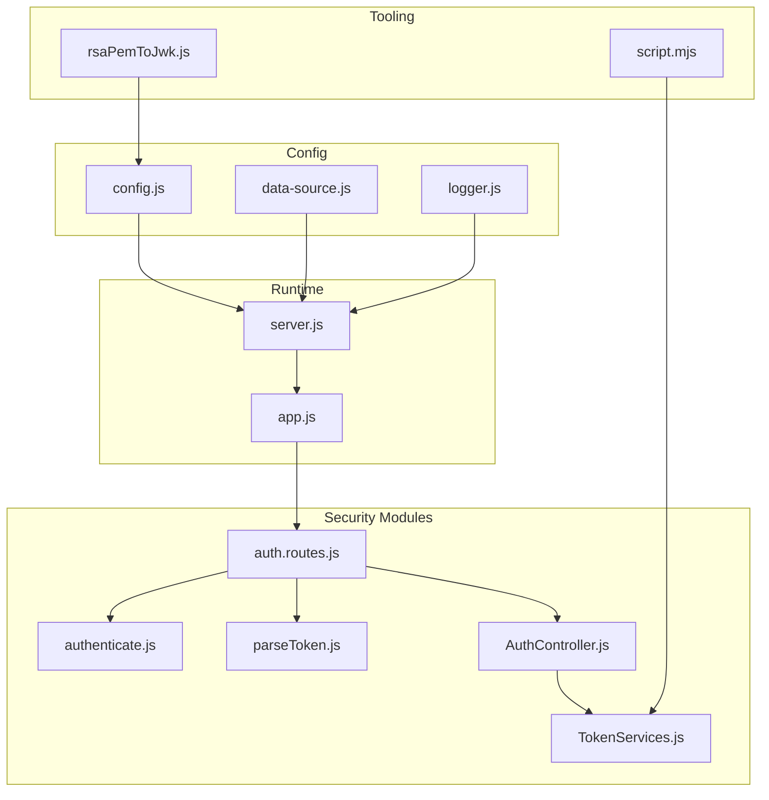
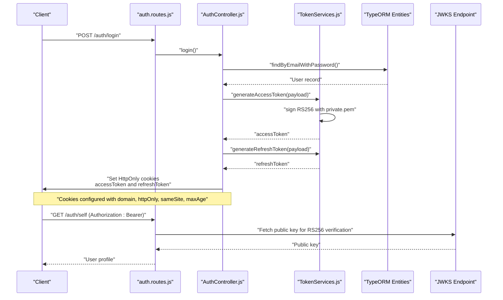
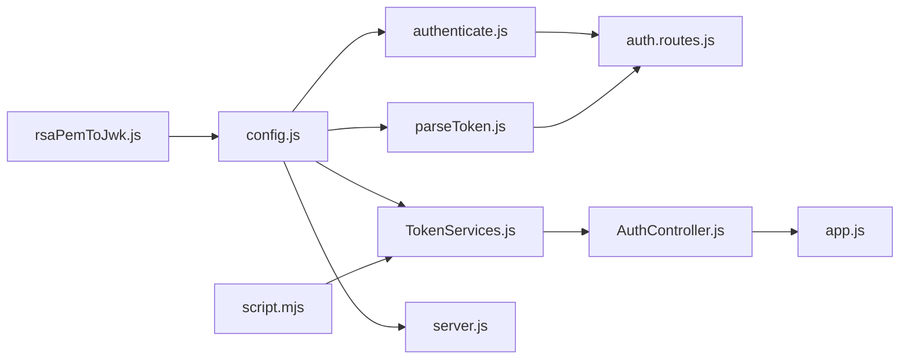

# Security Configuration

<cite>
**Referenced Files in This Document**
- [config.js](file://src/config/config.js)
- [data-source.js](file://src/config/data-source.js)
- [logger.js](file://src/config/logger.js)
- [server.js](file://src/server.js)
- [app.js](file://src/app.js)
- [TokenServices.js](file://src/services/TokenServices.js)
- [authenticate.js](file://src/middleware/authenticate.js)
- [parseToken.js](file://src/middleware/parseToken.js)
- [AuthController.js](file://src/controllers/AuthController.js)
- [auth.routes.js](file://src/routes/auth.routes.js)
- [rsaPemToJwk.js](file://script/rsaPemToJwk.js)
- [script.mjs](file://script/script.mjs)
- [package.json](file://package.json)
</cite>

## Table of Contents
1. [Introduction](#introduction)
2. [Project Structure](#project-structure)
3. [Core Components](#core-components)
4. [Architecture Overview](#architecture-overview)
5. [Detailed Component Analysis](#detailed-component-analysis)
6. [Dependency Analysis](#dependency-analysis)
7. [Performance Considerations](#performance-considerations)
8. [Troubleshooting Guide](#troubleshooting-guide)
9. [Conclusion](#conclusion)
10. [Appendices](#appendices)

## Introduction
This document provides comprehensive security configuration guidance for the authentication service. It focuses on JWT configuration (algorithm selection, token expiration, private key management), JWKS URI usage for verification and key rotation, cookie security settings, CORS considerations, HTTPS requirements, certificate management, security headers, secret management, key rotation procedures, and production best practices. The content is derived from the repository’s configuration and implementation files.

## Project Structure
Security-related configuration spans configuration loading, middleware for JWT validation, token generation services, controller cookie handling, and supporting scripts for key generation and JWK export.

**Diagram sources**
- [config.js:1-34](file://src/config/config.js#L1-L34)
- [data-source.js:1-22](file://src/config/data-source.js#L1-L22)
- [logger.js:1-42](file://src/config/logger.js#L1-L42)
- [server.js:1-21](file://src/server.js#L1-L21)
- [app.js:1-40](file://src/app.js#L1-L40)
- [authenticate.js:1-26](file://src/middleware/authenticate.js#L1-L26)
- [parseToken.js:1-14](file://src/middleware/parseToken.js#L1-L14)
- [TokenServices.js:1-60](file://src/services/TokenServices.js#L1-L60)
- [AuthController.js:1-212](file://src/controllers/AuthController.js#L1-L212)
- [auth.routes.js:1-49](file://src/routes/auth.routes.js#L1-L49)
- [script.mjs:1-30](file://script/script.mjs#L1-L30)
- [rsaPemToJwk.js:1-8](file://script/rsaPemToJwk.js#L1-L8)

**Section sources**
- [config.js:1-34](file://src/config/config.js#L1-L34)
- [server.js:1-21](file://src/server.js#L1-L21)
- [app.js:1-40](file://src/app.js#L1-L40)

## Core Components
- Environment configuration and secrets exposure via a central configuration module.
- JWT middleware using RS256 with JWKS-based verification for access tokens.
- HS256-based refresh tokens signed with a shared secret.
- Cookie creation with HttpOnly and SameSite strictness; domain and Secure flags require environment awareness.
- Token generation services for access and refresh tokens with explicit expiration policies.
- Scripts for RSA keypair generation and exporting public keys as JWKs for JWKS publishing.

**Section sources**
- [config.js:11-33](file://src/config/config.js#L11-L33)
- [authenticate.js:6-25](file://src/middleware/authenticate.js#L6-L25)
- [TokenServices.js:12-43](file://src/services/TokenServices.js#L12-L43)
- [AuthController.js:50-62](file://src/controllers/AuthController.js#L50-L62)
- [AuthController.js:116-128](file://src/controllers/AuthController.js#L116-L128)
- [AuthController.js:172-184](file://src/controllers/AuthController.js#L172-L184)
- [parseToken.js:4-11](file://src/middleware/parseToken.js#L4-L11)
- [rsaPemToJwk.js:1-8](file://script/rsaPemToJwk.js#L1-L8)
- [script.mjs:12-29](file://script/script.mjs#L12-L29)

## Architecture Overview
The authentication flow integrates environment-driven configuration, middleware-based JWT validation, token generation services, and controller-managed cookies. Access tokens are validated via JWKS URIs with RS256, while refresh tokens use HS256 with a shared secret.

**Diagram sources**
- [auth.routes.js:29-46](file://src/routes/auth.routes.js#L29-L46)
- [AuthController.js:72-136](file://src/controllers/AuthController.js#L72-L136)
- [TokenServices.js:12-43](file://src/services/TokenServices.js#L12-L43)
- [authenticate.js:6-25](file://src/middleware/authenticate.js#L6-L25)

## Detailed Component Analysis

### JWT Configuration (RS256, Expiration, Private Key)
- Algorithm selection: Access tokens use RS256 for signature verification.
- Token expiration:
  - Access tokens expire in 1 hour.
  - Refresh tokens expire in 7 days.
- Private key management:
  - Access tokens are signed using a private key loaded from a PEM file.
  - Refresh tokens are signed using a shared secret from environment configuration.
- Issuer: Both token types include an issuer claim.

Recommendations:
- Store the private key securely and restrict filesystem access.
- Rotate the RSA keypair periodically and publish the new public key via JWKS.
- Keep the refresh token secret secret; rotate it regularly and invalidate on logout.

**Section sources**
- [authenticate.js:12](file://src/middleware/authenticate.js#L12)
- [TokenServices.js:25-29](file://src/services/TokenServices.js#L25-L29)
- [TokenServices.js:35-40](file://src/services/TokenServices.js#L35-L40)
- [TokenServices.js:17-23](file://src/services/TokenServices.js#L17-L23)
- [config.js:19](file://src/config/config.js#L19)

### JWKS URI Configuration and Key Rotation
- Verification: Access tokens are verified using RS256 against a JWKS endpoint.
- Caching and rate limiting: JWKS caching and rate limiting are enabled in middleware.
- Publishing keys: Export the RSA public key as a JWK for the JWKS endpoint.

Implementation notes:
- Ensure the JWKS URI points to a reachable and protected endpoint.
- Rotate keys by generating a new RSA keypair and updating the JWKS with the new public key.
- Maintain backward compatibility during transitions by serving multiple keys temporarily.

**Section sources**
- [authenticate.js:7-11](file://src/middleware/authenticate.js#L7-L11)
- [rsaPemToJwk.js:4-7](file://script/rsaPemToJwk.js#L4-L7)
- [script.mjs:12-29](file://script/script.mjs#L12-L29)

### Cookie Security Settings
Current configuration:
- HttpOnly: Enabled for both access and refresh tokens.
- SameSite: Strict for both tokens.
- Domain: Fixed to localhost in controller cookie settings.
- Secure: Not set; requires environment awareness.
- Max-Age: Access token 1 hour; Refresh token 7 days.

Recommendations:
- Make domain, Secure, and SameSite configurable per environment.
- Enable Secure flag in production behind HTTPS.
- Consider partitioned cookies for cross-site contexts if applicable.
- Align SameSite with your frontend deployment strategy.

**Section sources**
- [AuthController.js:50-62](file://src/controllers/AuthController.js#L50-L62)
- [AuthController.js:116-128](file://src/controllers/AuthController.js#L116-L128)
- [AuthController.js:172-184](file://src/controllers/AuthController.js#L172-L184)

### CORS Configuration and Allowed Origins
- The application does not explicitly configure CORS.
- Frontend origin must be allowed if the client is hosted elsewhere.
- Without CORS, cross-origin requests may fail.

Recommendations:
- Add a CORS middleware with allowed origins, credentials support, and exposed headers as needed.
- Lock down allowed origins to trusted domains only.

[No sources needed since this section provides general guidance]

### HTTPS Configuration and Certificate Management
- The server listens over plaintext HTTP.
- HTTPS termination should occur at a reverse proxy/load balancer in production.
- Certificates should be managed by a trusted CA and rotated per policy.

Recommendations:
- Configure TLS termination upstream and enforce HTTPS redirects.
- Use strong ciphers and protocols; disable legacy protocols.
- Automate certificate renewal and monitor expiry.

[No sources needed since this section provides general guidance]

### Security Headers and Vulnerability Protection
- No explicit security headers are set in the application.
- Common protections to consider:
  - Content-Security-Policy, X-Frame-Options, X-Content-Type-Options, Referrer-Policy, Permissions-Policy.
  - Rate limiting and DDoS mitigation at the gateway.
  - Sanitization and validation for all inputs.

[No sources needed since this section provides general guidance]

### Secret Management and Key Rotation Procedures
- Secrets:
  - PRIVATE_KEY_SECRET is used for HS256 refresh tokens.
  - JWKS_URI is used for access token verification.
- Key rotation:
  - Generate new RSA keypair and update the JWKS endpoint.
  - Update private.pem and restart services after deploying the new public key.
  - Invalidate or refresh tokens during rollout to minimize overlap.

Best practices:
- Store secrets in environment variables or a secret manager.
- Limit access to private keys and secrets.
- Audit and rotate secrets periodically.

**Section sources**
- [config.js:19-20](file://src/config/config.js#L19-L20)
- [TokenServices.js:35](file://src/services/TokenServices.js#L35)
- [script.mjs:12-29](file://script/script.mjs#L12-L29)
- [rsaPemToJwk.js:4-7](file://script/rsaPemToJwk.js#L4-L7)

### Security Validation Patterns and Threat Mitigation
- Token validation:
  - Access tokens validated via JWKS with RS256.
  - Refresh tokens validated via HS256 with shared secret.
- Refresh flow:
  - On refresh, a new refresh token is issued and the old one is deleted (rotation).
- Role-based access control:
  - Middleware enforces allowed roles for protected routes.

Mitigations:
- Enforce short-lived access tokens and long-lived but revocable refresh tokens.
- Persist refresh tokens and maintain a revocation model.
- Use strict SameSite and HttpOnly cookies.
- Validate and sanitize all inputs.

**Section sources**
- [authenticate.js:6-25](file://src/middleware/authenticate.js#L6-L25)
- [parseToken.js:4-11](file://src/middleware/parseToken.js#L4-L11)
- [AuthController.js:143-192](file://src/controllers/AuthController.js#L143-L192)
- [canAccess.js:4-22](file://src/middleware/canAccess.js#L4-L22)

## Dependency Analysis
The security stack depends on environment configuration, middleware for JWT validation, token services for signing, and controller cookie handling. Scripts support key generation and JWK export.

**Diagram sources**
- [config.js:11-33](file://src/config/config.js#L11-L33)
- [authenticate.js:1-26](file://src/middleware/authenticate.js#L1-L26)
- [parseToken.js:1-14](file://src/middleware/parseToken.js#L1-L14)
- [TokenServices.js:1-60](file://src/services/TokenServices.js#L1-L60)
- [AuthController.js:1-212](file://src/controllers/AuthController.js#L1-L212)
- [auth.routes.js:1-49](file://src/routes/auth.routes.js#L1-L49)
- [server.js:1-21](file://src/server.js#L1-L21)
- [app.js:1-40](file://src/app.js#L1-L40)
- [script.mjs:1-30](file://script/script.mjs#L1-L30)
- [rsaPemToJwk.js:1-8](file://script/rsaPemToJwk.js#L1-L8)

**Section sources**
- [package.json:30-47](file://package.json#L30-L47)

## Performance Considerations
- JWKS caching reduces network overhead for key fetching.
- Short-lived access tokens reduce validation window and improve security.
- Persisted refresh tokens enable efficient revocation and auditability.

[No sources needed since this section provides general guidance]

## Troubleshooting Guide
- Access token validation fails:
  - Verify JWKS URI and that the public key matches the private key used for signing.
  - Confirm algorithm alignment (RS256) and that the token is not expired.
- Refresh token validation fails:
  - Ensure PRIVATE_KEY_SECRET matches the value used during signing.
  - Confirm token audience/issuer claims and expiration.
- Cookie issues:
  - Check domain, Secure, and SameSite settings for your environment.
  - Confirm HttpOnly is enabled to mitigate XSS risks.
- Logging:
  - Review logs for error messages emitted by the error handler middleware.

**Section sources**
- [logger.js:24-37](file://src/config/logger.js#L24-L37)
- [app.js:24-37](file://src/app.js#L24-L37)

## Conclusion
The authentication service implements RS256-signed access tokens with JWKS-based verification and HS256-signed refresh tokens with a shared secret. Security can be strengthened by enabling HTTPS, adding CORS and security headers, hardening cookie settings for production, and implementing robust secret and key management with rotation procedures. The included scripts facilitate key generation and JWK export to support JWKS publishing.

[No sources needed since this section summarizes without analyzing specific files]

## Appendices

### Appendix A: Environment Variables and Secrets
- PRIVATE_KEY_SECRET: Used for HS256 refresh token signing.
- JWKS_URI: Used by the access token middleware for RS256 verification.
- Other runtime variables: PORT, DB_* for database connectivity.

**Section sources**
- [config.js:19-20](file://src/config/config.js#L19-L20)
- [config.js:11-21](file://src/config/config.js#L11-L21)

### Appendix B: Token Lifetimes and Claims
- Access tokens:
  - Algorithm: RS256
  - Expiration: 1 hour
  - Issuer: auth-service
- Refresh tokens:
  - Algorithm: HS256
  - Expiration: 7 days
  - Issuer: auth-service
  - Unique token ID used for persistence and revocation.

**Section sources**
- [TokenServices.js:25-29](file://src/services/TokenServices.js#L25-L29)
- [TokenServices.js:35-40](file://src/services/TokenServices.js#L35-L40)

### Appendix C: Cookie Settings Reference
- Access token cookie:
  - HttpOnly: true
  - SameSite: strict
  - Max-Age: 1 hour
  - Domain: localhost
- Refresh token cookie:
  - HttpOnly: true
  - SameSite: strict
  - Max-Age: 7 days
  - Domain: localhost

Recommendation:
- Make domain, Secure, and SameSite environment-aware for production.

**Section sources**
- [AuthController.js:50-62](file://src/controllers/AuthController.js#L50-L62)
- [AuthController.js:116-128](file://src/controllers/AuthController.js#L116-L128)
- [AuthController.js:172-184](file://src/controllers/AuthController.js#L172-L184)