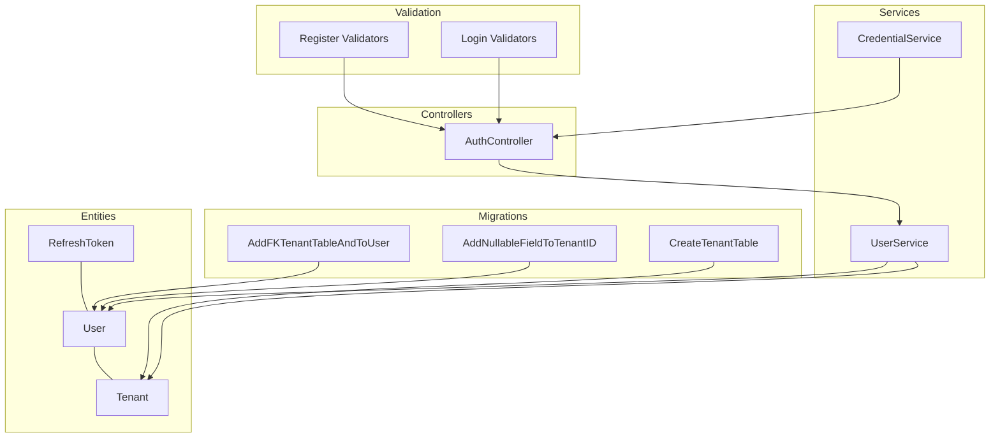
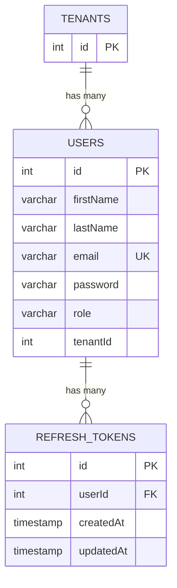
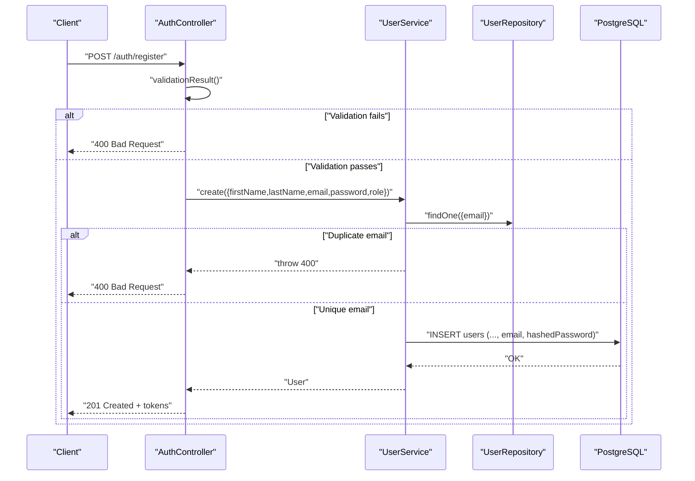
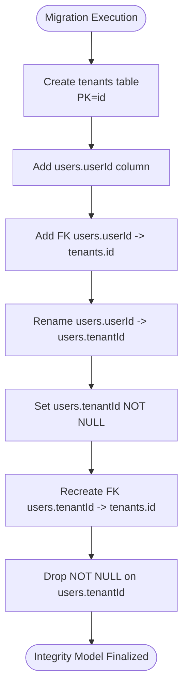
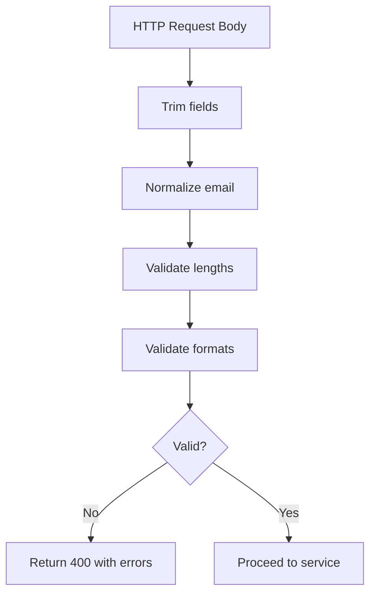
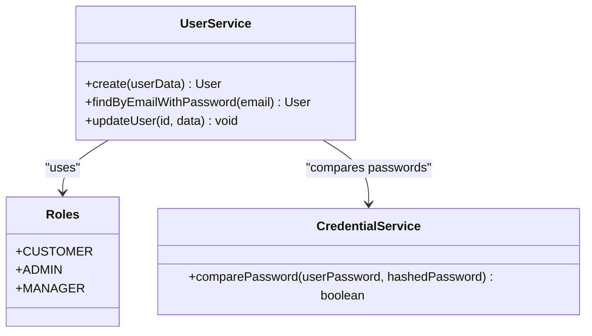
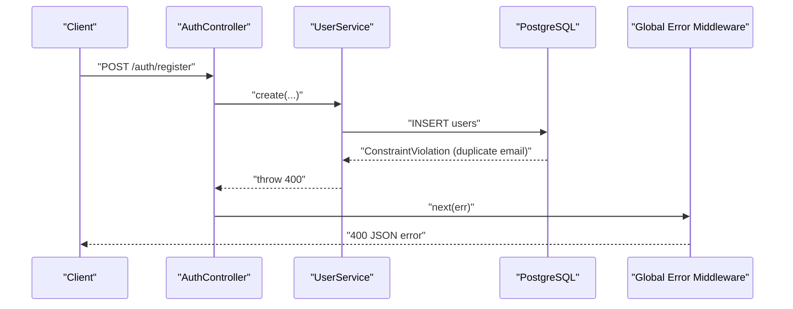
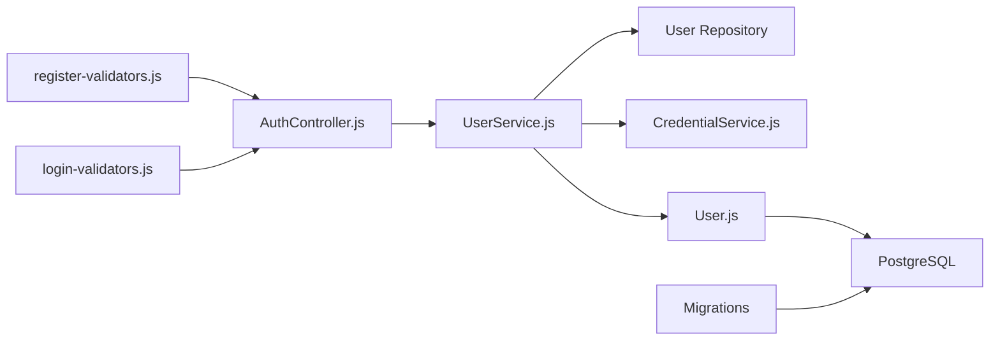

# Data Integrity Constraints

<cite>
**Referenced Files in This Document**
- [User.js](file://src/entity/User.js)
- [Tenants.js](file://src/entity/Tenants.js)
- [RefreshToken.js](file://src/entity/RefreshToken.js)
- [1773678089909-create_tenant_table.js](file://src/migration/1773678089909-create_tenant_table.js)
- [1773678973384-add_FK_tenant_table_and_to_user_table.js](file://src/migration/1773678973384-add_FK_tenant_table_and_to_user_table.js)
- [1773681570855-add_nullable_field_to_tenantID.js](file://src/migration/1773681570855-add_nullable_field_to_tenantID.js)
- [register-validators.js](file://src/validators/register-validators.js)
- [login-validators.js](file://src/validators/login-validators.js)
- [UserService.js](file://src/services/UserService.js)
- [CredentialService.js](file://src/services/CredentialService.js)
- [AuthController.js](file://src/controllers/AuthController.js)
- [data-source.js](file://src/config/data-source.js)
- [index.js](file://src/constants/index.js)
- [register.spec.js](file://src/test/users/register.spec.js)
- [create.spec.js](file://src/test/users/create.spec.js)
- [app.js](file://src/app.js)
</cite>

## Table of Contents
1. [Introduction](#introduction)
2. [Project Structure](#project-structure)
3. [Core Components](#core-components)
4. [Architecture Overview](#architecture-overview)
5. [Detailed Component Analysis](#detailed-component-analysis)
6. [Dependency Analysis](#dependency-analysis)
7. [Performance Considerations](#performance-considerations)
8. [Troubleshooting Guide](#troubleshooting-guide)
9. [Conclusion](#conclusion)

## Introduction
This document details the data integrity constraints and validation rules implemented in the authentication service database. It covers unique constraints for email addresses, auto-incrementing primary keys, nullable field configurations, and business rule enforcement such as role validation, tenant ID constraints, and password security requirements. It also explains database-level validation via migrations, foreign key constraints, and referential integrity maintenance. Finally, it documents validation patterns, input sanitization strategies, error handling for constraint violations, consistency checks, transaction management, and recovery procedures for integrity violations.

## Project Structure
The authentication service organizes integrity-related logic across entities, migrations, validators, services, controllers, and tests:
- Entities define column types, uniqueness, nullability, and relations.
- Migrations enforce database-level constraints and referential integrity.
- Validators apply input sanitization and length/email/format checks.
- Services encapsulate business logic and handle constraint violation scenarios.
- Controllers orchestrate validation and error propagation.
- Tests verify constraints and error handling.

**Diagram sources**
- [User.js:1-50](file://src/entity/User.js#L1-L50)
- [Tenants.js:1-29](file://src/entity/Tenants.js#L1-L29)
- [RefreshToken.js:1-35](file://src/entity/RefreshToken.js#L1-L35)
- [1773678089909-create_tenant_table.js:1-31](file://src/migration/1773678089909-create_tenant_table.js#L1-L31)
- [1773678973384-add_FK_tenant_table_and_to_user_table.js:1-39](file://src/migration/1773678973384-add_FK_tenant_table_and_to_user_table.js#L1-L39)
- [1773681570855-add_nullable_field_to_tenantID.js:1-31](file://src/migration/1773681570855-add_nullable_field_to_tenantID.js#L1-L31)
- [register-validators.js:1-47](file://src/validators/register-validators.js#L1-L47)
- [login-validators.js:1-25](file://src/validators/login-validators.js#L1-L25)
- [UserService.js:1-99](file://src/services/UserService.js#L1-L99)
- [CredentialService.js:1-7](file://src/services/CredentialService.js#L1-L7)
- [AuthController.js:1-212](file://src/controllers/AuthController.js#L1-L212)

**Section sources**
- [User.js:1-50](file://src/entity/User.js#L1-L50)
- [Tenants.js:1-29](file://src/entity/Tenants.js#L1-L29)
- [RefreshToken.js:1-35](file://src/entity/RefreshToken.js#L1-L35)
- [1773678089909-create_tenant_table.js:1-31](file://src/migration/1773678089909-create_tenant_table.js#L1-L31)
- [1773678973384-add_FK_tenant_table_and_to_user_table.js:1-39](file://src/migration/1773678973384-add_FK_tenant_table_and_to_user_table.js#L1-L39)
- [1773681570855-add_nullable_field_to_tenantID.js:1-31](file://src/migration/1773681570855-add_nullable_field_to_tenantID.js#L1-L31)
- [register-validators.js:1-47](file://src/validators/register-validators.js#L1-L47)
- [login-validators.js:1-25](file://src/validators/login-validators.js#L1-L25)
- [UserService.js:1-99](file://src/services/UserService.js#L1-L99)
- [CredentialService.js:1-7](file://src/services/CredentialService.js#L1-L7)
- [AuthController.js:1-212](file://src/controllers/AuthController.js#L1-L212)

## Core Components
- Unique constraints
  - Email uniqueness enforced at both entity and database level.
  - Primary keys are auto-incrementing integers.
- Nullable fields
  - tenantId is nullable in the entity and was made nullable in a later migration.
- Business rule enforcement
  - Role values are constrained to predefined constants.
  - Passwords are hashed before storage.
  - Tenant relationship is optional but enforced via foreign key when present.
- Validation pipeline
  - Express validators sanitize and enforce input rules.
  - Service-level checks prevent duplicate emails.
- Error handling
  - Controlled error propagation with appropriate HTTP status codes.

**Section sources**
- [User.js:19-33](file://src/entity/User.js#L19-L33)
- [index.js:1-6](file://src/constants/index.js#L1-L6)
- [register-validators.js:26-46](file://src/validators/register-validators.js#L26-L46)
- [login-validators.js:4-24](file://src/validators/login-validators.js#L4-L24)
- [UserService.js:7-38](file://src/services/UserService.js#L7-L38)

## Architecture Overview
The integrity model spans entity definitions, migrations, and runtime validation:

**Diagram sources**
- [User.js:3-49](file://src/entity/User.js#L3-L49)
- [Tenants.js:3-28](file://src/entity/Tenants.js#L3-L28)
- [RefreshToken.js:3-34](file://src/entity/RefreshToken.js#L3-L34)

**Section sources**
- [User.js:3-49](file://src/entity/User.js#L3-L49)
- [Tenants.js:3-28](file://src/entity/Tenants.js#L3-L28)
- [RefreshToken.js:3-34](file://src/entity/RefreshToken.js#L3-L34)

## Detailed Component Analysis

### Database Schema and Constraints
- Users table
  - id: auto-incrementing primary key.
  - email: unique and not null.
  - password: stored hashed; select disabled to avoid accidental exposure.
  - role: free-text string; business rules constrain acceptable values.
  - tenantId: integer; nullable per migration history.
- Tenants table
  - id: auto-incrementing primary key.
- RefreshTokens table
  - id: auto-incrementing primary key.
  - userId: foreign key to users.id.
  - createdAt/updatedAt: timestamps managed by ORM.

**Diagram sources**
- [AuthController.js:19-70](file://src/controllers/AuthController.js#L19-L70)
- [UserService.js:7-38](file://src/services/UserService.js#L7-L38)
- [register-validators.js:1-47](file://src/validators/register-validators.js#L1-L47)

**Section sources**
- [User.js:7-33](file://src/entity/User.js#L7-L33)
- [RefreshToken.js:7-26](file://src/entity/RefreshToken.js#L7-L26)
- [1773678089909-create_tenant_table.js:16-20](file://src/migration/1773678089909-create_tenant_table.js#L16-L20)
- [1773678973384-add_FK_tenant_table_and_to_user_table.js:16-23](file://src/migration/1773678973384-add_FK_tenant_table_and_to_user_table.js#L16-L23)
- [1773681570855-add_nullable_field_to_tenantID.js:16-19](file://src/migration/1773681570855-add_nullable_field_to_tenantID.js#L16-L19)

### Foreign Keys and Referential Integrity
- Initial tenant table creation adds a userId column to users and a foreign key to tenants.
- Subsequent migration renames userId to tenantId, sets tenantId to NOT NULL, and redefines FK to tenants(id).
- Later migration drops NOT NULL on tenantId to allow optional tenant association.
- Refresh tokens maintain referential integrity to users via userId.

**Diagram sources**
- [1773678089909-create_tenant_table.js:16-20](file://src/migration/1773678089909-create_tenant_table.js#L16-L20)
- [1773678973384-add_FK_tenant_table_and_to_user_table.js:16-36](file://src/migration/1773678973384-add_FK_tenant_table_and_to_user_table.js#L16-L36)
- [1773681570855-add_nullable_field_to_tenantID.js:16-29](file://src/migration/1773681570855-add_nullable_field_to_tenantID.js#L16-L29)

**Section sources**
- [1773678089909-create_tenant_table.js:16-20](file://src/migration/1773678089909-create_tenant_table.js#L16-L20)
- [1773678973384-add_FK_tenant_table_and_to_user_table.js:16-36](file://src/migration/1773678973384-add_FK_tenant_table_and_to_user_table.js#L16-L36)
- [1773681570855-add_nullable_field_to_tenantID.js:16-29](file://src/migration/1773681570855-add_nullable_field_to_tenantID.js#L16-L29)

### Validation Patterns and Input Sanitization
- Register validators
  - Trims whitespace and normalizes email.
  - Enforces non-empty first/last names and length limits.
  - Enforces non-empty email and valid email format.
  - Enforces minimum password length.
- Login validators
  - Normalizes email and enforces non-empty email and valid format.
  - Enforces minimum password length.
- Controller validation
  - Aggregates validation errors and returns 400 if invalid.

**Diagram sources**
- [register-validators.js:1-47](file://src/validators/register-validators.js#L1-L47)
- [login-validators.js:1-25](file://src/validators/login-validators.js#L1-L25)
- [AuthController.js:23-26](file://src/controllers/AuthController.js#L23-L26)

**Section sources**
- [register-validators.js:1-47](file://src/validators/register-validators.js#L1-L47)
- [login-validators.js:1-25](file://src/validators/login-validators.js#L1-L25)
- [AuthController.js:19-70](file://src/controllers/AuthController.js#L19-L70)

### Business Rule Enforcement
- Role validation
  - Roles are defined centrally and used during registration.
  - Registration assigns a default role; updates should validate against allowed roles.
- Tenant ID constraints
  - tenantId is optional; migration history confirms nullable configuration.
  - Service supports passing undefined tenantId.
- Password security requirements
  - Passwords are hashed with a salt before persistence.
  - Retrieval of plaintext passwords is explicitly disabled in the entity.

**Diagram sources**
- [index.js:1-6](file://src/constants/index.js#L1-L6)
- [UserService.js:1-99](file://src/services/UserService.js#L1-L99)
- [CredentialService.js:1-7](file://src/services/CredentialService.js#L1-L7)

**Section sources**
- [index.js:1-6](file://src/constants/index.js#L1-L6)
- [UserService.js:7-38](file://src/services/UserService.js#L7-L38)
- [User.js:23-26](file://src/entity/User.js#L23-L26)

### Error Handling for Constraint Violations
- Duplicate email
  - Service throws a 400 error when attempting to create a user with an existing email.
- General persistence failures
  - Service wraps unexpected errors as 500 with a generic message.
- Controller and global middleware
  - Controller forwards errors to the global error handler.
  - Global middleware logs and returns structured JSON with error metadata.

**Diagram sources**
- [UserService.js:13-16](file://src/services/UserService.js#L13-L16)
- [UserService.js:32-37](file://src/services/UserService.js#L32-L37)
- [AuthController.js:66-69](file://src/controllers/AuthController.js#L66-L69)
- [app.js:24-37](file://src/app.js#L24-L37)

**Section sources**
- [UserService.js:13-16](file://src/services/UserService.js#L13-L16)
- [UserService.js:32-37](file://src/services/UserService.js#L32-L37)
- [AuthController.js:66-69](file://src/controllers/AuthController.js#L66-L69)
- [app.js:24-37](file://src/app.js#L24-L37)

### Transaction Management and Recovery
- Transactions
  - No explicit transaction blocks are used in the current codebase.
  - Persistence occurs via TypeORM repositories; referential integrity is enforced at the database level.
- Recovery procedures
  - Migrations provide reversible steps to adjust constraints and FKs.
  - Tests drop and recreate the schema to ensure clean state and deterministic outcomes.

**Section sources**
- [data-source.js:8-22](file://src/config/data-source.js#L8-L22)
- [1773678973384-add_FK_tenant_table_and_to_user_table.js:29-36](file://src/migration/1773678973384-add_FK_tenant_table_and_to_user_table.js#L29-L36)
- [register.spec.js:40-54](file://src/test/users/register.spec.js#L40-L54)

## Dependency Analysis
- Entities depend on TypeORM’s EntitySchema to define columns, relations, and constraints.
- Migrations alter schema and enforce referential integrity.
- Validators depend on express-validator to sanitize and validate inputs.
- Services depend on repositories and external libraries for hashing and comparison.
- Controllers depend on services and token services to orchestrate flows.

**Diagram sources**
- [register-validators.js:1-47](file://src/validators/register-validators.js#L1-L47)
- [login-validators.js:1-25](file://src/validators/login-validators.js#L1-L25)
- [AuthController.js:1-212](file://src/controllers/AuthController.js#L1-L212)
- [UserService.js:1-99](file://src/services/UserService.js#L1-L99)
- [CredentialService.js:1-7](file://src/services/CredentialService.js#L1-L7)
- [User.js:1-50](file://src/entity/User.js#L1-L50)
- [1773678089909-create_tenant_table.js:1-31](file://src/migration/1773678089909-create_tenant_table.js#L1-L31)

**Section sources**
- [register-validators.js:1-47](file://src/validators/register-validators.js#L1-L47)
- [login-validators.js:1-25](file://src/validators/login-validators.js#L1-L25)
- [AuthController.js:1-212](file://src/controllers/AuthController.js#L1-L212)
- [UserService.js:1-99](file://src/services/UserService.js#L1-L99)
- [CredentialService.js:1-7](file://src/services/CredentialService.js#L1-L7)
- [User.js:1-50](file://src/entity/User.js#L1-L50)
- [1773678089909-create_tenant_table.js:1-31](file://src/migration/1773678089909-create_tenant_table.js#L1-L31)

## Performance Considerations
- Indexes
  - Unique constraints on email imply unique indexes; ensure queries filter by email efficiently.
- Hashing cost
  - bcrypt salt rounds are fixed; consider tuning based on hardware and latency targets.
- Selective field retrieval
  - Entity disables password selection by default; service explicitly selects password only when needed for authentication.

[No sources needed since this section provides general guidance]

## Troubleshooting Guide
- Duplicate email error
  - Symptom: 400 error indicating email already exists.
  - Resolution: Use a unique email or update the existing record.
- Validation failures
  - Symptom: 400 error with validation messages for missing/invalid fields.
  - Resolution: Ensure firstName/lastName length, valid email format, and minimum password length.
- Password mismatch
  - Symptom: 400 error during login.
  - Resolution: Verify credentials match the stored hash.
- Tenant association
  - Symptom: Unexpected 400 on FK constraint when tenantId is provided.
  - Resolution: Confirm tenant exists or remove tenantId to keep it optional.

**Section sources**
- [UserService.js:13-16](file://src/services/UserService.js#L13-L16)
- [register-validators.js:26-46](file://src/validators/register-validators.js#L26-L46)
- [login-validators.js:4-24](file://src/validators/login-validators.js#L4-L24)
- [CredentialService.js:3-5](file://src/services/CredentialService.js#L3-L5)
- [1773678973384-add_FK_tenant_table_and_to_user_table.js:16-23](file://src/migration/1773678973384-add_FK_tenant_table_and_to_user_table.js#L16-L23)

## Conclusion
The authentication service enforces robust data integrity through:
- Entity-level and database-level unique and nullable constraints.
- Migrations that establish and refine foreign key relationships and referential integrity.
- A layered validation pipeline combining input sanitization, business rule checks, and error handling.
- Clear error propagation and recovery pathways via migrations and tests.
These mechanisms collectively ensure consistent, secure, and reliable user data management.