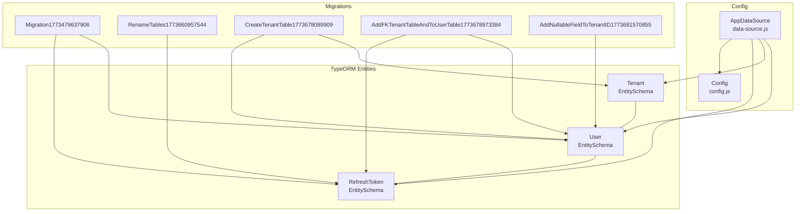
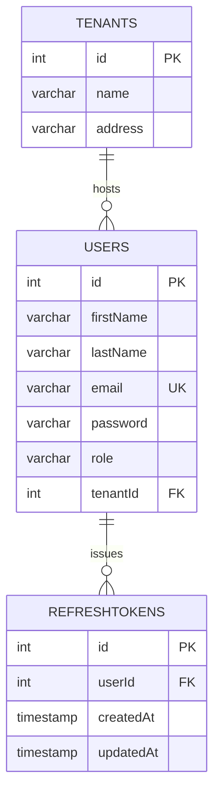
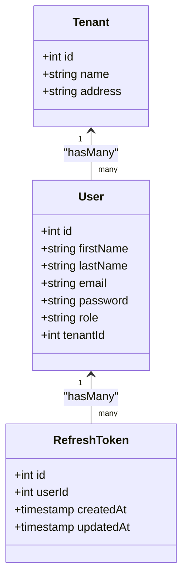
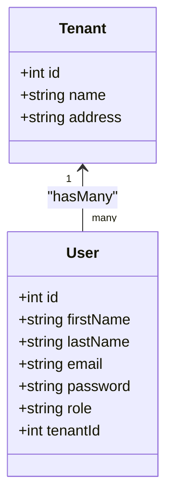
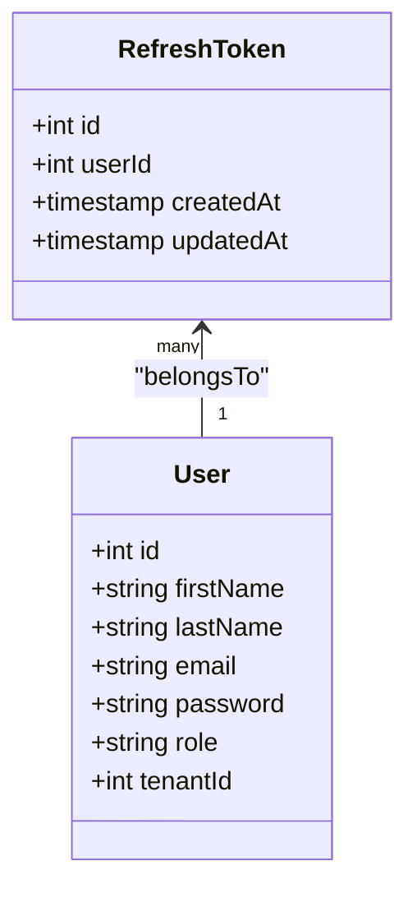
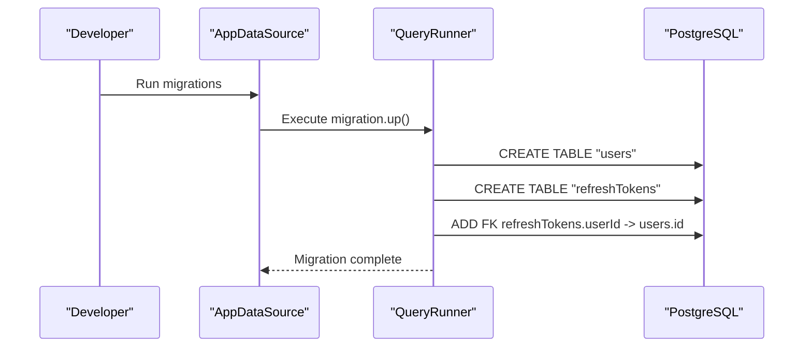
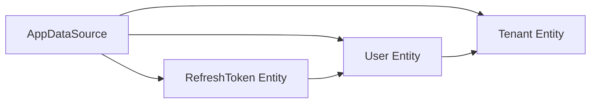

# Database Design

<cite>
**Referenced Files in This Document**
- [User.js](file://src/entity/User.js)
- [Tenants.js](file://src/entity/Tenants.js)
- [RefreshToken.js](file://src/entity/RefreshToken.js)
- [data-source.js](file://src/config/data-source.js)
- [config.js](file://src/config/config.js)
- [1773479637906-migration.js](file://src/migration/1773479637906-migration.js)
- [1773660957544-rename_tables.js](file://src/migration/1773660957544-rename_tables.js)
- [1773678089909-create_tenant_table.js](file://src/migration/1773678089909-create_tenant_table.js)
- [1773678973384-add_FK_tenant_table_and_to_user_table.js](file://src/migration/177367897384-add_FK_tenant_table_and_to_user_table.js)
- [1773681570855-add_nullable_field_to_tenantID.js](file://src/migration/1773681570855-add_nullable_field_to_tenantID.js)
- [UserService.js](file://src/services/UserService.js)
- [TenantService.js](file://src/services/TenantService.js)
- [TokenServices.js](file://src/services/TokenServices.js)
- [validateRefresh.js](file://src/middleware/validateRefresh.js)
</cite>

## Table of Contents
1. [Introduction](#introduction)
2. [Project Structure](#project-structure)
3. [Core Components](#core-components)
4. [Architecture Overview](#architecture-overview)
5. [Detailed Component Analysis](#detailed-component-analysis)
6. [Dependency Analysis](#dependency-analysis)
7. [Performance Considerations](#performance-considerations)
8. [Troubleshooting Guide](#troubleshooting-guide)
9. [Conclusion](#conclusion)
10. [Appendices](#appendices)

## Introduction
This document describes the authentication service database schema and data model. It focuses on the User, Tenant, and RefreshToken entities, detailing their fields, constraints, relationships, and migrations. It also covers TypeORM configuration, schema evolution, data integrity, performance optimization, and operational considerations such as refresh token lifecycle and revocation.

## Project Structure
The database schema is defined via TypeORM EntitySchema definitions and evolves through a series of migration files. The TypeORM data source is configured to load entities and migrations based on the environment.

**Diagram sources**
- [data-source.js:8-21](file://src/config/data-source.js#L8-L21)
- [config.js:23-33](file://src/config/config.js#L23-L33)
- [User.js:3-49](file://src/entity/User.js#L3-L49)
- [Tenants.js:3-28](file://src/entity/Tenants.js#L3-L28)
- [RefreshToken.js:3-34](file://src/entity/RefreshToken.js#L3-L34)
- [1773479637906-migration.js:10-33](file://src/migration/1773479637906-migration.js#L10-L33)
- [1773660957544-rename_tables.js:10-30](file://src/migration/1773660957544-rename_tables.js#L10-L30)
- [1773678089909-create_tenant_table.js:10-30](file://src/migration/1773678089909-create_tenant_table.js#L10-L30)
- [1773678973384-add_FK_tenant_table_and_to_user_table.js:10-37](file://src/migration/1773678973384-add_FK_tenant_table_and_to_user_table.js#L10-L37)
- [1773681570855-add_nullable_field_to_tenantID.js:10-30](file://src/migration/1773681570855-add_nullable_field_to_tenantID.js#L10-L30)

**Section sources**
- [data-source.js:8-21](file://src/config/data-source.js#L8-L21)
- [config.js:23-33](file://src/config/config.js#L23-L33)

## Core Components
This section documents each entity’s schema, constraints, and relationships.

- User
  - Table: users
  - Primary key: id (auto-generated integer)
  - Unique constraints:
    - id (primary key)
    - email (unique)
  - Columns:
    - id: integer, auto-generated
    - firstName: varchar
    - lastName: varchar
    - email: varchar (unique)
    - password: varchar (not selected by default in queries)
    - role: varchar
    - tenantId: integer (nullable)
  - Relationships:
    - One-to-many with RefreshToken via user.refreshTokens
    - Many-to-one with Tenant via tenantId (nullable)

- Tenant
  - Table: tenants
  - Primary key: id (auto-generated integer)
  - Columns:
    - id: integer, auto-generated
    - name: varchar (length 100)
    - address: varchar (length 255)
  - Relationships:
    - One-to-many with User via tenant.users

- RefreshToken
  - Table: refreshTokens
  - Primary key: id (auto-generated integer)
  - Columns:
    - id: integer, auto-generated
    - userId: integer
    - createdAt: timestamp (default current timestamp)
    - updatedAt: timestamp (default current timestamp, updates on modification)
  - Relationships:
    - Many-to-one with User via userId

Notes:
- The initial migration creates users and refreshTokens tables and establishes a foreign key from refreshTokens.userId to users.id.
- Subsequent migrations introduce the tenants table and adjust foreign keys and nullability for tenantId on users.

**Section sources**
- [User.js:3-49](file://src/entity/User.js#L3-L49)
- [Tenants.js:3-28](file://src/entity/Tenants.js#L3-L28)
- [RefreshToken.js:3-34](file://src/entity/RefreshToken.js#L3-L34)
- [1773479637906-migration.js:16-22](file://src/migration/1773479637906-migration.js#L16-L22)
- [1773678089909-create_tenant_table.js:16-19](file://src/migration/1773678089909-create_tenant_table.js#L16-L19)
- [1773678973384-add_FK_tenant_table_and_to_user_table.js:16-23](file://src/migration/1773678973384-add_FK_tenant_table_and_to_user_table.js#L16-L23)
- [1773681570855-add_nullable_field_to_tenantID.js:16-19](file://src/migration/1773681570855-add_nullable_field_to_tenantID.js#L16-L19)

## Architecture Overview
The database architecture centers around three entities with explicit relationships and constraints. The TypeORM data source loads entities and migrations, enabling schema evolution and environment-specific behavior.

**Diagram sources**
- [User.js:3-49](file://src/entity/User.js#L3-L49)
- [Tenants.js:3-28](file://src/entity/Tenants.js#L3-L28)
- [RefreshToken.js:3-34](file://src/entity/RefreshToken.js#L3-L34)
- [1773479637906-migration.js:16-22](file://src/migration/1773479637906-migration.js#L16-L22)
- [1773678089909-create_tenant_table.js:16-19](file://src/migration/1773678089909-create_tenant_table.js#L16-L19)
- [1773678973384-add_FK_tenant_table_and_to_user_table.js:16-23](file://src/migration/1773678973384-add_FK_tenant_table_and_to_user_table.js#L16-L23)

## Detailed Component Analysis

### User Entity
- Purpose: Stores user account information, roles, and optional tenant association.
- Constraints:
  - Primary key id
  - Unique email
  - Optional tenantId (nullable)
- Relationships:
  - One-to-many with RefreshToken (inverse side defined)
  - Many-to-one with Tenant (nullable)
- Business rules enforced by code:
  - Password hashing occurs before persistence.
  - Duplicate email detection prevents creation of duplicate accounts.
  - Optional tenant assignment supports multi-tenancy.

**Diagram sources**
- [User.js:3-49](file://src/entity/User.js#L3-L49)
- [Tenants.js:3-28](file://src/entity/Tenants.js#L3-L28)
- [RefreshToken.js:3-34](file://src/entity/RefreshToken.js#L3-L34)

**Section sources**
- [User.js:3-49](file://src/entity/User.js#L3-L49)
- [UserService.js:7-38](file://src/services/UserService.js#L7-L38)

### Tenant Entity
- Purpose: Represents multi-tenant organizations.
- Constraints:
  - Primary key id
  - Name and address length limits
- Relationships:
  - One-to-many with User

**Diagram sources**
- [Tenants.js:3-28](file://src/entity/Tenants.js#L3-L28)
- [User.js:3-49](file://src/entity/User.js#L3-L49)

**Section sources**
- [Tenants.js:3-28](file://src/entity/Tenants.js#L3-L28)
- [TenantService.js:7-14](file://src/services/TenantService.js#L7-L14)

### RefreshToken Entity
- Purpose: Stores refresh tokens associated with users for secure token rotation.
- Constraints:
  - Primary key id
  - Non-null userId
  - Automatic timestamps for creation and updates
- Relationships:
  - Many-to-one with User

**Diagram sources**
- [RefreshToken.js:3-34](file://src/entity/RefreshToken.js#L3-L34)
- [User.js:3-49](file://src/entity/User.js#L3-L49)

**Section sources**
- [RefreshToken.js:3-34](file://src/entity/RefreshToken.js#L3-L34)
- [TokenServices.js:45-52](file://src/services/TokenServices.js#L45-L52)
- [validateRefresh.js:14-30](file://src/middleware/validateRefresh.js#L14-L30)

### Schema Evolution and Migrations
The schema evolved through a series of migrations:
- Initial schema: Creates users and refreshTokens tables and sets up the initial foreign key from refreshTokens.userId to users.id.
- Rename tables: Introduces the refreshTokens table and adds a unique constraint on users.id.
- Create tenant table: Adds the tenants table and introduces a foreign key from users.userId to tenants.id.
- Add FK tenant table and to user table: Renames users.userId to users.tenantId, enforces NOT NULL on tenantId, and re-applies foreign keys consistently.
- Add nullable field to tenantId: Drops and re-adds the foreign key allowing tenantId to be nullable.

**Diagram sources**
- [data-source.js:18-21](file://src/config/data-source.js#L18-L21)
- [1773479637906-migration.js:16-22](file://src/migration/1773479637906-migration.js#L16-L22)

**Section sources**
- [1773479637906-migration.js:10-33](file://src/migration/1773479637906-migration.js#L10-L33)
- [1773660957544-rename_tables.js:10-30](file://src/migration/1773660957544-rename_tables.js#L10-L30)
- [1773678089909-create_tenant_table.js:10-30](file://src/migration/1773678089909-create_tenant_table.js#L10-L30)
- [1773678973384-add_FK_tenant_table_and_to_user_table.js:10-37](file://src/migration/1773678973384-add_FK_tenant_table_and_to_user_table.js#L10-L37)
- [1773681570855-add_nullable_field_to_tenantID.js:10-30](file://src/migration/1773681570855-add_nullable_field_to_tenantID.js#L10-L30)

### Sample Data Structures
- User
  - Fields: id, firstName, lastName, email, role, tenantId
  - Example: { id: 1, firstName: "John", lastName: "Doe", email: "john@example.com", role: "admin", tenantId: null }
- Tenant
  - Fields: id, name, address
  - Example: { id: 1, name: "Acme Corp", address: "123 Main St" }
- RefreshToken
  - Fields: id, userId, createdAt, updatedAt
  - Example: { id: 1, userId: 1, createdAt: "2024-01-01T00:00:00Z", updatedAt: "2024-01-01T00:00:00Z" }

[No sources needed since this section provides conceptual examples]

## Dependency Analysis
- Entities depend on each other through foreign keys:
  - refreshTokens.userId references users.id
  - users.tenantId references tenants.id (nullable)
- TypeORM data source loads entities and migrations and connects to PostgreSQL using environment-provided credentials.
- Services and middleware rely on repositories to enforce business rules and manage token lifecycles.

**Diagram sources**
- [data-source.js:8-21](file://src/config/data-source.js#L8-L21)
- [User.js:3-49](file://src/entity/User.js#L3-L49)
- [Tenants.js:3-28](file://src/entity/Tenants.js#L3-L28)
- [RefreshToken.js:3-34](file://src/entity/RefreshToken.js#L3-L34)

**Section sources**
- [data-source.js:8-21](file://src/config/data-source.js#L8-L21)
- [validateRefresh.js:14-30](file://src/middleware/validateRefresh.js#L14-L30)

## Performance Considerations
- Indexing strategies:
  - Primary keys are implicitly indexed by the database.
  - Consider adding an index on users.email to optimize lookups by email.
  - Consider adding an index on refreshTokens.userId to speed up token retrieval per user.
  - Consider adding an index on users.tenantId to accelerate tenant-scoped queries.
- Query patterns:
  - Use joins or relations as defined in TypeORM to avoid N+1 selects.
  - Leverage lazy loading or eager loading selectively to minimize round trips.
- Data access strategies:
  - Use repositories and services to encapsulate data access and enforce business rules.
  - Avoid selecting sensitive fields (e.g., password) unless necessary; the User entity marks password as non-select by default.
- Environment-specific behavior:
  - Synchronize is enabled for dev/test environments; disable in production and rely on migrations.

[No sources needed since this section provides general guidance]

## Troubleshooting Guide
- Duplicate email errors:
  - The UserService checks for existing emails and throws a client error if a duplicate is found.
- Refresh token validation failures:
  - The validateRefresh middleware checks the presence of a refresh token record matching both token id and user id; if not found, the token is considered revoked.
- Migration conflicts:
  - Ensure migrations are applied in order; later migrations alter previous constraints and column names.
- Data integrity:
  - Foreign key constraints maintain referential integrity between users, tenants, and refreshTokens.

**Section sources**
- [UserService.js:13-16](file://src/services/UserService.js#L13-L16)
- [validateRefresh.js:14-30](file://src/middleware/validateRefresh.js#L14-L30)
- [1773678973384-add_FK_tenant_table_and_to_user_table.js:16-23](file://src/migration/1773678973384-add_FK_tenant_table_and_to_user_table.js#L16-L23)

## Conclusion
The authentication service database schema is centered on three entities with clear relationships and constraints. TypeORM manages entity definitions and migrations, ensuring consistent schema evolution. Multi-tenancy is supported via the tenantId field on User, and refresh tokens are securely managed with revocation checks. Proper indexing and environment-aware configuration are recommended for optimal performance and reliability.

[No sources needed since this section summarizes without analyzing specific files]

## Appendices

### Appendix A: TypeORM Configuration
- Data source configuration specifies PostgreSQL connection parameters, entity loading, and migration paths based on environment.

**Section sources**
- [data-source.js:8-21](file://src/config/data-source.js#L8-L21)
- [config.js:23-33](file://src/config/config.js#L23-L33)

### Appendix B: Relationship Mapping Details
- User to RefreshToken: one-to-many via user.refreshTokens
- User to Tenant: many-to-one via tenantId (nullable)
- RefreshToken to User: many-to-one via userId (non-null)

**Section sources**
- [User.js:36-48](file://src/entity/User.js#L36-L48)
- [RefreshToken.js:27-33](file://src/entity/RefreshToken.js#L27-L33)
- [1773678973384-add_FK_tenant_table_and_to_user_table.js:16-23](file://src/migration/1773678973384-add_FK_tenant_table_and_to_user_table.js#L16-L23)