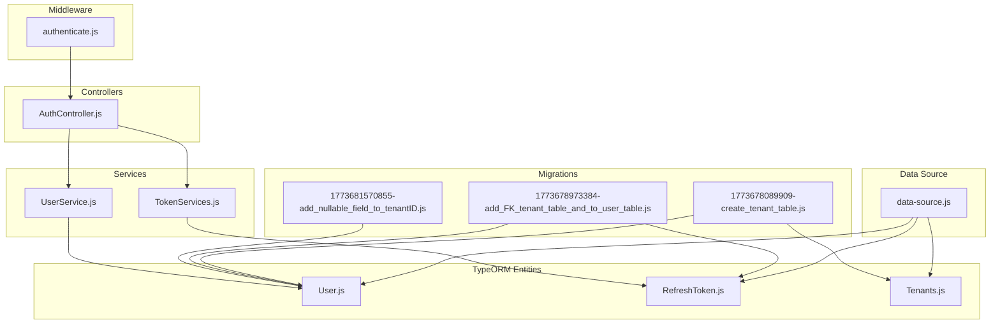
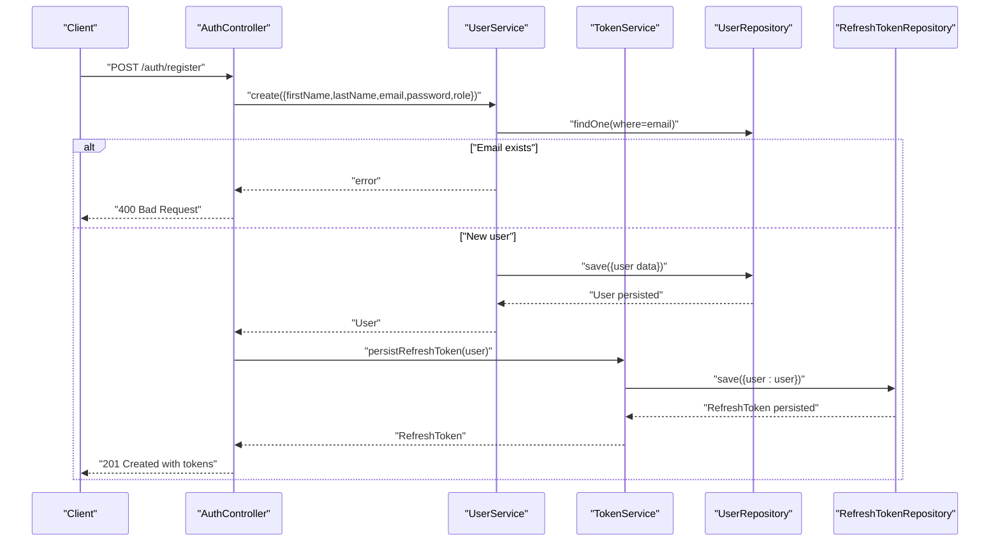
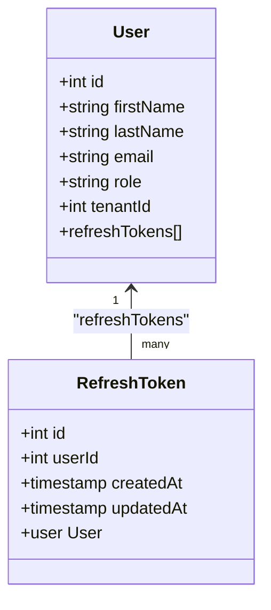
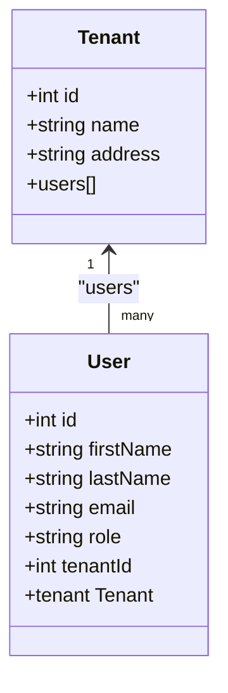
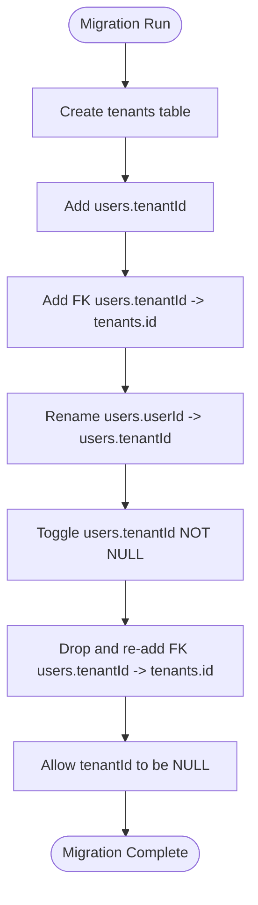
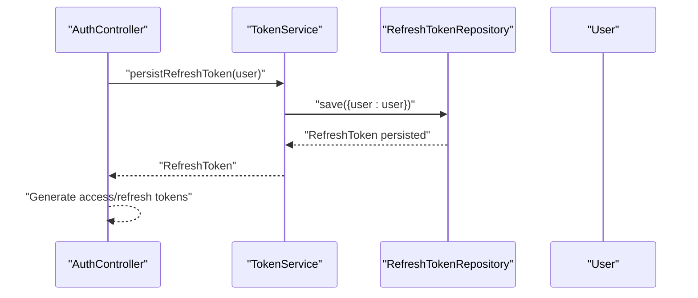
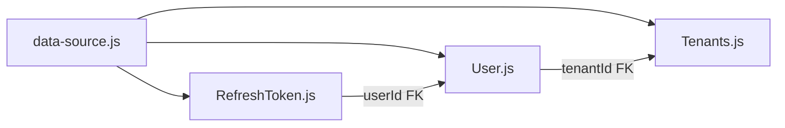

# Database Relationships

<cite>
**Referenced Files in This Document**
- [User.js](file://src/entity/User.js)
- [RefreshToken.js](file://src/entity/RefreshToken.js)
- [Tenants.js](file://src/entity/Tenants.js)
- [data-source.js](file://src/config/data-source.js)
- [1773678089909-create_tenant_table.js](file://src/migration/1773678089909-create_tenant_table.js)
- [1773678973384-add_FK_tenant_table_and_to_user_table.js](file://src/migration/1773678973384-add_FK_tenant_table_and_to_user_table.js)
- [1773681570855-add_nullable_field_to_tenantID.js](file://src/migration/1773681570855-add_nullable_field_to_tenantID.js)
- [UserService.js](file://src/services/UserService.js)
- [TokenServices.js](file://src/services/TokenServices.js)
- [AuthController.js](file://src/controllers/AuthController.js)
- [authenticate.js](file://src/middleware/authenticate.js)
- [create.spec.js](file://src/test/users/create.spec.js)
- [register.spec.js](file://src/test/users/register.spec.js)
- [create.spec.js](file://src/test/tenant/create.spec.js)
</cite>

## Table of Contents
1. [Introduction](#introduction)
2. [Project Structure](#project-structure)
3. [Core Components](#core-components)
4. [Architecture Overview](#architecture-overview)
5. [Detailed Component Analysis](#detailed-component-analysis)
6. [Dependency Analysis](#dependency-analysis)
7. [Performance Considerations](#performance-considerations)
8. [Troubleshooting Guide](#troubleshooting-guide)
9. [Conclusion](#conclusion)

## Introduction
This document explains the database relationships and foreign key constraints in the authentication service, focusing on:
- One-to-many relationship between User and RefreshToken for token lifecycle management
- Many-to-one relationship between User and Tenant for multi-tenant isolation
It details join column configurations, referential integrity, and migration-driven constraint enforcement. It also covers relationship mapping patterns, query optimization strategies, and transaction handling considerations for maintaining data consistency.

## Project Structure
The authentication service uses TypeORM entity schemas and migrations to define and evolve the schema. Entities are registered with the data source and used by services and controllers.

**Diagram sources**
- [data-source.js:8-21](file://src/config/data-source.js#L8-L21)
- [User.js:3-49](file://src/entity/User.js#L3-L49)
- [RefreshToken.js:3-34](file://src/entity/RefreshToken.js#L3-L34)
- [Tenants.js:3-28](file://src/entity/Tenants.js#L3-L28)
- [1773678089909-create_tenant_table.js:16-20](file://src/migration/1773678089909-create_tenant_table.js#L16-L20)
- [1773678973384-add_FK_tenant_table_and_to_user_table.js:16-24](file://src/migration/1773678973384-add_FK_tenant_table_and_to_user_table.js#L16-L24)
- [1773681570855-add_nullable_field_to_tenantID.js:16-20](file://src/migration/1773681570855-add_nullable_field_to_tenantID.js#L16-L20)
- [UserService.js:4-98](file://src/services/UserService.js#L4-L98)
- [TokenServices.js:9-59](file://src/services/TokenServices.js#L9-L59)
- [AuthController.js:5-212](file://src/controllers/AuthController.js#L5-L212)
- [authenticate.js:6-25](file://src/middleware/authenticate.js#L6-L25)

**Section sources**
- [data-source.js:8-21](file://src/config/data-source.js#L8-L21)
- [User.js:3-49](file://src/entity/User.js#L3-L49)
- [RefreshToken.js:3-34](file://src/entity/RefreshToken.js#L3-L34)
- [Tenants.js:3-28](file://src/entity/Tenants.js#L3-L28)

## Core Components
- User entity defines a one-to-many relationship to RefreshToken via a dedicated relation and a many-to-one relationship to Tenant via a join column named tenantId.
- RefreshToken entity defines a many-to-one relationship to User via a join column named userId.
- Tenant entity defines a one-to-many relationship to User via the inverse side of the tenant-user relation.

These relationships are mapped in entity schemas and enforced by migrations that add foreign keys and adjust nullability.

**Section sources**
- [User.js:36-48](file://src/entity/User.js#L36-L48)
- [RefreshToken.js:27-33](file://src/entity/RefreshToken.js#L27-L33)
- [Tenants.js:21-27](file://src/entity/Tenants.js#L21-L27)

## Architecture Overview
The runtime flow for registration demonstrates relationship usage: AuthController orchestrates creation of a User and persists a RefreshToken linked to that User. Services encapsulate persistence and retrieval, while middleware authenticates requests.

**Diagram sources**
- [AuthController.js:19-70](file://src/controllers/AuthController.js#L19-L70)
- [UserService.js:7-38](file://src/services/UserService.js#L7-L38)
- [TokenServices.js:45-52](file://src/services/TokenServices.js#L45-L52)

## Detailed Component Analysis

### Relationship: User → RefreshToken (One-to-Many)
- Mapping pattern:
  - User has a relation named refreshTokens of type one-to-many targeting RefreshToken.
  - RefreshToken has a many-to-one relation named user targeting User.
  - Join column for RefreshToken.user is userId.
- Referential integrity:
  - Migration adds a foreign key from refreshTokens.userId to users.id.
  - The foreign key is defined with no action on delete/update.
- Cascade options:
  - No explicit cascade is configured in the entity schema; deletions are not implied by the schema.
- Data consistency:
  - Because the foreign key is NOT NULL in the migration, every RefreshToken must reference a valid User.
  - If a User is deleted, referential integrity would prevent deletion unless cascading rules are introduced at the database level.

**Diagram sources**
- [User.js:36-48](file://src/entity/User.js#L36-L48)
- [RefreshToken.js:27-33](file://src/entity/RefreshToken.js#L27-L33)

**Section sources**
- [User.js:36-48](file://src/entity/User.js#L36-L48)
- [RefreshToken.js:27-33](file://src/entity/RefreshToken.js#L27-L33)
- [1773678973384-add_FK_tenant_table_and_to_user_table.js:20-23](file://src/migration/1773678973384-add_FK_tenant_table_and_to_user_table.js#L20-L23)

### Relationship: User ←→ Tenant (Many-to-One)
- Mapping pattern:
  - User has a many-to-one relation named tenant targeting Tenant.
  - Tenant has a one-to-many relation named users targeting User.
  - Join column for User.tenant is tenantId.
- Referential integrity:
  - Initial migration creates the tenants table and adds a foreign key from users.tenantId to tenants.id.
  - Subsequent migration toggles tenantId nullability; current state allows null, meaning a user may not belong to a tenant.
- Cascade options:
  - No explicit cascade is configured in the entity schema; deletions are not implied by the schema.
- Multi-tenancy implications:
  - Users can be associated with a tenant via tenantId. Queries should filter by tenantId to enforce isolation.
  - Tests demonstrate saving a user with a tenant association.

**Diagram sources**
- [Tenants.js:21-27](file://src/entity/Tenants.js#L21-L27)
- [User.js:42-47](file://src/entity/User.js#L42-L47)

**Section sources**
- [Tenants.js:21-27](file://src/entity/Tenants.js#L21-L27)
- [User.js:42-47](file://src/entity/User.js#L42-L47)
- [1773678089909-create_tenant_table.js:17-19](file://src/migration/1773678089909-create_tenant_table.js#L17-L19)
- [1773678973384-add_FK_tenant_table_and_to_user_table.js:22](file://src/migration/1773678973384-add_FK_tenant_table_and_to_user_table.js#L22)
- [1773681570855-add_nullable_field_to_tenantID.js:17-19](file://src/migration/1773681570855-add_nullable_field_to_tenantID.js#L17-L19)

### Migration-Driven Constraint Enforcement
- Initial tenant table creation and FK addition:
  - Creates tenants table and adds FK from users.userId to tenants.id.
- Renaming and altering constraints:
  - Renames users.userId to users.tenantId, adjusts NOT NULL, and re-applies FK to tenants.id.
- Adjusting tenantId nullability:
  - Drops and re-adds FK after toggling tenantId nullability to support optional tenant membership.

**Diagram sources**
- [1773678089909-create_tenant_table.js:16-20](file://src/migration/1773678089909-create_tenant_table.js#L16-L20)
- [1773678973384-add_FK_tenant_table_and_to_user_table.js:17-23](file://src/migration/1773678973384-add_FK_tenant_table_and_to_user_table.js#L17-L23)
- [1773681570855-add_nullable_field_to_tenantID.js:16-20](file://src/migration/1773681570855-add_nullable_field_to_tenantID.js#L16-L20)

**Section sources**
- [1773678089909-create_tenant_table.js:16-20](file://src/migration/1773678089909-create_tenant_table.js#L16-L20)
- [1773678973384-add_FK_tenant_table_and_to_user_table.js:16-24](file://src/migration/1773678973384-add_FK_tenant_table_and_to_user_table.js#L16-L24)
- [1773681570855-add_nullable_field_to_tenantID.js:16-20](file://src/migration/1773681570855-add_nullable_field_to_tenantID.js#L16-L20)

### Relationship Mapping Patterns and Usage
- User creation and refresh token persistence:
  - AuthController registers a user and persists a RefreshToken linked to the newly created User.
  - TokenService saves a RefreshToken with a user object, leveraging the many-to-one relation.
- Querying patterns:
  - UserService retrieves a user with password included using a query builder and select clause.
  - Tests demonstrate querying refresh tokens by userId to confirm linkage.

**Diagram sources**
- [AuthController.js:42-47](file://src/controllers/AuthController.js#L42-L47)
- [TokenServices.js:45-52](file://src/services/TokenServices.js#L45-L52)

**Section sources**
- [AuthController.js:19-70](file://src/controllers/AuthController.js#L19-L70)
- [TokenServices.js:45-52](file://src/services/TokenServices.js#L45-L52)
- [UserService.js:48-54](file://src/services/UserService.js#L48-L54)
- [register.spec.js:140-154](file://src/test/users/register.spec.js#L140-L154)

### Data Access Patterns Using TypeORM
- One-to-many navigation:
  - Access user.refreshTokens from a User entity instance to enumerate a user’s refresh tokens.
- Many-to-one navigation:
  - Access user.tenant from a User entity instance to access the associated Tenant.
- Querying with joins:
  - Use query builder joins to fetch users with their tenant or refresh tokens when needed.
- Example patterns (described):
  - Fetch user with password: build a query selecting the password field for authentication workflows.
  - Find refresh tokens by userId: use where(userId = :userId) to locate tokens for rotation or cleanup.

**Section sources**
- [User.js:36-48](file://src/entity/User.js#L36-L48)
- [RefreshToken.js:27-33](file://src/entity/RefreshToken.js#L27-L33)
- [UserService.js:48-54](file://src/services/UserService.js#L48-L54)
- [register.spec.js:146-151](file://src/test/users/register.spec.js#L146-L151)

## Dependency Analysis
Entity dependencies and their relationships are defined in the entity schemas and enforced by migrations. The data source registers all entities and runs migrations accordingly.

**Diagram sources**
- [data-source.js:8-21](file://src/config/data-source.js#L8-L21)
- [User.js:30-33](file://src/entity/User.js#L30-L33)
- [RefreshToken.js:12-14](file://src/entity/RefreshToken.js#L12-L14)
- [1773678973384-add_FK_tenant_table_and_to_user_table.js:22](file://src/migration/1773678973384-add_FK_tenant_table_and_to_user_table.js#L22)
- [1773678973384-add_FK_tenant_table_and_to_user_table.js:23](file://src/migration/1773678973384-add_FK_tenant_table_and_to_user_table.js#L23)

**Section sources**
- [data-source.js:8-21](file://src/config/data-source.js#L8-L21)
- [User.js:30-33](file://src/entity/User.js#L30-L33)
- [RefreshToken.js:12-14](file://src/entity/RefreshToken.js#L12-L14)
- [1773678973384-add_FK_tenant_table_and_to_user_table.js:22-23](file://src/migration/1773678973384-add_FK_tenant_table_and_to_user_table.js#L22-L23)

## Performance Considerations
- Indexing join columns:
  - Ensure indexes exist on foreign keys (tenantId and userId) to optimize joins and lookups.
- Minimizing N+1 queries:
  - Use eager loading or query builder joins when fetching users with tenant or refresh tokens to avoid repeated round-trips.
- Selectivity and projections:
  - Avoid SELECT *; choose only required columns to reduce bandwidth and CPU overhead.
- Batch operations:
  - For bulk refresh token rotations or cleanup, batch deletes and inserts to minimize transaction overhead.
- Transaction boundaries:
  - Wrap user creation and refresh token persistence in a single transaction to maintain atomicity and consistency.

[No sources needed since this section provides general guidance]

## Troubleshooting Guide
- Foreign key violations:
  - Attempting to insert a RefreshToken with a non-existent userId or a User with a non-existent tenantId will fail due to FK constraints.
  - Verify that referenced records exist before insertion.
- Optional tenant membership:
  - Since tenantId can be NULL, ensure application logic handles unassociated users appropriately.
- Authentication flow:
  - Middleware extracts tokens from Authorization header or cookies; ensure clients send tokens consistently.
- Test verification:
  - Tests confirm refresh token creation and user-tenant association, useful for validating relationship behavior.

**Section sources**
- [1773678973384-add_FK_tenant_table_and_to_user_table.js:16-24](file://src/migration/1773678973384-add_FK_tenant_table_and_to_user_table.js#L16-L24)
- [1773681570855-add_nullable_field_to_tenantID.js:16-20](file://src/migration/1773681570855-add_nullable_field_to_tenantID.js#L16-L20)
- [authenticate.js:13-24](file://src/middleware/authenticate.js#L13-L24)
- [create.spec.js:72-77](file://src/test/users/create.spec.js#L72-L77)
- [register.spec.js:140-154](file://src/test/users/register.spec.js#L140-L154)

## Conclusion
The authentication service enforces clear database relationships:
- Users own RefreshTokens via a one-to-many relationship with a FK from refreshTokens.userId to users.id.
- Users optionally belong to Tenants via a many-to-one relationship with a FK from users.tenantId to tenants.id, currently allowing NULL.
Migrations manage FK creation and nullability transitions. Services and controllers leverage these relationships for secure token lifecycle management and multi-tenant isolation. Proper indexing, transaction boundaries, and query strategies are recommended for performance and consistency.