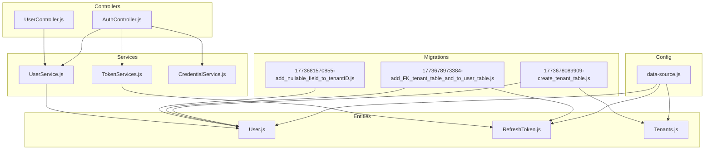
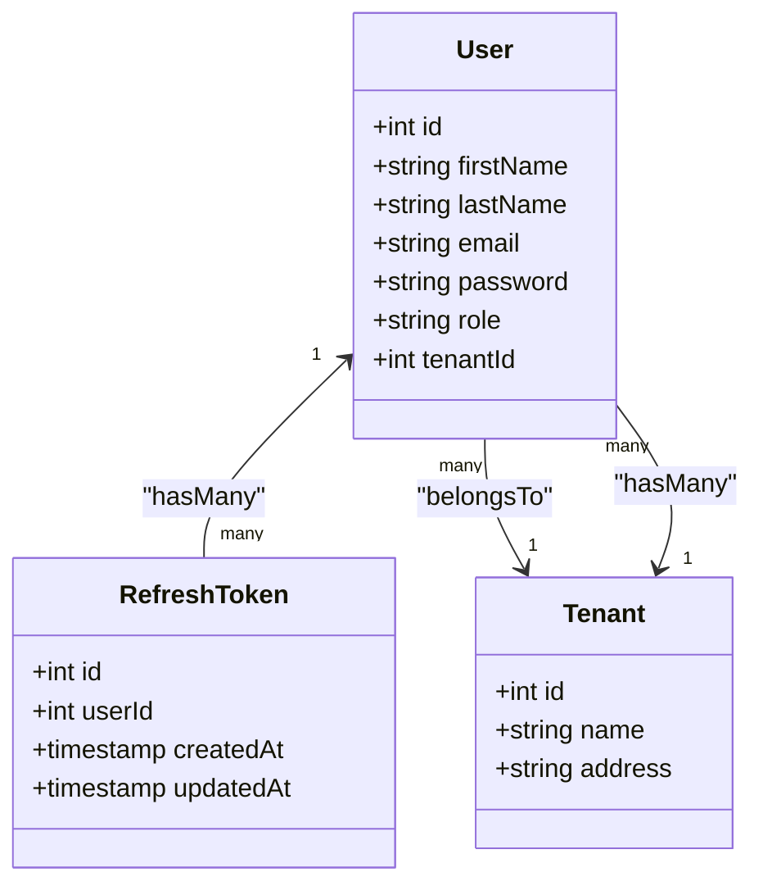
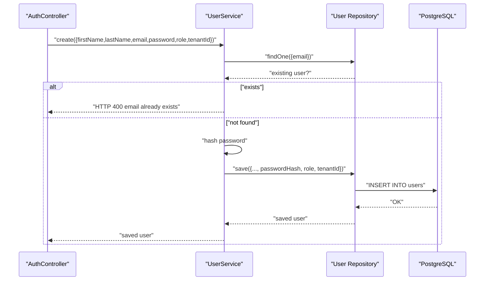
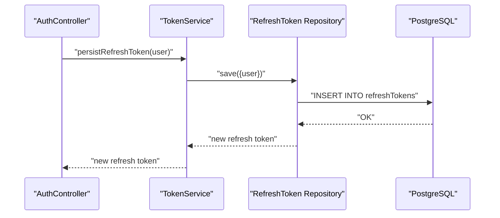
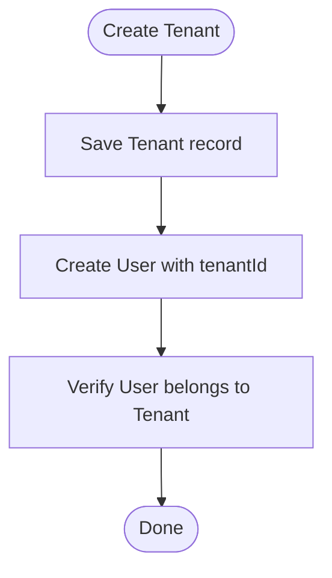
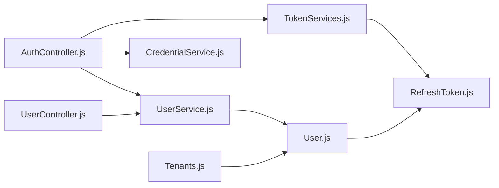

# Entity Schemas

<cite>
**Referenced Files in This Document**
- [User.js](file://src/entity/User.js)
- [RefreshToken.js](file://src/entity/RefreshToken.js)
- [Tenants.js](file://src/entity/Tenants.js)
- [data-source.js](file://src/config/data-source.js)
- [1773678089909-create_tenant_table.js](file://src/migration/1773678089909-create_tenant_table.js)
- [1773678973384-add_FK_tenant_table_and_to_user_table.js](file://src/migration/1773678973384-add_FK_tenant_table_and_to_user_table.js)
- [1773681570855-add_nullable_field_to_tenantID.js](file://src/migration/1773681570855-add_nullable_field_to_tenantID.js)
- [UserService.js](file://src/services/UserService.js)
- [TokenServices.js](file://src/services/TokenServices.js)
- [AuthController.js](file://src/controllers/AuthController.js)
- [UserController.js](file://src/controllers/UserController.js)
- [CredentialService.js](file://src/services/CredentialService.js)
- [index.js](file://src/constants/index.js)
- [config.js](file://src/config/config.js)
- [create.spec.js](file://src/test/users/create.spec.js)
- [register.spec.js](file://src/test/users/register.spec.js)
</cite>

## Table of Contents
1. [Introduction](#introduction)
2. [Project Structure](#project-structure)
3. [Core Components](#core-components)
4. [Architecture Overview](#architecture-overview)
5. [Detailed Component Analysis](#detailed-component-analysis)
6. [Dependency Analysis](#dependency-analysis)
7. [Performance Considerations](#performance-considerations)
8. [Troubleshooting Guide](#troubleshooting-guide)
9. [Conclusion](#conclusion)
10. [Appendices](#appendices)

## Introduction
This document describes the TypeORM entity schemas used in the authentication service. It focuses on the User, RefreshToken, and Tenant entities, detailing their field definitions, data types, constraints, and validation rules. It also explains how these entities are configured via EntitySchema, how relationships are mapped, and how they are instantiated and used across the application.

## Project Structure
The authentication service organizes entities under the entity directory and registers them with TypeORM via the data source configuration. Migrations define and evolve the database schema for tenants and foreign keys. Services and controllers orchestrate entity creation, updates, and token lifecycle management.

**Diagram sources**
- [data-source.js:1-22](file://src/config/data-source.js#L1-L22)
- [User.js:1-50](file://src/entity/User.js#L1-L50)
- [RefreshToken.js:1-35](file://src/entity/RefreshToken.js#L1-L35)
- [Tenants.js:1-29](file://src/entity/Tenants.js#L1-L29)
- [1773678089909-create_tenant_table.js:1-31](file://src/migration/1773678089909-create_tenant_table.js#L1-L31)
- [1773678973384-add_FK_tenant_table_and_to_user_table.js:1-39](file://src/migration/1773678973384-add_FK_tenant_table_and_to_user_table.js#L1-L39)
- [1773681570855-add_nullable_field_to_tenantID.js:1-31](file://src/migration/1773681570855-add_nullable_field_to_tenantID.js#L1-L31)
- [UserService.js:1-99](file://src/services/UserService.js#L1-L99)
- [TokenServices.js:1-60](file://src/services/TokenServices.js#L1-L60)
- [CredentialService.js:1-7](file://src/services/CredentialService.js#L1-L7)
- [AuthController.js:1-212](file://src/controllers/AuthController.js#L1-L212)
- [UserController.js:1-94](file://src/controllers/UserController.js#L1-L94)

**Section sources**
- [data-source.js:1-22](file://src/config/data-source.js#L1-L22)

## Core Components
This section documents each entity’s schema, including columns, constraints, and relationships.

- User entity
  - Purpose: Stores personal information, authentication credentials, role, and optional tenant association.
  - Primary key: id (auto-generated integer).
  - Fields:
    - firstName: varchar.
    - lastName: varchar.
    - email: varchar, unique.
    - password: varchar, hidden from selection queries.
    - role: varchar.
    - tenantId: int, nullable.
  - Relationships:
    - One-to-many with RefreshToken via user.
    - Many-to-one with Tenant via tenantId.

- RefreshToken entity
  - Purpose: Manages refresh tokens for secure token lifecycle.
  - Primary key: id (auto-generated integer).
  - Fields:
    - userId: int.
    - createdAt: timestamp with creation date tracking and default.
    - updatedAt: timestamp with update date tracking, default, and on update default.
  - Relationships:
    - Many-to-one with User via userId.

- Tenant entity
  - Purpose: Supports multi-tenancy with metadata.
  - Primary key: id (auto-generated integer).
  - Fields:
    - name: varchar with length 100.
    - address: varchar with length 255.
  - Relationships:
    - One-to-many with User via tenant.

Constraints and defaults observed in migrations:
- Initial tenant table creation enforces NOT NULL on name and address.
- Foreign key constraints:
  - users.tenantId -> tenants.id.
  - refreshTokens.userId -> users.id.
- tenantId was made nullable in a later migration.

Validation rules observed in services and tests:
- Email uniqueness enforced at service level.
- Password hashing performed before persistence.
- Role assignment defaults to customer for registration.

**Section sources**
- [User.js:1-50](file://src/entity/User.js#L1-L50)
- [RefreshToken.js:1-35](file://src/entity/RefreshToken.js#L1-L35)
- [Tenants.js:1-29](file://src/entity/Tenants.js#L1-L29)
- [1773678089909-create_tenant_table.js:16-20](file://src/migration/1773678089909-create_tenant_table.js#L16-L20)
- [1773678973384-add_FK_tenant_table_and_to_user_table.js:18-23](file://src/migration/1773678973384-add_FK_tenant_table_and_to_user_table.js#L18-L23)
- [1773681570855-add_nullable_field_to_tenantID.js:17-19](file://src/migration/1773681570855-add_nullable_field_to_tenantID.js#L17-L19)
- [UserService.js:7-38](file://src/services/UserService.js#L7-L38)
- [register.spec.js:89-96](file://src/test/users/register.spec.js#L89-L96)

## Architecture Overview
The entity schemas integrate with the data source configuration and are consumed by services and controllers to implement authentication workflows.

**Diagram sources**
- [User.js:3-49](file://src/entity/User.js#L3-L49)
- [RefreshToken.js:3-34](file://src/entity/RefreshToken.js#L3-L34)
- [Tenants.js:3-28](file://src/entity/Tenants.js#L3-L28)

## Detailed Component Analysis

### User Entity
- Schema highlights:
  - Unique email enforced at the schema level.
  - Password visibility restricted in queries.
  - Optional tenant association via tenantId.
- Relationships:
  - One-to-many with RefreshToken.
  - Many-to-one with Tenant.
- Usage patterns:
  - Creation with role assignment and optional tenantId.
  - Retrieval by email with password included when needed.
  - Update supports changing tenant association.

**Diagram sources**
- [AuthController.js:19-70](file://src/controllers/AuthController.js#L19-L70)
- [UserService.js:7-38](file://src/services/UserService.js#L7-L38)

**Section sources**
- [User.js:3-49](file://src/entity/User.js#L3-L49)
- [UserService.js:7-38](file://src/services/UserService.js#L7-L38)
- [UserController.js:12-28](file://src/controllers/UserController.js#L12-L28)
- [register.spec.js:80-87](file://src/test/users/register.spec.js#L80-L87)

### RefreshToken Entity
- Schema highlights:
  - Auto-generated primary key.
  - Timestamps track creation and updates.
  - Foreign key userId references User.
- Lifecycle management:
  - Persisted upon successful login/registration.
  - Rotated on refresh requests.
  - Deleted on logout.

**Diagram sources**
- [AuthController.js:108-113](file://src/controllers/AuthController.js#L108-L113)
- [TokenServices.js:45-52](file://src/services/TokenServices.js#L45-L52)

**Section sources**
- [RefreshToken.js:3-34](file://src/entity/RefreshToken.js#L3-L34)
- [TokenServices.js:45-58](file://src/services/TokenServices.js#L45-L58)
- [register.spec.js:140-154](file://src/test/users/register.spec.js#L140-L154)

### Tenant Entity
- Schema highlights:
  - Metadata fields name and address with length constraints.
  - One-to-many relationship with User.
- Multi-tenancy support:
  - Users can be optionally associated with a tenant.
  - Tests demonstrate saving a tenant and assigning it to a user.

**Diagram sources**
- [Tenants.js:3-28](file://src/entity/Tenants.js#L3-L28)
- [create.spec.js:72-77](file://src/test/users/create.spec.js#L72-L77)

**Section sources**
- [Tenants.js:3-28](file://src/entity/Tenants.js#L3-L28)
- [create.spec.js:72-77](file://src/test/users/create.spec.js#L72-L77)

### EntitySchema Configuration Patterns
- Naming and table mapping:
  - Entities specify name and tableName for explicit mapping.
- Column options:
  - Primary keys use auto-generation.
  - Unique constraints applied to email.
  - Select exclusion for sensitive fields like password.
  - Length constraints for varchar fields.
  - Timestamps with creation/update date tracking and defaults.
- Relationship mappings:
  - Join columns defined explicitly for foreign keys.
  - Inverse sides declared for bidirectional relations.
- Data source registration:
  - Entities registered in AppDataSource for runtime discovery.

**Section sources**
- [User.js:3-49](file://src/entity/User.js#L3-L49)
- [RefreshToken.js:3-34](file://src/entity/RefreshToken.js#L3-L34)
- [Tenants.js:3-28](file://src/entity/Tenants.js#L3-L28)
- [data-source.js:8-21](file://src/config/data-source.js#L8-L21)

### Validation Rules and Constraints
- Uniqueness:
  - Email uniqueness enforced at service level; tests confirm duplicate emails produce HTTP 400.
- Password handling:
  - Passwords are hashed before storage; tests assert stored hash length and inequality with original.
- Role defaults:
  - Registration assigns customer role by default.
- Foreign key constraints:
  - Migrations enforce referential integrity between users and tenants, and refreshTokens and users.
  - tenantId was made nullable in a later migration.

**Section sources**
- [UserService.js:7-38](file://src/services/UserService.js#L7-L38)
- [register.spec.js:89-96](file://src/test/users/register.spec.js#L89-L96)
- [register.spec.js:80-87](file://src/test/users/register.spec.js#L80-L87)
- [1773678089909-create_tenant_table.js:16-20](file://src/migration/1773678089909-create_tenant_table.js#L16-L20)
- [1773678973384-add_FK_tenant_table_and_to_user_table.js:18-23](file://src/migration/1773678973384-add_FK_tenant_table_and_to_user_table.js#L18-L23)
- [1773681570855-add_nullable_field_to_tenantID.js:17-19](file://src/migration/1773681570855-add_nullable_field_to_tenantID.js#L17-L19)

### Usage Examples Across the Application
- Creating a user:
  - AuthController invokes UserService.create with personal and credential fields; role defaults to customer.
  - UserController supports admin-driven creation with explicit role and tenantId.
- Retrieving user with password:
  - UserService uses a query builder to include password for authentication checks.
- Updating user:
  - UserController validates inputs and delegates to UserService.updateUser, supporting tenant updates.
- Token lifecycle:
  - TokenService persists refresh tokens and rotates them on refresh; deletes on logout.

**Section sources**
- [AuthController.js:19-70](file://src/controllers/AuthController.js#L19-L70)
- [UserController.js:12-77](file://src/controllers/UserController.js#L12-L77)
- [UserService.js:40-54](file://src/services/UserService.js#L40-L54)
- [UserService.js:68-84](file://src/services/UserService.js#L68-L84)
- [TokenServices.js:45-58](file://src/services/TokenServices.js#L45-L58)

## Dependency Analysis
The following diagram shows how entities depend on each other and how services/controllers consume them.

**Diagram sources**
- [AuthController.js:5-16](file://src/controllers/AuthController.js#L5-L16)
- [UserController.js:4-11](file://src/controllers/UserController.js#L4-L11)
- [UserService.js:3-6](file://src/services/UserService.js#L3-L6)
- [TokenServices.js:8-11](file://src/services/TokenServices.js#L8-L11)
- [CredentialService.js:1-7](file://src/services/CredentialService.js#L1-L7)
- [User.js:1-50](file://src/entity/User.js#L1-L50)
- [RefreshToken.js:1-35](file://src/entity/RefreshToken.js#L1-L35)
- [Tenants.js:1-29](file://src/entity/Tenants.js#L1-L29)

**Section sources**
- [AuthController.js:5-16](file://src/controllers/AuthController.js#L5-L16)
- [UserController.js:4-11](file://src/controllers/UserController.js#L4-L11)
- [UserService.js:3-6](file://src/services/UserService.js#L3-L6)
- [TokenServices.js:8-11](file://src/services/TokenServices.js#L8-L11)
- [CredentialService.js:1-7](file://src/services/CredentialService.js#L1-L7)

## Performance Considerations
- Indexes: Consider adding indexes on frequently queried columns such as email and tenantId to improve lookup performance.
- Password hashing cost: The current salt rounds value balances security and performance; adjust according to hardware capabilities and security requirements.
- Query optimization: Use projections and joins judiciously; avoid selecting unnecessary fields (e.g., password) unless required.
- Token lifecycle: Efficiently prune expired or rotated refresh tokens to prevent accumulation.

## Troubleshooting Guide
- Duplicate email errors:
  - Symptom: HTTP 400 when registering or creating users.
  - Cause: Email uniqueness constraint violated.
  - Resolution: Ensure unique email per tenant or globally depending on business rules.
- Password mismatch:
  - Symptom: Authentication failures.
  - Cause: Incorrect password or hashing mismatch.
  - Resolution: Confirm password hashing and comparison logic.
- Missing tenant association:
  - Symptom: tenantId appears null unexpectedly.
  - Cause: Nullable tenantId allows absence; ensure business logic handles null appropriately.
- Refresh token persistence:
  - Symptom: Missing refresh token in database after login.
  - Cause: Repository save failure or transaction rollback.
  - Resolution: Verify repository usage and transaction boundaries.

**Section sources**
- [UserService.js:7-38](file://src/services/UserService.js#L7-L38)
- [register.spec.js:98-104](file://src/test/users/register.spec.js#L98-L104)
- [CredentialService.js:3-5](file://src/services/CredentialService.js#L3-L5)
- [1773681570855-add_nullable_field_to_tenantID.js:17-19](file://src/migration/1773681570855-add_nullable_field_to_tenantID.js#L17-L19)
- [register.spec.js:140-154](file://src/test/users/register.spec.js#L140-L154)

## Conclusion
The entity schemas define a clear, extensible foundation for the authentication service. They support secure credential handling, robust token lifecycle management, and multi-tenancy through explicit relationships and constraints. The accompanying services and controllers demonstrate practical usage patterns for creation, retrieval, updates, and token operations.

## Appendices
- Roles definition:
  - customer, admin, manager are supported role values used in controllers and services.

**Section sources**
- [index.js:1-6](file://src/constants/index.js#L1-L6)