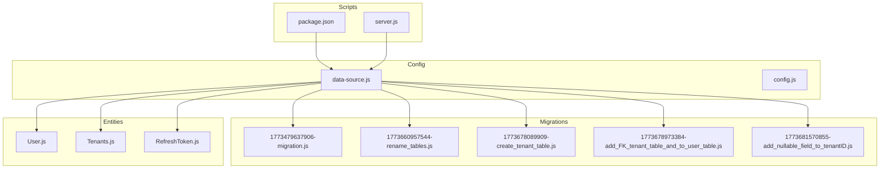
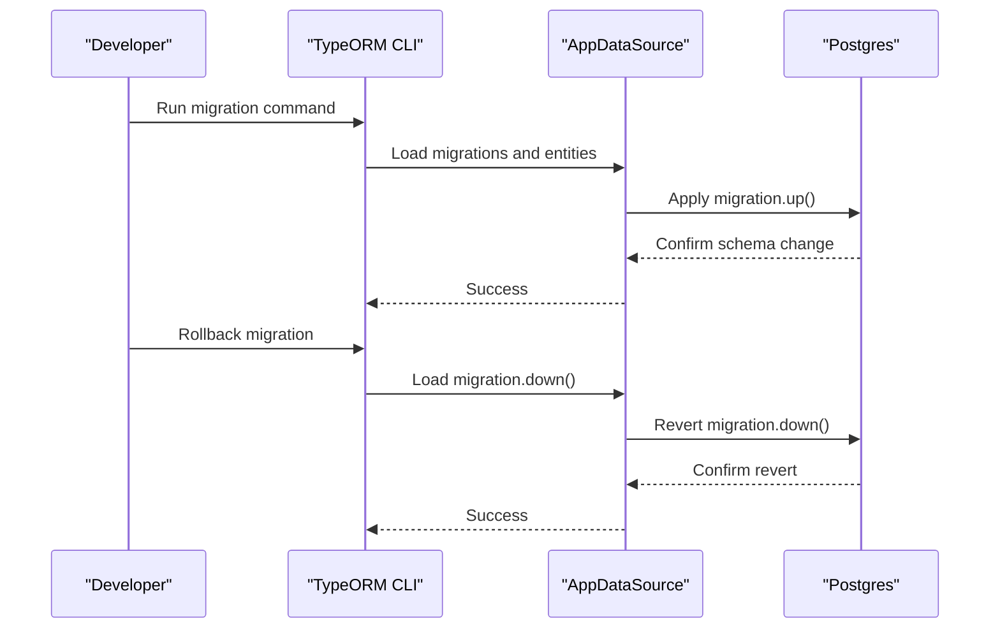
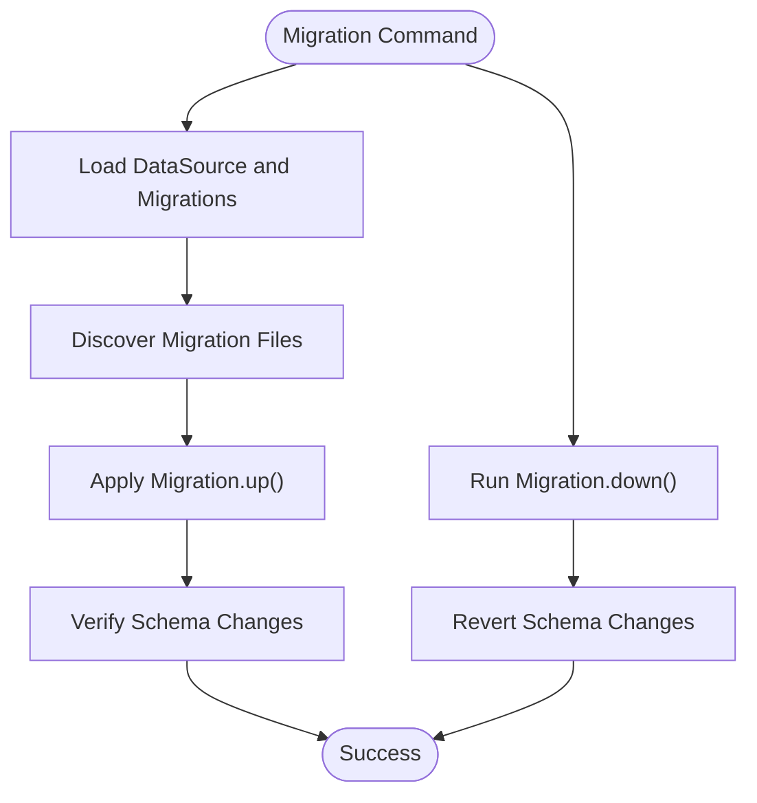
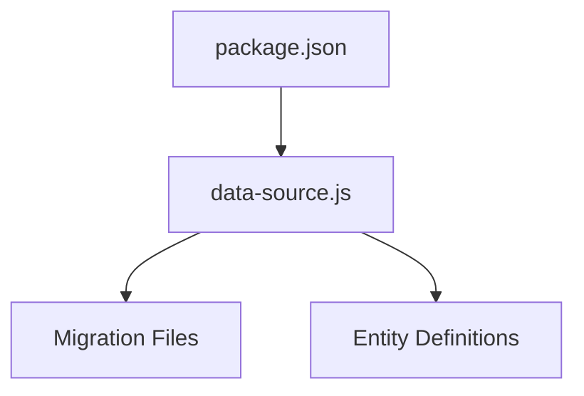

# Migration Management

<cite>
**Referenced Files in This Document**
- [data-source.js](file://src/config/data-source.js)
- [config.js](file://src/config/config.js)
- [server.js](file://src/server.js)
- [package.json](file://package.json)
- [User.js](file://src/entity/User.js)
- [Tenants.js](file://src/entity/Tenants.js)
- [RefreshToken.js](file://src/entity/RefreshToken.js)
- [1773479637906-migration.js](file://src/migration/1773479637906-migration.js)
- [1773660957544-rename_tables.js](file://src/migration/1773660957544-rename_tables.js)
- [1773678089909-create_tenant_table.js](file://src/migration/1773678089909-create_tenant_table.js)
- [1773678973384-add_FK_tenant_table_and_to_user_table.js](file://src/migration/1773678973384-add_FK_tenant_table_and_to_user_table.js)
- [1773681570855-add_nullable_field_to_tenantID.js](file://src/migration/1773681570855-add_nullable_field_to_tenantID.js)
- [create.spec.js](file://src/test/tenant/create.spec.js)
- [create.spec.js](file://src/test/users/create.spec.js)
</cite>

## Table of Contents
1. [Introduction](#introduction)
2. [Project Structure](#project-structure)
3. [Core Components](#core-components)
4. [Architecture Overview](#architecture-overview)
5. [Detailed Component Analysis](#detailed-component-analysis)
6. [Dependency Analysis](#dependency-analysis)
7. [Performance Considerations](#performance-considerations)
8. [Troubleshooting Guide](#troubleshooting-guide)
9. [Conclusion](#conclusion)
10. [Appendices](#appendices)

## Introduction
This document explains the database migration management system in the authentication service. It covers the migration history, execution and rollback mechanisms, version control strategies, and the purpose and impact of each migration script. It also provides best practices, testing strategies, and safe deployment guidance for production environments.

## Project Structure
The migration system is organized under the migration directory and integrated with TypeORM via the data source configuration. Scripts are executed using TypeORM CLI commands defined in the project’s package scripts.

**Diagram sources**
- [data-source.js:8-21](file://src/config/data-source.js#L8-L21)
- [package.json:11-13](file://package.json#L11-L13)
- [server.js:7-19](file://src/server.js#L7-L19)
- [User.js:3-49](file://src/entity/User.js#L3-L49)
- [Tenants.js:3-28](file://src/entity/Tenants.js#L3-L28)
- [RefreshToken.js:3-34](file://src/entity/RefreshToken.js#L3-L34)
- [1773479637906-migration.js:10-33](file://src/migration/1773479637906-migration.js#L10-L33)
- [1773660957544-rename_tables.js:10-30](file://src/migration/1773660957544-rename_tables.js#L10-L30)
- [1773678089909-create_tenant_table.js:10-30](file://src/migration/1773678089909-create_tenant_table.js#L10-L30)
- [1773678973384-add_FK_tenant_table_and_to_user_table.js:10-37](file://src/migration/1773678973384-add_FK_tenant_table_and_to_user_table.js#L10-L37)
- [1773681570855-add_nullable_field_to_tenantID.js:10-30](file://src/migration/1773681570855-add_nullable_field_to_tenantID.js#L10-L30)

**Section sources**
- [data-source.js:8-21](file://src/config/data-source.js#L8-L21)
- [package.json:11-13](file://package.json#L11-L13)
- [server.js:7-19](file://src/server.js#L7-L19)

## Core Components
- TypeORM DataSource: Defines Postgres connection, entities, and migration discovery. Migrations are loaded from the migration directory except in test environments.
- Migration Classes: Each migration is a class implementing up/down methods to apply and revert schema changes.
- Entities: Define table mappings and relationships used by migrations and runtime logic.
- Scripts: TypeORM CLI commands for generating, running, and creating migrations.

Key behaviors:
- Environment-aware migration loading: migrations are disabled in tests and enabled otherwise.
- Synchronization in dev/test: simplifies local development but should not be used in production.
- Rollback safety: each migration includes a down method to revert changes.

**Section sources**
- [data-source.js:8-21](file://src/config/data-source.js#L8-L21)
- [User.js:3-49](file://src/entity/User.js#L3-L49)
- [Tenants.js:3-28](file://src/entity/Tenants.js#L3-L28)
- [RefreshToken.js:3-34](file://src/entity/RefreshToken.js#L3-L34)
- [package.json:11-13](file://package.json#L11-L13)

## Architecture Overview
The migration lifecycle integrates with the application startup and TypeORM CLI.

**Diagram sources**
- [data-source.js:8-21](file://src/config/data-source.js#L8-L21)
- [package.json:11-13](file://package.json#L11-L13)

## Detailed Component Analysis

### Initial Schema Creation (Migration 1)
Purpose:
- Creates the initial users and refresh tokens tables.
- Establishes primary keys and unique constraints on identifiers and emails.
- Adds a foreign key from refresh tokens to users.

Impact:
- Sets baseline schema for authentication.
- Requires unique email enforcement and primary key constraints.

Rollback:
- Drops foreign key, refresh tokens table, and users table in reverse order.

**Section sources**
- [1773479637906-migration.js:10-33](file://src/migration/1773479637906-migration.js#L10-L33)

### Table Renaming (Migration 2)
Purpose:
- Renames the original table identifier to a lowercase variant for consistency.
- Updates foreign key constraints to align with the new table name.

Impact:
- Aligns table naming convention with typical lowercased plural forms.
- Maintains referential integrity.

Rollback:
- Drops foreign key, removes unique constraint, and drops the renamed table.

**Section sources**
- [1773660957544-rename_tables.js:10-30](file://src/migration/1773660957544-rename_tables.js#L10-L30)

### Tenant Table Creation (Migration 3)
Purpose:
- Introduces a tenants table to support multi-tenancy.
- Adds a column to users to link to tenants and establishes a foreign key relationship.

Impact:
- Enables per-tenant user assignment.
- Requires subsequent migrations to refine column constraints and naming.

Rollback:
- Drops foreign key, removes the tenant ID column, and drops the tenants table.

**Section sources**
- [1773678089909-create_tenant_table.js:10-30](file://src/migration/1773678089909-create_tenant_table.js#L10-L30)

### Foreign Key Constraint Addition and Column Renaming (Migration 4)
Purpose:
- Renames the user column linking to tenants from userId to tenantId.
- Enforces NOT NULL on tenantId and updates foreign key constraints accordingly.
- Ensures NOT NULL on the userId column in refresh tokens.

Impact:
- Improves semantic clarity by renaming the column to tenantId.
- Strengthens referential integrity by enforcing NOT NULL constraints.

Rollback:
- Restores previous column name, reverses NOT NULL changes, and re-applies old foreign keys.

**Section sources**
- [1773678973384-add_FK_tenant_table_and_to_user_table.js:10-37](file://src/migration/1773678973384-add_FK_tenant_table_and_to_user_table.js#L10-L37)

### Nullable Tenant ID Adjustment (Migration 5)
Purpose:
- Adjusts the tenantId column to be nullable.
- Re-establishes the foreign key constraint after altering the column.

Impact:
- Allows users without an associated tenant, supporting flexible tenant assignment scenarios.

Rollback:
- Reverses the nullable change and re-applies the foreign key constraint.

**Section sources**
- [1773681570855-add_nullable_field_to_tenantID.js:10-30](file://src/migration/1773681570855-add_nullable_field_to_tenantID.js#L10-L30)

### Migration Execution Flow

**Diagram sources**
- [data-source.js:8-21](file://src/config/data-source.js#L8-L21)
- [package.json:11-13](file://package.json#L11-L13)

## Dependency Analysis
The migration system depends on:
- TypeORM DataSource configuration for environment-specific behavior.
- Entities to reflect current schema expectations.
- Package scripts to trigger migration actions.

**Diagram sources**
- [data-source.js:8-21](file://src/config/data-source.js#L8-L21)
- [package.json:11-13](file://package.json#L11-L13)
- [User.js:3-49](file://src/entity/User.js#L3-L49)
- [Tenants.js:3-28](file://src/entity/Tenants.js#L3-L28)
- [RefreshToken.js:3-34](file://src/entity/RefreshToken.js#L3-L34)

**Section sources**
- [data-source.js:8-21](file://src/config/data-source.js#L8-L21)
- [package.json:11-13](file://package.json#L11-L13)

## Performance Considerations
- Avoid long-running migrations in production; break large changes into smaller steps.
- Use transactions where supported by the underlying database to ensure atomicity.
- Test migrations on staging databases mirroring production schema and data volume.
- Keep migrations deterministic; avoid relying on external state or time-sensitive operations.

## Troubleshooting Guide
Common issues and resolutions:
- Migration fails due to environment mismatch:
  - Ensure migrations are enabled in non-test environments and disabled in tests.
- Conflicts with existing schema:
  - Review the migration order and dependencies; adjust migration timestamps to ensure proper sequencing.
- Rollback errors:
  - Verify that foreign keys and indexes are dropped in reverse dependency order.
- Test environment inconsistencies:
  - Tests rely on synchronization; ensure test database is clean before running migrations.

Operational checks:
- Confirm TypeORM CLI commands are available and configured correctly.
- Validate that the data source connects to the intended database and environment.

**Section sources**
- [data-source.js:8-21](file://src/config/data-source.js#L8-L21)
- [package.json:11-13](file://package.json#L11-L13)

## Conclusion
The authentication service employs a structured migration system using TypeORM to evolve the database schema safely. Each migration encapsulates a specific change with explicit up/down logic, enabling controlled rollouts and recoverability. By adhering to best practices—such as deterministic changes, careful testing, and environment-aware configuration—teams can manage schema evolution reliably across development, staging, and production environments.

## Appendices

### Migration History Summary
- Initial schema creation: establishes users and refresh tokens tables with constraints and a foreign key.
- Table renaming: aligns table naming conventions and updates constraints.
- Tenant table creation: introduces multi-tenancy with a tenants table and user-tenant linkage.
- Constraint and column refinement: renames the tenant link column, enforces NOT NULL, and adjusts foreign keys.
- Nullable tenant ID adjustment: allows optional tenant association.

**Section sources**
- [1773479637906-migration.js:10-33](file://src/migration/1773479637906-migration.js#L10-L33)
- [1773660957544-rename_tables.js:10-30](file://src/migration/1773660957544-rename_tables.js#L10-L30)
- [1773678089909-create_tenant_table.js:10-30](file://src/migration/1773678089909-create_tenant_table.js#L10-L30)
- [1773678973384-add_FK_tenant_table_and_to_user_table.js:10-37](file://src/migration/1773678973384-add_FK_tenant_table_and_to_user_table.js#L10-L37)
- [1773681570855-add_nullable_field_to_tenantID.js:10-30](file://src/migration/1773681570855-add_nullable_field_to_tenantID.js#L10-L30)

### Creating New Migrations
- Generate a new migration file using the provided script.
- Implement up() to apply schema changes and down() to revert them.
- Keep migrations small, focused, and reversible.

**Section sources**
- [package.json:11-13](file://package.json#L11-L13)

### Testing Strategies
- Use test fixtures to initialize a clean database and synchronize entities before running migrations.
- Validate schema changes and data integrity after applying migrations.
- Mock authentication services during tests to isolate migration effects.

**Section sources**
- [create.spec.js:35-52](file://src/test/tenant/create.spec.js#L35-L52)
- [create.spec.js:38-59](file://src/test/users/create.spec.js#L38-L59)

### Deployment Considerations
- Disable automatic synchronization in production; rely on migrations.
- Run migrations as part of the deployment pipeline with rollback plans.
- Back up the database before applying migrations in production.
- Monitor logs and verify schema changes post-deployment.

**Section sources**
- [data-source.js:15-16](file://src/config/data-source.js#L15-L16)
- [server.js:7-19](file://src/server.js#L7-L19)