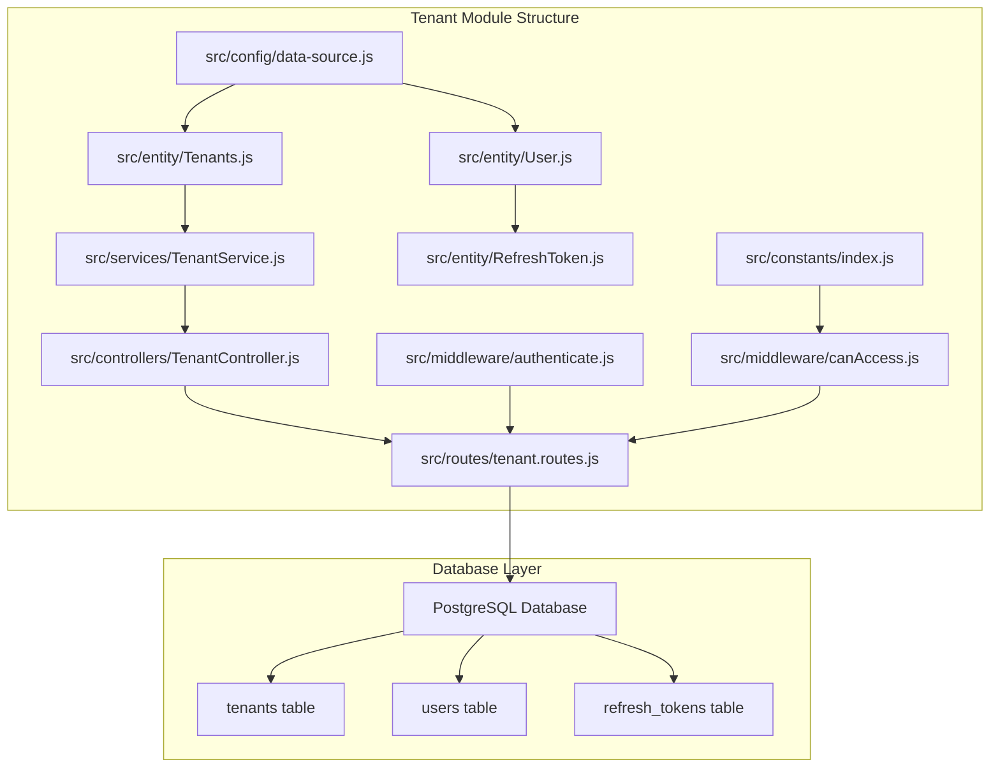
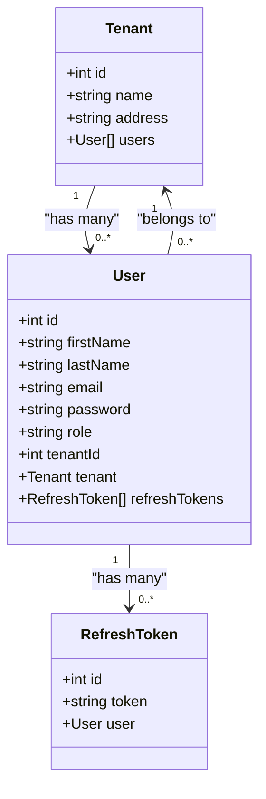
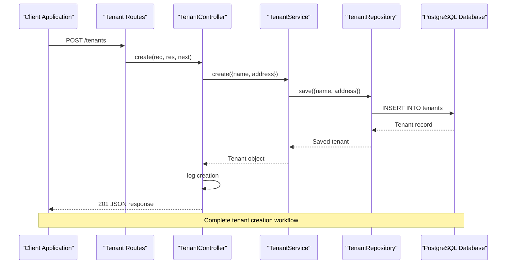
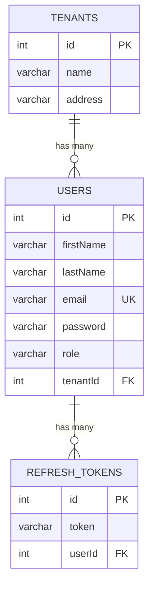
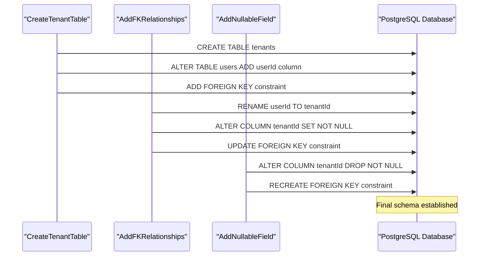
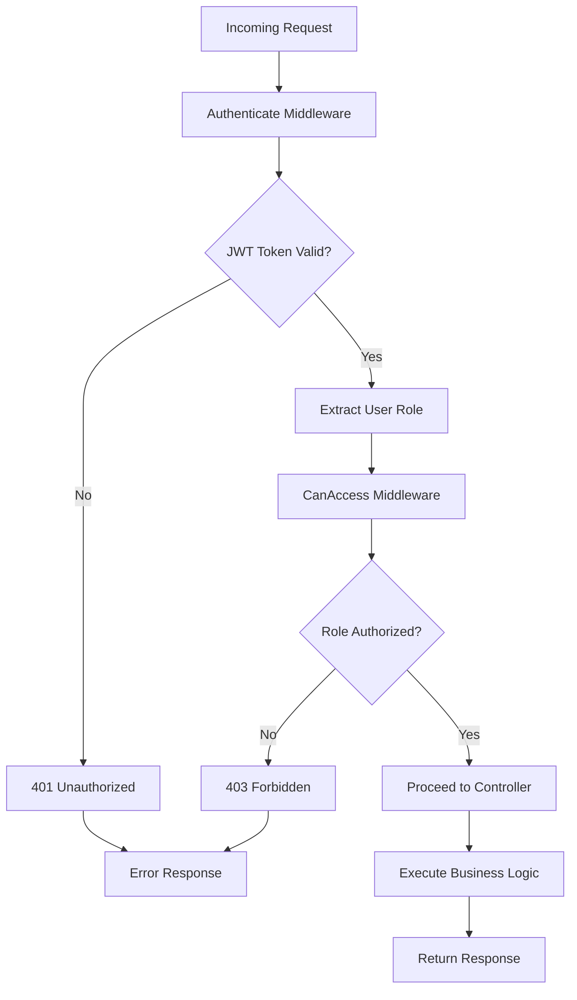
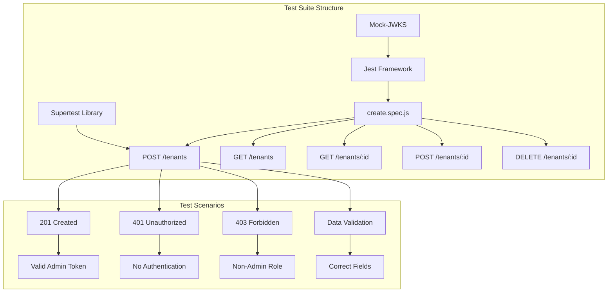

# Tenant Entity Model

<cite>
**Referenced Files in This Document**
- [Tenants.js](file://src/entity/Tenants.js)
- [User.js](file://src/entity/User.js)
- [TenantController.js](file://src/controllers/TenantController.js)
- [TenantService.js](file://src/services/TenantService.js)
- [tenant.routes.js](file://src/routes/tenant.routes.js)
- [data-source.js](file://src/config/data-source.js)
- [authenticate.js](file://src/middleware/authenticate.js)
- [canAccess.js](file://src/middleware/canAccess.js)
- [index.js](file://src/constants/index.js)
- [1773678089909-create_tenant_table.js](file://src/migration/1773678089909-create_tenant_table.js)
- [1773678973384-add_FK_tenant_table_and_to_user_table.js](file://src/migration/1773678973384-add_FK_tenant_table_and_to_user_table.js)
- [1773681570855-add_nullable_field_to_tenantID.js](file://src/migration/1773681570855-add_nullable_field_to_tenantID.js)
- [create.spec.js](file://src/test/tenant/create.spec.js)
</cite>

## Table of Contents
1. [Introduction](#introduction)
2. [Project Structure](#project-structure)
3. [Core Components](#core-components)
4. [Architecture Overview](#architecture-overview)
5. [Detailed Component Analysis](#detailed-component-analysis)
6. [Entity Relationship Analysis](#entity-relationship-analysis)
7. [Database Schema Evolution](#database-schema-evolution)
8. [Security and Access Control](#security-and-access-control)
9. [Testing Strategy](#testing-strategy)
10. [Performance Considerations](#performance-considerations)
11. [Troubleshooting Guide](#troubleshooting-guide)
12. [Conclusion](#conclusion)

## Introduction

The Tenant Entity Model represents a fundamental component of the authentication service, enabling multi-tenancy capabilities within the system. This model manages tenant information including name and address, establishes relationships with users, and provides comprehensive CRUD operations through a well-structured MVC architecture.

The tenant model serves as a cornerstone for the application's ability to support multiple organizations or clients within a single instance, allowing for isolated data management while maintaining shared infrastructure resources.

## Project Structure

The tenant functionality is organized within a clear MVC (Model-View-Controller) architecture following modern Express.js patterns:



**Diagram sources**
- [tenant.routes.js:1-45](file://src/routes/tenant.routes.js#L1-L45)
- [data-source.js:1-22](file://src/config/data-source.js#L1-L22)

**Section sources**
- [tenant.routes.js:1-45](file://src/routes/tenant.routes.js#L1-L45)
- [data-source.js:1-22](file://src/config/data-source.js#L1-L22)

## Core Components

### Tenant Entity Definition

The Tenant entity is defined using TypeORM's EntitySchema pattern, establishing a robust foundation for tenant data management:



**Diagram sources**
- [Tenants.js:1-29](file://src/entity/Tenants.js#L1-L29)
- [User.js:1-50](file://src/entity/User.js#L1-L50)

### Tenant Service Layer

The TenantService provides comprehensive CRUD operations with proper error handling and data validation:

| Method | Purpose | HTTP Status | Input Validation |
|--------|---------|-------------|------------------|
| `create()` | Creates new tenant | 201 | Name, Address required |
| `getAllTenants()` | Retrieves all tenants | 200 | None |
| `getTenantById()` | Fetches specific tenant | 200/404 | ID parameter |
| `updateTenant()` | Updates existing tenant | 200 | Partial updates allowed |
| `deleteTenantById()` | Removes tenant | 200/404 | ID parameter |

**Section sources**
- [TenantService.js:1-66](file://src/services/TenantService.js#L1-L66)
- [TenantController.js:1-76](file://src/controllers/TenantController.js#L1-L76)

## Architecture Overview

The tenant module follows a layered architecture pattern with clear separation of concerns:



**Diagram sources**
- [tenant.routes.js:16-21](file://src/routes/tenant.routes.js#L16-L21)
- [TenantController.js:11-22](file://src/controllers/TenantController.js#L11-L22)
- [TenantService.js:7-14](file://src/services/TenantService.js#L7-L14)

**Section sources**
- [tenant.routes.js:1-45](file://src/routes/tenant.routes.js#L1-L45)
- [TenantController.js:1-76](file://src/controllers/TenantController.js#L1-L76)

## Detailed Component Analysis

### Tenant Entity Implementation

The Tenant entity definition establishes the foundational data structure with comprehensive field specifications:

| Field | Type | Constraints | Description |
|-------|------|-------------|-------------|
| `id` | Integer | Primary Key, Auto-increment | Unique identifier for each tenant |
| `name` | String | VARCHAR(100), Required | Tenant organization name |
| `address` | String | VARCHAR(255), Required | Physical or mailing address |

The entity establishes a one-to-many relationship with the User entity, enabling tenant isolation and user management within organizational boundaries.

**Section sources**
- [Tenants.js:3-28](file://src/entity/Tenants.js#L3-L28)

### Controller Layer Implementation

The TenantController handles HTTP requests and implements comprehensive error handling:

```mermaid
flowchart TD
A[HTTP Request Received] --> B{Route Handler}
B --> C[create/getAll/getTenant/updateTenant/deleteTenant]
C --> D[Extract Request Data]
D --> E[Call TenantService Method]
E --> F{Service Operation Success}
F --> |Success| G[Return JSON Response]
F --> |Error| H[Call next(err)]
H --> I[Global Error Handler]
I --> J[Log Error & Send 500 Response]
G --> K[Set Appropriate HTTP Status]
K --> L[Response Sent]
```

**Diagram sources**
- [TenantController.js:11-75](file://src/controllers/TenantController.js#L11-L75)

**Section sources**
- [TenantController.js:1-76](file://src/controllers/TenantController.js#L1-L76)

### Service Layer Implementation

The TenantService provides business logic with robust error handling and data validation:

```mermaid
flowchart TD
A[Service Method Called] --> B[Try Block]
B --> C{Operation Type}
C --> |create| D[tenantRepository.save()]
C --> |getAll| E[tenantRepository.find({})]
C --> |getById| F[tenantRepository.findOne({id})]
C --> |update| G[Find tenant -> Update fields -> Save]
C --> |delete| H[Find tenant -> Validate existence -> Delete]
D --> I{Database Success}
E --> I
F --> I
G --> I
H --> I
I --> |Success| J[Return Data]
I --> |Failure| K[Throw HTTP Error]
K --> L[Error caught by controller]
```

**Diagram sources**
- [TenantService.js:7-64](file://src/services/TenantService.js#L7-L64)

**Section sources**
- [TenantService.js:1-66](file://src/services/TenantService.js#L1-L66)

## Entity Relationship Analysis

The tenant-user relationship establishes a many-to-one cardinality pattern with foreign key constraints:



**Diagram sources**
- [User.js:30-47](file://src/entity/User.js#L30-L47)
- [Tenants.js:21-27](file://src/entity/Tenants.js#L21-L27)

### Relationship Features

- **Tenant-User Relationship**: One tenant can have multiple users, but each user belongs to exactly one tenant
- **Cascade Management**: Foreign key constraints ensure referential integrity
- **Optional Tenant Assignment**: Users can exist without tenant assignment (nullable tenantId)
- **Reverse Navigation**: Both directions of relationship are accessible through entity properties

**Section sources**
- [User.js:36-48](file://src/entity/User.js#L36-L48)
- [Tenants.js:21-27](file://src/entity/Tenants.js#L21-L27)

## Database Schema Evolution

The database schema has evolved through several migration steps to establish the current tenant-user relationship:



**Diagram sources**
- [1773678089909-create_tenant_table.js:16-20](file://src/migration/1773678089909-create_tenant_table.js#L16-L20)
- [1773678973384-add_FK_tenant_table_and_to_user_table.js:17-23](file://src/migration/1773678973384-add_FK_tenant_table_and_to_user_table.js#L17-L23)
- [1773681570855-add_nullable_field_to_tenantID.js:17-19](file://src/migration/1773681570855-add_nullable_field_to_tenantID.js#L17-L19)

### Migration Timeline

| Migration | Purpose | Key Changes |
|-----------|---------|-------------|
| 1773678089909 | Initial Setup | Creates tenants table, adds userId column to users |
| 1773678973384 | Relationship Establishment | Renames userId to tenantId, sets NOT NULL |
| 1773681570855 | Flexibility Enhancement | Makes tenantId nullable for user management |

**Section sources**
- [1773678089909-create_tenant_table.js:1-31](file://src/migration/1773678089909-create_tenant_table.js#L1-L31)
- [1773678973384-add_FK_tenant_table_and_to_user_table.js:1-39](file://src/migration/1773678973384-add_FK_tenant_table_and_to_user_table.js#L1-L39)
- [1773681570855-add_nullable_field_to_tenantID.js:1-31](file://src/migration/1773681570855-add_nullable_field_to_tenantID.js#L1-L31)

## Security and Access Control

The tenant module implements comprehensive security measures through middleware layers:



**Diagram sources**
- [authenticate.js:6-25](file://src/middleware/authenticate.js#L6-L25)
- [canAccess.js:4-22](file://src/middleware/canAccess.js#L4-L22)

### Security Features

- **JWT Authentication**: Uses RS256 algorithm with JWKS URI for token verification
- **Role-Based Access Control**: Restricts tenant operations to ADMIN role only
- **Token Extraction**: Supports both Authorization header and Cookie-based tokens
- **Caching**: Implements token caching for improved performance

**Section sources**
- [authenticate.js:1-26](file://src/middleware/authenticate.js#L1-L26)
- [canAccess.js:1-23](file://src/middleware/canAccess.js#L1-L23)
- [tenant.routes.js:16-42](file://src/routes/tenant.routes.js#L16-L42)

## Testing Strategy

The tenant module includes comprehensive testing covering all CRUD operations and security scenarios:



**Diagram sources**
- [create.spec.js:17-106](file://src/test/tenant/create.spec.js#L17-L106)

### Test Coverage Areas

| Test Category | Coverage | Expected Outcome |
|---------------|----------|------------------|
| Authentication | 401 Unauthorized | Requests without tokens fail |
| Authorization | 403 Forbidden | Non-admin roles blocked |
| Creation | 201 Created | Valid tenant data accepted |
| Retrieval | 200 OK | Tenant data accessible |
| Validation | Data Integrity | Correct field values preserved |

**Section sources**
- [create.spec.js:1-106](file://src/test/tenant/create.spec.js#L1-L106)

## Performance Considerations

### Database Optimization

- **Indexing Strategy**: Primary keys automatically indexed by PostgreSQL
- **Connection Pooling**: TypeORM DataSource configured for optimal connections
- **Query Optimization**: Direct repository operations minimize overhead
- **Caching**: JWT token caching reduces verification latency

### Memory Management

- **Entity Lifecycle**: Proper disposal of TypeORM entities
- **Middleware Chain**: Efficient request processing pipeline
- **Error Handling**: Prevents memory leaks through proper error propagation

## Troubleshooting Guide

### Common Issues and Solutions

| Issue | Symptoms | Solution |
|-------|----------|----------|
| 401 Unauthorized | Authentication failures | Verify JWT token validity and expiration |
| 403 Forbidden | Access denied errors | Ensure user has ADMIN role |
| 500 Internal Server Error | Service failures | Check database connectivity and entity definitions |
| 404 Not Found | Tenant not found | Verify tenant ID format and existence |

### Debugging Steps

1. **Enable Logging**: Check application logs for detailed error messages
2. **Database Verification**: Confirm tenant records exist in database
3. **Token Validation**: Verify JWT token signature and claims
4. **Role Verification**: Ensure user role matches required permissions

**Section sources**
- [tenant.routes.js:16-42](file://src/routes/tenant.routes.js#L16-L42)
- [TenantController.js:38-42](file://src/controllers/TenantController.js#L38-L42)

## Conclusion

The Tenant Entity Model provides a robust foundation for multi-tenancy within the authentication service. Through careful architectural design, comprehensive security measures, and thorough testing, the system successfully manages tenant data while maintaining scalability and maintainability.

Key strengths include:
- Clear separation of concerns through MVC architecture
- Comprehensive security implementation with JWT and RBAC
- Well-defined entity relationships with proper foreign key constraints
- Extensive test coverage ensuring reliability
- Evolvable database schema supporting future enhancements

The modular design allows for easy extension and maintenance while providing a solid foundation for multi-tenant applications requiring secure user management and organization isolation.