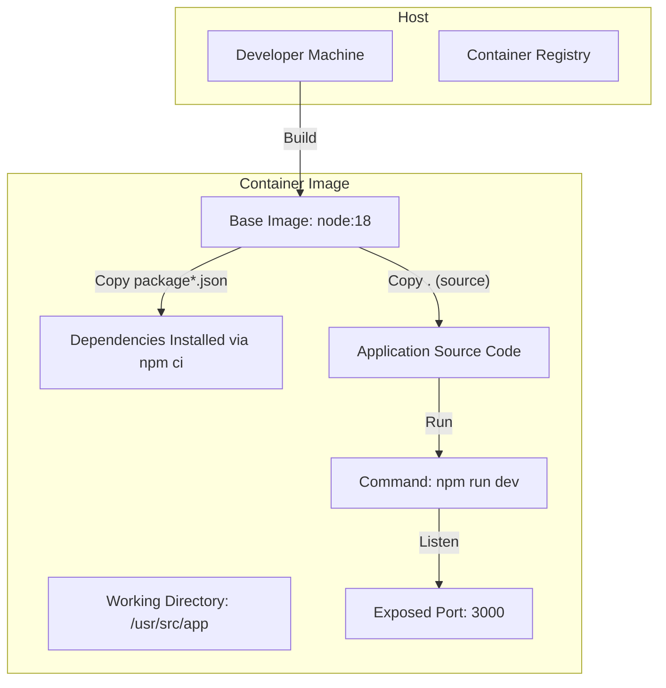
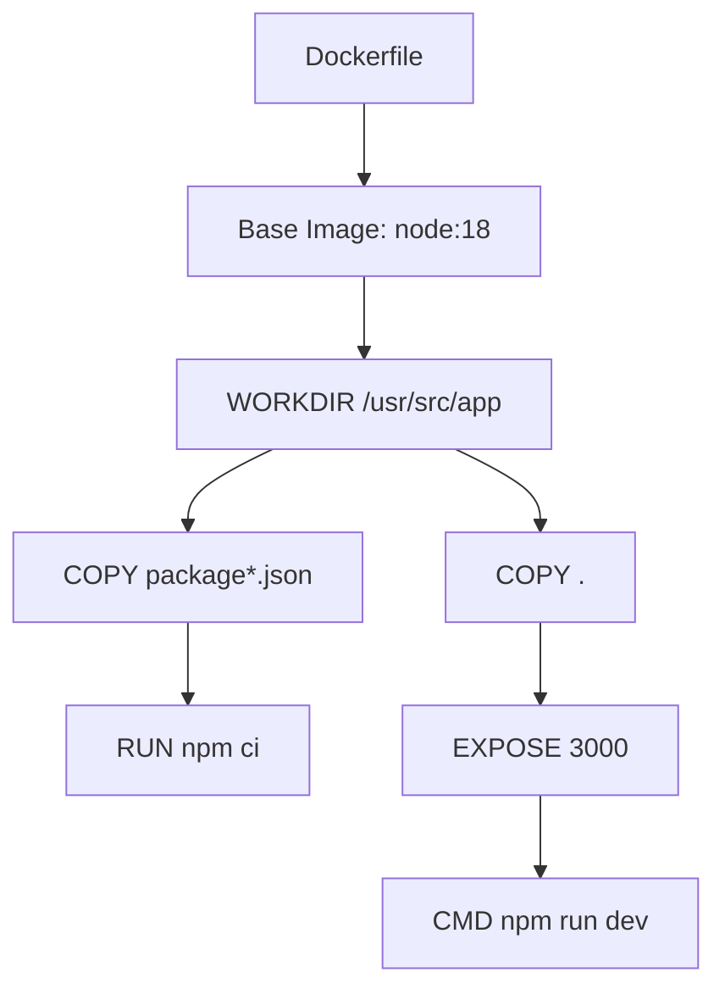
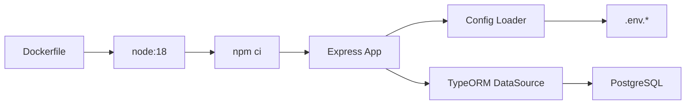

# Containerization

<cite>
**Referenced Files in This Document**
- [Dockerfile](file://docker/Dockerfile)
- [.dockerignore](file://.dockerignore)
- [package.json](file://package.json)
- [README.md](file://README.md)
- [src/server.js](file://src/server.js)
- [src/app.js](file://src/app.js)
- [src/config/config.js](file://src/config/config.js)
- [src/config/data-source.js](file://src/config/data-source.js)
- [src/config/logger.js](file://src/config/logger.js)
</cite>

## Table of Contents
1. [Introduction](#introduction)
2. [Project Structure](#project-structure)
3. [Core Components](#core-components)
4. [Architecture Overview](#architecture-overview)
5. [Detailed Component Analysis](#detailed-component-analysis)
6. [Dependency Analysis](#dependency-analysis)
7. [Performance Considerations](#performance-considerations)
8. [Troubleshooting Guide](#troubleshooting-guide)
9. [Conclusion](#conclusion)
10. [Appendices](#appendices)

## Introduction
This document provides comprehensive containerization guidance for the authentication service. It explains the current Dockerfile configuration, outlines a multi-stage build strategy for optimization, documents ignore patterns, and provides practical examples for building, running, and managing containers. It also covers security best practices, resource limits, networking configuration, and deployment automation workflows tailored to the service’s Node.js and PostgreSQL stack.

## Project Structure
The authentication service is a Node.js application using Express and TypeORM with PostgreSQL. The containerization artifacts are located under the docker directory and include a Dockerfile and a .dockerignore file. The application entrypoint initializes the database connection and starts the Express server.

**Diagram sources**
- [Dockerfile:1-21](file://docker/Dockerfile#L1-L21)
- [src/server.js:1-21](file://src/server.js#L1-L21)

**Section sources**
- [Dockerfile:1-21](file://docker/Dockerfile#L1-L21)
- [README.md:1-8](file://README.md#L1-L8)

## Core Components
- Dockerfile: Defines the base image, working directory, dependency installation, source code copy, exposed port, and startup command.
- .dockerignore: Specifies files and directories to exclude from the Docker build context.
- package.json: Declares Node.js runtime, dependencies, and scripts used during development and testing.
- Application entrypoint: Initializes the database via TypeORM and starts the Express server on a configurable port.

Key observations:
- The Dockerfile uses the official Node.js 18 base image and runs the development script.
- The application reads environment variables for configuration and database connectivity.
- The server listens on a port derived from configuration, defaulting to a non-standard port in the code.

**Section sources**
- [Dockerfile:1-21](file://docker/Dockerfile#L1-L21)
- [.dockerignore:1-4](file://.dockerignore#L1-L4)
- [package.json:1-48](file://package.json#L1-L48)
- [src/server.js:1-21](file://src/server.js#L1-L21)
- [src/config/config.js:1-34](file://src/config/config.js#L1-L34)
- [src/config/data-source.js:1-22](file://src/config/data-source.js#L1-L22)

## Architecture Overview
The containerized authentication service follows a straightforward layered approach:
- Base OS layer: Official Node.js 18 image.
- Dependencies layer: npm ci installs production-ready dependencies.
- Application layer: Source code copied into the container.
- Runtime layer: Express server started by the development script.

**Diagram sources**
- [Dockerfile:1-21](file://docker/Dockerfile#L1-L21)

## Detailed Component Analysis

### Dockerfile Configuration
- Base image selection: Uses the official Node.js 18 image to ensure compatibility with modern JavaScript features and Node APIs.
- Working directory: Sets the application directory to /usr/src/app for clarity and consistency.
- Dependency installation: Copies package.json and package-lock.json first to leverage Docker layer caching, then runs npm ci for deterministic installs.
- Source code inclusion: Copies the entire application tree into the container.
- Port exposure: Exposes port 3000 for container networking.
- Startup command: Runs the development script, which uses nodemon for hot reloading during development.

Optimization opportunities:
- Multi-stage build: Separate build and runtime stages to reduce image size and attack surface.
- Non-root user: Run the application as a non-root user for security.
- Environment-specific builds: Use separate Dockerfiles or build args for dev/prod.

Security considerations:
- Avoid copying unnecessary files; rely on .dockerignore.
- Pin dependency versions and rebuild regularly.
- Use read-only root filesystem and drop unnecessary capabilities where possible.

Networking:
- The container exposes port 3000. Map it appropriately in compose or orchestration platforms.
- Configure the application to bind to 0.0.0.0 inside the container for external access.

**Section sources**
- [Dockerfile:1-21](file://docker/Dockerfile#L1-L21)
- [.dockerignore:1-4](file://.dockerignore#L1-L4)

### Multi-Stage Build Strategy
Proposed approach:
- Stage 1 (Builder): Use the Node.js 18 base image, install dependencies, and compile assets if applicable.
- Stage 2 (Runtime): Use a minimal Node.js or Alpine-based image, copy only necessary runtime files, and run the application as a non-root user.

Benefits:
- Smaller runtime image reduces attack surface and improves pull times.
- Cleaner separation between build-time and runtime dependencies.

Implementation outline:
- Replace the current single-stage Dockerfile with two stages.
- Copy built artifacts or only runtime dependencies to the runtime stage.
- Set a non-root user and restrict filesystem permissions.

[No sources needed since this section proposes a strategy not yet implemented]

### .dockerignore Patterns
Current exclusions:
- node_modules: Prevents local node_modules from overriding installed dependencies.
- npm-debug.log: Avoids noisy logs in the build context.
- .env: Keeps secrets out of the image.

Recommendations:
- Add logs/, coverage/, and test artifacts directories to keep the image lean.
- Exclude .git, .github, and CI configuration files.
- Consider excluding large binary assets or temporary files.

**Section sources**
- [.dockerignore:1-4](file://.dockerignore#L1-L4)

### Application Startup and Configuration
- Entry point: src/server.js initializes the database via TypeORM and starts the Express app.
- Configuration: src/config/config.js loads environment variables from a file named according to NODE_ENV.
- Database: src/config/data-source.js configures PostgreSQL connection and migrations.
- Logging: src/config/logger.js sets up Winston transports for file and console output.

Operational notes:
- Ensure environment variables for database credentials and ports are provided at runtime.
- The server defaults to a non-standard port in the code; align container port mapping accordingly.

**Section sources**
- [src/server.js:1-21](file://src/server.js#L1-L21)
- [src/app.js:1-40](file://src/app.js#L1-L40)
- [src/config/config.js:1-34](file://src/config/config.js#L1-L34)
- [src/config/data-source.js:1-22](file://src/config/data-source.js#L1-L22)
- [src/config/logger.js:1-42](file://src/config/logger.js#L1-L42)

### Practical Examples

#### Building the Image
- Build command: docker build -t auth-service:latest -f docker/Dockerfile .
- Tagging: Use semantic versions (e.g., auth-service:v1.0.0) for releases.

#### Running the Container
- Basic run: docker run -d --name auth-container -p 3000:3000 auth-service:latest
- With environment variables: docker run -d --name auth-container -p 3000:3000 -e NODE_ENV=dev auth-service:latest
- Mount logs directory: docker run -d --name auth-container -p 3000:3000 -v ./logs:/usr/src/app/logs auth-service:latest

#### Managing Containers
- View logs: docker logs -f auth-container
- Inspect: docker inspect auth-container
- Stop/remove: docker stop auth-container && docker rm auth-container

[No sources needed since this section provides general operational guidance]

## Dependency Analysis
The container depends on:
- Base image: node:18
- Application runtime: Express server
- Database connectivity: PostgreSQL via TypeORM
- Environment configuration: .env files loaded by dotenv

**Diagram sources**
- [Dockerfile:1-21](file://docker/Dockerfile#L1-L21)
- [src/config/config.js:1-34](file://src/config/config.js#L1-L34)
- [src/config/data-source.js:1-22](file://src/config/data-source.js#L1-L22)

**Section sources**
- [Dockerfile:1-21](file://docker/Dockerfile#L1-L21)
- [package.json:1-48](file://package.json#L1-L48)
- [src/config/config.js:1-34](file://src/config/config.js#L1-L34)
- [src/config/data-source.js:1-22](file://src/config/data-source.js#L1-L22)

## Performance Considerations
- Layer caching: Keep package.json and package-lock.json unchanged to reuse dependency layers.
- Image size: Prefer multi-stage builds and minimal base images to reduce size and improve cold start times.
- Resource limits: Set CPU and memory limits in orchestrators to prevent noisy neighbor issues.
- Health checks: Add a health endpoint to enable readiness/liveness probes.
- Database connections: Tune pool sizes and timeouts in TypeORM configuration for containerized environments.

[No sources needed since this section provides general guidance]

## Troubleshooting Guide
Common issues and resolutions:
- Port conflicts: Ensure the host port 3000 is free or change the mapping.
- Database connectivity: Verify DB_HOST, DB_PORT, DB_USERNAME, DB_PASSWORD, and DB_NAME are set and reachable from the container.
- Missing environment files: Confirm .env.dev or .env.test exists and is mounted or copied into the container.
- Permission denied errors: Run as a non-root user and ensure log directories are writable.
- Slow startup: Check database initialization logs and network latency.

**Section sources**
- [src/server.js:1-21](file://src/server.js#L1-L21)
- [src/config/config.js:1-34](file://src/config/config.js#L1-L34)
- [src/config/data-source.js:1-22](file://src/config/data-source.js#L1-L22)
- [src/config/logger.js:1-42](file://src/config/logger.js#L1-L42)

## Conclusion
The current Dockerfile provides a functional container for the authentication service. By adopting a multi-stage build, enforcing security hardening, and refining environment management, the service can achieve smaller, more secure, and more reliable deployments. Align container networking and resource limits with your platform’s best practices, and automate builds and pushes to a container registry for repeatable deployments.

## Appendices

### Security Best Practices
- Use non-root users and minimal base images.
- Scan images regularly and pin base image versions.
- Restrict filesystem writes and drop unnecessary Linux capabilities.
- Store secrets externally (e.g., secret managers) and mount them read-only.

### Networking Configuration
- Expose port 3000 in the container and map it to a host port.
- Configure the application to listen on 0.0.0.0 for external access.
- Use overlay networks in orchestrators and configure service discovery.

### Container Registry and Deployment Automation
- Tag images with semantic versions and short commit hashes.
- Push to a registry (e.g., Docker Hub, AWS ECR, GitHub Packages).
- Automate builds on commits and promote images through environments.

[No sources needed since this section provides general guidance]