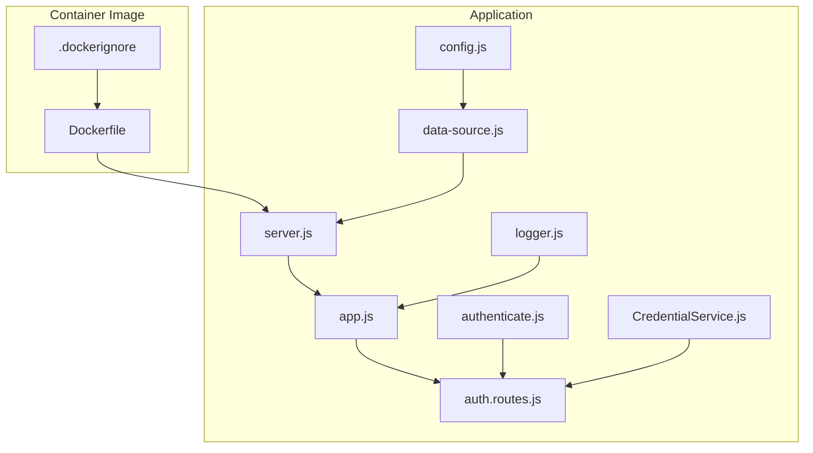
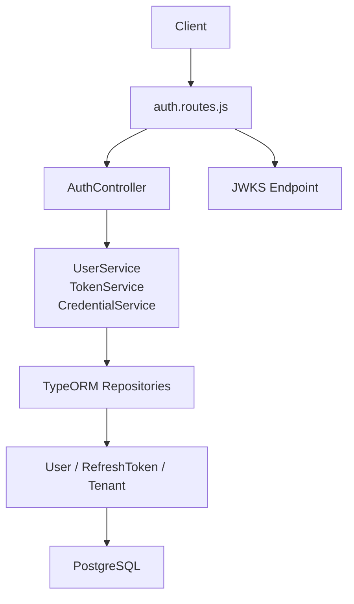
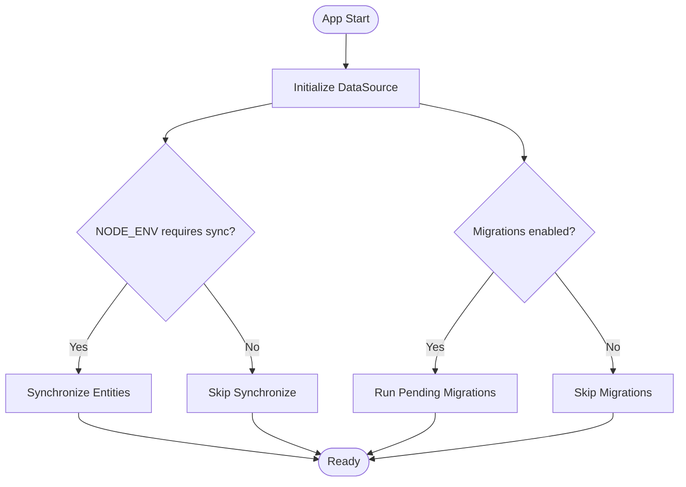
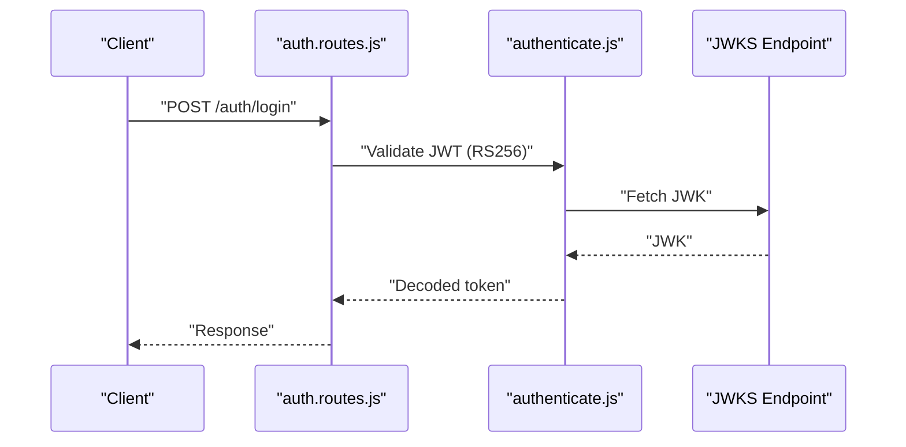
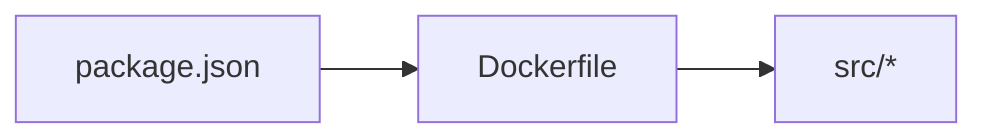

# Deployment and Operations

<cite>
**Referenced Files in This Document**
- [package.json](file://package.json)
- [Dockerfile](file://docker/Dockerfile)
- [.dockerignore](file://.dockerignore)
- [config.js](file://src/config/config.js)
- [data-source.js](file://src/config/data-source.js)
- [logger.js](file://src/config/logger.js)
- [server.js](file://src/server.js)
- [app.js](file://src/app.js)
- [auth.routes.js](file://src/routes/auth.routes.js)
- [authenticate.js](file://src/middleware/authenticate.js)
- [CredentialService.js](file://src/services/CredentialService.js)
- [1773479637906-migration.js](file://src/migration/1773479637906-migration.js)
- [README.md](file://README.md)
</cite>

## Table of Contents
1. [Introduction](#introduction)
2. [Project Structure](#project-structure)
3. [Core Components](#core-components)
4. [Architecture Overview](#architecture-overview)
5. [Detailed Component Analysis](#detailed-component-analysis)
6. [Dependency Analysis](#dependency-analysis)
7. [Performance Considerations](#performance-considerations)
8. [Troubleshooting Guide](#troubleshooting-guide)
9. [Conclusion](#conclusion)
10. [Appendices](#appendices)

## Introduction
This document provides comprehensive deployment and operations guidance for the authentication service. It covers containerization with Docker, environment configuration across development, staging, and production, production hardening and performance tuning, database deployment and migrations, logging and monitoring, health checks, alerting, troubleshooting, scaling, and operational runbooks.

## Project Structure
The service is a Node.js/Express application using TypeScript-style modules and TypeORM for PostgreSQL persistence. Key runtime entry points and configuration are located under src/, with Docker assets under docker/.

**Diagram sources**
- [Dockerfile:1-21](file://docker/Dockerfile#L1-L21)
- [.dockerignore:1-4](file://.dockerignore#L1-L4)
- [server.js:1-21](file://src/server.js#L1-L21)
- [app.js:1-40](file://src/app.js#L1-L40)
- [config.js:1-34](file://src/config/config.js#L1-L34)
- [data-source.js:1-22](file://src/config/data-source.js#L1-L22)
- [logger.js:1-42](file://src/config/logger.js#L1-L42)
- [auth.routes.js:1-49](file://src/routes/auth.routes.js#L1-L49)
- [authenticate.js:1-26](file://src/middleware/authenticate.js#L1-L26)
- [CredentialService.js:1-7](file://src/services/CredentialService.js#L1-L7)

**Section sources**
- [README.md:1-8](file://README.md#L1-L8)
- [package.json:1-48](file://package.json#L1-L48)

## Core Components
- Containerization: Single-stage Dockerfile using Node.js 18 base image, installs dependencies via npm ci, copies source, exposes port 3000, and runs the dev script.
- Environment configuration: Loads environment-specific .env files based on NODE_ENV and exposes configuration via Config export.
- Database: PostgreSQL via TypeORM DataSource configured from environment variables; migrations enabled except in test.
- Logging: Winston-based logger with file and console transports; production silences file transports.
- Application bootstrap: Initializes TypeORM, starts Express server, and logs startup info.
- Authentication: JWT validation via JWKS URI with express-jwt and jwks-rsa; supports Authorization header and cookies.
- Routes: Registration, login, self profile, token refresh, and logout endpoints wired to controllers and services.

**Section sources**
- [Dockerfile:1-21](file://docker/Dockerfile#L1-L21)
- [.dockerignore:1-4](file://.dockerignore#L1-L4)
- [config.js:1-34](file://src/config/config.js#L1-L34)
- [data-source.js:1-22](file://src/config/data-source.js#L1-L22)
- [logger.js:1-42](file://src/config/logger.js#L1-L42)
- [server.js:1-21](file://src/server.js#L1-L21)
- [authenticate.js:1-26](file://src/middleware/authenticate.js#L1-L26)
- [auth.routes.js:1-49](file://src/routes/auth.routes.js#L1-L49)

## Architecture Overview
The service follows a layered architecture: Express app composes routers, controllers, services, and repositories backed by TypeORM entities. Authentication middleware validates tokens against a JWKS endpoint. Database initialization occurs at startup.

**Diagram sources**
- [auth.routes.js:1-49](file://src/routes/auth.routes.js#L1-L49)
- [authenticate.js:1-26](file://src/middleware/authenticate.js#L1-L26)
- [data-source.js:1-22](file://src/config/data-source.js#L1-L22)

## Detailed Component Analysis

### Containerization and Orchestration
- Base image: Official Node.js 18 slim image.
- Working directory and dependency installation: Copies package*.json first for cache efficiency, then runs npm ci.
- Source copy and exposure: Copies application source and exposes port 3000.
- Command: Starts the app using the dev script, which sets NODE_ENV and runs nodemon.
- Multi-stage build recommendation: Not currently implemented; consider adding a builder stage with npm ci and a minimal runtime stage to reduce attack surface and image size.
- Orchestration: No Kubernetes/OpenShift manifests included; define Deployment/Service/ConfigMap/Secret resources to manage replicas, environment injection, and persistent volumes for logs if needed.

Operational notes:
- Use separate .env files per environment (.env.dev, .env.staging, .env.prod) loaded by config.js.
- Mount logs directory as a volume for log aggregation.
- Configure liveness/readiness probes pointing to the root endpoint.

**Section sources**
- [Dockerfile:1-21](file://docker/Dockerfile#L1-L21)
- [.dockerignore:1-4](file://.dockerignore#L1-L4)
- [config.js:1-34](file://src/config/config.js#L1-L34)

### Environment Setup
- Development: NODE_ENV=dev loads .env.dev; database synchronization enabled for local iteration.
- Staging/Production: NODE_ENV=staging/prod load .env.staging/.env.prod; synchronize disabled; migrations applied at startup.
- Required variables: PORT, DB_HOST, DB_PORT, DB_NAME, DB_USERNAME, DB_PASSWORD, PRIVATE_KEY_SECRET, JWKS_URI.

Security and compliance:
- Keep secrets out of images; inject via environment variables or secret managers.
- Disable synchronize in non-test environments.

**Section sources**
- [config.js:1-34](file://src/config/config.js#L1-L34)
- [data-source.js:1-22](file://src/config/data-source.js#L1-L22)

### Production Configuration Requirements
- Security hardening:
  - Enforce HTTPS termination at ingress/load balancer; set secure flags on cookies.
  - Restrict CORS origins to trusted domains.
  - Rotate PRIVATE_KEY_SECRET and JWKS keys regularly.
  - Limit exposed ports and disable shell access in containers.
- Performance tuning:
  - Use production Node.js flags and keep-alive connections.
  - Tune PostgreSQL connection pool size and timeouts.
  - Enable compression and caching at reverse proxy.
- Monitoring:
  - Export metrics via Prometheus-compatible libraries.
  - Centralize logs to a SIEM or log aggregator.

[No sources needed since this section provides general guidance]

### Database Deployment, Migrations, and Rollback
- Initialization: AppDataSource initializes at startup; synchronize is disabled outside test/stage/dev.
- Migrations:
  - Migration scripts are discovered automatically except in test.
  - Use the provided scripts to generate and run migrations.
- Rollback:
  - Prefer forward-only migrations with safe down methods where applicable.
  - Maintain backups and test rollback procedures in staging before production.

**Diagram sources**
- [data-source.js:1-22](file://src/config/data-source.js#L1-L22)

**Section sources**
- [data-source.js:1-22](file://src/config/data-source.js#L1-L22)
- [package.json:11-13](file://package.json#L11-L13)
- [1773479637906-migration.js:1-34](file://src/migration/1773479637906-migration.js#L1-L34)

### Logging and Monitoring
- Winston transports:
  - File transport for combined and error logs; silenced in prod.
  - Console transport for stdout/stderr.
- Recommendations:
  - Ship logs to a centralized collector (e.g., ELK, Loki).
  - Add structured context (request ID, user ID) to logs.
  - Define log levels per environment.

Health checks:
- Root endpoint returns a simple JSON message indicating service availability.
- Implement readiness/liveness probes against the root endpoint.

Alerting:
- Alert on elevated error rates, latency p95, and failed health checks.
- Integrate with PagerDuty or similar for on-call notifications.

**Section sources**
- [logger.js:1-42](file://src/config/logger.js#L1-L42)
- [app.js:13-17](file://src/app.js#L13-L17)

### Authentication Flow

**Diagram sources**
- [auth.routes.js:33-35](file://src/routes/auth.routes.js#L33-L35)
- [authenticate.js:6-25](file://src/middleware/authenticate.js#L6-L25)

**Section sources**
- [auth.routes.js:1-49](file://src/routes/auth.routes.js#L1-L49)
- [authenticate.js:1-26](file://src/middleware/authenticate.js#L1-L26)

### Password Validation Service
- Uses bcrypt to compare plaintext passwords against stored hashes.

**Section sources**
- [CredentialService.js:1-7](file://src/services/CredentialService.js#L1-L7)

## Dependency Analysis
- Runtime dependencies include Express, TypeORM, PostgreSQL driver, JWT libraries, and logging.
- Scripts orchestrate linting, testing, and migrations.
- Dockerfile depends on package.json and source tree.

**Diagram sources**
- [package.json:1-48](file://package.json#L1-L48)
- [Dockerfile:1-21](file://docker/Dockerfile#L1-L21)

**Section sources**
- [package.json:1-48](file://package.json#L1-L48)
- [Dockerfile:1-21](file://docker/Dockerfile#L1-L21)

## Performance Considerations
- Container sizing: Set CPU/memory requests/limits; enable horizontal pod autoscaling based on CPU or custom metrics.
- Database: Use connection pooling; monitor slow queries; provision read replicas if needed.
- Caching: Cache public JWKS and frequently accessed user metadata.
- Observability: Instrument endpoints with metrics; set SLOs and dashboards.

[No sources needed since this section provides general guidance]

## Troubleshooting Guide
Common issues and resolutions:
- Cannot connect to database:
  - Verify DB_HOST, DB_PORT, DB_NAME, DB_USERNAME, DB_PASSWORD.
  - Confirm network policies and firewall rules.
- JWT signature failures:
  - Ensure JWKS_URI is reachable and returns the expected JWK.
  - Validate algorithm alignment (RS256).
- Startup fails:
  - Check logs for TypeORM initialization errors.
  - Confirm environment variables and .env files.
- Health probe failing:
  - Confirm root endpoint returns success and service listens on the expected port.

**Section sources**
- [server.js:7-19](file://src/server.js#L7-L19)
- [data-source.js:8-21](file://src/config/data-source.js#L8-L21)
- [logger.js:10-39](file://src/config/logger.js#L10-L39)

## Conclusion
This guide outlines a pragmatic deployment and operations strategy for the authentication service, covering containerization, environment configuration, database migrations, logging, monitoring, and troubleshooting. Adopt the recommended hardening and performance practices, and integrate robust observability and alerting for reliable production operations.

[No sources needed since this section summarizes without analyzing specific files]

## Appendices

### Operational Runbooks

- Deploy to staging:
  - Build image and push to registry.
  - Apply manifests; verify pods, logs, and health.
  - Run smoke tests against auth endpoints.
- Promote to production:
  - Freeze changes; tag release.
  - Deploy with blue/green or rolling update.
  - Monitor metrics and alerts; prepare rollback plan.
- Database maintenance:
  - Schedule downtime windows for major schema changes.
  - Back up before applying migrations; test rollback.
- Incident response:
  - Acknowledge incident; assign on-call.
  - Isolate symptoms; check logs and metrics.
  - Execute remediation; document lessons learned.

[No sources needed since this section provides general guidance]