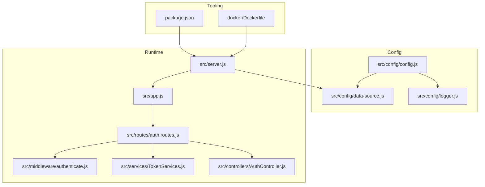
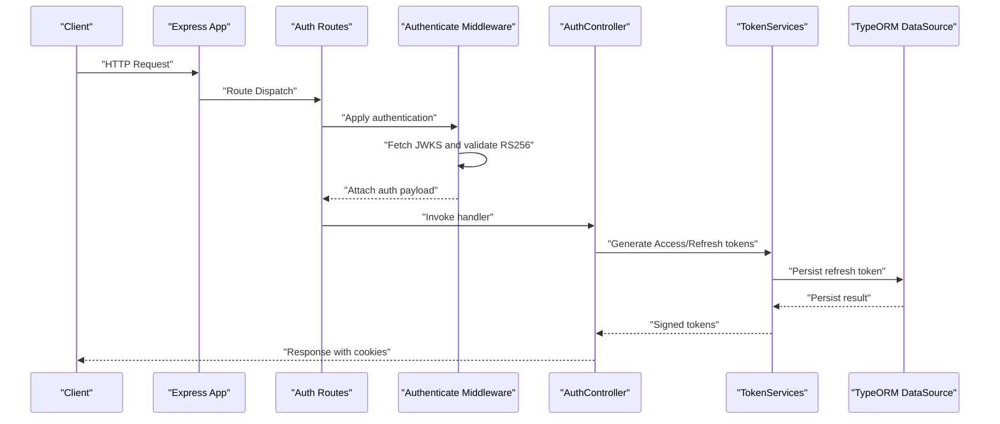
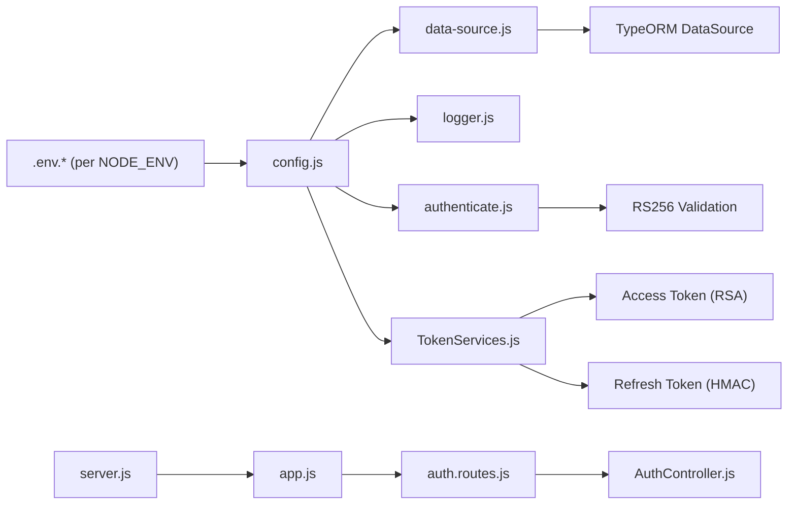

# Environment Setup

<cite>
**Referenced Files in This Document**
- [config.js](file://src/config/config.js)
- [data-source.js](file://src/config/data-source.js)
- [logger.js](file://src/config/logger.js)
- [package.json](file://package.json)
- [Dockerfile](file://docker/Dockerfile)
- [server.js](file://src/server.js)
- [app.js](file://src/app.js)
- [auth.routes.js](file://src/routes/auth.routes.js)
- [authenticate.js](file://src/middleware/authenticate.js)
- [TokenServices.js](file://src/services/TokenServices.js)
- [AuthController.js](file://src/controllers/AuthController.js)
- [README.md](file://README.md)
</cite>

## Table of Contents
1. [Introduction](#introduction)
2. [Project Structure](#project-structure)
3. [Core Components](#core-components)
4. [Architecture Overview](#architecture-overview)
5. [Detailed Component Analysis](#detailed-component-analysis)
6. [Dependency Analysis](#dependency-analysis)
7. [Performance Considerations](#performance-considerations)
8. [Troubleshooting Guide](#troubleshooting-guide)
9. [Conclusion](#conclusion)
10. [Appendices](#appendices)

## Introduction
This document provides a comprehensive guide to setting up the authentication service across development, staging, and production environments. It covers environment variable configuration, database connectivity, JWT configuration, security settings, secrets management, configuration validation, environment-specific feature flags, local development setup, Docker configuration, and cloud deployment considerations. Step-by-step instructions and troubleshooting guidance are included to help you configure and operate the service reliably.

## Project Structure
The authentication service is structured around a modular Node.js/TypeORM application with environment-driven configuration, middleware-based authentication, and route controllers. Key configuration is loaded from environment files based on NODE_ENV, and runtime behavior is influenced by environment variables.

**Diagram sources**
- [config.js:1-34](file://src/config/config.js#L1-L34)
- [data-source.js:1-22](file://src/config/data-source.js#L1-L22)
- [logger.js:1-42](file://src/config/logger.js#L1-L42)
- [server.js:1-21](file://src/server.js#L1-L21)
- [app.js:1-40](file://src/app.js#L1-L40)
- [auth.routes.js:1-49](file://src/routes/auth.routes.js#L1-L49)
- [authenticate.js:1-26](file://src/middleware/authenticate.js#L1-L26)
- [TokenServices.js:1-60](file://src/services/TokenServices.js#L1-L60)
- [AuthController.js:1-212](file://src/controllers/AuthController.js#L1-L212)
- [package.json:1-48](file://package.json#L1-L48)
- [Dockerfile:1-21](file://docker/Dockerfile#L1-L21)

**Section sources**
- [config.js:1-34](file://src/config/config.js#L1-L34)
- [data-source.js:1-22](file://src/config/data-source.js#L1-L22)
- [logger.js:1-42](file://src/config/logger.js#L1-L42)
- [server.js:1-21](file://src/server.js#L1-L21)
- [app.js:1-40](file://src/app.js#L1-L40)
- [auth.routes.js:1-49](file://src/routes/auth.routes.js#L1-L49)
- [authenticate.js:1-26](file://src/middleware/authenticate.js#L1-L26)
- [TokenServices.js:1-60](file://src/services/TokenServices.js#L1-L60)
- [AuthController.js:1-212](file://src/controllers/AuthController.js#L1-L212)
- [package.json:1-48](file://package.json#L1-L48)
- [Dockerfile:1-21](file://docker/Dockerfile#L1-L21)

## Core Components
- Environment configuration loader: Loads environment variables from a file named after NODE_ENV.
- Data source: Configures PostgreSQL connection and TypeORM behavior per environment.
- Logger: Routes logs to files and console with environment-aware silencing.
- Authentication middleware: Validates RS256 tokens via JWKS URI.
- Token services: Generates access tokens with RSA private key and refresh tokens with a shared secret.
- Server bootstrap: Initializes database and starts the Express server.

Key configuration keys consumed by the application:
- PORT, DB_HOST, DB_PORT, DB_NAME, DB_USERNAME, DB_PASSWORD, NODE_ENV, PRIVATE_KEY_SECRET, JWKS_URI

**Section sources**
- [config.js:11-33](file://src/config/config.js#L11-L33)
- [data-source.js:8-21](file://src/config/data-source.js#L8-L21)
- [logger.js:4-39](file://src/config/logger.js#L4-L39)
- [authenticate.js:6-25](file://src/middleware/authenticate.js#L6-L25)
- [TokenServices.js:12-43](file://src/services/TokenServices.js#L12-L43)
- [server.js:7-19](file://src/server.js#L7-L19)

## Architecture Overview
The runtime architecture ties together configuration, persistence, routing, authentication, and token generation. Environment variables drive behavior differences across environments.

**Diagram sources**
- [auth.routes.js:16-48](file://src/routes/auth.routes.js#L16-L48)
- [authenticate.js:6-25](file://src/middleware/authenticate.js#L6-L25)
- [AuthController.js:19-70](file://src/controllers/AuthController.js#L19-L70)
- [TokenServices.js:12-43](file://src/services/TokenServices.js#L12-L43)
- [data-source.js:8-21](file://src/config/data-source.js#L8-L21)

## Detailed Component Analysis

### Environment Variable Configuration
- File selection: The loader reads an environment file named according to NODE_ENV (default dev).
- Required variables: PORT, DB_HOST, DB_PORT, DB_NAME, DB_USERNAME, DB_PASSWORD, NODE_ENV, PRIVATE_KEY_SECRET, JWKS_URI.
- Behavior: NODE_ENV controls synchronization, migrations, logging, and log transport silencing.

Recommended environment files:
- Development: .env.dev
- Staging: .env.staging
- Production: .env.prod

Environment-specific overrides:
- Development: synchronize enabled, migrations enabled, logs to files and console.
- Staging: synchronize disabled, migrations enabled, logs to files and console.
- Production: synchronize disabled, migrations disabled, logs to console only.

**Section sources**
- [config.js:7-9](file://src/config/config.js#L7-L9)
- [data-source.js:15-19](file://src/config/data-source.js#L15-L19)
- [logger.js:14-36](file://src/config/logger.js#L14-L36)

### Database Connection Setup
- Driver: PostgreSQL via pg and TypeORM.
- Connection parameters: Host, port, username, password, database.
- Synchronization: Enabled for dev/test, disabled for prod/stage.
- Migrations: Enabled except for test; path configured relative to environment.
- Entities: User, RefreshToken, Tenant.

Operational notes:
- Ensure the database is reachable from the runtime environment.
- For local development, use a local Postgres instance or Docker Compose.
- For production, use managed Postgres with appropriate network policies and credentials.

**Section sources**
- [data-source.js:8-21](file://src/config/data-source.js#L8-L21)

### JWT Configuration and Security Settings
- Access tokens:
  - Algorithm: RS256.
  - Signing: Private key read from certs/private.pem.
  - Issuer: auth-service.
  - Expiration: 1 hour.
- Refresh tokens:
  - Algorithm: HS256.
  - Signing: PRIVATE_KEY_SECRET environment variable.
  - Issuer: auth-service.
  - Expiration: 7 days.
  - Persistence: Stored in RefreshToken entity.
- Authentication middleware:
  - Uses JWKS URI to fetch public keys for RS256 verification.
  - Extracts token from Authorization header or accessToken cookie.
  - Caching and rate limiting enabled for JWKS retrieval.
- Cookie security:
  - httpOnly: true.
  - sameSite: strict.
  - domain: localhost (see environment-specific overrides below).

Security recommendations:
- Rotate private key regularly and update JWKS accordingly.
- Store PRIVATE_KEY_SECRET in a secrets manager and inject via environment.
- Use HTTPS and secure cookies in staging/prod.
- Restrict domain and SameSite based on deployment origin.

**Section sources**
- [authenticate.js:6-25](file://src/middleware/authenticate.js#L6-L25)
- [TokenServices.js:12-43](file://src/services/TokenServices.js#L12-L43)
- [AuthController.js:49-62](file://src/controllers/AuthController.js#L49-L62)
- [AuthController.js:115-128](file://src/controllers/AuthController.js#L115-L128)
- [AuthController.js:171-184](file://src/controllers/AuthController.js#L171-L184)

### Local Development Setup
- Prerequisites: Node.js, npm, PostgreSQL.
- Steps:
  1. Install dependencies: npm install.
  2. Create .env.dev with required variables.
  3. Start the server: npm run dev.
  4. Verify: curl http://localhost:PORT or use the auth endpoints.

Notes:
- The dev script sets NODE_ENV=dev and runs the server with nodemon.
- Ensure PostgreSQL is running locally or via Docker Compose.

**Section sources**
- [package.json](file://package.json#L8)
- [README.md:3-7](file://README.md#L3-L7)

### Docker Compose Configuration
- Base image: node:18.
- Working directory: /usr/src/app.
- Dependency installation: npm ci.
- Source copy: entire repository.
- Port exposure: 3000.
- Command: npm run dev.

Usage:
- Build and run the container; ensure .env.dev is mounted or present in the image.
- Map port 3000 externally and connect to a PostgreSQL container or external DB.

**Section sources**
- [Dockerfile:1-21](file://docker/Dockerfile#L1-L21)

### Cloud Platform Deployment Options
- Containerized deployment:
  - Build image from Dockerfile.
  - Deploy to Kubernetes, Cloud Run, ECS, or AKS with environment variables injected via secrets managers.
- Secrets management:
  - PRIVATE_KEY_SECRET and database credentials should be stored in a secrets manager and mounted as environment variables.
  - Keep certs/private.pem out of the image; mount as a volume or secret if needed.
- Networking:
  - Ensure the application can reach the PostgreSQL endpoint.
  - Configure health checks on the root endpoint.
- Environment-specific flags:
  - NODE_ENV drives migrations and logging behavior.
  - Use feature flags via environment variables for optional behavior.

[No sources needed since this section provides general guidance]

### Configuration Templates and Overrides
Template variables:
- PORT
- DB_HOST
- DB_PORT
- DB_NAME
- DB_USERNAME
- DB_PASSWORD
- NODE_ENV
- PRIVATE_KEY_SECRET
- JWKS_URI

Environment-specific overrides:
- Development (.env.dev):
  - NODE_ENV=dev
  - synchronize=true
  - migrations enabled
  - logs to files and console
- Staging (.env.staging):
  - NODE_ENV=staging
  - synchronize=false
  - migrations enabled
  - logs to files and console
- Production (.env.prod):
  - NODE_ENV=prod
  - synchronize=false
  - migrations disabled
  - logs to console only

Cookie overrides:
- Domain: adjust per environment (e.g., localhost for dev, your FQDN for prod).
- Secure: enable in prod behind HTTPS termination.
- SameSite: strict recommended; lax only for cross-origin scenarios.

**Section sources**
- [config.js:7-9](file://src/config/config.js#L7-L9)
- [data-source.js:15-19](file://src/config/data-source.js#L15-L19)
- [logger.js:14-36](file://src/config/logger.js#L14-L36)
- [AuthController.js:49-62](file://src/controllers/AuthController.js#L49-L62)
- [AuthController.js:115-128](file://src/controllers/AuthController.js#L115-L128)
- [AuthController.js:171-184](file://src/controllers/AuthController.js#L171-L184)

### Configuration Validation
- Environment loading:
  - The loader expects a file named .env.<NODE_ENV>; missing files will cause runtime errors.
- Database initialization:
  - AppDataSource.initialize is called during startup; failures will terminate the process.
- Logging:
  - Logger transports are environment-aware; logs are silenced in prod unless overridden.

Recommendations:
- Validate presence of required environment variables before startup.
- Add pre-deploy checks for database connectivity and JWKS accessibility.
- Monitor logs and error responses from the error-handling middleware.

**Section sources**
- [config.js:7-9](file://src/config/config.js#L7-L9)
- [server.js:9-18](file://src/server.js#L9-L18)
- [logger.js:14-36](file://src/config/logger.js#L14-L36)
- [app.js:24-37](file://src/app.js#L24-L37)

### Environment-Specific Feature Flags
- Migration toggles:
  - NODE_ENV determines whether migrations run and whether synchronize is enabled.
- Logging toggles:
  - NODE_ENV controls file/console transport silencing.
- Test behavior:
  - NODE_ENV=test disables migrations and enables synchronize for ephemeral test databases.

**Section sources**
- [data-source.js:15-19](file://src/config/data-source.js#L15-L19)
- [logger.js:14-36](file://src/config/logger.js#L14-L36)
- [package.json](file://package.json#L10)

## Dependency Analysis
The configuration and runtime components depend on environment variables and external systems (PostgreSQL, JWKS). The following diagram shows key dependencies.

**Diagram sources**
- [config.js:11-33](file://src/config/config.js#L11-L33)
- [data-source.js:8-21](file://src/config/data-source.js#L8-L21)
- [logger.js:4-39](file://src/config/logger.js#L4-L39)
- [authenticate.js:6-25](file://src/middleware/authenticate.js#L6-L25)
- [TokenServices.js:12-43](file://src/services/TokenServices.js#L12-L43)
- [server.js:7-19](file://src/server.js#L7-L19)
- [app.js:1-40](file://src/app.js#L1-L40)
- [auth.routes.js:16-48](file://src/routes/auth.routes.js#L16-L48)
- [AuthController.js:19-70](file://src/controllers/AuthController.js#L19-L70)

**Section sources**
- [config.js:11-33](file://src/config/config.js#L11-L33)
- [data-source.js:8-21](file://src/config/data-source.js#L8-L21)
- [logger.js:4-39](file://src/config/logger.js#L4-L39)
- [authenticate.js:6-25](file://src/middleware/authenticate.js#L6-L25)
- [TokenServices.js:12-43](file://src/services/TokenServices.js#L12-L43)
- [server.js:7-19](file://src/server.js#L7-L19)
- [app.js:1-40](file://src/app.js#L1-L40)
- [auth.routes.js:16-48](file://src/routes/auth.routes.js#L16-L48)
- [AuthController.js:19-70](file://src/controllers/AuthController.js#L19-L70)

## Performance Considerations
- Database:
  - Disable synchronize in production; rely on migrations.
  - Use connection pooling and appropriate indexes for user and refresh token tables.
- Logging:
  - Prod silences file transports; ensure structured JSON logs for observability.
- Authentication:
  - Enable JWKS caching and rate limiting to reduce overhead.
- Token lifecycle:
  - Short access token TTL reduces risk and improves rotation cadence.
  - Persist refresh tokens to invalidate compromised ones.

[No sources needed since this section provides general guidance]

## Troubleshooting Guide
Common issues and resolutions:
- Missing environment file:
  - Symptom: Application fails to load configuration.
  - Resolution: Ensure .env.dev/.env.staging/.env.prod exists and matches NODE_ENV.
- Database connection failure:
  - Symptom: Startup error during AppDataSource.initialize.
  - Resolution: Verify DB_HOST, DB_PORT, DB_NAME, DB_USERNAME, DB_PASSWORD; confirm network and credentials.
- JWT validation errors:
  - Symptom: 401 Unauthorized on protected routes.
  - Resolution: Confirm JWKS_URI is reachable and contains the correct key for RS256; ensure PRIVATE_KEY_SECRET matches refresh token signing secret.
- Private key read errors:
  - Symptom: 500 error when generating access tokens.
  - Resolution: Ensure certs/private.pem is readable by the runtime; avoid bundling secrets in images.
- Cookie security warnings:
  - Symptom: Browser blocks cookies.
  - Resolution: Adjust domain, secure, and sameSite per environment; use HTTPS in prod.
- Logs not appearing:
  - Symptom: No logs in files or console.
  - Resolution: Check NODE_ENV; file transports are silenced in prod.

**Section sources**
- [config.js:7-9](file://src/config/config.js#L7-L9)
- [server.js:9-18](file://src/server.js#L9-L18)
- [authenticate.js:6-25](file://src/middleware/authenticate.js#L6-L25)
- [TokenServices.js:16-23](file://src/services/TokenServices.js#L16-L23)
- [logger.js:14-36](file://src/config/logger.js#L14-L36)
- [AuthController.js:49-62](file://src/controllers/AuthController.js#L49-L62)

## Conclusion
By aligning environment variables with environment-specific templates, securing secrets, and validating configuration at startup, you can deploy the authentication service consistently across development, staging, and production. Use the provided templates, Docker configuration, and troubleshooting steps to streamline setup and operations.

[No sources needed since this section summarizes without analyzing specific files]

## Appendices

### Step-by-Step Setup Guides

- Development
  1. Create .env.dev with required variables.
  2. Run npm install.
  3. Start with npm run dev.
  4. Verify endpoints and logs.

- Staging
  1. Create .env.staging with required variables.
  2. Build Docker image from Dockerfile.
  3. Deploy container with environment variables and secrets.
  4. Run migrations using scripts in package.json.

- Production
  1. Create .env.prod with required variables.
  2. Store secrets in a secrets manager and inject as environment variables.
  3. Deploy container with secure networking and health checks.
  4. Disable synchronize and migrations; manage schema via CI/CD.

**Section sources**
- [package.json:10-13](file://package.json#L10-L13)
- [Dockerfile:1-21](file://docker/Dockerfile#L1-L21)
- [config.js:7-9](file://src/config/config.js#L7-L9)