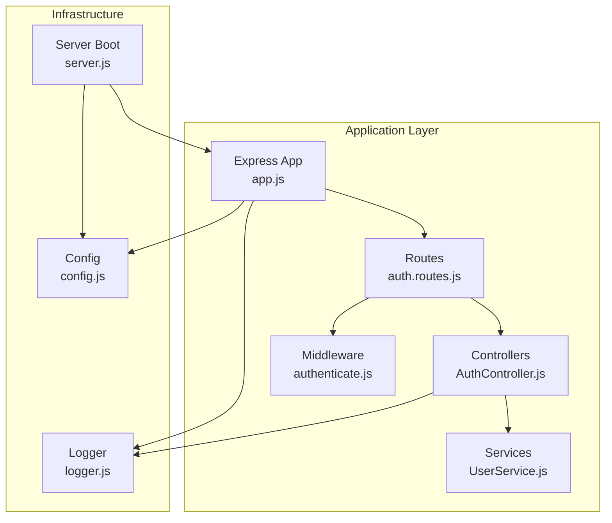
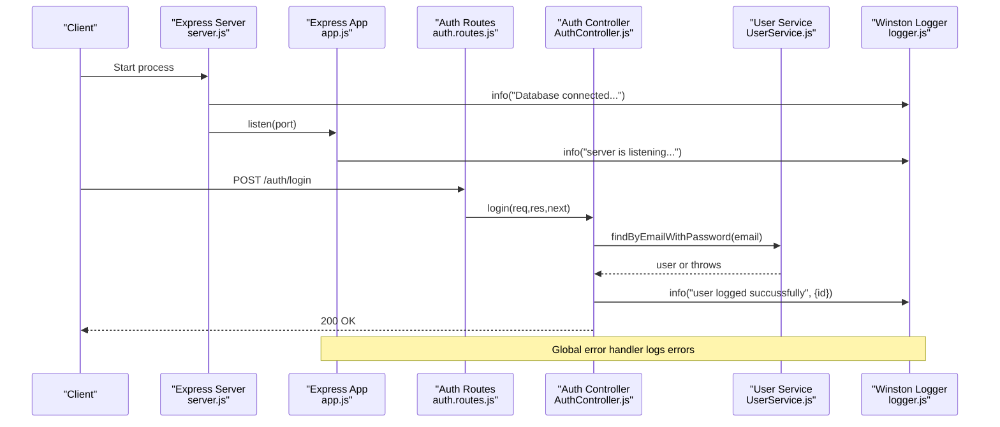
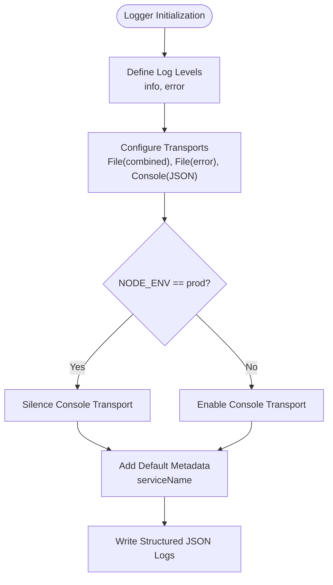
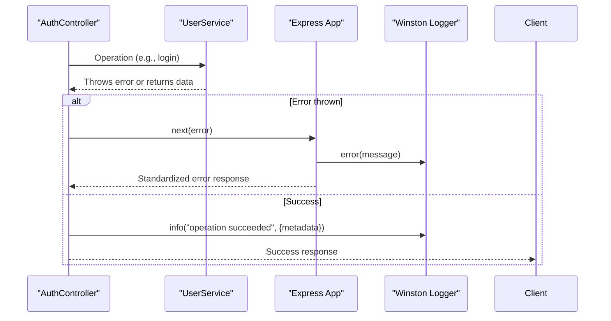
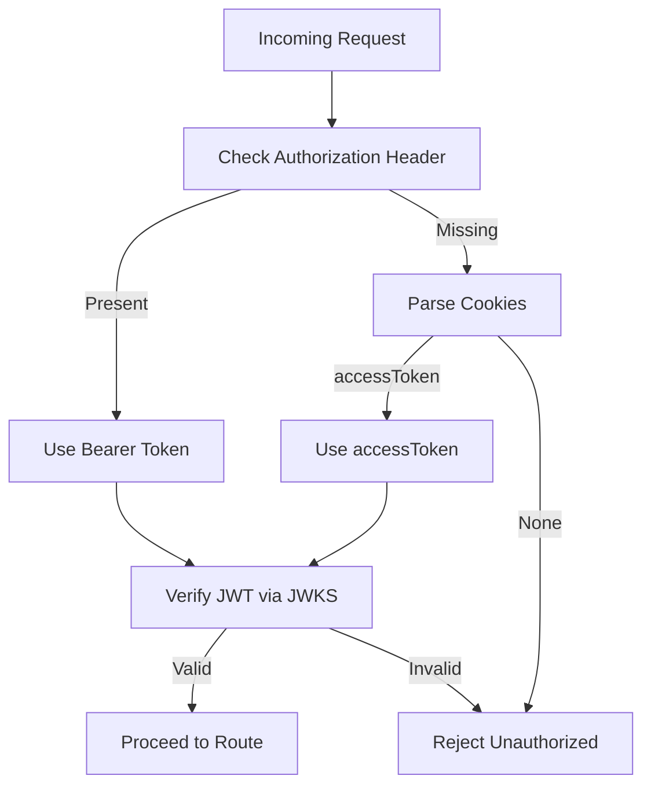
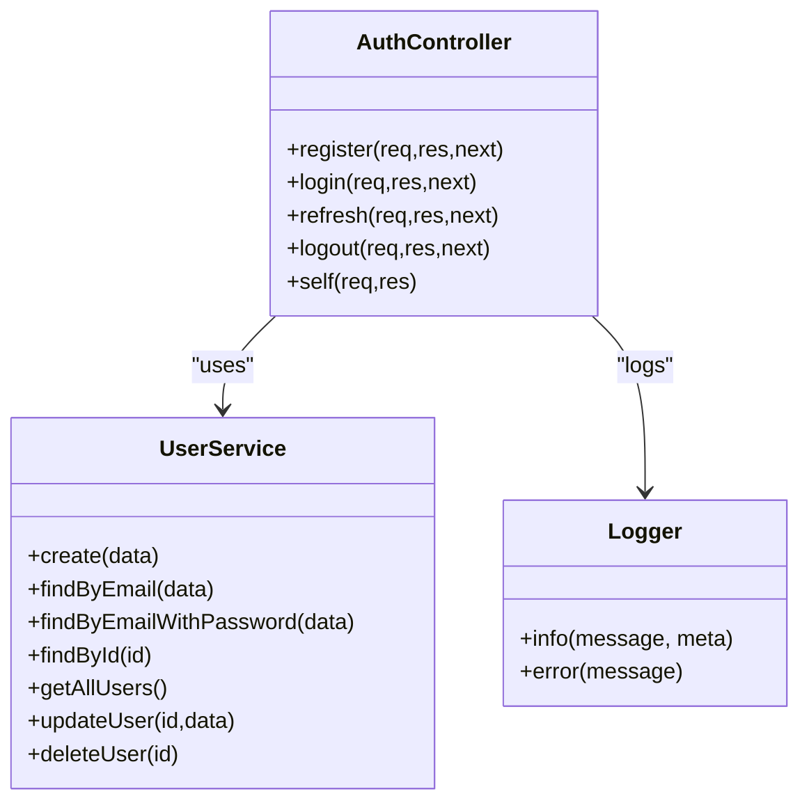
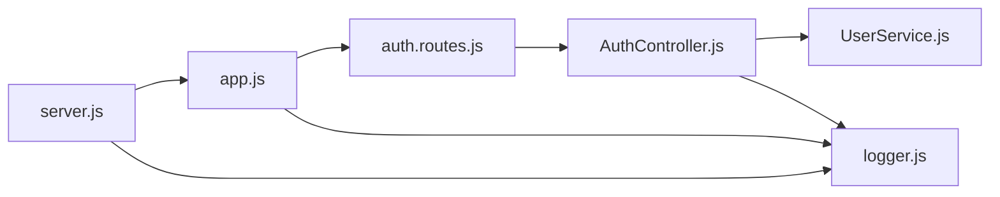

# Monitoring and Logging

<cite>
**Referenced Files in This Document**
- [logger.js](file://src/config/logger.js)
- [config.js](file://src/config/config.js)
- [app.js](file://src/app.js)
- [server.js](file://src/server.js)
- [AuthController.js](file://src/controllers/AuthController.js)
- [auth.routes.js](file://src/routes/auth.routes.js)
- [authenticate.js](file://src/middleware/authenticate.js)
- [UserService.js](file://src/services/UserService.js)
- [package.json](file://package.json)
- [README.md](file://README.md)
</cite>

## Table of Contents
1. [Introduction](#introduction)
2. [Project Structure](#project-structure)
3. [Core Components](#core-components)
4. [Architecture Overview](#architecture-overview)
5. [Detailed Component Analysis](#detailed-component-analysis)
6. [Dependency Analysis](#dependency-analysis)
7. [Performance Considerations](#performance-considerations)
8. [Troubleshooting Guide](#troubleshooting-guide)
9. [Conclusion](#conclusion)
10. [Appendices](#appendices)

## Introduction
This document provides comprehensive monitoring and logging guidance for the authentication service. It covers structured logging with Winston, log levels and rotation strategies, monitoring setup for application metrics and health checks, alerting recommendations for critical events, dashboard suggestions, log aggregation and correlation techniques, and troubleshooting workflows integrating logs and metrics with distributed tracing.

## Project Structure
The authentication service is organized around Express routes, controllers, services, middleware, and a centralized logger. The logger is configured via a dedicated module and integrated across the application stack. Environment-specific configuration is loaded from environment files controlled by the NODE_ENV variable.

**Diagram sources**
- [app.js:1-40](file://src/app.js#L1-L40)
- [auth.routes.js:1-49](file://src/routes/auth.routes.js#L1-L49)
- [AuthController.js:1-212](file://src/controllers/AuthController.js#L1-L212)
- [UserService.js:1-99](file://src/services/UserService.js#L1-L99)
- [authenticate.js:1-26](file://src/middleware/authenticate.js#L1-L26)
- [config.js:1-34](file://src/config/config.js#L1-L34)
- [logger.js:1-42](file://src/config/logger.js#L1-L42)
- [server.js:1-21](file://src/server.js#L1-L21)

**Section sources**
- [app.js:1-40](file://src/app.js#L1-L40)
- [auth.routes.js:1-49](file://src/routes/auth.routes.js#L1-L49)
- [AuthController.js:1-212](file://src/controllers/AuthController.js#L1-L212)
- [UserService.js:1-99](file://src/services/UserService.js#L1-L99)
- [authenticate.js:1-26](file://src/middleware/authenticate.js#L1-L26)
- [config.js:1-34](file://src/config/config.js#L1-L34)
- [logger.js:1-42](file://src/config/logger.js#L1-L42)
- [server.js:1-21](file://src/server.js#L1-L21)

## Core Components
- Structured logging with Winston:
  - JSON-formatted logs with timestamps.
  - Separate transports for combined and error logs.
  - Console transport for development and production toggled by environment.
  - Default metadata includes service name.
- Centralized configuration:
  - Loads environment variables based on NODE_ENV.
- Application error handling:
  - Global error handler logs error messages and returns standardized error responses.
- Authentication flow:
  - Uses JWT middleware with JWKS for token validation.
  - Controllers log successful operations and failures.

Key implementation references:
- Logger configuration and transports: [logger.js:1-42](file://src/config/logger.js#L1-L42)
- Environment configuration loading: [config.js:1-34](file://src/config/config.js#L1-L34)
- Global error handler and logging: [app.js:23-37](file://src/app.js#L23-L37)
- Server startup and logging: [server.js:7-19](file://src/server.js#L7-L19)
- Controller logging for user actions: [AuthController.js:64, 130, 164, 186, 198:64-198](file://src/controllers/AuthController.js#L64-L198)
- JWT authentication middleware: [authenticate.js:6-25](file://src/middleware/authenticate.js#L6-L25)

**Section sources**
- [logger.js:1-42](file://src/config/logger.js#L1-L42)
- [config.js:1-34](file://src/config/config.js#L1-L34)
- [app.js:23-37](file://src/app.js#L23-L37)
- [server.js:7-19](file://src/server.js#L7-L19)
- [AuthController.js:64, 130, 164, 186, 198:64-198](file://src/controllers/AuthController.js#L64-L198)
- [authenticate.js:6-25](file://src/middleware/authenticate.js#L6-L25)

## Architecture Overview
The logging architecture integrates Winston across the application lifecycle: server boot, route handling, controller actions, and error propagation. The logger writes to files and console, with production mode silencing console output while still writing to files.

**Diagram sources**
- [server.js:7-19](file://src/server.js#L7-L19)
- [app.js:13-17](file://src/app.js#L13-L17)
- [auth.routes.js:33-35](file://src/routes/auth.routes.js#L33-L35)
- [AuthController.js:72-136](file://src/controllers/AuthController.js#L72-L136)
- [UserService.js:48-54](file://src/services/UserService.js#L48-L54)
- [logger.js:4-39](file://src/config/logger.js#L4-L39)

## Detailed Component Analysis

### Structured Logging with Winston
- Log levels:
  - Combined log transport at info level.
  - Error log transport at error level.
  - Console transport at info level with JSON formatting and timestamps.
- Rotation strategies:
  - Current configuration writes to fixed filenames under a logs directory.
  - Recommended: Integrate a rotating file transport to manage disk usage and retention.
- Environment gating:
  - Console transport is silenced in production via environment variable.
- Metadata:
  - Default service name included in all log entries.

Implementation references:
- Logger creation and transports: [logger.js:4-39](file://src/config/logger.js#L4-L39)
- Environment variable usage: [logger.js:14, 24, 36:14-36](file://src/config/logger.js#L14-L36)
- Environment configuration: [config.js:23-33](file://src/config/config.js#L23-L33)

**Diagram sources**
- [logger.js:4-39](file://src/config/logger.js#L4-L39)
- [config.js:23-33](file://src/config/config.js#L23-L33)

**Section sources**
- [logger.js:4-39](file://src/config/logger.js#L4-L39)
- [config.js:23-33](file://src/config/config.js#L23-L33)

### Error Handling and Logging
- Global error handler:
  - Logs error messages and responds with a standardized error structure.
  - Extracts status code from error object or defaults to 500.
- Controller-level logging:
  - Successful operations are logged with contextual metadata (e.g., user id).
  - Authentication failures trigger explicit error objects handled by the global handler.

Implementation references:
- Global error handler: [app.js:24-37](file://src/app.js#L24-L37)
- Controller logging patterns: [AuthController.js:64, 130, 164, 186, 198:64-198](file://src/controllers/AuthController.js#L64-L198)

**Diagram sources**
- [AuthController.js:72-136](file://src/controllers/AuthController.js#L72-L136)
- [UserService.js:13-37](file://src/services/UserService.js#L13-L37)
- [app.js:24-37](file://src/app.js#L24-L37)
- [logger.js:4-39](file://src/config/logger.js#L4-L39)

**Section sources**
- [app.js:24-37](file://src/app.js#L24-L37)
- [AuthController.js:64, 130, 164, 186, 198:64-198](file://src/controllers/AuthController.js#L64-L198)
- [UserService.js:13-37](file://src/services/UserService.js#L13-L37)

### Authentication Middleware and Security Logging
- JWT validation:
  - Uses JWKS URI for dynamic key retrieval with caching and rate limiting.
  - Extracts tokens from Authorization header or cookies.
- Logging opportunities:
  - Log authentication attempts, successes, and failures.
  - Correlate with request IDs for traceability.

Implementation references:
- JWT middleware: [authenticate.js:6-25](file://src/middleware/authenticate.js#L6-L25)

**Diagram sources**
- [authenticate.js:13-24](file://src/middleware/authenticate.js#L13-L24)

**Section sources**
- [authenticate.js:6-25](file://src/middleware/authenticate.js#L6-L25)

### Routes and Controller Logging
- Routes instantiate controllers and pass shared logger instances.
- Controllers encapsulate business logic and emit structured logs for auditability.

Implementation references:
- Route wiring and controller instantiation: [auth.routes.js:22-27](file://src/routes/auth.routes.js#L22-L27)
- Controller logging calls: [AuthController.js:64, 130, 164, 186, 198:64-198](file://src/controllers/AuthController.js#L64-L198)

**Diagram sources**
- [AuthController.js:11-16](file://src/controllers/AuthController.js#L11-L16)
- [UserService.js:3-6](file://src/services/UserService.js#L3-L6)
- [logger.js:4-39](file://src/config/logger.js#L4-L39)

**Section sources**
- [auth.routes.js:22-27](file://src/routes/auth.routes.js#L22-L27)
- [AuthController.js:11-16](file://src/controllers/AuthController.js#L11-L16)
- [UserService.js:3-6](file://src/services/UserService.js#L3-L6)
- [logger.js:4-39](file://src/config/logger.js#L4-L39)

## Dependency Analysis
- Logger dependency chain:
  - server.js initializes data source and logs success.
  - app.js registers global error handler and logs root endpoint.
  - auth.routes.js constructs AuthController with injected logger.
  - AuthController uses logger for operation logs.
- Coupling and cohesion:
  - Logger is decoupled via injection, promoting testability and reuse.
  - Error handling is centralized, reducing duplication.

**Diagram sources**
- [server.js:7-19](file://src/server.js#L7-L19)
- [app.js:13-17](file://src/app.js#L13-L17)
- [auth.routes.js:22-27](file://src/routes/auth.routes.js#L22-L27)
- [AuthController.js:11-16](file://src/controllers/AuthController.js#L11-L16)
- [UserService.js:3-6](file://src/services/UserService.js#L3-L6)
- [logger.js:4-39](file://src/config/logger.js#L4-L39)

**Section sources**
- [server.js:7-19](file://src/server.js#L7-L19)
- [app.js:13-17](file://src/app.js#L13-L17)
- [auth.routes.js:22-27](file://src/routes/auth.routes.js#L22-L27)
- [AuthController.js:11-16](file://src/controllers/AuthController.js#L11-L16)
- [UserService.js:3-6](file://src/services/UserService.js#L3-L6)
- [logger.js:4-39](file://src/config/logger.js#L4-L39)

## Performance Considerations
- Logging overhead:
  - JSON formatting and file I/O can impact latency; ensure asynchronous file writes and appropriate buffer sizes.
- Log volume:
  - Implement rotation and retention policies to prevent disk exhaustion.
- Error handling:
  - Avoid logging sensitive data; sanitize payloads before logging.
- Metrics:
  - Add application metrics (request duration, error rates, token validation outcomes) for observability.

[No sources needed since this section provides general guidance]

## Troubleshooting Guide
- Startup issues:
  - Check server initialization logs and database connectivity messages.
  - Verify environment variables and NODE_ENV configuration.
- Authentication failures:
  - Review controller logs for mismatched credentials and token validation errors.
  - Confirm JWKS URI availability and network access.
- Error responses:
  - Inspect global error handler logs for underlying causes.
- Log locations:
  - Combined and error logs are written to a logs directory; confirm permissions and disk space.

Operational references:
- Server logs: [server.js:10, 13:10-13](file://src/server.js#L10-L13)
- Root endpoint response: [app.js:13-17](file://src/app.js#L13-L17)
- Global error handler: [app.js:24-37](file://src/app.js#L24-L37)
- Logger transports: [logger.js:10-38](file://src/config/logger.js#L10-L38)
- Environment configuration: [config.js:7-9](file://src/config/config.js#L7-L9)

**Section sources**
- [server.js:10, 13:10-13](file://src/server.js#L10-L13)
- [app.js:13-17](file://src/app.js#L13-L17)
- [app.js:24-37](file://src/app.js#L24-L37)
- [logger.js:10-38](file://src/config/logger.js#L10-L38)
- [config.js:7-9](file://src/config/config.js#L7-L9)

## Conclusion
The authentication service employs a robust, structured logging foundation using Winston with environment-aware transports and centralized configuration. To enhance monitoring, integrate log rotation, add application metrics and health endpoints, define alerting thresholds for authentication failures and security incidents, and establish dashboards for real-time insights. Adopt correlation IDs and distributed tracing to connect logs with traces for efficient troubleshooting.

[No sources needed since this section summarizes without analyzing specific files]

## Appendices

### Recommended Enhancements
- Log rotation:
  - Use a rotating file transport to manage file sizes and retention.
- Metrics and health checks:
  - Expose a /health endpoint returning service status and database connectivity.
  - Track request durations, error rates, and token validation outcomes.
- Alerting:
  - Threshold-based alerts for failed login attempts, token verification failures, and elevated error rates.
- Dashboards:
  - Aggregate logs and metrics in a platform like Grafana or ELK Stack.
- Distributed tracing:
  - Integrate a tracer (e.g., OpenTelemetry) and propagate correlation IDs across requests.

[No sources needed since this section provides general guidance]