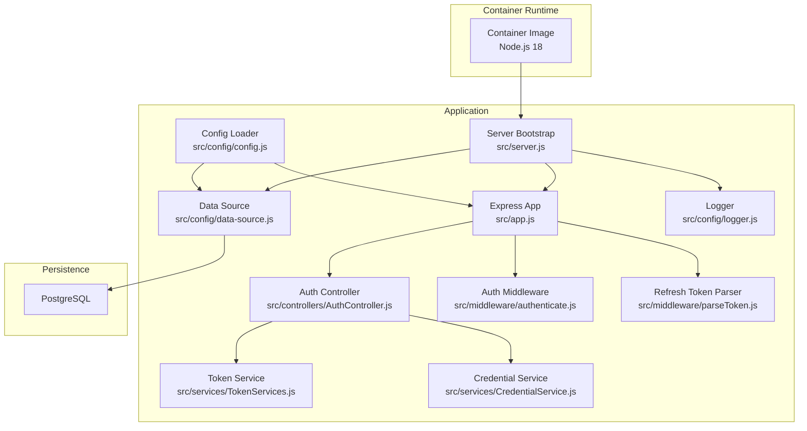
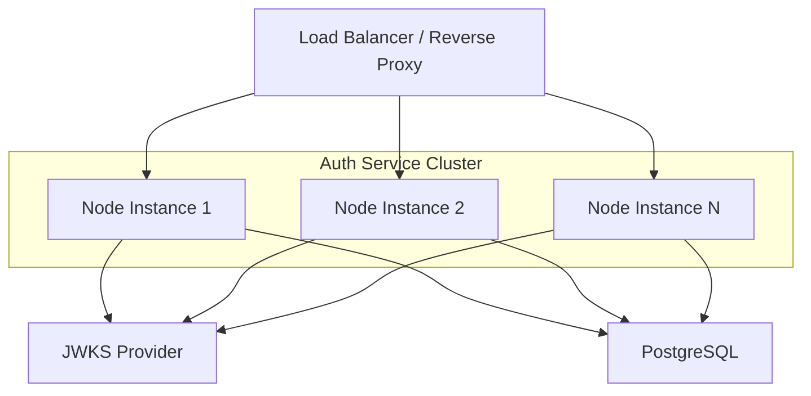
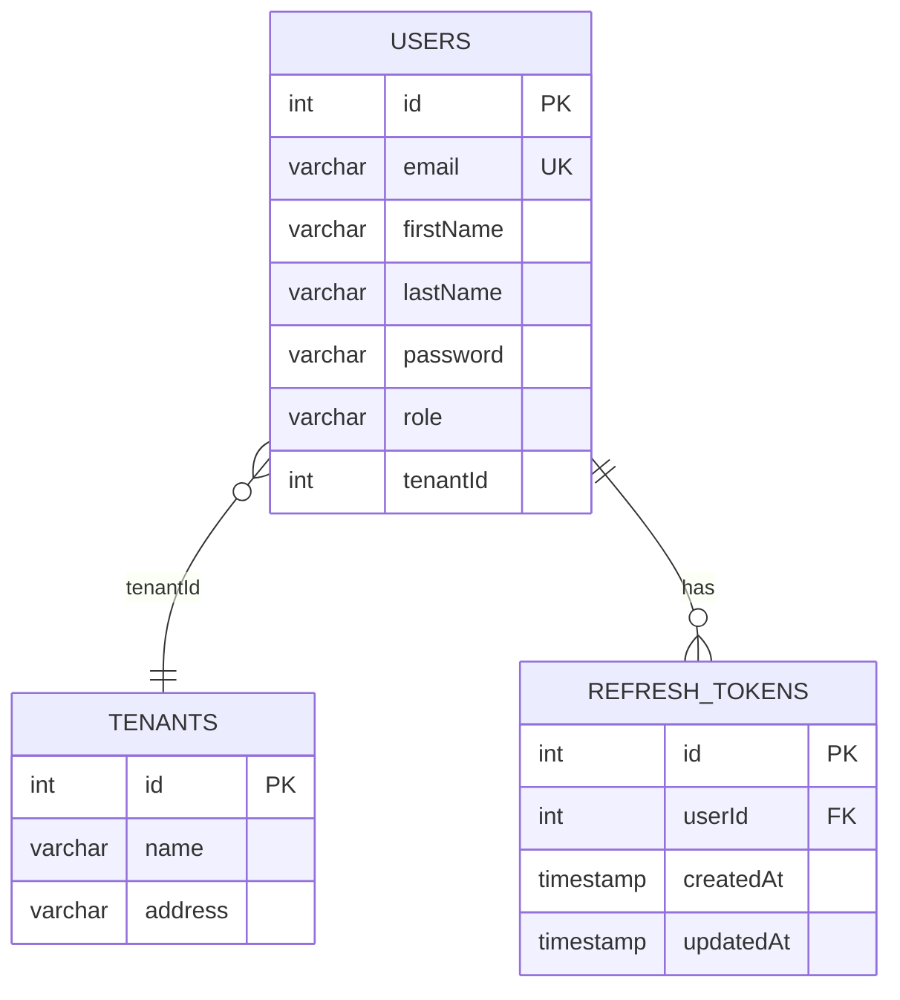
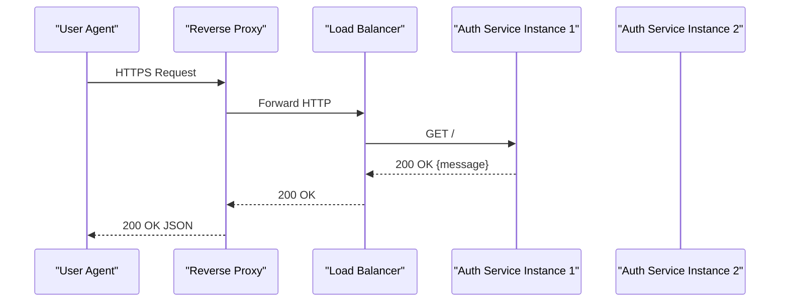
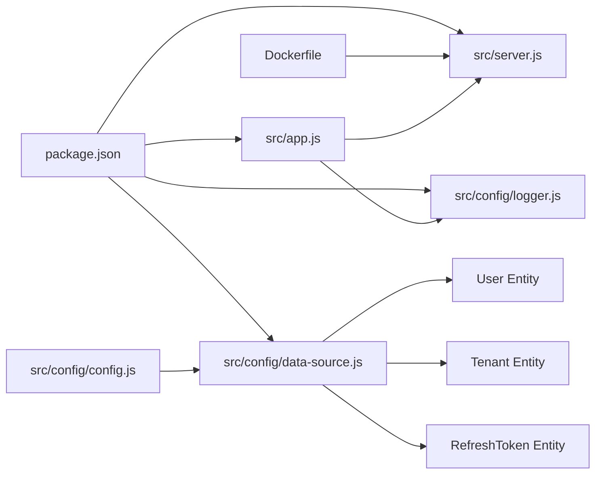

# Production Deployment

<cite>
**Referenced Files in This Document**
- [package.json](file://package.json)
- [Dockerfile](file://docker/Dockerfile)
- [src/server.js](file://src/server.js)
- [src/app.js](file://src/app.js)
- [src/config/config.js](file://src/config/config.js)
- [src/config/data-source.js](file://src/config/data-source.js)
- [src/config/logger.js](file://src/config/logger.js)
- [src/migration/1773479637906-migration.js](file://src/migration/1773479637906-migration.js)
- [src/migration/1773678089909-create_tenant_table.js](file://src/migration/1773678089909-create_tenant_table.js)
- [src/entity/User.js](file://src/entity/User.js)
- [src/entity/Tenants.js](file://src/entity/Tenants.js)
- [src/entity/RefreshToken.js](file://src/entity/RefreshToken.js)
- [src/controllers/AuthController.js](file://src/controllers/AuthController.js)
- [src/services/TokenServices.js](file://src/services/TokenServices.js)
- [src/services/CredentialService.js](file://src/services/CredentialService.js)
- [src/middleware/authenticate.js](file://src/middleware/authenticate.js)
- [src/middleware/parseToken.js](file://src/middleware/parseToken.js)
</cite>

## Table of Contents
1. [Introduction](#introduction)
2. [Project Structure](#project-structure)
3. [Core Components](#core-components)
4. [Architecture Overview](#architecture-overview)
5. [Detailed Component Analysis](#detailed-component-analysis)
6. [Dependency Analysis](#dependency-analysis)
7. [Performance Considerations](#performance-considerations)
8. [Troubleshooting Guide](#troubleshooting-guide)
9. [Conclusion](#conclusion)
10. [Appendices](#appendices)

## Introduction
This document provides production-grade deployment guidance for the authentication service. It covers configuration hardening, database deployment and migrations, connection pooling, load balancing and reverse proxy setup, SSL/TLS termination, observability and monitoring, backup and disaster recovery, audit logging, compliance considerations, deployment checklists, rollback procedures, and post-deployment validation steps. The guidance is grounded in the repository’s configuration, runtime, and infrastructure artifacts.

## Project Structure
The service is a Node.js/Express application using TypeORM for PostgreSQL persistence, JWT-based authentication with RS256 and HS256, and Winston for logging. It includes:
- Application bootstrap and routing
- Environment-driven configuration
- Database initialization and migrations
- Authentication middleware and token services
- Logging configuration
- Containerization via Docker

**Diagram sources**
- [src/server.js:1-21](file://src/server.js#L1-L21)
- [src/app.js:1-40](file://src/app.js#L1-L40)
- [src/config/config.js:1-34](file://src/config/config.js#L1-L34)
- [src/config/data-source.js:1-22](file://src/config/data-source.js#L1-L22)
- [src/config/logger.js:1-42](file://src/config/logger.js#L1-L42)
- [src/controllers/AuthController.js:1-212](file://src/controllers/AuthController.js#L1-L212)
- [src/services/TokenServices.js:1-60](file://src/services/TokenServices.js#L1-L60)
- [src/services/CredentialService.js:1-7](file://src/services/CredentialService.js#L1-L7)
- [src/middleware/authenticate.js:1-26](file://src/middleware/authenticate.js#L1-L26)
- [src/middleware/parseToken.js:1-14](file://src/middleware/parseToken.js#L1-L14)

**Section sources**
- [package.json:1-48](file://package.json#L1-L48)
- [docker/Dockerfile:1-21](file://docker/Dockerfile#L1-L21)
- [src/server.js:1-21](file://src/server.js#L1-L21)
- [src/app.js:1-40](file://src/app.js#L1-L40)
- [src/config/config.js:1-34](file://src/config/config.js#L1-L34)
- [src/config/data-source.js:1-22](file://src/config/data-source.js#L1-L22)
- [src/config/logger.js:1-42](file://src/config/logger.js#L1-L42)

## Core Components
- Configuration loader reads environment-specific variables and exposes them to the app and data source.
- Express app sets JSON parsing, cookies, static serving, routes, and centralized error handling.
- Data source initializes PostgreSQL connectivity and manages migrations.
- Logger writes structured logs to files and console with environment-aware silencing.
- Authentication controller handles registration, login, token refresh, and logout with cookie-based tokens.
- Token service generates access tokens with RSA private key and refresh tokens with a shared secret.
- Authentication middleware validates access tokens via JWKS and parses refresh tokens from cookies.
- Migrations define the evolving schema for users, refresh tokens, and tenants.

**Section sources**
- [src/config/config.js:11-33](file://src/config/config.js#L11-L33)
- [src/app.js:10-37](file://src/app.js#L10-L37)
- [src/config/data-source.js:8-21](file://src/config/data-source.js#L8-L21)
- [src/config/logger.js:4-39](file://src/config/logger.js#L4-L39)
- [src/controllers/AuthController.js:19-70](file://src/controllers/AuthController.js#L19-L70)
- [src/services/TokenServices.js:12-43](file://src/services/TokenServices.js#L12-L43)
- [src/middleware/authenticate.js:6-25](file://src/middleware/authenticate.js#L6-L25)
- [src/migration/1773479637906-migration.js:10-33](file://src/migration/1773479637906-migration.js#L10-L33)
- [src/migration/1773678089909-create_tenant_table.js:10-30](file://src/migration/1773678089909-create_tenant_table.js#L10-L30)

## Architecture Overview
The production architecture centers on a containerized Node.js service communicating with PostgreSQL. Access tokens are validated via JWKS, while refresh tokens are handled locally with HS256. The service exposes health and API endpoints, with structured logging and environment-driven configuration.

[No sources needed since this diagram shows conceptual workflow, not actual code structure]

## Detailed Component Analysis

### Security Hardening
- JWT Issuance and Validation
  - Access tokens are signed with RS256 using a private key and validated via JWKS. Ensure the private key is mounted securely and the JWKS URI is reachable.
  - Refresh tokens are signed with HS256 using a shared secret; keep the secret strong and rotate periodically.
- Cookie Security
  - Cookies are HttpOnly and SameSite strict. In production, configure domain, secure flag, and SameSite according to your deployment domain and TLS termination point.
- Password Storage
  - Password comparison uses bcrypt; ensure secrets and salts are managed securely and keys rotated per organizational policy.

**Section sources**
- [src/services/TokenServices.js:12-43](file://src/services/TokenServices.js#L12-L43)
- [src/middleware/authenticate.js:6-25](file://src/middleware/authenticate.js#L6-L25)
- [src/controllers/AuthController.js:50-62](file://src/controllers/AuthController.js#L50-L62)
- [src/controllers/AuthController.js:116-128](file://src/controllers/AuthController.js#L116-L128)
- [src/controllers/AuthController.js:172-184](file://src/controllers/AuthController.js#L172-L184)
- [src/services/CredentialService.js:1-7](file://src/services/CredentialService.js#L1-L7)

### Database Deployment and Migrations
- Connection Management
  - Data source connects to PostgreSQL using credentials from environment variables. Disable auto-synchronization in production; rely on migrations.
- Migrations
  - Initial schema creates users and refresh tokens with foreign key relationships.
  - Tenant table creation adds a tenant dimension and links users to tenants.
- Migration Execution
  - Use scripts to generate and run migrations during deployments.

**Diagram sources**
- [src/migration/1773479637906-migration.js:16-32](file://src/migration/1773479637906-migration.js#L16-L32)
- [src/migration/1773678089909-create_tenant_table.js:16-29](file://src/migration/1773678089909-create_tenant_table.js#L16-L29)
- [src/entity/User.js:3-49](file://src/entity/User.js#L3-L49)
- [src/entity/RefreshToken.js:3-34](file://src/entity/RefreshToken.js#L3-L34)
- [src/entity/Tenants.js:3-28](file://src/entity/Tenants.js#L3-L28)

**Section sources**
- [src/config/data-source.js:8-21](file://src/config/data-source.js#L8-L21)
- [src/migration/1773479637906-migration.js:10-33](file://src/migration/1773479637906-migration.js#L10-L33)
- [src/migration/1773678089909-create_tenant_table.js:10-30](file://src/migration/1773678089909-create_tenant_table.js#L10-L30)
- [package.json:11-13](file://package.json#L11-L13)

### Load Balancing and Reverse Proxy
- Horizontal Scaling
  - Run multiple instances behind a load balancer. Ensure session affinity is not required for stateless auth operations.
- Reverse Proxy and TLS Termination
  - Terminate TLS at the reverse proxy and forward to the service on HTTP. Configure domain, secure cookies, and SameSite accordingly.
- Health Checks
  - Use the root endpoint for basic health verification.

[No sources needed since this diagram shows conceptual workflow, not actual code structure]

### Observability and Monitoring
- Logging
  - Winston writes structured JSON logs to files and console. In production, route logs to stdout/stderr for container orchestration platforms.
- Metrics and Alerting
  - Instrument HTTP response codes, latency, and error rates at the reverse proxy or gateway level. Add application-level metrics for token generation and database operations if desired.

**Section sources**
- [src/config/logger.js:4-39](file://src/config/logger.js#L4-L39)
- [src/app.js:13-17](file://src/app.js#L13-L17)

### Backup and Disaster Recovery
- Database Backups
  - Schedule regular logical backups of PostgreSQL. Test restore procedures regularly.
- Secrets Rotation
  - Rotate private key and refresh secret periodically; update JWKS and environment variables across instances.
- Rollback Strategy
  - Maintain previous container images and database migration checkpoints. Revert to the prior image and revert migrations if necessary.

[No sources needed since this section provides general guidance]

### Compliance and Audit Logging
- Audit Logs
  - Log authentication events (login, logout, token refresh) with contextual metadata. Ensure logs are retained per policy and protected from tampering.
- Data Protection
  - Enforce encryption at rest and in transit. Limit access to secrets and logs.

[No sources needed since this section provides general guidance]

## Dependency Analysis
The application depends on environment variables, PostgreSQL, and external JWKS for token validation. The Dockerfile defines the runtime image and exposes the application port.

**Diagram sources**
- [package.json:1-48](file://package.json#L1-L48)
- [docker/Dockerfile:1-21](file://docker/Dockerfile#L1-L21)
- [src/server.js:1-21](file://src/server.js#L1-L21)
- [src/app.js:1-40](file://src/app.js#L1-L40)
- [src/config/config.js:1-34](file://src/config/config.js#L1-L34)
- [src/config/data-source.js:1-22](file://src/config/data-source.js#L1-L22)
- [src/config/logger.js:1-42](file://src/config/logger.js#L1-L42)
- [src/entity/User.js:1-50](file://src/entity/User.js#L1-L50)
- [src/entity/Tenants.js:1-29](file://src/entity/Tenants.js#L1-L29)
- [src/entity/RefreshToken.js:1-35](file://src/entity/RefreshToken.js#L1-L35)

**Section sources**
- [package.json:1-48](file://package.json#L1-L48)
- [docker/Dockerfile:1-21](file://docker/Dockerfile#L1-L21)
- [src/server.js:1-21](file://src/server.js#L1-L21)
- [src/app.js:1-40](file://src/app.js#L1-L40)
- [src/config/config.js:1-34](file://src/config/config.js#L1-L34)
- [src/config/data-source.js:1-22](file://src/config/data-source.js#L1-L22)
- [src/config/logger.js:1-42](file://src/config/logger.js#L1-L42)

## Performance Considerations
- Connection Pooling
  - Configure a dedicated pool size appropriate for expected concurrency and database capacity. Monitor pool utilization and adjust based on metrics.
- Caching
  - Cache JWKS keys and frequently accessed user roles to reduce latency.
- Asynchronous Operations
  - Keep request handlers synchronous; offload heavy tasks to queues if needed.
- Resource Limits
  - Set CPU/memory limits and restart policies in your container orchestrator.

[No sources needed since this section provides general guidance]

## Troubleshooting Guide
- Startup Failures
  - Verify database connectivity and credentials. Confirm migrations are applied and environment variables are present.
- Authentication Issues
  - Check JWKS reachability and private key availability. Validate cookie domain and secure flags.
- Logging
  - Inspect structured logs for error messages and stack traces.

**Section sources**
- [src/server.js:7-19](file://src/server.js#L7-L19)
- [src/config/data-source.js:8-21](file://src/config/data-source.js#L8-L21)
- [src/config/logger.js:4-39](file://src/config/logger.js#L4-L39)
- [src/middleware/authenticate.js:6-25](file://src/middleware/authenticate.js#L6-L25)
- [src/services/TokenServices.js:16-23](file://src/services/TokenServices.js#L16-L23)

## Conclusion
This guide consolidates production deployment practices for the authentication service, aligning the existing codebase with security, reliability, and operability standards. By applying the recommendations here—hardened configuration, robust database migrations, scalable load balancing, observability, and disciplined change management—you can operate the service safely and efficiently in production.

## Appendices

### Production Configuration Checklist
- Environment variables
  - Database connection details and credentials
  - Private key and refresh secret
  - JWKS URI for token validation
- Secrets management
  - Securely provision private key and refresh secret
  - Enable secret rotation cadence
- Network and TLS
  - TLS termination at reverse proxy
  - Cookie flags: secure, sameSite, domain
- Database
  - Migrations applied and tested
  - Connection pool configured and monitored
- Observability
  - Structured logs exported to platform
  - Health checks and alert thresholds defined
- Backup and DR
  - Automated backups scheduled and tested
  - Rollback plan with image and migration versions documented

[No sources needed since this section provides general guidance]

### Rollback Procedures
- Revert container image to the previous known-good version
- Re-run down migrations to the last stable schema
- Restore secrets and configuration to previous values
- Validate rollback via smoke tests and health checks

[No sources needed since this section provides general guidance]

### Post-Deployment Validation Steps
- Health check endpoint returns success
- Authentication flows (register, login, refresh, logout) succeed
- Logs show successful connections and operations
- Database migrations are current and schema matches expectations

[No sources needed since this section provides general guidance]