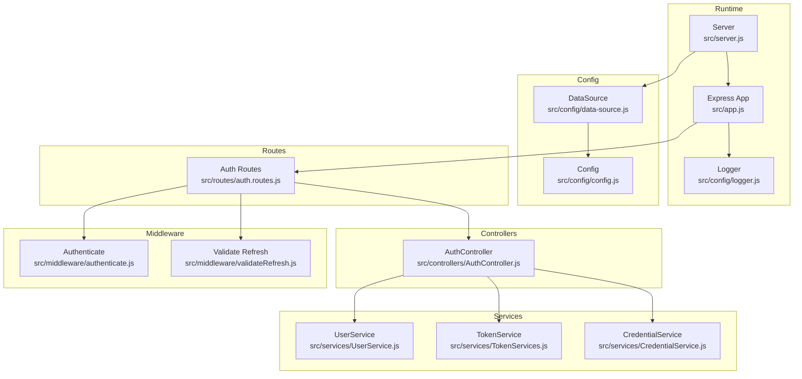
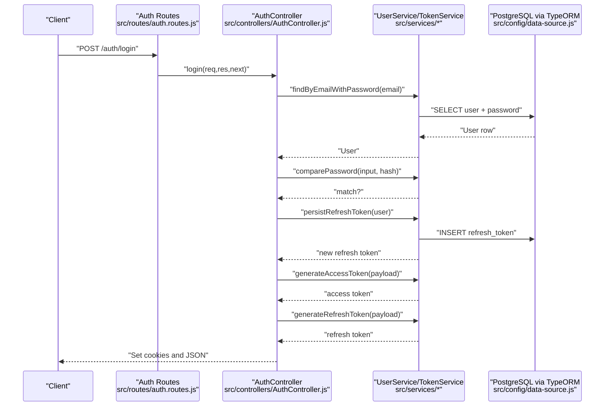
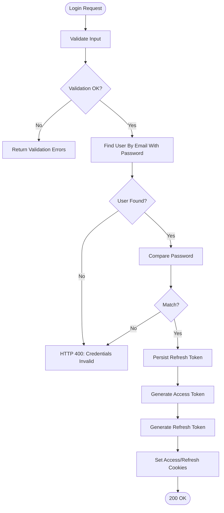
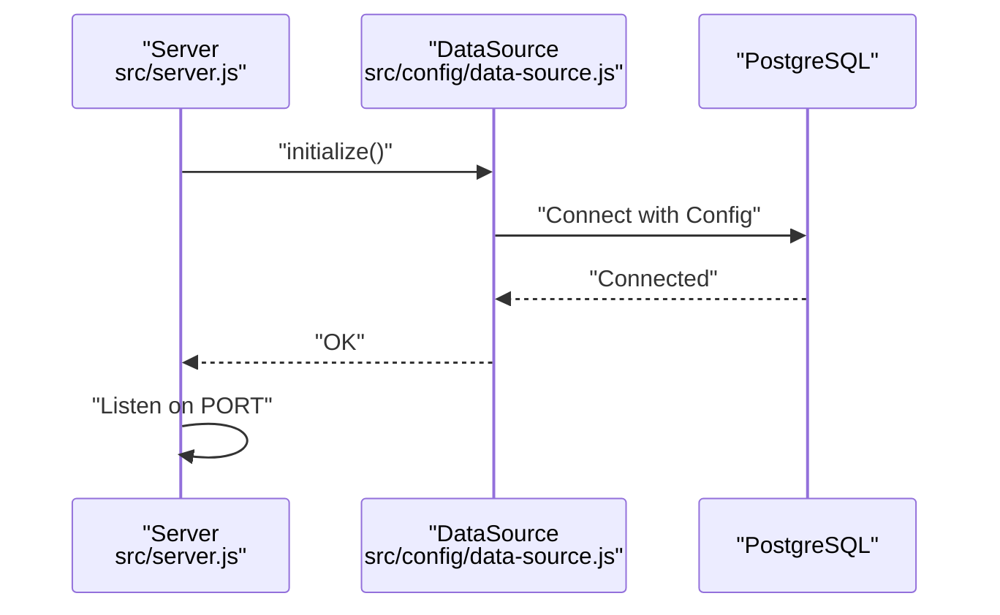
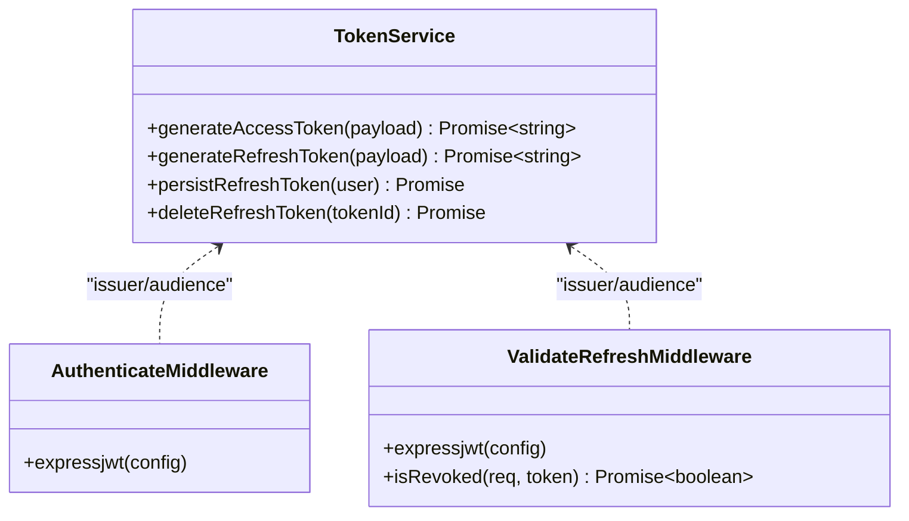
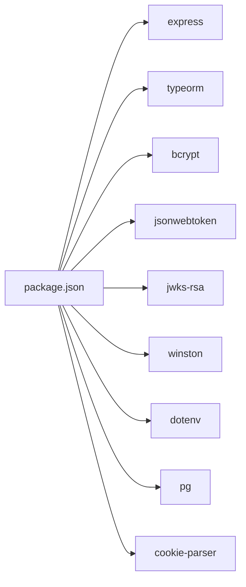

# Troubleshooting and Optimization

<cite>
**Referenced Files in This Document**
- [src/server.js](file://src/server.js)
- [src/app.js](file://src/app.js)
- [src/config/config.js](file://src/config/config.js)
- [src/config/data-source.js](file://src/config/data-source.js)
- [src/config/logger.js](file://src/config/logger.js)
- [src/routes/auth.routes.js](file://src/routes/auth.routes.js)
- [src/controllers/AuthController.js](file://src/controllers/AuthController.js)
- [src/services/UserService.js](file://src/services/UserService.js)
- [src/services/TokenServices.js](file://src/services/TokenServices.js)
- [src/services/CredentialService.js](file://src/services/CredentialService.js)
- [src/middleware/authenticate.js](file://src/middleware/authenticate.js)
- [src/middleware/validateRefresh.js](file://src/middleware/validateRefresh.js)
- [src/utils/utils.js](file://src/utils/utils.js)
- [package.json](file://package.json)
- [README.md](file://README.md)
</cite>

## Table of Contents
1. [Introduction](#introduction)
2. [Project Structure](#project-structure)
3. [Core Components](#core-components)
4. [Architecture Overview](#architecture-overview)
5. [Detailed Component Analysis](#detailed-component-analysis)
6. [Dependency Analysis](#dependency-analysis)
7. [Performance Considerations](#performance-considerations)
8. [Troubleshooting Guide](#troubleshooting-guide)
9. [Security Incident Response](#security-incident-response)
10. [Runbooks](#runbooks)
11. [Conclusion](#conclusion)

## Introduction
This document provides a comprehensive troubleshooting and optimization guide for the authentication service. It focuses on diagnosing and resolving common deployment issues such as authentication failures, database connectivity problems, and performance bottlenecks. It also covers systematic debugging approaches using logs, metrics, and error tracking, along with performance optimization techniques, scaling considerations, capacity planning, resource monitoring, security incident response, vulnerability assessment, and runbooks for routine maintenance and emergency procedures.

## Project Structure
The authentication service is organized around a modular Express application with layered concerns:
- Configuration: Environment variables, database connection, and logging setup
- Routes: HTTP endpoints for registration, login, profile retrieval, token refresh, and logout
- Controllers: Request handlers orchestrating business logic
- Services: Business logic for user management, credentials, tokens, and tenant operations
- Middleware: Authentication and refresh token validation
- Utilities: Helper functions for table truncation and JWT detection
- Persistence: PostgreSQL via TypeORM with migrations

**Diagram sources**
- [src/server.js:1-21](file://src/server.js#L1-L21)
- [src/app.js:1-40](file://src/app.js#L1-L40)
- [src/config/config.js:1-34](file://src/config/config.js#L1-L34)
- [src/config/data-source.js:1-22](file://src/config/data-source.js#L1-L22)
- [src/routes/auth.routes.js:1-49](file://src/routes/auth.routes.js#L1-L49)
- [src/controllers/AuthController.js:1-212](file://src/controllers/AuthController.js#L1-L212)
- [src/services/UserService.js:1-99](file://src/services/UserService.js#L1-L99)
- [src/services/TokenServices.js:1-60](file://src/services/TokenServices.js#L1-L60)
- [src/services/CredentialService.js:1-7](file://src/services/CredentialService.js#L1-L7)
- [src/middleware/authenticate.js:1-26](file://src/middleware/authenticate.js#L1-L26)
- [src/middleware/validateRefresh.js:1-34](file://src/middleware/validateRefresh.js#L1-L34)
- [src/config/logger.js:1-42](file://src/config/logger.js#L1-L42)

**Section sources**
- [src/server.js:1-21](file://src/server.js#L1-L21)
- [src/app.js:1-40](file://src/app.js#L1-L40)
- [src/config/config.js:1-34](file://src/config/config.js#L1-L34)
- [src/config/data-source.js:1-22](file://src/config/data-source.js#L1-L22)
- [src/config/logger.js:1-42](file://src/config/logger.js#L1-L42)
- [src/routes/auth.routes.js:1-49](file://src/routes/auth.routes.js#L1-L49)
- [src/controllers/AuthController.js:1-212](file://src/controllers/AuthController.js#L1-L212)
- [src/services/UserService.js:1-99](file://src/services/UserService.js#L1-L99)
- [src/services/TokenServices.js:1-60](file://src/services/TokenServices.js#L1-L60)
- [src/services/CredentialService.js:1-7](file://src/services/CredentialService.js#L1-L7)
- [src/middleware/authenticate.js:1-26](file://src/middleware/authenticate.js#L1-L26)
- [src/middleware/validateRefresh.js:1-34](file://src/middleware/validateRefresh.js#L1-L34)
- [src/utils/utils.js:1-32](file://src/utils/utils.js#L1-L32)
- [package.json:1-48](file://package.json#L1-L48)
- [README.md:1-8](file://README.md#L1-L8)

## Core Components
- Server initialization and lifecycle: Starts the Express app, initializes the database connection, and listens on the configured port. See [src/server.js:7-19](file://src/server.js#L7-L19).
- Express app bootstrap: JSON parsing, cookies, static assets, base route, and centralized error handler. See [src/app.js:10-37](file://src/app.js#L10-L37).
- Configuration: Loads environment-specific variables and exposes them via a single Config object. See [src/config/config.js:7-33](file://src/config/config.js#L7-L33).
- Data source: PostgreSQL connection, entities, migrations, and synchronization settings. See [src/config/data-source.js:8-21](file://src/config/data-source.js#L8-L21).
- Logging: Winston-based logger with file and console transports, environment-aware silencing. See [src/config/logger.js:4-39](file://src/config/logger.js#L4-L39).
- Authentication routes: Registration, login, self info, refresh, and logout endpoints wired to controllers and validators. See [src/routes/auth.routes.js:16-48](file://src/routes/auth.routes.js#L16-L48).
- Auth controller: Orchestrates user creation, login, token generation, refresh, and logout with cookie management. See [src/controllers/AuthController.js:19-211](file://src/controllers/AuthController.js#L19-L211).
- User service: CRUD operations, password hashing, and lookup helpers. See [src/services/UserService.js:7-62](file://src/services/UserService.js#L7-L62).
- Token service: Access and refresh token generation, refresh token persistence and deletion. See [src/services/TokenServices.js:12-58](file://src/services/TokenServices.js#L12-L58).
- Credential service: Password comparison using bcrypt. See [src/services/CredentialService.js:3-5](file://src/services/CredentialService.js#L3-L5).
- Authentication middleware: Validates access tokens via JWKS with caching and rate limiting. See [src/middleware/authenticate.js:6-25](file://src/middleware/authenticate.js#L6-L25).
- Refresh validation middleware: Validates refresh tokens against persisted tokens and revocation checks. See [src/middleware/validateRefresh.js:7-31](file://src/middleware/validateRefresh.js#L7-L31).
- Utilities: Truncates tables and validates JWT structure. See [src/utils/utils.js:4-31](file://src/utils/utils.js#L4-L31).

**Section sources**
- [src/server.js:7-19](file://src/server.js#L7-L19)
- [src/app.js:10-37](file://src/app.js#L10-L37)
- [src/config/config.js:7-33](file://src/config/config.js#L7-L33)
- [src/config/data-source.js:8-21](file://src/config/data-source.js#L8-L21)
- [src/config/logger.js:4-39](file://src/config/logger.js#L4-L39)
- [src/routes/auth.routes.js:16-48](file://src/routes/auth.routes.js#L16-L48)
- [src/controllers/AuthController.js:19-211](file://src/controllers/AuthController.js#L19-L211)
- [src/services/UserService.js:7-62](file://src/services/UserService.js#L7-L62)
- [src/services/TokenServices.js:12-58](file://src/services/TokenServices.js#L12-L58)
- [src/services/CredentialService.js:3-5](file://src/services/CredentialService.js#L3-L5)
- [src/middleware/authenticate.js:6-25](file://src/middleware/authenticate.js#L6-L25)
- [src/middleware/validateRefresh.js:7-31](file://src/middleware/validateRefresh.js#L7-L31)
- [src/utils/utils.js:4-31](file://src/utils/utils.js#L4-L31)

## Architecture Overview
The authentication service follows a layered architecture:
- Entry point initializes the server and database, then starts the HTTP listener.
- Routes delegate to controllers after applying validation and middleware.
- Controllers coordinate services for user and token operations.
- Services interact with repositories backed by PostgreSQL via TypeORM.
- Middleware enforces authentication and refresh token validation.

**Diagram sources**
- [src/routes/auth.routes.js:33-35](file://src/routes/auth.routes.js#L33-L35)
- [src/controllers/AuthController.js:72-136](file://src/controllers/AuthController.js#L72-L136)
- [src/services/UserService.js:48-54](file://src/services/UserService.js#L48-L54)
- [src/services/CredentialService.js:3-5](file://src/services/CredentialService.js#L3-L5)
- [src/services/TokenServices.js:45-43](file://src/services/TokenServices.js#L45-L43)
- [src/config/data-source.js:18-19](file://src/config/data-source.js#L18-L19)

## Detailed Component Analysis

### Authentication Flow and Error Handling
- Centralized error handler logs errors and returns structured JSON responses. See [src/app.js:24-37](file://src/app.js#L24-L37).
- Login flow validates input, retrieves user with password, compares credentials, persists refresh token, and issues access/refresh tokens with cookies. See [src/controllers/AuthController.js:72-136](file://src/controllers/AuthController.js#L72-L136).
- Refresh flow rotates tokens, deletes the old refresh token, and issues new tokens. See [src/controllers/AuthController.js:143-192](file://src/controllers/AuthController.js#L143-L192).
- Logout flow deletes the refresh token and clears cookies. See [src/controllers/AuthController.js:194-210](file://src/controllers/AuthController.js#L194-L210).

**Diagram sources**
- [src/controllers/AuthController.js:72-136](file://src/controllers/AuthController.js#L72-L136)
- [src/services/UserService.js:48-54](file://src/services/UserService.js#L48-L54)
- [src/services/CredentialService.js:3-5](file://src/services/CredentialService.js#L3-L5)
- [src/services/TokenServices.js:45-43](file://src/services/TokenServices.js#L45-L43)

**Section sources**
- [src/app.js:24-37](file://src/app.js#L24-L37)
- [src/controllers/AuthController.js:72-136](file://src/controllers/AuthController.js#L72-L136)
- [src/controllers/AuthController.js:143-192](file://src/controllers/AuthController.js#L143-L192)
- [src/controllers/AuthController.js:194-210](file://src/controllers/AuthController.js#L194-L210)

### Database Connectivity and Migration
- Data source connects to PostgreSQL using environment variables and loads entities and migrations conditionally. See [src/config/data-source.js:8-21](file://src/config/data-source.js#L8-L21).
- Server initializes the data source before starting the HTTP server. See [src/server.js:9-10](file://src/server.js#L9-L10).
- Migrations are configured per environment; tests disable migrations. See [src/config/data-source.js:19](file://src/config/data-source.js#L19).

**Diagram sources**
- [src/server.js:9-14](file://src/server.js#L9-L14)
- [src/config/data-source.js:8-21](file://src/config/data-source.js#L8-L21)

**Section sources**
- [src/config/data-source.js:8-21](file://src/config/data-source.js#L8-L21)
- [src/server.js:9-14](file://src/server.js#L9-L14)

### Token Management and Security
- Access tokens are signed with RS256 using a private key and validated via JWKS URI with caching and rate limiting. See [src/services/TokenServices.js:12-32](file://src/services/TokenServices.js#L12-L32) and [src/middleware/authenticate.js:6-25](file://src/middleware/authenticate.js#L6-L25).
- Refresh tokens are signed with HS256 using a shared secret, persisted in the database, and revoked upon logout or rotation. See [src/services/TokenServices.js:34-58](file://src/services/TokenServices.js#L34-L58) and [src/middleware/validateRefresh.js:7-31](file://src/middleware/validateRefresh.js#L7-L31).

**Diagram sources**
- [src/services/TokenServices.js:8-59](file://src/services/TokenServices.js#L8-L59)
- [src/middleware/authenticate.js:6-25](file://src/middleware/authenticate.js#L6-L25)
- [src/middleware/validateRefresh.js:7-31](file://src/middleware/validateRefresh.js#L7-L31)

**Section sources**
- [src/services/TokenServices.js:12-58](file://src/services/TokenServices.js#L12-L58)
- [src/middleware/authenticate.js:6-25](file://src/middleware/authenticate.js#L6-L25)
- [src/middleware/validateRefresh.js:7-31](file://src/middleware/validateRefresh.js#L7-L31)

## Dependency Analysis
Key runtime dependencies include Express, TypeORM, bcrypt, jsonwebtoken, jwks-rsa, winston, dotenv, pg, and cookie-parser. Scripts support development, testing, linting, and migrations.

**Diagram sources**
- [package.json:30-47](file://package.json#L30-L47)

**Section sources**
- [package.json:30-47](file://package.json#L30-L47)

## Performance Considerations
- Connection pooling and database tuning: Configure TypeORM connection pool settings (max connections, idle timeouts) in production environments to avoid connection exhaustion under load. Reference: [src/config/data-source.js:8-21](file://src/config/data-source.js#L8-L21).
- JWT token optimization:
  - Access tokens: Keep claims minimal; avoid large payloads to reduce signing/verification overhead. The current access token payload includes subject and role; consider trimming further if unnecessary. Reference: [src/controllers/AuthController.js:37-47](file://src/controllers/AuthController.js#L37-L47), [src/services/TokenServices.js:25-29](file://src/services/TokenServices.js#L25-L29).
  - Refresh tokens: Use short-lived access tokens with robust refresh token rotation and revocation. Reference: [src/controllers/AuthController.js:108-113](file://src/controllers/AuthController.js#L108-L113), [src/services/TokenServices.js:35-40](file://src/services/TokenServices.js#L35-L40).
- Caching strategies:
  - JWKS caching is enabled in authentication middleware; ensure the JWKS endpoint is highly available and monitor cache hit rates. Reference: [src/middleware/authenticate.js:7-11](file://src/middleware/authenticate.js#L7-L11).
  - Cache frequently accessed user metadata at the application layer with appropriate TTLs and invalidation policies.
- Cookie security and performance:
  - Use httpOnly and sameSite strict cookies to mitigate XSS and CSRF risks. Consider setting secure flag in production behind HTTPS. Reference: [src/controllers/AuthController.js:50-62](file://src/controllers/AuthController.js#L50-L62), [src/controllers/AuthController.js:116-128](file://src/controllers/AuthController.js#L116-L128).
- Input validation and sanitization:
  - Leverage express-validator to prevent malformed requests and reduce downstream processing overhead. Reference: [src/routes/auth.routes.js:7-8](file://src/routes/auth.routes.js#L7-L8), [src/routes/auth.routes.js:13-14](file://src/routes/auth.routes.js#L13-L14).
- Password hashing cost:
  - Adjust bcrypt salt rounds based on hardware capabilities and latency targets; 10 is a common baseline. Reference: [src/services/UserService.js:17](file://src/services/UserService.js#L17).
- Monitoring and observability:
  - Enable structured logging and integrate metrics collection (request latency, error rates, DB query times). Reference: [src/config/logger.js:4-39](file://src/config/logger.js#L4-L39).

[No sources needed since this section provides general guidance]

## Troubleshooting Guide

### Authentication Failures
Common symptoms:
- Login returns 400 with “email or password does not match” or “email or password is invalid.”
- Self endpoint fails with 401 due to missing or invalid access token.

Diagnostic steps:
- Verify environment variables for database and JWT configuration. Reference: [src/config/config.js:11-21](file://src/config/config.js#L11-L21).
- Confirm access token signing and validation:
  - Private key availability and permissions for access token signing. Reference: [src/services/TokenServices.js:17-23](file://src/services/TokenServices.js#L17-L23).
  - JWKS URI correctness and reachability for access token validation. Reference: [src/middleware/authenticate.js:8](file://src/middleware/authenticate.js#L8).
- Inspect refresh token validation:
  - Ensure refresh token exists and belongs to the user; check revocation logic. Reference: [src/middleware/validateRefresh.js:18-24](file://src/middleware/validateRefresh.js#L18-L24).
- Review logs for detailed error messages and stack traces. Reference: [src/app.js:24-37](file://src/app.js#L24-L37), [src/config/logger.js:4-39](file://src/config/logger.js#L4-L39).

Resolution checklist:
- Re-provision private key and ensure file path is correct. Reference: [src/services/TokenServices.js:17-19](file://src/services/TokenServices.js#L17-L19).
- Validate JWKS endpoint health and network connectivity. Reference: [src/middleware/authenticate.js:8](file://src/middleware/authenticate.js#L8).
- Confirm refresh token persistence and deletion flows. Reference: [src/services/TokenServices.js:45-58](file://src/services/TokenServices.js#L45-L58).

**Section sources**
- [src/config/config.js:11-21](file://src/config/config.js#L11-L21)
- [src/services/TokenServices.js:17-23](file://src/services/TokenServices.js#L17-L23)
- [src/middleware/authenticate.js:8](file://src/middleware/authenticate.js#L8)
- [src/middleware/validateRefresh.js:18-24](file://src/middleware/validateRefresh.js#L18-L24)
- [src/app.js:24-37](file://src/app.js#L24-L37)
- [src/config/logger.js:4-39](file://src/config/logger.js#L4-L39)

### Database Connectivity Problems
Symptoms:
- Server fails to start with database initialization errors.
- Queries timeout or fail intermittently.

Diagnostic steps:
- Confirm database host, port, credentials, and database name from environment variables. Reference: [src/config/config.js:15-18](file://src/config/config.js#L15-L18).
- Verify PostgreSQL availability and network access from the service host. Reference: [src/config/data-source.js:10-14](file://src/config/data-source.js#L10-L14).
- Check TypeORM synchronization and migration settings for the environment. Reference: [src/config/data-source.js:16](file://src/config/data-source.js#L16), [src/config/data-source.js:19](file://src/config/data-source.js#L19).
- Review server startup logs for initialization errors. Reference: [src/server.js:9-10](file://src/server.js#L9-L10).

Resolution checklist:
- Fix environment variables and re-run server. Reference: [src/server.js:11-14](file://src/server.js#L11-L14).
- Apply migrations in non-test environments. Reference: [package.json:11-13](file://package.json#L11-L13).

**Section sources**
- [src/config/config.js:15-18](file://src/config/config.js#L15-L18)
- [src/config/data-source.js:10-14](file://src/config/data-source.js#L10-L14)
- [src/config/data-source.js:16](file://src/config/data-source.js#L16)
- [src/config/data-source.js:19](file://src/config/data-source.js#L19)
- [src/server.js:9-14](file://src/server.js#L9-L14)
- [package.json:11-13](file://package.json#L11-L13)

### Performance Bottlenecks
Symptoms:
- Elevated response times for login/refresh.
- High CPU or memory usage.
- Database contention under load.

Diagnostic steps:
- Monitor request latency and error rates; correlate with database query times. Reference: [src/config/logger.js:4-39](file://src/config/logger.js#L4-L39).
- Profile token generation and password hashing operations. Reference: [src/services/TokenServices.js:12-32](file://src/services/TokenServices.js#L12-L32), [src/services/UserService.js:17](file://src/services/UserService.js#L17).
- Inspect refresh token persistence and deletion paths. Reference: [src/services/TokenServices.js:45-58](file://src/services/TokenServices.js#L45-L58).

Optimization recommendations:
- Tune bcrypt salt rounds and JWT token sizes to balance security and performance. Reference: [src/services/UserService.js:17](file://src/services/UserService.js#L17), [src/services/TokenServices.js:25-29](file://src/services/TokenServices.js#L25-L29).
- Implement connection pooling and query optimization. Reference: [src/config/data-source.js:8-21](file://src/config/data-source.js#L8-L21).
- Add caching for user metadata and JWKS keys. Reference: [src/middleware/authenticate.js:9](file://src/middleware/authenticate.js#L9).

**Section sources**
- [src/config/logger.js:4-39](file://src/config/logger.js#L4-L39)
- [src/services/TokenServices.js:12-32](file://src/services/TokenServices.js#L12-L32)
- [src/services/UserService.js:17](file://src/services/UserService.js#L17)
- [src/services/TokenServices.js:45-58](file://src/services/TokenServices.js#L45-L58)
- [src/config/data-source.js:8-21](file://src/config/data-source.js#L8-L21)
- [src/middleware/authenticate.js:9](file://src/middleware/authenticate.js#L9)

### Scaling and Capacity Planning
- Horizontal scaling: Deploy multiple replicas behind a load balancer; ensure sticky sessions are not required for stateless endpoints. Reference: [src/app.js:12](file://src/app.js#L12).
- Vertical scaling: Increase CPU/memory resources proportionally to database connection limits and JWT workload. Reference: [src/config/data-source.js:8-21](file://src/config/data-source.js#L8-L21).
- Resource monitoring: Track CPU, memory, disk, and network utilization; alert on anomalies. Reference: [src/config/logger.js:4-39](file://src/config/logger.js#L4-L39).
- Capacity planning: Estimate peak QPS for login/refresh and provision accordingly; account for token generation overhead. Reference: [src/services/TokenServices.js:12-32](file://src/services/TokenServices.js#L12-L32).

[No sources needed since this section provides general guidance]

## Security Incident Response
- Immediate actions:
  - Rotate private key and shared secret immediately upon compromise. Reference: [src/services/TokenServices.js:17-23](file://src/services/TokenServices.js#L17-L23), [src/services/TokenServices.js:35-40](file://src/services/TokenServices.js#L35-L40).
  - Revoke all refresh tokens by clearing the refresh token table or implementing a revocation list. Reference: [src/utils/utils.js:4-11](file://src/utils/utils.js#L4-L11).
  - Audit logs for suspicious activity and failed attempts. Reference: [src/config/logger.js:4-39](file://src/config/logger.js#L4-L39).
- Containment:
  - Disable public access to JWKS endpoint if exposed publicly; restrict to internal networks. Reference: [src/middleware/authenticate.js:8](file://src/middleware/authenticate.js#L8).
  - Enforce secure cookie flags (secure, sameSite strict) in production. Reference: [src/controllers/AuthController.js:50-62](file://src/controllers/AuthController.js#L50-L62), [src/controllers/AuthController.js:116-128](file://src/controllers/AuthController.js#L116-L128).
- Post-incident:
  - Conduct a root cause analysis and update security controls.
  - Review and harden environment variable management and secrets storage.

**Section sources**
- [src/services/TokenServices.js:17-23](file://src/services/TokenServices.js#L17-L23)
- [src/services/TokenServices.js:35-40](file://src/services/TokenServices.js#L35-L40)
- [src/utils/utils.js:4-11](file://src/utils/utils.js#L4-L11)
- [src/config/logger.js:4-39](file://src/config/logger.js#L4-L39)
- [src/middleware/authenticate.js:8](file://src/middleware/authenticate.js#L8)
- [src/controllers/AuthController.js:50-62](file://src/controllers/AuthController.js#L50-L62)
- [src/controllers/AuthController.js:116-128](file://src/controllers/AuthController.js#L116-L128)

## Runbooks

### Routine Maintenance Tasks
- Environment setup:
  - Load environment variables for the target environment (.env.dev, .env.prod). Reference: [src/config/config.js:7-9](file://src/config/config.js#L7-L9).
  - Start the server using the dev script. Reference: [package.json:8](file://package.json#L8).
- Database migrations:
  - Generate and run migrations in development. Reference: [package.json:11-13](file://package.json#L11-L13).
- Testing:
  - Run tests in a test environment. Reference: [package.json:10](file://package.json#L10).

**Section sources**
- [src/config/config.js:7-9](file://src/config/config.js#L7-L9)
- [package.json:8-13](file://package.json#L8-L13)

### Emergency Response Procedures
- Authentication failure storm:
  - Check database connectivity and retry initialization. Reference: [src/server.js:9-10](file://src/server.js#L9-L10).
  - Validate JWKS URI and private key accessibility. Reference: [src/middleware/authenticate.js:8](file://src/middleware/authenticate.js#L8), [src/services/TokenServices.js:17-23](file://src/services/TokenServices.js#L17-L23).
- Database outage:
  - Confirm PostgreSQL availability and network access. Reference: [src/config/data-source.js:10-14](file://src/config/data-source.js#L10-L14).
  - Scale up database resources or enable read replicas if supported.
- Performance degradation:
  - Reduce JWT payload sizes and tune bcrypt cost. Reference: [src/services/TokenServices.js:25-29](file://src/services/TokenServices.js#L25-L29), [src/services/UserService.js:17](file://src/services/UserService.js#L17).
  - Enable connection pooling and monitor query performance. Reference: [src/config/data-source.js:8-21](file://src/config/data-source.js#L8-L21).

**Section sources**
- [src/server.js:9-10](file://src/server.js#L9-L10)
- [src/middleware/authenticate.js:8](file://src/middleware/authenticate.js#L8)
- [src/services/TokenServices.js:17-23](file://src/services/TokenServices.js#L17-L23)
- [src/config/data-source.js:10-14](file://src/config/data-source.js#L10-L14)
- [src/services/TokenServices.js:25-29](file://src/services/TokenServices.js#L25-L29)
- [src/services/UserService.js:17](file://src/services/UserService.js#L17)
- [src/config/data-source.js:8-21](file://src/config/data-source.js#L8-L21)

## Conclusion
This guide consolidates troubleshooting and optimization strategies for the authentication service, focusing on authentication flows, database connectivity, performance, security, and operational runbooks. By leveraging structured logging, environment-driven configuration, robust token management, and proactive monitoring, teams can maintain a reliable and secure authentication service at scale.

[No sources needed since this section summarizes without analyzing specific files]