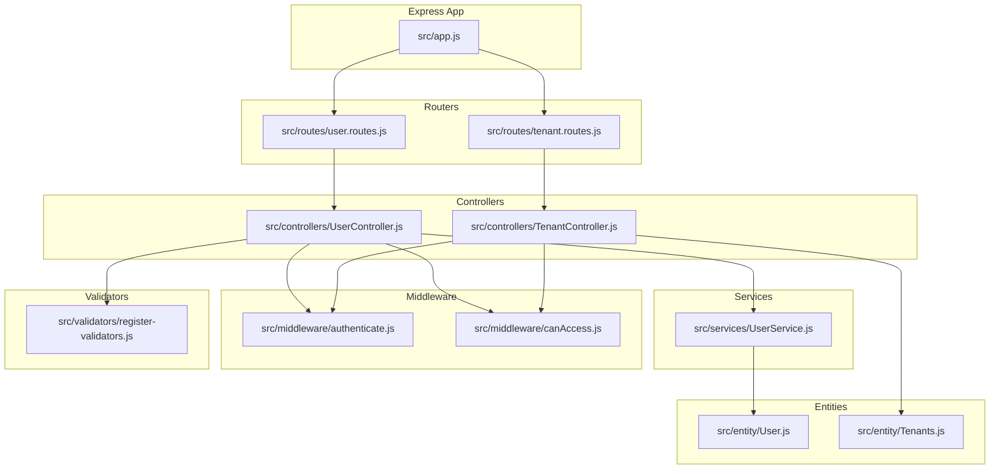
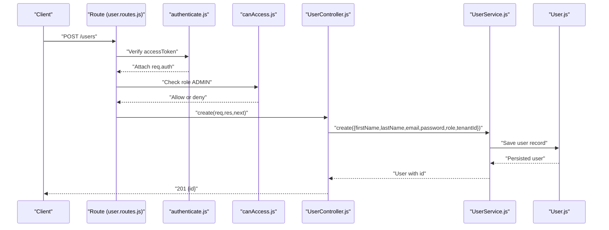
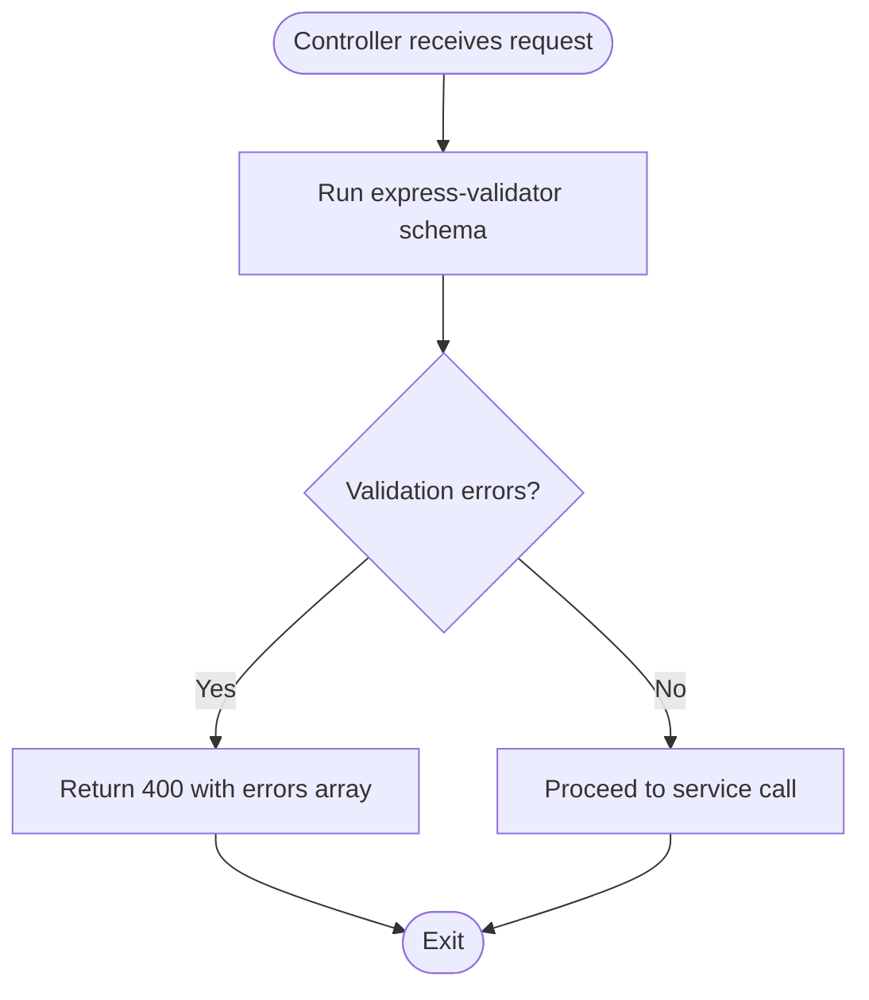
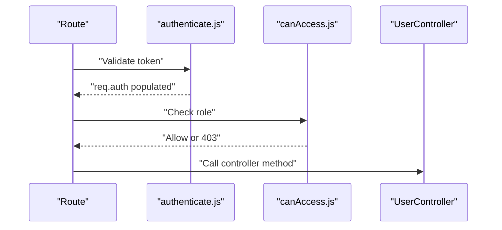
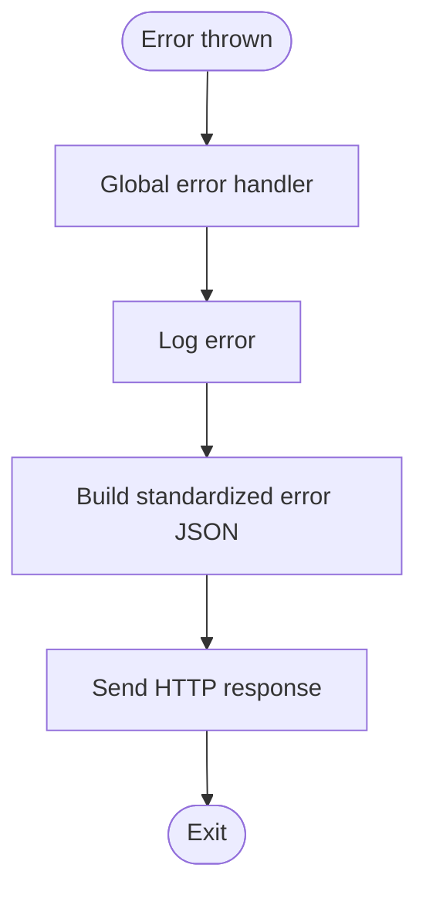
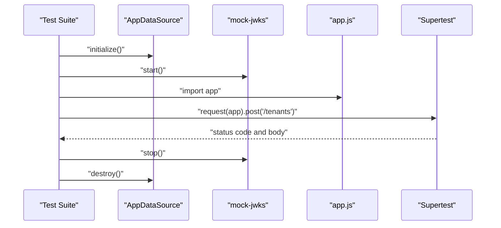
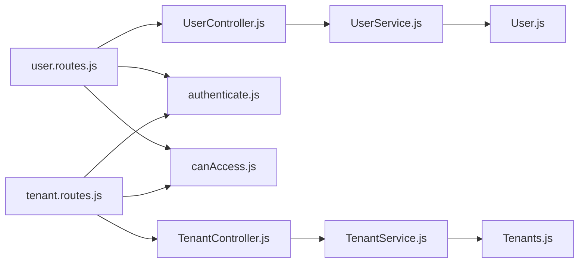

# Adding New Endpoints

<cite>
**Referenced Files in This Document**
- [app.js](file://src/app.js)
- [user.routes.js](file://src/routes/user.routes.js)
- [tenant.routes.js](file://src/routes/tenant.routes.js)
- [UserController.js](file://src/controllers/UserController.js)
- [TenantController.js](file://src/controllers/TenantController.js)
- [UserService.js](file://src/services/UserService.js)
- [authenticate.js](file://src/middleware/authenticate.js)
- [canAccess.js](file://src/middleware/canAccess.js)
- [register-validators.js](file://src/validators/register-validators.js)
- [constants/index.js](file://src/constants/index.js)
- [User.js](file://src/entity/User.js)
- [Tenants.js](file://src/entity/Tenants.js)
- [create.spec.js (users)](file://src/test/users/create.spec.js)
- [create.spec.js (tenant)](file://src/test/tenant/create.spec.js)
</cite>

## Table of Contents
1. [Introduction](#introduction)
2. [Project Structure](#project-structure)
3. [Core Components](#core-components)
4. [Architecture Overview](#architecture-overview)
5. [Detailed Component Analysis](#detailed-component-analysis)
6. [Dependency Analysis](#dependency-analysis)
7. [Performance Considerations](#performance-considerations)
8. [Troubleshooting Guide](#troubleshooting-guide)
9. [Conclusion](#conclusion)
10. [Appendices](#appendices)

## Introduction
This document explains how to add new endpoints to the authentication service while following the established architectural patterns. It covers creating routes, controllers, and services, extending the router structure in the application entrypoint, implementing validation and middleware, integrating with the service layer, handling errors consistently, and writing tests. The guide uses existing tenant and user management endpoints as concrete references.

## Project Structure
The service follows a layered architecture:
- Express application entrypoint wires routers under logical prefixes.
- Route files define HTTP endpoints, bind middleware, and instantiate controllers.
- Controllers orchestrate requests, delegate to services, and format responses.
- Services encapsulate business logic and interact with repositories.
- Middleware enforces authentication and authorization.
- Validators define request schema checks.
- Entities define database schema and relations.
- Tests validate behavior using mock JWT and database setup.

**Diagram sources**
- [app.js:1-40](file://src/app.js#L1-L40)
- [user.routes.js:1-38](file://src/routes/user.routes.js#L1-L38)
- [tenant.routes.js:1-45](file://src/routes/tenant.routes.js#L1-L45)
- [UserController.js:1-94](file://src/controllers/UserController.js#L1-L94)
- [TenantController.js:1-76](file://src/controllers/TenantController.js#L1-L76)
- [UserService.js:1-99](file://src/services/UserService.js#L1-L99)
- [authenticate.js:1-26](file://src/middleware/authenticate.js#L1-L26)
- [canAccess.js:1-23](file://src/middleware/canAccess.js#L1-L23)
- [register-validators.js:1-47](file://src/validators/register-validators.js#L1-L47)
- [User.js:1-50](file://src/entity/User.js#L1-L50)
- [Tenants.js:1-29](file://src/entity/Tenants.js#L1-L29)

**Section sources**
- [app.js:1-40](file://src/app.js#L1-L40)
- [user.routes.js:1-38](file://src/routes/user.routes.js#L1-L38)
- [tenant.routes.js:1-45](file://src/routes/tenant.routes.js#L1-L45)

## Core Components
- Application bootstrap wires JSON parsing, cookies, static assets, root endpoint, and mounts routers under path prefixes.
- Routers define CRUD endpoints, attach authentication and authorization middleware, and bind controller methods.
- Controllers handle request validation, call services, log events, and return structured JSON responses.
- Services encapsulate repository interactions, enforce business rules, and throw HTTP errors for invalid states.
- Middleware validates tokens and checks roles.
- Validators define schema-based checks for request bodies.
- Entities define tables and relations for persistence.

**Section sources**
- [app.js:10-21](file://src/app.js#L10-L21)
- [user.routes.js:15-35](file://src/routes/user.routes.js#L15-L35)
- [tenant.routes.js:16-42](file://src/routes/tenant.routes.js#L16-L42)
- [UserController.js:12-93](file://src/controllers/UserController.js#L12-L93)
- [UserService.js:7-97](file://src/services/UserService.js#L7-L97)
- [authenticate.js:6-25](file://src/middleware/authenticate.js#L6-L25)
- [canAccess.js:4-22](file://src/middleware/canAccess.js#L4-L22)
- [register-validators.js:3-46](file://src/validators/register-validators.js#L3-L46)
- [User.js:3-49](file://src/entity/User.js#L3-L49)
- [Tenants.js:3-28](file://src/entity/Tenants.js#L3-L28)

## Architecture Overview
The system adheres to clean architecture with clear separation of concerns:
- Routes -> Controllers -> Services -> Repositories/Entities
- Authentication via JWT with JWKS, authorization via role checks
- Centralized error handling middleware returning standardized error payloads
- Validation performed via express-validator schemas

**Diagram sources**
- [user.routes.js:15-17](file://src/routes/user.routes.js#L15-L17)
- [authenticate.js:6-25](file://src/middleware/authenticate.js#L6-L25)
- [canAccess.js:4-22](file://src/middleware/canAccess.js#L4-L22)
- [UserController.js:12-28](file://src/controllers/UserController.js#L12-L28)
- [UserService.js:7-38](file://src/services/UserService.js#L7-L38)
- [User.js:3-49](file://src/entity/User.js#L3-L49)

## Detailed Component Analysis

### Step-by-Step: Add a New Endpoint (CRUD Example Pattern)
Follow these steps to add a new endpoint following the existing patterns:

1. Define the entity and relation (if applicable)
   - Add or reuse an EntitySchema in the entity folder.
   - Ensure relations align with existing patterns (e.g., many-to-one tenant association).

2. Create or extend the service
   - Implement repository interactions with clear error handling.
   - Throw HTTP errors for invalid states; let the controller and middleware propagate.

3. Create or extend the controller
   - Accept request, optionally validate via express-validator.
   - Call service methods and return structured JSON responses.
   - Log meaningful events and forward errors to the global error handler.

4. Create or extend the route file
   - Import the controller/service/repository and middleware.
   - Mount endpoints under a logical prefix.
   - Attach authentication and authorization middleware as needed.

5. Register the router in the application entrypoint
   - Import the new router and mount it under a path prefix.

6. Write tests
   - Initialize DB and mock JWKS.
   - Send authenticated requests with appropriate roles.
   - Assert status codes and response shapes.

**Section sources**
- [User.js:3-49](file://src/entity/User.js#L3-L49)
- [UserService.js:7-97](file://src/services/UserService.js#L7-L97)
- [UserController.js:12-93](file://src/controllers/UserController.js#L12-L93)
- [user.routes.js:15-35](file://src/routes/user.routes.js#L15-L35)
- [tenant.routes.js:16-42](file://src/routes/tenant.routes.js#L16-L42)
- [app.js:19-21](file://src/app.js#L19-L21)
- [create.spec.js (users):18-92](file://src/test/users/create.spec.js#L18-L92)
- [create.spec.js (tenant):17-105](file://src/test/tenant/create.spec.js#L17-L105)

### Request Validation Patterns
- Use express-validator schemas to define body validation rules.
- In controllers, read validation results and return structured errors for bad requests.
- Keep validator files separate and reusable across related endpoints.

**Diagram sources**
- [register-validators.js:3-46](file://src/validators/register-validators.js#L3-L46)
- [UserController.js:56-59](file://src/controllers/UserController.js#L56-L59)

**Section sources**
- [register-validators.js:3-46](file://src/validators/register-validators.js#L3-L46)
- [UserController.js:56-59](file://src/controllers/UserController.js#L56-L59)

### Middleware Integration
- Authentication middleware verifies tokens from Authorization header or cookies.
- Authorization middleware checks roles against allowed roles.
- Combine both to protect endpoints requiring admin or specific roles.

**Diagram sources**
- [user.routes.js:15-17](file://src/routes/user.routes.js#L15-L17)
- [authenticate.js:6-25](file://src/middleware/authenticate.js#L6-L25)
- [canAccess.js:4-22](file://src/middleware/canAccess.js#L4-L22)

**Section sources**
- [authenticate.js:6-25](file://src/middleware/authenticate.js#L6-L25)
- [canAccess.js:4-22](file://src/middleware/canAccess.js#L4-L22)
- [user.routes.js:15-17](file://src/routes/user.routes.js#L15-L17)

### Error Handling and Response Formatting
- Centralized error handler logs and returns a standardized error payload.
- Controllers and services throw HTTP errors for invalid states; the handler converts them to consistent JSON.
- Responses commonly return either a data object (e.g., { id }) or arrays of items (e.g., { users }).

**Diagram sources**
- [app.js:24-37](file://src/app.js#L24-L37)

**Section sources**
- [app.js:24-37](file://src/app.js#L24-L37)

### Testing Guidelines
- Initialize the database and mock JWKS before tests.
- Use supertest to send authenticated requests with proper cookies.
- Assert status codes and response shape; ensure role-based access controls are covered.
- Clean up mocks and DB state between and after tests.

**Diagram sources**
- [create.spec.js (tenant):35-64](file://src/test/tenant/create.spec.js#L35-L64)
- [create.spec.js (users):38-69](file://src/test/users/create.spec.js#L38-L69)

**Section sources**
- [create.spec.js (tenant):35-105](file://src/test/tenant/create.spec.js#L35-L105)
- [create.spec.js (users):38-92](file://src/test/users/create.spec.js#L38-L92)

## Dependency Analysis
Endpoints depend on middleware, controllers, services, and repositories. The dependency chain ensures low coupling and high cohesion.

**Diagram sources**
- [user.routes.js:15-35](file://src/routes/user.routes.js#L15-L35)
- [UserController.js:8-11](file://src/controllers/UserController.js#L8-L11)
- [UserService.js:4-6](file://src/services/UserService.js#L4-L6)
- [User.js:3-49](file://src/entity/User.js#L3-L49)
- [tenant.routes.js:16-42](file://src/routes/tenant.routes.js#L16-L42)
- [TenantController.js:6-9](file://src/controllers/TenantController.js#L6-L9)
- [Tenants.js:3-28](file://src/entity/Tenants.js#L3-L28)

**Section sources**
- [user.routes.js:15-35](file://src/routes/user.routes.js#L15-L35)
- [tenant.routes.js:16-42](file://src/routes/tenant.routes.js#L16-L42)
- [UserController.js:8-11](file://src/controllers/UserController.js#L8-L11)
- [TenantController.js:6-9](file://src/controllers/TenantController.js#L6-L9)
- [UserService.js:4-6](file://src/services/UserService.js#L4-L6)

## Performance Considerations
- Prefer pagination for list endpoints to avoid large payloads.
- Use selective queries and joins to minimize data transfer.
- Cache JWKS and avoid unnecessary DB roundtrips.
- Keep validation lightweight and centralized to reduce overhead.

## Troubleshooting Guide
- Authentication failures: Verify Authorization header or accessToken cookie presence and correctness.
- Authorization failures: Confirm the token’s role matches the required role.
- Validation errors: Ensure request body conforms to the validator schema; check for missing fields or incorrect types.
- Database errors: Confirm migrations and repository initialization; ensure entities are properly defined.
- Global error handler: Review logs for standardized error payloads and adjust messages accordingly.

**Section sources**
- [authenticate.js:13-24](file://src/middleware/authenticate.js#L13-L24)
- [canAccess.js:10-17](file://src/middleware/canAccess.js#L10-L17)
- [app.js:24-37](file://src/app.js#L24-L37)

## Conclusion
By following the established patterns—route definition, controller orchestration, service encapsulation, middleware enforcement, validation, and comprehensive testing—you can reliably add new endpoints. Use existing tenant and user endpoints as templates, maintain consistent error handling and response formats, and ensure robust testing with mocked JWT and database environments.

## Appendices

### Appendix A: Roles Reference
- Roles are centrally defined and used for authorization checks.

**Section sources**
- [constants/index.js:1-6](file://src/constants/index.js#L1-L6)

### Appendix B: Entity Relations Reference
- Users can belong to tenants via a many-to-one relationship.
- Tenants own users via a one-to-many relationship.

**Section sources**
- [User.js:36-47](file://src/entity/User.js#L36-L47)
- [Tenants.js:21-27](file://src/entity/Tenants.js#L21-L27)