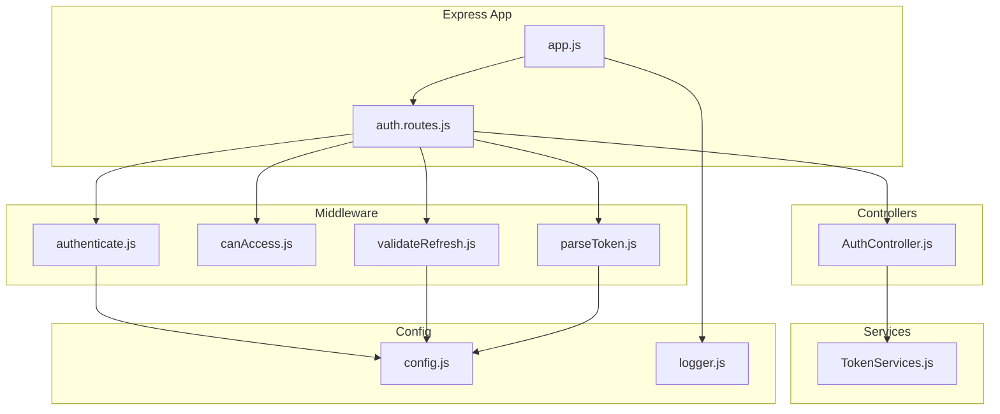
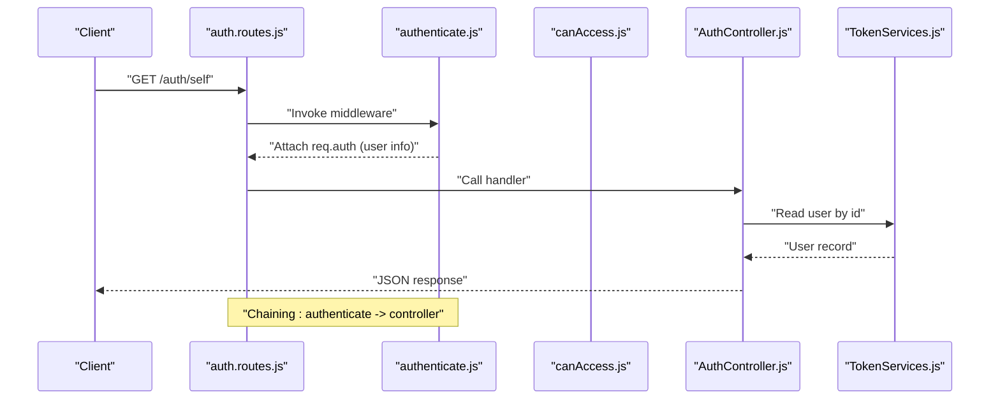
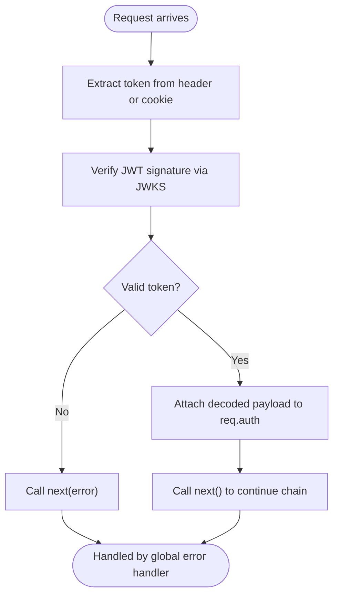
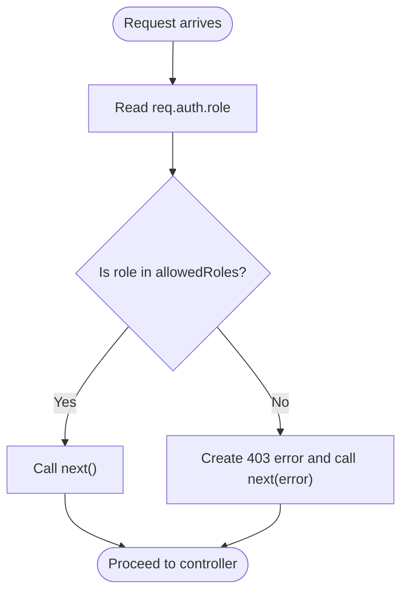
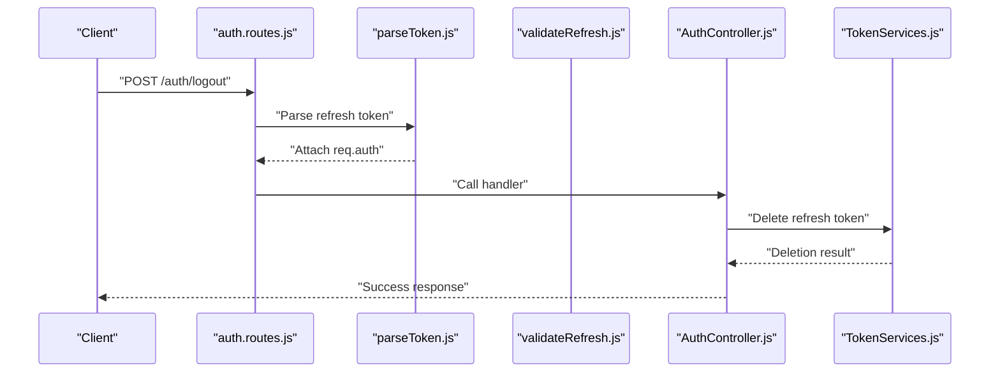
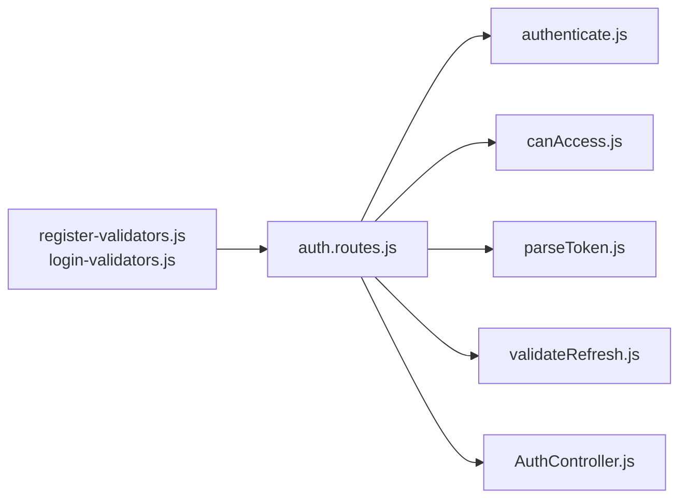
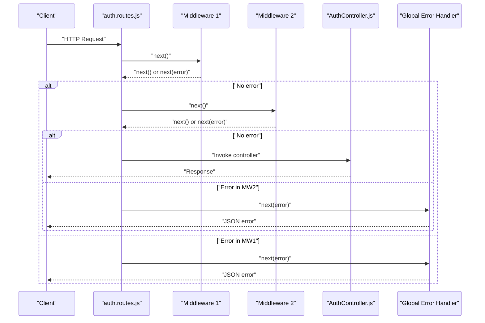
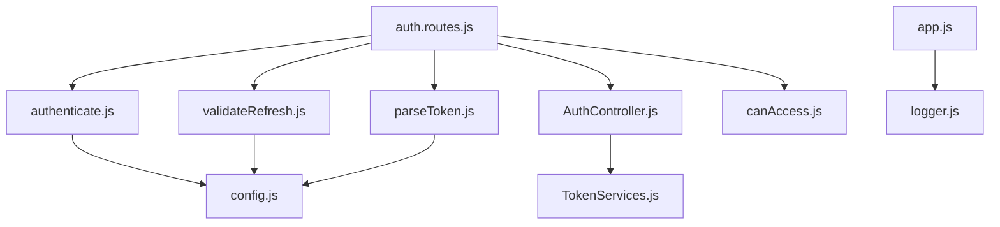

# Custom Middleware Development

<cite>
**Referenced Files in This Document**
- [authenticate.js](file://src/middleware/authenticate.js)
- [canAccess.js](file://src/middleware/canAccess.js)
- [parseToken.js](file://src/middleware/parseToken.js)
- [validateRefresh.js](file://src/middleware/validateRefresh.js)
- [auth.routes.js](file://src/routes/auth.routes.js)
- [app.js](file://src/app.js)
- [config.js](file://src/config/config.js)
- [logger.js](file://src/config/logger.js)
- [AuthController.js](file://src/controllers/AuthController.js)
- [TokenServices.js](file://src/services/TokenServices.js)
- [User.js](file://src/entity/User.js)
- [register-validators.js](file://src/validators/register-validators.js)
- [index.js](file://src/constants/index.js)
- [utils.js](file://src/utils/utils.js)
- [package.json](file://package.json)
</cite>

## Table of Contents
1. [Introduction](#introduction)
2. [Project Structure](#project-structure)
3. [Core Components](#core-components)
4. [Architecture Overview](#architecture-overview)
5. [Detailed Component Analysis](#detailed-component-analysis)
6. [Dependency Analysis](#dependency-analysis)
7. [Performance Considerations](#performance-considerations)
8. [Troubleshooting Guide](#troubleshooting-guide)
9. [Conclusion](#conclusion)
10. [Appendices](#appendices)

## Introduction
This document explains how to develop custom middleware for the authentication service. It focuses on middleware function signatures, request-response processing, integration with the existing middleware chain, and building validation, authentication filters, and custom business logic processors. It also covers error handling, async operations, middleware chaining, testing guidelines, performance considerations, and security best practices. Examples reference the existing patterns in authenticate.js and canAccess.js.

## Project Structure
The authentication service is organized around Express routing, middleware, controllers, services, validators, and configuration. Middleware is applied at the route level and integrates with controllers and services to enforce authentication and authorization policies.

**Diagram sources**
- [app.js:1-40](file://src/app.js#L1-L40)
- [auth.routes.js:1-49](file://src/routes/auth.routes.js#L1-L49)
- [authenticate.js:1-26](file://src/middleware/authenticate.js#L1-L26)
- [canAccess.js:1-23](file://src/middleware/canAccess.js#L1-L23)
- [parseToken.js:1-14](file://src/middleware/parseToken.js#L1-L14)
- [validateRefresh.js:1-34](file://src/middleware/validateRefresh.js#L1-L34)
- [AuthController.js:1-212](file://src/controllers/AuthController.js#L1-L212)
- [TokenServices.js:1-60](file://src/services/TokenServices.js#L1-L60)
- [config.js:1-34](file://src/config/config.js#L1-L34)
- [logger.js:1-42](file://src/config/logger.js#L1-L42)

**Section sources**
- [app.js:1-40](file://src/app.js#L1-L40)
- [auth.routes.js:1-49](file://src/routes/auth.routes.js#L1-L49)

## Core Components
- Authentication middleware: Validates access tokens using a JWKS-based secret and extracts tokens from Authorization headers or cookies.
- Role-based access control middleware: Enforces allowed roles for protected routes.
- Refresh token parsing middleware: Parses refresh tokens from cookies using a symmetric secret.
- Refresh token validation middleware: Verifies refresh tokens against persisted records to prevent reuse or revoked tokens.

These components demonstrate the standard Express middleware signature and integrate with controllers and services to implement authentication and authorization.

**Section sources**
- [authenticate.js:1-26](file://src/middleware/authenticate.js#L1-L26)
- [canAccess.js:1-23](file://src/middleware/canAccess.js#L1-L23)
- [parseToken.js:1-14](file://src/middleware/parseToken.js#L1-L14)
- [validateRefresh.js:1-34](file://src/middleware/validateRefresh.js#L1-L34)

## Architecture Overview
The middleware chain is mounted per-route. Authentication middleware validates tokens and attaches user info to the request. Authorization middleware checks roles. Business logic middleware (e.g., refresh validation) enforces additional constraints. Controllers consume validated request data and interact with services.

**Diagram sources**
- [auth.routes.js:37-39](file://src/routes/auth.routes.js#L37-L39)
- [authenticate.js:6-25](file://src/middleware/authenticate.js#L6-L25)
- [AuthController.js:138-141](file://src/controllers/AuthController.js#L138-L141)
- [TokenServices.js:45-52](file://src/services/TokenServices.js#L45-L52)

**Section sources**
- [auth.routes.js:37-39](file://src/routes/auth.routes.js#L37-L39)
- [authenticate.js:6-25](file://src/middleware/authenticate.js#L6-L25)
- [AuthController.js:138-141](file://src/controllers/AuthController.js#L138-L141)

## Detailed Component Analysis

### Authentication Middleware Pattern (authenticate.js)
- Purpose: Validates RS256 JWTs using JWKS and sets req.auth with decoded claims.
- Signature: Standard Express middleware (req, res, next).
- Token extraction: Reads Authorization header or accessToken cookie.
- Caching: Uses jwks-rsa caching and rate limiting for JWKS retrieval.
- Integration: Applied to routes requiring authenticated users.

**Diagram sources**
- [authenticate.js:6-25](file://src/middleware/authenticate.js#L6-L25)

**Section sources**
- [authenticate.js:1-26](file://src/middleware/authenticate.js#L1-L26)

### Authorization Middleware Pattern (canAccess.js)
- Purpose: Enforces role-based access control.
- Signature: Higher-order function returning middleware (req, res, next).
- Behavior: Checks req.auth.role against allowed roles; denies access with 403 if unauthorized.
- Integration: Used to decorate routes requiring specific roles.

**Diagram sources**
- [canAccess.js:4-22](file://src/middleware/canAccess.js#L4-L22)

**Section sources**
- [canAccess.js:1-23](file://src/middleware/canAccess.js#L1-L23)
- [index.js:1-6](file://src/constants/index.js#L1-L6)

### Refresh Token Parsing and Validation (parseToken.js, validateRefresh.js)
- Purpose: Parse refresh tokens from cookies and validate revocation status.
- Signature: Standard Express middleware.
- Behavior: Uses HS256 secret; validateRefresh checks persistence and revocation.

**Diagram sources**
- [auth.routes.js:44-46](file://src/routes/auth.routes.js#L44-L46)
- [parseToken.js:4-13](file://src/middleware/parseToken.js#L4-L13)
- [AuthController.js:194-210](file://src/controllers/AuthController.js#L194-L210)
- [TokenServices.js:54-58](file://src/services/TokenServices.js#L54-L58)

**Section sources**
- [parseToken.js:1-14](file://src/middleware/parseToken.js#L1-L14)
- [validateRefresh.js:1-34](file://src/middleware/validateRefresh.js#L1-L34)
- [auth.routes.js:44-46](file://src/routes/auth.routes.js#L44-L46)
- [AuthController.js:194-210](file://src/controllers/AuthController.js#L194-L210)

### Route-Level Middleware Integration (auth.routes.js)
- Routes apply middleware in order: validators, authentication, authorization, controller.
- Example: GET /auth/self applies authenticate before the controller method.

**Diagram sources**
- [auth.routes.js:1-49](file://src/routes/auth.routes.js#L1-L49)
- [register-validators.js:1-47](file://src/validators/register-validators.js#L1-L47)

**Section sources**
- [auth.routes.js:1-49](file://src/routes/auth.routes.js#L1-L49)

### Creating Custom Middleware

#### Validation Middleware
- Pattern: Use express-validator schemas to validate request bodies and attach errors to the response.
- Example reference: register-validators.js defines field-level validation rules.

Guidelines:
- Apply validation middleware before controllers.
- Return structured validation errors to clients.
- Keep validation logic reusable and centralized.

**Section sources**
- [register-validators.js:1-47](file://src/validators/register-validators.js#L1-L47)

#### Authentication Filters
- Pattern: Build middleware that reads tokens from headers or cookies and populates req.auth.
- Example reference: authenticate.js demonstrates token extraction and verification.

Guidelines:
- Support multiple token sources (Authorization header, cookies).
- Use caching and rate limiting for JWKS lookups.
- Propagate verification failures to the global error handler.

**Section sources**
- [authenticate.js:1-26](file://src/middleware/authenticate.js#L1-L26)

#### Authorization Filters
- Pattern: Build higher-order middleware that checks req.auth.role against allowed roles.
- Example reference: canAccess.js demonstrates role enforcement.

Guidelines:
- Define roles centrally (e.g., constants).
- Return standardized HTTP 403 errors for denied access.
- Chain authorization after authentication.

**Section sources**
- [canAccess.js:1-23](file://src/middleware/canAccess.js#L1-L23)
- [index.js:1-6](file://src/constants/index.js#L1-L6)

#### Custom Business Logic Processors
- Pattern: Use middleware to enforce revocation lists, rate limits, or audit logs.
- Example reference: validateRefresh.js demonstrates revocation checks against persisted refresh tokens.

Guidelines:
- Perform async operations carefully; handle errors and log failures.
- Keep middleware focused and composable.

**Section sources**
- [validateRefresh.js:1-34](file://src/middleware/validateRefresh.js#L1-L34)

### Request-Response Processing and Chaining
- Middleware signature: (req, res, next) where next may be called with an error to trigger the error handler.
- Global error handler: Centralized JSON error response with logging.
- Typical flow: validators -> auth -> authorization -> controller -> service.

**Diagram sources**
- [app.js:23-37](file://src/app.js#L23-L37)
- [auth.routes.js:29-46](file://src/routes/auth.routes.js#L29-L46)

**Section sources**
- [app.js:23-37](file://src/app.js#L23-L37)
- [auth.routes.js:29-46](file://src/routes/auth.routes.js#L29-L46)

### Error Handling in Middleware
- Use http-errors to create typed HTTP errors (e.g., 403).
- Call next(error) to propagate errors to the global error handler.
- Global error handler logs and responds with a normalized JSON structure.

Best practices:
- Avoid throwing raw errors; prefer http-errors.
- Log meaningful context in middleware (e.g., token IDs).
- Ensure consistent error shape across the app.

**Section sources**
- [canAccess.js:12-16](file://src/middleware/canAccess.js#L12-L16)
- [app.js:23-37](file://src/app.js#L23-L37)
- [logger.js:1-42](file://src/config/logger.js#L1-L42)

### Async Operations and Middleware
- Middleware may perform async work (e.g., database checks).
- Use try/catch blocks and call next(error) on failures.
- Ensure async errors are handled and logged.

Example reference: validateRefresh.js performs async revocation checks and logs errors.

**Section sources**
- [validateRefresh.js:14-30](file://src/middleware/validateRefresh.js#L14-L30)

### Security Best Practices
- Use HTTPS and secure cookie flags in production.
- Prefer short-lived access tokens and long-lived refresh tokens.
- Store refresh tokens securely and revoke on logout.
- Validate and sanitize all inputs using express-validator.
- Limit JWKS requests with caching and rate limiting.

**Section sources**
- [AuthController.js:50-62](file://src/controllers/AuthController.js#L50-L62)
- [AuthController.js:115-129](file://src/controllers/AuthController.js#L115-L129)
- [TokenServices.js:34-43](file://src/services/TokenServices.js#L34-L43)
- [authenticate.js:7-11](file://src/middleware/authenticate.js#L7-L11)

### Common Middleware Patterns
- Input sanitization: Use express-validator schemas to trim, normalize, and validate fields.
- Rate limiting: Implement per-endpoint or global rate limiting using middleware libraries.
- Audit logging: Log access attempts, successes, and failures using winston logger.

**Section sources**
- [register-validators.js:1-47](file://src/validators/register-validators.js#L1-L47)
- [logger.js:1-42](file://src/config/logger.js#L1-L42)

## Dependency Analysis
- Middleware depends on configuration (JWKS URI, secrets) and logging.
- Controllers depend on services for business logic and on middleware for preconditions.
- Routes compose middleware and controllers.

**Diagram sources**
- [authenticate.js:1-3](file://src/middleware/authenticate.js#L1-L3)
- [validateRefresh.js:1-5](file://src/middleware/validateRefresh.js#L1-L5)
- [parseToken.js:1-2](file://src/middleware/parseToken.js#L1-L2)
- [config.js:1-34](file://src/config/config.js#L1-L34)
- [auth.routes.js:12-14](file://src/routes/auth.routes.js#L12-L14)
- [AuthController.js:1-16](file://src/controllers/AuthController.js#L1-L16)
- [TokenServices.js:1-11](file://src/services/TokenServices.js#L1-L11)
- [app.js:2-6](file://src/app.js#L2-L6)
- [logger.js:1-42](file://src/config/logger.js#L1-L42)

**Section sources**
- [config.js:1-34](file://src/config/config.js#L1-L34)
- [auth.routes.js:12-14](file://src/routes/auth.routes.js#L12-L14)

## Performance Considerations
- Cache JWKS and minimize network calls.
- Use efficient database queries in middleware (e.g., avoid N+1).
- Keep middleware lightweight; offload heavy tasks to services.
- Monitor error rates and latency via logging.

[No sources needed since this section provides general guidance]

## Troubleshooting Guide
- Token validation failures: Check JWKS URI and algorithm configuration.
- Revoked refresh tokens: Verify database entries and middleware logic.
- Role-based access denials: Confirm roles stored on users and middleware allowed roles.
- Logging: Use winston transports to capture errors and debug information.

**Section sources**
- [authenticate.js:7-11](file://src/middleware/authenticate.js#L7-L11)
- [validateRefresh.js:14-30](file://src/middleware/validateRefresh.js#L14-L30)
- [logger.js:1-42](file://src/config/logger.js#L1-L42)

## Conclusion
Custom middleware in this service follows a consistent pattern: validate inputs early, authenticate and authorize later, and enforce business rules with dedicated middleware. By adhering to the established signatures, error propagation, and integration points, developers can extend the system with robust, secure, and maintainable middleware.

[No sources needed since this section summarizes without analyzing specific files]

## Appendices

### Testing Guidelines
- Use supertest to send requests to mounted routes.
- Initialize and tear down the database per test suite.
- Assert cookies, JWT validity, and persisted refresh tokens.
- Mock external dependencies (e.g., JWKS) when appropriate.

**Section sources**
- [register.spec.js:1-168](file://src/test/users/register.spec.js#L1-L168)
- [login.spec.js:1-92](file://src/test/users/login.spec.js#L1-L92)
- [utils.js:13-31](file://src/utils/utils.js#L13-L31)

### Environment and Dependencies
- Dependencies include express, express-jwt, jwks-rsa, winston, bcrypt, and others.
- Scripts support development, linting, testing, and migrations.

**Section sources**
- [package.json:1-48](file://package.json#L1-L48)