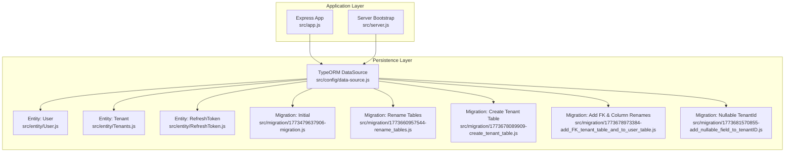
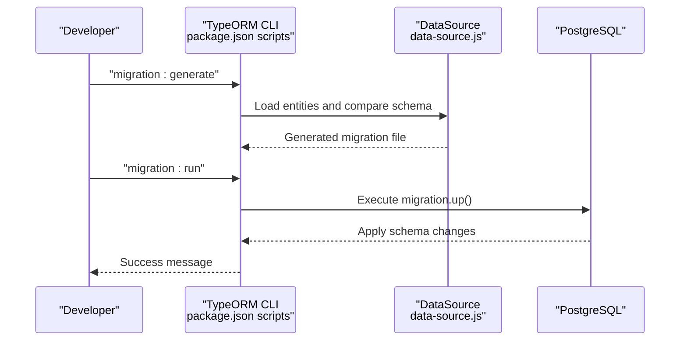
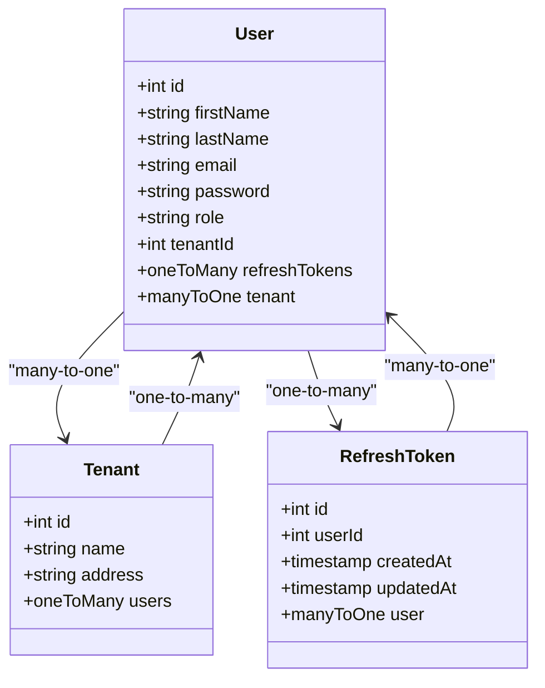
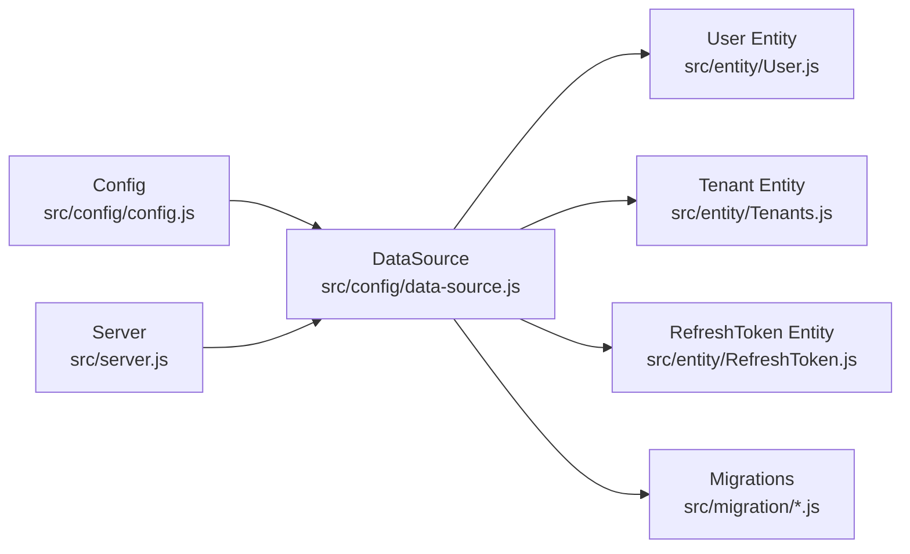
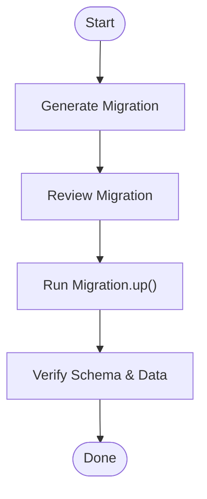

# Database Schema Changes

<cite>
**Referenced Files in This Document**
- [package.json](file://package.json)
- [src/config/data-source.js](file://src/config/data-source.js)
- [src/config/config.js](file://src/config/config.js)
- [src/server.js](file://src/server.js)
- [src/entity/User.js](file://src/entity/User.js)
- [src/entity/Tenants.js](file://src/entity/Tenants.js)
- [src/entity/RefreshToken.js](file://src/entity/RefreshToken.js)
- [src/migration/1773479637906-migration.js](file://src/migration/1773479637906-migration.js)
- [src/migration/1773660957544-rename_tables.js](file://src/migration/1773660957544-rename_tables.js)
- [src/migration/1773678089909-create_tenant_table.js](file://src/migration/1773678089909-create_tenant_table.js)
- [src/migration/1773678973384-add_FK_tenant_table_and_to_user_table.js](file://src/migration/1773678973384-add_FK_tenant_table_and_to_user_table.js)
- [src/migration/1773681570855-add_nullable_field_to_tenantID.js](file://src/migration/1773681570855-add_nullable_field_to_tenantID.js)
</cite>

## Table of Contents
1. [Introduction](#introduction)
2. [Project Structure](#project-structure)
3. [Core Components](#core-components)
4. [Architecture Overview](#architecture-overview)
5. [Detailed Component Analysis](#detailed-component-analysis)
6. [Dependency Analysis](#dependency-analysis)
7. [Performance Considerations](#performance-considerations)
8. [Troubleshooting Guide](#troubleshooting-guide)
9. [Conclusion](#conclusion)
10. [Appendices](#appendices)

## Introduction
This document explains how to manage database schema changes using TypeORM migrations and entity extensions in this project. It covers the migration lifecycle, entity modification patterns, data integrity considerations, and production deployment practices. It also provides guidance for extending existing entities such as User and Tenants with new fields and relationships, along with examples of adding new tables, altering existing schemas, and handling data transformations while respecting foreign key constraints and indexing strategies.

## Project Structure
The project organizes database-related concerns into clear layers:
- Entities define the logical model mapped to database tables.
- Migrations encapsulate schema changes and are executed against the database.
- Data source configuration connects the application to PostgreSQL and registers entities and migrations.
- Scripts automate migration generation and execution.

**Diagram sources**
- [src/server.js:1-21](file://src/server.js#L1-L21)
- [src/config/data-source.js:1-22](file://src/config/data-source.js#L1-L22)
- [src/entity/User.js:1-50](file://src/entity/User.js#L1-L50)
- [src/entity/Tenants.js:1-29](file://src/entity/Tenants.js#L1-L29)
- [src/entity/RefreshToken.js:1-35](file://src/entity/RefreshToken.js#L1-L35)
- [src/migration/1773479637906-migration.js:1-34](file://src/migration/1773479637906-migration.js#L1-L34)
- [src/migration/1773660957544-rename_tables.js:1-31](file://src/migration/1773660957544-rename_tables.js#L1-L31)
- [src/migration/1773678089909-create_tenant_table.js:1-31](file://src/migration/1773678089909-create_tenant_table.js#L1-L31)
- [src/migration/1773678973384-add_FK_tenant_table_and_to_user_table.js:1-39](file://src/migration/1773678973384-add_FK_tenant_table_and_to_user_table.js#L1-L39)
- [src/migration/1773681570855-add_nullable_field_to_tenantID.js:1-31](file://src/migration/1773681570855-add_nullable_field_to_tenantID.js#L1-L31)

**Section sources**
- [src/config/data-source.js:1-22](file://src/config/data-source.js#L1-L22)
- [package.json:1-48](file://package.json#L1-L48)

## Core Components
- TypeORM DataSource: Connects to PostgreSQL, registers entities, and loads migrations conditionally based on environment.
- Entities: Define columns, constraints, and relations for Users, Tenants, and RefreshTokens.
- Migrations: Encapsulate forward and reverse schema changes with explicit SQL statements.

Key behaviors:
- Environment-aware migration loading: migrations are loaded only outside test environments.
- Synchronize mode disabled for production/dev/test separation via environment checks.
- Entities and migrations are registered in the DataSource.

**Section sources**
- [src/config/data-source.js:8-21](file://src/config/data-source.js#L8-L21)
- [src/entity/User.js:1-50](file://src/entity/User.js#L1-L50)
- [src/entity/Tenants.js:1-29](file://src/entity/Tenants.js#L1-L29)
- [src/entity/RefreshToken.js:1-35](file://src/entity/RefreshToken.js#L1-L35)

## Architecture Overview
The schema change pipeline follows a deterministic order:
- Generate a migration from the current entity state.
- Review and refine the generated migration.
- Run the migration to apply changes to the database.
- Verify entity relations and constraints align with the schema.

**Diagram sources**
- [package.json:11-13](file://package.json#L11-L13)
- [src/config/data-source.js:18-19](file://src/config/data-source.js#L18-L19)

## Detailed Component Analysis

### Migration Creation and Execution
- Generation: Use the provided script to generate a migration based on entity differences.
- Execution: Run the migration to apply changes to the database.
- Creation: Optionally create an empty migration template for manual edits.

Operational notes:
- Scripts are environment-aware and use cross-env to set NODE_ENV.
- Migrations are loaded only when NODE_ENV is not test.

**Section sources**
- [package.json:11-13](file://package.json#L11-L13)
- [src/config/data-source.js:18-19](file://src/config/data-source.js#L18-L19)

### Migration File Structure and Patterns
Each migration class implements:
- name: Human-readable identifier.
- up(queryRunner): Applies schema changes.
- down(queryRunner): Reverses changes.

Common patterns observed:
- Creating tables with primary keys and constraints.
- Adding columns and foreign keys.
- Renaming columns and altering nullability.
- Dropping constraints before altering columns and re-adding constraints.

Example patterns:
- Creating initial tables and adding foreign keys.
- Renaming tables and updating constraints accordingly.
- Introducing a new Tenant table and linking it to User.
- Renaming a column and adjusting foreign key constraints.
- Making a previously required column nullable and updating constraints.

**Section sources**
- [src/migration/1773479637906-migration.js:10-33](file://src/migration/1773479637906-migration.js#L10-L33)
- [src/migration/1773660957544-rename_tables.js:10-30](file://src/migration/1773660957544-rename_tables.js#L10-L30)
- [src/migration/1773678089909-create_tenant_table.js:10-30](file://src/migration/1773678089909-create_tenant_table.js#L10-L30)
- [src/migration/1773678973384-add_FK_tenant_table_and_to_user_table.js:10-38](file://src/migration/1773678973384-add_FK_tenant_table_and_to_user_table.js#L10-L38)
- [src/migration/1773681570855-add_nullable_field_to_tenantID.js:10-30](file://src/migration/1773681570855-add_nullable_field_to_tenantID.js#L10-L30)

### Entity Modification Patterns
Entities define the logical model and must remain in sync with migrations:
- Columns: Define types, nullability, and uniqueness.
- Relations: Define one-to-many and many-to-one relationships with join columns.
- Constraints: Enforced at the entity level and reflected in migrations.

Observed patterns:
- User entity includes tenantId with nullable: true and a many-to-one relation to Tenant.
- Tenant entity defines a one-to-many relation to User.
- RefreshToken entity links to User via userId.

Guidelines:
- When adding a new field to an entity, ensure the migration adds the column and any necessary constraints.
- When changing a field’s nullability, update both the entity and the migration’s alter statement.
- When renaming a column, update both the entity and the migration’s rename statement.

**Section sources**
- [src/entity/User.js:30-48](file://src/entity/User.js#L30-L48)
- [src/entity/Tenants.js:21-27](file://src/entity/Tenants.js#L21-L27)
- [src/entity/RefreshToken.js:12-33](file://src/entity/RefreshToken.js#L12-L33)

### Data Integrity Considerations
- Foreign Keys: Migrations consistently add and drop foreign key constraints around column alterations.
- Nullability: Alterations adjust NOT NULL constraints and re-add foreign keys to preserve referential integrity.
- Unique Constraints: Primary keys and unique constraints are explicitly defined in migrations.

Best practices:
- Drop constraints before altering columns and re-add them afterward.
- Validate referential integrity after applying migrations.
- Test migrations in a staging environment before production.

**Section sources**
- [src/migration/1773678973384-add_FK_tenant_table_and_to_user_table.js:17-23](file://src/migration/1773678973384-add_FK_tenant_table_and_to_user_table.js#L17-L23)
- [src/migration/1773681570855-add_nullable_field_to_tenantID.js:17-19](file://src/migration/1773681570855-add_nullable_field_to_tenantID.js#L17-L19)

### Extending Existing Entities: User and Tenants
Extending entities involves:
- Updating the entity definition to reflect new fields and relationships.
- Creating a migration to add columns, constraints, and foreign keys.
- Ensuring the migration’s down method reverses changes safely.

Examples:
- Adding a tenantId column to User and linking it to Tenant.
- Renaming userId to tenantId and enforcing NOT NULL.
- Making tenantId nullable and updating constraints.

**Diagram sources**
- [src/entity/User.js:3-49](file://src/entity/User.js#L3-L49)
- [src/entity/Tenants.js:3-28](file://src/entity/Tenants.js#L3-L28)
- [src/entity/RefreshToken.js:3-34](file://src/entity/RefreshToken.js#L3-L34)

**Section sources**
- [src/entity/User.js:30-48](file://src/entity/User.js#L30-L48)
- [src/entity/Tenants.js:21-27](file://src/entity/Tenants.js#L21-L27)
- [src/entity/RefreshToken.js:12-33](file://src/entity/RefreshToken.js#L12-L33)

### Migration File Structure Details
- Class name: Follows a timestamp-based naming convention.
- name property: Human-readable identifier for the migration.
- up(): Executes forward changes using queryRunner.query().
- down(): Executes reverse changes to revert the schema.

Forward and reverse strategies:
- Forward: Create tables, add columns, add constraints, and establish foreign keys.
- Reverse: Drop constraints, remove columns, and drop tables in reverse dependency order.

**Section sources**
- [src/migration/1773479637906-migration.js:10-33](file://src/migration/1773479637906-migration.js#L10-L33)
- [src/migration/1773660957544-rename_tables.js:10-30](file://src/migration/1773660957544-rename_tables.js#L10-L30)
- [src/migration/1773678089909-create_tenant_table.js:10-30](file://src/migration/1773678089909-create_tenant_table.js#L10-L30)
- [src/migration/1773678973384-add_FK_tenant_table_and_to_user_table.js:10-38](file://src/migration/1773678973384-add_FK_tenant_table_and_to_user_table.js#L10-L38)
- [src/migration/1773681570855-add_nullable_field_to_tenantID.js:10-30](file://src/migration/1773681570855-add_nullable_field_to_tenantID.js#L10-L30)

### Production Deployment Considerations
- Environment gating: Migrations are loaded only outside test environments.
- Synchronize mode: Disabled to prevent automatic schema changes in non-test environments.
- Rollback readiness: Each migration includes a down method to revert changes.
- Validation: Ensure migrations are tested in staging before production deployment.

**Section sources**
- [src/config/data-source.js:18-19](file://src/config/data-source.js#L18-L19)
- [src/config/data-source.js:15-16](file://src/config/data-source.js#L15-L16)

### Examples: Adding New Tables, Modifying Schemas, and Data Transformations
- Adding a new table:
  - Create the table in up() and add foreign keys.
  - Drop constraints and columns in down() before dropping the table.
- Modifying existing schemas:
  - Drop constraints before altering columns.
  - Re-add constraints after altering columns.
- Handling data transformations:
  - Use raw SQL in migrations for complex transformations.
  - Ensure referential integrity is preserved during transformations.

**Section sources**
- [src/migration/1773678089909-create_tenant_table.js:16-29](file://src/migration/1773678089909-create_tenant_table.js#L16-L29)
- [src/migration/1773678973384-add_FK_tenant_table_and_to_user_table.js:17-23](file://src/migration/1773678973384-add_FK_tenant_table_and_to_user_table.js#L17-L23)
- [src/migration/1773681570855-add_nullable_field_to_tenantID.js:17-19](file://src/migration/1773681570855-add_nullable_field_to_tenantID.js#L17-L19)

### Foreign Key Constraints and Indexing Strategies
- Foreign keys:
  - Added after table creation or column addition.
  - Dropped before altering columns to avoid constraint violations.
- Indexing:
  - Primary keys are implicitly indexed.
  - Unique constraints enforce uniqueness and create indexes.
  - Consider adding indexes for frequently queried columns in future migrations.

**Section sources**
- [src/migration/1773479637906-migration.js:21](file://src/migration/1773479637906-migration.js#L21)
- [src/migration/1773660957544-rename_tables.js:19](file://src/migration/1773660957544-rename_tables.js#L19)
- [src/migration/1773678089909-create_tenant_table.js:19](file://src/migration/1773678089909-create_tenant_table.js#L19)

### Performance Implications of Schema Changes
- Large table alterations:
  - Consider breaking changes into smaller steps to minimize downtime.
  - Use background jobs for heavy data transformations.
- Constraint operations:
  - Dropping and re-adding constraints can be expensive; batch operations where possible.
- Index creation:
  - Adding indexes on large tables may require maintenance windows.

[No sources needed since this section provides general guidance]

## Dependency Analysis
The application depends on TypeORM for persistence and PostgreSQL for storage. The DataSource registers entities and migrations and controls environment-specific behavior.

**Diagram sources**
- [src/config/config.js:1-34](file://src/config/config.js#L1-L34)
- [src/config/data-source.js:1-22](file://src/config/data-source.js#L1-L22)
- [src/server.js:1-21](file://src/server.js#L1-L21)

**Section sources**
- [src/config/data-source.js:8-21](file://src/config/data-source.js#L8-L21)
- [src/config/config.js:23-33](file://src/config/config.js#L23-L33)

## Performance Considerations
- Batch operations: Group related schema changes to reduce transaction overhead.
- Background processing: For large data updates, schedule outside peak hours.
- Monitoring: Track migration execution times and database performance metrics.
- Rollback planning: Ensure down migrations are efficient and reversible.

[No sources needed since this section provides general guidance]

## Troubleshooting Guide
Common issues and resolutions:
- Migration conflicts:
  - Ensure migrations are applied in order and there are no conflicting changes.
  - Use the down method to roll back problematic migrations.
- Constraint errors:
  - Drop constraints before altering columns; re-add them afterward.
- Environment mismatches:
  - Verify NODE_ENV settings and migration loading behavior.
- Connection failures:
  - Confirm database credentials and network connectivity.

**Section sources**
- [src/config/data-source.js:18-19](file://src/config/data-source.js#L18-L19)
- [src/migration/1773678973384-add_FK_tenant_table_and_to_user_table.js:29-37](file://src/migration/1773678973384-add_FK_tenant_table_and_to_user_table.js#L29-L37)

## Conclusion
This project demonstrates a robust approach to managing database schema changes using TypeORM migrations and entity-driven development. By following the established patterns—generating migrations, carefully handling constraints, and validating changes—you can safely evolve the schema while maintaining data integrity. Use the provided scripts and environment gating to streamline development and deployment, and adopt the troubleshooting and performance recommendations to ensure smooth operations.

[No sources needed since this section summarizes without analyzing specific files]

## Appendices

### Appendix A: Migration Lifecycle Checklist
- Generate migration from entity changes.
- Review and refine migration content.
- Test migration in staging environment.
- Run migration in production with monitoring.
- Verify entity relations and constraints.

**Section sources**
- [package.json:11-13](file://package.json#L11-L13)
- [src/config/data-source.js:18-19](file://src/config/data-source.js#L18-L19)

### Appendix B: Example Migration Flow

[No sources needed since this diagram shows conceptual workflow, not actual code structure]