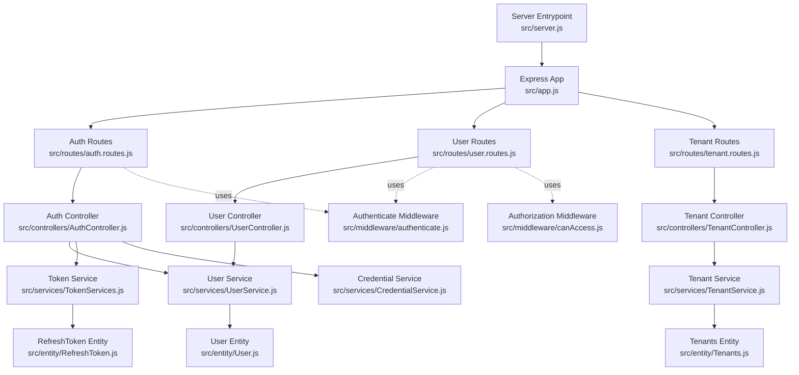
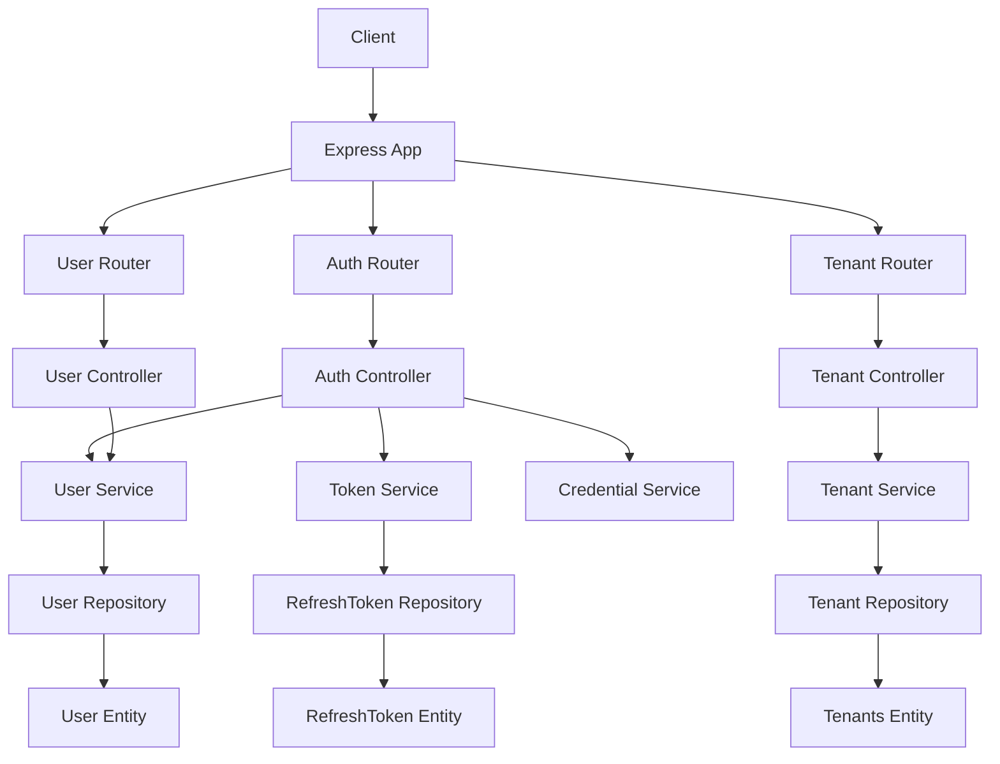
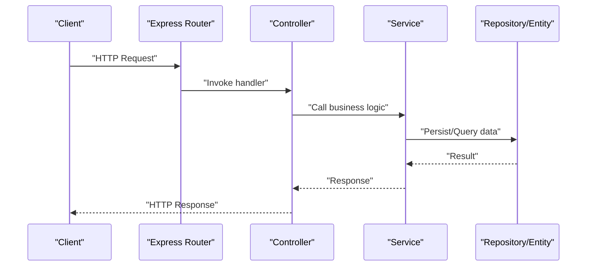
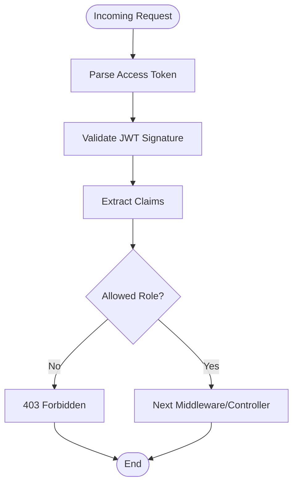
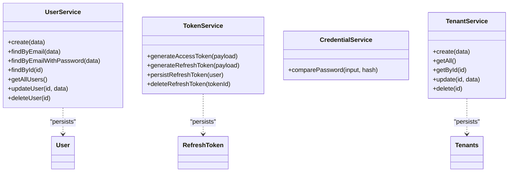
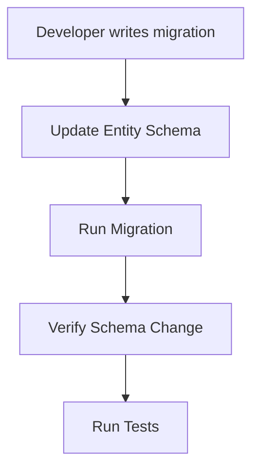
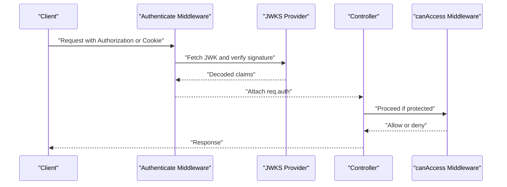
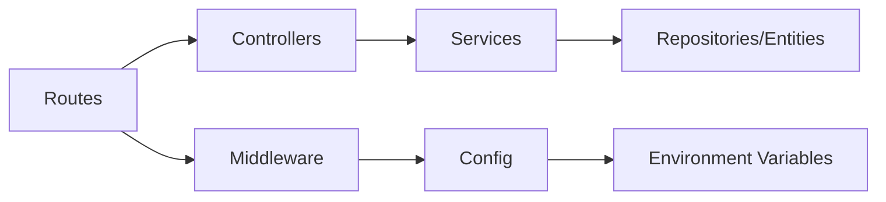

# Extension and Customization

<cite>
**Referenced Files in This Document**
- [src/app.js](file://src/app.js)
- [src/server.js](file://src/server.js)
- [src/config/config.js](file://src/config/config.js)
- [src/config/data-source.js](file://src/config/data-source.js)
- [src/controllers/AuthController.js](file://src/controllers/AuthController.js)
- [src/controllers/UserController.js](file://src/controllers/UserController.js)
- [src/controllers/TenantController.js](file://src/controllers/TenantController.js)
- [src/routes/auth.routes.js](file://src/routes/auth.routes.js)
- [src/routes/user.routes.js](file://src/routes/user.routes.js)
- [src/routes/tenant.routes.js](file://src/routes/tenant.routes.js)
- [src/services/UserService.js](file://src/services/UserService.js)
- [src/services/TenantService.js](file://src/services/TenantService.js)
- [src/services/TokenServices.js](file://src/services/TokenServices.js)
- [src/services/CredentialService.js](file://src/services/CredentialService.js)
- [src/middleware/authenticate.js](file://src/middleware/authenticate.js)
- [src/middleware/canAccess.js](file://src/middleware/canAccess.js)
- [src/middleware/parseToken.js](file://src/middleware/parseToken.js)
- [src/middleware/validateRefresh.js](file://src/middleware/validateRefresh.js)
- [src/entity/User.js](file://src/entity/User.js)
- [src/entity/RefreshToken.js](file://src/entity/RefreshToken.js)
- [src/entity/Tenants.js](file://src/entity/Tenants.js)
- [src/migration/1773678089909-create_tenant_table.js](file://src/migration/1773678089909-create_tenant_table.js)
- [src/migration/1773660957544-rename_tables.js](file://src/migration/1773660957544-rename_tables.js)
- [src/migration/1773678973384-add_FK_tenant_table_and_to_user_table.js](file://src/migration/1773678973384-add_FK_tenant_table_and_to_user_table.js)
- [src/migration/1773681570855-add_nullable_field_to_tenantID.js](file://src/migration/1773681570855-add_nullable_field_to_tenantID.js)
- [src/constants/index.js](file://src/constants/index.js)
- [package.json](file://package.json)
</cite>

## Table of Contents
1. [Introduction](#introduction)
2. [Project Structure](#project-structure)
3. [Core Components](#core-components)
4. [Architecture Overview](#architecture-overview)
5. [Detailed Component Analysis](#detailed-component-analysis)
6. [Dependency Analysis](#dependency-analysis)
7. [Performance Considerations](#performance-considerations)
8. [Troubleshooting Guide](#troubleshooting-guide)
9. [Conclusion](#conclusion)
10. [Appendices](#appendices)

## Introduction
This document explains how to extend and customize the authentication service. It covers:
- Adding new endpoints by extending routes, controllers, and services
- Building custom middleware and integrating it into the existing middleware chain
- Extending the service layer with new business logic
- Managing database schema changes via TypeORM migrations and entity updates
- Security customizations including authentication schemes, authorization rules, and token modifications
- Guidelines for backward compatibility, code organization, and testing

## Project Structure
The service follows a layered architecture:
- Express app bootstrapped in the server entrypoint
- Routes define endpoint contracts and wire to controllers
- Controllers orchestrate requests and delegate to services
- Services encapsulate business logic and interact with repositories
- Entities define database schema via TypeORM
- Middleware enforces authentication and authorization
- Migrations manage schema evolution

**Diagram sources**
- [src/server.js:1-21](file://src/server.js#L1-L21)
- [src/app.js:1-40](file://src/app.js#L1-L40)
- [src/routes/auth.routes.js:1-49](file://src/routes/auth.routes.js#L1-L49)
- [src/routes/user.routes.js:1-38](file://src/routes/user.routes.js#L1-L38)
- [src/routes/tenant.routes.js](file://src/routes/tenant.routes.js)
- [src/controllers/AuthController.js:1-212](file://src/controllers/AuthController.js#L1-L212)
- [src/controllers/UserController.js:1-95](file://src/controllers/UserController.js#L1-L95)
- [src/controllers/TenantController.js](file://src/controllers/TenantController.js)
- [src/services/UserService.js:1-99](file://src/services/UserService.js#L1-L99)
- [src/services/TokenServices.js:1-60](file://src/services/TokenServices.js#L1-L60)
- [src/services/CredentialService.js](file://src/services/CredentialService.js)
- [src/services/TenantService.js](file://src/services/TenantService.js)
- [src/entity/User.js:1-50](file://src/entity/User.js#L1-L50)
- [src/entity/RefreshToken.js](file://src/entity/RefreshToken.js)
- [src/entity/Tenants.js](file://src/entity/Tenants.js)
- [src/middleware/authenticate.js:1-26](file://src/middleware/authenticate.js#L1-L26)
- [src/middleware/canAccess.js:1-23](file://src/middleware/canAccess.js#L1-L23)

**Section sources**
- [src/server.js:1-21](file://src/server.js#L1-L21)
- [src/app.js:1-40](file://src/app.js#L1-L40)

## Core Components
- Application bootstrap initializes the database and starts the HTTP server.
- Routes define endpoints under /auth, /users, and /tenants.
- Controllers implement request handling and coordinate services.
- Services encapsulate business logic and database interactions.
- Middleware enforces JWT-based authentication and role-based authorization.
- Entities model the database schema; migrations evolve the schema.

Key extension points:
- Add new routes under src/routes and mount them in src/app.js
- Implement a controller in src/controllers
- Add or modify services in src/services
- Extend entities and create migrations in src/entity and src/migration
- Integrate custom middleware in the route chain

**Section sources**
- [src/app.js:1-40](file://src/app.js#L1-L40)
- [src/server.js:1-21](file://src/server.js#L1-L21)
- [src/routes/auth.routes.js:1-49](file://src/routes/auth.routes.js#L1-L49)
- [src/routes/user.routes.js:1-38](file://src/routes/user.routes.js#L1-L38)
- [src/controllers/AuthController.js:1-212](file://src/controllers/AuthController.js#L1-L212)
- [src/controllers/UserController.js:1-95](file://src/controllers/UserController.js#L1-L95)
- [src/services/UserService.js:1-99](file://src/services/UserService.js#L1-L99)
- [src/services/TokenServices.js:1-60](file://src/services/TokenServices.js#L1-L60)
- [src/middleware/authenticate.js:1-26](file://src/middleware/authenticate.js#L1-L26)
- [src/middleware/canAccess.js:1-23](file://src/middleware/canAccess.js#L1-L23)

## Architecture Overview
The system uses a clean architecture pattern:
- HTTP layer (Express) handles transport
- Routing layer (Express Router) defines endpoints
- Controller layer orchestrates request handling
- Service layer encapsulates business logic
- Persistence layer (TypeORM) manages entities and migrations
- Security layer (JWT, middleware) enforces authentication and authorization

**Diagram sources**
- [src/app.js:1-40](file://src/app.js#L1-L40)
- [src/routes/auth.routes.js:1-49](file://src/routes/auth.routes.js#L1-L49)
- [src/routes/user.routes.js:1-38](file://src/routes/user.routes.js#L1-L38)
- [src/routes/tenant.routes.js](file://src/routes/tenant.routes.js)
- [src/controllers/AuthController.js:1-212](file://src/controllers/AuthController.js#L1-L212)
- [src/controllers/UserController.js:1-95](file://src/controllers/UserController.js#L1-L95)
- [src/controllers/TenantController.js](file://src/controllers/TenantController.js)
- [src/services/UserService.js:1-99](file://src/services/UserService.js#L1-L99)
- [src/services/TokenServices.js:1-60](file://src/services/TokenServices.js#L1-L60)
- [src/services/TenantService.js](file://src/services/TenantService.js)
- [src/entity/User.js:1-50](file://src/entity/User.js#L1-L50)
- [src/entity/RefreshToken.js](file://src/entity/RefreshToken.js)
- [src/entity/Tenants.js](file://src/entity/Tenants.js)

## Detailed Component Analysis

### Adding New Endpoints: Step-by-Step Pattern
Follow this pattern to add a new feature (e.g., a new tenant-related endpoint):
1. Define the route in the appropriate router file and mount it in the app.
2. Create a controller method to handle the request.
3. Implement or reuse a service method for business logic.
4. Add validators and middleware as needed.
5. Write tests and ensure backward compatibility.

**Diagram sources**
- [src/app.js:19-21](file://src/app.js#L19-L21)
- [src/routes/user.routes.js:15-35](file://src/routes/user.routes.js#L15-L35)
- [src/controllers/UserController.js:12-94](file://src/controllers/UserController.js#L12-L94)
- [src/services/UserService.js:7-97](file://src/services/UserService.js#L7-L97)

**Section sources**
- [src/app.js:19-21](file://src/app.js#L19-L21)
- [src/routes/user.routes.js:15-35](file://src/routes/user.routes.js#L15-L35)
- [src/controllers/UserController.js:12-94](file://src/controllers/UserController.js#L12-L94)
- [src/services/UserService.js:7-97](file://src/services/UserService.js#L7-L97)

### Custom Middleware Development and Integration
Custom middleware can be integrated into the route chain. The existing chain demonstrates:
- Authentication middleware validating tokens via JWKS
- Authorization middleware enforcing role checks
- Token parsing and refresh validation middleware

Patterns:
- Export a function that accepts (req, res, next)
- Use express-jwt for JWT-based authentication
- Use express-validator for input validation
- Integrate middleware in the route chain before controller handlers

**Diagram sources**
- [src/middleware/authenticate.js:6-25](file://src/middleware/authenticate.js#L6-L25)
- [src/middleware/canAccess.js:4-22](file://src/middleware/canAccess.js#L4-L22)

**Section sources**
- [src/middleware/authenticate.js:1-26](file://src/middleware/authenticate.js#L1-L26)
- [src/middleware/canAccess.js:1-23](file://src/middleware/canAccess.js#L1-L23)
- [src/middleware/parseToken.js](file://src/middleware/parseToken.js)
- [src/middleware/validateRefresh.js](file://src/middleware/validateRefresh.js)

### Service Layer Extensions
Extend business logic by adding methods to existing services or creating new ones:
- UserService: user creation, retrieval, updates, deletion
- TokenService: access/refresh token generation and persistence
- CredentialService: password hashing/verification
- TenantService: tenant CRUD operations

Guidelines:
- Keep services focused on single responsibilities
- Encapsulate repository interactions
- Throw structured errors for consistent handling
- Return minimal DTOs from services to controllers

**Diagram sources**
- [src/services/UserService.js:3-98](file://src/services/UserService.js#L3-L98)
- [src/services/TokenServices.js:8-59](file://src/services/TokenServices.js#L8-L59)
- [src/services/CredentialService.js](file://src/services/CredentialService.js)
- [src/services/TenantService.js](file://src/services/TenantService.js)

**Section sources**
- [src/services/UserService.js:1-99](file://src/services/UserService.js#L1-L99)
- [src/services/TokenServices.js:1-60](file://src/services/TokenServices.js#L1-L60)

### Database Schema Changes via TypeORM Migrations and Entity Extensions
Schema evolution is managed through migrations and entities:
- Create a new migration using the provided scripts
- Modify entities to reflect schema changes
- Run migrations to apply changes to the database

Common scenarios:
- Adding new columns to existing tables
- Creating new tables with foreign keys
- Altering constraints or indexes

**Diagram sources**
- [package.json:11-13](file://package.json#L11-L13)
- [src/migration/1773678089909-create_tenant_table.js:10-30](file://src/migration/1773678089909-create_tenant_table.js#L10-L30)

**Section sources**
- [package.json:11-13](file://package.json#L11-L13)
- [src/migration/1773678089909-create_tenant_table.js:1-31](file://src/migration/1773678089909-create_tenant_table.js#L1-L31)
- [src/migration/1773660957544-rename_tables.js](file://src/migration/1773660957544-rename_tables.js)
- [src/migration/1773678973384-add_FK_tenant_table_and_to_user_table.js](file://src/migration/1773678973384-add_FK_tenant_table_and_to_user_table.js)
- [src/migration/1773681570855-add_nullable_field_to_tenantID.js](file://src/migration/1773681570855-add_nullable_field_to_tenantID.js)
- [src/entity/User.js:1-50](file://src/entity/User.js#L1-L50)
- [src/entity/RefreshToken.js](file://src/entity/RefreshToken.js)
- [src/entity/Tenants.js](file://src/entity/Tenants.js)

### Security Customizations
Authentication and authorization:
- Authentication scheme: RS256 via JWKS for access tokens; HS256 with a shared secret for refresh tokens
- Token extraction: Authorization header bearer or cookies
- Authorization: Role-based access control enforced by middleware
- Cookie security: httpOnly, SameSite strict, configurable domain/maxAge

Customization examples:
- Switch to a different signing algorithm or key management
- Add scopes or claims to tokens
- Implement custom token introspection or blacklist
- Enforce additional session policies (IP binding, device fingerprinting)

**Diagram sources**
- [src/middleware/authenticate.js:6-25](file://src/middleware/authenticate.js#L6-L25)
- [src/middleware/canAccess.js:4-22](file://src/middleware/canAccess.js#L4-L22)
- [src/controllers/AuthController.js:50-62](file://src/controllers/AuthController.js#L50-L62)
- [src/controllers/AuthController.js:115-128](file://src/controllers/AuthController.js#L115-L128)

**Section sources**
- [src/middleware/authenticate.js:1-26](file://src/middleware/authenticate.js#L1-L26)
- [src/middleware/canAccess.js:1-23](file://src/middleware/canAccess.js#L1-L23)
- [src/services/TokenServices.js:12-43](file://src/services/TokenServices.js#L12-L43)
- [src/controllers/AuthController.js:50-62](file://src/controllers/AuthController.js#L50-L62)
- [src/controllers/AuthController.js:115-128](file://src/controllers/AuthController.js#L115-L128)

### Backward Compatibility, Organization, and Testing
Guidelines:
- Maintain stable route paths and response shapes
- Version APIs at the route level when breaking changes are necessary
- Keep controllers thin; delegate logic to services
- Use validators to enforce input contracts
- Add unit and integration tests for new features
- Use environment-aware configuration for secrets and URIs

Testing strategy:
- Unit tests for services and middleware
- Integration tests for routes and controllers
- Mock external dependencies (e.g., JWKS, database)

**Section sources**
- [src/config/config.js:1-34](file://src/config/config.js#L1-L34)
- [src/test/users/create.spec.js](file://src/test/users/create.spec.js)
- [src/test/users/login.spec.js](file://src/test/users/login.spec.js)
- [src/test/users/refresh.spec.js](file://src/test/users/refresh.spec.js)
- [src/test/users/register.spec.js](file://src/test/users/register.spec.js)
- [src/test/users/user.spec.js](file://src/test/users/user.spec.js)
- [src/test/tenant/create.spec.js](file://src/test/tenant/create.spec.js)

## Dependency Analysis
The system exhibits low coupling and high cohesion:
- Routes depend on controllers
- Controllers depend on services
- Services depend on repositories/entities
- Middleware is reusable and composable
- Configuration is centralized

Potential risks:
- Tight coupling between controllers and services can be mitigated by dependency injection
- Centralized configuration enables environment-specific behavior

**Diagram sources**
- [src/app.js:19-21](file://src/app.js#L19-L21)
- [src/routes/auth.routes.js:22-27](file://src/routes/auth.routes.js#L22-L27)
- [src/config/config.js:23-33](file://src/config/config.js#L23-L33)

**Section sources**
- [src/app.js:19-21](file://src/app.js#L19-L21)
- [src/config/config.js:1-34](file://src/config/config.js#L1-L34)

## Performance Considerations
- Prefer token caching and efficient JWKS configuration
- Minimize database roundtrips by batching queries in services
- Use pagination for list endpoints
- Optimize middleware order to fail fast
- Monitor token generation and persistence latency

## Troubleshooting Guide
Common issues and resolutions:
- Validation errors: express-validator returns structured errors; ensure validators are attached to routes
- Authentication failures: verify JWKS URI and token signing algorithms
- Authorization failures: confirm roles and middleware ordering
- Database connection errors: check environment variables and datasource initialization
- Cookie issues: ensure SameSite, httpOnly, and domain settings align with client expectations

**Section sources**
- [src/app.js:24-37](file://src/app.js#L24-L37)
- [src/middleware/authenticate.js:6-25](file://src/middleware/authenticate.js#L6-L25)
- [src/middleware/canAccess.js:10-17](file://src/middleware/canAccess.js#L10-L17)
- [src/config/config.js:23-33](file://src/config/config.js#L23-L33)

## Conclusion
The authentication service is designed for extensibility. By following the established patterns—routes → controllers → services → entities/migrations—and leveraging middleware for cross-cutting concerns—you can safely introduce new features, customize security, and maintain backward compatibility.

## Appendices

### A. Adding a New Endpoint: Example Checklist
- Create a new router file under src/routes and export the router
- Mount the router in src/app.js
- Implement a controller method in src/controllers
- Add or reuse a service method in src/services
- Add validators and middleware to the route
- Add tests under src/test
- Update documentation and run linters/tests

**Section sources**
- [src/app.js:19-21](file://src/app.js#L19-L21)
- [src/routes/user.routes.js:15-35](file://src/routes/user.routes.js#L15-L35)
- [src/controllers/UserController.js:12-94](file://src/controllers/UserController.js#L12-L94)
- [src/services/UserService.js:7-97](file://src/services/UserService.js#L7-L97)

### B. Environment Configuration Reference
- PORT, DB_HOST, DB_NAME, DB_USERNAME, DB_PASSWORD, DB_PORT, PRIVATE_KEY_SECRET, JWKS_URI
- Configure per environment using dotenv

**Section sources**
- [src/config/config.js:23-33](file://src/config/config.js#L23-L33)

### C. Migration Scripts
- migration:generate, migration:run, migration:create
- Use these scripts to scaffold and apply schema changes

**Section sources**
- [package.json:11-13](file://package.json#L11-L13)