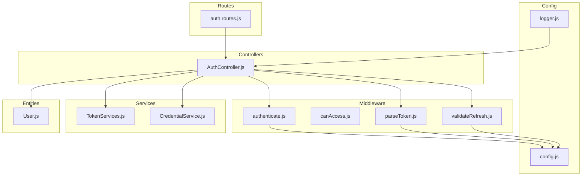
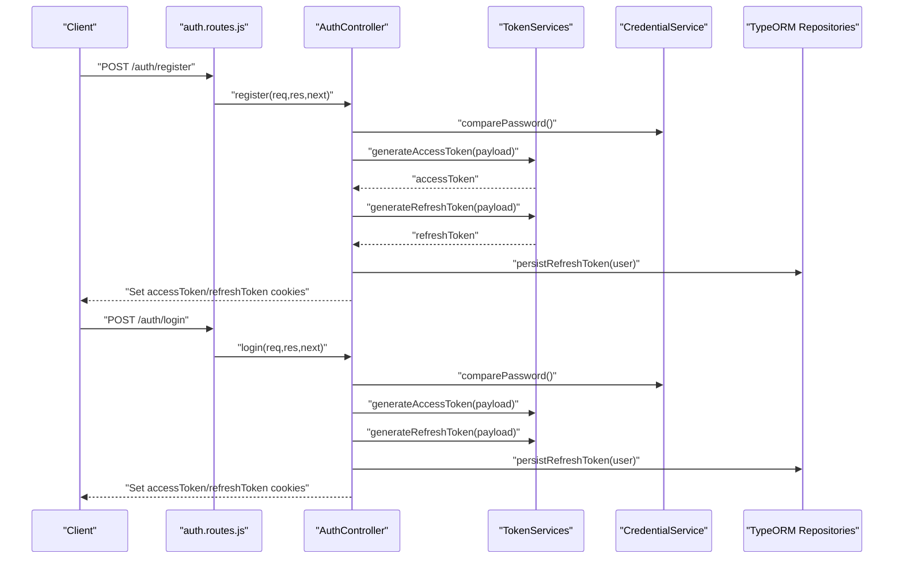
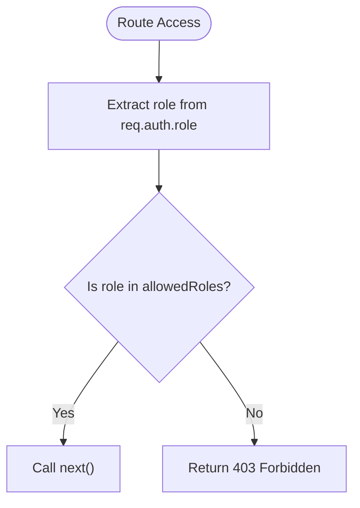
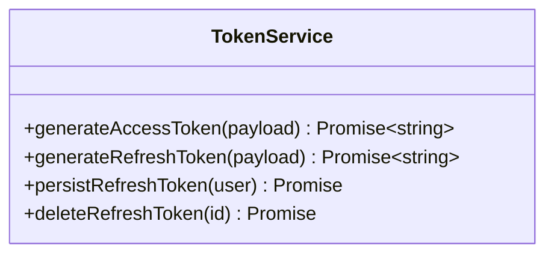
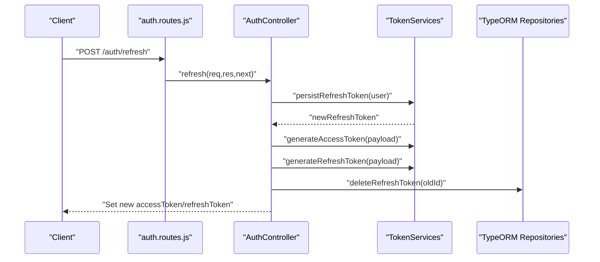
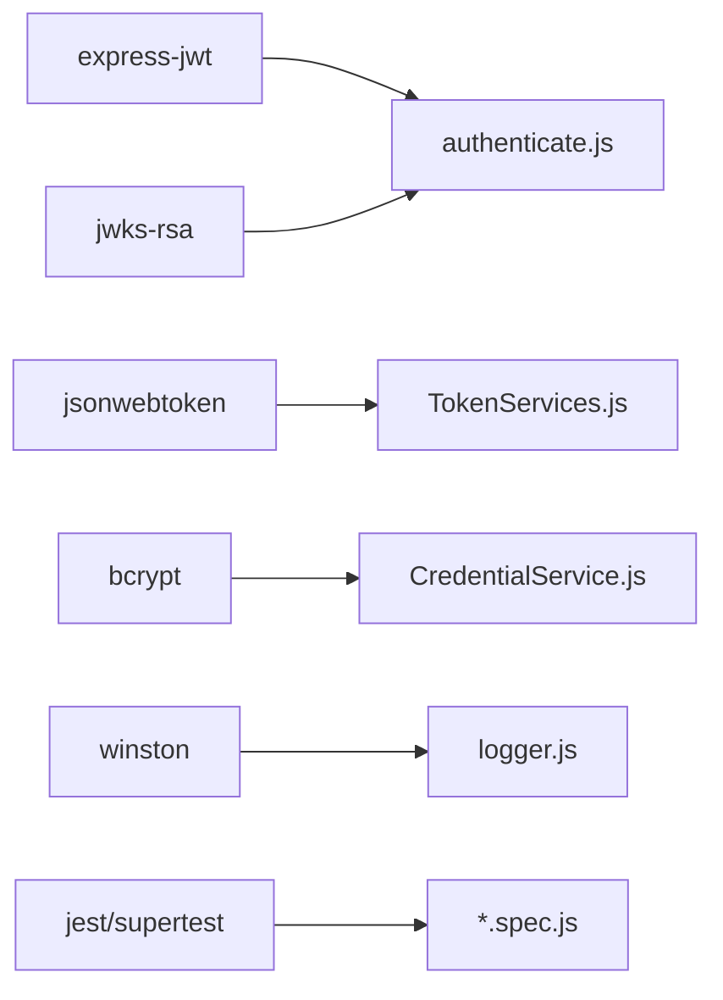

# Security Customizations

<cite>
**Referenced Files in This Document**
- [src/config/config.js](file://src/config/config.js)
- [src/config/logger.js](file://src/config/logger.js)
- [src/constants/index.js](file://src/constants/index.js)
- [src/controllers/AuthController.js](file://src/controllers/AuthController.js)
- [src/entity/User.js](file://src/entity/User.js)
- [src/middleware/authenticate.js](file://src/middleware/authenticate.js)
- [src/middleware/canAccess.js](file://src/middleware/canAccess.js)
- [src/middleware/parseToken.js](file://src/middleware/parseToken.js)
- [src/middleware/validateRefresh.js](file://src/middleware/validateRefresh.js)
- [src/routes/auth.routes.js](file://src/routes/auth.routes.js)
- [src/services/CredentialService.js](file://src/services/CredentialService.js)
- [src/services/TokenServices.js](file://src/services/TokenServices.js)
- [package.json](file://package.json)
- [src/test/users/login.spec.js](file://src/test/users/login.spec.js)
- [src/test/users/register.spec.js](file://src/test/users/register.spec.js)
- [src/test/users/refresh.spec.js](file://src/test/users/refresh.spec.js)
</cite>

## Table of Contents
1. [Introduction](#introduction)
2. [Project Structure](#project-structure)
3. [Core Components](#core-components)
4. [Architecture Overview](#architecture-overview)
5. [Detailed Component Analysis](#detailed-component-analysis)
6. [Dependency Analysis](#dependency-analysis)
7. [Performance Considerations](#performance-considerations)
8. [Troubleshooting Guide](#troubleshooting-guide)
9. [Conclusion](#conclusion)
10. [Appendices](#appendices)

## Introduction
This document explains how to customize security configurations and implement enhanced security measures in the authentication service. It focuses on modifying authentication schemes, customizing authorization rules, adjusting token configurations, and extending access control patterns. It also covers JWT customization (payload, signature algorithms, expiration), building custom permission systems, role hierarchies, and adding advanced layers such as IP whitelisting, device fingerprinting, and behavioral analytics. Guidance is provided for security audit logging, threat detection, compliance, maintaining security while extending functionality, and testing security customizations.

## Project Structure
The authentication service follows a layered architecture with clear separation of concerns:
- Configuration and environment variables
- Middleware for authentication and authorization
- Controllers for HTTP endpoints
- Services for business logic (tokens, credentials, users)
- Entities for persistence
- Routes for endpoint wiring
- Tests for validating security behavior

**Diagram sources**
- [src/config/config.js:1-34](file://src/config/config.js#L1-L34)
- [src/config/logger.js:1-42](file://src/config/logger.js#L1-L42)
- [src/routes/auth.routes.js:1-49](file://src/routes/auth.routes.js#L1-L49)
- [src/middleware/authenticate.js:1-26](file://src/middleware/authenticate.js#L1-L26)
- [src/middleware/canAccess.js:1-23](file://src/middleware/canAccess.js#L1-L23)
- [src/middleware/parseToken.js:1-14](file://src/middleware/parseToken.js#L1-L14)
- [src/middleware/validateRefresh.js:1-34](file://src/middleware/validateRefresh.js#L1-L34)
- [src/controllers/AuthController.js:1-212](file://src/controllers/AuthController.js#L1-L212)
- [src/services/TokenServices.js:1-60](file://src/services/TokenServices.js#L1-L60)
- [src/services/CredentialService.js:1-7](file://src/services/CredentialService.js#L1-L7)
- [src/entity/User.js:1-50](file://src/entity/User.js#L1-L50)

**Section sources**
- [src/config/config.js:1-34](file://src/config/config.js#L1-L34)
- [src/config/logger.js:1-42](file://src/config/logger.js#L1-L42)
- [src/routes/auth.routes.js:1-49](file://src/routes/auth.routes.js#L1-L49)

## Core Components
- Authentication middleware validates access tokens via JWKS and supports cookie extraction.
- Authorization middleware enforces role-based access control.
- Token services manage access and refresh tokens, including signing keys, algorithms, and expiration.
- Credential service handles password comparison using bcrypt.
- Logger centralizes audit logs for security events.
- Routes wire endpoints to controllers and apply middleware.

Key customization touchpoints:
- Environment variables for secrets and JWKS URI
- Token signing algorithms and expiration policies
- Role hierarchy and access control enforcement
- Cookie security attributes and domain configuration
- Revocation and refresh token lifecycle

**Section sources**
- [src/middleware/authenticate.js:1-26](file://src/middleware/authenticate.js#L1-L26)
- [src/middleware/canAccess.js:1-23](file://src/middleware/canAccess.js#L1-L23)
- [src/services/TokenServices.js:1-60](file://src/services/TokenServices.js#L1-L60)
- [src/services/CredentialService.js:1-7](file://src/services/CredentialService.js#L1-L7)
- [src/config/logger.js:1-42](file://src/config/logger.js#L1-L42)
- [src/routes/auth.routes.js:1-49](file://src/routes/auth.routes.js#L1-L49)

## Architecture Overview
The authentication flow integrates routes, middleware, controllers, services, and persistence. Access tokens are validated centrally; refresh tokens are validated with revocation checks; roles govern access to protected resources.

**Diagram sources**
- [src/routes/auth.routes.js:1-49](file://src/routes/auth.routes.js#L1-L49)
- [src/controllers/AuthController.js:1-212](file://src/controllers/AuthController.js#L1-L212)
- [src/services/TokenServices.js:1-60](file://src/services/TokenServices.js#L1-L60)
- [src/services/CredentialService.js:1-7](file://src/services/CredentialService.js#L1-L7)

## Detailed Component Analysis

### Authentication Scheme Customization
- Token source resolution supports Authorization header and cookies.
- RS256 is used for access tokens; JWKS is fetched for verification.
- HS256 is used for refresh tokens with a shared secret.

Customization options:
- Change algorithms by updating the algorithms array in authentication middleware and token generation.
- Switch token sources by modifying getToken logic.
- Introduce additional token sources (headers, query params) by extending getToken.

**Section sources**
- [src/middleware/authenticate.js:1-26](file://src/middleware/authenticate.js#L1-L26)
- [src/middleware/parseToken.js:1-14](file://src/middleware/parseToken.js#L1-L14)
- [src/services/TokenServices.js:1-60](file://src/services/TokenServices.js#L1-L60)

### Authorization Rules and Role-Based Access Control
- Role extraction occurs from the authenticated token’s claims.
- The canAccess middleware restricts routes to allowed roles.
- Roles are defined centrally for consistency.

Customization options:
- Extend Roles with additional levels (e.g., super-admin).
- Add hierarchical permissions (e.g., manager inherits customer permissions).
- Enforce fine-grained permissions per resource or action.

**Diagram sources**
- [src/middleware/canAccess.js:1-23](file://src/middleware/canAccess.js#L1-L23)
- [src/constants/index.js:1-6](file://src/constants/index.js#L1-L6)

**Section sources**
- [src/middleware/canAccess.js:1-23](file://src/middleware/canAccess.js#L1-L23)
- [src/constants/index.js:1-6](file://src/constants/index.js#L1-L6)

### Token Configuration and JWT Customization
- Access tokens:
  - Signed with RSA private key
  - Algorithm: RS256
  - Expiration: 1 hour
  - Issuer: auth-service
- Refresh tokens:
  - Signed with shared secret
  - Algorithm: HS256
  - Expiration: 7 days
  - Issuer: auth-service
  - Unique ID embedded for revocation

Customization options:
- Adjust expiresIn for access and refresh tokens.
- Modify issuer and audience claims.
- Add custom claims (e.g., tenantId, permissions).
- Rotate keys and update JWKS URI accordingly.

**Diagram sources**
- [src/services/TokenServices.js:1-60](file://src/services/TokenServices.js#L1-L60)

**Section sources**
- [src/services/TokenServices.js:1-60](file://src/services/TokenServices.js#L1-L60)
- [src/config/config.js:1-34](file://src/config/config.js#L1-L34)

### Refresh Token Lifecycle and Revocation
- Refresh tokens are persisted in the database with an expiration date.
- Validation checks revocation by verifying presence in the database.
- Rotation deletes the old refresh token and issues a new one.

**Diagram sources**
- [src/routes/auth.routes.js:1-49](file://src/routes/auth.routes.js#L1-L49)
- [src/controllers/AuthController.js:143-192](file://src/controllers/AuthController.js#L143-L192)
- [src/middleware/validateRefresh.js:1-34](file://src/middleware/validateRefresh.js#L1-L34)
- [src/services/TokenServices.js:45-58](file://src/services/TokenServices.js#L45-L58)

**Section sources**
- [src/middleware/validateRefresh.js:1-34](file://src/middleware/validateRefresh.js#L1-L34)
- [src/services/TokenServices.js:45-58](file://src/services/TokenServices.js#L45-L58)
- [src/controllers/AuthController.js:143-192](file://src/controllers/AuthController.js#L143-L192)

### Password Security and Credential Handling
- Password comparison uses bcrypt for secure hashing verification.

Customization options:
- Configure bcrypt rounds for cost vs. performance trade-offs.
- Enforce password policies (length, complexity) in validators.

**Section sources**
- [src/services/CredentialService.js:1-7](file://src/services/CredentialService.js#L1-L7)

### Cookie Security Attributes
- Access and refresh tokens are stored as httpOnly cookies with SameSite strict.
- Domain and maxAge are set per endpoint; consider environment-aware configuration.

Customization options:
- Set Secure flag for HTTPS environments.
- Adjust SameSite policy per deployment needs.
- Externalize domain and cookie attributes to environment variables.

**Section sources**
- [src/controllers/AuthController.js:50-62](file://src/controllers/AuthController.js#L50-L62)
- [src/controllers/AuthController.js:115-128](file://src/controllers/AuthController.js#L115-L128)
- [src/controllers/AuthController.js:171-184](file://src/controllers/AuthController.js#L171-L184)

### Logging and Audit Trail
- Winston-based logger writes info and error logs to files and console.
- Security-relevant events are logged (e.g., successful login, token deletion).

Customization options:
- Add structured fields for user ID, IP address, device fingerprint, and risk score.
- Centralize sensitive event redaction and retention policies.
- Export logs to SIEM or cloud logging for compliance.

**Section sources**
- [src/config/logger.js:1-42](file://src/config/logger.js#L1-L42)
- [src/controllers/AuthController.js:64](file://src/controllers/AuthController.js#L64)
- [src/controllers/AuthController.js:130](file://src/controllers/AuthController.js#L130)
- [src/controllers/AuthController.js:164](file://src/controllers/AuthController.js#L164)
- [src/controllers/AuthController.js:198](file://src/controllers/AuthController.js#L198)

### Advanced Security Layers (Extensibility Guide)
- IP Whitelisting:
  - Extract client IP in middleware and enforce allow-list.
  - Store IPs per user or tenant for dynamic control.
- Device Fingerprinting:
  - Capture headers (User-Agent, Accept, etc.) and derive a stable fingerprint.
  - Persist fingerprints and associate with sessions or tokens.
- Behavioral Analytics:
  - Track login frequency, geographic anomalies, and session duration.
  - Integrate anomaly detection and adaptive MFA challenges.
- Threat Detection:
  - Monitor repeated failed attempts and trigger account lock or alerts.
  - Correlate events across services for coordinated defense.
- Compliance:
  - Log required fields for SOX, GDPR, PCI DSS.
  - Implement data retention and deletion policies.

[No sources needed since this section provides extensibility guidance]

### Testing Security Customizations
- Registration tests validate token issuance, refresh token persistence, and role assignment.
- Login tests verify password hashing and successful authentication.
- Refresh tests assert token rotation and revocation behavior.

Recommendations:
- Add negative tests for invalid tokens, revoked refresh tokens, and unauthorized access.
- Mock external dependencies (e.g., JWKS) for isolated unit tests.
- Integrate mutation tests for token payloads and headers.

**Section sources**
- [src/test/users/register.spec.js:1-168](file://src/test/users/register.spec.js#L1-L168)
- [src/test/users/login.spec.js:1-92](file://src/test/users/login.spec.js#L1-L92)
- [src/test/users/refresh.spec.js:1-109](file://src/test/users/refresh.spec.js#L1-L109)

## Dependency Analysis
External libraries and their roles:
- express-jwt and jwks-rsa for JWT validation and JWKS fetching
- jsonwebtoken for signing tokens
- bcrypt for password hashing
- winston for logging
- supertest and jest for testing

**Diagram sources**
- [package.json:30-47](file://package.json#L30-L47)
- [src/middleware/authenticate.js:1-26](file://src/middleware/authenticate.js#L1-L26)
- [src/services/TokenServices.js:1-60](file://src/services/TokenServices.js#L1-L60)
- [src/services/CredentialService.js:1-7](file://src/services/CredentialService.js#L1-L7)
- [src/config/logger.js:1-42](file://src/config/logger.js#L1-L42)
- [src/test/users/register.spec.js:1-168](file://src/test/users/register.spec.js#L1-L168)

**Section sources**
- [package.json:30-47](file://package.json#L30-L47)

## Performance Considerations
- Prefer RS256 with JWKS caching to minimize network overhead.
- Tune bcrypt cost for acceptable latency under load.
- Cache frequently accessed user roles and permissions.
- Use short-lived access tokens with efficient refresh rotation.

[No sources needed since this section provides general guidance]

## Troubleshooting Guide
Common issues and resolutions:
- Invalid token errors:
  - Verify algorithms and JWKS URI match token signing.
  - Confirm token expiration and clock skew.
- Access denied errors:
  - Ensure user role matches allowedRoles.
  - Check role propagation from token to req.auth.
- Refresh token failures:
  - Confirm token exists in database and belongs to the user.
  - Validate HS256 secret alignment.
- Logging gaps:
  - Check NODE_ENV and transport conditions.
  - Ensure log level permits security events.

**Section sources**
- [src/middleware/authenticate.js:1-26](file://src/middleware/authenticate.js#L1-L26)
- [src/middleware/canAccess.js:1-23](file://src/middleware/canAccess.js#L1-L23)
- [src/middleware/validateRefresh.js:1-34](file://src/middleware/validateRefresh.js#L1-L34)
- [src/config/logger.js:1-42](file://src/config/logger.js#L1-L42)

## Conclusion
The authentication service provides a solid foundation for secure token-based authentication with clear extension points. By customizing algorithms, claims, and cookie attributes, and by enforcing role-based access control, you can tailor security to your needs. Adding advanced layers like IP whitelisting, device fingerprinting, and behavioral analytics, combined with robust logging and testing, ensures strong protection and compliance readiness.

[No sources needed since this section summarizes without analyzing specific files]

## Appendices

### Appendix A: Environment Variables
- PORT, DB_HOST, DB_NAME, DB_USERNAME, DB_PASSWORD, DB_PORT, NODE_ENV
- PRIVATE_KEY_SECRET (used for HS256 signing)
- JWKS_URI (used for RS256 verification)

**Section sources**
- [src/config/config.js:11-33](file://src/config/config.js#L11-L33)

### Appendix B: Role Definitions
- Roles include customer, admin, and manager.

**Section sources**
- [src/constants/index.js:1-6](file://src/constants/index.js#L1-L6)

### Appendix C: Endpoint Security Matrix
- /auth/register: public registration; issues access and refresh tokens
- /auth/login: public login; issues access and refresh tokens
- /auth/self: requires access token
- /auth/refresh: requires valid, non-revoked refresh token
- /auth/logout: requires refresh token for revocation

**Section sources**
- [src/routes/auth.routes.js:29-46](file://src/routes/auth.routes.js#L29-L46)
- [src/controllers/AuthController.js:19-70](file://src/controllers/AuthController.js#L19-L70)
- [src/controllers/AuthController.js:72-136](file://src/controllers/AuthController.js#L72-L136)
- [src/controllers/AuthController.js:138-211](file://src/controllers/AuthController.js#L138-L211)