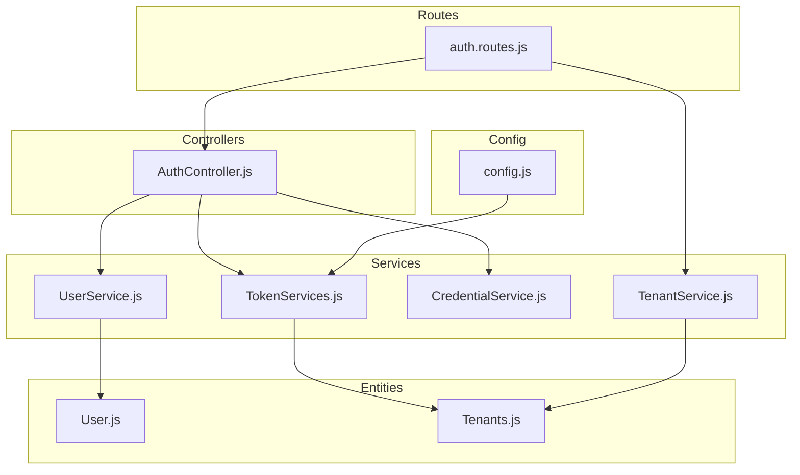
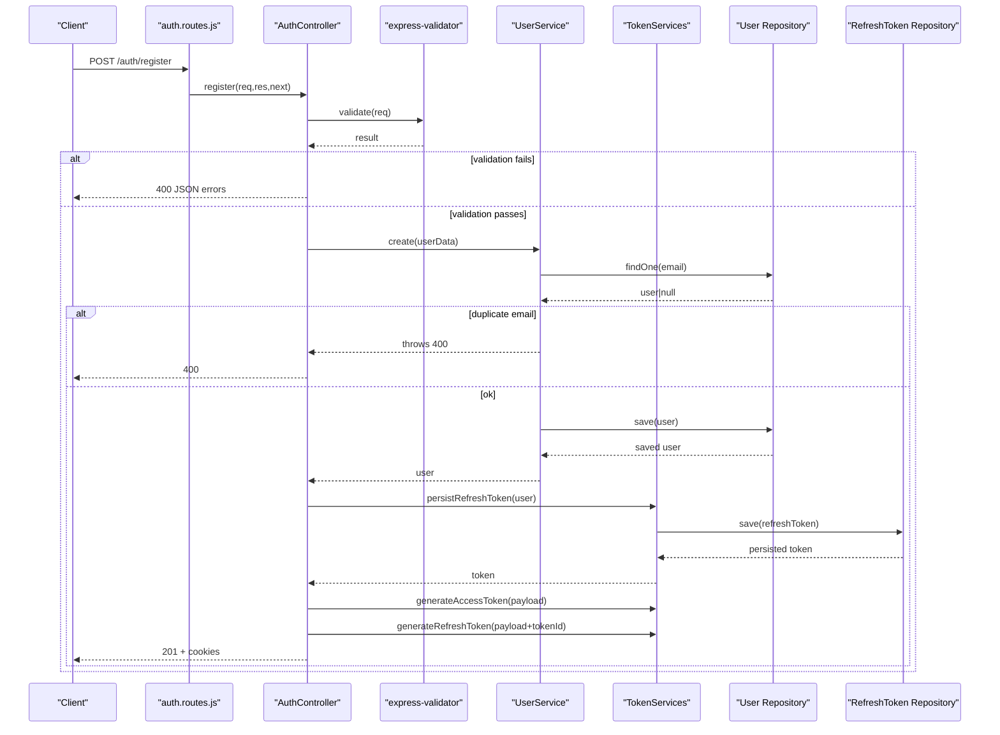
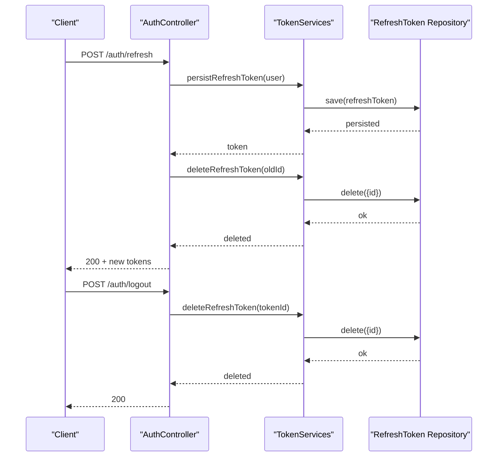
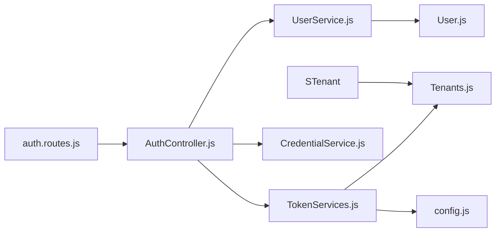

# Service Layer Extensions

<cite>
**Referenced Files in This Document**
- [UserService.js](file://src/services/UserService.js)
- [TenantService.js](file://src/services/TenantService.js)
- [TokenServices.js](file://src/services/TokenServices.js)
- [CredentialService.js](file://src/services/CredentialService.js)
- [AuthController.js](file://src/controllers/AuthController.js)
- [auth.routes.js](file://src/routes/auth.routes.js)
- [config.js](file://src/config/config.js)
- [User.js](file://src/entity/User.js)
- [Tenants.js](file://src/entity/Tenants.js)
- [authenticate.js](file://src/middleware/authenticate.js)
- [register.spec.js](file://src/test/users/register.spec.js)
- [create.spec.js](file://src/test/users/create.spec.js)
- [package.json](file://package.json)
</cite>

## Table of Contents
1. [Introduction](#introduction)
2. [Project Structure](#project-structure)
3. [Core Components](#core-components)
4. [Architecture Overview](#architecture-overview)
5. [Detailed Component Analysis](#detailed-component-analysis)
6. [Dependency Analysis](#dependency-analysis)
7. [Performance Considerations](#performance-considerations)
8. [Troubleshooting Guide](#troubleshooting-guide)
9. [Conclusion](#conclusion)
10. [Appendices](#appendices)

## Introduction
This document explains how to extend the service layer with new business logic and functionality while preserving separation of concerns. It focuses on the established patterns visible in UserService, TenantService, and TokenServices, and shows how to integrate repositories, handle validation, manage errors, and design cohesive service methods. It also covers dependency injection wiring, transaction management considerations, and testing strategies grounded in the existing codebase.

## Project Structure
The service layer resides under src/services and is consumed by controllers via dependency injection at route registration. Repositories are TypeORM-based and accessed through the DataSource singleton. Controllers orchestrate validation, call services, and manage HTTP responses and cookies.

**Diagram sources**
- [auth.routes.js:16-27](file://src/routes/auth.routes.js#L16-L27)
- [AuthController.js:5-16](file://src/controllers/AuthController.js#L5-L16)
- [UserService.js:3-6](file://src/services/UserService.js#L3-L6)
- [TokenServices.js:8-11](file://src/services/TokenServices.js#L8-L11)
- [CredentialService.js:2-5](file://src/services/CredentialService.js#L2-L5)
- [TenantService.js:3-6](file://src/services/TenantService.js#L3-L6)
- [User.js:3-49](file://src/entity/User.js#L3-L49)
- [Tenants.js:3-28](file://src/entity/Tenants.js#L3-L28)
- [config.js:23-33](file://src/config/config.js#L23-L33)

**Section sources**
- [auth.routes.js:16-27](file://src/routes/auth.routes.js#L16-L27)
- [AuthController.js:5-16](file://src/controllers/AuthController.js#L5-L16)

## Core Components
- UserService: Encapsulates user CRUD and retrieval operations, integrates password hashing, and handles validation and persistence outcomes.
- TenantService: Manages tenant lifecycle operations with explicit error handling for not-found scenarios.
- TokenServices: Generates access and refresh tokens, persists refresh tokens, and deletes them as part of rotation/logout flows.
- CredentialService: Provides password comparison utility for login verification.
- AuthController: Coordinates validation, service calls, and response handling, including cookie management for tokens.

Key patterns:
- Constructor injection of repositories/services for testability and modularity.
- Centralized error handling via http-errors with appropriate status codes.
- Validation performed upstream by express-validator and controllers; services focus on domain logic.
- Clear separation between token generation, persistence, and controller orchestration.

**Section sources**
- [UserService.js:3-98](file://src/services/UserService.js#L3-L98)
- [TenantService.js:3-65](file://src/services/TenantService.js#L3-L65)
- [TokenServices.js:8-59](file://src/services/TokenServices.js#L8-L59)
- [CredentialService.js:2-6](file://src/services/CredentialService.js#L2-L6)
- [AuthController.js:5-16](file://src/controllers/AuthController.js#L5-L16)

## Architecture Overview
The service layer follows a layered architecture:
- Routes define endpoints and instantiate services with repositories.
- Controllers validate requests and delegate to services.
- Services encapsulate business logic and interact with repositories.
- Entities define persistence contracts and relationships.

**Diagram sources**
- [auth.routes.js:29-31](file://src/routes/auth.routes.js#L29-L31)
- [AuthController.js:19-70](file://src/controllers/AuthController.js#L19-L70)
- [UserService.js:7-38](file://src/services/UserService.js#L7-L38)
- [TokenServices.js:45-52](file://src/services/TokenServices.js#L45-L52)

## Detailed Component Analysis

### Service Dependency Injection and Repository Integration
- Services receive repositories via constructor injection, enabling easy mocking and testing.
- Repositories are resolved from the shared DataSource at route registration and passed into service constructors.
- Example wiring: UserService receives a User repository; TokenServices receives a RefreshToken repository.

Guidelines:
- Always pass repositories into service constructors.
- Keep services free of framework-specific concerns (cookies, HTTP status codes).
- Expose only domain-focused methods (e.g., create, findByEmail, persistRefreshToken).

**Section sources**
- [auth.routes.js:17-27](file://src/routes/auth.routes.js#L17-L27)
- [UserService.js:4-6](file://src/services/UserService.js#L4-L6)
- [TokenServices.js:9-11](file://src/services/TokenServices.js#L9-L11)

### Transaction Management
- Current services do not explicitly wrap operations in transactions.
- For multi-step operations (e.g., user creation + refresh token persistence), consider wrapping in a single transaction to maintain atomicity.
- Use DataSource.transaction or repository manager to ensure rollback on failure.

Recommendations:
- Wrap correlated operations in a single transaction boundary.
- Prefer service-level transactions for cross-entity consistency.
- Keep transaction boundaries narrow and focused on business steps.

[No sources needed since this section provides general guidance]

### Error Handling Patterns
- Services throw http-errors with explicit status codes (400 for validation/business errors, 500 for unexpected failures).
- Controllers forward errors to the global error handler, which logs and responds with structured JSON.

Best practices:
- Throw domain-appropriate errors in services.
- Avoid catching and swallowing errors unless transforming them.
- Let controllers decide HTTP responses; services remain pure business logic.

**Section sources**
- [UserService.js:13-16](file://src/services/UserService.js#L13-L16)
- [UserService.js:28-37](file://src/services/UserService.js#L28-L37)
- [AuthController.js:66-68](file://src/controllers/AuthController.js#L66-L68)

### Validation Integration
- Validation occurs in controllers using express-validator. Services assume validated inputs.
- For new services, continue this pattern: keep validation close to the HTTP boundary and pass clean data to services.

**Section sources**
- [AuthController.js:23-26](file://src/controllers/AuthController.js#L23-L26)
- [AuthController.js:76-79](file://src/controllers/AuthController.js#L76-L79)

### Service Method Design
- Methods should be small, single-purpose, and focused on a single business operation.
- Return domain objects or booleans; avoid returning raw repository results unless necessary.
- Use repository methods consistently: findOne, find, save, update, delete.

Examples from existing services:
- Creation with duplicate checks and hashing.
- Retrieval with and without password fields.
- Update/delete with centralized error handling.

**Section sources**
- [UserService.js:7-38](file://src/services/UserService.js#L7-L38)
- [UserService.js:48-66](file://src/services/UserService.js#L48-L66)
- [TenantService.js:7-23](file://src/services/TenantService.js#L7-L23)

### Extending Existing Services vs Creating New Ones
- Extend existing services when the new operation fits the same domain and repository.
- Create new services when introducing a distinct bounded context (e.g., billing, audit logging).
- Maintain cohesion: group related operations together; avoid bloated services.

[No sources needed since this section provides general guidance]

### Adding New Business Operations: Step-by-Step

#### Option A: Extend an Existing Service (e.g., UserService)
Steps:
1. Add a new method to the service class with a clear name and single responsibility.
2. Integrate with the existing repository and follow the same error handling pattern.
3. If the operation requires validation, add it at the controller boundary.
4. Wire the new method in the controller action and return appropriate HTTP responses.

Example patterns to mirror:
- Duplicate detection and controlled error propagation.
- Hashing for sensitive data.
- Centralized try/catch blocks for database errors.

**Section sources**
- [UserService.js:7-38](file://src/services/UserService.js#L7-L38)
- [UserService.js:68-84](file://src/services/UserService.js#L68-L84)

#### Option B: Create a New Service (e.g., ProfileService)
Steps:
1. Define a new service class with constructor injection of its repository.
2. Implement domain methods following the established patterns.
3. Register the service in the route module and inject it into the controller.
4. Add tests mirroring the existing test structure.

**Section sources**
- [auth.routes.js:17-27](file://src/routes/auth.routes.js#L17-L27)

### Token Rotation and Logout Flow

**Diagram sources**
- [AuthController.js:143-192](file://src/controllers/AuthController.js#L143-L192)
- [TokenServices.js:45-58](file://src/services/TokenServices.js#L45-L58)

## Dependency Analysis
- Routes depend on controllers and services; controllers depend on services and validation.
- Services depend on repositories and configuration (e.g., JWT secrets).
- Entities define relationships and constraints used by repositories.

**Diagram sources**
- [auth.routes.js:16-27](file://src/routes/auth.routes.js#L16-L27)
- [AuthController.js:5-16](file://src/controllers/AuthController.js#L5-L16)
- [UserService.js:3-6](file://src/services/UserService.js#L3-L6)
- [TokenServices.js:8-11](file://src/services/TokenServices.js#L8-L11)
- [CredentialService.js:2-5](file://src/services/CredentialService.js#L2-L5)
- [User.js:3-49](file://src/entity/User.js#L3-L49)
- [Tenants.js:3-28](file://src/entity/Tenants.js#L3-L28)
- [config.js:23-33](file://src/config/config.js#L23-L33)

**Section sources**
- [auth.routes.js:16-27](file://src/routes/auth.routes.js#L16-L27)
- [AuthController.js:5-16](file://src/controllers/AuthController.js#L5-L16)
- [config.js:23-33](file://src/config/config.js#L23-L33)

## Performance Considerations
- Minimize round-trips: batch related operations when possible.
- Use repository queries efficiently (selective fields, joins) to reduce payload sizes.
- Avoid heavy computations inside services; offload hashing and cryptographic work to dedicated utilities.
- Consider caching for read-heavy operations, but ensure cache invalidation aligns with write operations.

[No sources needed since this section provides general guidance]

## Troubleshooting Guide
Common issues and resolutions:
- Validation errors: Ensure express-validator is applied before calling services; services should not re-validate.
- Duplicate key errors: Handle 400 responses for duplicates; log for diagnostics.
- Database errors: Wrap in centralized try/catch and throw http-errors with 500 status.
- Token generation failures: Verify certificate and secret loading; check environment variables.
- Authentication failures: Confirm JWKS URI and token parsing logic.

**Section sources**
- [UserService.js:13-16](file://src/services/UserService.js#L13-L16)
- [UserService.js:28-37](file://src/services/UserService.js#L28-L37)
- [TokenServices.js:16-23](file://src/services/TokenServices.js#L16-L23)
- [config.js:23-33](file://src/config/config.js#L23-L33)
- [authenticate.js:6-25](file://src/middleware/authenticate.js#L6-L25)

## Conclusion
Extending the service layer follows predictable patterns: inject repositories, centralize error handling, keep methods cohesive, and integrate validation at the controller boundary. For new operations, either extend existing services when domain-aligned or introduce new services for distinct contexts. Maintain transaction boundaries carefully for multi-step operations and ensure robust testing strategies.

[No sources needed since this section summarizes without analyzing specific files]

## Appendices

### Testing Strategies and Mocking Dependencies
- Test services in isolation by injecting mock repositories.
- Use real repositories in integration tests to validate persistence and relationships.
- Leverage existing test patterns: initialize DataSource, synchronize schema, assert database state and HTTP responses.

Examples to follow:
- Service-level assertions for user creation, retrieval, and token persistence.
- Controller-level assertions for cookie setting and status codes.

**Section sources**
- [register.spec.js:31-54](file://src/test/users/register.spec.js#L31-L54)
- [register.spec.js:75-114](file://src/test/users/register.spec.js#L75-L114)
- [register.spec.js:115-138](file://src/test/users/register.spec.js#L115-L138)
- [create.spec.js:38-69](file://src/test/users/create.spec.js#L38-L69)
- [create.spec.js:71-91](file://src/test/users/create.spec.js#L71-L91)

### Guidelines for Extending vs Creating New Services
- Extend when:
  - Operation shares the same entity and repository.
  - Behavior fits the existing service’s domain.
- Create new when:
  - Introduces a new bounded context or entity.
  - Requires different repository(s) or cross-cutting concerns.

[No sources needed since this section provides general guidance]