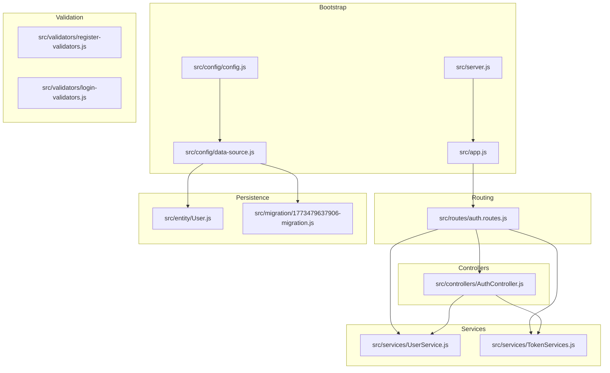
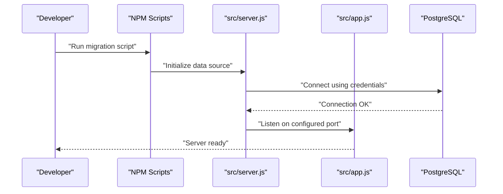
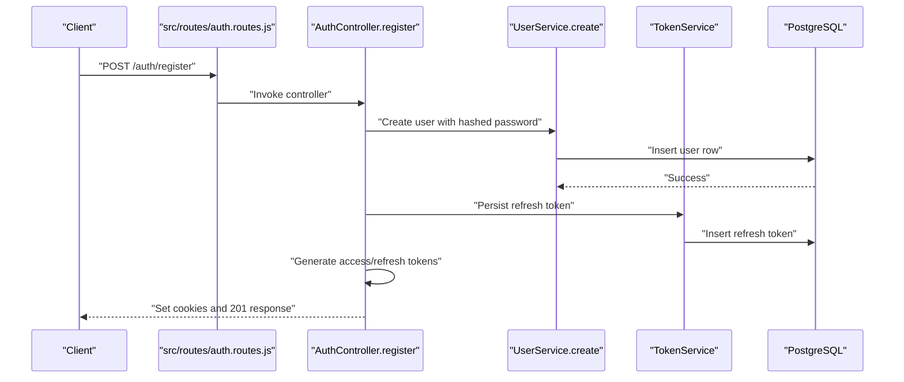
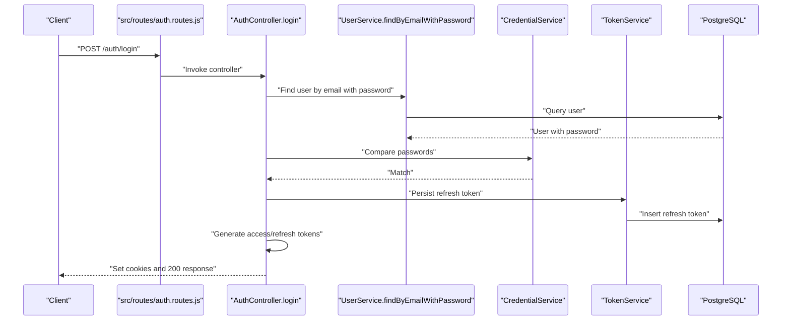
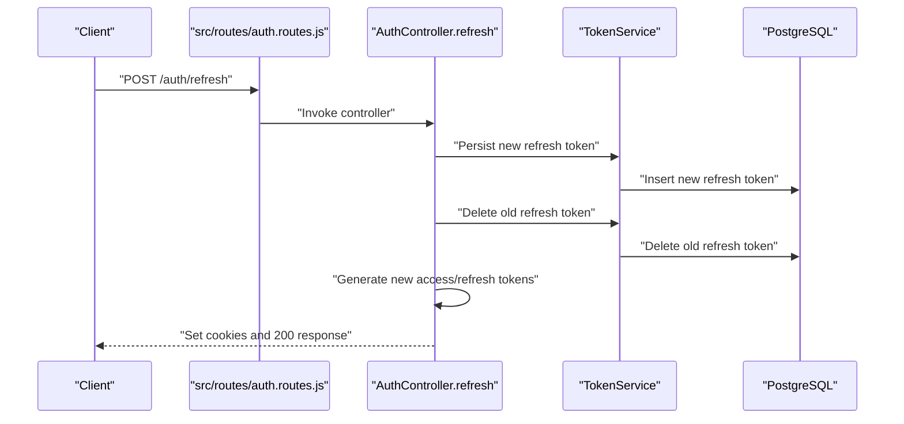
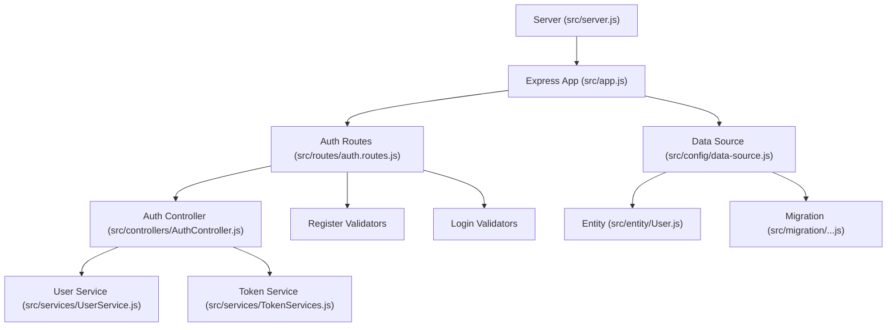
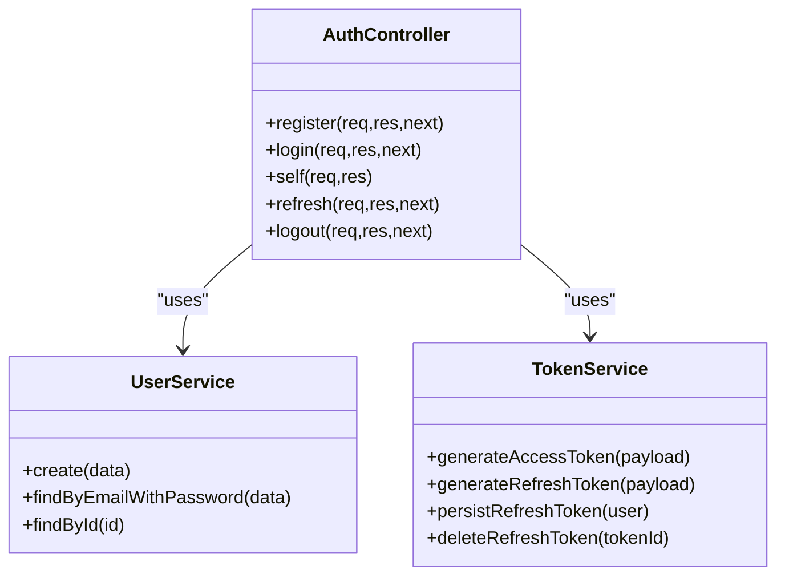
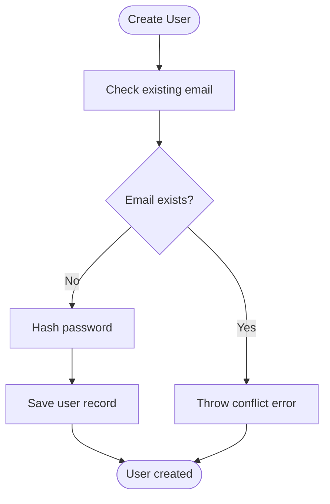
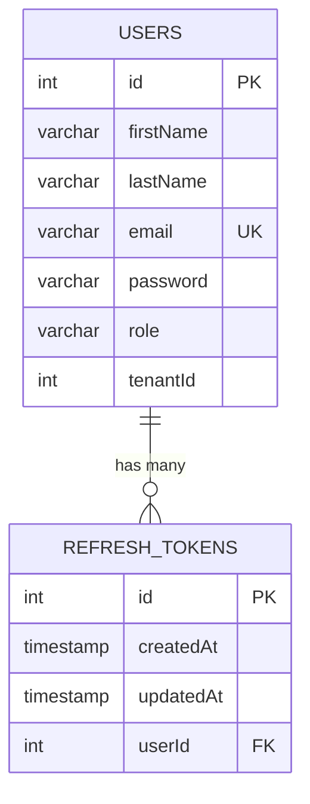
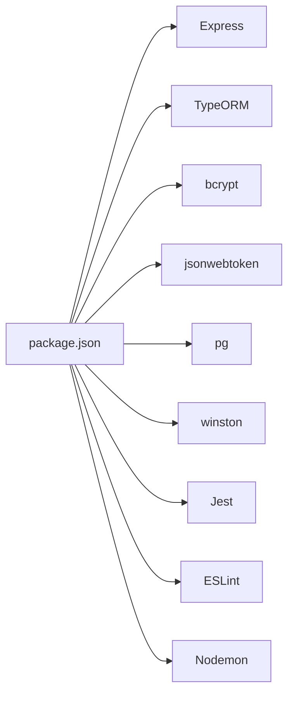

# Getting Started

<cite>
**Referenced Files in This Document**
- [package.json](file://package.json)
- [README.md](file://README.md)
- [src/server.js](file://src/server.js)
- [src/app.js](file://src/app.js)
- [src/config/config.js](file://src/config/config.js)
- [src/config/data-source.js](file://src/config/data-source.js)
- [src/migration/1773479637906-migration.js](file://src/migration/1773479637906-migration.js)
- [src/routes/auth.routes.js](file://src/routes/auth.routes.js)
- [src/controllers/AuthController.js](file://src/controllers/AuthController.js)
- [src/services/UserService.js](file://src/services/UserService.js)
- [src/services/TokenServices.js](file://src/services/TokenServices.js)
- [src/validators/register-validators.js](file://src/validators/register-validators.js)
- [src/validators/login-validators.js](file://src/validators/login-validators.js)
- [src/entity/User.js](file://src/entity/User.js)
</cite>

## Table of Contents
1. [Introduction](#introduction)
2. [Project Structure](#project-structure)
3. [Prerequisites](#prerequisites)
4. [Installation](#installation)
5. [Environment Configuration](#environment-configuration)
6. [First Run](#first-run)
7. [Basic Authentication Workflows](#basic-authentication-workflows)
8. [Architecture Overview](#architecture-overview)
9. [Detailed Component Analysis](#detailed-component-analysis)
10. [Dependency Analysis](#dependency-analysis)
11. [Performance Considerations](#performance-considerations)
12. [Troubleshooting Guide](#troubleshooting-guide)
13. [Conclusion](#conclusion)

## Introduction
This guide helps you quickly set up and run the authentication service. It covers prerequisites, installation, environment configuration, first-run steps, and practical authentication workflows. The service exposes endpoints for user registration, login, profile retrieval, token refresh, and logout, backed by PostgreSQL via TypeORM and secured with JWT tokens.

## Project Structure
At a high level, the service is organized into:
- Configuration and bootstrap: server initialization, Express app setup, and database connection
- Routing and controllers: route definitions and handler logic for authentication
- Services: user management, token generation/persistence, and credential comparison
- Validation: request validation for registration and login
- Entities and migrations: database schema and migrations for PostgreSQL

**Diagram sources**
- [src/server.js:1-21](file://src/server.js#L1-L21)
- [src/app.js:1-40](file://src/app.js#L1-L40)
- [src/config/config.js:1-34](file://src/config/config.js#L1-L34)
- [src/config/data-source.js:1-22](file://src/config/data-source.js#L1-L22)
- [src/routes/auth.routes.js:1-49](file://src/routes/auth.routes.js#L1-L49)
- [src/controllers/AuthController.js:1-212](file://src/controllers/AuthController.js#L1-L212)
- [src/services/UserService.js:1-86](file://src/services/UserService.js#L1-L86)
- [src/services/TokenServices.js:1-60](file://src/services/TokenServices.js#L1-L60)
- [src/validators/register-validators.js:1-47](file://src/validators/register-validators.js#L1-L47)
- [src/validators/login-validators.js:1-25](file://src/validators/login-validators.js#L1-L25)
- [src/entity/User.js:1-50](file://src/entity/User.js#L1-L50)
- [src/migration/1773479637906-migration.js:1-34](file://src/migration/1773479637906-migration.js#L1-L34)

**Section sources**
- [README.md:1-8](file://README.md#L1-L8)
- [src/server.js:1-21](file://src/server.js#L1-L21)
- [src/app.js:1-40](file://src/app.js#L1-L40)
- [src/config/data-source.js:1-22](file://src/config/data-source.js#L1-L22)

## Prerequisites
- Node.js: The project uses ES modules and modern Node APIs. Ensure you are using a recent LTS version compatible with the project’s module usage and dependencies.
- PostgreSQL: The service connects to a PostgreSQL database using TypeORM. Install and configure PostgreSQL locally or use a hosted instance.
- Environment preparation:
  - Create environment-specific dotenv files for configuration loading. The configuration loader expects a file named based on the current NODE_ENV value.
  - Prepare JWT-related assets and secrets as described in the Environment Configuration section.

Key indicators in the codebase:
- The configuration loader loads environment variables from a path derived from NODE_ENV.
- The database client and ORM expect PostgreSQL credentials and settings.
- JWT signing requires a private key for access tokens and a secret for refresh tokens.

**Section sources**
- [src/config/config.js:1-34](file://src/config/config.js#L1-L34)
- [src/config/data-source.js:1-22](file://src/config/data-source.js#L1-L22)
- [src/services/TokenServices.js:1-60](file://src/services/TokenServices.js#L1-L60)

## Installation
Follow these steps to install and prepare the service:

1. Install dependencies
   - Run the standard Node.js dependency installer to fetch all required packages.

2. Prepare environment files
   - Create environment-specific dotenv files so the configuration loader can pick them up based on NODE_ENV.

3. Set up the database
   - Configure database connection settings in the environment files.
   - Ensure the database exists and is reachable.

4. Run migrations
   - Apply pending migrations to initialize the schema.

5. Start the service
   - Launch the development server using the configured scripts.

Reference commands and scripts:
- Install dependencies
  - Use the standard installer to populate node_modules.
- Run migrations
  - Use the provided migration script to apply schema changes.
- Start the server
  - Use the development script to launch the server with hot reload.

Notes:
- The project README outlines the basic steps to run the project.
- Scripts for migrations and development are defined in the package manifest.

**Section sources**
- [README.md:3-7](file://README.md#L3-L7)
- [package.json:7-14](file://package.json#L7-L14)

## Environment Configuration
Configure the following environment variables depending on your NODE_ENV:

Required variables:
- PORT: Port on which the server listens
- DB_HOST: PostgreSQL host
- DB_PORT: PostgreSQL port
- DB_NAME: Database name
- DB_USERNAME: Database user
- DB_PASSWORD: Database password
- PRIVATE_KEY_SECRET: Secret used to sign refresh tokens (HS256)
- JWKS_URI: URI for public keys (used by clients to validate tokens)

How configuration is loaded:
- The configuration module loads environment variables from a file named according to NODE_ENV.
- The database connection reads these variables to establish a TypeORM data source.
- Token services use PRIVATE_KEY_SECRET for refresh token signing and attempt to load a private key for access token signing.

Security considerations:
- Keep PRIVATE_KEY_SECRET confidential and unique per environment.
- Store the private key file securely and restrict filesystem access.
- Ensure database credentials are restricted and rotated periodically.

**Section sources**
- [src/config/config.js:11-33](file://src/config/config.js#L11-L33)
- [src/config/data-source.js:8-21](file://src/config/data-source.js#L8-L21)
- [src/services/TokenServices.js:12-43](file://src/services/TokenServices.js#L12-L43)

## First Run
Complete the initial setup and verify the service:

1. Create environment files
   - Create dotenv files named after NODE_ENV so the configuration loader can find them.

2. Initialize the database
   - Ensure the database exists and is reachable with the provided credentials.
   - Optionally enable synchronization in development/test environments if desired.

3. Apply migrations
   - Run the migration script to create tables and apply schema changes.

4. Start the server
   - Launch the development server using the configured script.

5. Verify the service
   - Confirm the server is listening on the configured port.
   - Verify the health endpoint responds successfully.

**Diagram sources**
- [src/server.js:7-19](file://src/server.js#L7-L19)
- [src/app.js:10-17](file://src/app.js#L10-L17)
- [src/config/data-source.js:8-21](file://src/config/data-source.js#L8-L21)

**Section sources**
- [src/server.js:7-19](file://src/server.js#L7-L19)
- [src/app.js:10-17](file://src/app.js#L10-L17)
- [src/config/data-source.js:8-21](file://src/config/data-source.js#L8-L21)

## Basic Authentication Workflows
This section demonstrates end-to-end flows for registration and login.

### Registration
- Endpoint: POST /auth/register
- Validation: First name, last name, email, and password are validated.
- Behavior: Creates a new user record with a hashed password and issues access and refresh tokens via cookies.

**Diagram sources**
- [src/routes/auth.routes.js:29-31](file://src/routes/auth.routes.js#L29-L31)
- [src/controllers/AuthController.js:19-70](file://src/controllers/AuthController.js#L19-L70)
- [src/services/UserService.js:7-38](file://src/services/UserService.js#L7-L38)
- [src/services/TokenServices.js:45-52](file://src/services/TokenServices.js#L45-L52)
- [src/migration/1773479637906-migration.js:16-22](file://src/migration/1773479637906-migration.js#L16-L22)

**Section sources**
- [src/routes/auth.routes.js:29-31](file://src/routes/auth.routes.js#L29-L31)
- [src/controllers/AuthController.js:19-70](file://src/controllers/AuthController.js#L19-L70)
- [src/services/UserService.js:7-38](file://src/services/UserService.js#L7-L38)
- [src/services/TokenServices.js:45-52](file://src/services/TokenServices.js#L45-L52)
- [src/validators/register-validators.js:1-47](file://src/validators/register-validators.js#L1-L47)

### Login
- Endpoint: POST /auth/login
- Validation: Email and password are validated.
- Behavior: Verifies credentials, persists a refresh token, and issues access and refresh tokens via cookies.

**Diagram sources**
- [src/routes/auth.routes.js:33-35](file://src/routes/auth.routes.js#L33-L35)
- [src/controllers/AuthController.js:72-136](file://src/controllers/AuthController.js#L72-L136)
- [src/services/UserService.js:48-54](file://src/services/UserService.js#L48-L54)
- [src/services/TokenServices.js:45-52](file://src/services/TokenServices.js#L45-L52)

**Section sources**
- [src/routes/auth.routes.js:33-35](file://src/routes/auth.routes.js#L33-L35)
- [src/controllers/AuthController.js:72-136](file://src/controllers/AuthController.js#L72-L136)
- [src/services/UserService.js:48-54](file://src/services/UserService.js#L48-L54)
- [src/validators/login-validators.js:1-25](file://src/validators/login-validators.js#L1-L25)

### Token Refresh and Logout
- Refresh endpoint: POST /auth/refresh
  - Validates refresh token, rotates tokens, and issues new ones.
- Logout endpoint: POST /auth/logout
  - Deletes the refresh token and clears cookies.

**Diagram sources**
- [src/routes/auth.routes.js:41-43](file://src/routes/auth.routes.js#L41-L43)
- [src/controllers/AuthController.js:143-192](file://src/controllers/AuthController.js#L143-L192)
- [src/services/TokenServices.js:45-58](file://src/services/TokenServices.js#L45-L58)

**Section sources**
- [src/routes/auth.routes.js:41-43](file://src/routes/auth.routes.js#L41-L43)
- [src/controllers/AuthController.js:143-192](file://src/controllers/AuthController.js#L143-L192)
- [src/services/TokenServices.js:45-58](file://src/services/TokenServices.js#L45-L58)

## Architecture Overview
The authentication service follows a layered architecture:
- Bootstrap layer initializes the server and database
- Express app wires routes and middleware
- Controllers orchestrate requests and delegate to services
- Services encapsulate business logic for users and tokens
- Validators enforce request constraints
- Entities and migrations define persistence

**Diagram sources**
- [src/server.js:1-21](file://src/server.js#L1-L21)
- [src/app.js:1-40](file://src/app.js#L1-L40)
- [src/routes/auth.routes.js:1-49](file://src/routes/auth.routes.js#L1-L49)
- [src/controllers/AuthController.js:1-212](file://src/controllers/AuthController.js#L1-L212)
- [src/services/UserService.js:1-86](file://src/services/UserService.js#L1-L86)
- [src/services/TokenServices.js:1-60](file://src/services/TokenServices.js#L1-L60)
- [src/config/data-source.js:1-22](file://src/config/data-source.js#L1-L22)
- [src/entity/User.js:1-50](file://src/entity/User.js#L1-L50)
- [src/migration/1773479637906-migration.js:1-34](file://src/migration/1773479637906-migration.js#L1-L34)

## Detailed Component Analysis

### Controllers
- Responsibilities:
  - Registration: validates input, creates user, persists refresh token, generates and sets tokens
  - Login: validates input, verifies credentials, persists refresh token, generates and sets tokens
  - Self: returns authenticated user profile
  - Refresh: rotates tokens and issues new ones
  - Logout: deletes refresh token and clears cookies

**Diagram sources**
- [src/controllers/AuthController.js:5-212](file://src/controllers/AuthController.js#L5-L212)
- [src/services/UserService.js:3-86](file://src/services/UserService.js#L3-L86)
- [src/services/TokenServices.js:8-60](file://src/services/TokenServices.js#L8-L60)

**Section sources**
- [src/controllers/AuthController.js:5-212](file://src/controllers/AuthController.js#L5-L212)
- [src/services/UserService.js:3-86](file://src/services/UserService.js#L3-L86)
- [src/services/TokenServices.js:8-60](file://src/services/TokenServices.js#L8-L60)

### Services
- User Service:
  - Handles user creation with duplicate-email checks and password hashing
  - Retrieves users by email and ID
- Token Service:
  - Generates access tokens using a private key
  - Generates refresh tokens using a shared secret
  - Persists and deletes refresh tokens

**Diagram sources**
- [src/services/UserService.js:7-38](file://src/services/UserService.js#L7-L38)

**Section sources**
- [src/services/UserService.js:7-38](file://src/services/UserService.js#L7-L38)
- [src/services/TokenServices.js:12-58](file://src/services/TokenServices.js#L12-L58)

### Persistence Model
- Entity: User maps to a PostgreSQL table with unique email and password stored securely
- Migration: Creates users and refresh tokens tables and establishes foreign key relationships

**Diagram sources**
- [src/entity/User.js:3-49](file://src/entity/User.js#L3-L49)
- [src/migration/1773479637906-migration.js:16-32](file://src/migration/1773479637906-migration.js#L16-L32)

**Section sources**
- [src/entity/User.js:3-49](file://src/entity/User.js#L3-L49)
- [src/migration/1773479637906-migration.js:16-32](file://src/migration/1773479637906-migration.js#L16-L32)

## Dependency Analysis
- Runtime dependencies include Express, TypeORM, bcrypt, jsonwebtoken, jwks-rsa, pg, winston, and others.
- Development dependencies include Jest, ESLint, Prettier, and related tooling.
- Scripts orchestrate development, testing, linting, and migrations.

**Diagram sources**
- [package.json:30-47](file://package.json#L30-L47)
- [package.json:17-29](file://package.json#L17-L29)

**Section sources**
- [package.json:17-47](file://package.json#L17-L47)

## Performance Considerations
- Use production-grade database connection pooling and keep-alive settings.
- Prefer asynchronous operations and avoid synchronous blocking calls.
- Monitor token rotation frequency and storage to prevent excessive writes.
- Enable environment-appropriate logging levels and structured logging.

## Troubleshooting Guide
Common setup and runtime issues:

- Database connectivity failures
  - Verify database credentials and network reachability.
  - Ensure the database server allows connections from the host.
  - Confirm the database exists and the user has privileges.

- Migration errors
  - Re-run the migration script to apply pending changes.
  - Check for conflicting migrations or schema drift.

- JWT signing errors
  - Ensure the private key file exists and is readable.
  - Confirm PRIVATE_KEY_SECRET is set for refresh token signing.

- Validation errors on registration/login
  - Review input constraints enforced by validators.
  - Confirm request payloads match expected field names and types.

- Server startup issues
  - Check that the configured port is free.
  - Inspect logs for initialization errors during data source setup.

**Section sources**
- [src/config/data-source.js:8-21](file://src/config/data-source.js#L8-L21)
- [src/services/TokenServices.js:16-23](file://src/services/TokenServices.js#L16-L23)
- [src/validators/register-validators.js:1-47](file://src/validators/register-validators.js#L1-L47)
- [src/validators/login-validators.js:1-25](file://src/validators/login-validators.js#L1-L25)
- [src/server.js:15-18](file://src/server.js#L15-L18)

## Conclusion
You now have the essentials to install, configure, and run the authentication service. Use the provided scripts to manage migrations and development, and leverage the documented endpoints for user registration, login, token refresh, and logout. For production, harden environment variables, secure keys, and tune database and logging configurations.