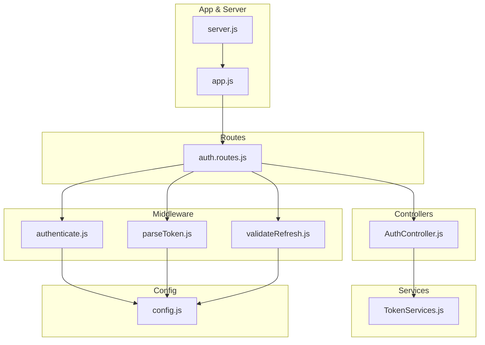
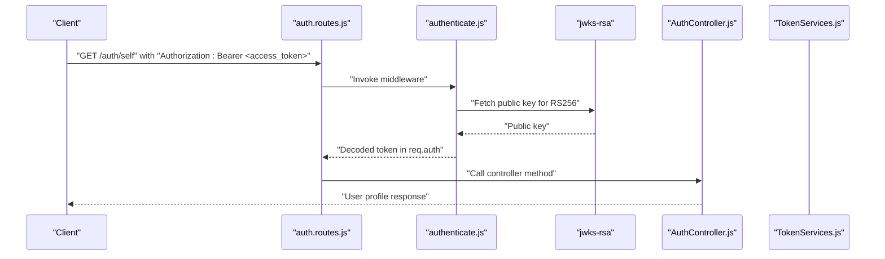
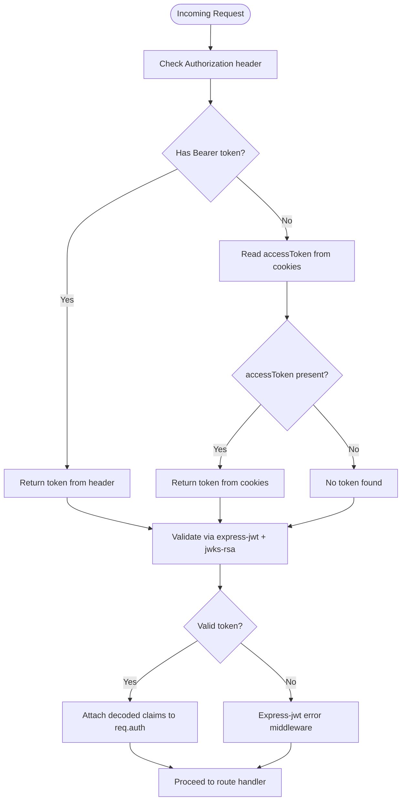
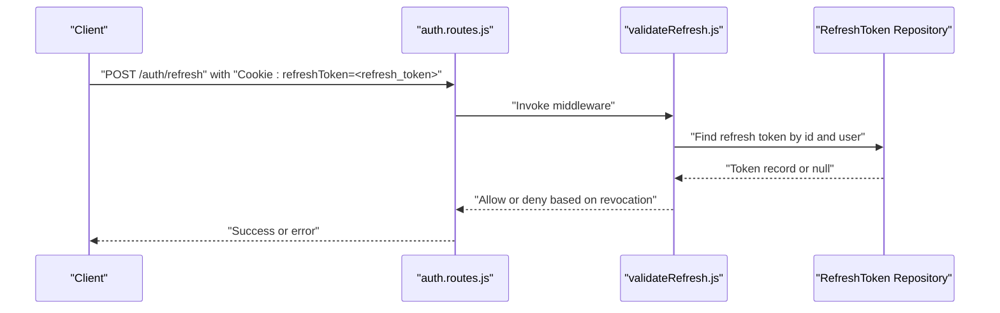
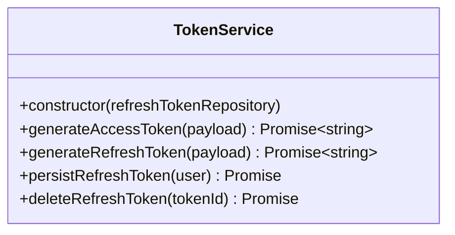
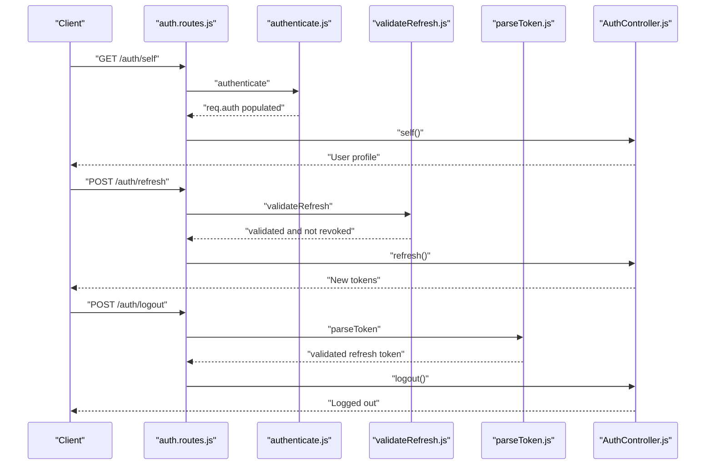
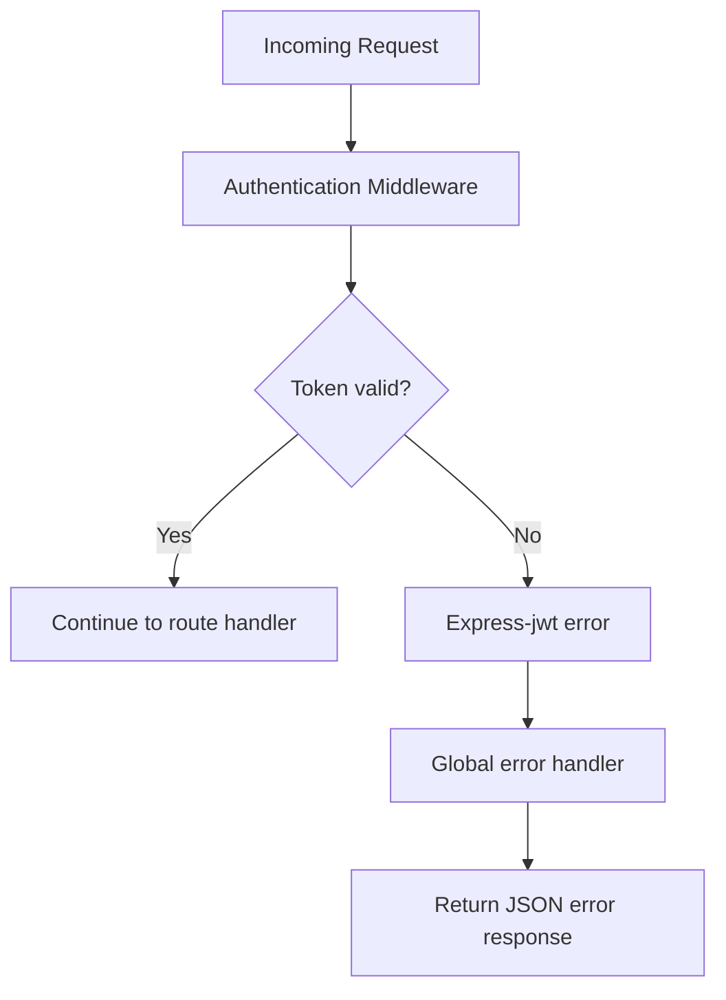
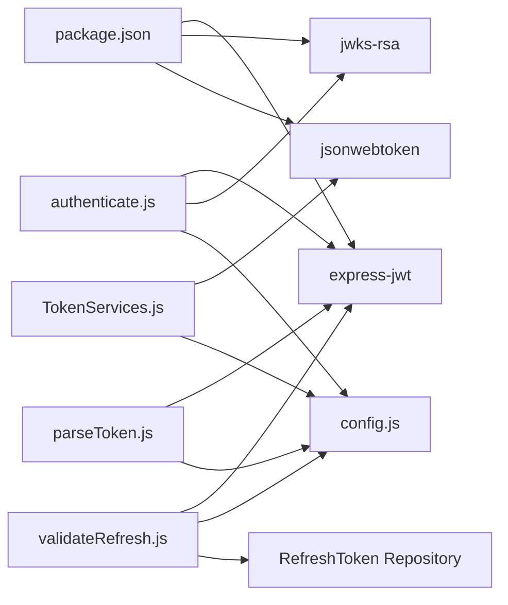

# Authentication Middleware

<cite>
**Referenced Files in This Document**
- [authenticate.js](file://src/middleware/authenticate.js)
- [parseToken.js](file://src/middleware/parseToken.js)
- [validateRefresh.js](file://src/middleware/validateRefresh.js)
- [config.js](file://src/config/config.js)
- [TokenServices.js](file://src/services/TokenServices.js)
- [AuthController.js](file://src/controllers/AuthController.js)
- [auth.routes.js](file://src/routes/auth.routes.js)
- [app.js](file://src/app.js)
- [server.js](file://src/server.js)
- [package.json](file://package.json)
- [utils.js](file://src/utils/utils.js)
- [login.spec.js](file://src/test/users/login.spec.js)
- [register.spec.js](file://src/test/users/register.spec.js)
</cite>

## Table of Contents
1. [Introduction](#introduction)
2. [Project Structure](#project-structure)
3. [Core Components](#core-components)
4. [Architecture Overview](#architecture-overview)
5. [Detailed Component Analysis](#detailed-component-analysis)
6. [Dependency Analysis](#dependency-analysis)
7. [Performance Considerations](#performance-considerations)
8. [Troubleshooting Guide](#troubleshooting-guide)
9. [Conclusion](#conclusion)

## Introduction
This document explains the authentication middleware implementation in the authentication service. It focuses on JWT token validation using express-jwt and jwks-rsa for the RS256 algorithm, token extraction from Authorization headers and cookies, JWKS URI configuration and caching, and practical usage in route protection. It also covers error handling for invalid/expired tokens and malformed headers, the token validation flow, security considerations, performance optimization, and a troubleshooting guide.

## Project Structure
The authentication middleware sits within the middleware layer and integrates with routes, controllers, and services. Key files involved in authentication include:
- Middleware: authenticate, parseToken, validateRefresh
- Configuration: environment variables and secrets
- Services: token generation and refresh token persistence
- Routes: protected endpoints
- Global error handler: centralized error response

**Diagram sources**
- [authenticate.js:1-26](file://src/middleware/authenticate.js#L1-L26)
- [parseToken.js:1-14](file://src/middleware/parseToken.js#L1-L14)
- [validateRefresh.js:1-34](file://src/middleware/validateRefresh.js#L1-L34)
- [auth.routes.js:1-49](file://src/routes/auth.routes.js#L1-L49)
- [AuthController.js:1-212](file://src/controllers/AuthController.js#L1-L212)
- [TokenServices.js:1-60](file://src/services/TokenServices.js#L1-L60)
- [config.js:1-34](file://src/config/config.js#L1-L34)
- [app.js:1-40](file://src/app.js#L1-L40)
- [server.js:1-21](file://src/server.js#L1-L21)

**Section sources**
- [auth.routes.js:1-49](file://src/routes/auth.routes.js#L1-L49)
- [app.js:1-40](file://src/app.js#L1-L40)
- [server.js:1-21](file://src/server.js#L1-L21)

## Core Components
- Authentication middleware (RS256 via JWKS): Validates access tokens using jwks-rsa with caching and rate limiting.
- Refresh token middleware (HS256 via shared secret): Validates refresh tokens extracted from cookies and checks revocation against persisted tokens.
- Token services: Generate access tokens (RS256) and refresh tokens (HS256), persist refresh tokens, and revoke them.
- Route protection: Apply authenticate to protect endpoints; apply validateRefresh for refresh flow; apply parseToken for logout revocation.
- Configuration: Load environment variables including JWKS_URI and PRIVATE_KEY_SECRET.
- Global error handling: Centralized error response for authentication failures.

**Section sources**
- [authenticate.js:1-26](file://src/middleware/authenticate.js#L1-L26)
- [validateRefresh.js:1-34](file://src/middleware/validateRefresh.js#L1-L34)
- [parseToken.js:1-14](file://src/middleware/parseToken.js#L1-L14)
- [TokenServices.js:1-60](file://src/services/TokenServices.js#L1-L60)
- [config.js:1-34](file://src/config/config.js#L1-L34)
- [app.js:23-37](file://src/app.js#L23-L37)

## Architecture Overview
The authentication flow integrates middleware, routes, controllers, and services. Access tokens are validated via JWKS with caching; refresh tokens are validated via a shared secret and checked for revocation.

**Diagram sources**
- [auth.routes.js:37-39](file://src/routes/auth.routes.js#L37-L39)
- [authenticate.js:6-25](file://src/middleware/authenticate.js#L6-L25)
- [TokenServices.js:12-32](file://src/services/TokenServices.js#L12-L32)
- [AuthController.js:138-141](file://src/controllers/AuthController.js#L138-L141)

## Detailed Component Analysis

### Authentication Middleware (RS256 via JWKS)
- Uses express-jwt with jwks-rsa secret configured with:
  - JWKS URI from environment
  - Caching enabled
  - Rate limiting enabled
- Algorithms restricted to RS256
- Token extraction logic:
  - From Authorization header: Bearer scheme
  - Fallback to accessToken cookie
- On successful validation, decoded claims are attached to req.auth for downstream handlers.

**Diagram sources**
- [authenticate.js:13-24](file://src/middleware/authenticate.js#L13-L24)

**Section sources**
- [authenticate.js:1-26](file://src/middleware/authenticate.js#L1-L26)
- [config.js:19-20](file://src/config/config.js#L19-L20)

### Refresh Token Middleware (HS256 via Shared Secret)
- Validates refresh tokens from cookies using a shared secret.
- Implements revocation check by querying persisted refresh tokens to ensure the token is still valid.
- Returns revoked if token not found in the database.

**Diagram sources**
- [validateRefresh.js:7-31](file://src/middleware/validateRefresh.js#L7-L31)
- [auth.routes.js:41-43](file://src/routes/auth.routes.js#L41-L43)

**Section sources**
- [validateRefresh.js:1-34](file://src/middleware/validateRefresh.js#L1-L34)
- [auth.routes.js:41-43](file://src/routes/auth.routes.js#L41-L43)

### Token Services (Access and Refresh Tokens)
- Access tokens:
  - Generated with RS256 using a private key file.
  - Issuer set and expires in 1 hour.
- Refresh tokens:
  - Generated with HS256 using a shared secret.
  - Expires in 7 days and includes a JWT ID matching the persisted refresh token record.
- Persist and revoke refresh tokens in the database.

**Diagram sources**
- [TokenServices.js:8-59](file://src/services/TokenServices.js#L8-L59)

**Section sources**
- [TokenServices.js:1-60](file://src/services/TokenServices.js#L1-L60)

### Route Protection Examples
- Protecting user profile retrieval:
  - Apply authenticate middleware to GET /auth/self.
- Refresh flow:
  - Apply validateRefresh middleware to POST /auth/refresh.
- Logout revocation:
  - Apply parseToken middleware to POST /auth/logout to validate and revoke refresh token.

**Diagram sources**
- [auth.routes.js:37-46](file://src/routes/auth.routes.js#L37-L46)
- [authenticate.js:6-25](file://src/middleware/authenticate.js#L6-L25)
- [validateRefresh.js:7-31](file://src/middleware/validateRefresh.js#L7-L31)
- [parseToken.js:4-13](file://src/middleware/parseToken.js#L4-L13)
- [AuthController.js:138-211](file://src/controllers/AuthController.js#L138-L211)

**Section sources**
- [auth.routes.js:1-49](file://src/routes/auth.routes.js#L1-L49)
- [AuthController.js:1-212](file://src/controllers/AuthController.js#L1-L212)

### Token Extraction Logic
- Authorization header:
  - Supports "Bearer <token>" scheme; only the token part is returned.
- Cookies:
  - accessToken cookie is used when Authorization header is absent.
  - refreshToken cookie is used for refresh and logout flows.

**Section sources**
- [authenticate.js:13-24](file://src/middleware/authenticate.js#L13-L24)
- [parseToken.js:7-10](file://src/middleware/parseToken.js#L7-L10)
- [validateRefresh.js:10-13](file://src/middleware/validateRefresh.js#L10-L13)

### Error Handling for Invalid/Expired/Malformed Tokens
- express-jwt handles validation errors and populates req.auth or triggers error middleware.
- Global error handler:
  - Logs error messages.
  - Returns structured JSON with error details and appropriate status codes.

**Diagram sources**
- [app.js:23-37](file://src/app.js#L23-L37)
- [authenticate.js:6-25](file://src/middleware/authenticate.js#L6-L25)

**Section sources**
- [app.js:23-37](file://src/app.js#L23-L37)
- [auth.routes.js:37-39](file://src/routes/auth.routes.js#L37-L39)

## Dependency Analysis
- express-jwt and jwks-rsa are used for RS256 validation with JWKS caching.
- jsonwebtoken is used for signing tokens (access and refresh).
- Environment variables drive configuration for secrets and JWKS URI.
- Middleware depends on configuration and repositories for revocation checks.

**Diagram sources**
- [package.json:30-47](file://package.json#L30-L47)
- [authenticate.js:1-3](file://src/middleware/authenticate.js#L1-L3)
- [validateRefresh.js:1-2](file://src/middleware/validateRefresh.js#L1-L2)
- [parseToken.js:1-2](file://src/middleware/parseToken.js#L1-L2)
- [TokenServices.js:1-6](file://src/services/TokenServices.js#L1-L6)
- [config.js:19-20](file://src/config/config.js#L19-L20)

**Section sources**
- [package.json:1-48](file://package.json#L1-L48)
- [authenticate.js:1-26](file://src/middleware/authenticate.js#L1-L26)
- [validateRefresh.js:1-34](file://src/middleware/validateRefresh.js#L1-L34)
- [parseToken.js:1-14](file://src/middleware/parseToken.js#L1-L14)
- [TokenServices.js:1-60](file://src/services/TokenServices.js#L1-L60)
- [config.js:1-34](file://src/config/config.js#L1-L34)

## Performance Considerations
- JWKS caching:
  - Enabled in authenticate middleware to reduce network calls and CPU overhead.
- Rate limiting:
  - Enabled to prevent excessive JWKS requests under attack scenarios.
- Token algorithms:
  - RS256 with jwks-rsa is efficient and secure; ensure JWKS URI is reachable and cached appropriately.
- Cookie-based tokens:
  - Using httpOnly cookies prevents client-side tampering and reduces XSS risks.
- Token lifetimes:
  - Short-lived access tokens (1 hour) with refresh tokens (7 days) balance security and usability.

[No sources needed since this section provides general guidance]

## Troubleshooting Guide
Common issues and debugging techniques:
- Missing or malformed Authorization header:
  - Ensure "Bearer <token>" format; verify token presence in cookies if header is absent.
- Invalid or expired access token:
  - Confirm token signature and expiration; regenerate token if expired.
- JWKS URI misconfiguration:
  - Verify JWKS_URI environment variable; ensure endpoint is reachable and returns keys for RS256.
- Revoked refresh token:
  - Check database for refresh token records; ensure token deletion occurs on logout.
- Testing with utilities:
  - Use JWT detection utility to validate token structure in tests.
- Test coverage:
  - Inspect test suites for expected cookie behavior and JWT validation outcomes.

**Section sources**
- [authenticate.js:13-24](file://src/middleware/authenticate.js#L13-L24)
- [validateRefresh.js:14-30](file://src/middleware/validateRefresh.js#L14-L30)
- [utils.js:13-31](file://src/utils/utils.js#L13-L31)
- [register.spec.js:115-138](file://src/test/users/register.spec.js#L115-L138)
- [login.spec.js:62-74](file://src/test/users/login.spec.js#L62-L74)

## Conclusion
The authentication middleware leverages express-jwt and jwks-rsa for robust RS256 token validation, supports dual token extraction from headers and cookies, and integrates seamlessly with route protection. Refresh tokens are validated using a shared secret and revocation checks. The system includes centralized error handling and follows security best practices with caching, rate limiting, and httpOnly cookies. Performance is optimized through JWKS caching and short-lived access tokens, while comprehensive tests validate token behavior and middleware integration.