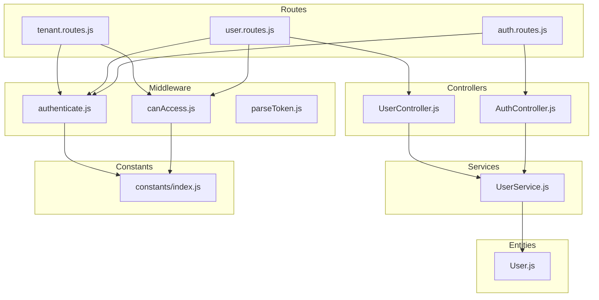
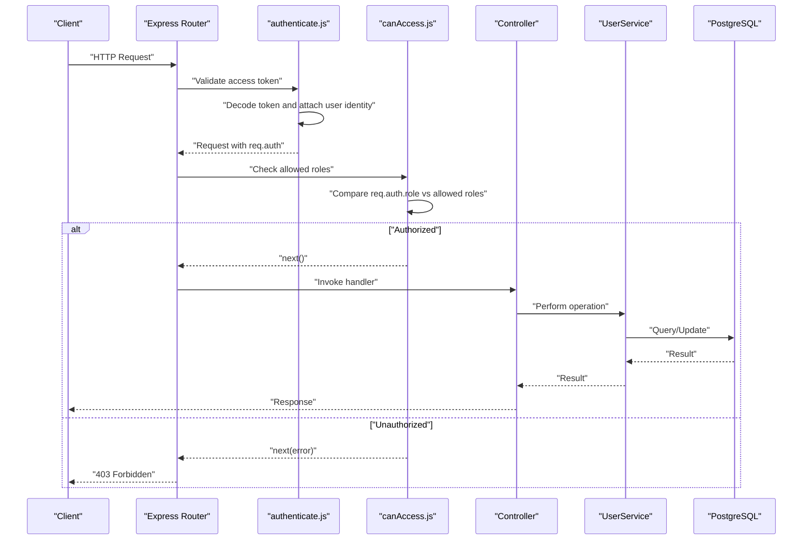
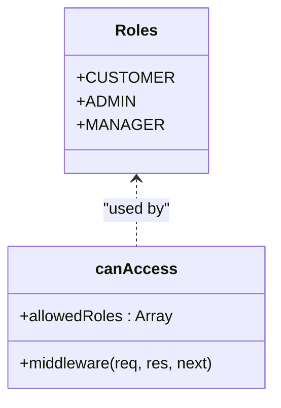
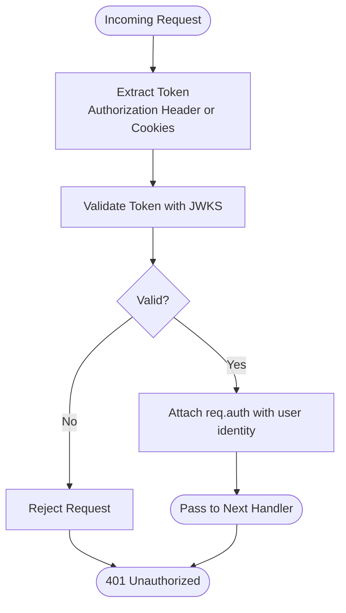
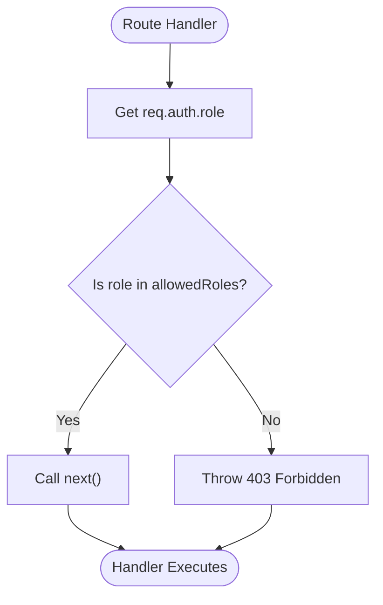
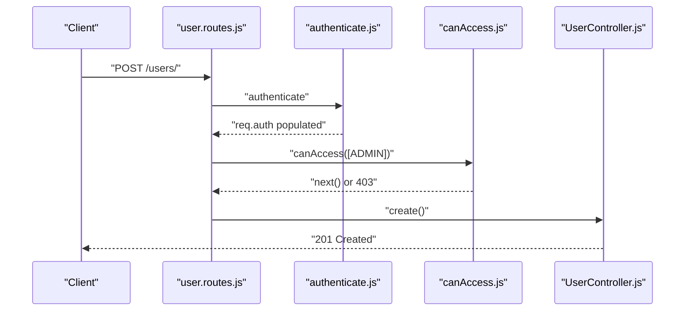
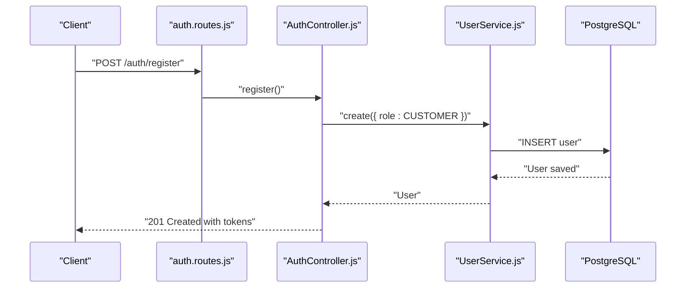
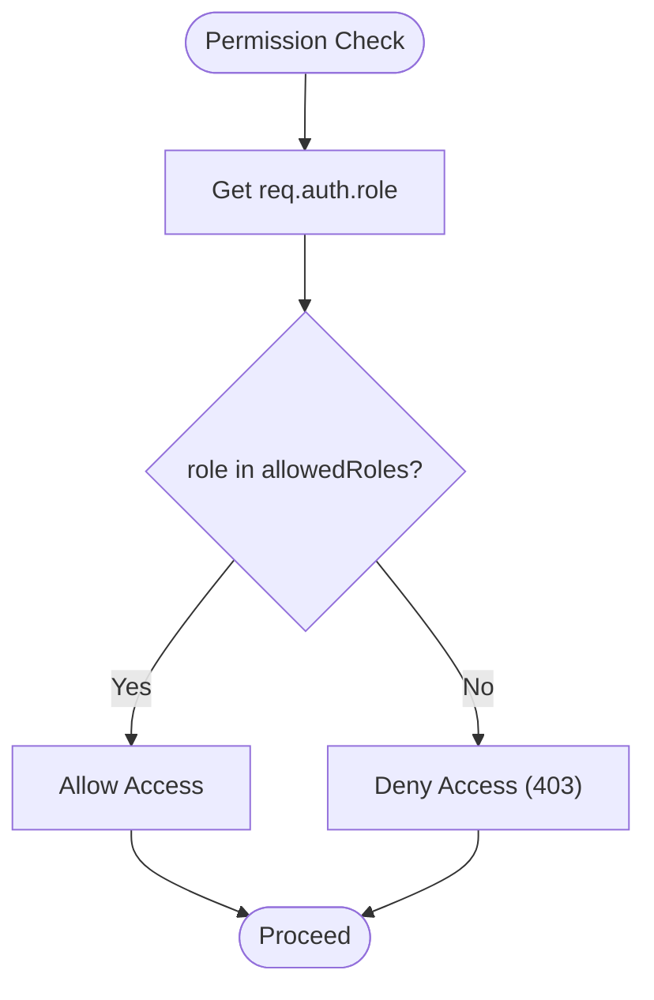
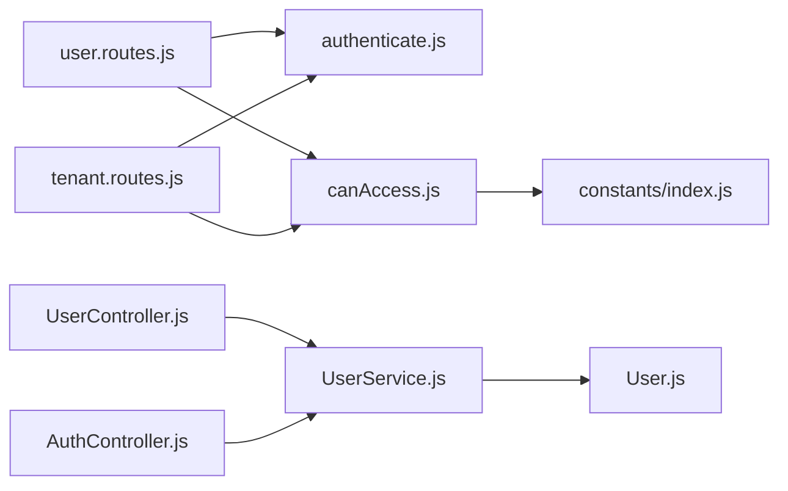

# Authorization Middleware

<cite>
**Referenced Files in This Document**
- [index.js](file://src/constants/index.js)
- [canAccess.js](file://src/middleware/canAccess.js)
- [authenticate.js](file://src/middleware/authenticate.js)
- [parseToken.js](file://src/middleware/parseToken.js)
- [User.js](file://src/entity/User.js)
- [AuthController.js](file://src/controllers/AuthController.js)
- [UserController.js](file://src/controllers/UserController.js)
- [auth.routes.js](file://src/routes/auth.routes.js)
- [user.routes.js](file://src/routes/user.routes.js)
- [tenant.routes.js](file://src/routes/tenant.routes.js)
- [UserService.js](file://src/services/UserService.js)
- [app.js](file://src/app.js)
- [config.js](file://src/config/config.js)
</cite>

## Table of Contents
1. [Introduction](#introduction)
2. [Project Structure](#project-structure)
3. [Core Components](#core-components)
4. [Architecture Overview](#architecture-overview)
5. [Detailed Component Analysis](#detailed-component-analysis)
6. [Dependency Analysis](#dependency-analysis)
7. [Performance Considerations](#performance-considerations)
8. [Troubleshooting Guide](#troubleshooting-guide)
9. [Conclusion](#conclusion)
10. [Appendices](#appendices)

## Introduction
This document explains the authorization middleware implementation that enforces role-based access control (RBAC) in the authentication service. It covers the RBAC model with CUSTOMER, ADMIN, and MANAGER roles, the permission checking logic, middleware usage patterns for protecting routes, and practical examples of role-based route protection. It also documents the relationship between authorization middleware and user roles defined in constants, common authorization scenarios, error handling for unauthorized access, debugging permission issues, and guidelines for extending the role system.

## Project Structure
The authorization system spans several modules:
- Constants define the available roles.
- Authentication middleware validates tokens and attaches user identity to requests.
- Access control middleware checks whether the authenticated user has the required role(s).
- Routes apply these middlewares to protect endpoints.
- Controllers and services handle user creation, role assignment, and data operations.

**Diagram sources**
- [auth.routes.js:1-49](file://src/routes/auth.routes.js#L1-L49)
- [user.routes.js:1-38](file://src/routes/user.routes.js#L1-L38)
- [tenant.routes.js:1-45](file://src/routes/tenant.routes.js#L1-L45)
- [authenticate.js:1-26](file://src/middleware/authenticate.js#L1-L26)
- [canAccess.js:1-23](file://src/middleware/canAccess.js#L1-L23)
- [parseToken.js:1-14](file://src/middleware/parseToken.js#L1-L14)
- [AuthController.js:1-212](file://src/controllers/AuthController.js#L1-L212)
- [UserController.js:1-94](file://src/controllers/UserController.js#L1-L94)
- [UserService.js:1-99](file://src/services/UserService.js#L1-L99)
- [User.js:1-50](file://src/entity/User.js#L1-L50)
- [index.js:1-6](file://src/constants/index.js#L1-L6)

**Section sources**
- [auth.routes.js:1-49](file://src/routes/auth.routes.js#L1-L49)
- [user.routes.js:1-38](file://src/routes/user.routes.js#L1-L38)
- [tenant.routes.js:1-45](file://src/routes/tenant.routes.js#L1-L45)
- [authenticate.js:1-26](file://src/middleware/authenticate.js#L1-L26)
- [canAccess.js:1-23](file://src/middleware/canAccess.js#L1-L23)
- [parseToken.js:1-14](file://src/middleware/parseToken.js#L1-L14)
- [AuthController.js:1-212](file://src/controllers/AuthController.js#L1-L212)
- [UserController.js:1-94](file://src/controllers/UserController.js#L1-L94)
- [UserService.js:1-99](file://src/services/UserService.js#L1-L99)
- [User.js:1-50](file://src/entity/User.js#L1-L50)
- [index.js:1-6](file://src/constants/index.js#L1-L6)

## Core Components
- Role constants: Define CUSTOMER, ADMIN, and MANAGER roles used throughout the system.
- Authentication middleware: Validates access tokens using JWKS and attaches decoded user identity to the request.
- Access control middleware: Checks if the authenticated user’s role is included in the allowed roles list.
- Route protection: Applies authentication and access control to protected endpoints.
- User entity: Stores user role in the database.
- Controllers and services: Handle user registration, login, and CRUD operations while assigning roles.

Key implementation patterns:
- Role-based route protection is applied by chaining middleware on route definitions.
- Access control middleware reads the user role from the authenticated request object and compares it against allowed roles.
- Controllers attach roles during user registration and login flows.

**Section sources**
- [index.js:1-6](file://src/constants/index.js#L1-L6)
- [authenticate.js:1-26](file://src/middleware/authenticate.js#L1-L26)
- [canAccess.js:1-23](file://src/middleware/canAccess.js#L1-L23)
- [user.routes.js:15-35](file://src/routes/user.routes.js#L15-L35)
- [tenant.routes.js:16-42](file://src/routes/tenant.routes.js#L16-L42)
- [User.js:27-29](file://src/entity/User.js#L27-L29)
- [AuthController.js:19-70](file://src/controllers/AuthController.js#L19-L70)
- [AuthController.js:72-136](file://src/controllers/AuthController.js#L72-L136)

## Architecture Overview
The authorization architecture enforces RBAC by validating tokens and enforcing role checks at the route level. The flow is as follows:
- Requests pass through authentication middleware to validate and decode tokens.
- Access control middleware verifies the user’s role against allowed roles.
- Protected routes are defined with both authentication and access control middleware.

**Diagram sources**
- [authenticate.js:6-25](file://src/middleware/authenticate.js#L6-L25)
- [canAccess.js:4-22](file://src/middleware/canAccess.js#L4-L22)
- [user.routes.js:15-35](file://src/routes/user.routes.js#L15-L35)
- [tenant.routes.js:16-42](file://src/routes/tenant.routes.js#L16-L42)
- [AuthController.js:19-70](file://src/controllers/AuthController.js#L19-L70)
- [UserService.js:7-38](file://src/services/UserService.js#L7-L38)
- [User.js:1-50](file://src/entity/User.js#L1-L50)

## Detailed Component Analysis

### Role-Based Access Control (RBAC) Model
- Roles are defined centrally and used consistently across the application.
- The system supports CUSTOMER, ADMIN, and MANAGER roles.
- Access control middleware enforces role checks by comparing the authenticated user’s role with allowed roles.

**Diagram sources**
- [index.js:1-6](file://src/constants/index.js#L1-L6)
- [canAccess.js:4-22](file://src/middleware/canAccess.js#L4-L22)

**Section sources**
- [index.js:1-6](file://src/constants/index.js#L1-L6)
- [canAccess.js:4-22](file://src/middleware/canAccess.js#L4-L22)

### Authentication Middleware
- Validates access tokens using JWKS and RS256 algorithm.
- Extracts tokens from Authorization header or cookies.
- Attaches decoded user identity (including role) to req.auth.

**Diagram sources**
- [authenticate.js:6-25](file://src/middleware/authenticate.js#L6-L25)

**Section sources**
- [authenticate.js:1-26](file://src/middleware/authenticate.js#L1-L26)
- [config.js:23-33](file://src/config/config.js#L23-L33)

### Access Control Middleware
- Reads user role from req.auth.role.
- Compares role against allowedRoles array.
- Denies access with 403 if role is not allowed; otherwise proceeds.

**Diagram sources**
- [canAccess.js:4-22](file://src/middleware/canAccess.js#L4-L22)

**Section sources**
- [canAccess.js:1-23](file://src/middleware/canAccess.js#L1-L23)

### Route Protection Patterns
- Authentication middleware is applied to routes requiring token validation.
- Access control middleware restricts routes to specific roles.
- Examples:
  - Users: POST /users/, GET /users/, PATCH /users/:id, DELETE /users/:id require ADMIN.
  - Tenants: POST /tenants/, POST /tenants/:id, DELETE /tenants/:id require ADMIN.
  - Auth: GET /auth/self requires authentication.

**Diagram sources**
- [user.routes.js:15-17](file://src/routes/user.routes.js#L15-L17)
- [canAccess.js:4-22](file://src/middleware/canAccess.js#L4-L22)
- [UserController.js:12-28](file://src/controllers/UserController.js#L12-L28)

**Section sources**
- [user.routes.js:15-35](file://src/routes/user.routes.js#L15-L35)
- [tenant.routes.js:16-42](file://src/routes/tenant.routes.js#L16-L42)
- [auth.routes.js:37-39](file://src/routes/auth.routes.js#L37-L39)

### Role Assignment and User Registration
- During registration, users are assigned the CUSTOMER role by default.
- Login uses the user’s stored role or defaults to CUSTOMER if missing.
- Role is included in access token payload for downstream authorization checks.

**Diagram sources**
- [AuthController.js:19-70](file://src/controllers/AuthController.js#L19-L70)
- [UserService.js:7-38](file://src/services/UserService.js#L7-L38)
- [User.js:27-29](file://src/entity/User.js#L27-L29)

**Section sources**
- [AuthController.js:19-70](file://src/controllers/AuthController.js#L19-L70)
- [UserService.js:7-38](file://src/services/UserService.js#L7-L38)
- [User.js:27-29](file://src/entity/User.js#L27-L29)

### Practical Examples of Role-Based Route Protection
- Admin-only endpoints:
  - POST /users/ (create user)
  - GET /users/ (list users)
  - PATCH /users/:id (update user)
  - DELETE /users/:id (delete user)
  - POST /tenants/ (create tenant)
  - POST /tenants/:id (update tenant)
  - DELETE /tenants/:id (delete tenant)
- Authenticated-only endpoint:
  - GET /auth/self (fetch current user profile)

These protections are enforced by applying authenticate and canAccess middleware in the route definitions.

**Section sources**
- [user.routes.js:15-35](file://src/routes/user.routes.js#L15-L35)
- [tenant.routes.js:16-42](file://src/routes/tenant.routes.js#L16-L42)
- [auth.routes.js:37-39](file://src/routes/auth.routes.js#L37-L39)

### Permission Checking Logic and Role Hierarchy
- Permission checking is role-based: a route allows access if the user’s role is included in the allowedRoles array.
- The current implementation does not enforce a strict role hierarchy (e.g., ADMIN > MANAGER > CUSTOMER). Instead, it performs a membership check against allowed roles.
- To implement hierarchical permissions, extend canAccess to evaluate role precedence or introduce permission matrices.

**Diagram sources**
- [canAccess.js:4-22](file://src/middleware/canAccess.js#L4-L22)

**Section sources**
- [canAccess.js:4-22](file://src/middleware/canAccess.js#L4-L22)

### Relationship Between Authorization Middleware and User Roles
- Roles are defined in constants and referenced by access control middleware.
- Controllers attach roles to access tokens during registration and login.
- The user entity stores role in the database, ensuring consistency across sessions.

**Section sources**
- [index.js:1-6](file://src/constants/index.js#L1-L6)
- [canAccess.js:4-22](file://src/middleware/canAccess.js#L4-L22)
- [AuthController.js:34-47](file://src/controllers/AuthController.js#L34-L47)
- [AuthController.js:103-113](file://src/controllers/AuthController.js#L103-L113)
- [User.js:27-29](file://src/entity/User.js#L27-L29)

## Dependency Analysis
The authorization system exhibits clear separation of concerns:
- Routes depend on middleware for authentication and authorization.
- Controllers depend on services for business logic.
- Services depend on the database entity for persistence.
- Middleware depends on configuration for token validation.

**Diagram sources**
- [user.routes.js:15-35](file://src/routes/user.routes.js#L15-L35)
- [tenant.routes.js:16-42](file://src/routes/tenant.routes.js#L16-L42)
- [authenticate.js:1-26](file://src/middleware/authenticate.js#L1-L26)
- [canAccess.js:1-23](file://src/middleware/canAccess.js#L1-L23)
- [index.js:1-6](file://src/constants/index.js#L1-L6)
- [UserController.js:1-94](file://src/controllers/UserController.js#L1-L94)
- [UserService.js:1-99](file://src/services/UserService.js#L1-L99)
- [User.js:1-50](file://src/entity/User.js#L1-L50)

**Section sources**
- [user.routes.js:15-35](file://src/routes/user.routes.js#L15-L35)
- [tenant.routes.js:16-42](file://src/routes/tenant.routes.js#L16-L42)
- [authenticate.js:1-26](file://src/middleware/authenticate.js#L1-L26)
- [canAccess.js:1-23](file://src/middleware/canAccess.js#L1-L23)
- [index.js:1-6](file://src/constants/index.js#L1-L6)
- [UserController.js:1-94](file://src/controllers/UserController.js#L1-L94)
- [UserService.js:1-99](file://src/services/UserService.js#L1-L99)
- [User.js:1-50](file://src/entity/User.js#L1-L50)

## Performance Considerations
- Token validation caching: The authentication middleware caches JWKS keys to reduce network overhead.
- Minimal middleware overhead: Access control is a constant-time lookup against allowed roles.
- Database efficiency: User queries are straightforward and rely on built-in TypeORM methods.

[No sources needed since this section provides general guidance]

## Troubleshooting Guide
Common authorization issues and resolutions:
- 403 Forbidden responses:
  - Cause: User role not included in allowed roles for the route.
  - Resolution: Verify the user’s role in the database and ensure the route’s allowed roles include the user’s role.
- 401 Unauthorized responses:
  - Cause: Missing or invalid access token.
  - Resolution: Confirm Authorization header or access cookie is present and valid; check JWKS URI and token signing algorithm.
- Role mismatch during login:
  - Cause: Stored role differs from expected role.
  - Resolution: Ensure role is correctly persisted in the user entity and included in the access token payload.
- Debugging steps:
  - Log req.auth to inspect decoded token claims.
  - Verify allowed roles array passed to canAccess.
  - Confirm token payload includes role claim.

**Section sources**
- [canAccess.js:10-17](file://src/middleware/canAccess.js#L10-L17)
- [authenticate.js:6-25](file://src/middleware/authenticate.js#L6-L25)
- [AuthController.js:34-47](file://src/controllers/AuthController.js#L34-L47)
- [AuthController.js:103-113](file://src/controllers/AuthController.js#L103-L113)
- [User.js:27-29](file://src/entity/User.js#L27-L29)

## Conclusion
The authorization middleware implements a clean, role-based access control system using centralized role constants, robust token authentication, and simple role-checking middleware. Routes consistently apply authentication and access control to enforce permissions. While the current implementation focuses on role membership, it provides a solid foundation for extending to hierarchical permissions or permission matrices as requirements evolve.

[No sources needed since this section summarizes without analyzing specific files]

## Appendices

### Guidelines for Extending the Role System
- Add new roles to the constants module.
- Update allowed roles arrays in route definitions to include new roles where appropriate.
- Ensure controllers and services persist and use the new roles consistently.
- Consider introducing hierarchical permissions or permission matrices for fine-grained control.
- Add tests to validate new role combinations and edge cases.

**Section sources**
- [index.js:1-6](file://src/constants/index.js#L1-L6)
- [user.routes.js:15-35](file://src/routes/user.routes.js#L15-L35)
- [tenant.routes.js:16-42](file://src/routes/tenant.routes.js#L16-L42)
- [AuthController.js:34-47](file://src/controllers/AuthController.js#L34-L47)
- [UserService.js:7-38](file://src/services/UserService.js#L7-L38)