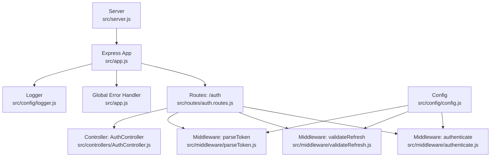
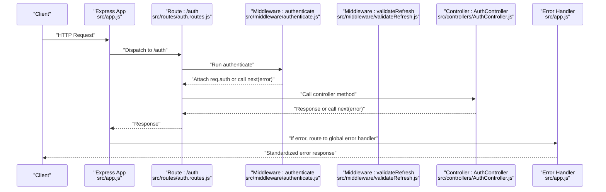
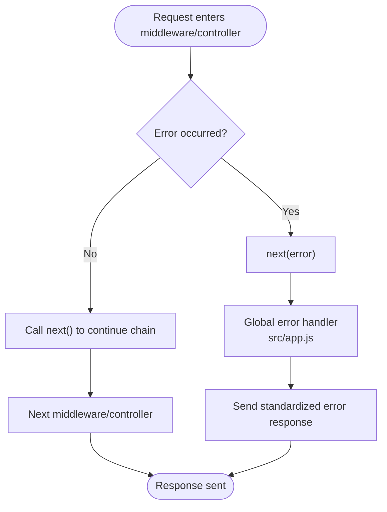
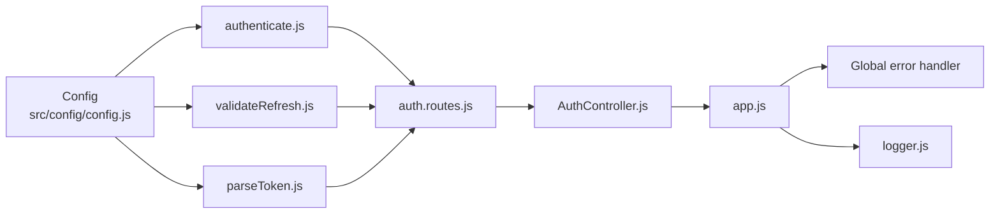

# Custom Middleware Development

<cite>
**Referenced Files in This Document**
- [src/app.js](file://src/app.js)
- [src/server.js](file://src/server.js)
- [src/config/config.js](file://src/config/config.js)
- [src/config/logger.js](file://src/config/logger.js)
- [src/middleware/authenticate.js](file://src/middleware/authenticate.js)
- [src/middleware/canAccess.js](file://src/middleware/canAccess.js)
- [src/middleware/parseToken.js](file://src/middleware/parseToken.js)
- [src/middleware/validateRefresh.js](file://src/middleware/validateRefresh.js)
- [src/routes/auth.routes.js](file://src/routes/auth.routes.js)
- [src/controllers/AuthController.js](file://src/controllers/AuthController.js)
- [src/constants/index.js](file://src/constants/index.js)
- [src/utils/utils.js](file://src/utils/utils.js)
- [src/test/users/register.spec.js](file://src/test/users/register.spec.js)
- [src/test/users/login.spec.js](file://src/test/users/login.spec.js)
- [jest.config.mjs](file://jest.config.mjs)
</cite>

## Table of Contents
1. [Introduction](#introduction)
2. [Project Structure](#project-structure)
3. [Core Components](#core-components)
4. [Architecture Overview](#architecture-overview)
5. [Detailed Component Analysis](#detailed-component-analysis)
6. [Dependency Analysis](#dependency-analysis)
7. [Performance Considerations](#performance-considerations)
8. [Troubleshooting Guide](#troubleshooting-guide)
9. [Conclusion](#conclusion)
10. [Appendices](#appendices)

## Introduction
This document explains how to develop custom middleware for the Express-based application. It covers the middleware function signature, the next() callback, error propagation, execution order, and chain processing. It also documents techniques for modifying requests/responses, sharing context, and composing reusable middleware. Practical examples demonstrate validation, logging, and transformation middleware. Testing strategies and debugging approaches are included, along with performance considerations and integration patterns with the existing middleware stack.

## Project Structure
The application is organized around Express routing, controllers, middleware, configuration, and tests. Middleware is applied at the route level and integrates with Express’s request/response lifecycle and error-handling middleware.

**Diagram sources**
- [src/server.js:1-21](file://src/server.js#L1-L21)
- [src/app.js:1-40](file://src/app.js#L1-L40)
- [src/routes/auth.routes.js:1-49](file://src/routes/auth.routes.js#L1-L49)
- [src/middleware/authenticate.js:1-26](file://src/middleware/authenticate.js#L1-L26)
- [src/middleware/validateRefresh.js:1-34](file://src/middleware/validateRefresh.js#L1-L34)
- [src/middleware/parseToken.js:1-14](file://src/middleware/parseToken.js#L1-L14)
- [src/controllers/AuthController.js:1-212](file://src/controllers/AuthController.js#L1-L212)
- [src/config/config.js:1-34](file://src/config/config.js#L1-L34)
- [src/config/logger.js:1-42](file://src/config/logger.js#L1-L42)

**Section sources**
- [src/app.js:1-40](file://src/app.js#L1-L40)
- [src/server.js:1-21](file://src/server.js#L1-L21)
- [src/config/config.js:1-34](file://src/config/config.js#L1-L34)

## Core Components
- Express app and error handling: The app initializes middleware and defines a global error-handling middleware that standardizes error responses.
- Route-level middleware: Authentication, refresh token validation, and token parsing are applied per route.
- Controller integration: Controllers receive preprocessed requests (e.g., req.auth populated by JWT middleware) and may call next() to propagate errors.
- Logging and configuration: Winston logger and environment-based configuration support middleware behavior and diagnostics.

Key patterns:
- Middleware signature: (req, res, next) => void
- next(): Continues the chain; next(error) short-circuits to error handler
- Context sharing: Middleware sets properties on req (e.g., req.auth) for downstream handlers
- Execution order: Defined by app.use() and route.use() ordering

**Section sources**
- [src/app.js:1-40](file://src/app.js#L1-L40)
- [src/controllers/AuthController.js:138-141](file://src/controllers/AuthController.js#L138-L141)
- [src/config/logger.js:1-42](file://src/config/logger.js#L1-L42)

## Architecture Overview
The middleware stack is layered:
- Application-wide middleware (JSON parsing, cookies)
- Route-specific middleware (authentication, validation)
- Controller handlers
- Global error handler

**Diagram sources**
- [src/app.js:1-40](file://src/app.js#L1-L40)
- [src/routes/auth.routes.js:1-49](file://src/routes/auth.routes.js#L1-L49)
- [src/middleware/authenticate.js:1-26](file://src/middleware/authenticate.js#L1-L26)
- [src/middleware/validateRefresh.js:1-34](file://src/middleware/validateRefresh.js#L1-L34)
- [src/controllers/AuthController.js:1-212](file://src/controllers/AuthController.js#L1-L212)

## Detailed Component Analysis

### Middleware Function Signature and next() Callback
- Signature: Each middleware is a function with three parameters: request, response, and next.
- next(): Invoking next() continues the chain. Passing an error object to next() bypasses remaining middleware and routes it to the global error handler.
- Context: Middleware can mutate req and res, and can attach metadata to req for subsequent handlers.

Practical implications:
- Always call next() unless handling the request fully.
- On error, pass an error object to next() to trigger centralized error handling.

**Section sources**
- [src/app.js:23-37](file://src/app.js#L23-L37)
- [src/middleware/canAccess.js:10-17](file://src/middleware/canAccess.js#L10-L17)

### Error Propagation Patterns
- Centralized error handler: A four-parameter middleware catches errors thrown by previous middleware or controllers and returns a standardized JSON response.
- Controller-driven errors: Controllers call next(error) to propagate business logic errors upstream.

**Diagram sources**
- [src/app.js:23-37](file://src/app.js#L23-L37)
- [src/controllers/AuthController.js:88-100](file://src/controllers/AuthController.js#L88-L100)

**Section sources**
- [src/app.js:23-37](file://src/app.js#L23-L37)
- [src/controllers/AuthController.js:66-70](file://src/controllers/AuthController.js#L66-L70)

### Middleware Execution Order and Chain Processing
- Order is determined by registration order in the app and route files.
- Route-level middleware runs before route handlers.
- After the last middleware/controller, the response is returned; if an error occurs, it is handled by the global error handler.

Evidence from route wiring:
- Validation middleware precedes controller handlers.
- Authentication middleware precedes protected routes.

**Section sources**
- [src/routes/auth.routes.js:29-46](file://src/routes/auth.routes.js#L29-L46)
- [src/app.js:10-21](file://src/app.js#L10-L21)

### Request/Response Modification Techniques and Context Sharing
- Modify request: Set properties on req (e.g., req.auth) for downstream handlers.
- Modify response: Set cookies, headers, or body.
- Share context: Use req properties to pass data across middleware and controllers.

Examples in code:
- req.auth is populated by JWT middleware and used by controllers.
- Cookies are set for tokens.

**Section sources**
- [src/middleware/authenticate.js:13-24](file://src/middleware/authenticate.js#L13-L24)
- [src/controllers/AuthController.js:50-62](file://src/controllers/AuthController.js#L50-L62)
- [src/controllers/AuthController.js:116-128](file://src/controllers/AuthController.js#L116-L128)

### Building Custom Validation Middleware
Pattern:
- Validate req properties (e.g., body, params, query).
- On failure, call next(error) with an appropriate HTTP error.
- On success, call next() to continue.

Example reference:
- Role-based access middleware demonstrates returning next(error) on unauthorized access.

**Section sources**
- [src/middleware/canAccess.js:10-17](file://src/middleware/canAccess.js#L10-L17)

### Building Custom Logging Middleware
Pattern:
- Log before/after processing in middleware.
- Use the configured logger to emit structured logs.

Example reference:
- Winston logger is configured and used throughout the app.

**Section sources**
- [src/config/logger.js:1-42](file://src/config/logger.js#L1-L42)
- [src/controllers/AuthController.js:64](file://src/controllers/AuthController.js#L64)

### Building Custom Transformation Middleware
Pattern:
- Parse, normalize, or enrich request data.
- Attach transformed data to req for downstream handlers.

Example reference:
- Token extraction from Authorization header or cookies is handled in JWT middleware.

**Section sources**
- [src/middleware/authenticate.js:13-24](file://src/middleware/authenticate.js#L13-L24)
- [src/middleware/parseToken.js:7-10](file://src/middleware/parseToken.js#L7-L10)

### Middleware Composition Techniques
- Compose multiple middleware functions to form a pipeline.
- Use higher-order functions to parameterize middleware behavior (e.g., canAccess with allowed roles).
- Apply middleware at the app or route level depending on scope.

**Section sources**
- [src/middleware/canAccess.js:4-22](file://src/middleware/canAccess.js#L4-L22)
- [src/routes/auth.routes.js:12-14](file://src/routes/auth.routes.js#L12-L14)

### Integration with Existing Middleware Stack
- Register middleware globally via app.use().
- Apply route-specific middleware by passing middleware functions to route methods.
- Ensure error handling middleware is registered last.

**Section sources**
- [src/app.js:10-21](file://src/app.js#L10-L21)
- [src/routes/auth.routes.js:12-14](file://src/routes/auth.routes.js#L12-L14)

## Dependency Analysis

**Diagram sources**
- [src/config/config.js:1-34](file://src/config/config.js#L1-L34)
- [src/middleware/authenticate.js:1-26](file://src/middleware/authenticate.js#L1-L26)
- [src/middleware/validateRefresh.js:1-34](file://src/middleware/validateRefresh.js#L1-L34)
- [src/middleware/parseToken.js:1-14](file://src/middleware/parseToken.js#L1-L14)
- [src/routes/auth.routes.js:1-49](file://src/routes/auth.routes.js#L1-L49)
- [src/controllers/AuthController.js:1-212](file://src/controllers/AuthController.js#L1-L212)
- [src/app.js:1-40](file://src/app.js#L1-L40)
- [src/config/logger.js:1-42](file://src/config/logger.js#L1-L42)

**Section sources**
- [src/config/config.js:1-34](file://src/config/config.js#L1-L34)
- [src/middleware/authenticate.js:1-26](file://src/middleware/authenticate.js#L1-L26)
- [src/middleware/validateRefresh.js:1-34](file://src/middleware/validateRefresh.js#L1-L34)
- [src/middleware/parseToken.js:1-14](file://src/middleware/parseToken.js#L1-L14)
- [src/routes/auth.routes.js:1-49](file://src/routes/auth.routes.js#L1-L49)
- [src/controllers/AuthController.js:1-212](file://src/controllers/AuthController.js#L1-L212)
- [src/app.js:1-40](file://src/app.js#L1-L40)
- [src/config/logger.js:1-42](file://src/config/logger.js#L1-L42)

## Performance Considerations
- Minimize synchronous I/O in middleware; defer to asynchronous operations.
- Cache frequently accessed data (e.g., JWKS caching in JWT middleware).
- Keep middleware logic lightweight; offload heavy work to services or background tasks.
- Use early exits for invalid requests to avoid unnecessary processing.
- Configure logging appropriately to avoid excessive disk I/O in production.

[No sources needed since this section provides general guidance]

## Troubleshooting Guide
- Debugging middleware:
  - Add logging before/after next() invocations.
  - Inspect req properties (e.g., req.auth) to verify middleware behavior.
- Error handling:
  - Ensure next(error) is called consistently for business errors.
  - Verify the global error handler is registered last.
- Testing:
  - Use supertest to send requests to routes with middleware.
  - Mock or initialize data source for predictable tests.
  - Assert cookies and response bodies in tests.

References:
- Supertest usage in tests
- Global error handler registration
- Logger configuration

**Section sources**
- [src/test/users/register.spec.js:1-168](file://src/test/users/register.spec.js#L1-L168)
- [src/test/users/login.spec.js:1-92](file://src/test/users/login.spec.js#L1-L92)
- [src/app.js:23-37](file://src/app.js#L23-L37)
- [src/config/logger.js:1-42](file://src/config/logger.js#L1-L42)

## Conclusion
Custom middleware in this application follows a consistent Express pattern: (req, res, next), with context attached to req and errors propagated via next(error). Middleware execution order is explicit through app and route registrations. By leveraging the existing authentication, validation, and error-handling patterns, developers can build reusable, composable middleware that modifies requests/responses, shares context, and integrates cleanly with the existing stack.

[No sources needed since this section summarizes without analyzing specific files]

## Appendices

### Middleware Reusability Guidelines
- Encapsulate behavior in higher-order functions to accept configuration (e.g., allowed roles).
- Keep middleware stateless and side-effect minimal.
- Export standalone functions for easy reuse across routes.

**Section sources**
- [src/middleware/canAccess.js:4-22](file://src/middleware/canAccess.js#L4-L22)

### Configuration Options for Middleware
- Environment variables drive middleware behavior (e.g., secrets, JWKS URI).
- Centralize configuration and inject into middleware factories.

**Section sources**
- [src/config/config.js:11-33](file://src/config/config.js#L11-L33)

### Middleware Testing Strategies
- Use supertest to assert middleware effects (e.g., cookies, status codes).
- Initialize and synchronize the data source for tests requiring persistence.
- Leverage Jest configuration for module resolution and test execution.

**Section sources**
- [src/test/users/register.spec.js:1-168](file://src/test/users/register.spec.js#L1-L168)
- [src/test/users/login.spec.js:1-92](file://src/test/users/login.spec.js#L1-L92)
- [jest.config.mjs:1-203](file://jest.config.mjs#L1-L203)