# Middleware System

<cite>
**Referenced Files in This Document**
- [authenticate.js](file://src/middleware/authenticate.js)
- [canAccess.js](file://src/middleware/canAccess.js)
- [parseToken.js](file://src/middleware/parseToken.js)
- [validateRefresh.js](file://src/middleware/validateRefresh.js)
- [auth.routes.js](file://src/routes/auth.routes.js)
- [AuthController.js](file://src/controllers/AuthController.js)
- [config.js](file://src/config/config.js)
- [TokenServices.js](file://src/services/TokenServices.js)
- [RefreshToken.js](file://src/entity/RefreshToken.js)
- [register-validators.js](file://src/validators/register-validators.js)
- [login-validators.js](file://src/validators/login-validators.js)
- [index.js](file://src/constants/index.js)
- [app.js](file://src/app.js)
- [server.js](file://src/server.js)
</cite>

## Table of Contents
1. [Introduction](#introduction)
2. [Project Structure](#project-structure)
3. [Core Components](#core-components)
4. [Architecture Overview](#architecture-overview)
5. [Detailed Component Analysis](#detailed-component-analysis)
6. [Dependency Analysis](#dependency-analysis)
7. [Performance Considerations](#performance-considerations)
8. [Troubleshooting Guide](#troubleshooting-guide)
9. [Conclusion](#conclusion)
10. [Appendices](#appendices)

## Introduction
This document explains the middleware system used in the authentication service. It covers:
- Authentication middleware for JWT validation and token extraction from headers and cookies
- Authorization middleware for role-based access control
- Validation middleware for request parameter validation using schema-based validators
- Practical examples of middleware chain processing and custom middleware development
- Middleware order, execution flow, and error propagation
- Performance considerations, caching strategies, and debugging techniques
- Guidelines for extending the middleware system and implementing custom middleware patterns

## Project Structure
The middleware system is organized under the middleware folder and integrated into Express routes and controllers. Supporting configuration, services, and validators are located in dedicated folders.

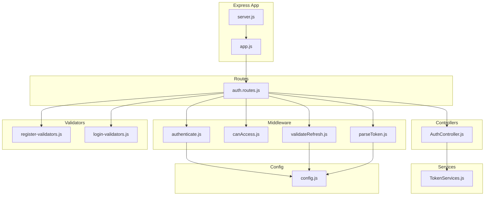

**Diagram sources**
- [app.js:1-40](file://src/app.js#L1-L40)
- [server.js:1-21](file://src/server.js#L1-L21)
- [auth.routes.js:1-49](file://src/routes/auth.routes.js#L1-L49)
- [AuthController.js:1-212](file://src/controllers/AuthController.js#L1-L212)
- [authenticate.js:1-26](file://src/middleware/authenticate.js#L1-L26)
- [canAccess.js:1-23](file://src/middleware/canAccess.js#L1-L23)
- [parseToken.js:1-14](file://src/middleware/parseToken.js#L1-L14)
- [validateRefresh.js:1-34](file://src/middleware/validateRefresh.js#L1-L34)
- [TokenServices.js:1-60](file://src/services/TokenServices.js#L1-L60)
- [config.js:1-34](file://src/config/config.js#L1-L34)
- [register-validators.js:1-47](file://src/validators/register-validators.js#L1-L47)
- [login-validators.js:1-25](file://src/validators/login-validators.js#L1-L25)

**Section sources**
- [app.js:1-40](file://src/app.js#L1-L40)
- [server.js:1-21](file://src/server.js#L1-L21)

## Core Components
- Authentication middleware: Validates access tokens using RS256 with JWKS-based secret caching and supports token extraction from Authorization header or cookies.
- Authorization middleware: Enforces role-based access control by checking the authenticated user’s role against allowed roles.
- Refresh token parsing middleware: Parses refresh tokens using HS256 from cookies.
- Refresh token validation middleware: Validates refresh tokens against persisted records to detect revocation.
- Request validation middleware: Uses schema-based validators for registration and login endpoints.
- Error handling middleware: Centralized error handler that logs and responds with structured error objects.

**Section sources**
- [authenticate.js:1-26](file://src/middleware/authenticate.js#L1-L26)
- [canAccess.js:1-23](file://src/middleware/canAccess.js#L1-L23)
- [parseToken.js:1-14](file://src/middleware/parseToken.js#L1-L14)
- [validateRefresh.js:1-34](file://src/middleware/validateRefresh.js#L1-L34)
- [register-validators.js:1-47](file://src/validators/register-validators.js#L1-L47)
- [login-validators.js:1-25](file://src/validators/login-validators.js#L1-L25)
- [app.js:23-37](file://src/app.js#L23-L37)

## Architecture Overview
The middleware system integrates with Express routing and controller actions. Authentication and authorization occur before controller logic, while validation occurs prior to controller invocation. Error handling is centralized.

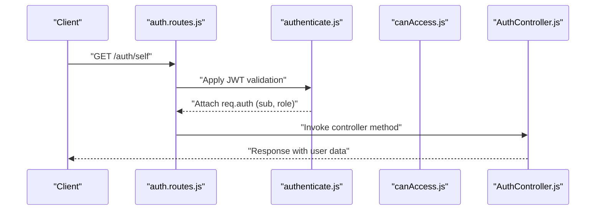

**Diagram sources**
- [auth.routes.js:37-39](file://src/routes/auth.routes.js#L37-L39)
- [authenticate.js:6-25](file://src/middleware/authenticate.js#L6-L25)
- [AuthController.js:138-141](file://src/controllers/AuthController.js#L138-L141)

## Detailed Component Analysis

### Authentication Middleware (JWT Validation)
Purpose:
- Validates access tokens using RS256 with JWKS-based secret caching and rate limiting.
- Extracts tokens from Authorization header or cookies.

Key behaviors:
- Secret source: JWKS URI configured via environment variables with caching enabled.
- Token extraction: Prefers Authorization: Bearer <token>; falls back to cookie accessToken.
- Algorithm: RS256 enforced.

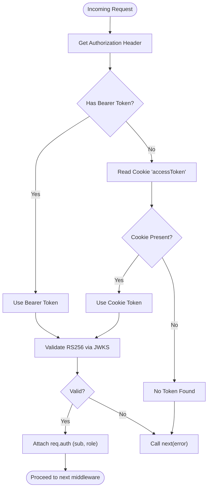

**Diagram sources**
- [authenticate.js:6-25](file://src/middleware/authenticate.js#L6-L25)

**Section sources**
- [authenticate.js:1-26](file://src/middleware/authenticate.js#L1-L26)
- [config.js:11-33](file://src/config/config.js#L11-L33)

### Authorization Middleware (Role-Based Access Control)
Purpose:
- Enforces role-based access by comparing the authenticated user’s role with allowed roles.

Key behaviors:
- Reads role from req.auth.role.
- Rejects requests with 403 if role is not included in allowedRoles.
- Calls next() if authorized.

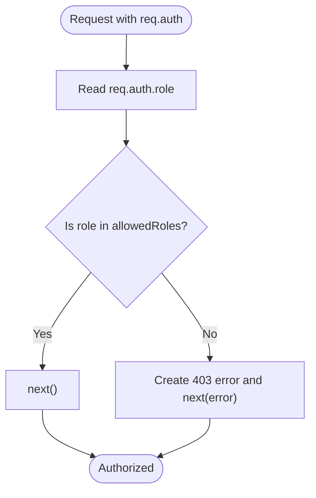

**Diagram sources**
- [canAccess.js:4-22](file://src/middleware/canAccess.js#L4-L22)

**Section sources**
- [canAccess.js:1-23](file://src/middleware/canAccess.js#L1-L23)
- [index.js:1-6](file://src/constants/index.js#L1-L6)

### Refresh Token Parsing Middleware
Purpose:
- Parses refresh tokens from cookies using HS256.

Key behaviors:
- Extracts refreshToken from cookies.
- Uses PRIVATE_KEY_SECRET from configuration.

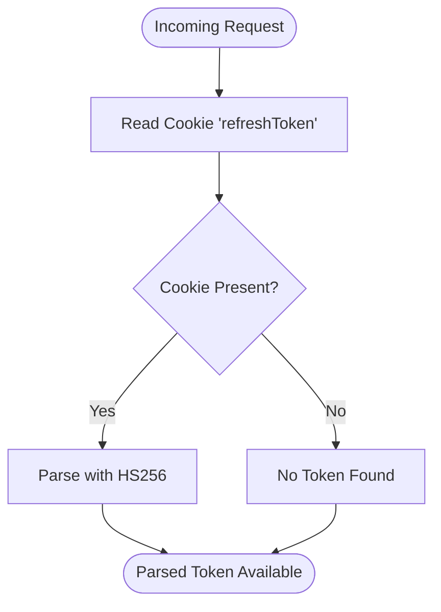

**Diagram sources**
- [parseToken.js:4-13](file://src/middleware/parseToken.js#L4-L13)

**Section sources**
- [parseToken.js:1-14](file://src/middleware/parseToken.js#L1-L14)
- [config.js:19-20](file://src/config/config.js#L19-L20)

### Refresh Token Validation Middleware
Purpose:
- Validates refresh tokens against persisted records to detect revocation.

Key behaviors:
- Extracts token from cookies.
- Checks revocation by querying the RefreshToken entity using token ID and user ID.
- Returns revoked if record not found; logs errors on exceptions.

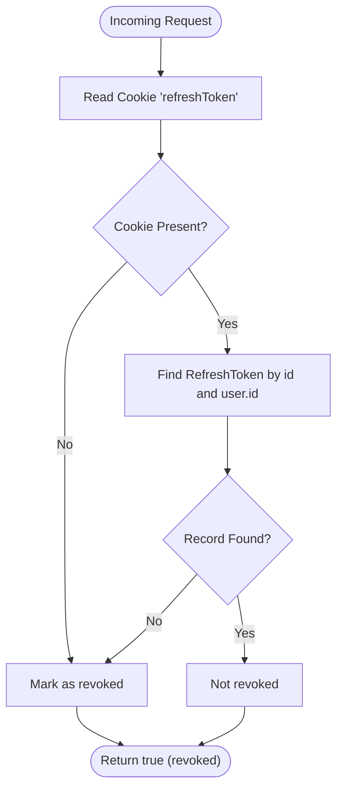

**Diagram sources**
- [validateRefresh.js:7-31](file://src/middleware/validateRefresh.js#L7-L31)
- [RefreshToken.js:1-35](file://src/entity/RefreshToken.js#L1-L35)

**Section sources**
- [validateRefresh.js:1-34](file://src/middleware/validateRefresh.js#L1-L34)
- [RefreshToken.js:1-35](file://src/entity/RefreshToken.js#L1-L35)

### Validation Middleware (Request Parameter Validation)
Purpose:
- Validates request body fields using schema-based validators for registration and login.

Key behaviors:
- Registration validator enforces name/email/password constraints.
- Login validator enforces email/password constraints.
- Validation results are checked in controllers; empty results proceed, otherwise 400 is returned.

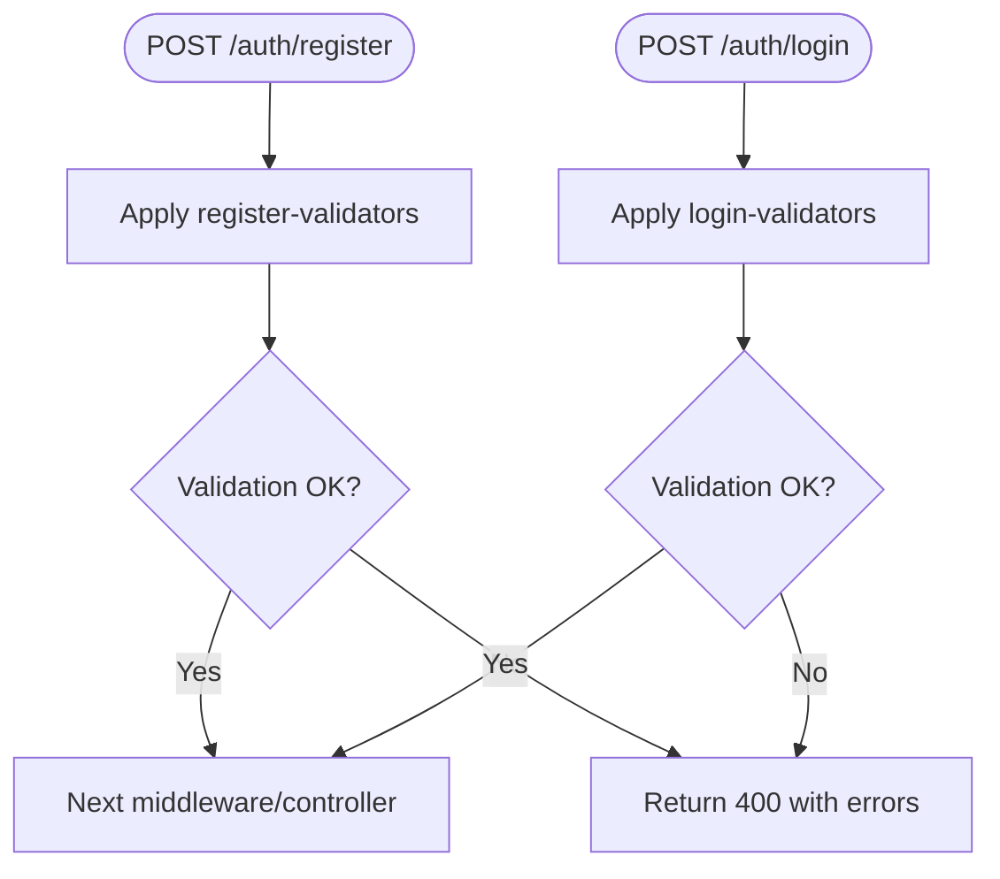

**Diagram sources**
- [register-validators.js:1-47](file://src/validators/register-validators.js#L1-L47)
- [login-validators.js:1-25](file://src/validators/login-validators.js#L1-L25)
- [AuthController.js:19-26](file://src/controllers/AuthController.js#L19-L26)
- [AuthController.js:72-79](file://src/controllers/AuthController.js#L72-L79)

**Section sources**
- [register-validators.js:1-47](file://src/validators/register-validators.js#L1-L47)
- [login-validators.js:1-25](file://src/validators/login-validators.js#L1-L25)
- [AuthController.js:19-26](file://src/controllers/AuthController.js#L19-L26)
- [AuthController.js:72-79](file://src/controllers/AuthController.js#L72-L79)

### Middleware Chain Processing Examples
Example 1: GET /auth/self
- Route applies authentication middleware before invoking the controller.
- Controller reads user by req.auth.sub.

Example 2: POST /auth/logout
- Route applies refresh token parsing middleware before invoking the controller.
- Controller deletes refresh token and clears cookies.

Example 3: POST /auth/refresh
- Route applies refresh token validation middleware before invoking the controller.
- Controller rotates tokens and persists new refresh token.

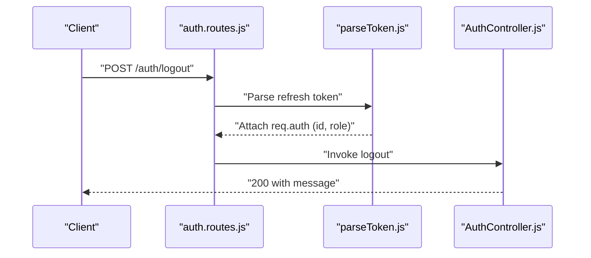

**Diagram sources**
- [auth.routes.js:44-46](file://src/routes/auth.routes.js#L44-L46)
- [parseToken.js:4-13](file://src/middleware/parseToken.js#L4-L13)
- [AuthController.js:194-210](file://src/controllers/AuthController.js#L194-L210)

**Section sources**
- [auth.routes.js:37-46](file://src/routes/auth.routes.js#L37-L46)
- [AuthController.js:138-141](file://src/controllers/AuthController.js#L138-L141)
- [AuthController.js:194-210](file://src/controllers/AuthController.js#L194-L210)

### Custom Middleware Development
Patterns demonstrated in the codebase:
- Higher-order middleware returning a function with signature (req, res, next).
- Using req.auth populated by JWT middleware for downstream decisions.
- Leveraging configuration for secrets and algorithms.
- Integrating with repositories/entities for persistence checks.

Guidelines:
- Keep middleware single-purpose and composable.
- Use configuration for environment-specific values.
- Propagate errors via next(error) to central error handler.
- Attach validated data to req for downstream consumption.

**Section sources**
- [canAccess.js:4-22](file://src/middleware/canAccess.js#L4-L22)
- [config.js:19-33](file://src/config/config.js#L19-L33)
- [validateRefresh.js:14-30](file://src/middleware/validateRefresh.js#L14-L30)

## Dependency Analysis
The middleware system depends on:
- Express for routing and middleware composition
- express-jwt and jwks-rsa for JWT validation and JWKS caching
- http-errors for standardized error creation
- TypeORM entities and repositories for refresh token persistence
- Environment configuration for secrets and URIs

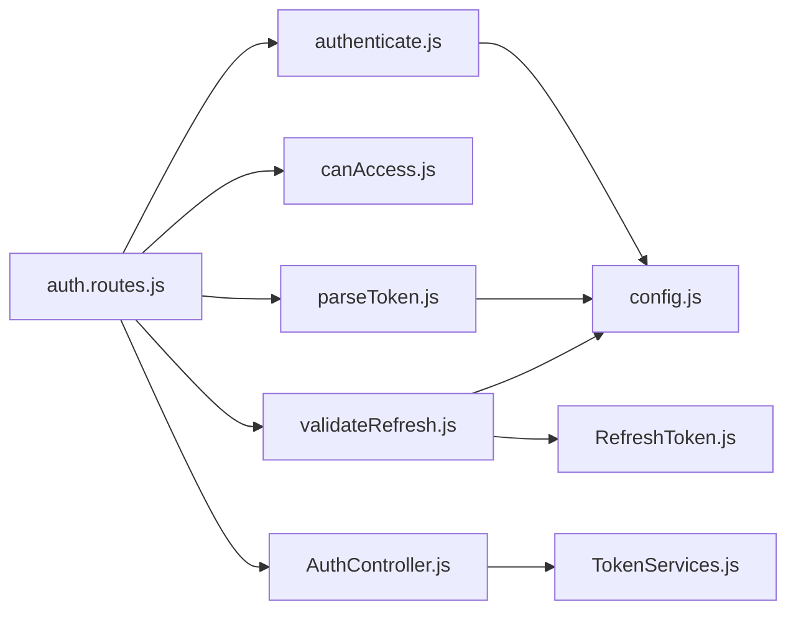

**Diagram sources**
- [auth.routes.js:12-14](file://src/routes/auth.routes.js#L12-L14)
- [authenticate.js:1-3](file://src/middleware/authenticate.js#L1-L3)
- [validateRefresh.js:1-5](file://src/middleware/validateRefresh.js#L1-L5)
- [parseToken.js:1-2](file://src/middleware/parseToken.js#L1-L2)
- [config.js:19-33](file://src/config/config.js#L19-L33)
- [RefreshToken.js:1-35](file://src/entity/RefreshToken.js#L1-L35)
- [AuthController.js:1-16](file://src/controllers/AuthController.js#L1-L16)
- [TokenServices.js:1-11](file://src/services/TokenServices.js#L1-L11)

**Section sources**
- [auth.routes.js:12-14](file://src/routes/auth.routes.js#L12-L14)
- [authenticate.js:1-3](file://src/middleware/authenticate.js#L1-L3)
- [validateRefresh.js:1-5](file://src/middleware/validateRefresh.js#L1-L5)
- [parseToken.js:1-2](file://src/middleware/parseToken.js#L1-L2)
- [config.js:19-33](file://src/config/config.js#L19-L33)
- [RefreshToken.js:1-35](file://src/entity/RefreshToken.js#L1-L35)
- [AuthController.js:1-16](file://src/controllers/AuthController.js#L1-L16)
- [TokenServices.js:1-11](file://src/services/TokenServices.js#L1-L11)

## Performance Considerations
- JWKS caching: Enabled in authentication middleware to reduce network calls and improve latency.
- Rate limiting: Enabled for JWKS secret retrieval to prevent abuse.
- Algorithm enforcement: RS256 ensures strong cryptographic validation.
- Cookie-based tokens: Reduce header overhead for refresh tokens.
- Centralized error handling: Prevents redundant error handling logic and improves consistency.

Recommendations:
- Monitor JWKS cache hit rates and tune cache settings.
- Consider short-lived access tokens and robust refresh token lifecycle management.
- Add request timeouts and circuit breakers for external dependencies (e.g., JWKS).
- Use structured logging to track middleware execution times.

**Section sources**
- [authenticate.js:7-11](file://src/middleware/authenticate.js#L7-L11)
- [validateRefresh.js:14-30](file://src/middleware/validateRefresh.js#L14-L30)

## Troubleshooting Guide
Common issues and resolutions:
- Missing or malformed Authorization header: Ensure Bearer token is present; fallback to cookie token is supported.
- Role mismatch leading to 403: Verify allowed roles and user role attached to req.auth.
- Revoked refresh token: Confirm token exists in refreshTokens table and is not deleted.
- Validation errors: Inspect validator messages and ensure request body conforms to schema.
- Centralized error response: Review error handler logs and response format.

Debugging tips:
- Log req.auth contents after authentication middleware.
- Enable logging in refresh token validation to capture lookup failures.
- Use structured logs for error tracking and correlation IDs.

**Section sources**
- [app.js:23-37](file://src/app.js#L23-L37)
- [canAccess.js:10-17](file://src/middleware/canAccess.js#L10-L17)
- [validateRefresh.js:14-30](file://src/middleware/validateRefresh.js#L14-L30)
- [AuthController.js:19-26](file://src/controllers/AuthController.js#L19-L26)
- [AuthController.js:72-79](file://src/controllers/AuthController.js#L72-L79)

## Conclusion
The middleware system provides a clear, modular foundation for authentication, authorization, and validation. It leverages industry-standard libraries, centralized configuration, and a consistent error-handling pattern. By following the patterns shown here, developers can extend the system with additional middleware while maintaining performance, security, and maintainability.

## Appendices

### Middleware Order and Execution Flow
Typical flow:
1. Validation middleware runs first to sanitize and validate inputs.
2. Authentication middleware validates the access token and attaches user info.
3. Authorization middleware enforces role-based permissions.
4. Controller handles business logic using req.auth and validated inputs.
5. Centralized error handler standardizes error responses.

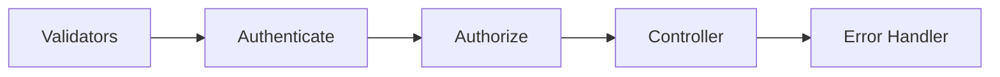

**Diagram sources**
- [register-validators.js:1-47](file://src/validators/register-validators.js#L1-L47)
- [login-validators.js:1-25](file://src/validators/login-validators.js#L1-L25)
- [authenticate.js:6-25](file://src/middleware/authenticate.js#L6-L25)
- [canAccess.js:4-22](file://src/middleware/canAccess.js#L4-L22)
- [app.js:23-37](file://src/app.js#L23-L37)

### Token Generation and Persistence
- Access tokens: RS256 signed with a private key, short-lived.
- Refresh tokens: HS256 signed with a shared secret, persisted in the database, rotated on refresh.

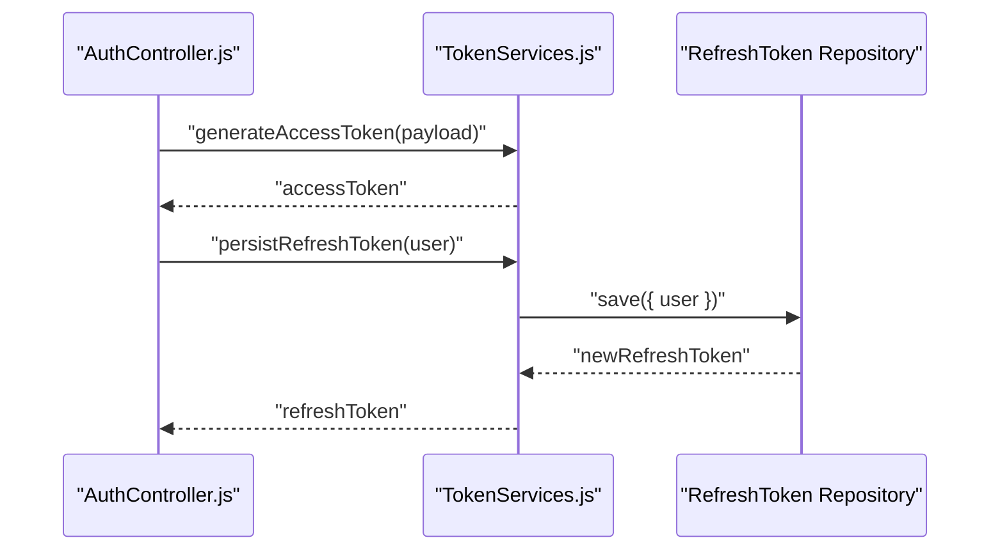

**Diagram sources**
- [AuthController.js:42-47](file://src/controllers/AuthController.js#L42-L47)
- [TokenServices.js:12-43](file://src/services/TokenServices.js#L12-L43)
- [TokenServices.js:45-52](file://src/services/TokenServices.js#L45-L52)