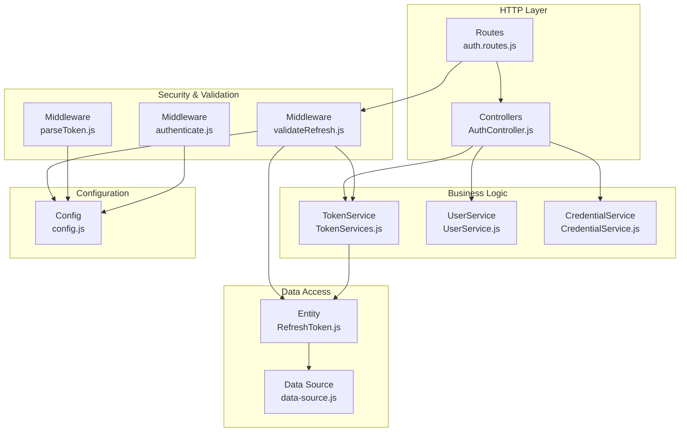
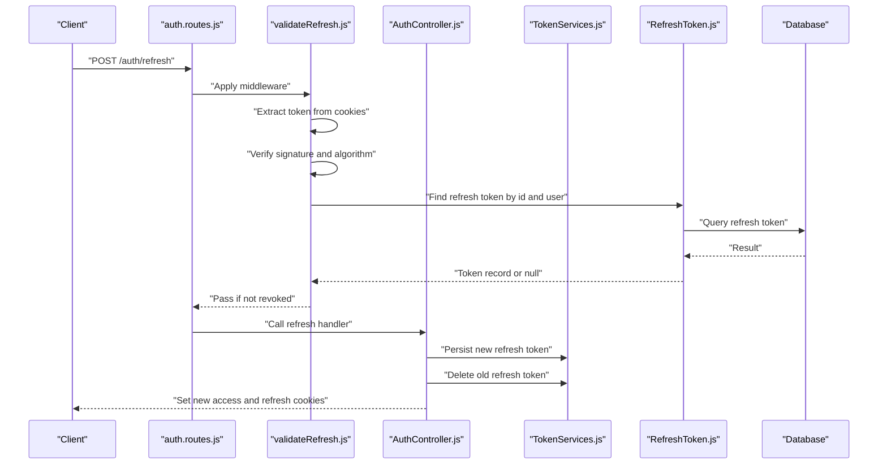
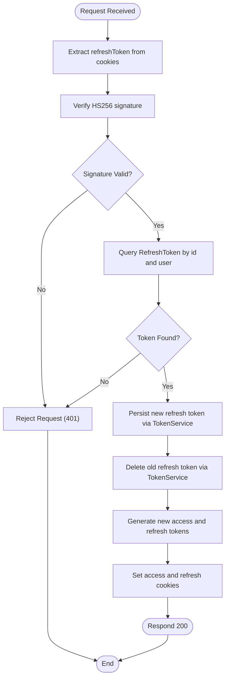
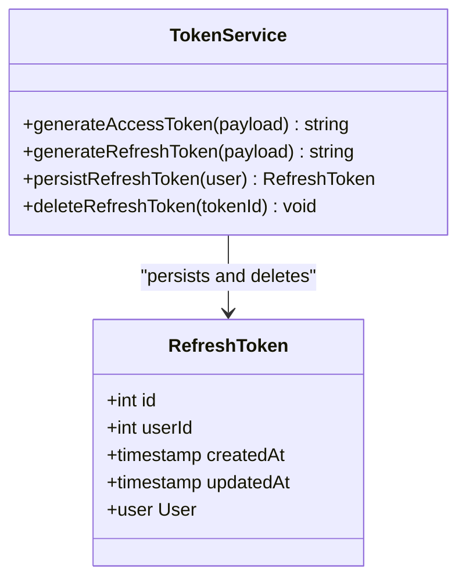
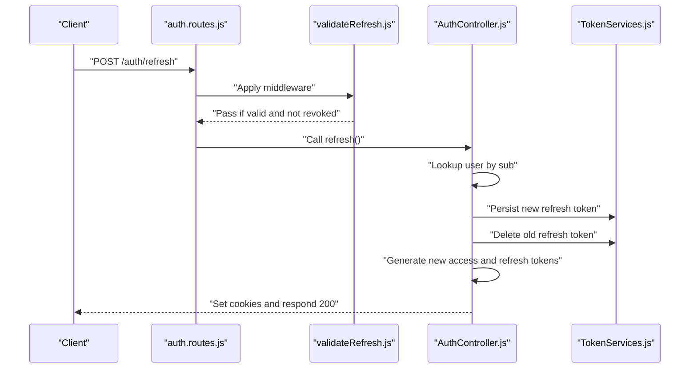
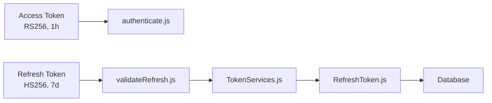
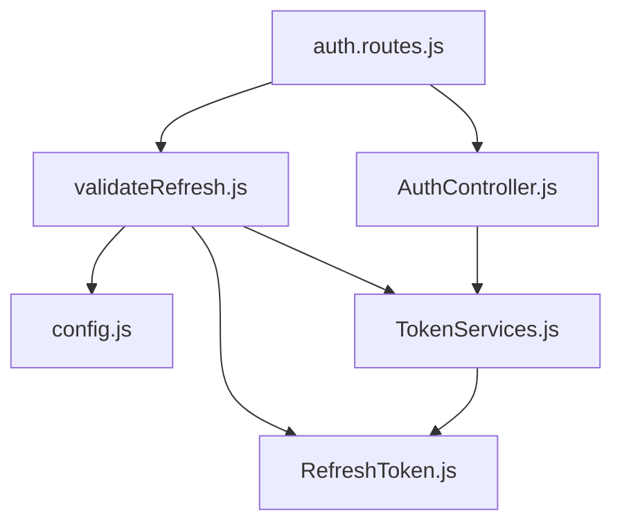

# Token Validation Middleware

<cite>
**Referenced Files in This Document**
- [validateRefresh.js](file://src/middleware/validateRefresh.js)
- [AuthController.js](file://src/controllers/AuthController.js)
- [TokenServices.js](file://src/services/TokenServices.js)
- [RefreshToken.js](file://src/entity/RefreshToken.js)
- [auth.routes.js](file://src/routes/auth.routes.js)
- [authenticate.js](file://src/middleware/authenticate.js)
- [parseToken.js](file://src/middleware/parseToken.js)
- [config.js](file://src/config/config.js)
- [app.js](file://src/app.js)
- [refresh.spec.js](file://src/test/users/refresh.spec.js)
- [login.spec.js](file://src/test/users/login.spec.js)
- [register.spec.js](file://src/test/users/register.spec.js)
- [index.js](file://src/constants/index.js)
- [utils.js](file://src/utils/utils.js)
</cite>

## Table of Contents
1. [Introduction](#introduction)
2. [Project Structure](#project-structure)
3. [Core Components](#core-components)
4. [Architecture Overview](#architecture-overview)
5. [Detailed Component Analysis](#detailed-component-analysis)
6. [Dependency Analysis](#dependency-analysis)
7. [Performance Considerations](#performance-considerations)
8. [Troubleshooting Guide](#troubleshooting-guide)
9. [Conclusion](#conclusion)

## Introduction
This document provides comprehensive documentation for the refresh token validation middleware in the authentication service. It explains the refresh token lifecycle management, validation process, token verification logic, expiration handling, and security checks. It also details the relationship between access tokens and refresh tokens in the authentication flow, provides practical examples of refresh token validation in the token refresh endpoint, documents error handling for invalid refresh tokens, expired refresh tokens, and token tampering detection, and addresses security considerations for refresh token storage and transmission. Finally, it includes a troubleshooting guide for refresh token-related issues and debugging techniques.

## Project Structure
The authentication service follows a layered architecture with clear separation of concerns:
- Routes define HTTP endpoints and apply middleware for authentication and validation.
- Controllers handle request-response logic and coordinate between services.
- Services encapsulate business logic for token generation, persistence, and deletion.
- Middleware validates JWT tokens and manages token revocation checks.
- Entities define the data model for refresh tokens and users.
- Configuration provides environment-specific settings for secrets and URIs.
- Tests validate the refresh token flow and error scenarios.

**Diagram sources**
- [auth.routes.js:1-49](file://src/routes/auth.routes.js#L1-L49)
- [AuthController.js:1-212](file://src/controllers/AuthController.js#L1-L212)
- [TokenServices.js:1-60](file://src/services/TokenServices.js#L1-L60)
- [validateRefresh.js:1-34](file://src/middleware/validateRefresh.js#L1-L34)
- [parseToken.js:1-14](file://src/middleware/parseToken.js#L1-L14)
- [authenticate.js:1-26](file://src/middleware/authenticate.js#L1-L26)
- [RefreshToken.js:1-35](file://src/entity/RefreshToken.js#L1-L35)
- [config.js:1-34](file://src/config/config.js#L1-L34)

**Section sources**
- [auth.routes.js:1-49](file://src/routes/auth.routes.js#L1-L49)
- [app.js:1-40](file://src/app.js#L1-L40)

## Core Components
This section focuses on the refresh token validation middleware and its integration with the broader authentication flow.

- Refresh Token Validation Middleware (`validateRefresh.js`): Implements JWT validation for refresh tokens using HS256 with a shared secret. It extracts the token from cookies, verifies signature and algorithm, and checks revocation status against the database.
- Token Services (`TokenServices.js`): Provides methods for generating access tokens (RS256) and refresh tokens (HS256), persisting refresh tokens to the database, and deleting them upon logout or rotation.
- Authentication Controller (`AuthController.js`): Handles registration, login, refresh, and logout endpoints. It coordinates token generation, cookie setting, and user lookup.
- Route Configuration (`auth.routes.js`): Defines the `/auth/refresh` endpoint and applies the `validateRefresh` middleware before invoking the controller’s refresh handler.
- Refresh Token Entity (`RefreshToken.js`): Defines the refresh token table schema and its relationship to the User entity.
- Configuration (`config.js`): Exposes environment variables for secrets and JWKS URI used by middleware and services.

Key responsibilities:
- Validate refresh tokens from cookies.
- Verify token signature and algorithm.
- Check revocation status by querying persisted refresh tokens.
- Coordinate token rotation on successful refresh.
- Handle logout by deleting refresh tokens.

**Section sources**
- [validateRefresh.js:1-34](file://src/middleware/validateRefresh.js#L1-L34)
- [TokenServices.js:1-60](file://src/services/TokenServices.js#L1-L60)
- [AuthController.js:143-192](file://src/controllers/AuthController.js#L143-L192)
- [auth.routes.js:41-42](file://src/routes/auth.routes.js#L41-L42)
- [RefreshToken.js:1-35](file://src/entity/RefreshToken.js#L1-L35)
- [config.js:11-33](file://src/config/config.js#L11-L33)

## Architecture Overview
The refresh token validation middleware sits between the HTTP route and the controller, ensuring that only valid, unrevoked refresh tokens can trigger a token refresh. The flow integrates with the token services for persistence and deletion, and with the data source for database queries.

**Diagram sources**
- [auth.routes.js:41-42](file://src/routes/auth.routes.js#L41-L42)
- [validateRefresh.js:7-31](file://src/middleware/validateRefresh.js#L7-L31)
- [AuthController.js:143-192](file://src/controllers/AuthController.js#L143-L192)
- [TokenServices.js:45-58](file://src/services/TokenServices.js#L45-L58)
- [RefreshToken.js:1-35](file://src/entity/RefreshToken.js#L1-L35)

## Detailed Component Analysis

### Refresh Token Validation Middleware
The middleware uses `express-jwt` configured for HS256 with a shared secret. It:
- Extracts the refresh token from the `refreshToken` cookie.
- Verifies the token signature and algorithm.
- Checks revocation status by querying the refresh token repository using the token payload fields `id` and `sub`.

**Diagram sources**
- [validateRefresh.js:10-31](file://src/middleware/validateRefresh.js#L10-L31)
- [AuthController.js:143-192](file://src/controllers/AuthController.js#L143-L192)
- [TokenServices.js:45-58](file://src/services/TokenServices.js#L45-L58)

**Section sources**
- [validateRefresh.js:1-34](file://src/middleware/validateRefresh.js#L1-L34)

### Token Generation and Rotation
Token services manage:
- Access tokens: RS256 signed with a private key, short-lived (1 hour).
- Refresh tokens: HS256 signed with a shared secret, long-lived (7 days), with a JWT ID set to the database-generated token ID.

**Diagram sources**
- [TokenServices.js:8-59](file://src/services/TokenServices.js#L8-L59)
- [RefreshToken.js:3-34](file://src/entity/RefreshToken.js#L3-L34)

**Section sources**
- [TokenServices.js:12-43](file://src/services/TokenServices.js#L12-L43)
- [TokenServices.js:45-58](file://src/services/TokenServices.js#L45-L58)

### Refresh Endpoint Workflow
The `/auth/refresh` endpoint applies the `validateRefresh` middleware, then:
- Validates the token and ensures the associated user exists.
- Persists a new refresh token and deletes the old one (token rotation).
- Generates new access and refresh tokens and sets them as cookies.

**Diagram sources**
- [auth.routes.js:41-42](file://src/routes/auth.routes.js#L41-L42)
- [validateRefresh.js:14-30](file://src/middleware/validateRefresh.js#L14-L30)
- [AuthController.js:143-192](file://src/controllers/AuthController.js#L143-L192)
- [TokenServices.js:45-58](file://src/services/TokenServices.js#L45-L58)

**Section sources**
- [auth.routes.js:41-42](file://src/routes/auth.routes.js#L41-L42)
- [AuthController.js:143-192](file://src/controllers/AuthController.js#L143-L192)

### Relationship Between Access Tokens and Refresh Tokens
- Access tokens are short-lived and validated by the `authenticate` middleware using RS256 with a JWKS-based secret.
- Refresh tokens are long-lived, validated by the `validateRefresh` middleware using HS256 with a shared secret.
- On successful refresh, the old refresh token is revoked by deleting it from the database, and a new refresh token is persisted.

**Diagram sources**
- [authenticate.js:6-25](file://src/middleware/authenticate.js#L6-L25)
- [validateRefresh.js:7-31](file://src/middleware/validateRefresh.js#L7-L31)
- [TokenServices.js:45-58](file://src/services/TokenServices.js#L45-L58)
- [RefreshToken.js:1-35](file://src/entity/RefreshToken.js#L1-L35)

**Section sources**
- [authenticate.js:1-26](file://src/middleware/authenticate.js#L1-L26)
- [validateRefresh.js:1-34](file://src/middleware/validateRefresh.js#L1-L34)
- [TokenServices.js:45-58](file://src/services/TokenServices.js#L45-L58)

### Practical Example: Refresh Token Validation in the Token Refresh Endpoint
- The route `/auth/refresh` applies the `validateRefresh` middleware.
- The middleware extracts the token from the `refreshToken` cookie, verifies it, and checks revocation.
- The controller performs token rotation by persisting a new refresh token and deleting the old one.

References:
- Route definition: [auth.routes.js:41-42](file://src/routes/auth.routes.js#L41-L42)
- Middleware logic: [validateRefresh.js:10-31](file://src/middleware/validateRefresh.js#L10-L31)
- Controller refresh handler: [AuthController.js:143-192](file://src/controllers/AuthController.js#L143-L192)

**Section sources**
- [auth.routes.js:41-42](file://src/routes/auth.routes.js#L41-L42)
- [validateRefresh.js:10-31](file://src/middleware/validateRefresh.js#L10-L31)
- [AuthController.js:143-192](file://src/controllers/AuthController.js#L143-L192)

### Error Handling for Refresh Tokens
Common error scenarios and handling:
- Invalid refresh token (missing or malformed): The middleware rejects the request with a 401 Unauthorized.
- Expired refresh token: The middleware rejects the request with a 401 Unauthorized.
- Revoked refresh token: The middleware rejects the request with a 401 Unauthorized.
- User not found: The controller responds with a 400 Bad Request.
- Database errors: Logged and handled by the global error handler.

References:
- Middleware revocation check: [validateRefresh.js:14-30](file://src/middleware/validateRefresh.js#L14-L30)
- Controller user lookup and error handling: [AuthController.js:152-159](file://src/controllers/AuthController.js#L152-L159)
- Global error handler: [app.js:24-37](file://src/app.js#L24-L37)

**Section sources**
- [validateRefresh.js:14-30](file://src/middleware/validateRefresh.js#L14-L30)
- [AuthController.js:152-159](file://src/controllers/AuthController.js#L152-L159)
- [app.js:24-37](file://src/app.js#L24-L37)

### Security Considerations for Refresh Token Storage and Transmission
- Cookies: Both access and refresh tokens are stored in HTTP-only cookies to prevent client-side JavaScript access and reduce XSS risks.
- SameSite: Cookies are set with `SameSite=Strict` to mitigate CSRF attacks.
- Domain: Cookie domain is set to localhost for development; adjust for production environments.
- Secret Management: The shared secret for refresh tokens is loaded from environment variables.
- Token Rotation: Old refresh tokens are deleted upon successful refresh to limit exposure windows.

References:
- Cookie settings in controller: [AuthController.js:50-62](file://src/controllers/AuthController.js#L50-L62), [AuthController.js:115-129](file://src/controllers/AuthController.js#L115-L129), [AuthController.js:171-184](file://src/controllers/AuthController.js#L171-L184)
- Shared secret configuration: [config.js:19-33](file://src/config/config.js#L19-L33)
- Middleware secret usage: [validateRefresh.js:8](file://src/middleware/validateRefresh.js#L8), [parseToken.js:5](file://src/middleware/parseToken.js#L5)

**Section sources**
- [AuthController.js:50-62](file://src/controllers/AuthController.js#L50-L62)
- [AuthController.js:115-129](file://src/controllers/AuthController.js#L115-L129)
- [AuthController.js:171-184](file://src/controllers/AuthController.js#L171-L184)
- [config.js:19-33](file://src/config/config.js#L19-L33)
- [validateRefresh.js:8](file://src/middleware/validateRefresh.js#L8)
- [parseToken.js:5](file://src/middleware/parseToken.js#L5)

## Dependency Analysis
The refresh token validation middleware depends on:
- Configuration for the shared secret.
- The refresh token entity and repository for revocation checks.
- The token service for persistence and deletion operations during rotation.

**Diagram sources**
- [validateRefresh.js:1-34](file://src/middleware/validateRefresh.js#L1-L34)
- [config.js:11-33](file://src/config/config.js#L11-L33)
- [RefreshToken.js:1-35](file://src/entity/RefreshToken.js#L1-L35)
- [TokenServices.js:1-60](file://src/services/TokenServices.js#L1-L60)
- [auth.routes.js:1-49](file://src/routes/auth.routes.js#L1-L49)
- [AuthController.js:1-212](file://src/controllers/AuthController.js#L1-L212)

**Section sources**
- [validateRefresh.js:1-34](file://src/middleware/validateRefresh.js#L1-L34)
- [auth.routes.js:1-49](file://src/routes/auth.routes.js#L1-L49)
- [AuthController.js:1-212](file://src/controllers/AuthController.js#L1-L212)

## Performance Considerations
- Database Query: The middleware performs a single query to check revocation status. Ensure indexing on the refresh token table for optimal performance.
- Token Rotation: Persisting a new refresh token and deleting the old one introduces two write operations. Consider batching or optimizing if high throughput is required.
- Cookie Size: Keep cookie payloads minimal to reduce overhead.

[No sources needed since this section provides general guidance]

## Troubleshooting Guide
Common issues and debugging techniques:
- 401 Unauthorized on refresh:
  - Verify the `refreshToken` cookie is present and not expired.
  - Confirm the shared secret matches the one used to sign the token.
  - Check that the token has not been revoked by verifying the refresh token record exists in the database.
- User Not Found:
  - Ensure the user ID in the token payload corresponds to an existing user.
- Database Connectivity:
  - Confirm the data source is initialized and the refresh token table exists.
- Environment Variables:
  - Verify `PRIVATE_KEY_SECRET` and `JWKS_URI` are set correctly.
- Testing:
  - Use the provided test suite to validate refresh token behavior under various conditions.

References:
- Test suite for refresh token: [refresh.spec.js:18-109](file://src/test/users/refresh.spec.js#L18-L109)
- Test suite for registration and login: [register.spec.js:115-138](file://src/test/users/register.spec.js#L115-L138), [login.spec.js:62-74](file://src/test/users/login.spec.js#L62-L74)
- Utility for JWT validation: [utils.js:13-31](file://src/utils/utils.js#L13-L31)

**Section sources**
- [refresh.spec.js:18-109](file://src/test/users/refresh.spec.js#L18-L109)
- [register.spec.js:115-138](file://src/test/users/register.spec.js#L115-L138)
- [login.spec.js:62-74](file://src/test/users/login.spec.js#L62-L74)
- [utils.js:13-31](file://src/utils/utils.js#L13-L31)

## Conclusion
The refresh token validation middleware provides robust security by validating tokens, enforcing algorithm and signature checks, and verifying revocation status against persisted records. Combined with token rotation and secure cookie practices, it ensures a resilient authentication flow. Proper configuration, testing, and monitoring are essential for maintaining security and reliability.

[No sources needed since this section summarizes without analyzing specific files]