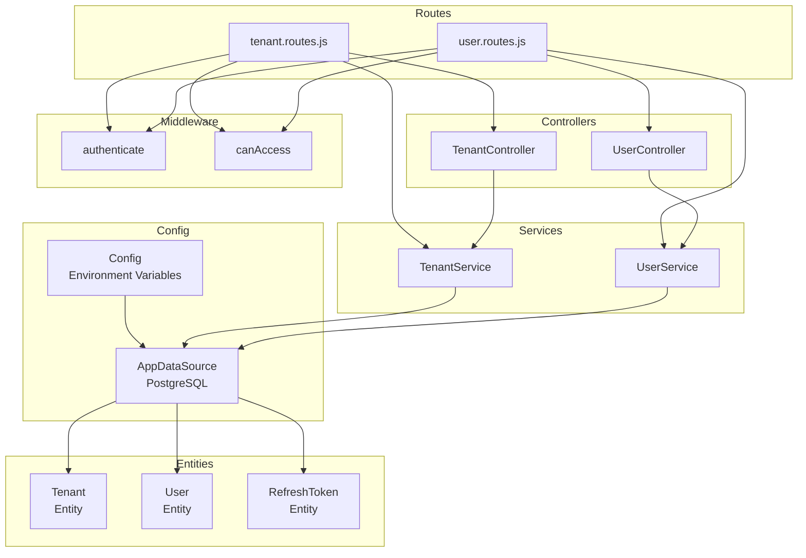
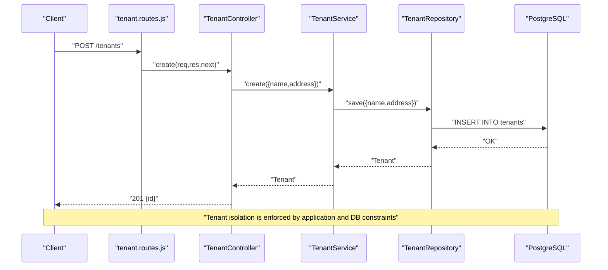
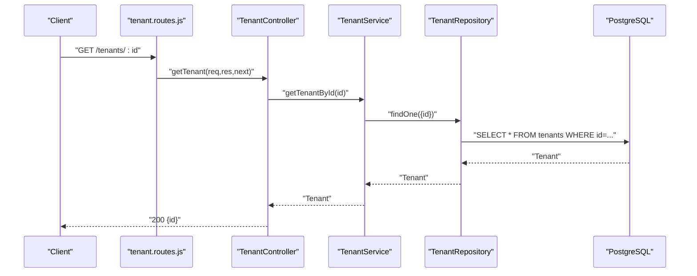
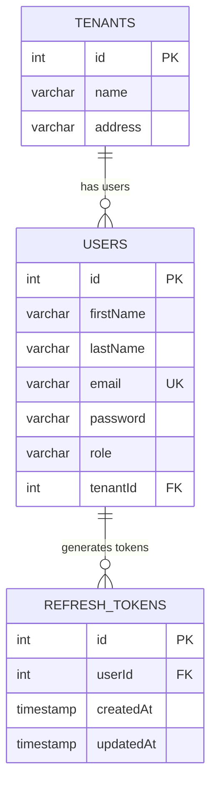
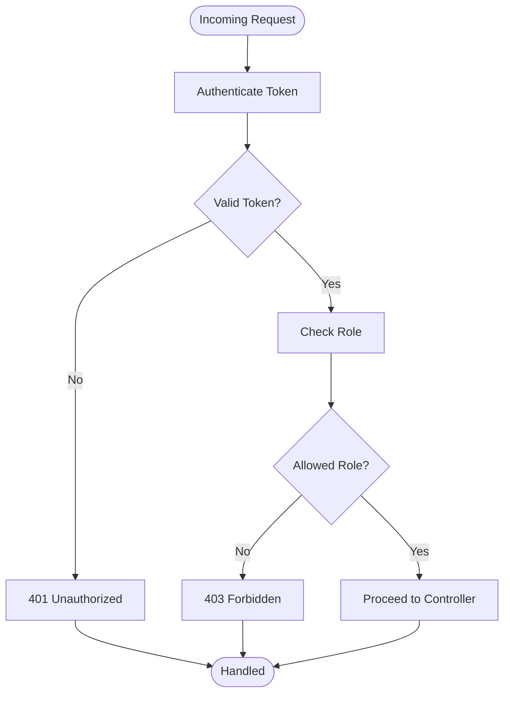
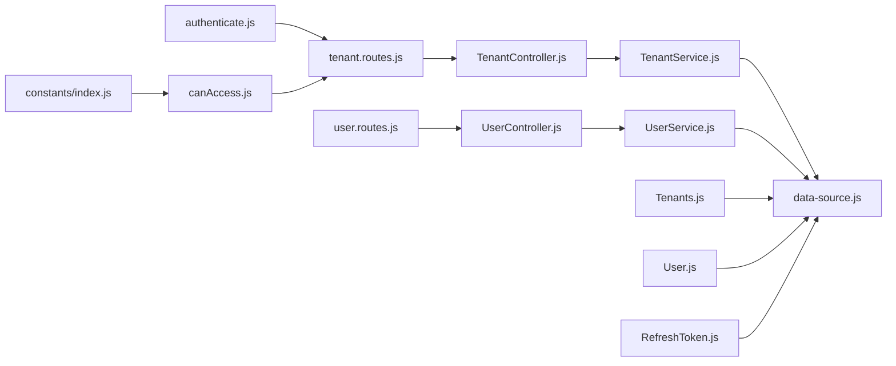

# Multi-Tenant Architecture

<cite>
**Referenced Files in This Document**
- [src/entity/Tenants.js](file://src/entity/Tenants.js)
- [src/entity/User.js](file://src/entity/User.js)
- [src/entity/RefreshToken.js](file://src/entity/RefreshToken.js)
- [src/services/TenantService.js](file://src/services/TenantService.js)
- [src/controllers/TenantController.js](file://src/controllers/TenantController.js)
- [src/routes/tenant.routes.js](file://src/routes/tenant.routes.js)
- [src/services/UserService.js](file://src/services/UserService.js)
- [src/controllers/UserController.js](file://src/controllers/UserController.js)
- [src/middleware/authenticate.js](file://src/middleware/authenticate.js)
- [src/middleware/canAccess.js](file://src/middleware/canAccess.js)
- [src/constants/index.js](file://src/constants/index.js)
- [src/config/data-source.js](file://src/config/data-source.js)
- [src/config/config.js](file://src/config/config.js)
- [src/migration/1773678089909-create_tenant_table.js](file://src/migration/1773678089909-create_tenant_table.js)
- [src/migration/1773678973384-add_FK_tenant_table_and_to_user_table.js](file://src/migration/1773678973384-add_FK_tenant_table_and_to_user_table.js)
- [src/migration/1773681570855-add_nullable_field_to_tenantID.js](file://src/migration/1773681570855-add_nullable_field_to_tenantID.js)
- [src/test/tenant/create.spec.js](file://src/test/tenant/create.spec.js)
</cite>

## Table of Contents
1. [Introduction](#introduction)
2. [Project Structure](#project-structure)
3. [Core Components](#core-components)
4. [Architecture Overview](#architecture-overview)
5. [Detailed Component Analysis](#detailed-component-analysis)
6. [Dependency Analysis](#dependency-analysis)
7. [Performance Considerations](#performance-considerations)
8. [Troubleshooting Guide](#troubleshooting-guide)
9. [Conclusion](#conclusion)
10. [Appendices](#appendices)

## Introduction
This document explains the multi-tenant architecture implemented in the authentication service. It covers the tenant concept, design principles for data isolation, tenant management operations, the relationship between tenants and users, enforcement of tenant isolation across application layers, tenant-aware query patterns, tenant-specific configurations, and security considerations.

## Project Structure
The multi-tenant implementation centers around three core entities: Tenant, User, and RefreshToken. Controllers and services encapsulate business logic, while routes define the API surface guarded by authentication and authorization middleware. TypeORM migrations establish and evolve the relational schema, including foreign keys linking users to tenants.

**Diagram sources**
- [src/config/data-source.js:8-21](file://src/config/data-source.js#L8-L21)
- [src/entity/Tenants.js:3-28](file://src/entity/Tenants.js#L3-L28)
- [src/entity/User.js:3-49](file://src/entity/User.js#L3-L49)
- [src/entity/RefreshToken.js:3-34](file://src/entity/RefreshToken.js#L3-L34)
- [src/routes/tenant.routes.js:11-44](file://src/routes/tenant.routes.js#L11-L44)
- [src/controllers/TenantController.js:3-75](file://src/controllers/TenantController.js#L3-L75)
- [src/services/TenantService.js:3-65](file://src/services/TenantService.js#L3-L65)
- [src/controllers/UserController.js:4-94](file://src/controllers/UserController.js#L4-L94)
- [src/services/UserService.js:3-85](file://src/services/UserService.js#L3-L85)
- [src/middleware/authenticate.js:6-25](file://src/middleware/authenticate.js#L6-L25)
- [src/middleware/canAccess.js:4-17](file://src/middleware/canAccess.js#L4-L17)

**Section sources**
- [src/config/data-source.js:8-21](file://src/config/data-source.js#L8-L21)
- [src/config/config.js:23-33](file://src/config/config.js#L23-L33)
- [src/entity/Tenants.js:3-28](file://src/entity/Tenants.js#L3-L28)
- [src/entity/User.js:3-49](file://src/entity/User.js#L3-L49)
- [src/entity/RefreshToken.js:3-34](file://src/entity/RefreshToken.js#L3-L34)
- [src/routes/tenant.routes.js:11-44](file://src/routes/tenant.routes.js#L11-L44)

## Core Components
- Tenant entity defines tenant metadata and a one-to-many relation to users.
- User entity holds user attributes and a many-to-one relation to Tenant via tenantId.
- RefreshToken entity links refresh tokens to users.
- TenantController exposes endpoints for tenant CRUD with authentication and role checks.
- TenantService encapsulates persistence operations for tenants.
- UserService handles user creation and updates, including optional tenant association.
- Routes bind controllers to endpoints and apply middleware for auth and authorization.
- Middleware enforces JWT validation and role-based access control.
- Data source configures PostgreSQL connectivity and loads entities and migrations.

**Section sources**
- [src/entity/Tenants.js:3-28](file://src/entity/Tenants.js#L3-L28)
- [src/entity/User.js:3-49](file://src/entity/User.js#L3-L49)
- [src/entity/RefreshToken.js:3-34](file://src/entity/RefreshToken.js#L3-L34)
- [src/controllers/TenantController.js:3-75](file://src/controllers/TenantController.js#L3-L75)
- [src/services/TenantService.js:3-65](file://src/services/TenantService.js#L3-L65)
- [src/controllers/UserController.js:4-94](file://src/controllers/UserController.js#L4-L94)
- [src/services/UserService.js:3-85](file://src/services/UserService.js#L3-L85)
- [src/middleware/authenticate.js:6-25](file://src/middleware/authenticate.js#L6-L25)
- [src/middleware/canAccess.js:4-17](file://src/middleware/canAccess.js#L4-L17)
- [src/config/data-source.js:8-21](file://src/config/data-source.js#L8-L21)

## Architecture Overview
The system enforces multi-tenancy primarily through:
- Database-level foreign key constraints linking users to tenants.
- Application-layer middleware validating tokens and roles.
- Controllers and services operating on tenant-scoped resources.

**Diagram sources**
- [src/routes/tenant.routes.js:16-21](file://src/routes/tenant.routes.js#L16-L21)
- [src/controllers/TenantController.js:11-22](file://src/controllers/TenantController.js#L11-L22)
- [src/services/TenantService.js:7-14](file://src/services/TenantService.js#L7-L14)
- [src/config/data-source.js:12-18](file://src/config/data-source.js#L12-L18)

## Detailed Component Analysis

### Tenant Management Operations
- Creation: POST /tenants requires authentication and ADMIN role. The controller delegates to the service, which persists the tenant and returns its identifier.
- Retrieval: GET /tenants lists all tenants; GET /tenants/:id fetches a specific tenant by ID.
- Update: POST /tenants/:id updates tenant metadata with ADMIN role.
- Deletion: DELETE /tenants/:id deletes a tenant after confirming existence.

**Diagram sources**
- [src/routes/tenant.routes.js:23-28](file://src/routes/tenant.routes.js#L23-L28)
- [src/controllers/TenantController.js:34-48](file://src/controllers/TenantController.js#L34-L48)
- [src/services/TenantService.js:25-32](file://src/services/TenantService.js#L25-L32)

**Section sources**
- [src/controllers/TenantController.js:11-75](file://src/controllers/TenantController.js#L11-L75)
- [src/services/TenantService.js:7-65](file://src/services/TenantService.js#L7-L65)
- [src/routes/tenant.routes.js:16-42](file://src/routes/tenant.routes.js#L16-L42)

### Tenant-User Relationship and Data Access Patterns
- The User entity declares a many-to-one relation to Tenant via tenantId. The initial migration sets tenantId as NOT NULL and adds a foreign key constraint. Subsequent migrations relaxed the constraint to allow NULL, enabling users without tenants.
- The Tenant entity defines a one-to-many relation to User, enabling tenant-level enumeration of users.
- User creation accepts an optional tenantId; updates support changing tenant association.

**Diagram sources**
- [src/entity/Tenants.js:3-28](file://src/entity/Tenants.js#L3-L28)
- [src/entity/User.js:3-49](file://src/entity/User.js#L3-L49)
- [src/entity/RefreshToken.js:3-34](file://src/entity/RefreshToken.js#L3-L34)
- [src/migration/1773678089909-create_tenant_table.js:17-19](file://src/migration/1773678089909-create_tenant_table.js#L17-L19)
- [src/migration/1773678973384-add_FK_tenant_table_and_to_user_table.js:18-23](file://src/migration/1773678973384-add_FK_tenant_table_and_to_user_table.js#L18-L23)
- [src/migration/1773681570855-add_nullable_field_to_tenantID.js:17-19](file://src/migration/1773681570855-add_nullable_field_to_tenantID.js#L17-L19)

**Section sources**
- [src/entity/User.js:30-48](file://src/entity/User.js#L30-L48)
- [src/entity/Tenants.js:21-27](file://src/entity/Tenants.js#L21-L27)
- [src/migration/1773678089909-create_tenant_table.js:17-19](file://src/migration/1773678089909-create_tenant_table.js#L17-L19)
- [src/migration/1773678973384-add_FK_tenant_table_and_to_user_table.js:18-23](file://src/migration/1773678973384-add_FK_tenant_table_and_to_user_table.js#L18-L23)
- [src/migration/1773681570855-add_nullable_field_to_tenantID.js:17-19](file://src/migration/1773681570855-add_nullable_field_to_tenantID.js#L17-L19)

### Tenant Isolation Enforcement Across Layers
- Authentication: The authenticate middleware validates access tokens from Authorization header or cookies using JWKS.
- Authorization: The canAccess middleware checks the role from the validated token against allowed roles (e.g., ADMIN).
- Route guards: Tenant routes require authentication and ADMIN role for create/update/delete.
- Data access: While the current implementation does not enforce per-tenant query scoping in services, the presence of tenantId in User and foreign keys in the schema enables per-tenant filtering at the application level.

**Diagram sources**
- [src/middleware/authenticate.js:6-25](file://src/middleware/authenticate.js#L6-L25)
- [src/middleware/canAccess.js:4-17](file://src/middleware/canAccess.js#L4-L17)
- [src/routes/tenant.routes.js:18-20](file://src/routes/tenant.routes.js#L18-L20)
- [src/routes/tenant.routes.js:32-34](file://src/routes/tenant.routes.js#L32-L34)
- [src/routes/tenant.routes.js:39-41](file://src/routes/tenant.routes.js#L39-L41)

**Section sources**
- [src/middleware/authenticate.js:6-25](file://src/middleware/authenticate.js#L6-L25)
- [src/middleware/canAccess.js:4-17](file://src/middleware/canAccess.js#L4-L17)
- [src/routes/tenant.routes.js:16-42](file://src/routes/tenant.routes.js#L16-L42)
- [src/constants/index.js:1-5](file://src/constants/index.js#L1-L5)

### Practical Examples of Tenant-Aware Queries and Access Patterns
- Create a tenant:
  - Endpoint: POST /tenants
  - Requires: authenticated ADMIN
  - Behavior: Controller invokes service to persist tenant record
  - Reference: [src/routes/tenant.routes.js:16-21](file://src/routes/tenant.routes.js#L16-L21), [src/controllers/TenantController.js:11-22](file://src/controllers/TenantController.js#L11-L22), [src/services/TenantService.js:7-14](file://src/services/TenantService.js#L7-L14)
- Retrieve a tenant by ID:
  - Endpoint: GET /tenants/:id
  - Behavior: Controller calls service to fetch by ID
  - Reference: [src/routes/tenant.routes.js:26-28](file://src/routes/tenant.routes.js#L26-L28), [src/controllers/TenantController.js:34-48](file://src/controllers/TenantController.js#L34-L48), [src/services/TenantService.js:25-32](file://src/services/TenantService.js#L25-L32)
- Update a tenant:
  - Endpoint: POST /tenants/:id
  - Requires: authenticated ADMIN
  - Behavior: Controller delegates to service to update tenant fields
  - Reference: [src/routes/tenant.routes.js:30-35](file://src/routes/tenant.routes.js#L30-L35), [src/controllers/TenantController.js:50-63](file://src/controllers/TenantController.js#L50-L63), [src/services/TenantService.js:34-50](file://src/services/TenantService.js#L34-L50)
- Delete a tenant:
  - Endpoint: DELETE /tenants/:id
  - Requires: authenticated ADMIN
  - Behavior: Controller confirms existence then service deletes
  - Reference: [src/routes/tenant.routes.js:37-42](file://src/routes/tenant.routes.js#L37-L42), [src/controllers/TenantController.js:65-74](file://src/controllers/TenantController.js#L65-L74), [src/services/TenantService.js:52-64](file://src/services/TenantService.js#L52-L64)
- Associate a user with a tenant:
  - User creation supports passing tenantId; updates support changing tenant association
  - Reference: [src/controllers/UserController.js:14-22](file://src/controllers/UserController.js#L14-L22), [src/services/UserService.js:7-27](file://src/services/UserService.js#L7-L27), [src/services/UserService.js:68-77](file://src/services/UserService.js#L68-L77)

### Tenant-Specific Configurations, Resource Allocation, and Scaling Considerations
- Database configuration:
  - Data source connects to PostgreSQL and loads entities and migrations based on environment
  - Reference: [src/config/data-source.js:8-21](file://src/config/data-source.js#L8-L21), [src/config/config.js:23-33](file://src/config/config.js#L23-L33)
- Environment-specific behavior:
  - Synchronization enabled for dev/test environments; migrations used otherwise
  - Reference: [src/config/data-source.js:16-19](file://src/config/data-source.js#L16-L19)
- Scaling considerations:
  - Current schema uses shared tables with tenantId; consider partitioning or separate schemas/databases for strict isolation at scale
  - Add tenant-aware scopes in repositories/services to filter queries by tenantId

**Section sources**
- [src/config/data-source.js:8-21](file://src/config/data-source.js#L8-L21)
- [src/config/config.js:23-33](file://src/config/config.js#L23-L33)

### Security Implications and Best Practices
- Token validation: Use JWKS for RS256 tokens and ensure tokens are transmitted securely (HTTPS, HttpOnly cookies where applicable)
  - Reference: [src/middleware/authenticate.js:6-25](file://src/middleware/authenticate.js#L6-L25)
- Role-based access: Enforce ADMIN for tenant management operations
  - Reference: [src/routes/tenant.routes.js:18-20](file://src/routes/tenant.routes.js#L18-L20), [src/routes/tenant.routes.js:32-34](file://src/routes/tenant.routes.js#L32-L34), [src/routes/tenant.routes.js:39-41](file://src/routes/tenant.routes.js#L39-L41), [src/constants/index.js:1-5](file://src/constants/index.js#L1-L5)
- Data isolation: While foreign keys exist, implement tenant scoping in repositories/services to prevent cross-tenant access
- Audit and logging: Log sensitive operations (e.g., tenant creation/deletion) with minimal data exposure
  - Reference: [src/controllers/TenantController.js:16](file://src/controllers/TenantController.js#L16)

**Section sources**
- [src/middleware/authenticate.js:6-25](file://src/middleware/authenticate.js#L6-L25)
- [src/routes/tenant.routes.js:18-20](file://src/routes/tenant.routes.js#L18-L20)
- [src/routes/tenant.routes.js:32-34](file://src/routes/tenant.routes.js#L32-L34)
- [src/routes/tenant.routes.js:39-41](file://src/routes/tenant.routes.js#L39-L41)
- [src/constants/index.js:1-5](file://src/constants/index.js#L1-L5)
- [src/controllers/TenantController.js:16](file://src/controllers/TenantController.js#L16)

## Dependency Analysis
The following diagram highlights module-level dependencies among controllers, services, routes, middleware, and entities.

**Diagram sources**
- [src/routes/tenant.routes.js:6-9](file://src/routes/tenant.routes.js#L6-L9)
- [src/controllers/TenantController.js:1-9](file://src/controllers/TenantController.js#L1-L9)
- [src/services/TenantService.js:1-6](file://src/services/TenantService.js#L1-L6)
- [src/controllers/UserController.js:1-11](file://src/controllers/UserController.js#L1-L11)
- [src/services/UserService.js:1-6](file://src/services/UserService.js#L1-L6)
- [src/config/data-source.js:3-6](file://src/config/data-source.js#L3-L6)
- [src/entity/Tenants.js:1](file://src/entity/Tenants.js#L1)
- [src/entity/User.js:1](file://src/entity/User.js#L1)
- [src/entity/RefreshToken.js:1](file://src/entity/RefreshToken.js#L1)

**Section sources**
- [src/routes/tenant.routes.js:6-9](file://src/routes/tenant.routes.js#L6-L9)
- [src/controllers/TenantController.js:1-9](file://src/controllers/TenantController.js#L1-L9)
- [src/services/TenantService.js:1-6](file://src/services/TenantService.js#L1-L6)
- [src/controllers/UserController.js:1-11](file://src/controllers/UserController.js#L1-L11)
- [src/services/UserService.js:1-6](file://src/services/UserService.js#L1-L6)
- [src/config/data-source.js:3-6](file://src/config/data-source.js#L3-L6)

## Performance Considerations
- Indexing: Ensure tenantId is indexed on users and refresh tokens to optimize joins and filters.
- Scoping: Apply tenantId filters at the repository/query builder level to avoid scanning unrelated rows.
- Caching: Cache tenant metadata and user roles per session where appropriate.
- Database pooling: Configure pool sizes and timeouts according to expected concurrency.

[No sources needed since this section provides general guidance]

## Troubleshooting Guide
- 401 Unauthorized on tenant endpoints:
  - Verify Authorization header or accessToken cookie and that the token is signed by the configured JWKS URI.
  - Reference: [src/middleware/authenticate.js:6-25](file://src/middleware/authenticate.js#L6-L25)
- 403 Forbidden on tenant endpoints:
  - Confirm the token’s role matches ADMIN.
  - Reference: [src/middleware/canAccess.js:4-17](file://src/middleware/canAccess.js#L4-L17), [src/constants/index.js:1-5](file://src/constants/index.js#L1-L5)
- Tenant creation succeeds but no records found:
  - Check environment configuration; migrations are disabled in test mode and synchronization is used instead.
  - Reference: [src/config/data-source.js:16-19](file://src/config/data-source.js#L16-L19)
- Tests failing due to missing tenants:
  - Ensure database initialization and synchronization occur before tests and that admin tokens are issued by the mock JWKS.
  - Reference: [src/test/tenant/create.spec.js:35-58](file://src/test/tenant/create.spec.js#L35-L58)

**Section sources**
- [src/middleware/authenticate.js:6-25](file://src/middleware/authenticate.js#L6-L25)
- [src/middleware/canAccess.js:4-17](file://src/middleware/canAccess.js#L4-L17)
- [src/constants/index.js:1-5](file://src/constants/index.js#L1-L5)
- [src/config/data-source.js:16-19](file://src/config/data-source.js#L16-L19)
- [src/test/tenant/create.spec.js:35-58](file://src/test/tenant/create.spec.js#L35-L58)

## Conclusion
The authentication service implements a foundational multi-tenant model with a dedicated tenant table, a foreign key relationship from users to tenants, and route-level protections using JWT authentication and role checks. To achieve robust tenant isolation, extend repository/service layers to consistently scope queries by tenantId and consider advanced isolation strategies (partitioning or schema separation) for high-scale deployments.

[No sources needed since this section summarizes without analyzing specific files]

## Appendices

### Schema Evolution and Foreign Keys
- Initial tenant table creation and user column rename/addition
  - Reference: [src/migration/1773678089909-create_tenant_table.js:16-20](file://src/migration/1773678089909-create_tenant_table.js#L16-L20)
- Adding foreign key constraints and altering user/refresh token constraints
  - Reference: [src/migration/1773678973384-add_FK_tenant_table_and_to_user_table.js:16-23](file://src/migration/1773678973384-add_FK_tenant_table_and_to_user_table.js#L16-L23)
- Relaxing tenantId NOT NULL constraint
  - Reference: [src/migration/1773681570855-add_nullable_field_to_tenantID.js:16-19](file://src/migration/1773681570855-add_nullable_field_to_tenantID.js#L16-L19)

**Section sources**
- [src/migration/1773678089909-create_tenant_table.js:16-20](file://src/migration/1773678089909-create_tenant_table.js#L16-L20)
- [src/migration/1773678973384-add_FK_tenant_table_and_to_user_table.js:16-23](file://src/migration/1773678973384-add_FK_tenant_table_and_to_user_table.js#L16-L23)
- [src/migration/1773681570855-add_nullable_field_to_tenantID.js:16-19](file://src/migration/1773681570855-add_nullable_field_to_tenantID.js#L16-L19)