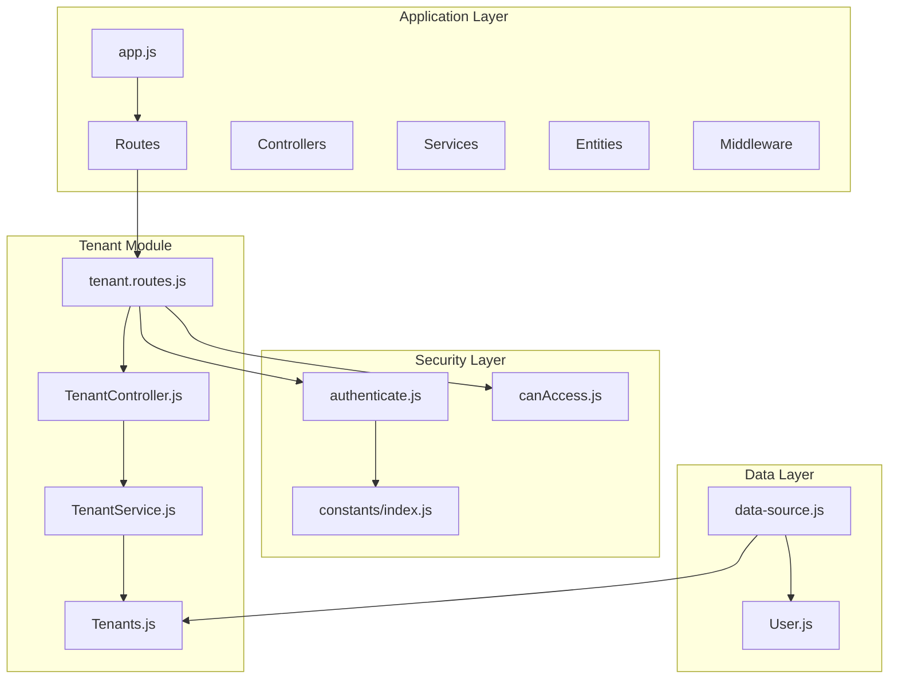
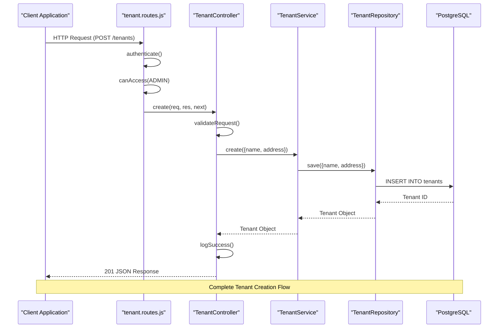
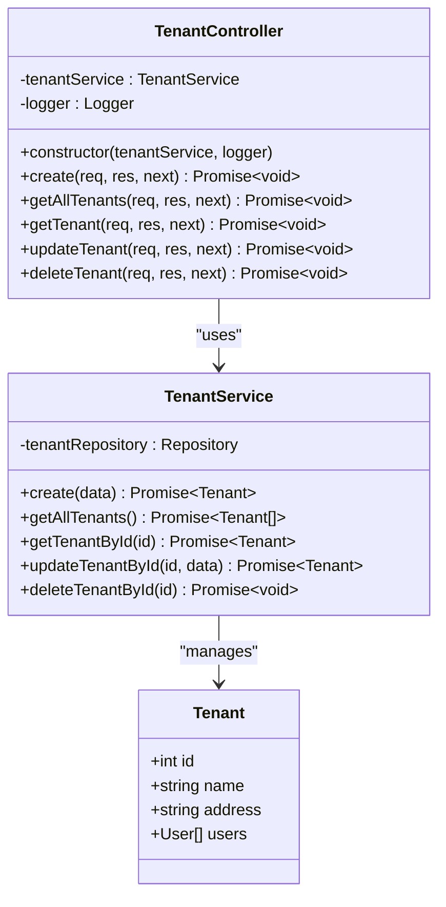
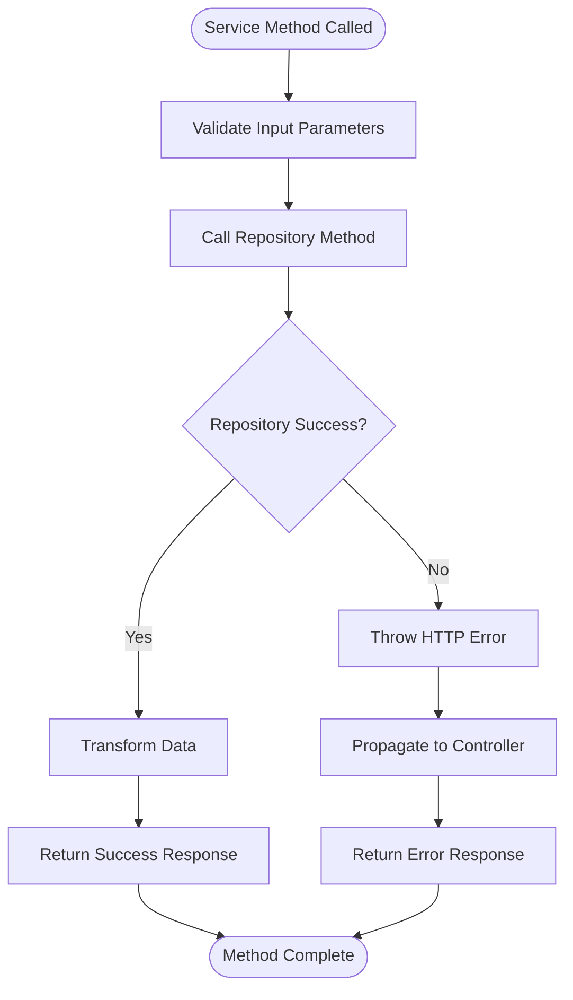
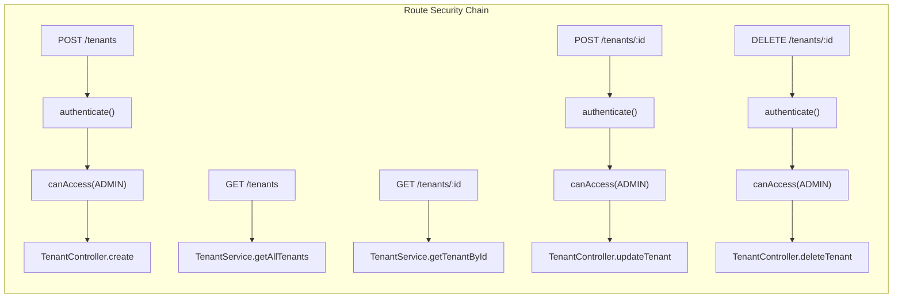
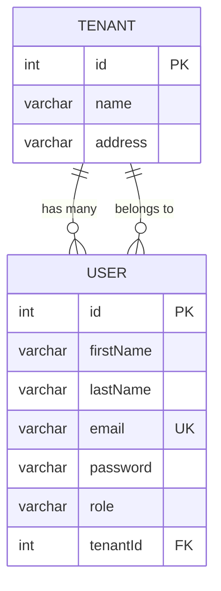
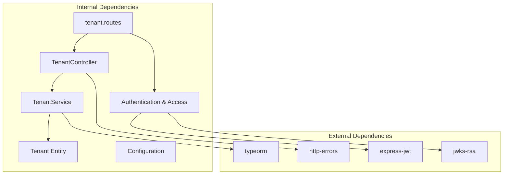

# Tenant Controller

<cite>
**Referenced Files in This Document**
- [TenantController.js](file://src/controllers/TenantController.js)
- [TenantService.js](file://src/services/TenantService.js)
- [tenant.routes.js](file://src/routes/tenant.routes.js)
- [Tenants.js](file://src/entity/Tenants.js)
- [data-source.js](file://src/config/data-source.js)
- [authenticate.js](file://src/middleware/authenticate.js)
- [canAccess.js](file://src/middleware/canAccess.js)
- [index.js](file://src/constants/index.js)
- [app.js](file://src/app.js)
- [User.js](file://src/entity/User.js)
- [create.spec.js](file://src/test/tenant/create.spec.js)
</cite>

## Table of Contents
1. [Introduction](#introduction)
2. [Project Structure](#project-structure)
3. [Core Components](#core-components)
4. [Architecture Overview](#architecture-overview)
5. [Detailed Component Analysis](#detailed-component-analysis)
6. [Dependency Analysis](#dependency-analysis)
7. [Performance Considerations](#performance-considerations)
8. [Troubleshooting Guide](#troubleshooting-guide)
9. [Conclusion](#conclusion)

## Introduction

The Tenant Controller is a core component of the authentication service that manages tenant-related operations in a multi-tenant architecture. This controller handles CRUD operations for tenants, integrates with authentication and authorization middleware, and provides a clean separation of concerns between presentation, business logic, and data persistence layers.

The controller follows the Model-View-Controller (MVC) pattern and implements proper error handling, validation, and security measures to ensure robust tenant management functionality.

## Project Structure

The tenant controller is part of a well-organized Express.js application with clear separation of concerns:

**Diagram sources**
- [app.js:1-40](file://src/app.js#L1-L40)
- [tenant.routes.js:1-45](file://src/routes/tenant.routes.js#L1-L45)
- [TenantController.js:1-76](file://src/controllers/TenantController.js#L1-L76)

**Section sources**
- [app.js:1-40](file://src/app.js#L1-L40)
- [tenant.routes.js:1-45](file://src/routes/tenant.routes.js#L1-L45)

## Core Components

### TenantController Class

The TenantController serves as the primary interface for tenant management operations, implementing five key methods:

- **create**: Handles tenant creation requests
- **getAllTenants**: Retrieves all tenants
- **getTenant**: Fetches a specific tenant by ID
- **updateTenant**: Updates existing tenant information
- **deleteTenant**: Removes tenants from the system

Each method follows a consistent pattern of request validation, service delegation, and response formatting.

### TenantService Class

The TenantService acts as an intermediary between the controller and data layer, providing:

- Business logic validation
- Data transformation
- Error handling and propagation
- Repository abstraction

### Tenant Entity

The Tenant entity defines the database schema with:
- Auto-generated integer ID
- Name field (up to 100 characters)
- Address field (up to 255 characters)
- One-to-many relationship with users

**Section sources**
- [TenantController.js:1-76](file://src/controllers/TenantController.js#L1-L76)
- [TenantService.js:1-66](file://src/services/TenantService.js#L1-L66)
- [Tenants.js:1-29](file://src/entity/Tenants.js#L1-L29)

## Architecture Overview

The tenant controller implements a layered architecture with clear separation of responsibilities:

**Diagram sources**
- [tenant.routes.js:16-21](file://src/routes/tenant.routes.js#L16-L21)
- [TenantController.js:11-22](file://src/controllers/TenantController.js#L11-L22)
- [TenantService.js:7-14](file://src/services/TenantService.js#L7-L14)

The architecture ensures:
- **Security**: Authentication and authorization middleware protect all tenant operations
- **Separation of Concerns**: Clear boundaries between controller, service, and data layers
- **Error Handling**: Consistent error propagation and logging
- **Extensibility**: Easy addition of new tenant operations

## Detailed Component Analysis

### TenantController Implementation

The TenantController implements comprehensive error handling and follows RESTful conventions:

**Diagram sources**
- [TenantController.js:3-76](file://src/controllers/TenantController.js#L3-L76)
- [TenantService.js:3-66](file://src/services/TenantService.js#L3-L66)
- [Tenants.js:3-29](file://src/entity/Tenants.js#L3-L29)

#### Request Validation and Processing

The controller validates incoming requests and handles various scenarios:

1. **Create Operation**: Validates tenant data, delegates to service, logs success
2. **Get Operations**: Handles both listing all tenants and fetching specific tenants
3. **Update Operation**: Processes partial updates with proper error handling
4. **Delete Operation**: Includes pre-check for tenant existence

#### Error Handling Strategy

The controller implements comprehensive error handling:
- **404 Not Found**: Specific handling for missing tenants
- **500 Internal Server Error**: Generic error handling for service failures
- **Next Middleware**: Proper error propagation to global error handler

**Section sources**
- [TenantController.js:11-74](file://src/controllers/TenantController.js#L11-L74)

### TenantService Business Logic

The TenantService encapsulates all business logic and provides:

**Diagram sources**
- [TenantService.js:7-64](file://src/services/TenantService.js#L7-L64)

Key service capabilities:
- **Data Persistence**: Handles tenant creation, updates, and deletions
- **Query Operations**: Manages tenant retrieval with filtering
- **Validation**: Ensures data integrity before persistence
- **Error Management**: Converts repository errors to HTTP errors

**Section sources**
- [TenantService.js:1-66](file://src/services/TenantService.js#L1-L66)

### Route Configuration and Security

The tenant routes are configured with comprehensive security measures:

**Diagram sources**
- [tenant.routes.js:16-42](file://src/routes/tenant.routes.js#L16-L42)
- [authenticate.js:6-25](file://src/middleware/authenticate.js#L6-L25)
- [canAccess.js:4-22](file://src/middleware/canAccess.js#L4-L22)

Security features implemented:
- **JWT Authentication**: Validates access tokens via JWKS
- **Role-Based Access Control**: Restricts operations to ADMIN users
- **Cookie Token Support**: Accepts tokens from cookies for client compatibility
- **Flexible Authorization**: Extensible role checking mechanism

**Section sources**
- [tenant.routes.js:1-45](file://src/routes/tenant.routes.js#L1-L45)
- [authenticate.js:1-26](file://src/middleware/authenticate.js#L1-L26)
- [canAccess.js:1-23](file://src/middleware/canAccess.js#L1-L23)

### Data Model and Relationships

The tenant entity establishes important relationships within the system:

**Diagram sources**
- [Tenants.js:3-29](file://src/entity/Tenants.js#L3-L29)
- [User.js:3-50](file://src/entity/User.js#L3-L50)

Relationship implications:
- **One-to-Many**: Each tenant can have multiple users
- **Foreign Key**: Users reference their tenant via tenantId
- **Nullable Relationship**: Users can exist without tenants
- **Cascade Effects**: Tenant deletion affects user associations

**Section sources**
- [Tenants.js:1-29](file://src/entity/Tenants.js#L1-L29)
- [User.js:1-50](file://src/entity/User.js#L1-L50)

## Dependency Analysis

The tenant controller has well-defined dependencies that support maintainability and testability:

**Diagram sources**
- [TenantController.js:1](file://src/controllers/TenantController.js#L1)
- [TenantService.js:1](file://src/services/TenantService.js#L1)
- [tenant.routes.js:1-10](file://src/routes/tenant.routes.js#L1-L10)

Key dependency characteristics:
- **Low Coupling**: Services depend on repositories, not concrete implementations
- **High Cohesion**: Each component has a single responsibility
- **Testable Design**: Dependencies can be easily mocked for testing
- **Configurable**: External dependencies are managed through configuration

**Section sources**
- [TenantController.js:1-9](file://src/controllers/TenantController.js#L1-L9)
- [TenantService.js:1-6](file://src/services/TenantService.js#L1-L6)
- [tenant.routes.js:1-14](file://src/routes/tenant.routes.js#L1-L14)

## Performance Considerations

The tenant controller implementation includes several performance optimizations:

### Database Efficiency
- **Single Query Operations**: Each operation performs minimal database queries
- **Connection Pooling**: TypeORM manages efficient database connections
- **Lazy Loading**: Associations are loaded only when accessed

### Memory Management
- **Object Lifecycle**: Controllers and services are instantiated per request
- **Error Cleanup**: Proper error handling prevents memory leaks
- **Response Streaming**: Large responses are handled efficiently

### Security Performance
- **Token Caching**: JWKS tokens are cached for improved performance
- **Early Validation**: Input validation prevents unnecessary database calls
- **Role Checking**: Role verification occurs before expensive operations

## Troubleshooting Guide

Common issues and their solutions:

### Authentication Issues
**Problem**: Users receive 401 Unauthorized errors
**Causes**:
- Invalid or expired JWT tokens
- Missing Authorization header
- Incorrect token format

**Solutions**:
- Verify token validity and expiration
- Check Authorization header format: "Bearer TOKEN"
- Ensure proper cookie configuration for token delivery

### Authorization Issues  
**Problem**: Users receive 403 Forbidden errors
**Causes**:
- User lacks ADMIN role
- Role not properly extracted from token
- Token authentication failing

**Solutions**:
- Verify user role in authentication token
- Check role assignment in user management
- Ensure proper middleware chain configuration

### Database Connectivity
**Problem**: Tenant operations fail with database errors
**Causes**:
- Database connection issues
- Migration not applied
- Schema conflicts

**Solutions**:
- Verify database connectivity configuration
- Run database migrations
- Check entity schema alignment

### Request Validation Errors
**Problem**: Tenant creation/update fails validation
**Causes**:
- Missing required fields
- Data type mismatches
- Field length violations

**Solutions**:
- Validate request payload structure
- Check field constraints (length, type)
- Review entity definition requirements

**Section sources**
- [TenantController.js:18-21](file://src/controllers/TenantController.js#L18-L21)
- [TenantService.js:10-13](file://src/services/TenantService.js#L10-L13)
- [authenticate.js:13-24](file://src/middleware/authenticate.js#L13-L24)
- [canAccess.js:10-17](file://src/middleware/canAccess.js#L10-L17)

## Conclusion

The Tenant Controller represents a well-architected component that effectively manages tenant operations in a multi-tenant authentication service. Its design demonstrates strong adherence to SOLID principles, proper separation of concerns, and comprehensive error handling.

Key strengths include:
- **Security First**: Robust authentication and authorization mechanisms
- **Clean Architecture**: Clear separation between layers and responsibilities
- **Extensible Design**: Easy to add new tenant operations and validations
- **Production Ready**: Comprehensive error handling and logging
- **Testable**: Well-structured for unit and integration testing

The controller successfully integrates with the broader authentication service ecosystem while maintaining its own focused responsibility for tenant management. This modular approach enables future enhancements and maintains system scalability.