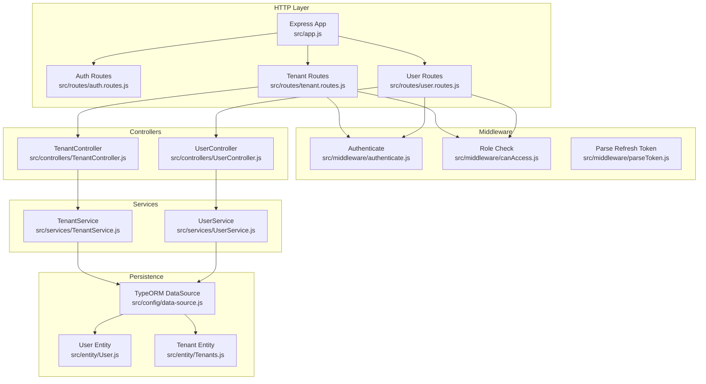
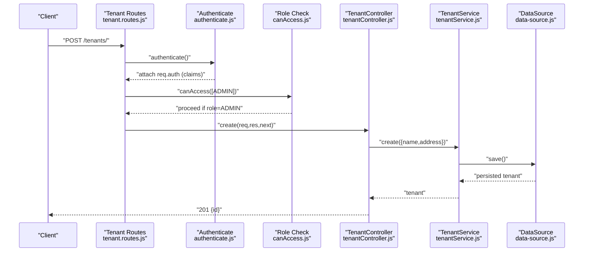
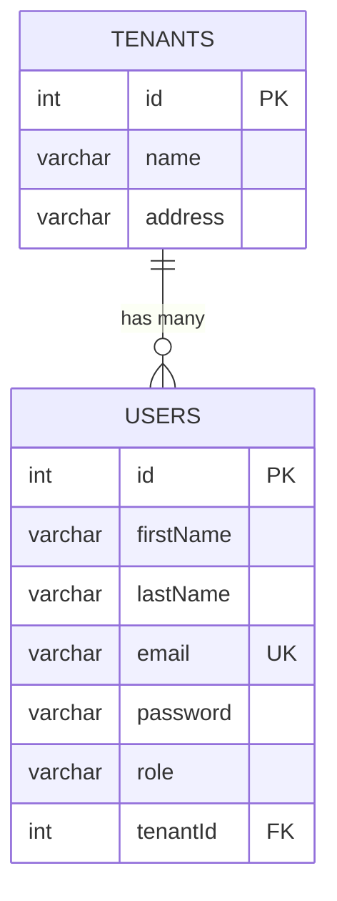
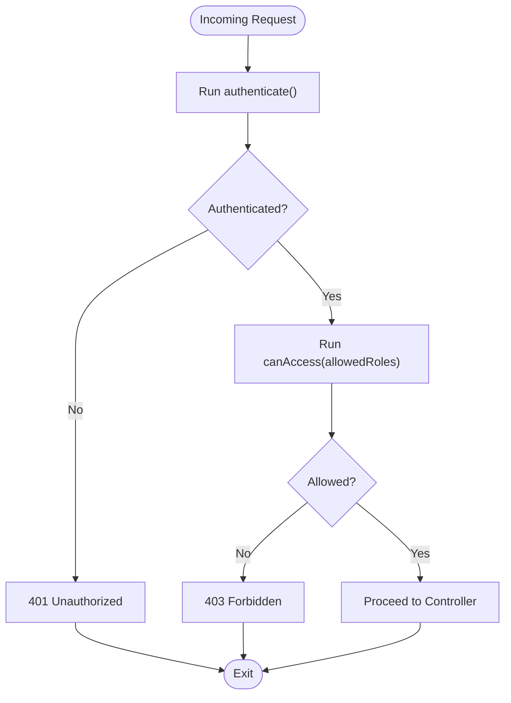
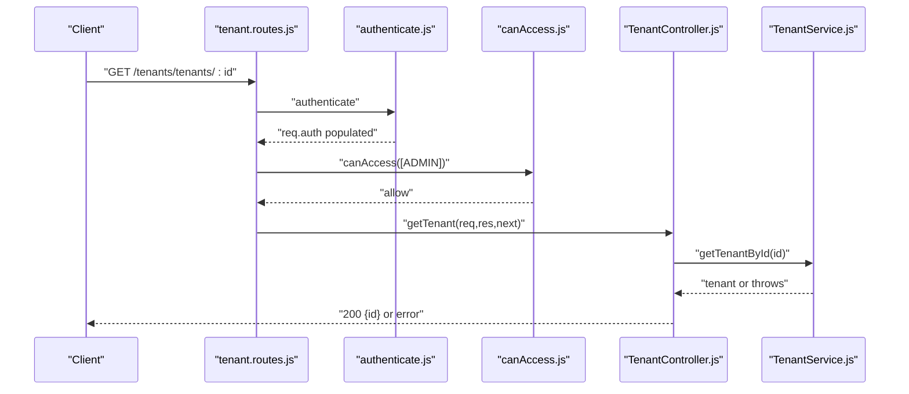
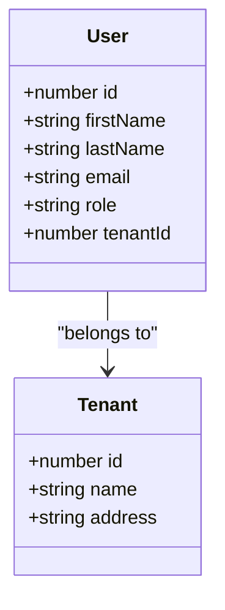
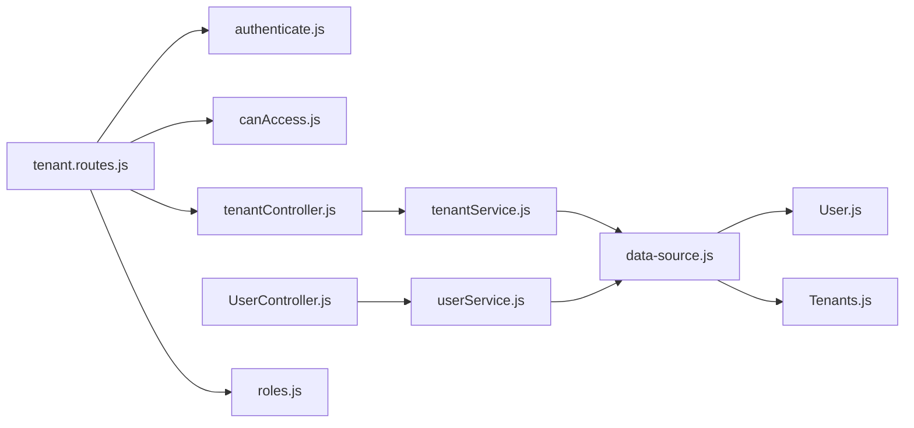

# Tenant Data Isolation

<cite>
**Referenced Files in This Document**
- [app.js](file://src/app.js)
- [server.js](file://src/server.js)
- [data-source.js](file://src/config/data-source.js)
- [config.js](file://src/config/config.js)
- [authenticate.js](file://src/middleware/authenticate.js)
- [canAccess.js](file://src/middleware/canAccess.js)
- [parseToken.js](file://src/middleware/parseToken.js)
- [tenant.routes.js](file://src/routes/tenant.routes.js)
- [tenantController.js](file://src/controllers/TenantController.js)
- [tenantService.js](file://src/services/TenantService.js)
- [tenantEntity.js](file://src/entity/Tenants.js)
- [userEntity.js](file://src/entity/User.js)
- [userRoutes.js](file://src/routes/user.routes.js)
- [userService.js](file://src/services/UserService.js)
- [roles.js](file://src/constants/index.js)
- [1773678089909-create_tenant_table.js](file://src/migration/1773678089909-create_tenant_table.js)
- [1773678973384-add_FK_tenant_table_and_to_user_table.js](file://src/migration/1773678973384-add_FK_tenant_table_and_to_user_table.js)
</cite>

## Table of Contents
1. [Introduction](#introduction)
2. [Project Structure](#project-structure)
3. [Core Components](#core-components)
4. [Architecture Overview](#architecture-overview)
5. [Detailed Component Analysis](#detailed-component-analysis)
6. [Dependency Analysis](#dependency-analysis)
7. [Performance Considerations](#performance-considerations)
8. [Troubleshooting Guide](#troubleshooting-guide)
9. [Conclusion](#conclusion)

## Introduction
This document explains how the service enforces tenant data isolation and security across application layers. It covers the tenant-user relationship, middleware validation for authentication and authorization, session token handling, and the enforcement of tenant boundaries in requests. It also documents how tenant context is maintained during user sessions, outlines middleware chain processing for tenant validation, and provides examples of tenant-scoped operations and data segregation patterns. Security considerations for preventing tenant data leakage and unauthorized access attempts are included.

## Project Structure
The application follows a layered architecture with Express routing, middleware for authentication and authorization, TypeORM entities and repositories, and service layers. Routes define entry points, controllers handle request/response, services encapsulate business logic, and middleware validates tokens and roles. Database connectivity is configured via TypeORM with Postgres.

**Diagram sources**
- [app.js:1-40](file://src/app.js#L1-L40)
- [tenant.routes.js:1-45](file://src/routes/tenant.routes.js#L1-L45)
- [authenticate.js:1-26](file://src/middleware/authenticate.js#L1-L26)
- [canAccess.js:1-23](file://src/middleware/canAccess.js#L1-L23)
- [tenantController.js:1-76](file://src/controllers/TenantController.js#L1-L76)
- [tenantService.js:1-66](file://src/services/TenantService.js#L1-L66)
- [data-source.js:1-22](file://src/config/data-source.js#L1-L22)
- [userEntity.js:1-50](file://src/entity/User.js#L1-L50)
- [tenantEntity.js:1-29](file://src/entity/Tenants.js#L1-L29)

**Section sources**
- [app.js:1-40](file://src/app.js#L1-L40)
- [server.js:1-21](file://src/server.js#L1-L21)
- [data-source.js:1-22](file://src/config/data-source.js#L1-L22)

## Core Components
- Authentication middleware validates access tokens using JWKS for RS256 and extracts tokens from Authorization header or cookies.
- Role-based authorization middleware checks allowed roles against the authenticated user’s role.
- Tenant routes enforce authentication and role checks before invoking controllers.
- Tenant and User entities define the tenant-user relationship with foreign keys and relations.
- Services encapsulate CRUD operations and error handling for tenant and user resources.
- Data source configures Postgres connection and loads entities and migrations.

Key tenant-scoped relationships:
- Users belong to a tenant via tenantId (nullable in entity definition but constrained in later migrations).
- Tenants have a one-to-many relation with users.

**Section sources**
- [authenticate.js:1-26](file://src/middleware/authenticate.js#L1-L26)
- [canAccess.js:1-23](file://src/middleware/canAccess.js#L1-L23)
- [tenant.routes.js:1-45](file://src/routes/tenant.routes.js#L1-L45)
- [tenantEntity.js:1-29](file://src/entity/Tenants.js#L1-L29)
- [userEntity.js:1-50](file://src/entity/User.js#L1-L50)
- [tenantService.js:1-66](file://src/services/TenantService.js#L1-L66)
- [userService.js:1-99](file://src/services/UserService.js#L1-L99)
- [data-source.js:1-22](file://src/config/data-source.js#L1-L22)

## Architecture Overview
The system enforces tenant isolation through a middleware-first approach:
- Requests pass through authentication middleware to validate identity and extract claims.
- Role middleware verifies authorization against allowed roles.
- Controllers operate within the authenticated context; services perform persistence operations.
- Tenant boundaries are enforced by requiring admin privileges for tenant management endpoints.

**Diagram sources**
- [tenant.routes.js:16-21](file://src/routes/tenant.routes.js#L16-L21)
- [authenticate.js:6-25](file://src/middleware/authenticate.js#L6-L25)
- [canAccess.js:4-22](file://src/middleware/canAccess.js#L4-L22)
- [tenantController.js:11-22](file://src/controllers/TenantController.js#L11-L22)
- [tenantService.js:7-14](file://src/services/TenantService.js#L7-L14)
- [data-source.js:8-21](file://src/config/data-source.js#L8-L21)

## Detailed Component Analysis

### Tenant Data Model and Relationships
The tenant-user relationship is modeled with a many-to-one association from User to Tenant, with tenantId as a foreign key. The entity definitions and migrations establish the schema and constraints.

**Diagram sources**
- [tenantEntity.js:3-28](file://src/entity/Tenants.js#L3-L28)
- [userEntity.js:3-48](file://src/entity/User.js#L3-L48)
- [1773678089909-create_tenant_table.js:16-19](file://src/migration/1773678089909-create_tenant_table.js#L16-L19)
- [1773678973384-add_FK_tenant_table_and_to_user_table.js:18-23](file://src/migration/1773678973384-add_FK_tenant_table_and_to_user_table.js#L18-L23)

**Section sources**
- [tenantEntity.js:1-29](file://src/entity/Tenants.js#L1-L29)
- [userEntity.js:1-50](file://src/entity/User.js#L1-L50)
- [1773678089909-create_tenant_table.js:1-31](file://src/migration/1773678089909-create_tenant_table.js#L1-L31)
- [1773678973384-add_FK_tenant_table_and_to_user_table.js:1-39](file://src/migration/1773678973384-add_FK_tenant_table_and_to_user_table.js#L1-L39)

### Authentication and Authorization Middleware
- Authentication middleware validates RS256 tokens using JWKS and supports tokens from Authorization header or cookies.
- Role-based authorization middleware checks the authenticated user’s role against allowed roles and denies access otherwise.
- Refresh token parsing middleware uses a shared secret for HS256 tokens from cookies.

**Diagram sources**
- [authenticate.js:6-25](file://src/middleware/authenticate.js#L6-L25)
- [canAccess.js:4-22](file://src/middleware/canAccess.js#L4-L22)

**Section sources**
- [authenticate.js:1-26](file://src/middleware/authenticate.js#L1-L26)
- [canAccess.js:1-23](file://src/middleware/canAccess.js#L1-L23)
- [parseToken.js:1-14](file://src/middleware/parseToken.js#L1-L14)

### Tenant Management Endpoints and Middleware Chain
Tenant routes require authentication and admin role checks before invoking controller actions. The middleware chain ensures that only authenticated administrators can manage tenants.

**Diagram sources**
- [tenant.routes.js:23-28](file://src/routes/tenant.routes.js#L23-L28)
- [authenticate.js:6-25](file://src/middleware/authenticate.js#L6-L25)
- [canAccess.js:4-22](file://src/middleware/canAccess.js#L4-L22)
- [tenantController.js:34-48](file://src/controllers/TenantController.js#L34-L48)
- [tenantService.js:25-32](file://src/services/TenantService.js#L25-L32)

**Section sources**
- [tenant.routes.js:1-45](file://src/routes/tenant.routes.js#L1-L45)
- [tenantController.js:1-76](file://src/controllers/TenantController.js#L1-L76)
- [tenantService.js:1-66](file://src/services/TenantService.js#L1-L66)

### User-Tenant Relationship and Session Context
- The User entity includes tenantId and a many-to-one relation to Tenant.
- Migrations rename userId to tenantId and add foreign key constraints.
- User creation accepts tenantId and updates support setting tenant relations.
- Authentication middleware attaches decoded claims to req.auth for downstream use.

**Diagram sources**
- [userEntity.js:3-48](file://src/entity/User.js#L3-L48)
- [tenantEntity.js:3-28](file://src/entity/Tenants.js#L3-L28)
- [1773678973384-add_FK_tenant_table_and_to_user_table.js:18-23](file://src/migration/1773678973384-add_FK_tenant_table_and_to_user_table.js#L18-L23)

**Section sources**
- [userEntity.js:1-50](file://src/entity/User.js#L1-L50)
- [1773678973384-add_FK_tenant_table_and_to_user_table.js:1-39](file://src/migration/1773678973384-add_FK_tenant_table_and_to_user_table.js#L1-L39)
- [authenticate.js:13-24](file://src/middleware/authenticate.js#L13-L24)

### Tenant-Scoped Queries and Data Segregation Patterns
- TenantService performs CRUD operations on tenants with explicit error handling.
- UserService handles user creation and updates, including optional tenant assignment.
- Data segregation relies on:
  - Authentication and role checks at route level.
  - TenantId present in User entity enabling scoped queries and relations.
  - Foreign key constraints ensuring referential integrity.

Examples of tenant-scoped operations:
- Creating a tenant: POST /tenants/ with admin role.
- Retrieving a tenant by ID: GET /tenants/tenants/:id.
- Updating/deleting a tenant: POST/DELETE /tenants/tenants/:id with admin role.

Note: The current implementation does not enforce per-request tenant scoping in service methods. To prevent cross-tenant access, services should filter queries by the authenticated user’s tenant context.

**Section sources**
- [tenantService.js:1-66](file://src/services/TenantService.js#L1-L66)
- [userService.js:1-99](file://src/services/UserService.js#L1-L99)
- [tenant.routes.js:16-42](file://src/routes/tenant.routes.js#L16-L42)

### Security Implementation and Best Practices
- Token validation: RS256 with JWKS for access tokens; HS256 with shared secret for refresh tokens.
- Role enforcement: Admin-only endpoints for tenant management.
- Data model integrity: Foreign keys and migrations ensure tenantId constraints.
- Error handling: Centralized error response in Express app middleware.

Recommendations for stronger tenant isolation:
- Enforce tenant scoping in services by binding queries to the authenticated user’s tenantId.
- Add tenant-aware guards in service methods to prevent cross-tenant reads/writes.
- Log sensitive operations with tenant identifiers for auditability.

**Section sources**
- [authenticate.js:1-26](file://src/middleware/authenticate.js#L1-L26)
- [canAccess.js:1-23](file://src/middleware/canAccess.js#L1-L23)
- [parseToken.js:1-14](file://src/middleware/parseToken.js#L1-L14)
- [app.js:23-37](file://src/app.js#L23-L37)

## Dependency Analysis
The following diagram shows key dependencies among modules involved in tenant isolation and security.

**Diagram sources**
- [tenant.routes.js:1-45](file://src/routes/tenant.routes.js#L1-L45)
- [authenticate.js:1-26](file://src/middleware/authenticate.js#L1-L26)
- [canAccess.js:1-23](file://src/middleware/canAccess.js#L1-L23)
- [tenantController.js:1-76](file://src/controllers/TenantController.js#L1-L76)
- [tenantService.js:1-66](file://src/services/TenantService.js#L1-L66)
- [userService.js:1-99](file://src/services/UserService.js#L1-L99)
- [data-source.js:1-22](file://src/config/data-source.js#L1-L22)
- [userEntity.js:1-50](file://src/entity/User.js#L1-L50)
- [tenantEntity.js:1-29](file://src/entity/Tenants.js#L1-L29)
- [roles.js:1-6](file://src/constants/index.js#L1-L6)

**Section sources**
- [tenant.routes.js:1-45](file://src/routes/tenant.routes.js#L1-L45)
- [data-source.js:1-22](file://src/config/data-source.js#L1-L22)

## Performance Considerations
- Token verification caching: JWKS caching reduces latency for repeated validations.
- Role checks: Minimal overhead; ensure allowedRoles arrays are small and static.
- Database queries: Use repository-level filtering by tenantId to avoid scanning entire tables.
- Connection pooling: Configure Postgres connection pool appropriately for expected load.

## Troubleshooting Guide
Common issues and resolutions:
- 401 Unauthorized: Verify Authorization header or access cookie contains a valid RS256 token; check JWKS URI and algorithm configuration.
- 403 Forbidden: Confirm the authenticated user’s role matches allowed roles for the endpoint.
- 404 Not Found: Tenant retrieval failures indicate missing tenant records or incorrect IDs.
- 500 Internal Server Error: Inspect centralized error handler logs for underlying exceptions.

Operational checks:
- Ensure database initialization runs before server start.
- Validate entity loading and migration execution in non-test environments.
- Confirm cookie settings for secure and same-site policies for token cookies.

**Section sources**
- [app.js:23-37](file://src/app.js#L23-L37)
- [server.js:7-19](file://src/server.js#L7-L19)
- [data-source.js:8-21](file://src/config/data-source.js#L8-L21)

## Conclusion
The service establishes a foundation for tenant data isolation through authentication, role-based authorization, and a clear tenant-user data model. While the route-level middleware enforces admin-only access for tenant management, stronger tenant scoping should be introduced at the service layer to guarantee per-request tenant boundaries. Implementing tenant-aware queries and guards will further mitigate risks of data leakage and unauthorized cross-tenant access.