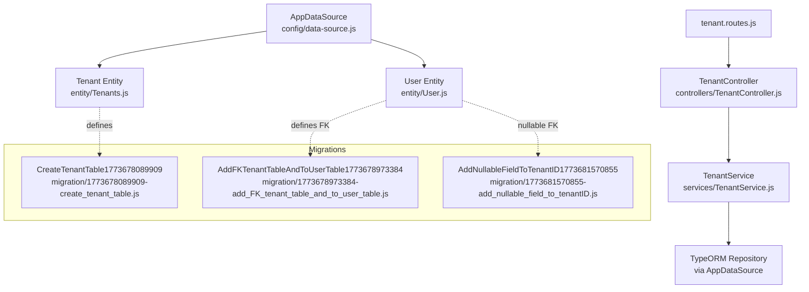
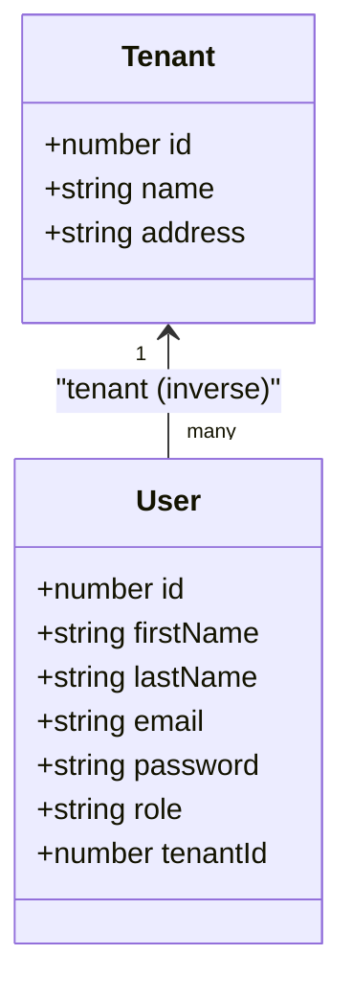
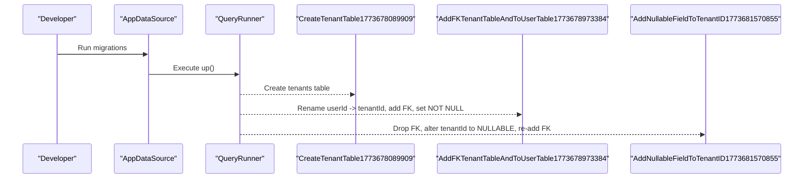
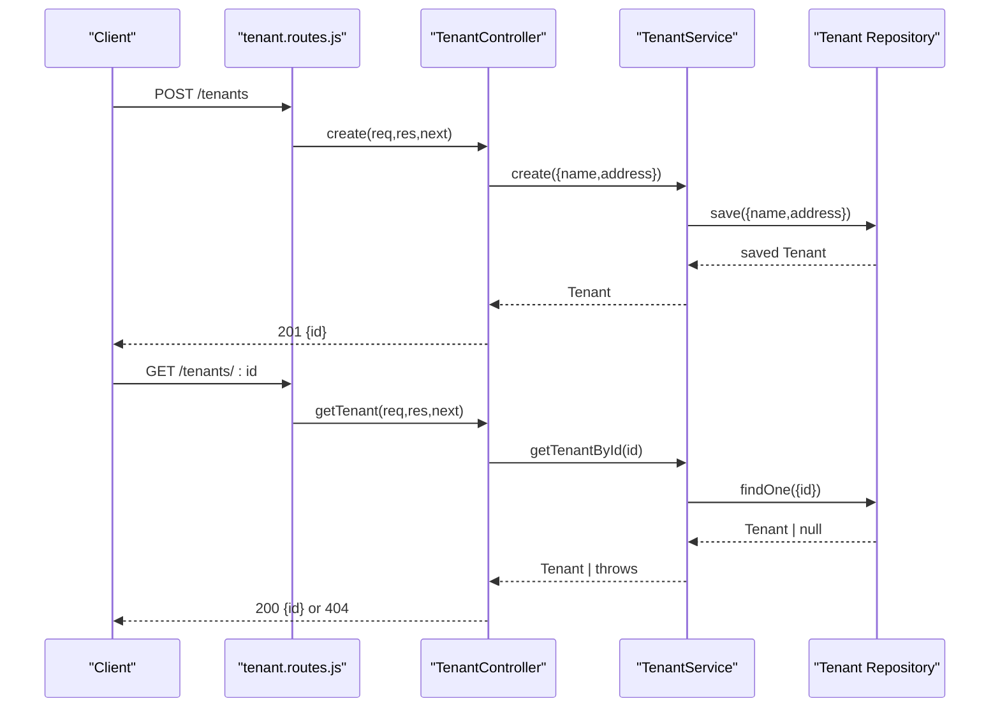
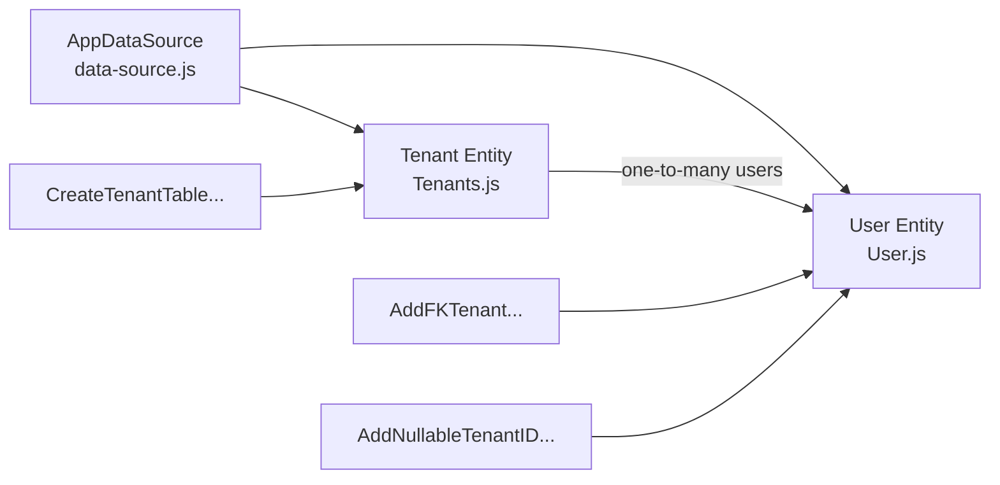

# Tenant Entity Model

<cite>
**Referenced Files in This Document**
- [Tenants.js](file://src/entity/Tenants.js)
- [User.js](file://src/entity/User.js)
- [data-source.js](file://src/config/data-source.js)
- [1773678089909-create_tenant_table.js](file://src/migration/1773678089909-create_tenant_table.js)
- [1773678973384-add_FK_tenant_table_and_to_user_table.js](file://src/migration/1773678973384-add_FK_tenant_table_and_to_user_table.js)
- [1773681570855-add_nullable_field_to_tenantID.js](file://src/migration/1773681570855-add_nullable_field_to_tenantID.js)
- [TenantController.js](file://src/controllers/TenantController.js)
- [TenantService.js](file://src/services/TenantService.js)
- [tenant.routes.js](file://src/routes/tenant.routes.js)
- [canAccess.js](file://src/middleware/canAccess.js)
- [create.spec.js](file://src/test/tenant/create.spec.js)
</cite>

## Table of Contents
1. [Introduction](#introduction)
2. [Project Structure](#project-structure)
3. [Core Components](#core-components)
4. [Architecture Overview](#architecture-overview)
5. [Detailed Component Analysis](#detailed-component-analysis)
6. [Dependency Analysis](#dependency-analysis)
7. [Performance Considerations](#performance-considerations)
8. [Troubleshooting Guide](#troubleshooting-guide)
9. [Conclusion](#conclusion)
10. [Appendices](#appendices)

## Introduction
This document provides comprehensive data model documentation for the Tenant entity within the authentication service. It covers the entity schema, primary key and auto-increment behavior, constraints, relationships with the User entity, TypeORM decorators and column specifications, migration patterns and schema evolution, usage examples in queries and relationships, indexing strategies, performance considerations, and data integrity enforcement.

## Project Structure
The Tenant entity is defined alongside the User entity and integrated into the TypeORM data source configuration. Migrations manage the creation and evolution of the tenants table and the foreign key relationship to users. Controllers and services expose CRUD endpoints for tenants, protected by authentication and authorization middleware.

**Diagram sources**
- [data-source.js:8-21](file://src/config/data-source.js#L8-L21)
- [Tenants.js:3-28](file://src/entity/Tenants.js#L3-L28)
- [User.js:3-49](file://src/entity/User.js#L3-L49)
- [1773678089909-create_tenant_table.js:10-30](file://src/migration/1773678089909-create_tenant_table.js#L10-L30)
- [1773678973384-add_FK_tenant_table_and_to_user_table.js:10-38](file://src/migration/1773678973384-add_FK_tenant_table_and_to_user_table.js#L10-L38)
- [1773681570855-add_nullable_field_to_tenantID.js:10-30](file://src/migration/1773681570855-add_nullable_field_to_tenantID.js#L10-L30)
- [TenantController.js:3-75](file://src/controllers/TenantController.js#L3-L75)
- [TenantService.js:3-65](file://src/services/TenantService.js#L3-L65)
- [tenant.routes.js:11-44](file://src/routes/tenant.routes.js#L11-L44)

**Section sources**
- [data-source.js:8-21](file://src/config/data-source.js#L8-L21)
- [Tenants.js:3-28](file://src/entity/Tenants.js#L3-L28)
- [User.js:3-49](file://src/entity/User.js#L3-L49)
- [tenant.routes.js:11-44](file://src/routes/tenant.routes.js#L11-L44)

## Core Components
- Tenant entity definition with columns and relations.
- User entity with a many-to-one relation to Tenant via tenantId.
- Data source configuration registering Tenant and User entities.
- Migrations managing table creation, foreign key addition, and nullability adjustments.
- Controller and service layer exposing tenant operations.
- Route definitions with authentication and authorization guards.

**Section sources**
- [Tenants.js:3-28](file://src/entity/Tenants.js#L3-L28)
- [User.js:30-47](file://src/entity/User.js#L30-L47)
- [data-source.js:8-21](file://src/config/data-source.js#L8-L21)
- [1773678089909-create_tenant_table.js:16-20](file://src/migration/1773678089909-create_tenant_table.js#L16-L20)
- [1773678973384-add_FK_tenant_table_and_to_user_table.js:16-23](file://src/migration/1773678973384-add_FK_tenant_table_and_to_user_table.js#L16-L23)
- [1773681570855-add_nullable_field_to_tenantID.js:16-19](file://src/migration/1773681570855-add_nullable_field_to_tenantID.js#L16-L19)
- [TenantController.js:11-74](file://src/controllers/TenantController.js#L11-L74)
- [TenantService.js:7-64](file://src/services/TenantService.js#L7-L64)
- [tenant.routes.js:16-42](file://src/routes/tenant.routes.js#L16-L42)

## Architecture Overview
The Tenant entity participates in a many-to-one relationship with the User entity. Users belong to a tenant via tenantId, which is a foreign key referencing the Tenant’s primary key. The relationship is initially non-nullable but later adjusted to nullable in a migration to support scenarios where a user does not belong to a tenant.

**Diagram sources**
- [Tenants.js:6-20](file://src/entity/Tenants.js#L6-L20)
- [User.js:6-47](file://src/entity/User.js#L6-L47)

**Section sources**
- [Tenants.js:21-27](file://src/entity/Tenants.js#L21-L27)
- [User.js:42-47](file://src/entity/User.js#L42-L47)

## Detailed Component Analysis

### Tenant Entity Schema
- Table: tenants
- Columns:
  - id: integer, primary key, auto-generated (SERIAL in migration)
  - name: varchar(100)
  - address: varchar(255)
- Relations:
  - users: one-to-many, inverse side is tenant on User

Constraints and behavior:
- Primary key enforced at the database level.
- No explicit unique constraints on name or address in the entity definition; uniqueness is not enforced at the entity level.
- Auto-increment behavior is configured via the primary key column definition.

**Section sources**
- [Tenants.js:6-20](file://src/entity/Tenants.js#L6-L20)
- [Tenants.js:21-27](file://src/entity/Tenants.js#L21-L27)
- [1773678089909-create_tenant_table.js:17](file://src/migration/1773678089909-create_tenant_table.js#L17)

### User-Tenant Relationship
- Foreign key column: tenantId (integer)
- Relationship: many-to-one from User to Tenant
- Initial state: tenantId was NOT NULL
- Evolution: later made nullable via migration to allow users without a tenant association

Cascading behavior:
- The foreign key constraint is defined without explicit ON DELETE or ON UPDATE clauses in the migrations, meaning defaults apply. The current migrations do not specify CASCADE actions.

**Section sources**
- [User.js:30-47](file://src/entity/User.js#L30-L47)
- [1773678973384-add_FK_tenant_table_and_to_user_table.js:18-23](file://src/migration/1773678973384-add_FK_tenant_table_and_to_user_table.js#L18-L23)
- [1773681570855-add_nullable_field_to_tenantID.js:16-19](file://src/migration/1773681570855-add_nullable_field_to_tenantID.js#L16-L19)

### TypeORM Decorators and Column Specifications
- Tenant entity uses EntitySchema with explicit columns and relations.
- User entity uses EntitySchema with explicit columns and relations, including a joinColumn for tenantId.
- No validation decorators are present in the entity files; validation is handled at the route/controller level via express-validator schemas.

**Section sources**
- [Tenants.js:3-28](file://src/entity/Tenants.js#L3-L28)
- [User.js:36-48](file://src/entity/User.js#L36-L48)
- [register-validators.js:3-46](file://src/validators/register-validators.js#L3-L46)

### Database Migration Patterns and Schema Evolution
- Initial creation of tenants table with primary key and NOT NULL constraints on name and address.
- Addition of a foreign key from users.userId renamed to users.tenantId, changing NOT NULL to allow nullable tenant associations.
- Final adjustment to make tenantId nullable to support optional tenant membership.

**Diagram sources**
- [1773678089909-create_tenant_table.js:16-20](file://src/migration/1773678089909-create_tenant_table.js#L16-L20)
- [1773678973384-add_FK_tenant_table_and_to_user_table.js:16-23](file://src/migration/1773678973384-add_FK_tenant_table_and_to_user_table.js#L16-L23)
- [1773681570855-add_nullable_field_to_tenantID.js:16-19](file://src/migration/1773681570855-add_nullable_field_to_tenantID.js#L16-L19)

**Section sources**
- [1773678089909-create_tenant_table.js:10-30](file://src/migration/1773678089909-create_tenant_table.js#L10-L30)
- [1773678973384-add_FK_tenant_table_and_to_user_table.js:10-38](file://src/migration/1773678973384-add_FK_tenant_table_and_to_user_table.js#L10-L38)
- [1773681570855-add_nullable_field_to_tenantID.js:10-30](file://src/migration/1773681570855-add_nullable_field_to_tenantID.js#L10-L30)

### Usage Examples in Queries and Relationships
- Creating a tenant: The service saves a tenant record via the repository.
- Retrieving tenants: The service finds all tenants or by id.
- Updating a tenant: The service loads the tenant, updates fields, and persists changes.
- Deleting a tenant: The service checks existence and deletes by id.
- Relationship traversal: Accessing users associated with a tenant is supported by the one-to-many relation.

**Diagram sources**
- [tenant.routes.js:16-28](file://src/routes/tenant.routes.js#L16-L28)
- [TenantController.js:11-48](file://src/controllers/TenantController.js#L11-L48)
- [TenantService.js:7-32](file://src/services/TenantService.js#L7-L32)

**Section sources**
- [TenantService.js:7-64](file://src/services/TenantService.js#L7-L64)
- [TenantController.js:11-74](file://src/controllers/TenantController.js#L11-L74)
- [tenant.routes.js:16-42](file://src/routes/tenant.routes.js#L16-L42)

### Authorization and Middleware
- Routes require authentication and authorization for administrative actions.
- The canAccess middleware enforces role-based access control.

**Section sources**
- [tenant.routes.js:16-42](file://src/routes/tenant.routes.js#L16-L42)
- [canAccess.js:4-22](file://src/middleware/canAccess.js#L4-L22)

## Dependency Analysis
The Tenant entity depends on the data source configuration and participates in a many-to-one relationship with the User entity. Migrations define and evolve the underlying database schema and foreign key constraints.

**Diagram sources**
- [data-source.js:8-21](file://src/config/data-source.js#L8-L21)
- [Tenants.js:3-28](file://src/entity/Tenants.js#L3-L28)
- [User.js:3-49](file://src/entity/User.js#L3-L49)
- [1773678089909-create_tenant_table.js:10-30](file://src/migration/1773678089909-create_tenant_table.js#L10-L30)
- [1773678973384-add_FK_tenant_table_and_to_user_table.js:10-38](file://src/migration/1773678973384-add_FK_tenant_table_and_to_user_table.js#L10-L38)
- [1773681570855-add_nullable_field_to_tenantID.js:10-30](file://src/migration/1773681570855-add_nullable_field_to_tenantID.js#L10-L30)

**Section sources**
- [data-source.js:8-21](file://src/config/data-source.js#L8-L21)
- [Tenants.js:21-27](file://src/entity/Tenants.js#L21-L27)
- [User.js:42-47](file://src/entity/User.js#L42-L47)

## Performance Considerations
- Indexing: The primary key on tenants.id is indexed implicitly by the primary key constraint. Consider adding an index on users.tenantId if frequent lookups by tenant are performed.
- Selectivity: The name and address fields are variable character types; ensure appropriate lengths and avoid overly broad selects.
- Cascading: The absence of explicit ON DELETE/ON UPDATE actions means defaults apply; evaluate whether cascade deletes or restrict behavior would be more suitable for your use case.
- Nullable FK: Making tenantId nullable reduces referential integrity at the application level but increases flexibility; ensure business logic compensates appropriately.

[No sources needed since this section provides general guidance]

## Troubleshooting Guide
- 401 Unauthorized: Authentication middleware failed; ensure a valid access token is provided.
- 403 Forbidden: Authorization middleware rejected the request; verify the user’s role meets the required permissions.
- 404 Not Found: Attempted to access a tenant that does not exist.
- Foreign Key Constraint Errors: Occur when tenantId is invalid or violates referential integrity; ensure the referenced tenant exists and tenantId is properly set according to the latest migration.

**Section sources**
- [tenant.routes.js:16-42](file://src/routes/tenant.routes.js#L16-L42)
- [TenantController.js:34-47](file://src/controllers/TenantController.js#L34-L47)
- [1773678973384-add_FK_tenant_table_and_to_user_table.js:16-23](file://src/migration/1773678973384-add_FK_tenant_table_and_to_user_table.js#L16-L23)
- [1773681570855-add_nullable_field_to_tenantID.js:16-19](file://src/migration/1773681570855-add_nullable_field_to_tenantID.js#L16-L19)

## Conclusion
The Tenant entity is a foundational part of the multi-tenant architecture, linked to the User entity via a foreign key relationship. Its schema and constraints evolved through migrations to support flexible tenant membership. The controller and service layers provide robust CRUD operations guarded by authentication and authorization. Proper indexing and careful consideration of cascading behaviors will help maintain performance and data integrity.

[No sources needed since this section summarizes without analyzing specific files]

## Appendices

### Appendix A: Entity Definition Reference
- Tenant entity columns and relations are defined in the entity schema.
- User entity includes the tenantId foreign key and many-to-one relation to Tenant.

**Section sources**
- [Tenants.js:3-28](file://src/entity/Tenants.js#L3-L28)
- [User.js:30-47](file://src/entity/User.js#L30-L47)

### Appendix B: Test Coverage Example
- Tests demonstrate successful creation of a tenant and retrieval of persisted data.
- Tests assert unauthorized and forbidden access when proper authentication or roles are missing.

**Section sources**
- [create.spec.js:70-104](file://src/test/tenant/create.spec.js#L70-L104)